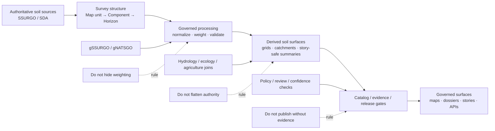

<!-- [KFM_META_BLOCK_V2]
doc_id: kfm://doc/NEEDS-VERIFICATION
title: Kansas Frontier Matrix — Soils
type: standard
version: v1
status: draft
owners: [@bartytime4life, NEEDS VERIFICATION]
created: 2026-04-01
updated: 2026-04-01
policy_label: public
related: [
  "../README.md",
  "../../pipelines/ssurgo_to_catchment.md",
  "../../governance/ROOT_GOVERNANCE.md",
  "../../governance/ETHICS.md",
  "NEEDS VERIFICATION: contracts and policy paths for soil-derived surfaces"
]
tags: [kfm, domains, soils, ssurgo, gssurgo, gnatsgo, agriculture, hydrology, provenance]
notes: [
  "Target path requested by user: docs/domains/soils/README.md.",
  "Mounted repo evidence confirms a domains root README and a soil-related pipeline document, but does not confirm this exact lane path as already present.",
  "This page preserves KFM doctrine: authoritative soil truth stays upstream; derived soil layers remain subordinate, rebuildable, and evidence-linked."
]
[/KFM_META_BLOCK_V2] -->

# Kansas Frontier Matrix — Soils

Domain README for soil truth, soil-derived surfaces, and the publication burden that follows when KFM turns authoritative soil records into usable Kansas context.

| Status | Owners | Quick fit |
|---|---|---|
|     | @bartytime4life, NEEDS VERIFICATION | Lane README for authoritative soils, derivative rollups, hydrologic coupling, and public-safe soil publication posture |

**Purpose:** define what belongs in the KFM soils lane, which source roles must remain distinct, and how soil outputs stay auditable rather than quietly becoming sovereign convenience layers.

**Repo fit:** target file requested as `docs/domains/soils/README.md`; lane-level companion to [`../README.md`](../README.md).  
**Accepted inputs:** authoritative soil survey records, soil geometry and attributes, rebuildable soil derivatives, evidence-linked overlay methods, and soil publication/review notes.  
**Exclusions:** this file is not a source dump, not a contract registry, not a raw SSURGO mirror, and not a license to flatten authoritative and modeled soil layers together.

**Quick jumps:** [Scope](#scope) · [Repo fit](#repo-fit) · [Accepted inputs](#accepted-inputs) · [Exclusions](#exclusions) · [Directory tree](#directory-tree) · [Quickstart](#quickstart) · [Usage](#usage) · [Diagram](#diagram) · [Tables](#tables) · [Task list](#task-list) · [FAQ](#faq) · [Appendix](#appendix)

> [!IMPORTANT]
> **Authority rule:** SSURGO-class soil records are the upstream soil authority. KFM soil summaries, overlays, and raster products remain **derived** unless explicitly promoted by doctrine and release controls.

> [!NOTE]
> **Path posture:** the user requested `docs/domains/soils/README.md`. The mounted repo evidence visible in this session confirms a domains root README and soil-related pipeline material, but does **not** confirm that this exact lane path already exists. Treat the path as **PROPOSED / NEEDS VERIFICATION** until the live tree is checked.

---

## Scope

The soils lane covers the part of KFM where soil records stop being “just GIS data” and become governed evidence about land capability, runoff behavior, erosion exposure, water holding, infiltration, and soil context for Kansas places, corridors, watersheds, agriculture, ecology, and story surfaces.

This lane exists to keep several distinctions visible:

- **authoritative soil truth** versus **rebuildable derived summaries**
- **vector survey units** versus **gridded convenience products**
- **observed / surveyed classifications** versus **modeled or assimilated soil-adjacent surfaces**
- **public-safe summaries** versus **operator/research detail**
- **soil context** versus **soil-driven inference that outruns the evidence**

### Truth posture used in this README

| Label | Meaning here |
|---|---|
| **CONFIRMED** | Supported by repo-visible KFM documentation available in this session |
| **INFERRED** | Strongly implied by KFM doctrine and visible docs, but not directly verified as live implementation |
| **PROPOSED** | Recommended lane packaging or documentation structure added to make this file merge-ready |
| **UNKNOWN** | Not verified strongly enough in this session |
| **NEEDS VERIFICATION** | Concrete path, owner, contract, workflow, or enforcement detail requiring live repo confirmation |

### What this lane is for

This lane should help maintainers answer these questions quickly:

1. What counts as authoritative soil truth in KFM?
2. What kinds of soil derivatives are allowed?
3. What must stay visible when soil data is published or joined to other lanes?
4. What should be generalized, withheld, downgraded, or blocked before release?

[Back to top](#kansas-frontier-matrix--soils)

---

## Repo fit

| Item | Value |
|---|---|
| **Target path for this file** | `docs/domains/soils/README.md` |
| **Role** | Lane README for soil authority, derivative classes, publication burden, and cross-lane coupling |
| **Upstream** | [`../README.md`](../README.md) |
| **Related soil pipeline evidence** | [`../../pipelines/ssurgo_to_catchment.md`](../../pipelines/ssurgo_to_catchment.md) |
| **Governance anchors** | `../../governance/ROOT_GOVERNANCE.md` · `../../governance/ETHICS.md` *(paths NEEDS VERIFICATION in live tree)* |
| **Expected downstream docs** | `./sources/README.md`, `./derived/README.md`, `./validation/README.md`, `./publication/README.md` *(PROPOSED / NEEDS VERIFICATION)* |
| **Mounted subtree reality** | **UNKNOWN** for this exact lane path in the current session |

> [!TIP]
> The strongest visible repo evidence says KFM already treats **agriculture / soils** as a distinct domain burden and already carries a soil-derived pipeline document. This page should preserve that burden even if the final tree ends up under a different normalized lane name.

[Back to top](#kansas-frontier-matrix--soils)

---

## Accepted inputs

The following belong in or immediately beneath the soils lane:

- authoritative soil survey source descriptions
- soil map-unit, component, and horizon semantics
- gridded soil convenience products when labeled as derived
- rebuildable overlay and rollup methods
- soil interpretation notes tied to evidence and source lineage
- validation rules for coverage, weighting, and plausibility
- publication posture for soil summaries, catchment rollups, and map-facing products
- cross-lane coupling notes for hydrology, agriculture, ecology, hazards, and settlement/service geography

### Typical source families

| Source family | Role in lane | Typical use | Truth posture |
|---|---|---|---|
| **SSURGO** | authoritative direct soil survey record | map units, components, horizons, interpretations | **CONFIRMED** |
| **gSSURGO** | gridded derivative of SSURGO-class content | raster workflows, statewide analytical stacks | **CONFIRMED** |
| **gNATSGO** | national gridded fallback / continuity surface | gap-filling at broader scale where applicable | **INFERRED** |
| **Soil Data Access (SDA)** | authoritative query/access surface | extraction and reproducible SQL-driven acquisition | **INFERRED** |
| **Kansas/state mirrors or portals** | discovery and access convenience | easier lookup and distribution | **INFERRED** |
| **Derived KFM overlays** | subordinate, rebuildable interpretation layers | catchment soil summaries, hydrologic joins, story cards | **CONFIRMED** for class, **NEEDS VERIFICATION** for exact implementations |

### Typical soil-derived outputs

- map-unit-aware summaries
- catchment- or watershed-level rollups
- dominant hydrologic soil group surfaces
- area-weighted erosion or infiltration indicators
- public-safe soil context for places and corridors
- evidence-linked story or dossier summaries
- review-bearing analytical rasters

[Back to top](#kansas-frontier-matrix--soils)

---

## Exclusions

This README should not become a warehouse for everything adjacent to soils.

| Excluded material | Why it does not belong here | Put it in instead |
|---|---|---|
| Raw SSURGO dumps, geodatabases, and extracted tables | This README explains burden; it is not a landed-data surface | RAW / WORK / PROCESSED data zones |
| Machine-checkable contracts and schemas | Lane docs should point to them, not impersonate them | `contracts/` / `schemas/` *(NEEDS VERIFICATION)* |
| Policy enforcement bundles | Prose explains burden; policy artifacts enforce it | `policy/` *(NEEDS VERIFICATION)* |
| One-off notebooks or ad hoc GIS edits | They weaken trust unless documented and governed | analysis/notebook surfaces with explicit review state |
| Quietly smoothed or enriched soil surfaces with no lineage | Derived convenience cannot outrun provenance | governed derived pipelines with EvidenceRef / EvidenceBundle |
| Unlabeled modeled soil-adjacent predictions | They blur surveyed truth and model output | separate modeled lane/docs with explicit labels |
| Public claims that imply soil certainty beyond support | Soil outputs are bounded by support, coverage, and method | downstream story/dossier surfaces with visible uncertainty |

> [!WARNING]
> Do not let gridded convenience products, dominant-class shortcuts, or smoothed overlays silently replace the authoritative map-unit / component / horizon structure they came from.

[Back to top](#kansas-frontier-matrix--soils)

---

## Directory tree

### Current-session path certainty

The live repo confirms a domains root README and a soil-related pipeline doc, but does **not** confirm the exact local subtree for a soils lane in this session. The tree below is therefore a **PROPOSED** normalized shape.

### Recommended normalized subtree (`PROPOSED / NEEDS VERIFICATION`)

```text
docs/
└── domains/
    ├── README.md
    └── soils/
        ├── README.md
        ├── sources/
        │   └── README.md
        ├── derived/
        │   └── README.md
        ├── validation/
        │   └── README.md
        ├── publication/
        │   └── README.md
        └── appendices/
            └── source-role-matrix.md
```

### Adjacency worth preserving

```text
docs/
├── domains/
│   └── soils/
│       └── README.md
└── pipelines/
    └── ssurgo_to_catchment.md
```

### Normalization rule

If the live repo already locates soils under a broader agriculture lane, preserve working links first. Normalize only after checking what the repo already admits as canonical.

[Back to top](#kansas-frontier-matrix--soils)

---

## Quickstart

Use this sequence when creating or revising soil-lane documentation.

1. Start with the **authority split**: what is authoritative, what is derived, what is modeled, and what is merely an access mirror.
2. Declare the **grain** of soil truth explicitly: map unit, component, horizon, grid cell, catchment, or other reporting unit.
3. State how weighting works before showing any rollup or summary.
4. Preserve the distinction between **surveyed structure** and **publication convenience**.
5. Name the lane’s public-safe default and the conditions that trigger downgrade, generalization, or block.
6. Link out to pipeline, contract, policy, and evidence surfaces rather than duplicating them.

### Minimal lane stub

```md
# Kansas Frontier Matrix — Soils

One-line purpose for the soil lane.

> [!NOTE]
> **Lane posture:** authoritative upstream soil truth · derived downstream rollups · visible uncertainty and provenance

## Purpose
What the lane covers and what it does not.

## Source roles
- authoritative soil survey record
- gridded derivative
- access/query surface
- discovery mirror
- KFM derived overlay
- modeled soil-adjacent surface

## Representative sources
- SSURGO
- gSSURGO
- gNATSGO
- SDA
- Kansas/state soil access portals

## Publication posture
- default public-safe form:
- restricted / downgraded cases:
- modeled-vs-surveyed disclosure rule:
- review triggers:

## Cross-lane couplings
- hydrology:
- agriculture:
- hazards:
- ecology:
- dossier/story relevance:

## Verification and release notes
- validation gates:
- evidence requirements:
- open NEEDS VERIFICATION items:
```

### Ready-before-merge check

A soils README is not ready just because it explains what soil data is. It is ready when it makes these things hard to forget:

- soil truth has structure
- derived summaries are subordinate
- weighting choices are load-bearing
- support and coverage must remain visible
- public surfaces should expose evidence, not just conclusions

[Back to top](#kansas-frontier-matrix--soils)

---

## Usage

### Use this README as a burden document, not a soil encyclopedia

This page should stay small enough to orient maintainers quickly. Method details, code, schemas, and contracts belong in their own governed locations.

### Preserve the soil hierarchy

For KFM purposes, the key soil hierarchy is:

```text
Map unit → Component → Horizon
```

That hierarchy should remain visible whenever a derivative is built. A grid, catchment summary, or dominant class is useful only if its upstream structure and weighting logic remain inspectable.

### Keep reporting units honest

Soil truth and user-facing reporting units are often different things.

- soil survey truth may live at map-unit / component / horizon scale
- maps may want statewide grids
- hydrology may want catchment summaries
- place dossiers may want place-level summaries
- stories may want one safe sentence and an evidence drawer

Those are all legitimate, but they are not the same object and should not be documented as if they were.

### Keep modeled and surveyed layers distinct

A lane doc should make it impossible to confuse:

- surveyed soil classes
- gridded survey derivatives
- inferred or predicted soil-adjacent surfaces
- analytical convenience layers
- narrative interpretations downstream of those layers

[Back to top](#kansas-frontier-matrix--soils)

---

## Diagram



[Back to top](#kansas-frontier-matrix--soils)

---

## Tables

### Soil source-role matrix

| Source role | What it means | Typical examples | Handling rule |
|---|---|---|---|
| **Authoritative soil survey record** | Primary soil truth recorded and maintained by the authoritative survey program | SSURGO map units, components, horizons, interpretations | Preserve identifiers, survey semantics, and grain; treat as baseline when derivatives differ |
| **Access/query surface** | A trustworthy service for obtaining or filtering authoritative soil content | SDA | Keep extraction logic reproducible; preserve query provenance |
| **Gridded derivative** | Rasterized or gridded convenience representation of soil content | gSSURGO, gNATSGO | Keep visibly derived; do not let cell summaries impersonate upstream survey structure |
| **Discovery mirror / portal** | Easier access surface, often useful for distribution rather than sovereignty | Kansas/state soil portals | Keep origin source visible; do not promote mirror metadata over authoritative identity |
| **KFM derived overlay** | Soil product rebuilt for another reporting unit or user-facing surface | catchment soil summaries, place cards, story-safe summaries | Must carry weighting, coverage, confidence, and evidence |
| **Modeled soil-adjacent surface** | Predicted or assimilated product related to soil processes but not the soil survey itself | erosion models, soil-moisture proxies, suitability surfaces | Keep clearly modeled; never flatten into surveyed truth |

### Common soil reporting units and burdens

| Reporting unit | Why it is used | Typical burden |
|---|---|---|
| **Map unit** | Closest common survey geometry used for many soil publications | Preserve original identifiers and interpretations |
| **Component** | Needed when map units contain mixed soils | Weight explicitly; do not silently use dominant component without saying so |
| **Horizon** | Needed for depth-sensitive properties | Preserve depth intervals; avoid collapsing too early |
| **Grid cell** | Useful for raster stacks and modeling | Must be labeled derived and versioned |
| **Catchment / watershed** | Useful for hydrology and runoff reasoning | Area weighting, coverage, and cross-source alignment are load-bearing |
| **Place / corridor / county summary** | Useful for public-safe storytelling and overview | Must avoid implying uniform soil conditions across heterogeneous areas |

### Cross-lane couplings that matter early

| Coupling | Why it matters |
|---|---|
| **Soils ↔ hydrology** | infiltration, runoff, drainage, flood response, and catchment summaries depend on soil properties |
| **Soils ↔ agriculture** | cropping systems, erosion exposure, irrigation context, and land capability often rely on soil classes and water-holding behavior |
| **Soils ↔ hazards** | drought, erosion, wildfire susceptibility context, and post-event recovery are soil-sensitive |
| **Soils ↔ ecology** | habitat structure, vegetation support, restoration context, and biodiversity patterns often intersect soil conditions |
| **Soils ↔ settlement / services** | construction suitability, land-use constraints, and service-area planning may depend on soil context |
| **Soils ↔ dossiers / stories** | users often need one interpretable summary with drill-through evidence rather than a full soil taxonomy dump |

### Publication caution registry

| Risk | Why it matters | Safer posture |
|---|---|---|
| **Dominant-class oversimplification** | one class can hide mixed soil reality | expose dominance share and mixed cases |
| **Coverage silence** | missing or partial coverage can mislead users | publish coverage share and confidence |
| **Early flattening of horizons/components** | depth and mixture structure disappear too soon | delay flattening until method requires it |
| **Model creep** | predictive surfaces start to look like authoritative survey truth | label modeled outputs explicitly and keep lineage visible |
| **Unstated weighting** | users cannot inspect how summaries were built | expose weights, thresholds, and rollup logic |

[Back to top](#kansas-frontier-matrix--soils)

---

## Task list

Definition of done for this lane:

- [ ] The README clearly separates authoritative soil sources from derived and modeled surfaces
- [ ] Survey structure (`map unit → component → horizon`) stays visible where it matters
- [ ] Weighting and coverage requirements are stated before publication examples
- [ ] Soil reporting units are not flattened into one generic “soil layer” concept
- [ ] Public-safe default outputs are named explicitly
- [ ] Cross-lane hydrology/agriculture/ecology couplings are called out where they change burden
- [ ] Repo paths, owners, and policy/contract anchors that are not directly verified remain marked `NEEDS VERIFICATION`
- [ ] Derived soil surfaces are described as rebuildable and evidence-linked, not sovereign truth
- [ ] At least one relative link to adjacent domain or pipeline docs is preserved

[Back to top](#kansas-frontier-matrix--soils)

---

## FAQ

### Is this lane the source of truth for soil data?

No. This is the source of truth for **soil-lane documentation and burden** in this area. Authoritative soil truth remains upstream in admitted source systems and their governed extracts.

### Why keep repeating that derivatives are subordinate?

Because soil users often consume summaries, grids, and joined products more often than the survey structure they came from. KFM doctrine requires that the convenience layer never quietly outrun the evidence.

### Are gSSURGO and gNATSGO allowed here?

Yes, but as **derived/gridded soil products**, not as replacements for the authoritative survey structure they summarize or bridge.

### Why is hydrology mentioned so often in a soils lane?

Because one of the strongest visible repo examples is a soil-to-catchment overlay pipeline, and because runoff, drainage, infiltration, and watershed reasoning are major places where soil derivatives become operationally useful.

### Does this lane include agricultural context too?

Yes, but this page stays soil-first. If the live repo standardizes the lane under a broader agriculture/soils name, preserve that local truth and adapt the pathing rather than forcing a prettier taxonomy.

### Should this lane hold exact field names and schema definitions?

Not by default. It should point to them once verified. This README should preserve meaning and burden, not become a shadow contract system.

[Back to top](#kansas-frontier-matrix--soils)

---

## Appendix

<details>
<summary><strong>Open verification backlog</strong></summary>

### Path and ownership

- Confirm whether `docs/domains/soils/README.md` already exists in the live repo
- Confirm whether soils are currently documented under a broader agriculture lane instead
- Confirm owners, policy label, and canonical doc ID
- Confirm whether `../../governance/ROOT_GOVERNANCE.md` and `../../governance/ETHICS.md` exist exactly as written

### Adjacent artifacts

- Confirm contract/schema locations for soil-derived surfaces
- Confirm policy bundle locations for soil publication or confidence gates
- Confirm whether a lane-level validation README or registry already exists
- Confirm whether soil-specific analysis notebooks or derived dataset docs already live elsewhere in the tree

### Pipeline alignment

- Reconcile this lane README with `../../pipelines/ssurgo_to_catchment.md`
- Confirm whether additional soil-derived pipelines exist
- Confirm whether EvidenceRef / EvidenceBundle contract paths are already documented in-repo

</details>

<details>
<summary><strong>Suggested publication defaults</strong></summary>

### Public-safe by default

- generalized soil context for a place, catchment, or corridor
- dominant or mixed soil group with share/confidence
- area-weighted summary values with clear evidence access
- interpreted but bounded prose such as “soil context suggests…”

### Review-bearing or downgrade-prone cases

- weak dominance or mixed classes hidden by simplification
- incomplete coverage not surfaced clearly
- soil-derived suitability claims that imply more certainty than support allows
- modeled erosion / moisture / productivity outputs presented as survey truth
- joins that materially change meaning across hydrology, ecology, or agricultural lanes

</details>

<details>
<summary><strong>Maintainer reminder</strong></summary>

Whenever a new soil derivative, grid, overlay, or story card is added, update this README or its child pages in the same change so the lane’s authority split and publication burden remain visible.

</details>

[Back to top](#kansas-frontier-matrix--soils)
