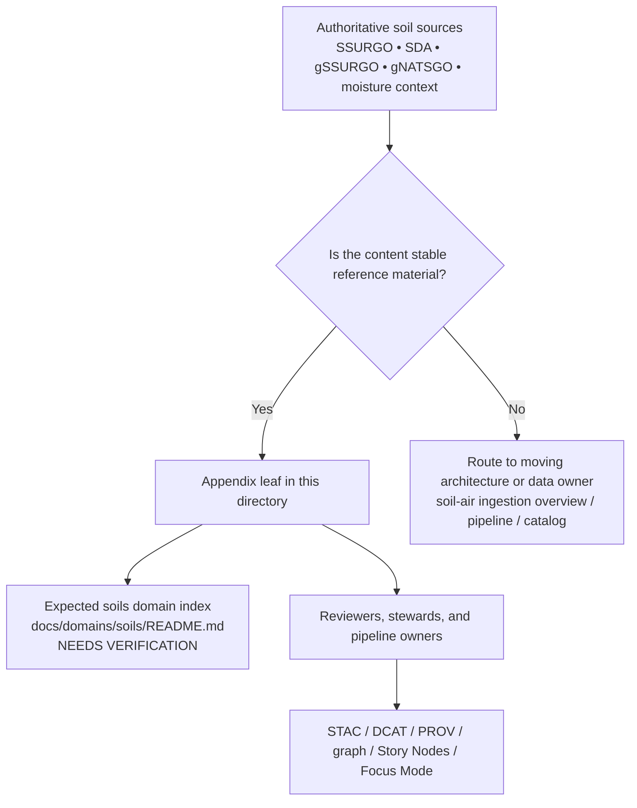

<!-- [KFM_META_BLOCK_V2]
doc_id: kfm://doc/NEEDS-VERIFICATION
title: Soils Appendices
type: standard
version: v1
status: draft
owners: NEEDS VERIFICATION
created: YYYY-MM-DD
updated: YYYY-MM-DD
policy_label: NEEDS-VERIFICATION
related: [../../../events/environmental/soil-air-ingestion-overview.md, ../../hydrology/README.md]
tags: [kfm, soils, appendices, ssurgo, sda, gssurgo]
notes: [Mounted repo inventory, owners, dates, and adjacent soils-parent path need direct verification before commit.]
[/KFM_META_BLOCK_V2] -->

# Soils Appendices

Reference lane for stable soil-domain supporting material: canonical keys, source notes, query patterns, validation tables, and other appendices that should not crowd the main soils narrative.

> [!NOTE]
> **Status:** experimental  
> **Owners:** NEEDS VERIFICATION  
>     
> **Quick jumps:** [Scope](#scope) · [Repo fit](#repo-fit) · [Accepted inputs](#accepted-inputs) · [Exclusions](#exclusions) · [Directory tree](#directory-tree) · [Quickstart](#quickstart) · [Usage](#usage) · [Diagram](#diagram) · [Tables](#tables) · [Task list](#task-list--definition-of-done) · [FAQ](#faq) · [Appendix](#appendix)  
> **Repo fit:** `docs/domains/soils/appendices/` → expected upstream: `docs/domains/soils/README.md` (**NEEDS VERIFICATION**) · confirmed adjacent doc: [`../../../events/environmental/soil-air-ingestion-overview.md`](../../../events/environmental/soil-air-ingestion-overview.md) · confirmed adjacent domain-pattern reference: [`../../hydrology/README.md`](../../hydrology/README.md) · downstream: appendix leaves in this directory

> [!IMPORTANT]
> This directory should function as an **appendix lane**, not as the main soils domain index, not as a second pipeline manual, and not as a raw data drop. Keep pages stable, source-aware, and easy to route back into the owning domain, pipeline, catalog, or governance surface when the material stops being appendix-like.

> [!WARNING]
> Current evidence for this lane is still **document-mediated**. The current session did **not** directly inspect a mounted KFM repository tree, workflow inventory, schema registry, or this directory’s leaf files. Treat any file inventory beyond the snapshot below as **NEEDS VERIFICATION** until the mounted repo is directly checked.

## Scope

This directory holds appendix-style soil references that are useful across multiple KFM surfaces but too low-level, table-heavy, or stable-reference-oriented to live inside the main narrative docs.

Place material here when it is primarily:

- a stable identifier, code, or join-key reference for soil entities
- a source-facing appendix for SSURGO, SDA, gSSURGO, gNATSGO, or soil-moisture context
- a deterministic query, chunking, or validation reference that other docs point to
- a glossary, field-note, or release-caveat appendix that clarifies soil semantics without owning the full pipeline story
- a routing aid that keeps canonical soil facts, cautions, and lookup tables close at hand

This lane should preserve KFM’s soils burden: keep **modeled** and **observed** layers distinct, keep provenance visible, and avoid flattening soil units into generic land-cover prose.

### Status vocabulary used in this directory

| Label | Use here |
| --- | --- |
| **CONFIRMED** | Directly supported by visible KFM corpus material or directly verified neighboring docs |
| **INFERRED** | Small structural completion that fits KFM doctrine but is not directly proven in mounted repo state |
| **PROPOSED** | Recommended appendix structure, naming, or next step |
| **UNKNOWN** | Not verified strongly enough in the current session |
| **NEEDS VERIFICATION** | Review flag for ownership, inventory, dates, mounted files, or behavior before commit |

## Repo fit

This README is a routing surface for appendix material, not the authoritative owner of the entire soils lane.

| Path | Role | Relationship |
| --- | --- | --- |
| `docs/domains/soils/appendices/README.md` | this file | directory README for soils appendix material |
| `docs/domains/soils/README.md` | expected parent soils domain index | **NEEDS VERIFICATION** in current evidence |
| `docs/events/environmental/soil-air-ingestion-overview.md` | active soil/air ingestion overview | confirmed adjacent doc for moving ETL behavior, graph model, and STAC/DCAT/PROV flow |
| `docs/data/soil/README.md` | expected dataset-governance surface | explicitly named as future in visible evidence; **NEEDS VERIFICATION** |
| `src/pipelines/environmental/soil_ingest_sda.py` | implementation-facing soil ingestion surface | path is named in repo-grounded notes but not directly inspected in mounted repo |
| `configs/pipelines/environmental/soil-sda-v11.yaml` | chunk-plan and soil schema config | mentioned in repo-grounded notes; **NEEDS VERIFICATION** until mounted |

### Current verified snapshot

The current evidence visible to this README is intentionally narrow:

| Item | Verified state | Why it matters here |
| --- | --- | --- |
| `docs/events/environmental/soil-air-ingestion-overview.md` | document-mediated, confirmed path mention | proves an active soil ingestion overview exists in corpus-backed repo notes |
| `docs/domains/hydrology/README.md` | document-mediated, confirmed path mention | gives a nearby KFM domain-index pattern and routing style |
| `docs/data/soil/README.md` | explicitly future | confirms a soil dataset-governance lane is expected but not yet verified as mounted |
| `src/pipelines/environmental/soil_ingest_sda.py` | named, not directly inspected | indicates soil ETL is expected elsewhere, not owned by this appendix lane |
| this directory’s leaf inventory beyond `README.md` | unknown | do not imply mounted appendix leaves until directly inspected |

That means this README should prioritize **lane boundaries, routing, and appendix conventions** over claims about mature mounted inventory.

## Accepted inputs

Place material here when it is primarily a **soil appendix reference** such as:

- canonical identifier notes for `areasymbol`, `MUKEY`, `COKEY`, `CHKEY`, and related join logic
- source and release notes for **SSURGO**, **Soil Data Access (SDA)**, **gSSURGO**, **gNATSGO**, and soil-moisture context sources
- stable query patterns, chunk-plan notes, and response-shape cautions for SDA
- reference tables for hydrologic group, hydric flags, texture terms, or map-unit/component/horizon semantics
- validation appendices such as component-percent checks, range rules, schema notes, or diff conventions
- provenance-facing notes about `spec_hash`, release provenance, source ETag/size snapshots, and watcher receipts
- glossary or interpretation-caution pages that help Story Nodes, Focus Mode, or reviewers avoid semantic drift

## Exclusions

Do **not** place the following here:

- main soils-domain narrative or lane-wide architecture → use the owning soils domain index when that parent path is verified
- moving ETL behavior, graph-write flow, or soil/air integration architecture → [`../../../events/environmental/soil-air-ingestion-overview.md`](../../../events/environmental/soil-air-ingestion-overview.md)
- raw SSURGO exports, GeoPackages, rasters, or large lookup dumps → data lanes, not documentation lanes
- unreviewed release claims about live watchers, CI gates, or mounted connector coverage → keep them **UNKNOWN** until repo/runtime proof exists
- Story Node prose, Focus narratives, or public interpretation copy → keep those in the owning narrative or product surfaces
- cross-domain guidance that is mainly hydrology, air, or surficial-geology integration rather than soil appendix reference → route to the owning lane or a dedicated integration contract
- copied upstream manuals or oversized source-text dumps → summarize, cite, and route instead

## Directory tree

```text
docs/
└── domains/
    └── soils/
        └── appendices/
            └── README.md
```

Additional appendix leaves in this directory are **NEEDS VERIFICATION** in the current evidence set.

## Quickstart

When adding a new soils appendix page, start from a narrow, reference-first shape:

```md
# <Appendix title>

One-line purpose for the appendix leaf.

## What this appendix is
- appendix type (keys, source notes, query patterns, glossary, QA rules, release caveats)
- why this belongs in `appendices/`
- what it intentionally does not own

## Source basis
- authoritative source family
- exact schema/table/source edition if relevant
- any visible release or refresh caveat

## Canonical terms / keys / tables
- stable keys
- required joins
- human-facing labels vs canonical identifiers

## Practical usage
- where this appendix is expected to be used
- adjacent docs or pipeline surfaces
- any limits on interpretation

## Known cautions
- modeled vs observed distinction
- release lag or refresh caveat
- uncertainty, rights, or sensitivity note

## Local status notes
- CONFIRMED:
- INFERRED:
- PROPOSED:
- UNKNOWN / NEEDS VERIFICATION:
```

## Usage

### Add an appendix leaf

1. Create a narrow, reference-oriented page in this directory.
2. Keep it centered on stable soil support material, not the full ingestion or publication lifecycle.
3. Tie each consequential claim to an authoritative source family or clearly mark it as **INFERRED** or **PROPOSED**.
4. Separate human-facing labels from canonical identifiers wherever joins matter.
5. Link outward to the owning overview when behavior becomes operational rather than appendix-like.

### Update this README

Update this file when any of the following changes:

- the mounted appendix inventory is directly verified
- the soils parent README or data-governance README becomes directly visible
- a stable naming pattern for appendix leaves is agreed
- adjacent soil architecture docs change the routing boundary
- the lane grows enough to justify a registry table, glossary index, or appendix family matrix

## Diagram



## Tables

### Appendix leaf classes that fit this lane

| Appendix class | Typical contents | Why it belongs here | Keep out of this lane when… |
| --- | --- | --- | --- |
| Canonical IDs & joins | `areasymbol`, `MUKEY`, `COKEY`, `CHKEY`, map-unit/component/horizon joins | Stable cross-document reference used by ETL, graph, and review | the page becomes a full schema contract or implementation spec |
| Source & release notes | SSURGO refresh cadence, SDA maintenance caveats, gSSURGO lag notes, hydric refresh cautions | Helps reviewers understand source timing and provenance | the page turns into a live watcher or release-status dashboard |
| Query patterns & chunking | canonical SDA query shapes, partition rules, chunk-plan cautions | Useful operator reference without owning the whole ETL story | the page starts describing the whole run lifecycle or CI flow |
| QA / diff rules | `component_pct` checks, range guards, `spec_hash` expectations, change classes | Keeps review-bearing rules close to source semantics | the page becomes the actual policy bundle or CI implementation |
| Glossary / code tables | hydrologic groups, texture terms, label notes, observed-vs-modeled cautions | Reduces terminology drift across Story, Focus, and review surfaces | the page drifts into tutorial prose or large copied source text |

### Canonical soil keys that deserve stable appendix treatment

| Key / field | Use here | Caution |
| --- | --- | --- |
| `areasymbol` | soil survey area identity | survey geography is not the same thing as map-unit identity |
| `MUKEY` | primary join between geometry and tabular map-unit records | keep as the canonical map-unit key; do not replace with human-facing labels |
| `MUSYM` / `MUNAME` | human-facing symbol and name | useful for readers, but not canonical identity |
| `COKEY` | component-level identity inside a map unit | preserve alongside `MUKEY`; component summaries can hide variation if over-smoothed |
| `CHKEY` | horizon-level identity | only use when horizon-level detail is actually needed; do not collapse away without saying so |

### Minimum fields for source-focused appendix leaves

| Field family | Minimum content |
| --- | --- |
| Identity | source title, provider/steward, canonical source family, and the appendix’s subject |
| Access & cadence | access mode, refresh or maintenance notes, rate/size assumptions where relevant |
| Semantics | grain/support, units, resolution distinctions, observed-vs-modeled notes when applicable |
| Rights & sensitivity | license/terms, attribution duties, location-precision or stewardship cautions |
| Validation | key join rules, schema notes, range checks, quarantine or caution triggers |
| Lineage | provenance expectation, release/version note, and any known watcher or receipt linkage |

## Task list / definition of done

- [ ] Meta block placeholders are replaced or consciously retained with review notes
- [ ] Mounted appendix inventory is directly verified before any extra leaf paths are claimed as present
- [ ] Each appendix leaf stays appendix-scoped and does not become a second pipeline manual
- [ ] Soil pages preserve `MUKEY` / `COKEY` / `CHKEY` semantics where they matter
- [ ] `SSURGO`, `STATSGO`, `gSSURGO`, and `gNATSGO` are not silently blended together
- [ ] Observed, modeled, and derived soil-context material stay visibly distinct
- [ ] Release-cadence or hydric-change cautions are dated and source-aware
- [ ] Any QA, diff, or `spec_hash` rules are written as review-bearing reference, not as unverified runtime fact
- [ ] Raw dumps, oversized copied source text, and unsupported live-status claims stay out of this lane
- [ ] Long reference material remains collapsible and easy to scan

## FAQ

### Why keep a separate `appendices/` lane under soils?

Because soils work mixes stable reference material with moving ETL, data products, and public interpretation. Keeping appendix material here prevents the main narrative docs from turning into a wall of code tables, join-key notes, and release caveats.

### Should SDA SQL or chunk-plan notes live here?

Yes—when they are being preserved as stable reference patterns. No—when the page is really about active pipeline behavior, runtime coverage, or CI orchestration.

### Should soil-moisture context live here?

Only the appendix-style part of it: source notes, variable meanings, grid/product cautions, and join or aggregation reminders. Live ingest behavior or anomaly workflows belong with the owning pipeline or environmental overview.

### What about surficial geology?

If the material is truly joint soil–surficial reference and stable enough to behave like an appendix, it can be routed here or to a dedicated cross-domain contract. If it becomes its own lane with independent burden, do not bury it in soils appendices.

### Can this directory contain large field dictionaries copied from upstream sources?

Prefer summarized reference tables plus routing notes. Do not turn this directory into a mirrored archive of upstream manuals or bulky raw schema dumps.

## Appendix

<details>
<summary><strong>Suggested future additions once mounted repo verification is available</strong></summary>

### Candidate appendix leaves (PROPOSED, not verified as present)

- `canonical-ids-and-joins.md`
- `source-registry-and-refresh-notes.md`
- `sda-query-patterns.md`
- `qa-thresholds-and-diff-rules.md`
- `soil-moisture-context-sources.md`
- `release-caveats-and-hydric-notes.md`

### Suggested naming pattern

Prefer one stable pattern and keep it repo-wide:

```text
canonical-ids-and-joins.md
source-refresh-notes.md
query-patterns.md
qa-and-diff-rules.md
glossary.md
```

### Review prompts for maintainers

- Is the page still appendix-scoped?
- Does it preserve canonical keys and source distinctions?
- Does it imply live watcher or pipeline coverage that is not actually verified?
- Should any section move to the soil ingestion overview or a future soils parent README?
- Are observed, modeled, and derived materials still clearly separated?
- Does the page need a correction or refresh note because a source changed?

</details>

[Back to top](#soils-appendices)
