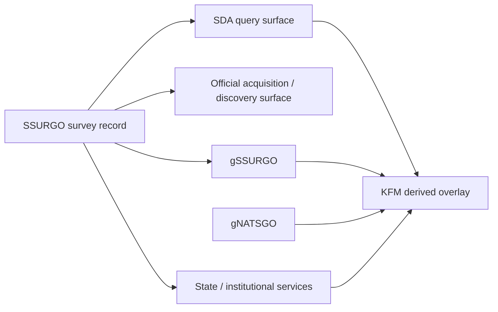

<!-- [KFM_META_BLOCK_V2]
doc_id: kfm://doc/NEEDS-VERIFICATION
title: Kansas Frontier Matrix — Soils — Source Role Matrix
type: standard
version: v1
status: draft
owners: [@bartytime4life, NEEDS VERIFICATION]
created: 2026-04-01
updated: 2026-04-11
policy_label: public
related: [
  "../README.md",
  "../sources/README.md",
  "../../../pipelines/ssurgo_to_catchment.md"
]
tags: [kfm, soils, appendix, source-role-matrix, provenance]
notes: [
  "Requested as part of the user-directed soils module build.",
  "Appendix page is meant to keep source-role distinctions compact and reusable.",
  "Revised against the PDF-visible KFM corpus; neighboring repo files remain NEEDS VERIFICATION in this session."
]
[/KFM_META_BLOCK_V2] -->

# Kansas Frontier Matrix — Soils — Source Role Matrix

Compact appendix for keeping soil-source authority, access, and derivation legible across the soils lane.

Related lane docs: [`../README.md`](../README.md) · [`../sources/README.md`](../sources/README.md) · [`../../../pipelines/ssurgo_to_catchment.md`](../../../pipelines/ssurgo_to_catchment.md)

> [!NOTE]
> Use this matrix when writing soil source descriptors, ingest receipts, dataset versions, catalog metadata, and Evidence Drawer labels. It is a classification aid, not a schema or publication-policy page.

## Reading rule

- Keep **authoritative survey record**, **query/access surface**, **mirror/discovery surface**, and **derived projection** visibly distinct.
- When a downstream product collapses **map unit → component → horizon** structure, say so explicitly.
- If a surface is convenient but not origin-authoritative, label it as such instead of smoothing the distinction away.

## Source role matrix

| Source family | Role in the soils lane | Truth posture | Typical grain | Safe downstream use | Must not be mistaken for |
|---|---|---|---|---|---|
| **SSURGO** | Authoritative soil survey record | **CONFIRMED** authoritative input | map unit → component → horizon | canonical soil-baseline work, component- and horizon-aware derivation, authoritative evidence references | statewide convenience grid, portal mirror, or live query façade |
| **SDA** | Query and access surface over SSURGO tables | **CONFIRMED** access surface; not sovereign by itself | query result set over source tables | reproducible extracts, targeted refresh, pipeline automation, query lineage capture | an independent dataset version or authoritative release in its own right |
| **Official acquisition / discovery surface** | Download, discovery, or metadata entrypoint | **CONFIRMED** acquisition/discovery family; exact host behavior varies | varies | finding releases, AOI downloads, metadata lookup, cadence tracking, service exposure | the origin authority unless the source descriptor explicitly says it is serving origin content directly |
| **gSSURGO** | Gridded derivative counterpart to SSURGO | **CONFIRMED** gridded derivative / derived projection | raster cell + joined tables | statewide raster analysis, overlay stacking, model-ready convenience, map-facing summaries with derivation visible | raw survey structure or full map unit / component / horizon fidelity |
| **gNATSGO** | Broader seamless fallback grid | **CONFIRMED** fallback gridded derivative | raster cell + national/state tables | continuity, cross-state comparison, coarse statewide screening, gap-friendly national baselines | local high-fidelity survey truth or a drop-in substitute when SSURGO detail matters |
| **State / institutional soil services** | Local mirror, service layer, or localized derivative | **CONFIRMED** mirror/derivative family; provenance varies by host | varies | quick viewing, local cross-checks, hosted overlays, service integration | canonical origin or guaranteed statewide authoritative baseline |
| **KFM derived overlay** | Release-linked KFM soil product built from admitted sources | **PROPOSED** subordinate derived projection | reporting unit, catchment, tract, grid, tile, GeoParquet/COG/PMTiles asset | map, dossier, story, export, analysis, or model inputs after release closure and evidence linkage | replacement for the authoritative soil survey record |

## Dependency sketch

Arrows show dependency or derivation, not equal authority.

## Quick classification prompts

| If the thing in front of you… | Treat it as… | Why |
|---|---|---|
| preserves survey structure rooted in map units, components, and horizons | **SSURGO** | it is the closest admitted soil truth in the lane |
| is a live SQL/REST result over NRCS soil tables | **SDA** | it is an access/query surface over SSURGO, not a sovereign release |
| is a rasterized statewide or national soil grid | **gSSURGO** or **gNATSGO** | it is a derivative convenience surface that must keep derivation visible |
| is a hosted viewer, hub layer, or service copy | **official acquisition/discovery** or **state/institutional service** | it is useful for discovery or exposure, not automatic origin authority |
| was built by KFM from released soil scope | **KFM derived overlay** | it is a subordinate product that inherits release, evidence, and correction duties |

## Synchronization notes

- Keep this appendix aligned with the soils lane README and the sources child README.
- If branch-local terminology settles on different labels, update the row names but preserve the role distinctions.
- Do not expand this appendix into a schema page, source descriptor template, or publication-policy page.
