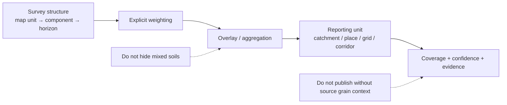

<!-- [KFM_META_BLOCK_V2]
doc_id: kfm://doc/NEEDS-VERIFICATION
title: Kansas Frontier Matrix — Soils — Derived
type: standard
version: v1
status: draft
owners: [@bartytime4life, NEEDS VERIFICATION]
created: 2026-04-01
updated: 2026-04-01
policy_label: public
related: [
  "../README.md",
  "../../../pipelines/ssurgo_to_catchment.md",
  "../validation/README.md",
  "../publication/README.md"
]
tags: [kfm, soils, derived, catchments, weighting, overlays, provenance]
notes: [
  "Requested as part of the user-directed soils module build.",
  "This subtree is PROPOSED; exact live pathing and owners NEED VERIFICATION.",
  "Derived soil surfaces remain subordinate to authoritative survey structure unless explicitly promoted."
]
[/KFM_META_BLOCK_V2] -->

# Kansas Frontier Matrix — Soils — Derived

Derived-surface README for rebuildable soil summaries, overlays, grids, and reporting-unit transformations built downstream of authoritative soil records.

| Status | Owners | Quick fit |
|---|---|---|
|     | @bartytime4life, NEEDS VERIFICATION | Rollups, overlays, grids, and soil summaries that must stay rebuildable, evidence-linked, and visibly subordinate |

**Purpose:** define what counts as a legitimate derived soil product and what must stay visible when soil truth is transformed into user-facing reporting units.  
**Repo fit:** child page under `docs/domains/soils/`; upstream [`../README.md`](../README.md).  
**Accepted inputs:** governed source-normalized soil records, explicit weighting methods, reporting-unit definitions, and provenance-carrying transformation notes.  
**Exclusions:** source acquisition logic, machine contracts, and low-level tests.

**Quick jumps:** [Scope](#scope) · [Repo fit](#repo-fit) · [Accepted inputs](#accepted-inputs) · [Exclusions](#exclusions) · [Directory tree](#directory-tree) · [Quickstart](#quickstart) · [Usage](#usage) · [Diagram](#diagram) · [Tables](#tables) · [Task list](#task-list) · [FAQ](#faq)

> [!IMPORTANT]
> **Derived rule:** no soil derivative gets to pretend its reporting unit is the same thing as the survey grain it came from.

## Scope

This page covers soil products built after acquisition and normalization, including:

- catchment summaries
- county or place-level rollups
- corridor summaries
- raster grids
- story-safe summaries
- evidence-linked map portrayals

It does not grant permission to flatten map units, components, and horizons into one vague “soil layer.”

## Repo fit

| Item | Value |
|---|---|
| Path | `docs/domains/soils/derived/README.md` |
| Path status | **PROPOSED / NEEDS VERIFICATION** |
| Upstream | [`../README.md`](../README.md) · [`../sources/README.md`](../sources/README.md) |
| Adjacent | [`../../../pipelines/ssurgo_to_catchment.md`](../../../pipelines/ssurgo_to_catchment.md) |
| Downstream neighbors | [`../validation/README.md`](../validation/README.md) · [`../publication/README.md`](../publication/README.md) |

## Accepted inputs

- normalized authoritative soil inputs
- explicit reporting-unit geometry
- weighting logic
- coverage and confidence fields
- evidence linkage
- derived metric definitions
- rebuild receipts and release notes

## Exclusions

| Exclusion | Why |
|---|---|
| Unweighted “dominant only” shortcuts presented as full truth | They hide mixture and support |
| Modeled outputs mislabeled as surveyed | They are a different class of object |
| Publication posture | That belongs in the publication child doc |
| Test harnesses / schemas | Those belong in machine-facing lanes |

## Directory tree

```text
docs/domains/soils/
├── derived/
│   └── README.md
├── validation/
│   └── README.md
└── publication/
    └── README.md
```

## Quickstart

1. Name the upstream soil grain.
2. Name the reporting unit.
3. State the rollup method.
4. Publish coverage and confidence.
5. Keep evidence one hop away.

## Usage

Use this page when documenting any soil product whose geometry or reporting unit differs from the original survey structure. Derived outputs should always answer:

- derived from what?
- aggregated how?
- reported for which unit?
- with what coverage?
- under what confidence?

## Diagram



## Tables

### Common derived product classes

| Product class | Reporting unit | Minimum burden |
|---|---|---|
| Catchment summary | hydrologic catchment | area weighting, coverage, confidence |
| Place summary | place / county / admin area | heterogeneity note, mixed-case handling |
| Raster grid | cell | derived label, resolution, rebuild version |
| Story-safe summary | narrative card | evidence drawer path and bounded prose |

### Required visible fields for any derived soil surface

| Field | Why |
|---|---|
| source family | keeps authority visible |
| source grain | avoids false equivalence |
| reporting unit | says what was summarized |
| weighting method | makes summary inspectable |
| coverage share | prevents silence on incompleteness |
| confidence / caution | prevents overclaiming |
| evidence / provenance ref | supports drill-through |

## Task list

- [ ] Confirm derived soil product names already used in repo docs
- [ ] Align derived examples with any live contracts
- [ ] Add exact links to machine-facing surfaces once verified
- [ ] Keep modeled outputs distinct from survey derivatives
- [ ] Keep coverage and weighting visible in every example

## FAQ

### Can a derived soil layer be published publicly?

Yes, if it remains visibly derived, evidence-linked, and policy-safe.

### Is a catchment summary authoritative?

No. It is a governed bridge from authoritative soil records to a different reporting unit.

### Can dominant class be used?

Sometimes, but not silently and not without dominance share or mixed-case logic.
