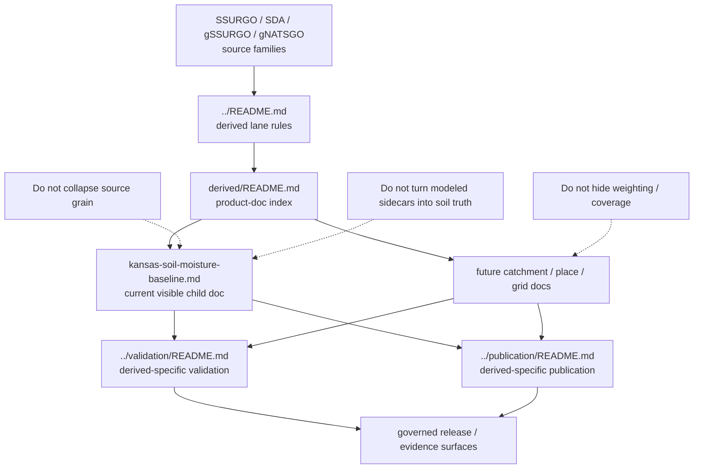

<!-- [KFM_META_BLOCK_V2]
doc_id: kfm://doc/NEEDS-VERIFICATION
title: Kansas Frontier Matrix — Soils — Derived — Product Docs
type: standard
version: v1
status: draft
owners: @bartytime4life, NEEDS VERIFICATION
created: YYYY-MM-DD
updated: YYYY-MM-DD
policy_label: NEEDS VERIFICATION
related: [../README.md, ../kansas-soil-moisture-baseline.md, ../validation/README.md, ../publication/README.md, ../../README.md, ../../sources/README.md, ../../validation/README.md, ../../publication/README.md, ../../../../pipelines/ssurgo_to_catchment.md, ../../../../../pipelines/soils/gssurgo-ks/README.md]
tags: [kfm, soils, derived, reporting-units, evidence-first]
notes: [doc_id, created, updated, and policy_label remain review placeholders until live repo metadata is verified]
[/KFM_META_BLOCK_V2] -->

<a id="top"></a>

# Kansas Frontier Matrix — Soils — Derived — Product Docs

Directory README for concrete derived-soils product specs that translate authoritative soil structure into new reporting units without hiding weighting, coverage, confidence, or evidence.

> **Status:** experimental  
> **Owners:** `@bartytime4life` · `NEEDS VERIFICATION`  
>       
> **Quick jumps:** [Scope](#scope) · [Repo fit](#repo-fit) · [Accepted inputs](#accepted-inputs) · [Exclusions](#exclusions) · [Directory tree](#directory-tree) · [Quickstart](#quickstart) · [Usage](#usage) · [Diagram](#diagram) · [Tables](#tables) · [Task list](#task-list) · [FAQ](#faq) · [Appendix](#appendix)  
> **Repo fit:** child index beneath [`../README.md`](../README.md), alongside concrete product docs such as [`../kansas-soil-moisture-baseline.md`](../kansas-soil-moisture-baseline.md), and next to derived-specific burden pages in [`../validation/README.md`](../validation/README.md) and [`../publication/README.md`](../publication/README.md).

> [!IMPORTANT]
> This directory is for **concrete derived-soils products**. The lane-wide rules already belong in [`../README.md`](../README.md). A child doc here should make one derived product or product family reviewable enough that a maintainer can answer: derived from what, aggregated how, reported for which unit, with what coverage, under what confidence, and through which evidence route.

> [!WARNING]
> Do not use this directory to smuggle a material reporting-unit change, dominance shortcut, or modeled sidecar into a vague note. If a soil output needs its own explanation to stay honest, it needs its own child doc here.

* * *

## Scope

This directory exists for **product-level** derived-soils docs under the parent `docs/domains/soils/derived/` lane.

Use it when a derived soil output needs its own documented burden because it changes one or more of the following:

- reporting unit
- aggregation or weighting method
- time basis
- source-role mix
- publication posture
- evidence or release expectations

Typical fits include:

- Kansas-first soil baselines
- catchment or watershed soil summaries
- place or corridor summaries
- raster/grid products
- tile or portrayal products
- derived story-safe or dossier-ready soil products that still need explicit evidence and caution language

### Truth posture used in this README

| Label | Meaning here |
|---|---|
| **CONFIRMED** | Supported by the visible public-main repo surface inspected for this revision |
| **INFERRED** | Strongly implied by adjacent KFM doctrine and repo structure |
| **PROPOSED** | Recommended structure or child-doc shape added to make this directory useful |
| **UNKNOWN** | Not verified strongly enough from the current visible evidence |
| **NEEDS VERIFICATION** | Review placeholder deliberately left visible until rechecked |

### What this directory is for

This directory should help maintainers answer these questions quickly:

1. Which derived soil products deserve their own docs instead of another paragraph in the parent README?
2. What minimum fields must every child doc surface before a reviewer can trust it?
3. Which burdens stay product-specific, and which belong back in lane-wide validation or publication docs?
4. How do concrete derived product docs stay subordinate to authoritative soil structure and visible source-role splits?

[Back to top](#top)

* * *

## Repo fit

| Item | Value |
|---|---|
| **Target path** | `docs/domains/soils/derived/derived/README.md` |
| **Role** | Directory index for concrete derived-soils product docs |
| **Primary upstream** | [`../README.md`](../README.md) — derived lane rules and burden |
| **Current visible child doc** | [`../kansas-soil-moisture-baseline.md`](../kansas-soil-moisture-baseline.md) |
| **Sibling derived-specific burden docs** | [`../validation/README.md`](../validation/README.md) · [`../publication/README.md`](../publication/README.md) |
| **Lane anchors** | [`../../README.md`](../../README.md) · [`../../sources/README.md`](../../sources/README.md) · [`../../validation/README.md`](../../validation/README.md) · [`../../publication/README.md`](../../publication/README.md) |
| **Pipeline neighbors** | [`../../../../pipelines/ssurgo_to_catchment.md`](../../../../pipelines/ssurgo_to_catchment.md) · [`../../../../../pipelines/soils/gssurgo-ks/README.md`](../../../../../pipelines/soils/gssurgo-ks/README.md) |
| **Machine-facing boundaries** | Keep schemas, policy, and executable tests in their owning surfaces rather than here |

### Boundary rule

This README should narrow the role of the nested `derived/` directory, not widen it.

- Keep **lane-wide derived doctrine** in [`../README.md`](../README.md)
- Keep **source-role inventory** in [`../../sources/README.md`](../../sources/README.md)
- Keep **release-blocking burden** in validation/publication docs
- Keep **machine law** out of this directory unless the repo later proves a different local convention

[Back to top](#top)

* * *

## Accepted inputs

Material that belongs here includes:

- concrete product docs for one derived soil output or one closely related product family
- product-specific reporting-unit definitions
- explicit weighting, overlay, interpolation, or aggregation notes
- source-role splits when a product mixes survey structure with derived, modeled, or assimilated signals
- coverage, confidence, caution, and downgrade rules that are specific to that product
- product-level artifact expectations such as GeoParquet, COG, PMTiles, STAC, DCAT, PROV, `run_receipt`, or `spec_hash` references
- repo-facing links to validation and publication burden docs
- child-doc naming and placement guidance that keeps the subtree navigable

## Exclusions

| Excluded here | Why it does not belong here | Put it with |
|---|---|---|
| Lane-wide derived rules | Already belong in the parent derived README | [`../README.md`](../README.md) |
| Source-family inventories | Those belong in the source-role page | [`../../sources/README.md`](../../sources/README.md) |
| Raw SSURGO, SDA, gSSURGO, or gNATSGO data | This is a documentation surface, not a truth-path storage zone | governed RAW / WORK / CATALOG surfaces |
| Machine-readable contracts and schemas | This directory explains burden; it should not impersonate machine law | contracts / schemas / policy / tests |
| Ad hoc notebooks or one-off GIS edits | They are not stable product specs by default | the owning analysis or tool surface |
| Publication copy rules that apply across the whole soils lane | Those belong in publication docs, not product indexes | publication docs |
| Runtime claims without direct proof | Public-tree presence is not enforcement proof | explicitly marked `UNKNOWN` / `NEEDS VERIFICATION` notes |

[Back to top](#top)

* * *

## Directory tree

### Current working tree for this product-doc slice

```text
docs/domains/soils/derived/
├── README.md
├── kansas-soil-moisture-baseline.md
├── derived/
│   └── README.md
├── validation/
│   └── README.md
└── publication/
    └── README.md
```

### Placement rule

- Put **concrete product docs** one level up in `docs/domains/soils/derived/`
- Use **this** README to explain what qualifies as a concrete product doc and how those docs should stay consistent
- Use sibling `validation/` and `publication/` pages for derived-specific burden that applies across more than one product doc

* * *

## Quickstart

Use this sequence when adding or revising a child doc under the derived-soils lane:

1. Start from [`../README.md`](../README.md), not from memory.
2. Name the **upstream soil grain** explicitly: map unit, component, horizon, raster cell, or mixed-source baseline.
3. Name the **reporting unit** explicitly: catchment, place, corridor, grid, tile set, statewide baseline, or other product unit.
4. State the **transform class** before anything else: rollup, overlay, grid derivation, modeled sidecar join, or story-safe summary.
5. Keep **weighting, coverage, and confidence** visible in the child doc, not hidden in prose.
6. Link the child doc to the right validation and publication burden docs.
7. Keep source authority intact even when a modeled or assimilated signal is part of the product.
8. Stop and escalate if the product starts behaving like a new lane rather than a new child doc.

### Minimal child-doc rule

A child doc here is not ready just because it describes the output. It is ready when a reviewer can tell:

- what the stronger upstream authority is
- what changed in reporting grain
- what method produced the product
- how incomplete support will be shown
- what downstream users must not mistake the product for

[Back to top](#top)

* * *

## Usage

### Use this directory as a product index, not a second lane README

The parent derived README already defines the class of derived soil products. This directory should stay focused on **product-level explainability**.

That means a child doc here should usually represent one of these cases:

- a materially distinct reporting unit
- a materially distinct aggregation method
- a materially distinct time basis
- a materially distinct modeled or assimilated sidecar
- a materially distinct release burden

### Keep source grain and reporting unit separate

A recurring failure mode in soil docs is to describe the product output as though it were the same thing as the upstream survey structure. Avoid that collapse.

Use language that keeps the distinction visible:

- **source grain** — what the upstream soil truth was organized as
- **reporting unit** — what the product is published for
- **method** — how one became the other

### Use the current visible child doc as the style floor

[`../kansas-soil-moisture-baseline.md`](../kansas-soil-moisture-baseline.md) shows the right general move: keep SSURGO-class soil structure stronger than the dynamic signal, keep modeled or assimilated inputs visibly subordinate, and keep downstream evidence and publication burden explicit.

### When **not** to open a new child doc

Do **not** create a new product doc here when:

- the material is only a new source note
- the material is only a validation threshold note
- the material is only a publication wording change
- the change belongs in the parent derived README because it applies to every derived soil product

[Back to top](#top)

* * *

## Diagram



[Back to top](#top)

* * *

## Tables

### Current and expected child docs

| Doc | Role in this subtree | Posture |
|---|---|---|
| [`../kansas-soil-moisture-baseline.md`](../kansas-soil-moisture-baseline.md) | Concrete Kansas-first derived baseline that combines SSURGO-class soil structure with SMAP L4 moisture signal | **CONFIRMED** current visible child doc |
| `catchment-soil-summaries.md` | Catchment or watershed rollups built from soil structure plus reporting-unit overlays | **PROPOSED** |
| `place-or-corridor-soil-summaries.md` | Public-safe place, corridor, or admin summaries that still need mixed-case honesty | **PROPOSED** |
| `grid-and-tile-products.md` | Raster, tile, or portrayal-oriented products whose reporting unit is a cell, tile, or derived map surface | **PROPOSED** |

### Minimum visible fields every child doc should carry

| Field or section | Why it must stay visible |
|---|---|
| **source family** | Keeps authoritative soil truth separate from access surfaces, derived grids, and modeled sidecars |
| **source grain** | Prevents false equivalence between survey structure and published product |
| **reporting unit** | Makes the downstream unit explicit |
| **method / weighting rule** | Keeps the transform reviewable |
| **coverage share or support note** | Prevents silent incompleteness |
| **confidence / caution posture** | Keeps public or operator trust bounded |
| **evidence / provenance refs** | Preserves drill-through and correction capacity |
| **validation routing** | Makes release burden discoverable |
| **publication posture** | Prevents a product doc from acting like a release waiver |

### Escalation guide

| Situation | Best home |
|---|---|
| Same transform class, same reporting unit, new product instance | existing child doc or appendix update |
| New reporting unit or new modeled sidecar | new child doc here |
| Same product family, but new validation burden affecting multiple child docs | `../validation/README.md` |
| Same product family, but new publication wording/defaults affecting multiple child docs | `../publication/README.md` |
| New source family or acquisition route | `../../sources/README.md` |
| Entirely new domain burden | back to `../../README.md` and lane review |

[Back to top](#top)

* * *

## Task list

### Definition of done for this directory

- [ ] Current visible child-doc inventory is accurate
- [ ] Every child doc clearly names its source grain and reporting unit
- [ ] Every child doc states method, weighting, coverage, and confidence
- [ ] Every child doc links to validation and publication burden where relevant
- [ ] Modeled or assimilated signals are visibly subordinate to authoritative soil structure
- [ ] Machine-facing contracts, policy, and tests are linked rather than duplicated
- [ ] `UNKNOWN` and `NEEDS VERIFICATION` remain visible where proof is absent

### Immediate follow-up work

- [ ] Confirm whether additional derived child docs already exist beyond the current visible moisture baseline
- [ ] Replace generic proposed filenames with live repo filenames if and when they are created
- [ ] Cross-link this index from any new product doc added under `docs/domains/soils/derived/`
- [ ] Keep naming stable enough that reviewers can infer product class from filename alone

[Back to top](#top)

* * *

## FAQ

### How is this different from `../README.md`?

`../README.md` explains the **class** of derived soil products. This file explains the **directory of concrete product docs** that sit underneath that class.

### When should I open a new child doc here?

Open one when the product changes reporting unit, transform class, or modeled sidecar burden enough that a reviewer would otherwise have to guess what changed.

### Can modeled or assimilated signals appear in a child doc here?

Yes, but only if the doc makes them visibly subordinate to authoritative soil structure and clearly states what they must not be mistaken for.

### Does a child doc here prove release readiness?

No. Presence in this directory does not replace validation, policy, evidence, or release review.

[Back to top](#top)

* * *

## Appendix

<details>
<summary>Minimal child-doc skeleton</summary>

```md
# <Derived soil product title>

One-line purpose for the product.

> **Status:** draft
> **Owners:** `NEEDS VERIFICATION`
> **Repo fit:** child doc under `docs/domains/soils/derived/`

## Source-role split
- authoritative source family:
- access/query surface:
- derived grid or modeled sidecar:
- what the product must not be mistaken for:

## Reporting unit
- source grain:
- reporting unit:
- time basis:

## Method
- transform class:
- weighting / aggregation:
- key retained identifiers:

## Coverage and confidence
- support notes:
- caution / downgrade rules:

## Validation routing
- human-readable burden:
- machine-facing links:

## Publication posture
- public-safe default:
- blocked or generalized cases:

## Evidence and artifacts
- run_receipt / spec_hash / STAC / DCAT / PROV:
```

</details>

<details>
<summary>Naming hints</summary>

Use names that reveal the product class without needing to open the file.

Examples:

- `kansas-soil-moisture-baseline.md`
- `catchment-soil-summaries.md`
- `place-or-corridor-soil-summaries.md`
- `grid-and-tile-products.md`

Prefer stable, review-friendly names over tool-specific or temporary workflow names.

</details>
