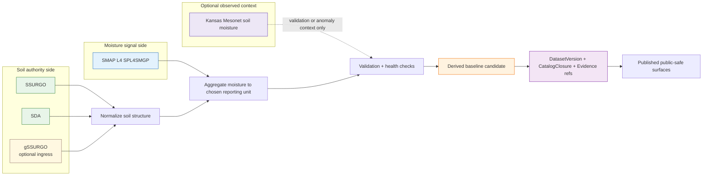

<!-- [KFM_META_BLOCK_V2]
doc_id: kfm://doc/NEEDS-VERIFICATION-UUID
title: Kansas Soil Moisture Baseline (SSURGO + SMAP L4)
type: standard
version: v1
status: draft
owners: @bartytime4life; NEEDS VERIFICATION
created: YYYY-MM-DD
updated: YYYY-MM-DD
policy_label: NEEDS-VERIFICATION
related: [docs/domains/soils/README.md, docs/domains/soils/sources/README.md, docs/domains/soils/derived/README.md, docs/domains/hydrology/mesonet-soil.md, docs/pipelines/ssurgo_to_catchment.md, pipelines/soils/gssurgo-ks/README.md, data/registry/README.md, data/catalog/README.md]
tags: [kfm, soils, moisture, ssurgo, smap, derived]
notes: [target child-file path below is proposed because the task placeholder did not specify a repo path; owner/date/policy values need branch confirmation]
[/KFM_META_BLOCK_V2] -->

# Kansas Soil Moisture Baseline (SSURGO + SMAP L4)

_Governed derived-soils guidance for combining SSURGO-class soil structure with SMAP Level-4 moisture signal without collapsing source roles, reporting grain, or publication burden._

> **Status:** draft  
> **Owners:** `@bartytime4life` · `NEEDS VERIFICATION`  
>       
> **Quick jumps:** [Scope](#scope) · [Repo fit](#repo-fit) · [Inputs](#inputs) · [Exclusions](#exclusions) · [Directory tree](#directory-tree) · [Quickstart](#quickstart) · [Usage](#usage) · [Diagram](#diagram) · [Reference tables](#reference-tables) · [Definition of done](#definition-of-done) · [FAQ](#faq) · [Appendix](#appendix)  
> **Repo fit:** `docs/domains/soils/derived/kansas-soil-moisture-baseline.md` _(**PROPOSED / NEEDS VERIFICATION**)_ · lane root [`../README.md`](../README.md) · source role docs [`../sources/README.md`](../sources/README.md) · derived lane index [`./README.md`](./README.md) · validation burden [`../validation/README.md`](../validation/README.md) · publication burden [`../publication/README.md`](../publication/README.md) · adjacent observed-source spec [`../../hydrology/mesonet-soil.md`](../../hydrology/mesonet-soil.md) · pipeline neighbor [`../../../pipelines/ssurgo_to_catchment.md`](../../../pipelines/ssurgo_to_catchment.md) · current public soils execution recipe [`../../../../pipelines/soils/gssurgo-ks/README.md`](../../../../pipelines/soils/gssurgo-ks/README.md)  
> **Accepted here:** source-role splits, baseline shape, aggregation and weighting rules, validation burden, publication defaults, artifact expectations, repo adjacency  
> **Not here:** raw landed datasets, live runtime claims, station-observation contracts, agronomic recommendations, irrigation decisioning, or unverified implementation status

> [!IMPORTANT]
> This document defines a **derived** Kansas soil-moisture baseline. It does **not** make SMAP authoritative over soil truth, and it does **not** replace the observed-station soil-moisture work described in [`../../hydrology/mesonet-soil.md`](../../hydrology/mesonet-soil.md).

## Scope

This document describes a Kansas-first, map-unit-aware baseline that joins:

- **authoritative soil structure** from SSURGO-class sources, accessed directly or through query surfaces, and
- **time-varying moisture signal** from SMAP Level-4 SPL4SMGP,

into a release-bearing **derived soils product** that stays honest about reporting grain, support, confidence, and publication burden.

The baseline is intended for:

- hydrology and environmental screening,
- cross-lane context in agriculture, hazards, and ecology,
- map-native evidence surfaces,
- downstream catalog closure and review-bearing publication.

The baseline is **not** intended to become parcel-scale truth, irrigation advice, or a substitute for field observations.

### Truth labels used in this file

| Label | Meaning here |
|---|---|
| **CONFIRMED** | Supported by the uploaded KFM corpus or current public-main repo evidence |
| **INFERRED** | Strongly suggested by repo/corpus structure, but not directly proven as live implementation |
| **PROPOSED** | Recommended contract, file path, artifact, or workflow shape |
| **UNKNOWN** | Not verified in the visible evidence boundary |
| **NEEDS VERIFICATION** | Review placeholder kept explicit on purpose |

## Repo fit

This file is designed to sit naturally beside the current public soils and hydrology domain docs.

| Surface | Role in this doc | Posture |
|---|---|---|
| [`../README.md`](../README.md) | Soils lane root and authority split | **CONFIRMED** |
| [`../sources/README.md`](../sources/README.md) | Source-role discipline and source-family framing | **CONFIRMED** |
| [`./README.md`](./README.md) | Derived-soils parent, where rollups/overlays/grids already belong | **CONFIRMED** |
| [`../validation/README.md`](../validation/README.md) | Release-blocking integrity burden | **CONFIRMED** |
| [`../publication/README.md`](../publication/README.md) | Public-safe downgrade and wording posture | **CONFIRMED** |
| [`../../hydrology/mesonet-soil.md`](../../hydrology/mesonet-soil.md) | Adjacent observed-source spec; avoid collapsing this baseline into it | **CONFIRMED** |
| [`../../../pipelines/ssurgo_to_catchment.md`](../../../pipelines/ssurgo_to_catchment.md) | Public evidence of current soils-to-hydrology derived thinking | **CONFIRMED** |
| [`../../../../pipelines/soils/gssurgo-ks/README.md`](../../../../pipelines/soils/gssurgo-ks/README.md) | Current public execution recipe for Kansas gSSURGO ingest | **CONFIRMED** |
| `docs/domains/soils/derived/kansas-soil-moisture-baseline.md` | Suggested child-file destination for this doc | **PROPOSED / NEEDS VERIFICATION** |

### Upstream / downstream logic

| Direction | Surface | Why it matters |
|---|---|---|
| Upstream | SSURGO / SDA / gSSURGO source families | Soil authority, identifiers, structure |
| Upstream | SMAP SPL4SMGP | Dynamic moisture signal |
| Sidecar | Mesonet observed soil-moisture docs | Optional validation/context, not baseline sovereignty |
| Downstream | `data/registry/`, `data/catalog/`, release receipts, STAC/DCAT/PROV | Governed publication and evidence visibility |
| Downstream | Map, dossier, Focus, export, derived overlays | Public-safe surfaces only after closure |

## Inputs

### Source-role matrix

| Source family | KFM role | Expected grain | Use in this baseline | Must not be mistaken for |
|---|---|---|---|---|
| **SSURGO** | authoritative soil survey source | map unit / component / horizon | soil structure, identifiers, interpretive attributes | time-varying moisture truth |
| **SDA** | authoritative query/access surface over soil survey content | query result over survey model | scripted extraction, narrow refreshes, controlled subsets | a separate sovereign soil ontology |
| **gSSURGO** | derived gridded soil convenience layer | statewide/regional raster + linked attributes | statewide analysis ingress, QA, raster-aligned comparison | replacement for survey-grain structure |
| **gNATSGO** | broader continuity/fallback soil grid | national composite raster | optional continuity context when explicitly justified | Kansas-first authoritative baseline |
| **SMAP SPL4SMGP** | modeled / assimilated environmental signal | 9 km, 3-hourly land-surface field | surface and root-zone volumetric water content | parcel- or map-unit-observed moisture truth |
| **Kansas Mesonet soil moisture** | observational adjacent source | station × depth × time | optional cross-check, health, anomaly context | statewide areal coverage for this baseline |

### Minimum retained identifiers

These identifiers should stay visible even if a downstream surface becomes more summarized.

| Identifier / field family | Why retain it |
|---|---|
| `mukey` | canonical soil join key for map-unit-aware products |
| `musym`, `mapunitname` | human-readable inspection and QA |
| source family + source version | authority and refresh traceability |
| moisture product id + time window | temporal meaning and freshness basis |
| reporting unit | prevents silent grain collapse |
| aggregation / weighting method | makes the derived step reviewable |
| evidence / receipt references | keeps the product inspectable later |

### Baseline design rules for inputs

1. **Keep soil authority upstream.**  
   SSURGO-class content remains the stronger authority for soil structure and soil attributes.

2. **Treat moisture as a signal, not a replacement ontology.**  
   SMAP contributes a dynamic moisture field, not a rewrite of map-unit identity.

3. **Do not erase soil hierarchy just to simplify the file.**  
   If the product is map-unit keyed, it still needs visible logic for how component/horizon structure was handled.

4. **Declare support before aggregating.**  
   A 9 km moisture field mapped to a `mukey` keyed table is a support-changing transformation and must remain visible.

## Exclusions

| Not in scope here | Where it belongs instead |
|---|---|
| Raw SSURGO or raw SMAP landing mechanics | source descriptors, ingest docs, and pipeline-specific readmes |
| Kansas Mesonet station-observation contract | [`../../hydrology/mesonet-soil.md`](../../hydrology/mesonet-soil.md) |
| Fully normative JSON Schema for this dataset | machine contract directories once verified |
| Claims about live API routes, jobs, or schedulers | implementation docs with direct repo/runtime proof |
| Irrigation, crop prescription, or agronomic advisory logic | downstream models or domain applications |
| Silent raster-first publication that hides soil grain | not allowed; keep reporting grain visible |

## Directory tree

The tree below is **repo-aligned but partly proposed**. Checked-in neighbors are kept explicit; new child paths remain reviewable.

```text
docs/
└── domains/
    ├── hydrology/
    │   └── mesonet-soil.md
    └── soils/
        ├── README.md
        ├── derived/
        │   ├── README.md
        │   └── kansas-soil-moisture-baseline.md   # this file (PROPOSED / NEEDS VERIFICATION)
        ├── publication/
        │   └── README.md
        ├── sources/
        │   └── README.md
        └── validation/
            └── README.md

pipelines/
└── soils/
    └── gssurgo-ks/
        └── README.md

docs/
└── pipelines/
    └── ssurgo_to_catchment.md

data/
├── catalog/
│   ├── dcat/
│   ├── prov/
│   └── stac/
├── processed/
├── raw/
├── receipts/
├── registry/
└── work/
```

> [!NOTE]
> The `data/` subpaths above are public-main neighbors. The narrower soil-moisture child paths under them are still **PROPOSED** until verified in the working branch.

## Quickstart

### Review-first quickstart

Use the current public repo surfaces before writing or promoting this baseline.

```bash
sed -n '1,220p' docs/domains/soils/README.md
sed -n '1,220p' docs/domains/soils/sources/README.md
sed -n '1,220p' docs/domains/soils/derived/README.md
sed -n '1,220p' docs/domains/soils/validation/README.md
sed -n '1,220p' docs/domains/soils/publication/README.md
sed -n '1,220p' docs/domains/hydrology/mesonet-soil.md
sed -n '1,260p' docs/pipelines/ssurgo_to_catchment.md
sed -n '1,260p' pipelines/soils/gssurgo-ks/README.md
```

### Illustrative build sequence

The sequence below is **process guidance**, not a claim that these exact entrypoints already exist.

```bash
# 1) acquire authoritative soil structure
#    - SSURGO package, or
#    - SDA extract, or
#    - gSSURGO ingress when statewide raster convenience is justified

# 2) preserve soil hierarchy long enough to document:
#    map unit -> component -> horizon

# 3) acquire SMAP SPL4SMGP for an explicit time window

# 4) choose and declare a reporting unit
#    default recommended here: mukey-keyed derived table with explicit support metadata

# 5) spatially aggregate SMAP support to the chosen reporting unit
#    do not hide the 9 km -> reporting-unit transformation

# 6) emit derived artifacts
#    - preferred analytic artifact: GeoParquet
#    - optional review convenience export: GeoPackage / GeoJSON
#    - required release companions: catalog closure + receipts

# 7) block release if validation, provenance, or policy closure fails
```

> [!CAUTION]
> A “successful join” is not enough. In KFM terms, the result is still only a candidate until source role, weighting, support mismatch, validation, and release-bearing metadata are visible.

## Usage

### Design rule 1 — keep authority and derivation separate

This baseline should always read like:

- **soil truth:** SSURGO-class structure and identifiers,
- **dynamic moisture signal:** SMAP L4,
- **derived product:** a governed baseline built from the two.

That wording matters. It prevents a downstream map, export, or summary from implying that a coarse, time-varying moisture field somehow rewrote the underlying soil survey record.

### Design rule 2 — do not flatten the soil model too early

Use this as the truth-preserving mental model:

```text
Map unit
└── Component
    └── Horizon
```

A release may summarize this hierarchy, but it should never quietly pretend the hierarchy never existed.

### Design rule 3 — make the reporting unit explicit

Recommended default for this document:

- **logical key:** `mukey`
- **soil grain:** map unit
- **moisture support:** 9 km grid cell support, aggregated to the chosen reporting unit
- **surface class:** derived screening / contextual baseline unless a stricter release class is justified

### Proposed logical output shape

Field names below are a **PROPOSED logical shape**, not a confirmed live contract.

| Field | Class | Purpose |
|---|---|---|
| `mukey` | required | canonical map unit key |
| `musym` | recommended | inspection and debugging |
| `mapunitname` | recommended | human-readable review surface |
| `soil_source_family` | required | `SSURGO`, `SDA`, `gSSURGO`, etc. |
| `soil_source_version` | required | refresh/release traceability |
| `soil_grain` | required | e.g. `map_unit` |
| `reporting_unit` | required | the actual release unit |
| `component_weighting_method` | required when applicable | makes the soil-summary step inspectable |
| `sm_surface_vwc` | candidate metric | surface volumetric water content |
| `sm_root_vwc` | candidate metric | root-zone volumetric water content |
| `moisture_source_family` | required | `SMAP_SPL4SMGP` |
| `moisture_window_start` / `moisture_window_end` | required | temporal meaning |
| `moisture_support_resolution_m` | required | support mismatch visibility |
| `aggregation_method` | required | area-weighted mean, median, quantile, etc. |
| `coverage_share` | required | how much support actually intersects the reporting unit |
| `confidence_label` | required | public-safe interpretation class |
| `evidence_refs` | required | evidence / provenance linkage |
| `dataset_version_ref` | recommended | release-bearing identity |
| `projection_build_receipt_ref` | conditional | only when map/render products are built from the baseline |

### Preferred artifact posture

| Artifact | Recommendation | Why |
|---|---|---|
| GeoParquet | preferred canonical analytic artifact | aligns with current public soils execution recipe and columnar analytics |
| GeoPackage / GeoJSON | optional convenience export | review and interchange, but keep secondary |
| STAC / DCAT / PROV closure | required for release-bearing publication | outward metadata and lineage |
| run / ingest / projection receipts | required when promoted | proof-bearing release posture |

### Validation and fail-closed behavior

A baseline candidate should fail closed on any of the following:

| Gate | Minimum rule | Block / downgrade |
|---|---|---|
| Soil key integrity | `mukey` retained and resolvable | block |
| Source-role labeling | authoritative / derived / modeled roles explicit | block |
| Reporting unit visibility | `reporting_unit` and `soil_grain` both visible | block |
| Weighting declaration | component/horizon handling documented | block |
| Moisture window clarity | start/end window retained | block |
| Support mismatch visibility | 9 km support not hidden | block |
| Coverage visibility | coverage share or equivalent retained | block |
| Provenance / receipt presence | evidence and receipt refs present | block |
| Public wording | no authoritative overclaim | downgrade or block |
| Optional observed cross-check | if Mesonet or other observations are used, they must remain separately labeled | block if flattened into the baseline silently |

## Diagram



## Reference tables

### Contract-family map for this baseline

These are the contract families this baseline most naturally touches. They are included here as **KFM-aligned expectations**, not as confirmed live files for this specific lane.

| Contract family | Role in this baseline |
|---|---|
| `SourceDescriptor` | declares SSURGO / SDA / gSSURGO / SMAP source role, cadence, rights, support |
| `IngestReceipt` | proves fetch / query / landing event |
| `ValidationReport` | records schema, weighting, support, and plausibility checks |
| `DatasetVersion` | identifies the derived candidate or promoted baseline |
| `CatalogClosure` | binds outward STAC / DCAT / PROV references |
| `ProjectionBuildReceipt` | proves any map/tiles/export derivative was built from a known release |
| `EvidenceBundle` | supports feature, story, export, or answer surfaces |
| `ReleaseManifest` / proof pack | governs public-safe promotion and rollback posture |

### Interpretation class matrix

| Product shape | Safe interpretation | Unsafe interpretation |
|---|---|---|
| `mukey` keyed table with visible SMAP support metadata | derived contextual baseline | soil moisture observed at map-unit scale |
| statewide raster derived from gSSURGO + SMAP | derived screening surface | authoritative soil survey update |
| story card or focus summary | evidence-linked contextual statement | uncited agronomic advice |
| optional Mesonet comparison layer | station-based observational cross-check | statewide areal replacement for baseline |

## Definition of done

- [ ] Target path is confirmed in the working branch, or this file is relocated intentionally
- [ ] KFM meta block placeholders are resolved
- [ ] Source roles remain explicit: authoritative soil, derived ingress, modeled moisture, optional observed cross-check
- [ ] `mukey` or justified reporting-unit replacement is visible
- [ ] Component / horizon handling is documented where summarized
- [ ] SMAP time-window semantics are retained
- [ ] Validation burden is written in fail-closed terms
- [ ] Public wording does not overclaim parcel precision or observational certainty
- [ ] Catalog and receipt expectations are named without pretending they already ship
- [ ] Cross-links to soils and hydrology lane docs are valid
- [ ] A reviewer can tell what this file governs and what it explicitly does not

## FAQ

### Is this an authoritative soil source document?

No. This file governs a **derived** baseline. The stronger soil authority remains upstream in SSURGO-class sources and source-role docs.

### Is this the same thing as the Mesonet soil-moisture spec?

No. [`../../hydrology/mesonet-soil.md`](../../hydrology/mesonet-soil.md) is about observed station data. This file is about a broader derived baseline that joins soil structure with SMAP moisture signal.

### Why not use dominant component only and move on?

Because that shortcut can hide component mixture, weighting choices, and support mismatch. If dominant-component-only logic is ever used, it should be explicit and justified.

### Can gSSURGO be the only soil input?

It can be a practical ingress for statewide and raster-aligned workflows, but this doc keeps the stronger authority distinction visible and avoids pretending a gridded convenience layer erased the underlying survey model.

### Can this be published publicly?

Potentially yes, but only as a **public-safe derived product** with visible support, temporal window, confidence posture, and release-bearing evidence/provenance closure.

## Appendix

<details>
<summary>Illustrative derived record example (PROPOSED)</summary>

```json
{
  "mukey": "123456",
  "musym": "KsB",
  "mapunitname": "Kansas silt loam",
  "soil_source_family": "SSURGO",
  "soil_source_version": "NEEDS-VERIFICATION",
  "soil_grain": "map_unit",
  "reporting_unit": "mukey",
  "component_weighting_method": "component_pct_weighted",
  "sm_surface_vwc": 0.18,
  "sm_root_vwc": 0.21,
  "moisture_source_family": "SMAP_SPL4SMGP",
  "moisture_window_start": "2026-04-07T00:00:00Z",
  "moisture_window_end": "2026-04-07T03:00:00Z",
  "moisture_support_resolution_m": 9000,
  "aggregation_method": "area_weighted_mean",
  "coverage_share": 0.94,
  "confidence_label": "derived_screening",
  "evidence_refs": [
    "NEEDS-VERIFICATION"
  ],
  "dataset_version_ref": "NEEDS-VERIFICATION",
  "projection_build_receipt_ref": null
}
```

</details>

<details>
<summary>Suggested release artifact pack (PROPOSED)</summary>

| Artifact | Why it exists |
|---|---|
| derived baseline GeoParquet | canonical analytic surface |
| optional convenience export | operator review / interchange |
| validation report | fail-closed reviewability |
| dataset-version descriptor | versioned identity |
| STAC / DCAT / PROV closure | outward discoverability and lineage |
| run / projection / release receipts | proof-bearing publication posture |

</details>

<details>
<summary>Resolution note</summary>

- Soil survey structure and map units are fine-grained.
- SMAP Level-4 moisture support is coarse compared with survey polygons.
- A trustworthy baseline therefore needs:
  - explicit support metadata,
  - an aggregation method,
  - coverage visibility,
  - caution against over-reading local precision.

</details>

[Back to top](#kansas-soil-moisture-baseline-ssurgo--smap-l4)
