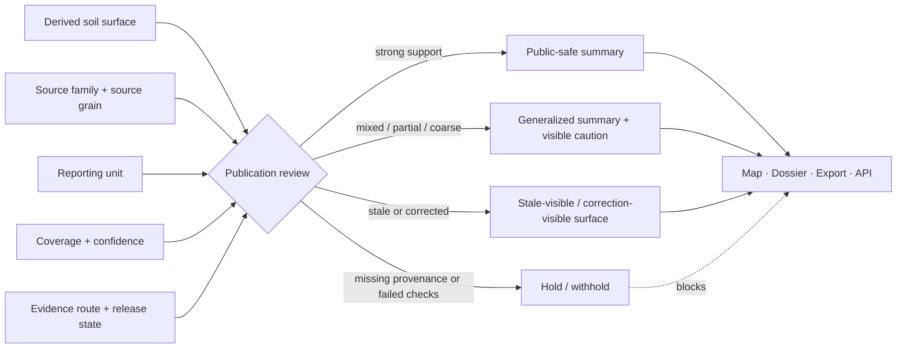

<!-- [KFM_META_BLOCK_V2]
doc_id: kfm://doc/TBD-SOILS-DERIVED-PUBLICATION-UUID
title: Kansas Frontier Matrix — Soils — Derived — Publication
type: standard
version: v1
status: draft
owners: @bartytime4life (current `/docs/` fallback owner) — verify narrower path ownership
created: YYYY-MM-DD
updated: YYYY-MM-DD
policy_label: TBD — verify
related: [../README.md, ../../README.md, ../../publication/README.md, ../../validation/README.md, ../../sources/README.md, ../../../../pipelines/ssurgo_to_catchment.md]
tags: [kfm, soils, derived, publication, readme]
notes: [Requested target path is not directly verified on current public main; current public main already contains ../../publication/README.md, so authority reconciliation is required before merge.]
[/KFM_META_BLOCK_V2] -->

# Kansas Frontier Matrix — Soils — Derived — Publication

_Publication contract for soil outputs whose reporting units are derived from, but not equal to, authoritative soil survey units._

| Field | Value |
|---|---|
| **Status** | Experimental |
| **Owners** | `@bartytime4life` *(current `/docs/` fallback owner; narrower path ownership NEEDS VERIFICATION)* |
| **Badges** |      |
| **Quick jumps** | [Scope](#scope) · [Repo fit](#repo-fit) · [Accepted inputs](#accepted-inputs) · [Exclusions](#exclusions) · [Directory tree](#directory-tree) · [Quickstart](#quickstart) · [Usage](#usage) · [Diagram](#diagram) · [Tables](#tables) · [Task list](#task-list) · [FAQ](#faq) · [Appendix](#appendix) |
| **Repo fit** | Path: `docs/domains/soils/derived/publication/README.md` *(PROPOSED / NEEDS VERIFICATION)* · Parent: [`../README.md`](../README.md) · Lane root: [`../../README.md`](../../README.md) · Current public-main sibling: [`../../publication/README.md`](../../publication/README.md) |

> [!IMPORTANT]
> Current public-main evidence already shows a sibling soil publication guide at `docs/domains/soils/publication/README.md`.
>
> Before merging this file, make an explicit authority decision:
> 1. keep the sibling file as the **lane-wide** publication overview and use this file as the **derived-only** deep dive, or
> 2. replace one file with a redirect/shim.
>
> Do **not** let both files become competing authorities.

> [!NOTE]
> This page is intentionally narrower than the lane-wide soils publication guide.
> It exists for one seam only: **how derived soil surfaces may speak in public once their outward reporting unit no longer matches source survey grain.**

> [!TIP]
> Truth labels used here: **CONFIRMED**, **INFERRED**, **PROPOSED**, **UNKNOWN**, and **NEEDS VERIFICATION**.

## Scope

This README governs public-facing copy, release posture, and downgrade behavior for **already-derived** soil products. It applies when KFM has taken soil inputs such as SSURGO, gSSURGO, SDA-backed rollups, or similar soil-family sources and produced a downstream reporting unit such as a catchment, watershed, county, service area, generalized polygon, grid cell, story-node summary, dossier card, export row, or API summary.

This page is about **what a user may be told** and **what must stay visible** at the point of use. It does not redefine authoritative soil truth, source onboarding, or validation law.

In practice, this file exists to stop three recurring failures:

- a derived reporting unit pretending to be the same thing as a soil survey unit
- a dominant-class summary hiding mixed or partial composition
- a polished public statement outrunning its evidence, release, or correction posture

## Repo fit

| Fit surface | Role |
|---|---|
| [`../../README.md`](../../README.md) | Soils lane root: lane scope, doctrinal fit, and adjacent lane context |
| [`../README.md`](../README.md) | Derived-soils parent: rebuildable summaries, rollups, overlays, and visible-field rules |
| [`../../sources/README.md`](../../sources/README.md) | Source-role distinctions and upstream source-family handling |
| [`../../validation/README.md`](../../validation/README.md) | Completeness, downgrade, and validation consequences |
| [`../../publication/README.md`](../../publication/README.md) | Existing public-main sibling publication guide for the broader soils lane |
| [`../../../../pipelines/ssurgo_to_catchment.md`](../../../../pipelines/ssurgo_to_catchment.md) | Concrete derived-soils example with rollup logic, coverage share, mixed handling, and release gating |

### Upstream and downstream logic

**Upstream into this file**

- lane-wide soil publication rules
- derived-output rules
- validation outcomes that affect public meaning
- release and correction state
- evidence and provenance routes

**Downstream from this file**

- dataset-specific popup, card, export, and API wording
- release notes or surface copy for derived soil products
- Evidence Drawer expectations for derived soil claims
- hold, withhold, or generalize decisions for outward summaries

## Accepted inputs

This file accepts concise, review-ready material derived from:

- release-approved derived soil surfaces
- validation summaries that change public meaning
- publication-class decisions for derived soil outputs
- evidence and provenance references for outward claims
- source-grain → reporting-unit mappings
- correction, supersession, or stale-state notices
- public-safe wording patterns for map, dossier, export, and API surfaces

### Good inputs to add here

- a new rule for publishing catchment-level soil summaries
- a required caution for mixed dominant-class rollups
- a release-visible correction rule for superseded soil derivatives
- a checklist for what a popup or export row must show before it may ship

## Exclusions

This file is **not** the home for:

- raw source onboarding or source-descriptor law
- full validation logic, thresholds, or QA implementation detail
- exact schema definitions or contract fixtures
- unresolved rights or sensitivity disputes
- unpublished experiments or scratch publication copy
- source-family deep dives that belong in [`../../sources/README.md`](../../sources/README.md)
- quality and downgrade mechanics that belong primarily in [`../../validation/README.md`](../../validation/README.md)
- broad lane-wide publication rules that belong in [`../../publication/README.md`](../../publication/README.md)

### Hard exclusion rule

Do **not** use this file to bless parcel-like, field-like, or horizon-like certainty when the outward reporting unit is coarser than the underlying soil survey grain.

## Directory tree

```text
docs/domains/soils/
├── README.md
├── sources/
│   └── README.md
├── derived/
│   ├── README.md
│   └── publication/
│       └── README.md          # target path — PROPOSED / NEEDS VERIFICATION
├── validation/
│   └── README.md
└── publication/
    └── README.md              # current public-main sibling guide
```

> [!WARNING]
> The tree above is a **proposed authority layout**, not a claim that the nested `derived/publication/` subtree is already mounted on current public main.

## Quickstart

### Add or revise one derived-surface publication rule

1. Start with the actual reporting unit from [`../README.md`](../README.md), not with the source family name.
2. Pull the minimum visible facts from validation and provenance:
   - source family
   - source grain
   - reporting unit
   - weighting or aggregation method
   - coverage share
   - confidence or caution posture
   - evidence route
   - release/correction state
3. Decide the outcome class:
   - **public-safe**
   - **generalized**
   - **stale-visible / correction-visible**
   - **steward-review**
   - **hold / withhold**
4. Write the smallest public statement that stays true at that reporting unit.
5. Add the matching caution language.
6. Reconcile the rule with [`../../publication/README.md`](../../publication/README.md) so the lane does not fork.

### Minimal authoring scaffold

```md
### <surface or summary class>

- Source family: `<SSURGO | gSSURGO | SDA-backed rollup | mixed — make explicit>`
- Source grain: `<map unit | component | horizon | gridded cell | other>`
- Reporting unit: `<catchment | county | service area | generalized polygon | tile>`
- Method note: `<area-weighted | dominant class | mixed fallback | other>`
- Coverage share: `<required visible value or rule>`
- Evidence route: `<release / evidence / provenance link>`
- Publication class: `<public-safe | generalized | stale-visible | steward-review | hold>`
- Correction behavior: `<what happens when upstream or release changes>`
```

### Quick author test

If a reader could mistake the summary for **uniform soil truth** at the reporting unit, the copy is still too aggressive.

## Usage

### Working rule

A derived soil surface may be **useful**, **public**, and **governed** without ever pretending to be authoritative survey truth.

### Publication rule

Every outward soil statement at a derived reporting unit should let a reviewer or reader recover:

1. what source family it came from
2. what grain it started from
3. what reporting unit it now describes
4. how it was aggregated, weighted, or generalized
5. how much coverage supports it
6. what caution, mixed-state, or uncertainty applies
7. where the evidence route lives
8. what release, stale, or correction state currently applies

### Derived-publication guardrails

- Keep **source grain** and **reporting unit** separate in both prose and structured fields.
- Keep **observed**, **derived**, and **modeled** language distinct.
- Keep **mixed** or **partial** support visible instead of rounding it away.
- Keep **correction** and **stale** states user-visible instead of silently overwriting surfaces.
- Keep **release state** visible whenever it changes meaning.
- Keep **evidence one hop away** from consequential public claims.

> [!WARNING]
> A county-, catchment-, watershed-, service-area-, or generalized-polygon rollup is **not** permission to speak as though the whole unit has one soil.

### Downgrade triggers

Downgrade or hold the public statement when any of the following becomes true:

- coverage share is unknown or materially incomplete
- dominance is weak enough that **Mixed** is the truer label
- source families or resolution classes are mixed without clear explanation
- provenance, release, or correction linkage is missing
- a statement would imply parcel-, field-, or horizon-scale certainty
- the surface is stale, corrected, or superseded and that state is not visible in place

## Diagram



## Tables

### Publication floor

| Surface | Minimum visible cues | Hold or downgrade when |
|---|---|---|
| **Map popup / map card** | reporting unit, dominant vs mixed posture, coverage share, evidence hop | coverage is missing, mixed state is hidden, or the copy sounds parcel-like |
| **Dossier block** | source family, source grain, reporting unit, method note, caution, release/correction state | source-family mixing is unexplained, or correction state is missing |
| **Story-node sentence** | generalized wording, scale cue, evidence route, non-authoritative framing | narrative convenience would outrun support or imply field-scale certainty |
| **Export row / download landing text** | dataset/release identity, reporting unit, method, coverage share, evidence/provenance route | export would hide stale/correction state or erase support semantics |
| **API summary object** | machine-readable result, caution/result state, reporting unit, evidence ref, release ref | the surface cannot echo caution grammar or negative-path state |
| **Steward / reviewer note** | exact hold reason, obligation codes or reviewer prompts, next action | public-safe class is unresolved |

### Outcome ladder

| Outcome | Use when | Visible cue | Never do this |
|---|---|---|---|
| **Public-safe** | source family, method, coverage, and release state are strong enough for outward summary | normal surface + evidence hop | imply the reporting unit is authoritative survey grain |
| **Generalized** | the surface is still useful but mixed, partial, coarse, or otherwise weakly supported | explicit generalized or mixed label + caution | present a single dominant class as uniform truth |
| **Stale-visible / correction-visible** | upstream, release, or derivative state has changed but the surface still needs visible continuity | stale/correction chip + replacement or correction path | silently overwrite the prior statement |
| **Steward-review** | rights, precision, or interpretation burden needs review before public exposure | public surface withheld; steward path remains explicit | auto-promote because the data is interesting |
| **Hold / withhold** | provenance, validation, or release basis is missing or failed | no public summary; reviewer-facing reason only | bluff with “best available” language |

### Language guardrails

| Prefer | Avoid | Why |
|---|---|---|
| **dominant soil signal in this catchment** | **soil in this catchment is** | avoids false uniformity |
| **derived from SSURGO rollup** | **from SSURGO** | keeps aggregation visible |
| **coverage share: 81%** | *(no support statement)* | shows how much of the unit is actually supported |
| **mixed outside the dominant class** | **representative soil** | avoids hiding composition spread |
| **generalized public summary** | **exact local condition** | keeps scale truth intact |

## Task list

- [ ] Verify whether this nested path is truly intended for the repo.
- [ ] Resolve authority with [`../../publication/README.md`](../../publication/README.md).
- [ ] Replace placeholder metadata values (`doc_id`, dates, policy label, owner note) with verified values.
- [ ] Keep source family, source grain, and reporting unit explicitly separate.
- [ ] Document the minimum visible cues for each public surface that will use derived soil summaries.
- [ ] Ensure weak dominance, mixed composition, and partial coverage have explicit downgrade language.
- [ ] Ensure stale/correction behavior is visible and linked.
- [ ] Add at least one real surface example once release-approved evidence exists.
- [ ] Verify all relative links after placement.
- [ ] Keep any machine-facing schema or policy references aligned with actual repo paths, not remembered paths.

[Back to top](#kansas-frontier-matrix--soils--derived--publication)

## FAQ

### Why not put all of this in `../../publication/README.md`?

That sibling file can remain the **lane-wide** soil publication overview. This file is useful only if maintainers want a narrower, derived-only page for surfaces whose public reporting unit no longer matches source survey grain. If that split is not desired, this file should become a redirect/shim instead.

### When is a generalized summary acceptable?

When the surface is still genuinely useful but its support is mixed, partial, coarse, or otherwise too weak for plain-language certainty. The downgrade should happen in the visible copy, not just in hidden metadata.

### Can this file authorize field-, parcel-, or horizon-scale claims?

No. If the outward reporting unit is coarser than the claim, the copy must either generalize, downgrade, or stop.

### What happens when an upstream soil source or release changes?

The public surface should become **stale-visible** or **correction-visible**, or be held entirely, until the replacement surface and its evidence route are clear.

## Appendix

<details>
<summary>Illustrative copy patterns and reviewer prompts</summary>

### Illustrative popup pattern

```md
**Dominant hydrologic group in this catchment:** B

Derived from SSURGO rollup across mapped soil units.
Coverage share: 81%
Composition: Mixed outside dominant class
Publication class: Generalized
Evidence route: <release / EvidenceBundle / dossier link>
```

### Illustrative dossier sentence

```md
This catchment-level soil summary is a generalized rollup from survey-grain soil records.
Treat it as watershed context, not parcel-scale truth.
```

### Illustrative hold note

```md
Hold public release.
Reason: reporting unit is county-scale, but current copy implies parcel-scale certainty.
Required fix: add source grain, method note, coverage share, and mixed-state wording.
```

### Reviewer prompts

- Does the wording stay true at the reporting unit?
- Would a reader mistake the output for authoritative soil truth?
- Are mixed or partial conditions visible in place?
- Is evidence one hop away?
- Is stale or correction state visible if it changes meaning?
- If the source family changed, did the wording change too?

### Authority reconciliation note template

```md
This file narrows publication guidance to derived-soil surfaces only.
The lane-wide overview remains in ../../publication/README.md.
If that division is not maintained, one file must redirect to the other.
```

</details>

[Back to top](#kansas-frontier-matrix--soils--derived--publication)
