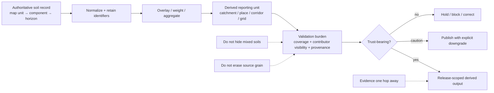

<!-- [KFM_META_BLOCK_V2]
doc_id: kfm://doc/<NEEDS_VERIFICATION_UUID>
title: Kansas Frontier Matrix — Soils — Derived — Validation
type: standard
version: v1
status: draft
owners: @bartytime4life; NEEDS VERIFICATION
created: YYYY-MM-DD
updated: YYYY-MM-DD
policy_label: NEEDS VERIFICATION
related: [docs/domains/soils/README.md, docs/domains/soils/derived/README.md, docs/domains/soils/validation/README.md, docs/domains/soils/publication/README.md, docs/pipelines/ssurgo_to_catchment.md]
tags: [kfm, soils, derived, validation]
notes: [This path is proposed from current visible evidence and should be verified against the live tree before commit; placeholder metadata fields require review.]
[/KFM_META_BLOCK_V2] -->

# Kansas Frontier Matrix — Soils — Derived — Validation

Validation README for reporting-unit transforms, weighted rollups, grids, and other rebuildable soil outputs built downstream of authoritative soil records.

| Status | Owners | Quick fit |
|---|---|---|
|      | `@bartytime4life`, `NEEDS VERIFICATION` | Human-readable validation burden for soil outputs whose reporting unit no longer matches the upstream survey grain |

**Path:** `docs/domains/soils/derived/validation/README.md`  
**Path status:** `PROPOSED / NEEDS VERIFICATION`  
**Repo fit:** specialized child page under `docs/domains/soils/derived/` that narrows the broader soil validation burden to derived outputs only.  
**Accepted inputs:** validation matrices, weighting rules, coverage logic, contributor visibility rules, downgrade/block conditions, and release-facing evidence expectations for derived soil products.  
**Exclusions:** source acquisition logic, publication copy rules, executable policy code, JSON Schema, fixtures, workflow YAML, and claims about live enforcement that have not been directly verified.

**Quick jumps:** [Scope](#scope) · [Repo fit](#repo-fit) · [Inputs](#inputs) · [Exclusions](#exclusions) · [Directory tree](#directory-tree) · [Quickstart](#quickstart) · [Usage](#usage) · [Diagram](#diagram) · [Tables](#tables) · [Task list](#task-list) · [FAQ](#faq) · [Appendix](#appendix)

> [!IMPORTANT]
> A derived soil result is not trust-bearing just because the math ran. It must still say **what upstream grain it came from**, **what reporting unit it was summarized to**, **how weighting worked**, **how much of the target unit is actually supported**, and **where the evidence route lives**.

> [!NOTE]
> This page does **not** replace `../../validation/README.md`. It narrows that lane-wide burden to the derived class only: catchment summaries, place rollups, corridor summaries, rasterized outputs, and other reporting-unit transforms that sit downstream of authoritative soil records.

---

## Scope

This page covers soil products built **after** source acquisition and normalization, especially when the output geometry, support, or reporting unit differs from the original soil survey structure.

It is the right home for validation burden around:

- catchment summaries
- county or place-level rollups
- corridor summaries
- raster grids
- story-safe soil summaries
- evidence-linked map portrayals
- compact API payload summaries derived from larger soil structures

It is **not** permission to flatten `mapunit`, `component`, and `horizon` structure into one vague “soil layer.”

[Back to top](#kansas-frontier-matrix--soils--derived--validation)

## Repo fit

| Item | Value |
|---|---|
| Path | `docs/domains/soils/derived/validation/README.md` |
| Path status | `PROPOSED / NEEDS VERIFICATION` |
| Upstream | [`../README.md`](../README.md) · [`../../README.md`](../../README.md) |
| Adjacent doctrinal pages | [`../../validation/README.md`](../../validation/README.md) · [`../../publication/README.md`](../../publication/README.md) |
| Adjacent pipeline evidence | [`../../../../pipelines/ssurgo_to_catchment.md`](../../../../pipelines/ssurgo_to_catchment.md) |
| Machine-facing neighbors | [`../../../../../tests/README.md`](../../../../../tests/README.md) · [`../../../../../tests/contracts/README.md`](../../../../../tests/contracts/README.md) |
| Contract-facing neighbors | [`../../../../../schemas/contracts/v1/data/README.md`](../../../../../schemas/contracts/v1/data/README.md) · [`../../../../../schemas/contracts/v1/evidence/README.md`](../../../../../schemas/contracts/v1/evidence/README.md) |
| Governance use | documentation surface for review burden, not proof that executable policy/tests already exist |

### Why this child page exists

The parent derived page already establishes the core rule: **derived soil products must remain visibly subordinate to authoritative soil records**. The sibling validation page already establishes the broader fail-closed posture. This child page exists because derived outputs create a sharper question:

> when soil truth is summarized into a different unit, what exactly must remain visible before that summary is safe to trust?

That question deserves its own narrow review surface.

## Inputs

| Accepts | Why it belongs here |
|---|---|
| source-grain declarations | Prevents false equivalence between survey units and reporting units |
| reporting-unit definitions | Makes clear what is actually being summarized |
| weighting method notes | Keeps rollups inspectable instead of magical |
| area-share or component-share logic | Shows how mixtures were resolved |
| coverage fields | Exposes incompleteness instead of hiding it |
| contributor visibility rules | Keeps dominant-class claims from erasing weaker but material contributors |
| confidence / caution rules | Defines when a summary downgrades, narrows, or blocks |
| evidence-route expectations | Keeps drill-through one hop away for trust-bearing surfaces |
| release-facing anti-examples | Shows what should fail closed before publication |

## Exclusions

| Exclusion | Why it does not belong here |
|---|---|
| source acquisition procedures | Belongs in source or pipeline docs |
| executable OPA / Conftest logic | Belongs in policy and machine-facing surfaces |
| JSON Schema files | Belongs in contract/schema lanes |
| fixtures and workflow YAML | Belongs in `tests/` and workflow surfaces |
| public copy / caution phrasing | Belongs in `../../publication/README.md` |
| live enforcement claims | Need direct verification from current machine-facing repo surfaces |

## Directory tree

```text
docs/domains/soils/
├── README.md
├── derived/
│   ├── README.md
│   └── validation/
│       └── README.md   # this file — PROPOSED / NEEDS VERIFICATION
├── validation/
│   └── README.md
└── publication/
    └── README.md
```

> [!NOTE]
> The child path shown above is the intended placement for this README. Verify the live tree before commit and adjust sibling links if maintainers decide to keep all soil validation guidance flat at `docs/domains/soils/validation/README.md`.

## Quickstart

1. Name the **upstream soil grain** first.  
   State whether the derived output came from map units, component/horizon rollups, gSSURGO-style gridded convenience products, or another governed source family.

2. Name the **reporting unit** second.  
   Catchment, county, corridor, raster cell, story card, or API summary all change what the result is allowed to mean.

3. State the **weighting method** plainly.  
   Area-weighted overlay, component-weighted rollup, dominant-class shortcut with caution, or another explicit transform.

4. Publish **coverage and contributor visibility**.  
   A derived summary should not hide partial support, mixed contributors, or weak dominance.

5. Keep **evidence one hop away**.  
   A reviewer should be able to reach contributors, method, and provenance without leaving the trust surface entirely.

6. **Downgrade, narrow, hold, or block** rather than bluff.  
   Missing coverage, unresolved joins, malformed provenance, or unstable category handling are release problems, not presentation problems.

## Usage

Use this page when documenting or reviewing any soil-derived output whose geometry or support differs from the original survey structure.

Every derived validation review should answer five questions:

1. **Derived from what?**  
   The upstream soil grain must stay explicit.

2. **Aggregated how?**  
   The weighting or transform must be named.

3. **Reported for which unit?**  
   Reviewers must know whether the summary is for a catchment, place, grid, corridor, or other unit.

4. **With what coverage?**  
   Partial support must stay visible.

5. **Under what confidence?**  
   Confidence must reflect support, not wishful certainty.

### Human-readable outcomes

This page is written so a maintainer can review a derived soil surface without pretending that prose itself is proof. The expected outcomes are:

- **pass with visible evidence**
- **publish with caution**
- **narrow the claim**
- **hold for review**
- **block release**

### Machine-facing boundary

Where current KFM contract names are already used elsewhere, this page should stay compatible with them rather than inventing replacements. In practice that means keeping terms such as `ValidationReport`, `DatasetVersion`, `EvidenceBundle`, `ReviewRecord`, and release-facing evidence references stable unless directly verified repo artifacts say otherwise.

[Back to top](#kansas-frontier-matrix--soils--derived--validation)

## Diagram



## Tables

### Minimum derived validation families

| Validation family | Core question | Minimum visible fields | Default outcome if failed |
|---|---|---|---|
| Source-grain integrity | Was the upstream soil grain preserved explicitly? | source family, source grain, version/release basis | hold |
| Join integrity | Were soil identifiers retained cleanly through the transform? | `mukey`, `cokey` or equivalent contributor trace, join notes | hold |
| Weighting integrity | Was the summary built with an explicit and reviewable weighting method? | weighting method, contributor shares, transform notes | hold |
| Coverage visibility | How much of the reporting unit is actually supported? | `soil_coverage_share` or equivalent support field | downgrade or block |
| Dominance / mixture handling | Is a dominant class claim hiding weak support or mixed contributors? | dominant share, mixed-case note, contributor summary | downgrade |
| Plausibility | Are numeric results physically plausible and internally consistent? | value ranges, unit notes, sanity checks | investigate or block |
| Provenance route | Can the reviewer reach method and contributing evidence quickly? | `provenance_ref`, evidence summary, release ref | block |
| Release posture | Is the output visibly derived and release-scoped? | confidence flag, publication state, correction path if applicable | hold |

### Preferred visible fields for derived validation reviews

| Field | Why it should stay visible |
|---|---|
| source family | Keeps authority visible |
| source grain | Prevents false equivalence between survey and summary |
| reporting unit | States what was actually summarized |
| weighting method | Makes the transform inspectable |
| contributor summary | Prevents false singularity |
| `soil_coverage_share` | Exposes incompleteness |
| dominant share where used | Prevents overclaiming from weak dominance |
| `confidence_flag` | Makes downgrade posture explicit |
| `provenance_ref` or equivalent evidence route | Supports drill-through |
| release or build reference | Keeps the output tied to a governed artifact |

### Starter caution thresholds

These are **starter review values**, not a claim that live policy code already enforces them.

| Condition | Suggested posture | Status |
|---|---|---|
| `soil_coverage_share < 0.15` | block | INFERRED from adjacent pipeline example |
| `0.15 ≤ soil_coverage_share < 0.75` | publish only with low/medium confidence and visible caution | INFERRED from adjacent pipeline example |
| `soil_coverage_share ≥ 0.75` with no other anomaly | high-confidence candidate, still evidence-linked | INFERRED from adjacent pipeline example |
| missing provenance / evidence route | block | CONFIRMED burden, machine enforcement NEEDS VERIFICATION |
| unresolved join anomaly | hold | CONFIRMED burden |
| weak primary class dominance | emit mixed / caution, do not phrase as singular certainty | CONFIRMED burden, exact numeric threshold NEEDS VERIFICATION |
| unstable category tie | hold or publish only with explicit tie/mixed note | CONFIRMED burden |

### Release-facing anti-patterns

| Anti-pattern | Why it weakens trust |
|---|---|
| “The soil here is X.” | Collapses reporting-unit summary into surveyed certainty |
| dominant-only output with no contributor visibility | Hides mixture and support |
| no coverage field on a summarized output | Makes incompleteness invisible |
| derived raster phrased as authoritative survey | Collapses source and projection classes |
| confidence badge with no method or evidence route | Turns design chrome into fake assurance |
| public-facing summary with no correction path | Makes later narrowing or rollback opaque |

## Task list

- [ ] Verify that `docs/domains/soils/derived/validation/README.md` is the intended live path.
- [ ] Confirm whether narrower file ownership exists beyond the visible public `@bartytime4life` signal.
- [ ] Align terms such as `provenance_ref`, `confidence_flag`, and `soil_coverage_share` with live contracts if present.
- [ ] Add exact links to fixtures, tests, or policy bundles when directly verified.
- [ ] Confirm whether any soil-specific thresholds already exist in `policy/`, `tests/`, or `schemas/contracts/v1/`.
- [ ] Add one reviewed example for a catchment summary and one for a place-level rollup.
- [ ] Keep publication-language guidance in `../../publication/README.md`, not here.
- [ ] Add a correction note pattern once a first reviewed soil correction flow exists.

### Definition of done

This page is complete enough to merge when:

- the path is confirmed,
- adjacent links resolve,
- terminology matches current soil docs,
- every table avoids pretending executable enforcement already exists,
- at least one reviewer can tell what would cause a derived soil output to pass, downgrade, hold, or block,
- and any remaining unknowns are left visible instead of smoothed away.

## FAQ

### Does this page prove the checks already exist?

No. It states the **review burden** and the expected fail-closed posture. Live enforcement still needs direct verification from tests, workflows, contracts, or policy surfaces.

### Does this replace `../../validation/README.md`?

No. That sibling page remains the broader lane-level validation surface. This child page narrows the focus to **derived** soil outputs.

### Can a dominant class still be used?

Sometimes. But not silently, and not without contributor visibility or mixed-case logic.

### Can a rasterized soil grid skip coverage language?

No. Grid delivery changes the support and portrayal, but it does not erase the need to explain derivation, coverage, and evidence route.

### Is “high confidence” enough by itself?

No. Confidence with no method, support, or evidence path is presentation without trust.

### Where should public-safe wording live?

In [`../../publication/README.md`](../../publication/README.md), not here.

[Back to top](#kansas-frontier-matrix--soils--derived--validation)

## Appendix

<details>
<summary><strong>Illustrative review snippet (pseudocode, not asserted live schema)</strong></summary>

```json
{
  "source_family": "USDA-NRCS SSURGO",
  "source_grain": ["mapunit", "component", "horizon"],
  "reporting_unit": "catchment",
  "weighting_method": "area-weighted overlay",
  "soil_coverage_share": 0.92,
  "confidence_flag": "high",
  "contributors": [
    { "mukey": "123456", "area_share": 0.52 },
    { "mukey": "789012", "area_share": 0.31 }
  ],
  "provenance_ref": "evidence://soils/catchment/12345678",
  "release_ref": "release://soils-derived/2026-xx-xx"
}
```

Use this style only as a review aid until the exact contract path and live field names are confirmed.

</details>
