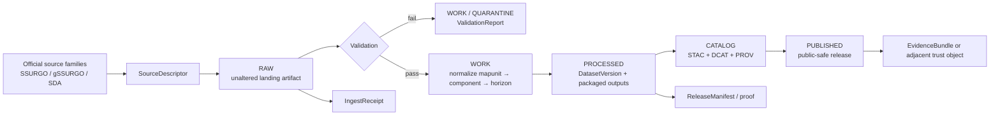

<!-- [KFM_META_BLOCK_V2]
doc_id: kfm://doc/NEEDS-VERIFICATION
title: Soils Pipelines
type: standard
version: v1
status: draft
owners: NEEDS VERIFICATION
created: YYYY-MM-DD
updated: YYYY-MM-DD
policy_label: public
related: [NEEDS VERIFICATION: docs/domains/soils/README.md, NEEDS VERIFICATION: docs/domains/README.md, kfm://doc/KFM_Canonical_Master_Reference_Manual_Integrated_Replacement_2026-03-14]
tags: [kfm, soils, pipelines, ssurgo, gssurgo, stac, prov]
notes: [Current-session workspace verification was PDF-only; exact repo inventory, owners, schemas, tests, and workflow files still need mounted-repo verification.]
[/KFM_META_BLOCK_V2] -->

# Soils Pipelines

Governed intake, normalization, packaging, and publication guidance for Kansas soils data in KFM.

> [!NOTE]
> **Status:** experimental  
> **Owners:** NEEDS VERIFICATION  
>      
> **Quick jumps:** [Scope](#scope) · [Repo fit](#repo-fit) · [Current verified basis](#current-verified-basis) · [Accepted inputs](#accepted-inputs) · [Exclusions](#exclusions) · [Directory tree](#directory-tree) · [Quickstart](#quickstart) · [Usage](#usage) · [Diagram](#diagram) · [Reference tables](#reference-tables) · [Task list](#task-list--definition-of-done) · [FAQ](#faq) · [Appendix](#appendix)  
> **Repo fit:** `docs/domains/soils/pipelines/README.md` → upstream: **NEEDS VERIFICATION** · downstream: **NEEDS VERIFICATION**

> [!IMPORTANT]
> This directory should function as a **pipeline lane**, not as a second soils theory manual and not as a catch-all agriculture notebook. Keep it centered on source contracts, transforms, packaging, validation, and release-facing proof.

> [!WARNING]
> Current-session verification exposed a **PDF-only evidence corpus**, not a mounted repository tree. Treat owners, adjacent file inventory, exact schema filenames, CI workflow names, test coverage, and live connector maturity as **NEEDS VERIFICATION** until directly inspected.

## Scope

This README is the pipeline-facing guide for soils work in KFM.

It exists to help maintainers answer questions such as:

- which source families belong in the soils lane
- how soils data should move through the KFM truth path
- which identifiers, joins, and weighted properties matter operationally
- which proof objects should accompany intake, transformation, and publication
- which outputs are acceptable for governed release versus internal work

In this lane, **soils** means operational handling of Kansas soils datasets and related packaging, especially where source identity, join semantics, raster/vector derivation, and release evidence matter.

This file is not the owner of:

- the entire agriculture / rural-production lane
- public-facing soils storytelling
- generic GIS tutorials
- broad hydrology, groundwater, or climate doctrine
- implementation claims that are not directly verified in the current session

## Repo fit

| Path | Role | Relationship |
| --- | --- | --- |
| `docs/domains/soils/pipelines/README.md` | this file | directory README for soils pipeline material |
| `NEEDS VERIFICATION: docs/domains/soils/README.md` | likely domain parent | use when the question is soils lane scope rather than pipeline mechanics |
| `NEEDS VERIFICATION: docs/domains/README.md` | likely domains hub | use when the question is cross-domain placement |
| `NEEDS VERIFICATION: contracts/*` | likely downstream contract surface | use when machine-checkable schemas are surfaced |
| `NEEDS VERIFICATION: tests/*` | likely downstream validation surface | use when fixtures, policy checks, or proof tests are surfaced |
| `NEEDS VERIFICATION: release/* or catalogs/*` | likely downstream publication surface | use for catalog closure, manifests, and release-facing proof |

## Current verified basis

| Item | Verified state | Notes |
| --- | --- | --- |
| Target file path | **CONFIRMED** | The task explicitly names `docs/domains/soils/pipelines/README.md` |
| KFM governed truth path | **CONFIRMED** | Source edge → RAW → WORK / QUARANTINE → PROCESSED → CATALOG → PUBLISHED |
| Soils as a structural Kansas lane | **CONFIRMED** | The corpus treats agriculture / soils as a real operating lane, not decorative content |
| Soils publication burden | **CONFIRMED** | Groundwater, erosion, and soil-moisture gaps remain active priorities; modeled and observed layers must stay distinct |
| Existing repo inventory under `docs/domains/soils/` | **UNKNOWN** | No mounted repo tree was directly visible in this session |
| Existing schemas, fixtures, tests, and workflows for soils | **UNKNOWN** | No mounted contract or CI inventory was directly visible |
| Live connector maturity for soils sources | **UNKNOWN** | Planning notes are strong; current implementation depth still needs direct verification |

## Accepted inputs

Place material here when it is primarily about **how soils data move through KFM**:

- source descriptors for SSURGO, gSSURGO, Soil Data Access, SSURGO Portal, and related Kansas soils inputs
- SQL or transform notes for `mapunit` → `component` → `horizon` joins
- weighting rules for map-unit summaries and horizon-derived properties
- packaging rules for vector, tabular, and raster outputs
- validation rules, quarantine triggers, and release gates
- STAC / DCAT / PROV closure examples for soils artifacts
- run receipts, ingest receipts, validation reports, and release-facing proof examples
- small fixtures, examples, or schema notes that make the lane reviewable and reproducible

## Exclusions

Do **not** place the following here:

- broad agronomy or soils science primers with no pipeline consequence
- public story-node or interpretive narrative copy for soils
- hydrology, groundwater, or soil-moisture analysis that belongs to another owner lane unless it is directly tied to soils pipeline packaging
- generic GIS tool walkthroughs that are not KFM-soils specific
- unsupported claims that a connector, workflow, schema, or release path already exists
- copied upstream federal documentation dumps
- modeled layers presented as if they were the same thing as official survey facts

## Directory tree

Only the README path itself is directly anchored by the task. The minimal tree below is a **PROPOSED working shape**, not a claim that these paths already exist in the mounted repo.

```text
docs/
└── domains/
    └── soils/
        └── pipelines/
            ├── README.md
            ├── source-descriptors/         # PROPOSED
            ├── sql/                        # PROPOSED
            ├── examples/                   # PROPOSED
            ├── fixtures/                   # PROPOSED
            ├── schemas/                    # PROPOSED
            ├── receipts/                   # PROPOSED
            └── notes/                      # PROPOSED
```

## Quickstart

Start from the smallest governed path that can prove the soils lane without bluffing about repo maturity.

### 1. Declare the source before you fetch it

Use a source descriptor first.

```yaml
source_id: usda.nrcs.ssurgo
title: SSURGO survey-area package
provider: USDA NRCS
access_mode: download
cadence: annual-refresh-aware
support: survey-area package
modeled_vs_observed: official-survey
publication_intent: candidate-for-kfm-soils-lane
rights_posture: NEEDS-VERIFICATION
validation_plan:
  - identity
  - schema-shape
  - join-key-integrity
  - weighted-summary-checks
```

### 2. Land the raw source unchanged

Use KFM’s canonical path.

```text
Source edge
  ↓
RAW
  - original package, query snapshot, or portal export
  - no silent field renames
  - integrity metadata captured immediately
```

### 3. Normalize the canonical join spine in WORK

The corpus strongly points to a join spine centered on map units, components, and horizons.

```sql
-- illustrative skeleton only; exact field inventory still needs mounted verification
SELECT
  mu.mukey,
  mu.musym,
  mu.muname,
  c.cokey,
  c.compname,
  c.comppct_r,
  ch.chkey,
  ch.hzname,
  ch.hzdept_r,
  ch.hzdepb_r,
  ch.awc_r,
  ch.ksat_r,
  ch.sandtotal_r,
  ch.silttotal_r,
  ch.claytotal_r
FROM mapunit mu
JOIN component c
  ON c.mukey = mu.mukey
JOIN chorizon ch
  ON ch.cokey = c.cokey;
```

### 4. Emit proof objects, not just files

At minimum, plan for a receipt shape like this.

```json
{
  "source_id": "usda.nrcs.ssurgo",
  "spec_hash": "sha256:REPLACE-ME",
  "fetched_at": "YYYY-MM-DDTHH:MM:SSZ",
  "artifacts": [
    {
      "kind": "components_parquet",
      "sha256": "REPLACE-ME"
    },
    {
      "kind": "mukey_raster_cog",
      "sha256": "REPLACE-ME"
    }
  ],
  "result": "candidate",
  "status": "NEEDS-VERIFICATION"
}
```

### 5. Publish only after closure and review

A soils build is not “done” when a file exists. It is done when the candidate can prove:

1. source identity
2. transform lineage
3. validation outcome
4. deterministic versioning or spec hashing
5. outward catalog closure
6. policy-safe publication posture

> [!IMPORTANT]
> Do not let a gridded convenience layer, a thematic raster, or a modeled adjunct silently replace the underlying official survey fact. KFM’s soils lane must preserve the difference.

## Usage

### Baseline operating pattern

Use this directory to explain and constrain the pipeline, not to decorate it.

| Question | What this lane should answer |
| --- | --- |
| Where did the soils data come from? | Source family, release context, access mode, and rights posture |
| What joins and transforms define the candidate dataset? | `mukey`, `cokey`, `chkey`, weighting rules, selected property fields |
| What was built? | vector, tabular, raster, and closure artifacts |
| What gates were applied? | validation, quarantine triggers, proof objects, and release criteria |
| What is still unverified? | owners, adjacent files, workflow names, tests, and mounted schema inventory |

### Baseline source stack

| Source family | Lane role | Posture here | Handling note |
| --- | --- | --- | --- |
| SSURGO | authoritative vector + tabular survey-area source | **CONFIRMED / baseline** | treat as a primary official soils source family |
| Soil Data Access (SDA) | ad hoc tabular / spatial query surface | **CONFIRMED / baseline** | useful for request-scoped extraction; still requires source declaration and receipts |
| gSSURGO | statewide gridded derivative packaging | **CONFIRMED / baseline** | derived from SSURGO; preserve release linkage and do not blur it with raw source identity |
| SSURGO Portal | packaging / import convenience layer | **INFERRED / useful adjunct** | treat portal-mediated outputs as convenience products, not as an excuse to skip lineage |
| Kansas soils resources / EO products | lane adjacencies | **CONFIRMED as source family category** | use only with explicit modeled-vs-observed separation and publication burden notes |

### Truth-path handling for soils

| Stage | What belongs here | Must emit or prove |
| --- | --- | --- |
| Source edge | official source reference, version clue, endpoint or package identity | SourceDescriptor |
| RAW | unchanged package, query payload, portal export, or other raw landing artifact | IngestReceipt |
| WORK / QUARANTINE | joins, normalization, field harmonization, weighting, quarantine of bad records | ValidationReport |
| PROCESSED | stable candidate tables, packaged vectors, candidate rasters | DatasetVersion |
| CATALOG | outward closure and lineage linkage | STAC + DCAT + PROV via CatalogClosure |
| PUBLISHED | public-safe release artifacts and discovery links | ReleaseManifest / proof bundle |

### Normalized field families

The exact mounted schema is still **UNKNOWN**, but the soils lane should stay explicit about the kinds of fields it owns.

| Field family | Typical members | Why they matter |
| --- | --- | --- |
| Identity / joins | `mukey`, `cokey`, `chkey`, `areasymbol` | preserve reproducible joins across map unit, component, and horizon levels |
| Map-unit description | `musym`, `muname`, hydrologic grouping, hydric indicators | supports stable subject identity and outward interpretation |
| Weighted soil properties | AWC, Ksat, texture fractions, OM, pH, drainage | supports derived summaries without flattening source detail silently |
| Geometry / raster linkage | polygon geometry, map-unit raster references, CRS frame | keeps vector and raster products aligned |
| Lineage / release | `source_uri`, `product_version`, `etag`, `spec_hash`, `run_receipt` | keeps the lane auditable and diffable |

### Packaging pattern

| Output need | Preferred pattern | Posture |
| --- | --- | --- |
| Reviewable vector/tabular candidate | GeoPackage or GeoParquet | **PROPOSED** until mounted repo conventions are directly verified |
| Rasterized map-unit surface or thematic derivative | COG | **PROPOSED** |
| Discovery and outward metadata | STAC + DCAT + PROV | **CONFIRMED doctrinal requirement** |
| Intake / build / publish proof | SourceDescriptor, IngestReceipt, ValidationReport, DatasetVersion, CatalogClosure, ReleaseManifest / proof | **CONFIRMED doctrinal family** |
| Runtime claim support | EvidenceBundle or adjacent trust object | **CONFIRMED doctrinal family** |

### Modeled vs observed separation

The soils lane must keep this distinction visible.

| Layer type | Example | Rule |
| --- | --- | --- |
| Official survey fact | SSURGO map units, components, horizons | may anchor canonical soils facts |
| Official gridded derivative | gSSURGO statewide grids or rasterized map-unit products | derived, useful, but still not the same thing as raw survey identity |
| Modeled or analytic adjunct | erosion surfaces, EO-derived covariates, soil-moisture estimates, forecast layers | never overwrite official survey fact; must remain visibly tagged as modeled / derived |

### Change detection and release guardrails

Use content-aware release logic rather than timestamp theater.

- prefer deterministic hashes or other stable version markers over “file changed” alone
- capture source version clues such as release context, ETag, or comparable request metadata
- quarantine when join integrity, weighted summaries, or required field ranges fail
- fail closed when source identity, proof objects, or publication posture are missing
- treat annual refreshes and interpretation updates as real release events, not background noise

## Diagram



## Reference tables

### Contract objects that should show up in this lane

| Contract family | Why soils pipelines need it |
| --- | --- |
| SourceDescriptor | declare source identity, cadence, semantics, rights posture, and validation plan |
| IngestReceipt | prove a fetch or landing actually happened |
| ValidationReport | make quarantine, failure, and pass results legible |
| DatasetVersion | carry a stable candidate or promoted subject set |
| CatalogClosure | bind soils artifacts into STAC / DCAT / PROV closure |
| ReleaseManifest / proof | prove public-safe promotion rather than mere file existence |
| EvidenceBundle | support outward claims, exports, or assistant-facing summaries when applicable |

### Do-not-blur rules

| Blur risk | Reject this | Prefer this instead |
| --- | --- | --- |
| Raw source vs derivative | “the raster is the source” | “the raster is a derived release linked to the source descriptor and dataset version” |
| Official vs modeled | “soil moisture layer equals survey fact” | “soil-moisture layer is a modeled or adjacent analytic layer” |
| Candidate vs published | “artifact written = published” | “artifact written, validated, catalog-closed, reviewed, then published” |
| Directory intent vs catch-all notes | “misc soils notebook” | “pipeline contracts, transforms, gates, and packaging guidance” |

## Task list / definition of done

- [ ] The lane states its scope without turning into a second agriculture manual
- [ ] Every admitted source family has a descriptor or an explicit placeholder for one
- [ ] The `mapunit` / `component` / `horizon` join spine is documented clearly enough to review
- [ ] Weighted-summary rules are stated, versioned, and testable
- [ ] Modeled versus observed soils-adjacent layers are visibly separated
- [ ] One candidate artifact set is defined for vector/tabular delivery
- [ ] One candidate artifact set is defined for raster delivery where needed
- [ ] STAC / DCAT / PROV closure expectations are explicit
- [ ] Fail-closed conditions for missing identity, rights posture, validation, or proof are explicit
- [ ] Any statement about current implementation depth beyond PDF-visible evidence is marked **UNKNOWN** or **NEEDS VERIFICATION**

## FAQ

### Why not publish directly from Soil Data Access queries?

Because KFM’s doctrine requires source declaration, validation, lineage, and release-facing proof. A successful query alone is not a publish event.

### Why keep both vector/tabular and raster outputs?

Because they serve different jobs. Vector/tabular products preserve subject-level and join-level detail. Raster products support map surfaces and some analytic or portrayal use cases. One should not silently replace the other.

### Is soil moisture part of this README?

Only when it affects soils pipeline packaging or adjacent release logic. Broad soil-moisture monitoring and hydrologic interpretation should live with the owner lane that actually governs those behaviors.

### Why is so much marked NEEDS VERIFICATION?

Because the current session surfaced doctrine-rich PDFs, not a mounted repo tree. This README is meant to be commit-ready after direct repo verification, not persuasive fiction.

### Why not let gSSURGO or another gridded product become the sole canonical object?

Because KFM’s evidence posture depends on keeping authoritative source identity and derived packaging distinct. Convenience should not erase provenance.

## Appendix

<details>
<summary><strong>Illustrative source-descriptor checklist</strong></summary>

A soils source descriptor should normally make the following explicit:

- source identity and steward
- access mode and cadence
- support / grain
- CRS or spatial frame where relevant
- modeled-vs-observed tag
- rights, attribution, redistribution, and sensitivity posture
- validation checks
- lineage expectations
- publication intent

</details>

<details>
<summary><strong>Illustrative release-facing fields for a soils candidate package</strong></summary>

```text
stable_id
version_id
source_id
areasymbol_or_scope
spec_hash
artifact_paths
artifact_hashes
validation_status
modeled_vs_observed
rights_posture
catalog_refs
run_receipt_ref
```

</details>

<details>
<summary><strong>Notes for future hardening once the repo is directly mounted</strong></summary>

Potential follow-on additions, all still **NEEDS VERIFICATION** until directly inspected:

- actual adjacent links to soils-domain parent docs
- mounted schema filenames and fixture locations
- CI workflow names for policy and catalog gates
- example receipts from a real soils build
- one release proof pack or correction drill for the soils lane
- one generalized-versus-precise publication example where rights or sensitivity demand it

</details>

[Back to top](#soils-pipelines)
