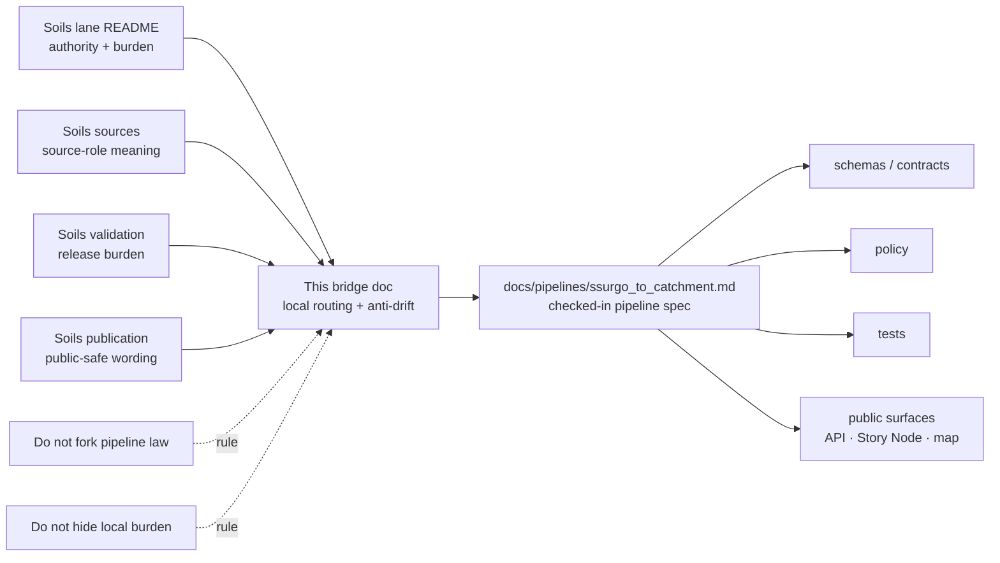

<!-- [KFM_META_BLOCK_V2]
doc_id: kfm://doc/<uuid-NEEDS-VERIFICATION>
title: Kansas Frontier Matrix — Soils — Pipelines — SSURGO to Catchment
type: standard
version: v1
status: draft
owners: @bartytime4life; NEEDS VERIFICATION
created: YYYY-MM-DD (NEEDS VERIFICATION)
updated: YYYY-MM-DD (NEEDS VERIFICATION)
policy_label: <public|restricted — NEEDS VERIFICATION>
related: [docs/domains/soils/README.md, docs/domains/soils/sources/README.md, docs/domains/soils/derived/README.md, docs/domains/soils/validation/README.md, docs/domains/soils/publication/README.md, docs/pipelines/README.md, docs/pipelines/ssurgo_to_catchment.md]
tags: [kfm, soils, pipeline-bridge, ssurgo, catchment]
notes: [Domain-local bridge doc. The checked-in human-readable pipeline specification currently lives under docs/pipelines/ssurgo_to_catchment.md. Resolve doc_id, dates, policy label, and narrower ownership before merge.]
[/KFM_META_BLOCK_V2] -->

# Kansas Frontier Matrix — Soils — Pipelines — SSURGO to Catchment

Domain-local bridge for the checked-in SSURGO→catchment pipeline specification, keeping the soils subtree navigable without creating a second source of pipeline truth.

> **Status:** `draft`  
> **Owners:** `@bartytime4life` · `NEEDS VERIFICATION`  
>       
> **Quick jumps:** [Scope](#scope) · [Repo fit](#repo-fit) · [Current public-main snapshot](#current-public-main-snapshot) · [Accepted inputs](#accepted-inputs) · [Exclusions](#exclusions) · [Directory tree](#directory-tree) · [Quickstart](#quickstart) · [Usage](#usage) · [Diagram](#diagram) · [Tables](#tables) · [Task list](#task-list) · [FAQ](#faq) · [Appendix](#appendix)  
> **Repo fit:** `docs/domains/soils/pipelines/ssurgo_to_catchment.md` · upstream [`../README.md`](../README.md) · local directory [`./README.md`](./README.md) · canonical pipeline spec [`../../../pipelines/ssurgo_to_catchment.md`](../../../pipelines/ssurgo_to_catchment.md)  
> **Accepted inputs:** local routing notes, soils-lane burden reminders, canonical-section pointers, path-normalization guidance, and anti-drift review prompts  
> **Exclusions:** duplicated stage logic, copied threshold tables, machine contracts, executable policy, workflow claims, and release/runtime proof

> [!IMPORTANT]
> **Bridge rule:** the checked-in human-readable pipeline specification currently lives at [`../../../pipelines/ssurgo_to_catchment.md`](../../../pipelines/ssurgo_to_catchment.md). This local file should point, constrain, and translate lane context — not restate the full pipeline law.

> [!CAUTION]
> If this bridge and the central pipeline doc diverge, treat the central pipeline doc as the stronger human-readable pipeline surface until repo owners intentionally normalize both pathing and ownership in the same review.

* * *

## Scope

This file exists to keep the soils subtree honest and easy to navigate.

It has a narrow job:

- route soils-lane readers to the substantive checked-in pipeline spec
- preserve soil-specific burden and anti-drift rules near the rest of the soils subtree
- make it obvious which changes belong here versus in the central pipeline doc
- prevent the soils lane from quietly forking its own pipeline authority

It does **not** try to replace the pipeline spec under `docs/pipelines/`.

### Truth posture used here

| Label | Meaning in this file |
| --- | --- |
| **CONFIRMED** | Visible in the current public repo surface reviewed for this revision |
| **INFERRED** | Strongly suggested by adjacent docs, but not proven as mounted implementation fact |
| **PROPOSED** | Recommended bridge behavior or tree-normalization move |
| **UNKNOWN** | Not verified strongly enough to present as settled |
| **NEEDS VERIFICATION** | Merge-time detail that should be checked before treating it as repo truth |

[Back to top](#kansas-frontier-matrix--soils--pipelines--ssurgo-to-catchment)

* * *

## Repo fit

| Item | Value |
| --- | --- |
| **Path** | `docs/domains/soils/pipelines/ssurgo_to_catchment.md` |
| **Role** | Domain-local bridge doc for the soils lane |
| **Stronger human-readable pipeline surface** | [`../../../pipelines/ssurgo_to_catchment.md`](../../../pipelines/ssurgo_to_catchment.md) |
| **Local directory contract** | [`./README.md`](./README.md) |
| **Soils-lane upstream** | [`../README.md`](../README.md) |
| **Source-role neighbor** | [`../sources/README.md`](../sources/README.md) |
| **Derived-output neighbor** | [`../derived/README.md`](../derived/README.md) |
| **Validation neighbor** | [`../validation/README.md`](../validation/README.md) |
| **Publication neighbor** | [`../publication/README.md`](../publication/README.md) |
| **Docs-wide pipeline contract** | [`../../../pipelines/README.md`](../../../pipelines/README.md) |
| **What belongs here** | routing, local burden reminders, link integrity, and anti-duplication guidance |
| **What belongs elsewhere** | overlay method, thresholds, example JSON, API posture, contracts, policy, tests, runtime proof |

This file is best read as a **subtree bridge**, not as a second canonical pipeline spec.

* * *

## Current public-main snapshot

| Surface | Current visible state | Why this bridge should stay narrow |
| --- | --- | --- |
| `docs/domains/soils/pipelines/ssurgo_to_catchment.md` | placeholder-level file before this revision | the local path needed substance, but not a duplicate full pipeline spec |
| `docs/domains/soils/pipelines/README.md` | placeholder-level directory README | local pipeline subtree contract is still thin |
| `docs/pipelines/README.md` | active directory contract for human-readable pipeline docs | pipeline-facing specs already have a stronger home |
| `docs/pipelines/ssurgo_to_catchment.md` | substantive checked-in child pipeline doc | full pipeline law already exists elsewhere in the repo |
| `docs/domains/soils/README.md` | names the central doc as related soil pipeline evidence | soils-lane routing already depends on the central path |
| `docs/domains/soils/sources/README.md` | lists the central doc as the adjacent pipeline note | source-role docs already point there |
| `docs/domains/soils/validation/README.md` | lists the central doc as the adjacent validation-facing pipeline note | validation docs already point there |

**Bridge implication:** this file should strengthen navigation and burden clarity while staying deliberately smaller than the central pipeline doc.

[Back to top](#kansas-frontier-matrix--soils--pipelines--ssurgo-to-catchment)

* * *

## Accepted inputs

The following belong here:

- local routing notes for soils-lane readers who need the catchment overlay pipeline
- soil-specific burden reminders that would be easy to lose in a docs-wide pipeline file
- canonical-section pointers into the checked-in central pipeline doc
- path-normalization notes if the repo later collapses local and central pipeline surfaces
- merge-time prompts that keep local docs from drifting away from the stronger pipeline surface
- small, human-readable reminders about where contracts, policy, tests, and runtime claims actually live

### Minimal questions this file should answer

1. Where should a soils maintainer read first for the real pipeline spec?
2. What does this local path own?
3. What should **not** be copied here?
4. Which neighboring soils docs should be checked before editing the pipeline lane?
5. What needs to change together if the canonical path moves?

* * *

## Exclusions

| Excluded material | Why it does not belong here | Put it in instead |
| --- | --- | --- |
| Full stage-by-stage pipeline law | already owned by the stronger checked-in pipeline doc | [`../../../pipelines/ssurgo_to_catchment.md`](../../../pipelines/ssurgo_to_catchment.md) |
| Machine contracts or JSON Schemas | this file is human-readable guidance, not machine law | `contracts/` / `schemas/` owner surfaces |
| Executable policy or Rego | local prose should not impersonate enforcement | `policy/` owner surfaces |
| Workflow depth or merge-gate claims | public docs already warn that workflow YAML coverage is not proven here | verified workflow / CI surfaces |
| Repeated example JSON, threshold tables, or API shapes from the central doc | duplication invites drift | central pipeline doc |
| Source acquisition logic | sources are already split into their own soils doc family | [`../sources/README.md`](../sources/README.md) |
| Publication wording or confidence phrasing rules | those belong in the publication burden doc | [`../publication/README.md`](../publication/README.md) |

> [!NOTE]
> A good bridge file reduces confusion. A bad bridge file quietly creates two competing versions of the same pipeline.

* * *

## Directory tree

### Recommended relationship to preserve

```text
docs/
├── pipelines/
│   ├── README.md
│   └── ssurgo_to_catchment.md              # stronger human-readable pipeline spec
└── domains/
    └── soils/
        ├── README.md
        ├── sources/
        │   └── README.md
        ├── derived/
        │   └── README.md
        ├── validation/
        │   └── README.md
        ├── publication/
        │   └── README.md
        └── pipelines/
            ├── README.md                   # local bridge-directory contract
            └── ssurgo_to_catchment.md      # this bridge file
```

### Normalization rule

If the repo later chooses **one** canonical home for this doc family, update:

- this bridge file
- `docs/domains/soils/README.md`
- `docs/domains/soils/sources/README.md`
- `docs/domains/soils/validation/README.md`
- any local directory README that still points at the old path

…in the **same PR**.

* * *

## Quickstart

Use this review order before editing the SSURGO→catchment lane.

1. Read the soil lane burden doc: [`../README.md`](../README.md)
2. Read the soil source-role doc: [`../sources/README.md`](../sources/README.md)
3. Read the stronger checked-in pipeline spec: [`../../../pipelines/ssurgo_to_catchment.md`](../../../pipelines/ssurgo_to_catchment.md)
4. Re-check derived/output posture: [`../derived/README.md`](../derived/README.md)
5. Re-check validation burden: [`../validation/README.md`](../validation/README.md)
6. Re-check publication posture: [`../publication/README.md`](../publication/README.md)

### Review-first shell commands

```bash
sed -n '1,240p' docs/domains/soils/README.md
sed -n '1,240p' docs/domains/soils/sources/README.md
sed -n '1,320p' docs/pipelines/ssurgo_to_catchment.md
sed -n '1,220p' docs/domains/soils/derived/README.md
sed -n '1,220p' docs/domains/soils/validation/README.md
sed -n '1,220p' docs/domains/soils/publication/README.md
```

[Back to top](#kansas-frontier-matrix--soils--pipelines--ssurgo-to-catchment)

* * *

## Usage

Use this file when you arrive from the soils subtree and need to answer:

- “Where is the real pipeline spec?”
- “What local soils burden should I keep in mind while reading it?”
- “Which neighboring docs should move with it if paths change?”

Do **not** use this file as the first place to edit:

- overlay stages
- rollup heuristics
- threshold tables
- example API shapes
- evidence object payloads
- Story Node behavior rules

Those already belong to the central checked-in pipeline doc.

### When this bridge earns a diff

A revision here is justified when:

- the canonical pipeline path changes
- soils-subtree links drift
- the bridge needs clearer edit-routing guidance
- the local placeholder state has become confusing to reviewers
- the repo intentionally decides whether this local path stays, redirects, or is removed

### When this bridge should stay untouched

Leave this file alone when the change is really about:

- source acquisition meaning
- derived-output burden
- validation thresholds
- publication wording
- machine contracts, policy, tests, or runtime proof
- the actual soil-to-catchment processing model

[Back to top](#kansas-frontier-matrix--soils--pipelines--ssurgo-to-catchment)

* * *

## Diagram



* * *

## Tables

### Edit-routing matrix

| If you are changing… | Start here | Stronger destination |
| --- | --- | --- |
| local soils-subtree navigation | this file | keep bridge links correct |
| source-role meaning for SSURGO / SDA / gSSURGO | [`../sources/README.md`](../sources/README.md) | source-role docs |
| catchment overlay flow, stages, or evidence shape | [`../../../pipelines/ssurgo_to_catchment.md`](../../../pipelines/ssurgo_to_catchment.md) | central pipeline doc |
| derived-product burden | [`../derived/README.md`](../derived/README.md) | derived docs |
| validation thresholds or fail-closed burden | [`../validation/README.md`](../validation/README.md) | validation docs |
| publication wording or caution language | [`../publication/README.md`](../publication/README.md) | publication docs |
| machine-readable contracts, policy, or proofs | repo owner surfaces | `schemas/`, `contracts/`, `policy/`, `tests/` |

### Canonical section index

| Need | Read this section first |
| --- | --- |
| what the pipeline produces | [`../../../pipelines/ssurgo_to_catchment.md#scope`](../../../pipelines/ssurgo_to_catchment.md#scope) |
| accepted inputs and exclusions | [`#accepted-inputs`](../../../pipelines/ssurgo_to_catchment.md#accepted-inputs) · [`#exclusions`](../../../pipelines/ssurgo_to_catchment.md#exclusions) |
| truth-path flow | [`#pipeline-flow`](../../../pipelines/ssurgo_to_catchment.md#pipeline-flow) |
| stage sequence | [`#pipeline-stages`](../../../pipelines/ssurgo_to_catchment.md#pipeline-stages) |
| derived row shape | [`#catchmentsoils-derived-record-shape`](../../../pipelines/ssurgo_to_catchment.md#catchmentsoils-derived-record-shape) |
| evidence drill-through | [`#evidenceref--evidencebundle-pattern`](../../../pipelines/ssurgo_to_catchment.md#evidenceref--evidencebundle-pattern) |
| fail-closed gates | [`#validation-and-fail-closed-gates`](../../../pipelines/ssurgo_to_catchment.md#validation-and-fail-closed-gates) |
| publication/API posture | [`#api-and-publication-posture`](../../../pipelines/ssurgo_to_catchment.md#api-and-publication-posture) |
| Story Node behavior | [`#story-node--ui-behavior`](../../../pipelines/ssurgo_to_catchment.md#story-node--ui-behavior) |
| review order | [`#review-first-quickstart`](../../../pipelines/ssurgo_to_catchment.md#review-first-quickstart) |

* * *

## Task list

- [ ] Resolve meta-block placeholders for `doc_id`, dates, and policy label before merge.
- [ ] Confirm whether this local path is meant to remain a permanent bridge or is only an interim normalization aid.
- [ ] Keep the central pipeline link accurate if `docs/pipelines/ssurgo_to_catchment.md` moves.
- [ ] Update all soils-subtree references in the same PR if the canonical path changes.
- [ ] Do not copy central threshold tables, example payloads, or pipeline stages into this bridge unless the repo intentionally changes ownership.
- [ ] Consider upgrading `docs/domains/soils/pipelines/README.md` so the local directory contract matches the new bridge behavior.

* * *

## FAQ

### Why not just copy the whole pipeline spec here?

Because the repo already has a checked-in human-readable pipeline spec under `docs/pipelines/`. Copying it into the soils subtree would create two reviewable texts that could drift out of sync.

### Why keep a local file at all?

Because soils-lane readers naturally navigate inside `docs/domains/soils/`. A small bridge doc reduces search friction and keeps local burden visible without forking authority.

### What wins if this file and the central pipeline doc disagree?

The central checked-in pipeline doc wins until repo owners intentionally normalize both surfaces together.

### Should this bridge name machine contracts or workflow gates?

Only by pointer. Exact contract filenames, executable policy bundles, and merge-blocking workflow depth belong to their stronger owner surfaces.

### What is the highest-value next improvement after this bridge?

Either resolve whether this local bridge path is permanent, or upgrade the local `pipelines/README.md` so the bridge directory has an explicit local contract instead of a placeholder.

[Back to top](#kansas-frontier-matrix--soils--pipelines--ssurgo-to-catchment)

* * *

## Appendix

<details>
<summary>Merge-time review prompts</summary>

Before approving a change to this file, ask:

1. Does `../../../pipelines/ssurgo_to_catchment.md` still exist and still behave as the stronger human-readable pipeline spec?
2. Do the soils subtree docs still point to the same canonical pipeline path?
3. Did this bridge accidentally duplicate stage logic, thresholds, example JSON, or publication shapes that belong in the central doc?
4. Are all remaining placeholders clearly marked as `NEEDS VERIFICATION` rather than smoothed into fact?
5. If the repo wants only one canonical path, does this PR also update the local subtree so reviewers are not left with split routing?

</details>

<details>
<summary>Why this bridge is intentionally smaller than the central pipeline doc</summary>

The stronger checked-in pipeline spec already carries the heavy material:

- overlay purpose and scope
- accepted inputs and exclusions
- truth-path flow
- stage sequence
- rollup heuristics
- derived row shape
- evidence object pattern
- fail-closed validation gates
- illustrative publication/API posture
- Story Node behavior

This local file is deliberately scoped to routing and anti-drift so that soils-lane documentation stays coherent.

</details>

[Back to top](#kansas-frontier-matrix--soils--pipelines--ssurgo-to-catchment)
