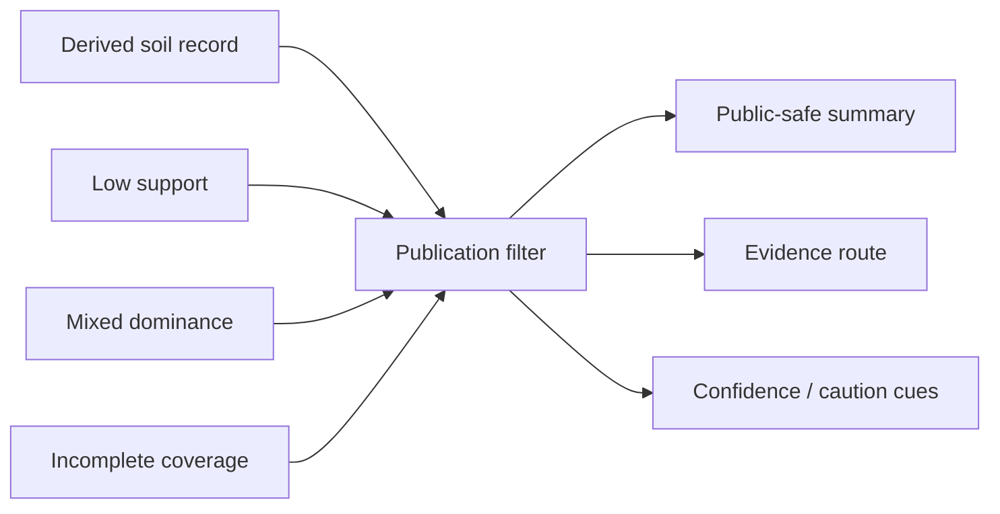

<!-- [KFM_META_BLOCK_V2]
doc_id: kfm://doc/NEEDS-VERIFICATION
title: Kansas Frontier Matrix — Soils — Publication
type: standard
version: v1
status: draft
owners: [@bartytime4life, NEEDS VERIFICATION]
created: 2026-04-01
updated: 2026-04-01
policy_label: public
related: [
  "../README.md",
  "../derived/README.md",
  "../validation/README.md",
  "../../../governance/ETHICS.md",
  "../../../governance/ROOT_GOVERNANCE.md"
]
tags: [kfm, soils, publication, public-safe, evidence, caution, release]
notes: [
  "Requested as part of the user-directed soils module build.",
  "This subtree is PROPOSED; exact live pathing and owners NEED VERIFICATION.",
  "Publication guidance is bounded by visible governance doctrine and avoids claiming exact machine enforcement."
]
[/KFM_META_BLOCK_V2] -->

# Kansas Frontier Matrix — Soils — Publication

Publication README for public-safe soil summaries, evidence visibility, caution language, downgrade rules, and release posture for soil-derived surfaces.

| Status | Owners | Quick fit |
|---|---|---|
|     | @bartytime4life, NEEDS VERIFICATION | Public-safe output posture for soil summaries shown in maps, cards, dossiers, APIs, and story surfaces |

**Purpose:** explain how soil information may be shown downstream without overstating certainty or letting derived convenience masquerade as source truth.  
**Repo fit:** child page under `docs/domains/soils/`; upstream [`../README.md`](../README.md).  
**Accepted inputs:** publication defaults, caution cues, example phrasing, exposure classes, and downgrade rules.  
**Exclusions:** source acquisition, low-level validation internals, and machine policy.

**Quick jumps:** [Scope](#scope) · [Repo fit](#repo-fit) · [Accepted inputs](#accepted-inputs) · [Exclusions](#exclusions) · [Directory tree](#directory-tree) · [Quickstart](#quickstart) · [Usage](#usage) · [Diagram](#diagram) · [Tables](#tables) · [Task list](#task-list) · [FAQ](#faq)

> [!IMPORTANT]
> **Publication rule:** users should see the reporting unit, confidence posture, and evidence route before they are encouraged to trust a soil conclusion.

## Scope

This page documents the publication burden for soil-derived outputs used in:

- maps
- place cards
- dossiers
- story nodes
- governed APIs
- summary exports

It focuses on what can be said, how much certainty can be implied, and what must stay visible.

## Repo fit

| Item | Value |
|---|---|
| Path | `docs/domains/soils/publication/README.md` |
| Path status | **PROPOSED / NEEDS VERIFICATION** |
| Upstream | [`../README.md`](../README.md) · [`../derived/README.md`](../derived/README.md) |
| Governance anchors | [`../../../governance/ETHICS.md`](../../../governance/ETHICS.md) · [`../../../governance/ROOT_GOVERNANCE.md`](../../../governance/ROOT_GOVERNANCE.md) |
| Adjacent | [`../validation/README.md`](../validation/README.md) |

## Accepted inputs

- public-safe defaults
- caution wording
- confidence-display rules
- mixed-case and low-coverage handling
- evidence-drawer expectations
- release examples and anti-examples

## Exclusions

| Exclusion | Why |
|---|---|
| Source classification | belongs in the sources child page |
| Threshold internals | belongs in validation and policy surfaces |
| Full machine decision logic | belongs in policy/contracts/tests |

## Directory tree

```text
docs/domains/soils/
├── publication/
│   └── README.md
├── validation/
│   └── README.md
└── derived/
    └── README.md
```

## Quickstart

1. Say what unit is being summarized.
2. Keep the output visibly derived.
3. Show confidence or caution.
4. Expose the evidence route.
5. Prefer bounded language over sweeping claims.

## Usage

Use this page when designing soil-facing map labels, cards, API payload summaries, or editorial copy. Soil publication should not erase heterogeneity, weak support, or derivation.

## Diagram



## Tables

### Public-safe default patterns

| Pattern | Why it is safer |
|---|---|
| “This area is summarized from soil survey units…” | keeps derivation visible |
| “Primary soil group is C, with mixed support” | avoids false singularity |
| “Coverage is partial; treat as low confidence” | exposes incompleteness |
| “See contributing units and method” | keeps evidence one hop away |

### Anti-patterns

| Anti-pattern | Why it weakens trust |
|---|---|
| “The soil here is X.” | implies uniform certainty |
| “This place has soil group C.” | hides mixture and reporting-unit semantics |
| “Suitable / unsuitable” with no evidence path | overcompresses decision burden |
| “Predicted” outputs phrased as surveyed fact | collapses model and survey roles |

### Suggested exposure classes

| Class | Meaning | Status |
|---|---|---|
| public-safe | general summary with evidence route | **INFERRED** |
| generalized | reduced precision / compressed wording | **INFERRED** |
| steward-only | narrower or review-bearing context | **INFERRED** |
| withheld | not shown publicly due to burden or support gap | **INFERRED** |

## Task list

- [ ] Verify whether exposure-class vocabulary is already standardized elsewhere
- [ ] Align examples with live product surfaces if present
- [ ] Add exact evidence-surface links once verified
- [ ] Keep public phrasing bounded and non-sovereign
- [ ] Ensure mixed and low-coverage cases have visible cues

## FAQ

### Can public copy ever sound definitive?

Only when support is strong and even then it should stay tied to the reporting unit and evidence route.

### What should happen to weak dominance cases?

Prefer mixed wording or caution, not false singularity.

### Should modeled suitability be shown here?

Only if it is clearly labeled modeled and not confused with surveyed soil truth.
