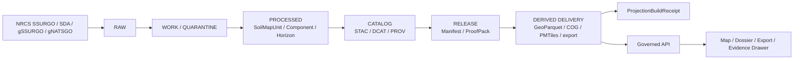

<!-- [KFM_META_BLOCK_V2]
doc_id: kfm://doc/TODO-UUID
title: Soils — Publication / Derived
type: standard
version: v1
status: draft
owners: TODO-NEEDS-VERIFICATION
created: TODO-YYYY-MM-DD
updated: TODO-YYYY-MM-DD
policy_label: TODO-NEEDS-VERIFICATION
related: [TODO-NEEDS-VERIFICATION]
tags: [kfm, soils, publication, derived]
notes: [Target path is confirmed by the request; owners, dates, adjacent repo docs, and local artifact inventory were not surfaced in the current workspace.]
[/KFM_META_BLOCK_V2] -->

<a id="top"></a>

# Soils — Publication / Derived

Govern the outward-facing, release-scoped derived assets of the KFM soils lane so they remain inspectable, policy-aware, and visibly downstream of authoritative soil truth.

> **Status:** experimental  
> **Owners:** TODO — NEEDS VERIFICATION  
>      
> **Quick jumps:** [Scope](#scope) · [Repo fit](#repo-fit) · [Quickstart](#quickstart) · [Diagram](#diagram) · [Tables](#tables) · [Task list](#task-list--definition-of-done) · [FAQ](#faq) · [Appendix](#appendix)

> [!IMPORTANT]
> This README is grounded in the attached KFM corpus, but the current workspace did **not** surface a mounted repository tree or sibling files under this directory. The target path is confirmed by the request; owners, adjacent links, local workflow commands, and current artifact inventory remain **UNKNOWN** until reverified.

## Scope

This directory is the contract surface for **derived soils publication**, not the home of raw source landings or canonical soil truth.

In KFM terms, this means the material here should be built only from **promoted soils release scope**, carry explicit lineage and publication state, and stay visibly separate from authoritative upstream soil records. A successful build is not enough on its own; outward use still depends on catalog closure, proof objects, and policy-safe release state.

This README uses KFM trust labels when precision matters:

- **CONFIRMED** — directly supported by surfaced project evidence in this session
- **INFERRED** — strongly implied by the corpus, but not directly surfaced as mounted implementation
- **PROPOSED** — recommended directory behavior or packaging choice, not yet proven in repo runtime
- **UNKNOWN** — not verified from the current workspace
- **NEEDS VERIFICATION** — explicitly queued for reviewer confirmation before being treated as settled

## Repo fit

| Item | Value |
|---|---|
| **Path** | `docs/domains/soils/publication/derived/README.md` |
| **Directory role** | Defines what belongs in the soils lane’s outward-facing **derived delivery** layer |
| **Upstream truth objects** | Promoted soils `DatasetVersion` objects, `CatalogClosure`, `DecisionEnvelope` / `ReviewRecord` where required, `ReleaseManifest` / `ReleaseProofPack` |
| **Downstream trust surfaces** | Governed API, Map Explorer, Dossier, Export, Evidence Drawer, and any other public-safe shell surface admitted for the soils lane |
| **Adjacent parent docs** | **UNKNOWN** — parent README files were not surfaced in the current workspace |
| **Local artifact inventory** | **UNKNOWN** — no mounted files under this directory were surfaced in the current workspace |

### Upstream / downstream logic

**Upstream:** this directory should inherit only from **released soils scope**. It should never back-reference RAW or WORK artifacts as if they were publishable.

**Downstream:** anything linked from here should be safe to hand to discovery, rendering, export, or evidence-resolution surfaces without letting derived convenience masquerade as canonical truth.

## Accepted inputs

This directory accepts release-scoped material such as:

- derived soils assets built from promoted scope, such as:
  - soil metrics in **GeoParquet**
  - rasterized soil grids in **COG**
  - thin-client delivery packages such as **PMTiles**
  - export-oriented bundles with explicit release linkage
- outward metadata closure for those assets:
  - **STAC**
  - **DCAT**
  - **PROV**
  - run receipts or equivalent release-linked proof artifacts
- release-facing evidence objects:
  - `ProjectionBuildReceipt`
  - `ReleaseManifest`
  - `ReleaseProofPack`
  - correction or supersession records
- context layers admitted into a soils publication flow only when explicitly declared, such as:
  - `gSSURGO` / `gNATSGO` gridded context
  - production context from `NASS`
  - soil-moisture context
  - other modeled or assimilated context layers, **only when their knowledge character stays visible**

## Exclusions

This directory is **not** the home for:

- raw SSURGO bundles, live SDA scratch pulls, or source-onboarding notes  
  _Those belong upstream with source descriptors, ingest receipts, and RAW / WORK handling._
- canonical relational soil truth itself  
  _That belongs in the authoritative/canonical build path, not the derived delivery layer._
- unpublished experiments, QA scratch rasters, notebook outputs, or temporary joins  
  _Those belong in WORK / QUARANTINE or reviewer-only artifact space._
- silent mixes of `SSURGO`, `STATSGO`, `gSSURGO`, and `gNATSGO`  
  _Resolution choice and source basis must stay explicit._
- modeled soil moisture or production context presented as if it were direct soil truth  
  _Observed vs modeled status must remain machine-readable and human-visible._
- UI-only screenshots, story polish, or map images with no evidence linkage  
  _Derived publication in KFM is evidence-bearing, not decorative._

## Directory tree

Confirmed from the current task only:

```text
docs/
└── domains/
    └── soils/
        └── publication/
            └── derived/
                └── README.md
```

<details>
<summary><strong>PROPOSED local expansion (do not treat as mounted repo fact)</strong></summary>

```text
docs/
└── domains/
    └── soils/
        └── publication/
            └── derived/
                ├── README.md
                ├── manifests/
                ├── stac/
                ├── dcat/
                ├── prov/
                ├── examples/
                └── corrections/
```

This is a packaging suggestion only. It is included to keep the directory logic clear during review, not to claim the repo already contains these paths.

</details>

## Quickstart

### Minimal authoring flow

1. Start from a **promoted soils release**, not from raw downloads or lane-local scratch outputs.
2. Declare the **surface class** you are publishing:
   - analytic/vector derivative
   - raster derivative
   - thin-client map delivery
   - export package
3. Record the **source basis** explicitly:
   - `SSURGO` / `SDA`
   - `gSSURGO` / `gNATSGO`
   - other contextual layers, if admitted
4. Keep **knowledge character** visible:
   - authoritative
   - derived
   - modeled / assimilated
   - supporting context
5. Link the publication object to its proof artifacts:
   - `DatasetVersion`
   - `CatalogClosure`
   - `ReleaseManifest` / `ReleaseProofPack`
   - `ProjectionBuildReceipt`
   - STAC / DCAT / PROV references
6. Publish only if the output is explicitly **public-safe** and correction-capable.

### Illustrative derived-publication entry

```yaml
surface_id: soils.ks.example
surface_class: geoparquet
knowledge_character: derived
release_ref: TODO-NEEDS-VERIFICATION
upstream_dataset_versions:
  - soils.ssurgo.ks.TODO-NEEDS-VERIFICATION
source_basis:
  authoritative:
    - USDA NRCS SSURGO
  contextual:
    - USDA NRCS SDA
resolution_choice: vector
lineage:
  projection_build_receipt: TODO-NEEDS-VERIFICATION
  release_manifest: TODO-NEEDS-VERIFICATION
  stac_item: TODO-NEEDS-VERIFICATION
  dcat_distribution: TODO-NEEDS-VERIFICATION
  prov_entity: TODO-NEEDS-VERIFICATION
publication_state: public-safe
correction_path: TODO-NEEDS-VERIFICATION
notes:
  - Do not treat this example as mounted repo state.
```

> [!TIP]
> Keep the illustrative entry small. The point is to make release scope, source basis, and proof objects impossible to miss.

## Usage

### What “derived” means here

In KFM, **derived** means downstream of authoritative release scope. It does **not** mean optional, throwaway, or exempt from review. It means the asset exists to serve discovery, rendering, export, or downstream queries while staying visibly attached to released evidence and policy state.

### What this directory should optimize for

This directory should help maintainers answer four questions fast:

1. **What is this derived soil artifact for?**
2. **What released soils scope does it depend on?**
3. **What proof objects make it publishable?**
4. **How does a reviewer or user trace it back when something goes wrong?**

### Truth-preserving hierarchy

> [!WARNING]
> `SSURGO` is a **relational model of soil reality**, not just a flat file. Flattening too early, rasterizing too early, or skipping component weighting can corrupt meaning. Where a derivative simplifies that structure, the simplification rule should stay visible.

Use this mental model when evaluating derived outputs:

```text
Map Unit → Component → Horizon
```

That hierarchy is upstream truth structure. Derived publication may summarize it, but should not erase that it existed.

### Scale and resolution discipline

A soils derivative must keep its scale choice visible.

- If the surface derives from `SSURGO` / `SDA`, say so.
- If the surface derives from `gSSURGO` or `gNATSGO`, say so.
- If different sources were combined, the mix must be explicit and justified.
- `SSURGO` and `STATSGO`-family products must **not** be blended silently.

### Knowledge-character discipline

A derived soils publication may include moisture, production, or earth-observation context, but it should never blur these together:

- direct soil survey truth
- gridded soil derivatives
- modeled / assimilated moisture context
- production or land-cover context

If a surface mixes them, the README should say **how** and **why**.

## Diagram



## Tables

### Surface classes and handling expectations

| Surface class | Typical artifact | Status in this draft | Must remain visible | Must not happen |
|---|---|---|---|---|
| Authoritative soils release | `DatasetVersion` + release-linked catalogs | **CONFIRMED** doctrinal role | source basis, time semantics, provenance | being stored here as if this directory were the canonical lane |
| Derived soil metrics | GeoParquet | **PROPOSED** local default | weighting rule, release ref, knowledge character | silently masquerading as canonical truth |
| Raster soil grids | COG | **PROPOSED** local default | source family, resolution choice, stale-after policy | hiding `SSURGO` vs `gSSURGO` / `gNATSGO` choice |
| Thin-client delivery | PMTiles or equivalent | **PROPOSED** local default | release ref, build receipt, style/version linkage | becoming the provenance anchor |
| Outward discovery records | STAC / DCAT / PROV | **CONFIRMED** artifact family | identifiers, lineage, license, access level | being omitted because the data “already exists” |

### Source-role reminders for the soils lane

| Source family | Working role | Publication note |
|---|---|---|
| `SSURGO` / `SDA` | authoritative vector / relational soil basis | preserve `mukey` / `cokey` logic and source provenance |
| `gSSURGO` / `gNATSGO` | gridded derivative or fallback context | keep resolution explicit and avoid silent replacement of `SSURGO` |
| `NASS` / production context | contextual production layer | useful, but not equal to soil truth |
| moisture context | observed or modeled support layer | must keep modeled-vs-observed status visible |
| Kansas or university mirrors | convenience / discovery surfaces | do not promote the mirror into the provenance anchor if origin authority is known |

### Proof objects that matter here

| Object | Why it belongs in a derived-publication flow |
|---|---|
| `DatasetVersion` | declares the promoted soils subject set that the derivative depends on |
| `CatalogClosure` | closes outward STAC / DCAT / PROV linkage |
| `ReleaseManifest` / `ReleaseProofPack` | makes publication a governed state transition instead of a file copy |
| `ProjectionBuildReceipt` | proves a derived surface was built from known release scope |
| `EvidenceBundle` | gives downstream surfaces a route back to support and preview-safe lineage |
| `CorrectionNotice` | preserves visible lineage if a derived layer is superseded, narrowed, or withdrawn |

## Task list / Definition of done

A derived-publication entry is not done until all applicable items below are true.

- [ ] The upstream soils **release scope** is named.
- [ ] The source family is explicit (`SSURGO`, `SDA`, `gSSURGO`, `gNATSGO`, or other admitted context).
- [ ] Resolution choice is explicit.
- [ ] Any flattening or weighting rule is stated.
- [ ] Observed vs modeled / assimilated distinctions remain visible where relevant.
- [ ] A `ProjectionBuildReceipt` or equivalent build proof is linked.
- [ ] STAC / DCAT / PROV closure is linked or clearly marked **NEEDS VERIFICATION**.
- [ ] The outward publication state is stated (`public-safe`, generalized, partial, stale-visible, or equivalent).
- [ ] Correction or rollback posture is named.
- [ ] The directory text does **not** imply mounted repo files, CI jobs, or live manifests that were not reverified.
- [ ] Owners, dates, and related links are reviewed before placeholders are removed.

### Minimum review gate

> [!CAUTION]
> A derived soil asset should not be treated as publishable merely because it exists, builds, or renders. In KFM, publication is a governed transition, not a side effect of processing.

## FAQ

### Is this directory authoritative soil truth?

No. This directory is for **derived publication**. Authoritative soil truth stays upstream in promoted soils `DatasetVersion` objects and related release scope.

### Can a `gSSURGO` or `gNATSGO` surface replace `SSURGO` in this directory?

Not silently. A gridded derivative may be the right delivery surface for a given use, but the source family and resolution choice must remain explicit.

### Can soil-moisture overlays be treated as part of the soil baseline?

Only if their knowledge character is visible. Soil moisture may be admitted as context, but observed and modeled layers must not be flattened into undifferentiated soil truth.

### If the artifact renders correctly, is it publishable?

No. Rendering proves usability, not admissibility. Release scope, proof objects, metadata closure, and public-safe policy state still matter.

## Appendix

<details>
<summary><strong>Illustrative field checklist for a derived-publication record</strong></summary>

| Field | Why it matters |
|---|---|
| `surface_id` | stable identity for the derived surface |
| `surface_class` | tells reviewers whether they are looking at vector, raster, tile, or export behavior |
| `knowledge_character` | keeps authoritative, derived, and modeled roles visible |
| `release_ref` | proves the derivative is downstream of promoted scope |
| `upstream_dataset_versions` | makes cross-release debugging possible |
| `source_basis` | prevents silent source-family drift |
| `projection_build_receipt` | carries build-time linkage proof |
| `stac_item` / `dcat_distribution` / `prov_entity` | closes outward metadata and lineage |
| `freshness_basis` | makes stale-state logic inspectable |
| `publication_state` | tells downstream surfaces what may be shown and how |
| `correction_path` | preserves lineage when supersession or narrowing happens |

</details>

<details>
<summary><strong>Review notes for this draft</strong></summary>

- **CONFIRMED:** KFM doctrine requires governed publication, authoritative-versus-derived separation, source-descriptor discipline, release-scoped derived delivery, and soils-specific publication cautions.
- **INFERRED:** this directory should function as the soils lane’s outward-facing derived-publication contract.
- **PROPOSED:** GeoParquet / COG / PMTiles are treated here as practical derived surface defaults because they fit the surfaced soils packaging guidance.
- **UNKNOWN:** current owners, sibling README files, local manifests, CI commands, and actual artifact inventory under this path.

</details>

[Back to top](#top)
