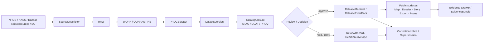

<!-- [KFM_META_BLOCK_V2]
doc_id: kfm://doc/NEEDS-VERIFICATION
title: Soils Publication
type: standard
version: v1
status: draft
owners: NEEDS VERIFICATION
created: YYYY-MM-DD
updated: YYYY-MM-DD
policy_label: NEEDS-VERIFICATION
related: [../README.md, ../../README.md, ../../../README.md]
tags: [kfm, soils, publication, evidence, release, stac, dcat, prov]
notes: [Target path was provided directly in the task; neighboring docs, owner assignments, dates, and policy label still need mounted-repo verification.]
[/KFM_META_BLOCK_V2] -->

# Soils Publication

Governed publication surface for KFM soils releases, closures, proof artifacts, and correction-linked outward documentation.

> [!NOTE]
> **Status:** experimental  
> **Owners:** NEEDS VERIFICATION  
>      
> **Quick jumps:** [Scope](#scope) · [Repo fit](#repo-fit) · [Accepted inputs](#accepted-inputs) · [Exclusions](#exclusions) · [Directory tree](#directory-tree) · [Quickstart](#quickstart) · [Usage](#usage) · [Diagram](#diagram) · [Tables](#tables) · [Task list & definition of done](#task-list--definition-of-done) · [FAQ](#faq) · [Appendix](#appendix)  
> **Repo fit:** `docs/domains/soils/publication/publication/README.md` → upstream: NEEDS VERIFICATION (`../README.md`, `../../README.md`, `../../../README.md`) · downstream: release packets, proof packs, catalog closures, corrections, and outward publication notes under this subtree

> [!IMPORTANT]
> This README treats **soils publication** as a governed state transition, not a file drop. Outward soils artifacts should resolve back to a `DatasetVersion`, `CatalogClosure`, evidence support, review/decision state, and correction lineage.

> [!WARNING]
> Current-session workspace evidence was document-rich but did **not** expose a mounted repository tree for this path. The requested target file path is treated as **CONFIRMED by task**, but neighboring files, subtree inventory, owners, and active workflow wiring remain **NEEDS VERIFICATION**.

## Scope

**CONFIRMED doctrine:** KFM treats soils as a structural Kansas operating lane, not as a decorative data add-on. The lane covers soils, cropping systems, erosion exposure, irrigation, land cover, and agricultural context, and it carries an explicit publication burden: groundwater, erosion, and soil-moisture gaps remain active priorities, and **modeled** and **observed** layers must stay visibly distinct.

This README should make the `publication/publication` subtree the place where **release-ready soils outputs** are routed, explained, and checked before or alongside outward use. In practice, that means this file should help maintainers answer four questions quickly:

1. What belongs in a soils publication packet?
2. What must be linked before a soils artifact is public-safe?
3. How do soils refreshes, diffs, and corrections stay inspectable?
4. What should never be flattened into “just another map layer”?

This README is **not** the full soils ingestion manual, **not** the raw-bundle landing area, and **not** a substitute for steward-only review surfaces.

[Back to top](#soils-publication)

## Repo fit

The exact mounted subtree was **not** directly visible in this session, so the table below preserves the requested target path and marks adjacent structure conservatively.

| Path | Role | Relationship |
|---|---|---|
| `docs/domains/soils/publication/publication/README.md` | this file | publication-facing README for the soils publication subtree |
| `../README.md` | likely parent publication README | **NEEDS VERIFICATION** |
| `../../README.md` | likely soils publication hub or soils lane README | **NEEDS VERIFICATION** |
| `../../../README.md` | likely broader domains or docs hub | **NEEDS VERIFICATION** |
| leaves under this subtree | release packets, proof packs, closures, corrections, examples | **INFERRED role; NEEDS VERIFICATION for actual filenames** |

### Why this file exists

This subtree should help readers move from a soils release artifact to the trust-bearing objects behind it:

- `DatasetVersion`
- `CatalogClosure`
- `EvidenceBundle`
- `ReviewRecord` / `DecisionEnvelope`
- `ReleaseManifest` or `ReleaseProofPack`
- `CorrectionNotice`, if the public meaning later changes

That is the repo-native role this README is designed to reinforce.

[Back to top](#soils-publication)

## Accepted inputs

This file accepts concise, publication-facing material derived from **reviewable soils evidence units** and **release-bearing objects**, such as:

| Accepted input | Why it belongs here |
|---|---|
| `DatasetVersion` references for soils layers | anchors outward publication to a stable candidate or promoted version |
| STAC / DCAT / PROV closure references | shows outward metadata, distribution, and lineage closure |
| `ReleaseManifest` or `ReleaseProofPack` | proves what was released, with what posture, and under which review basis |
| `EvidenceBundle` summaries for consequential soils claims | keeps publication one hop from inspectable support |
| `ReviewRecord` / `DecisionEnvelope` summaries where publication state changed | preserves why a release, hold, denial, or narrowing happened |
| soils refresh diff reports and change summaries | explains what changed across a governed refresh without rewriting history |
| correction / supersession / withdrawal notices | preserves public lineage when meaning changes after release |
| publication-safe telemetry summaries | supports trust, freshness, and run visibility without exposing internal-only detail |
| citation packs and release-facing source notes | helps readers understand provenance, rights posture, and source role |

### Typical publication packet contents

A soils publication packet will often need some combination of:

- a clear title and version label
- release scope and time basis
- source-role labels
- outward STAC / DCAT / PROV links
- evidence or proof-pack linkage
- modeled-versus-observed labeling
- correction state, if applicable

## Exclusions

This file is **not** the home for the following:

| Exclusion | Keep it instead in |
|---|---|
| raw SSURGO / gNATSGO ZIPs, FileGDBs, or other verbatim source bundles | RAW or source-landing areas |
| unreviewed candidate transforms or unpublished derived outputs | WORK / QUARANTINE / internal analytical lanes |
| exploratory notebooks and one-off processing experiments | lane-local experiments, runbooks, or internal working docs |
| source-onboarding contracts for every soils endpoint | source descriptors, intake docs, or domain atlas materials |
| steward-only review detail that should remain role-limited | review / stewardship surfaces |
| model outputs presented as canonical truth | derived delivery docs with visible modeled labeling |
| broad soils ETL implementation detail | processing docs, pipeline docs, schema docs, or runbooks |
| historical claims reconstructed only from doctrine prose | changelog / correction surfaces only when backed by real reviewable evidence |

> [!CAUTION]
> If a soils artifact cannot resolve its release basis, evidence linkage, or derived/observed posture, it should not be treated as publication-ready here.

[Back to top](#soils-publication)

## Directory tree

> [!WARNING]
> The structure below is a **PROPOSED / NEEDS VERIFICATION** publication subtree derived from KFM doctrine and attached soils-lane materials. Only the target `README.md` path is directly confirmed by the task.

```text
docs/domains/soils/publication/publication/
├── README.md
├── releases/                  # release-facing soils packets; NEEDS VERIFICATION
├── proof-packs/               # publishability evidence bundles; NEEDS VERIFICATION
├── closures/                  # STAC/DCAT/PROV closures; NEEDS VERIFICATION
├── evidence/                  # outward evidence summaries; NEEDS VERIFICATION
├── corrections/               # supersession / withdrawal / narrowing notices; NEEDS VERIFICATION
├── telemetry/                 # publication-facing run summaries; NEEDS VERIFICATION
└── examples/                  # valid / invalid packet examples; NEEDS VERIFICATION
```

### Directory logic

- `releases/` should hold outward-facing release notes or release packets.
- `proof-packs/` should hold public-safe or reviewer-relevant proof objects.
- `closures/` should hold metadata closure records or references.
- `evidence/` should keep outward support explicit without duplicating canonical stores.
- `corrections/` should preserve lineage when public meaning changes.
- `telemetry/` should summarize publication-relevant run behavior, not raw operational exhaust.
- `examples/` should give reviewers a fast way to compare good and bad publication shapes.

[Back to top](#soils-publication)

## Quickstart

### Build or review a soils publication packet

1. Confirm the subject is **release-ready**, not raw, not unpublished candidate data, and not an internal analytical draft.
2. Record or link the relevant `DatasetVersion`.
3. Attach outward metadata closure:
   - STAC
   - DCAT
   - PROV
4. Link the review or release proof object:
   - `ReleaseManifest`
   - `ReleaseProofPack`
   - `ReviewRecord`
   - `DecisionEnvelope`
5. Mark whether the published layer is:
   - observed
   - interpreted
   - derived
   - modeled
6. If the item reflects a yearly soils refresh, include the diff summary and change basis.
7. If the public meaning changed after release, append a correction or supersession notice instead of silently rewriting history.

### Minimal publication-ready checklist

```yaml
kind: soils_publication_packet
status: draft
dataset_version: NEEDS-VERIFICATION
catalog_closure:
  stac: NEEDS-VERIFICATION
  dcat: NEEDS-VERIFICATION
  prov: NEEDS-VERIFICATION
evidence:
  bundle: NEEDS-VERIFICATION
review:
  decision_envelope: NEEDS-VERIFICATION
  review_record: NEEDS-VERIFICATION
release:
  manifest_or_proof_pack: NEEDS-VERIFICATION
classification:
  knowledge_character: observed|derived|modeled|mixed
correction_lineage: none|superseded|withdrawn|narrowed
```

> [!TIP]
> Keep this subtree **publication-facing**. Deep processing detail should live in the document or artifact that proves the change, not be re-explained here at full length.

[Back to top](#soils-publication)

## Usage

### 1. Publication contract

KFM’s publication logic is contract-first. A soils page or packet should not act like a free-floating narrative leaf. It should behave like a release-facing index into typed objects.

#### Minimum publication flow

1. Source or refresh event lands.
2. Validation and diff work occur upstream.
3. A stable `DatasetVersion` is named.
4. Outward `CatalogClosure` is assembled.
5. Decision / review posture is recorded where required.
6. Release evidence is linked.
7. Public surface uses evidence-linked language.
8. Later correction preserves lineage instead of erasing prior state.

### 2. Release-ready soils packets

A soils publication packet is the public-safe summary layer over the deeper contracts. It should be short enough to scan and strong enough to audit.

A good packet should answer:

- What changed?
- What is the release scope?
- Which outward assets are in scope?
- What evidence path supports this?
- Is this observed, derived, or modeled?
- What correction path exists if this turns out to be stale or harmful?

### 3. Observed vs. modeled / derived discipline

This lane has a sharp burden: **do not flatten modeled and observed layers together**.

That means:

- base soil survey records and direct tabular inventories should stay clearly labeled as such
- generalized web layers are not automatically canonical truth
- soil interpretation layers, suitability layers, erosion overlays, or climate-coupled projections must stay visibly derived
- any mixed product should name the mix, not hide it

> [!IMPORTANT]
> A cleaner map is not a stronger truth claim. If simplification, weighting, interpolation, classification, or aggregation changes meaning, that change belongs in the publication context.

### 4. Refresh, diff, and telemetry notes

Attached soils materials point toward an annual refresh rhythm, versioned STAC outputs, deterministic diffs, PROV anchors, and publication telemetry. This README therefore assumes that **refresh narratives** belong here only after they are governed enough to explain:

- which release changed
- what changed materially
- which proof objects exist
- what remains incomplete or gap-bearing

Use publication language that distinguishes:

- **true domain change**
- **technical or format-only change**
- **correction / repair**
- **supersession / withdrawal**

### 5. Correction and supersession

Corrections are part of the product, not an embarrassment to hide.

When a soils artifact is corrected:

- append a correction notice
- point from old release state to new release state where possible
- preserve the old public state in lineage
- state whether the change is:
  - replacement
  - narrowing
  - withdrawal
  - generalized reissue

[Back to top](#soils-publication)

## Diagram



This flow is intentionally publication-centered: it shows why this README is not the raw-source home and not the entire soils pipeline manual.

[Back to top](#soils-publication)

## Tables

### Contract surfaces this README should route

| Contract family | Publication-facing job | Minimum outward cue |
|---|---|---|
| `SourceDescriptor` | identify the source family and its burden | owner/steward, rights posture, cadence, support |
| `IngestReceipt` | prove a fetch/landing happened upstream | fetch time, integrity result, output pointer |
| `ValidationReport` | show checks passed, failed, or quarantined | check list, severity, reason |
| `DatasetVersion` | name the release-ready subject | stable ID, version ID, time semantics |
| `CatalogClosure` | link outward metadata and lineage | STAC / DCAT / PROV refs |
| `DecisionEnvelope` | express publication result machine-readably | result, reason codes, obligation basis |
| `ReviewRecord` | preserve human review state where required | role, decision, timestamp |
| `ReleaseManifest` / `ReleaseProofPack` | prove what was released | scope, release refs, rollback / correction posture |
| `EvidenceBundle` | keep claims inspectable | bundle ID, source basis, lineage summary |
| `CorrectionNotice` | preserve lineage under change | affected release, replacement or withdrawal basis |

### Soils publication burden matrix

| Source family | Likely outward role | Publication caution |
|---|---|---|
| USDA NRCS soil survey products | foundational soils release material | do not blur component/horizon complexity into over-smoothed summaries without saying so |
| NASS agricultural context | supporting agricultural interpretation | keep agricultural statistics distinct from base soils truth |
| Kansas soils resources | local contextual enrichment | verify support, maintenance, and reuse posture |
| EO-derived land / vegetation context | supporting derived context | keep derived surfaces visibly derived |
| erosion / suitability / resilience overlays | analysis-facing interpretation | never imply these are direct observations when they are model- or rule-derived |

### Public surfaces and minimum soils evidence cues

| Surface | Primary soils publication use | Minimum evidence cues |
|---|---|---|
| Map Explorer | browse released soils layers | visible freshness, layer state, route to evidence |
| Dossier | place- or feature-centered soils context | identity, dependencies, water/hazard context, gap notes, evidence links |
| Story surface | narrative explanation of soils change or relevance | dated excerpts, evidence-linked statements, correction state |
| Export | outward artifact generation | release scope, evidence linkage, correction linkage |
| Focus Mode | bounded synthesis over released soils evidence | scoped retrieval, citation verification, answer/abstain/deny/error |
| Review / Stewardship | role-limited publication controls | decision notes, receipts, no hidden approvals |

[Back to top](#soils-publication)

## Task list & definition of done

### Review gate

- [ ] The subject has a stable `DatasetVersion` or an explicit candidate state.
- [ ] STAC / DCAT / PROV closure is linked or intentionally absent with explanation.
- [ ] The publication packet states whether the artifact is observed, derived, modeled, or mixed.
- [ ] A proof object exists:
  - [ ] `ReleaseManifest`
  - [ ] `ReleaseProofPack`
  - [ ] or equivalent governed evidence unit
- [ ] Any correction, narrowing, or supersession path is named.
- [ ] Rights / sensitivity posture is visible where it affects publication.
- [ ] The README does not imply mounted repo structure that has not been verified.
- [ ] Placeholder values in the meta block are resolved before publish, or intentionally kept visible for review.
- [ ] Neighbor links and owners are verified against the mounted repo before commit.

### Definition of done

This README is “done” when it helps a reviewer answer, in under two minutes, whether a soils publication artifact is:

- in the right subtree
- typed correctly
- evidence-linked
- release-scoped
- correction-aware
- visibly honest about what is still unknown

[Back to top](#soils-publication)

## FAQ

### Is this the place for raw SSURGO or gNATSGO bundles?

No. Keep verbatim source bundles in source-landing or RAW areas. This subtree is publication-facing.

### Is a generalized web layer automatically canonical truth?

No. KFM doctrine keeps authoritative truth separate from derived projections, caches, tiles, scenes, and summaries. A generalized soils layer still needs explicit release and evidence context.

### Can a modeled suitability or erosion output live here?

Yes, but only if it is clearly labeled as **derived** or **modeled**, linked to its release basis, and not presented as direct observation.

### Should a correction overwrite an older soils publication note?

No. Append correction lineage. Preserve the old public state and show how the new state supersedes, narrows, or withdraws it.

### What if the surrounding repo paths are different from the placeholders here?

Update the repo-fit table, meta block, and relative links after mounted-repo verification. Do not leave guessed neighbors looking confirmed.

[Back to top](#soils-publication)

## Appendix

<details>
<summary><strong>Illustrative publication packet skeleton</strong></summary>

```yaml
title: "Soils release note — YYYY-MM-DD"
lane: soils
release_scope:
  dataset_version: NEEDS-VERIFICATION
  as_of: YYYY-MM-DD
source_roles:
  - observed
  - derived
outward_assets:
  stac: NEEDS-VERIFICATION
  dcat: NEEDS-VERIFICATION
  prov: NEEDS-VERIFICATION
evidence:
  bundle: NEEDS-VERIFICATION
review:
  decision_envelope: NEEDS-VERIFICATION
  review_record: NEEDS-VERIFICATION
release_evidence:
  manifest_or_proof_pack: NEEDS-VERIFICATION
change_summary:
  kind: refresh|correction|reissue|withdrawal
  notes: NEEDS-VERIFICATION
correction_lineage:
  prior_release: none
  notice: none
```

</details>

<details>
<summary><strong>Open verification items</strong></summary>

- exact owners for this subtree
- actual neighboring README paths
- whether `publication/publication` is intentional or transitional
- actual contract / schema / fixture paths in the mounted repo
- actual release-proof artifact naming in this subtree
- actual policy label for this document
- whether this file revises an existing README or replaces a missing/weak one

</details>

[Back to top](#soils-publication)
