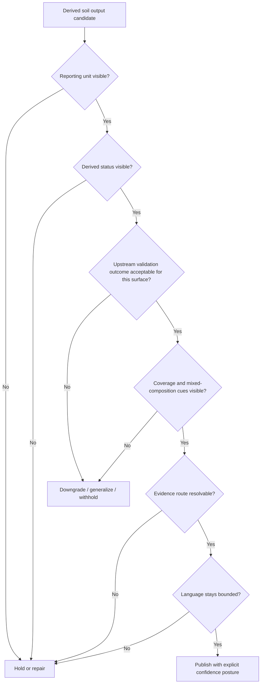

<!-- [KFM_META_BLOCK_V2]
doc_id: kfm://doc/<NEEDS-VERIFICATION: assign-uuid>
title: Kansas Frontier Matrix — Soils — Publication — Validation
type: standard
version: v1
status: draft
owners: @bartytime4life
created: YYYY-MM-DD
updated: YYYY-MM-DD
policy_label: <NEEDS-VERIFICATION: policy-label>
related: [../README.md, ../../README.md, ../../validation/README.md, ../../../../pipelines/ssurgo_to_catchment.md, ../../../../../pipelines/soils/gssurgo-ks/README.md]
tags: [kfm, soils, publication, validation]
notes: [Current public path existed as a placeholder in the inspected repo state; doc_id, dates, and policy_label require maintainer confirmation before commit.]
[/KFM_META_BLOCK_V2] -->

# Kansas Frontier Matrix — Soils — Publication — Validation

Release-facing checks for soil outputs before they appear on public-safe KFM surfaces.

> [!NOTE]
> **Status:** experimental  
> **Owners:** [`@bartytime4life`](../../../../../.github/CODEOWNERS)  
> **Path:** `docs/domains/soils/publication/validation/README.md`  
>      
> **Quick jump:** [Scope](#scope) · [Repo fit](#repo-fit) · [Accepted inputs](#accepted-inputs) · [Quickstart](#quickstart) · [Validation matrix](#release-facing-validation-matrix) · [Outcome defaults](#outcome-defaults) · [FAQ](#faq) · [Appendix](#appendix)

> [!IMPORTANT]
> **CONFIRMED:** the soils lane already distinguishes authoritative soil records from derived rollups, and the soils publication lane already requires visible reporting units, evidence routes, and bounded public language.  
> **INFERRED:** this page should carry the missing last-mile publication-validation logic for soil outputs that are structurally valid but not automatically public-safe.  
> **UNKNOWN / NEEDS VERIFICATION:** exact numeric thresholds, policy-bundle wiring, and merge-blocking workflow depth for this sub-lane were not directly surfaced in the inspected repo evidence.

## Scope

This page covers **publication-bound validation** for soil-derived outputs after an upstream soil source or derived rollup already exists and before that output is shown in a map popup, dossier, story node, export, or governed API surface.

It is about **public meaning**, not just upstream correctness. A soil output can be structurally valid and still fail publication validation if it hides its reporting unit, speaks as if it were authoritative soil survey truth, suppresses coverage or mixed-composition limitations, or cannot resolve back to inspectable evidence.

This page sits between [`../../validation/README.md`](../../validation/README.md) and [`../README.md`](../README.md): upstream validation decides whether the data is structurally trustworthy enough to proceed, while this page decides what the downstream surface may honestly say.

Use the following labels when precision matters in this file:

- **CONFIRMED** — directly supported by checked-in repo-adjacent documentation or current public tree evidence.
- **INFERRED** — strongly suggested by adjacent docs and directory role, but not yet stated here in the checked-in placeholder.
- **PROPOSED** — recommended structure or wording pattern for maintainers to adopt.
- **UNKNOWN** — not verified in the inspected evidence.
- **NEEDS VERIFICATION** — should not be treated as settled until a contract, fixture, workflow, or emitted artifact is surfaced.

## Repo fit

| Role | Path | Why it belongs in this layer |
|---|---|---|
| This file | `docs/domains/soils/publication/validation/README.md` | Release-facing checks for whether a soil output may speak on a public-safe surface. |
| Upstream lane doctrine | [`../../README.md`](../../README.md) | Establishes the soils lane, source families, and authoritative-vs-derived discipline. |
| Upstream lane validation | [`../../validation/README.md`](../../validation/README.md) | Owns structural soil validation, weighting integrity, and threshold-shaped hold logic before publication. |
| Parent publication doctrine | [`../README.md`](../README.md) | Owns public wording, exposure classes, and evidence-route expectations for soil surfaces. |
| Local downstream surfaces | [`../derived/README.md`](../derived/README.md) · [`../publication/README.md`](../publication/README.md) | Narrower child docs for derived-output classes or surface-specific publication behavior. |
| Implementation-shaped evidence | [`../../../../pipelines/ssurgo_to_catchment.md`](../../../../pipelines/ssurgo_to_catchment.md) | Shows derived-record build requirements, provenance expectations, and fail-closed gates for soil rollups. |
| Ingest-pattern example | [`../../../../../pipelines/soils/gssurgo-ks/README.md`](../../../../../pipelines/soils/gssurgo-ks/README.md) | Shows neighboring use of `spec_hash`, `run_receipt`, STAC, and `kfm:evidence_refs`. |
| Machine-facing neighbors | [`../../../../../policy/README.md`](../../../../../policy/README.md) · [`../../../../../tests/README.md`](../../../../../tests/README.md) · [`../../../../../schemas/contracts/v1/README.md`](../../../../../schemas/contracts/v1/README.md) | Where executable gates, verification, and contract surfaces belong instead of this page. |

## Accepted inputs

This file accepts concise, reviewable guidance for:

- public-safe validation of **derived** soil summaries, overlays, intersections, and rollups
- release-facing decisions for soil content shown in map popups, dossier cards, story nodes, API summaries, and export text
- confidence, caution, downgrade, generalization, or withholding rules tied to visible publication behavior
- evidence-route expectations for soil surfaces that claim drill-through or traceability
- copy discipline for mixed, partial, or coverage-limited soil outputs
- cross-links to checked-in pipeline, policy, schema, or verification surfaces when they materially affect publication behavior

## Exclusions

This file is **not** the home for:

- raw source onboarding, source descriptors, or acquisition choreography — keep those in lane doctrine and ingest docs
- lane-wide structural validation internals such as weighting math, component/horizon preservation, or numeric threshold ownership — keep those in [`../../validation/README.md`](../../validation/README.md) and machine policy surfaces
- JSON Schema, Rego, Conftest, or executable CI logic — keep those in root-level contract, policy, and test surfaces
- broad non-soils publication rules — keep those in parent or repo-wide publication docs
- unpublished experiments, temporary notes, or speculative thresholds with no surfaced evidence

> [!WARNING]
> This page should **consume** upstream hold/caution outcomes. It should not silently invent new numeric thresholds for coverage, weighting, or release eligibility.

## Directory tree

```text
docs/domains/soils/publication/
├── README.md
├── derived/
│   └── README.md
├── publication/
│   └── README.md
└── validation/
    └── README.md
```

## Quickstart

1. Start with a **derived soil output**, not a raw SSURGO table.
2. Name the **reporting unit** explicitly: catchment, watershed, county, tract, place card, tile, or other release unit.
3. Keep the output visibly **derived**: rollup, intersection, summary, rasterized surface, or modeled layer as applicable.
4. Carry forward the upstream validation outcome. If upstream validation says hold, low coverage, or mixed support, this page does **not** erase that result.
5. Check whether the surface can expose an **evidence route**. If the user cannot inspect how the soil statement was formed, the surface is not drill-through-ready.
6. Choose the smallest honest outcome: **publish**, **publish with caution**, **generalize**, **steward-only**, or **withhold**.

[Back to top](#kansas-frontier-matrix--soils--publication--validation)

## Usage

### Release-facing decision order

1. **Identify what is being summarized.**  
   A soil statement without a named unit invites authority creep.

2. **State the output class.**  
   Use labels such as _derived rollup_, _intersected summary_, _catchment aggregate_, _rasterized convenience layer_, or _modeled soil proxy_.

3. **Inherit upstream validation, do not override it.**  
   Publication validation interprets upstream evidence and validation state; it does not rewrite them.

4. **Decide whether categorical language is honest.**  
   If composition is mixed, support is partial, or the output is not survey-authoritative at the spoken grain, prefer bounded summary language.

5. **Verify the evidence route.**  
   A public-safe soil statement should resolve to at least one inspectable evidence path, even if the surface itself is brief.

6. **Choose the release outcome.**  
   The right release is often a downgrade or generalization rather than a more confident sentence.

### Machine-facing evidence expectations

Where neighboring pipelines or release artifacts emit them, publication-bound soil outputs should carry forward as many of the following as the surface can honestly expose:

- `kfm:evidence_refs`
- `provenance_ref`
- `run_receipt`
- `spec_hash`
- STAC/DCAT asset or distribution links
- explicit release-state or caution-state markers

If those surfaces do **not** exist yet for a given output, this page should not pretend they do. In that case, either downgrade the public claim or keep the output out of drill-through surfaces.

### Publication rule of thumb

> [!CAUTION]
> **Authoritative soil truth** remains upstream in SSURGO-class source structure and its governed derivatives.  
> **Public soil storytelling** stays downstream, derived, bounded, and evidence-linked.

## Diagram



## Tables

### Release-facing validation matrix

| Validation family | Ask before publish | Public-safe default | Escalate when |
|---|---|---|---|
| Reporting-unit clarity | Can a reader tell whether the statement refers to a catchment, county, watershed, parcel aggregate, place card, or other release unit? | **Block** if the unit is hidden. | Repair the surface or withhold the claim. |
| Derived-status visibility | Does the surface say this is a summary, rollup, intersection, raster convenience layer, or modeled output rather than sovereign soil-survey truth? | **Block** if the surface reads as authoritative soil truth. | Reframe the copy or withhold. |
| Coverage / support visibility | Are partial intersections, masked zones, or low-support conditions visible to the user or reviewer? | **Publish with caution** only when the limitation is explicit. | Generalize or withhold if the surface would otherwise overstate support. |
| Mixed composition handling | Does the surface flatten mixed component or horizon structure into one oversimplified category? | Prefer bounded summary language. | Generalize to mixed/heterogeneous wording or avoid the categorical claim. |
| Surveyed vs gridded vs modeled distinction | Is the surface clearly separating SSURGO-class mapped units from gSSURGO, SoilGrids, or other modeled/gridded helpers? | Keep source classes visibly distinct. | Split the surface or withhold until distinctions are restored. |
| Evidence route | Can the surface resolve to inspectable evidence, provenance, or release artifacts? | **Block** if the claim cannot trace back to evidence. | Hold until the route exists or downgrade the claim. |
| Release-state and rights alignment | Is the output actually cleared for the target surface and release class? | Hold on ambiguity. | Steward review or withhold. |
| Language discipline | Does the copy stay bounded, derived, and non-sovereign? | Replace absolute statements with bounded wording. | Copy edit, generalize, or withhold. |

### Outcome defaults

| Outcome | Use when | Surface behavior |
|---|---|---|
| **Publish** | Reporting unit is clear, derived status is visible, upstream validation is acceptable, and evidence route exists. | Show the soil statement with normal confidence/caution framing. |
| **Publish with caution** | The output is still useful, but support is partial, mixed, or context-sensitive. | Keep the statement visible, but attach caution text, confidence cues, or narrower wording. |
| **Generalize** | The surface cannot honestly support a sharp soil class claim at the requested grain. | Replace the specific claim with broader or mixed-composition language. |
| **Steward-only** | The output is meaningful but not yet ready for public-safe interpretation or evidence drill-through. | Keep visible only on steward/review surfaces. |
| **Withhold / hold** | Reporting unit, evidence route, release state, or derived-status visibility fails. | Do not publish the soil statement until repaired. |

### Illustrative copy patterns

These are **illustrative examples**, not canonical release text.

| Prefer | Avoid |
|---|---|
| “Dominant hydrologic soil group in the **mapped portion of this catchment** is B, based on a derived rollup of intersecting soil units.” | “This catchment is B soil.” |
| “Soil summary is **partial** and should be read as indicative rather than complete.” | “These soils are …” when coverage is incomplete. |
| “No single class is dominant enough for a categorical label; **mixed soil composition** is shown.” | “This area is loam.” when the result is strongly mixed. |
| “This layer is a **gridded or modeled convenience surface** and should not replace authoritative mapped soil units.” | Treating gSSURGO or modeled grids as if they were identical to SSURGO map-unit truth. |

[Back to top](#kansas-frontier-matrix--soils--publication--validation)

## Task list

### Definition of done

- [ ] The reporting unit is named in visible copy and, where applicable, in payload metadata.
- [ ] The output is labeled as **derived**, **rolled up**, **intersected**, **gridded**, or **modeled** as applicable.
- [ ] Upstream validation outcomes are consumed rather than silently replaced.
- [ ] Coverage, support, and mixed-composition limits are visible where they materially affect meaning.
- [ ] The evidence route is resolvable for any surface claiming drill-through or traceability.
- [ ] Release class and rights posture are aligned with the target surface.
- [ ] Copy does not imply sovereign truth at a grain the output cannot support.
- [ ] Open unknowns remain visible instead of being smoothed away.

## FAQ

### How is this different from `../../validation/README.md`?

`../../validation/README.md` is lane-wide and upstream. It deals with structural soil correctness, weighting integrity, coverage gates, and fail-closed validation before publication. This page starts **after** that layer and asks a different question: _what may this output safely mean on a public surface?_

### Does this file define numeric thresholds?

No. Numeric thresholds, validation math, and executable deny logic should live upstream in validation, policy, contract, and test surfaces. This file interprets outcomes; it should not become a second hidden policy engine.

### Can gridded or modeled soil layers pass publication validation?

Yes, but only if they stay visibly **derived** or **modeled**, remain distinct from authoritative mapped soil units, and carry bounded language appropriate to their method and support.

### What if coverage is partial but the output is still useful?

Use the smallest honest release: publish with caution, generalize the claim, or keep the output on steward-only surfaces. Do not use publication polish to erase partial support.

### What should a release-ready soil surface expose?

At minimum, it should expose the reporting unit, derived status, caution/confidence posture where needed, and an evidence route that can resolve to inspectable provenance or release artifacts.

[Back to top](#kansas-frontier-matrix--soils--publication--validation)

## Appendix

<details>
<summary><strong>Compact reviewer checklist</strong></summary>

### Reviewer prompts

- Can a first-time reader tell **what unit** was summarized?
- Can they tell whether the output is **authoritative** or **derived**?
- Would a cautious reviewer understand where **coverage or mix limits** apply?
- Can the surface resolve to an **evidence route** without private tribal knowledge?
- Does the copy say **only** what the output can actually support?
- If the surface failed here, is the right fix a repair, a downgrade, a generalization, or a hold?

### Cross-reference map

- Lane doctrine: [`../../README.md`](../../README.md)
- Lane validation: [`../../validation/README.md`](../../validation/README.md)
- Parent publication doc: [`../README.md`](../README.md)
- Implementation-shaped catchment example: [`../../../../pipelines/ssurgo_to_catchment.md`](../../../../pipelines/ssurgo_to_catchment.md)
- Kansas gSSURGO ingest example: [`../../../../../pipelines/soils/gssurgo-ks/README.md`](../../../../../pipelines/soils/gssurgo-ks/README.md)
- Machine policy and verification neighbors: [`../../../../../policy/README.md`](../../../../../policy/README.md) · [`../../../../../tests/README.md`](../../../../../tests/README.md) · [`../../../../../schemas/contracts/v1/README.md`](../../../../../schemas/contracts/v1/README.md)

### Maintainer follow-ups

- Replace placeholders in the KFM meta block before commit.
- Harmonize this file with any future non-placeholder content in `../derived/README.md` and `../publication/README.md`.
- Promote exact numeric gates here only after a checked-in contract or policy surface becomes canonical.
- Add fixture-linked examples once soil publication receipts or proof packs are surfaced in the repo.

</details>

[Back to top](#kansas-frontier-matrix--soils--publication--validation)
