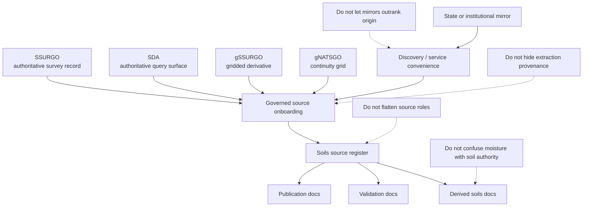

<!-- [KFM_META_BLOCK_V2]
doc_id: kfm://doc/NEEDS-VERIFICATION
title: Kansas Frontier Matrix — Soils — Sources
type: standard
version: v1
status: draft
owners: [@bartytime4life, NEEDS VERIFICATION]
created: 2026-04-01
updated: 2026-04-08
policy_label: public
related: [
  "../README.md",
  "../../../pipelines/ssurgo_to_catchment.md",
  "../../../governance/ROOT_GOVERNANCE.md",
  "../../../governance/ETHICS.md",
  "../appendices/source-role-matrix.md"
]
tags: [kfm, soils, sources, ssurgo, gssurgo, gnatsgo, sda, provenance]
notes: [
  "Revised from a user-supplied outdated draft in the current session.",
  "This subtree and exact child links remain NEEDS VERIFICATION until checked against live repo pathing.",
  "Source roles stay explicit so authoritative soil truth is not silently replaced by query surfaces, gridded derivatives, or mirrors."
]
[/KFM_META_BLOCK_V2] -->

# Kansas Frontier Matrix — Soils — Sources

_Source-role README for authoritative soil inputs, query surfaces, gridded derivatives, and acquisition posture before any downstream soil baseline, soil-moisture overlay, or derived soil summary is built._

> **Status:** draft  
> **Owners:** `@bartytime4life` · `NEEDS VERIFICATION`  
>       
> **Quick jumps:** [Scope](#scope) · [Repo fit](#repo-fit) · [Inputs](#inputs) · [Exclusions](#exclusions) · [Directory tree](#directory-tree) · [Quickstart](#quickstart) · [Usage](#usage) · [Diagram](#diagram) · [Reference tables](#reference-tables) · [Task list](#task-list) · [FAQ](#faq) · [Appendix](#appendix)  
> **Repo fit:** `docs/domains/soils/sources/README.md` _(**INFERRED / NEEDS VERIFICATION**)_ · upstream [`../README.md`](../README.md) · adjacent [`../../../pipelines/ssurgo_to_catchment.md`](../../../pipelines/ssurgo_to_catchment.md) · appendix [`../appendices/source-role-matrix.md`](../appendices/source-role-matrix.md) · expected downstream docs [`../derived/README.md`](../derived/README.md), [`../validation/README.md`](../validation/README.md), [`../publication/README.md`](../publication/README.md)  
> **Accepted inputs:** authoritative survey records, query-surface notes, gridded derivative notes, mirror/discovery notes, and identifiers/version/extraction/provenance notes  
> **Exclusions:** derived soil baselines, soil-moisture fusion logic, publication defaults, validation harness implementation, and raw landed data

> [!IMPORTANT]
> **Source rule:** every soil source named here must be labeled as authoritative, query-surface, derivative, or mirror/discovery convenience before any downstream document summarizes it.

> [!NOTE]
> This page governs **where soil truth comes from**. It does **not** decide the downstream soil-moisture baseline, the publication class of a derived product, or the validation harness for release-bearing outputs.

## Scope

This page defines the soil source families KFM should recognize before any soil-derived baseline, catchment rollup, or soil-moisture overlay is discussed.

Its job is simple and strict: keep source meaning intact.

That means preventing the common collapses that make later docs drift:

- authoritative survey record becoming indistinguishable from gridded convenience
- query-service access being treated like a sovereign replacement dataset
- state or institutional mirrors outranking the source origin they mirror
- extraction logic disappearing once a derived layer is published
- modeled or observed moisture layers being confused with authoritative soil structure

### Truth labels used in this file

| Label | Meaning here |
|---|---|
| **CONFIRMED** | Supported by the supplied KFM corpus or the user-supplied baseline draft |
| **INFERRED** | Strongly suggested by adjacent docs, but not verified as mounted repo fact here |
| **PROPOSED** | Recommended wording, path, or workflow shape for this README |
| **NEEDS VERIFICATION** | Explicit placeholder where live repo or implementation proof was not checked in-session |

## Repo fit

This README is best read as the soil-source entry point that feeds the rest of the soils subtree.

| Item | Value |
|---|---|
| Path | `docs/domains/soils/sources/README.md` |
| Path status | **INFERRED / NEEDS VERIFICATION** |
| Upstream | [`../README.md`](../README.md) |
| Adjacent pipeline note | [`../../../pipelines/ssurgo_to_catchment.md`](../../../pipelines/ssurgo_to_catchment.md) |
| Appendix / matrix anchor | [`../appendices/source-role-matrix.md`](../appendices/source-role-matrix.md) |
| Expected downstream docs | `../derived/README.md`, `../validation/README.md`, `../publication/README.md` |
| Primary audience | maintainers, source stewards, ingest authors, and downstream soil-doc authors |

### Why this file exists before the derived docs

KFM’s source-onboarding posture is contract-like rather than download-like. A source should declare identity, grain, acquisition route, identifiers, and provenance burden before a derived product is allowed to flatten it into a friendly summary.

## Inputs

### Accepted inputs

- source-role inventories
- acquisition notes for SSURGO-class inputs
- query-service notes for SDA-style extraction
- role notes for gSSURGO / gNATSGO class products
- mirror/discovery notes for Kansas or institutional portals
- identifiers, release/version, acquisition date, extraction method, and provenance notes

### Minimum source-family questions

Before adding or revising a source family here, answer these:

1. What is it?
2. What truth posture does it have in KFM?
3. What is its typical grain?
4. How is it acquired in practice?
5. What identifiers must survive extraction?
6. What must nobody mistake it for later?

## Exclusions

| Exclusion | Why it does not belong here | Where it belongs instead |
|---|---|---|
| Derived soil baselines or rollups | This page is about source meaning, not finished products | `../derived/README.md` |
| Soil-moisture fusion logic | Observed and modeled moisture sources must remain distinct from soil-survey authority | downstream derived or hydrology docs |
| Publication defaults | Publication class and public-safe wording are separate governance concerns | `../publication/README.md` and governance docs |
| Validation harness details | Machine-facing checks should not be hidden inside a source glossary | `../validation/README.md` and contract/test surfaces |
| Raw landed data | This is not a storage index or catalog manifest | storage, registry, or catalog surfaces |
| Release manifest / proof-pack mechanics | Those belong to cross-cutting contract and promotion layers | contract, policy, and release docs |

## Directory tree

```text
docs/domains/soils/
├── README.md
├── sources/
│   └── README.md
├── derived/
│   └── README.md            # expected / needs verification
├── validation/
│   └── README.md            # expected / needs verification
├── publication/
│   └── README.md            # expected / needs verification
└── appendices/
    └── source-role-matrix.md
```

## Quickstart

1. Name the source family.
2. Declare its truth posture.
3. State its expected grain.
4. Record how it is acquired.
5. Preserve the identifiers that make drill-through possible.
6. Record what it must never be mistaken for.
7. Link any downstream derived doc that depends on it.

## Usage

### Use this page when

- a new soil source family enters KFM
- a new acquisition route is added for an existing soil source
- a mirror or portal starts being used and needs to be named without inflating its authority
- a downstream doc starts drifting and needs a stable source-role reference

### Do not use this page to

- define a soil-moisture baseline
- hide query logic that materially changes meaning
- publish a gridded convenience layer as if it were the canonical survey record
- claim current implementation depth that has not been verified

## Diagram



## Reference tables

### Source-role register

| Source family | What it is | Typical grain | KFM handling rule | Must not be mistaken for |
|---|---|---|---|---|
| **SSURGO** | authoritative soil survey record | map unit / component / horizon | keep as baseline soil authority | a time-varying moisture layer or a raster convenience product |
| **SDA** | authoritative access/query surface over soil content | query result over source tables | preserve extraction method, query lineage, and retained identifiers | a separate sovereign soil ontology |
| **gSSURGO** | gridded derivative built for raster-aligned work | raster cell / state grid | keep labeled derived and convenience-oriented | replacement for survey-grain structure |
| **gNATSGO** | broader continuity grid for wider-area coverage | raster cell / national or multi-state coverage | keep labeled derived and broader-scale | Kansas-first authoritative map-unit truth |
| **State / institutional mirrors** | service or discovery convenience | varies | never outrank source origin; record why they are used | the authority they mirror |

### Common acquisition posture

| Source family | Common acquisition pattern | Why teams reach for it | What to record here |
|---|---|---|---|
| **SSURGO** | direct survey download, AOI export, or bulk package | strongest structure and richest tabular detail | release/version, geography covered, retained keys |
| **SDA** | scripted query / selective extraction | reproducible narrow pulls and refresh-friendly automation | query route, extraction date, returned identifiers |
| **gSSURGO** | statewide or regional gridded package | raster alignment and statewide convenience | product version, resolution, join assumptions |
| **gNATSGO** | continuity grid / broader-area package | seamless coverage when a broad grid is needed | coverage scope, resolution, fallback role |
| **Mirror / portal** | hub, feature service, or discovery portal | easier discovery, quick preview, or service integration | mirrored origin, access mode, and why the mirror is being used |

### Minimum provenance fields to preserve

| Field | Why it matters |
|---|---|
| source family | keeps authoritative, query, derivative, and mirror roles distinct |
| origin source | stops mirrors from silently becoming authority |
| version / release | supports reproducibility and rebuilds |
| acquisition date | explains freshness |
| extraction method | makes results auditable |
| retained identifiers | preserves drill-through to source semantics |
| grain / support | prevents map unit, component, horizon, and raster cells from collapsing into one layer |
| rights / redistribution note | keeps downstream publication honest |

### Downstream separation rules

| Downstream-adjacent family | How to treat it | Why it is not the authority handled by this page |
|---|---|---|
| **Observed soil-moisture stations** | reference as adjacent downstream evidence only | observed time series do not replace soil survey structure |
| **Modeled or satellite moisture products** | document in derived or soil-moisture-specific docs | modeled moisture signal is not soil identity |
| **Catchment or corridor rollups** | keep in derived docs | they are summaries built from sources, not source families themselves |
| **Public map tiles / exported views** | treat as portrayal artifacts | delivery surfaces inherit from release scope; they are not upstream truth |

## Task list

- [ ] Confirm live pathing for the soils subtree
- [ ] Verify source-family naming already used in adjacent repo docs
- [ ] Check whether `../appendices/source-role-matrix.md` is mounted
- [ ] Add exact child links once downstream READMEs are verified
- [ ] Record only the mirrors and portals that are actually used
- [ ] Keep modeled and observed moisture sources clearly separated in downstream docs
- [ ] Link machine-facing source manifests only after they are directly verified

## FAQ

### Is SDA the same thing as SSURGO?

No. SDA is an authoritative access/query surface for soil content. It is not a replacement source class.

### Can gridded soil layers be documented here?

Yes, but only as derived or convenience source families. They do not outrank the underlying survey record.

### Should state or university portal mirrors be listed?

Yes, when they are actually used for acquisition or discovery. Just keep the origin source visible and primary.

### Does this page decide the Kansas soil-moisture baseline?

No. This page preserves source meaning. A soil-moisture baseline belongs in a downstream derived document where modeled, observed, and authoritative soil layers can be kept visibly distinct.

### Can this page mention observed or modeled moisture sources?

Yes, but only as downstream-adjacent families that must stay separate from authoritative soil structure.

## Appendix

<details>
<summary><strong>Illustrative source-note template</strong></summary>

Use this template when a new soil source family or acquisition route is added.

```md
### <Source family name>

**Truth posture:** authoritative | query surface | derived | mirror  
**Typical grain:** map unit | component | horizon | raster cell | varies  
**Acquisition route:** <download / query / mirror / service>  
**Origin source:** <agency / product / service>  
**Retained identifiers:** <mukey / cokey / areasymbol / ...>  
**Version or release note:** <release or refresh marker>  
**Rights / redistribution note:** <public / restricted / needs verification>  
**Must not be mistaken for:** <the most common category error>  
**Downstream docs that depend on it:** <derived / validation / publication links>
```

</details>

<details>
<summary><strong>Interpretation guardrail</strong></summary>

When a downstream doc says “soil layer,” the reader should still be able to answer:

- Is this authoritative soil structure or a derived surface?
- What grain does it actually represent?
- Was it queried, downloaded, rasterized, or mirrored?
- Which identifiers survive into the output?
- What was lost or generalized along the way?

If those answers are missing, the downstream doc should point back here and fix the drift.

</details>

[Back to top](#kansas-frontier-matrix--soils--sources)
