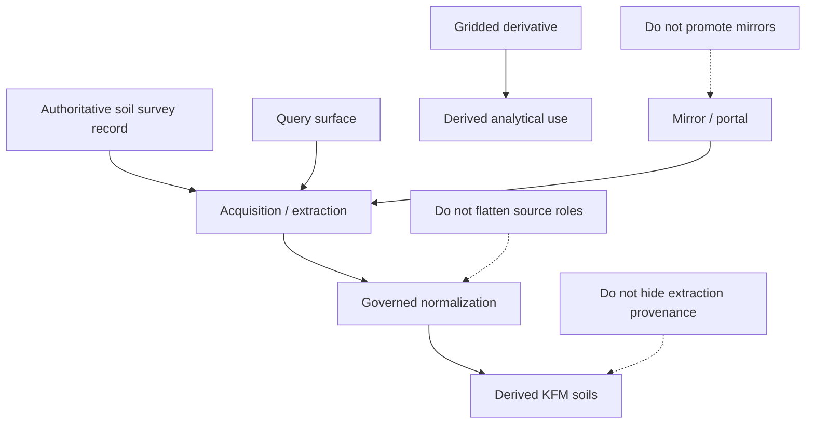

<!-- [KFM_META_BLOCK_V2]
doc_id: kfm://doc/NEEDS-VERIFICATION
title: Kansas Frontier Matrix — Soils — Sources
type: standard
version: v1
status: draft
owners: [@bartytime4life, NEEDS VERIFICATION]
created: 2026-04-01
updated: 2026-04-01
policy_label: public
related: [
  "../README.md",
  "../../../pipelines/ssurgo_to_catchment.md",
  "../../../governance/ROOT_GOVERNANCE.md",
  "../../../governance/ETHICS.md",
  "../appendices/source-role-matrix.md"
]
tags: [kfm, soils, sources, ssurgo, gssurgo, gnatsgo, sda, provenance]
notes: [
  "Requested as part of the user-directed soils module build.",
  "This subtree is PROPOSED; exact live pathing and owners NEED VERIFICATION.",
  "Source roles are kept distinct so access mirrors and gridded products do not silently replace authoritative soil truth."
]
[/KFM_META_BLOCK_V2] -->

# Kansas Frontier Matrix — Soils — Sources

Source-role README for authoritative soil inputs, access/query surfaces, gridded derivatives, and the acquisition posture KFM should preserve before any downstream soil summary is built.

| Status | Owners | Quick fit |
|---|---|---|
|     | @bartytime4life, NEEDS VERIFICATION | Source inventory, authority split, acquisition notes, and provenance expectations for soil truth entering KFM |

**Purpose:** classify soil source families and make their authority, grain, and allowed downstream use explicit.  
**Repo fit:** child page under `docs/domains/soils/`; upstream [`../README.md`](../README.md).  
**Accepted inputs:** authoritative soil surveys, query/access services, gridded soil derivatives, discovery mirrors, and source-specific provenance notes.  
**Exclusions:** derived KFM rollups, publication defaults, contract fields, and testing logic.

**Quick jumps:** [Scope](#scope) · [Repo fit](#repo-fit) · [Accepted inputs](#accepted-inputs) · [Exclusions](#exclusions) · [Directory tree](#directory-tree) · [Quickstart](#quickstart) · [Usage](#usage) · [Diagram](#diagram) · [Tables](#tables) · [Task list](#task-list) · [FAQ](#faq)

> [!IMPORTANT]
> **Source rule:** a source page must say whether a layer is authoritative, derivative, query-only, or mirror-only before anyone is allowed to summarize it.

## Scope

This page documents where soil truth comes from, how source families differ, and what burden follows when KFM acquires, normalizes, or republishes soil-linked content.

It exists to prevent common collapses:

- authoritative survey record becoming indistinguishable from gridded convenience
- access service being treated like a sovereign dataset
- state or university mirrors being treated as the authority rather than the origin
- source extraction logic being lost after a derived layer is published

## Repo fit

| Item | Value |
|---|---|
| Path | `docs/domains/soils/sources/README.md` |
| Path status | **PROPOSED / NEEDS VERIFICATION** |
| Upstream | [`../README.md`](../README.md) |
| Adjacent | [`../../../pipelines/ssurgo_to_catchment.md`](../../../pipelines/ssurgo_to_catchment.md) |
| Cross-links | [`../appendices/source-role-matrix.md`](../appendices/source-role-matrix.md) |
| Downstream docs expected | `../derived/README.md`, `../validation/README.md`, `../publication/README.md` |

## Accepted inputs

- source-role inventories
- acquisition notes for SSURGO-class inputs
- query-service notes for SDA-style acquisition
- role notes for gSSURGO / gNATSGO class products
- mirror/discovery notes for Kansas or institutional portals
- identifiers, version, release, extraction, and provenance notes

## Exclusions

| Exclusion | Why |
|---|---|
| Derived catchment/place/corridor summaries | Those belong in downstream derived docs |
| Publication policy | That belongs in the publication child page and governance docs |
| Validation harness details | Those belong in validation docs and machine-facing surfaces |
| Raw landed data | This is not a storage or catalog page |

## Directory tree

```text
docs/domains/soils/
├── README.md
├── sources/
│   └── README.md
├── derived/
├── validation/
├── publication/
└── appendices/
```

## Quickstart

1. Name the source family.
2. Declare its truth posture.
3. State its expected grain.
4. Record how it is acquired.
5. Record what it must never be mistaken for.

## Usage

Use this page whenever a new soil source is introduced or a new acquisition route is added. Keep the authority split visible before derived docs start talking about products.

## Diagram



## Tables

### Source-role register

| Source family | What it is | Typical grain | KFM handling rule |
|---|---|---|---|
| **SSURGO** | authoritative survey record | map unit / component / horizon | keep as baseline authority |
| **SDA** | authoritative access/query surface | query result over source tables | preserve extraction method and query lineage |
| **gSSURGO** | gridded derivative | raster cell / state grid | keep labeled derived |
| **gNATSGO** | broader continuity grid | raster cell / national coverage | keep labeled derived and broader-scale |
| **State / institutional mirrors** | discovery or service convenience | varies | never outrank source origin |

### Minimum provenance fields to preserve

| Field | Why it matters |
|---|---|
| source family | distinguishes survey truth from derivative |
| version / release | keeps rebuilds reproducible |
| acquisition date | explains freshness |
| extraction method | makes results auditable |
| identifiers retained | enables drill-through back to source semantics |

## Task list

- [ ] Confirm live pathing for the soils subtree
- [ ] Verify source-family naming already used in repo docs
- [ ] Add exact child links once subtree exists
- [ ] Keep mirror/query/derivative distinctions visible
- [ ] Link to machine-facing source manifests when verified

## FAQ

### Is SDA the same thing as SSURGO?

No. It is an access/query surface for authoritative soil content, not a replacement source class.

### Can gridded soil layers be documented here?

Yes, but only as derived or convenience source families, not as upstream authority.

### Should portal mirrors be listed?

Yes, if they are actually used for acquisition or discovery. Just keep the origin source visible.
