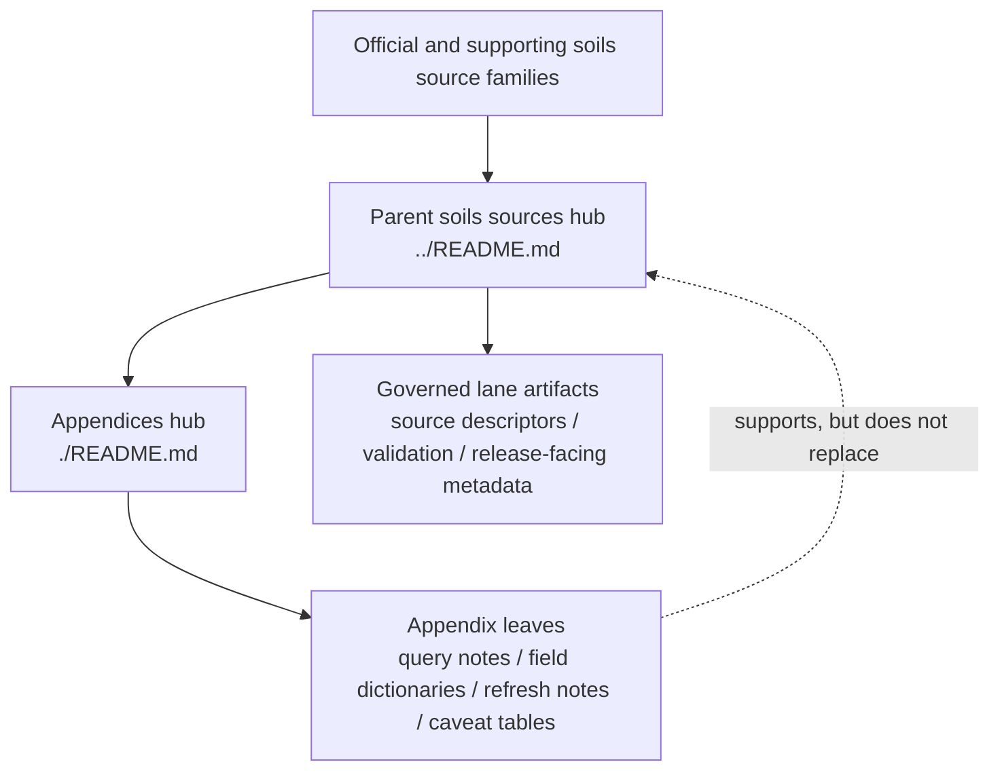

<!-- [KFM_META_BLOCK_V2]
doc_id: kfm://doc/NEEDS-VERIFICATION
title: Soils Source Appendices
type: standard
version: v1
status: draft
owners: NEEDS VERIFICATION
created: YYYY-MM-DD
updated: YYYY-MM-DD
policy_label: NEEDS VERIFICATION
related: [../../README.md, ../README.md]
tags: [kfm, soils, sources, appendices]
notes: [Replace placeholders after mounted repo verification., Adjacent README inventory and appendix leaf set are not directly verified in the current session.]
[/KFM_META_BLOCK_V2] -->

# Soils Source Appendices

Supplementary routing surface for long-form notes, source caveats, query patterns, and reference material that support — but do not replace — the governed soils source lane.

> [!NOTE]
> **Status:** experimental  
> **Owners:** NEEDS VERIFICATION  
>     
> **Quick jumps:** [Scope](#scope) · [Repo fit](#repo-fit) · [Inputs](#accepted-inputs) · [Exclusions](#exclusions) · [Directory tree](#directory-tree) · [Quickstart](#quickstart) · [Usage](#usage) · [Diagram](#diagram) · [Reference matrix](#reference-matrix) · [Definition of done](#task-list--definition-of-done) · [FAQ](#faq)  
> **Repo fit:** `docs/domains/soils/sources/appendices/` → upstream: [`../README.md`](../README.md), [`../../README.md`](../../README.md) · downstream: appendix leaves in `./` (**NEEDS VERIFICATION**)

> [!IMPORTANT]
> This directory is a **supplementary reference lane**. It is the place for long-form support material that would otherwise overload the parent soils source docs. It is **not** the authoritative source registry, **not** the main soils lane manual, and **not** the release/proof-pack surface for live ingestion or publication artifacts.

> [!WARNING]
> Current-session verification exposed attached KFM documents and a PDF-rich workspace only. Adjacent repo inventory, appendix leaf count, owners, workflows, schemas, and exact local naming patterns remain **NEEDS VERIFICATION** until the mounted repository is directly inspected.

## Scope

This directory holds appendix-scale material that helps maintainers work with soils sources without crowding the parent source-lane docs.

Typical appendix work here includes:

- long-form notes on source families such as SSURGO, Soil Data Access, gSSURGO, and related Kansas soils references
- join and field-reference notes for `map unit → component → horizon` handling
- resolution-choice and product-comparison notes
- refresh and change-detection notes
- caveat tables, glossary-style expansions, and query examples
- bulky reference material that is useful to keep close to the lane, but not in the main scanning path

This directory should remain **supporting infrastructure for understanding**, not the place where KFM silently moves operational truth.

## Repo fit

| Path | Role | Relationship |
| --- | --- | --- |
| `docs/domains/soils/README.md` | soils domain hub | likely upstream domain entry (**INFERRED / NEEDS VERIFICATION**) |
| `docs/domains/soils/sources/README.md` | soils sources hub | likely parent lane for source-facing soils docs (**INFERRED / NEEDS VERIFICATION**) |
| `docs/domains/soils/sources/appendices/README.md` | this file | directory README for appendix-scale soils source material |
| `docs/domains/soils/sources/appendices/*.md` | appendix leaves | downstream reference notes, matrices, and longer support pages (**NEEDS VERIFICATION**) |

## Accepted inputs

Place material here when it is primarily **appendix-scale support** for the soils source lane:

- source-family notes and access caveats
- field dictionaries and relationship notes
- `mukey`-centric join guidance
- resolution and product-choice notes such as SSURGO vs. gridded or generalized companions
- annual refresh / diff / polling notes
- appendix-length query examples or extraction patterns
- long tables, examples, or comparison notes that would make the parent README hard to scan

## Exclusions

Do **not** place the following here:

- canonical source descriptors, ingest receipts, validation reports, or dataset versions
- release manifests, proof packs, correction notices, or outward publication evidence
- the main soils lane doctrine or parent source-lane overview → keep that in [`../README.md`](../README.md)
- broad soils domain orientation that belongs one level up → keep that in [`../../README.md`](../../README.md)
- copied federal manuals or large mirrored source dumps
- unsupported claims that a connector, watcher, poller, workflow, or release is already live
- silent flattening of `SSURGO`, `STATSGO`, `gSSURGO`, `gNATSGO`, or other products into one supposedly equivalent source
- modeled or derived layers presented as if they were raw authoritative survey structure

## Current verification posture

**CONFIRMED in the current session**

- KFM treats source onboarding as a contract rather than a download.
- The soils lane is a real Kansas operating lane with distinct publication and interpretation burdens.
- The attached KFM corpus repeatedly treats soils as good deterministic-watcher territory.
- The soils lane must keep product/resolution choices and modeled-vs-observed distinctions visible.

**NEEDS VERIFICATION in the mounted repo**

- adjacent file inventory
- local owners and dates
- existing appendix leaf filenames
- actual source-registry or contract paths
- current CI/docs checks tied to this directory

## Status vocabulary used in this directory

| Label | Use here |
| --- | --- |
| **CONFIRMED** | Directly supported by the visible project corpus or directly verified in the mounted repo |
| **INFERRED** | Conservative structural completion that fits KFM doctrine but is not yet directly proven in mounted repo state |
| **PROPOSED** | Recommended appendix behavior, layout, or next step |
| **UNKNOWN** | Not verified strongly enough in the current session |
| **NEEDS VERIFICATION** | Review flag for inventory, ownership, behavior, or local repo shape that should be checked before commit |

## Directory tree

```text
docs/
└── domains/
    └── soils/
        └── sources/
            └── appendices/
                ├── README.md
                └── … appendix leaves (NEEDS VERIFICATION)
```

## Quickstart

1. Create or open an appendix leaf under `docs/domains/soils/sources/appendices/`.
2. Name the source family or appendix topic explicitly near the top.
3. State the document’s truth posture using KFM labels where uncertainty matters.
4. Keep the page supplementary: route operational source ownership back to the parent sources doc.
5. Preserve product distinctions, especially where resolution, derivation, or update behavior differs.
6. Link upward to the parent lane and sideways to any narrower appendix leaves that already exist.

Minimal appendix leaf starter:

```md
# <Appendix title>

One-line purpose for why this note belongs in appendices rather than the parent lane.

## Source family
- <source family / product>

## What this appendix clarifies
- <field, join, access, or caveat note>

## Status
- CONFIRMED:
- INFERRED:
- NEEDS VERIFICATION:

## Route back to the lane
- Parent source lane: `../README.md`
```

## Usage

### Use this directory for support material, not sovereign truth

An appendix page should help a reader understand a source family, a query pattern, a field relationship, a refresh caveat, or a packaging decision.

It should **not** quietly become the lane’s authoritative source contract.

### Keep structure visible

Where soils products differ by scale, derivation, or intended use, the appendix should make that difference explicit instead of smoothing it away.

Good appendix pages usually answer questions like:

- What product is this note about?
- What is the support grain?
- What are the important joins or identifiers?
- What caveats matter before a maintainer treats the source as lane-ready?
- What should the reader go inspect next in the parent lane?

### Promote content upward when it becomes normative

Move material out of appendices when it becomes one of the following:

- a lane-wide rule
- a canonical source descriptor
- a release-facing validation requirement
- a parent README responsibility
- a governed contract or schema concern

## Diagram



## Reference matrix

### Appendix content classes

| Appendix content class | Why it belongs here | What it must not become |
| --- | --- | --- |
| Field and relationship notes | Helps maintainers remember structure without overloading the parent lane | the authoritative schema |
| Query examples | Useful for SDA or source extraction patterns | proof that a live watcher already exists |
| Product comparison notes | Keeps resolution and derivation differences visible | a silent equivalence claim |
| Refresh and diff notes | Helps explain polling, change review, and update cadence | a release manifest |
| Rights / usage caveats | Keeps reuse and publication posture visible | a substitute for formal decision objects |
| Long reference material | Reduces clutter in the parent README | copied upstream source dumps |

### Common source surfaces and cautions

| Source surface or topic | Likely appendix role | Keep explicit |
| --- | --- | --- |
| `SSURGO` | detailed survey structure notes, field semantics, join reminders | preserve map-unit / component / horizon structure |
| `Soil Data Access (SDA)` | query patterns, extraction notes, request caveats | query intent, retrieval context, and field selection |
| `SSURGO Portal` | workflow or download-tool notes | tool/workflow context is not the same thing as source authority |
| `gSSURGO` | raster-friendly or statewide analysis notes | derivative status and grid-scale consequences |
| `STATSGO` / `gNATSGO` family references | comparison or fallback notes when cited in the lane | never silently substitute for SSURGO-scale detail |
| Kansas soils mirrors or local derivatives | cross-check or convenience notes | mirror/derivative status must stay visible |
| Soil-adjacent monitoring context | contextual notes such as moisture or related environmental support | contextual monitoring is not a replacement for soil survey structure |

## Task list / definition of done

- [ ] Meta block placeholders are replaced or consciously retained with review notes
- [ ] Adjacent README inventory is verified in the mounted repo
- [ ] At least one appendix leaf exists or the README remains honest about scaffold state
- [ ] Every appendix leaf states its source family, scope, and uncertainty posture
- [ ] No appendix leaf silently substitutes for source descriptors or release artifacts
- [ ] Product and resolution distinctions stay explicit
- [ ] Query examples and caveat notes are source-aware and bounded
- [ ] Long reference material stays collapsible where it would otherwise flatten readability
- [ ] Parent routing links are checked after mounted repo inspection

## FAQ

### Why separate appendices from the parent sources README?

Because the parent lane should stay fast to scan. Appendix pages are where longer notes, caveats, comparison tables, and source-specific reminders can live without turning the parent README into a wall of reference material.

### Can this directory host SDA query examples?

Yes — when they are illustrative, source-aware, and clearly supplementary. They should not be mistaken for proof that a governed, live query pipeline is already wired in the repo.

### Can this directory own source descriptors or release evidence?

No. Appendix pages can explain or support those artifacts, but they should not replace them.

### Should downloaded bundles or mirrored source dumps live here?

No. Summarize them, describe why they matter, and route to the proper governed storage or source-management surface.

### What should happen when an appendix becomes central to lane behavior?

Promote the normative part upward into the parent source lane or the appropriate contract/runbook surface, then keep only the supporting bulk here.

## Appendix

<details>
<summary><strong>Suggested appendix leaf naming patterns</strong></summary>

Prefer stable, topic-led names:

```text
ssurgo-structure-notes.md
sda-query-patterns.md
gssurgo-product-notes.md
annual-refresh-watch-notes.md
mukey-component-horizon-joins.md
kansas-soils-mirror-caveats.md
```

</details>

<details>
<summary><strong>Possible future appendix topics</strong></summary>

Useful candidates once the mounted repo is verified:

- SSURGO field-family quick reference
- `mukey` / component / horizon relationship notes
- gridded-product comparison notes
- annual refresh watch notes and diff review prompts
- Kansas survey-area caveat pages
- soil-adjacent monitoring context notes
- glossary for repeated soils-source terms

</details>

[Back to top](#soils-source-appendices)
