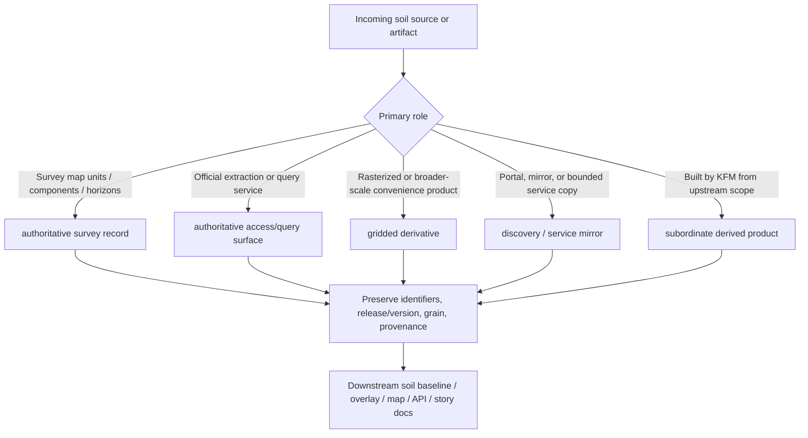

<!-- [KFM_META_BLOCK_V2]
doc_id: kfm://doc/NEEDS_VERIFICATION_UUID
title: Kansas Frontier Matrix — Soils — Source Role Matrix
type: standard
version: v1
status: draft
owners: NEEDS VERIFICATION
created: YYYY-MM-DD
updated: YYYY-MM-DD
policy_label: NEEDS_VERIFICATION
related: [docs/domains/soils/README.md, docs/domains/soils/sources/README.md, docs/domains/soils/appendices/README.md, docs/pipelines/ssurgo_to_catchment.md]
tags: [kfm, soils, appendix, sources, source-role-matrix]
notes: [Current public-main appendix path is docs/domains/soils/appendices/source-role-matrix.md; requested nested path needs verification.]
[/KFM_META_BLOCK_V2] -->

# Kansas Frontier Matrix — Soils — Source Role Matrix

Compact reference for keeping soil-source roles legible across the soils module.

> **Status:** `draft`  
> **Owners:** `NEEDS VERIFICATION`  
> **Repo fit:** appendix reference matrix for the soils lane and its soil-source docs  
> **Accepted inputs:** source-family role labels, acquisition notes, query-surface notes, derivative distinctions, and mirror/service notes  
> **Exclusions:** contract schemas, enforceable policy, executable pipeline detail, and release-bearing publication defaults  
> **Quick jumps:** [How to use](#how-to-use) · [Role legend](#role-legend) · [Classification flow](#classification-flow) · [Source role matrix](#source-role-matrix) · [Minimum carry-forward fields](#minimum-carry-forward-fields) · [Maintainer notes](#maintainer-notes)

## How to use

Use this appendix before a soil source is ingested, summarized, rasterized, queried, or cited in a downstream soil baseline.

1. Identify the incoming source family.
2. Apply the matching authority class.
3. Preserve the carry-forward facts listed below.
4. Push transformation, validation, and publication rules into their owning docs instead of expanding this appendix into a policy page.

> [!IMPORTANT]
> This page exists to stop role drift. It should make it hard to confuse soil survey truth, soil query access, raster convenience products, mirrors, and KFM-built overlays.

## Role legend

| Authority class | Meaning in this appendix | Typical examples |
|---|---|---|
| **authoritative survey record** | Upstream soil-survey truth with map-unit / component / horizon structure that downstream layers must not silently outrank | SSURGO |
| **authoritative access/query surface** | Official query or extraction surface over authoritative soil data; preserves access lineage but is not a new sovereign ontology | SDA |
| **gridded derivative** | Raster-aligned or broader-scale convenience product derived from authoritative soil sources for analysis or stacking | gSSURGO, gNATSGO |
| **discovery / service mirror** | State, institutional, or portal copy that helps discovery or access but does not replace origin authority | Kansas/state portals, bounded institutional services |
| **subordinate derived product** | KFM-built overlay, rollup, or reporting layer rebuilt from promoted upstream scope | catchment rollups, place/grid summaries, map/API overlays |

## Classification flow

## Source role matrix

| Source family | Authority class | Typical grain / support | Allowed downstream use | Must not be mistaken for |
|---|---|---|---|---|
| **SSURGO** | authoritative survey record | map unit / component / horizon | baseline soil truth, normalized extracts, evidence-linked derivation | statewide convenience grid, soil-moisture layer, or already-flattened reporting overlay |
| **SDA** | authoritative access/query surface | query result over source tables or AOI-specific extraction | reproducible extraction, acquisition automation, narrow pulls, and query lineage | independent sovereign dataset or replacement soil ontology |
| **gSSURGO** | gridded derivative | raster cell / statewide or CONUS geodatabase structure | analytical stacking, statewide mapping, convenience summaries, and raster-aligned planning inputs | raw survey structure or the authoritative replacement for SSURGO grain |
| **gNATSGO** | broader gridded derivative | raster cell / national or multi-state continuity coverage | broader-scale fallback use, continuity coverage, and coarse comparative surfaces | local high-fidelity Kansas survey truth |
| **State / institutional portal** | discovery / service mirror | varies by service or exported layer | discovery, retrieval, and bounded service exposure | authoritative origin, release authority, or proof of full statewide completeness |
| **KFM derived overlay** | subordinate derived product | reporting unit such as catchment, place, corridor, grid, or API-facing summary object | map, story, API, dossier, and compare surfaces with evidence and caution | authoritative survey replacement |

## Quick reviewer checks

| If you see this | Classify it as | Reviewer action |
|---|---|---|
| Soil polygons and relational soil tables with `mukey` / component / horizon structure | authoritative survey record | keep identifiers and release/version facts intact before any flattening |
| An official NRCS query result or AOI-specific extract generated from SQL / service parameters | authoritative access/query surface | retain request shape, endpoint, fetch time, and returned identifiers |
| A statewide soil raster or file geodatabase built for stacking with other raster layers | gridded derivative | label it derived; keep resolution and generalization limits visible |
| A Kansas or university-hosted map/service exposing soil data | discovery / service mirror | keep the mirrored origin and extent limits explicit |
| A catchment, county, or grid summary built by KFM | subordinate derived product | point back to upstream soil sources and preserve build/provenance receipts |

> [!NOTE]
> Observed soil-moisture station feeds and modeled soil-condition layers are adjacent evidence, not replacements for soil-survey structure. Keep them in derived or adjacent lane docs rather than reclassifying them as soil authority here.

## Minimum carry-forward fields

| Authority class | Minimum facts that should survive any handoff |
|---|---|
| authoritative survey record | origin source, release/version date, survey-area scope, grain/support, identifiers such as `areasymbol`, `mukey`, `cokey`, and `chkey` when present, rights posture, acquisition date |
| authoritative access/query surface | endpoint, canonical query/request shape, returned identifiers, output format, fetch time, response metadata available at fetch time, and a provenance note linking the extract to upstream soil authority |
| gridded derivative | upstream authoritative source, product version, resolution or cell semantics, coverage scope, generalization limits, and any retained source identifiers or lookup path back to source grain |
| discovery / service mirror | mirrored origin, mirror operator when known, extent/coverage limits, export or service date when known, access mode, and a caution that mirror status does not transfer authority |
| subordinate derived product | upstream source refs, weighting/aggregation method, build receipt or equivalent provenance, version, coverage limits, evidence links, and an explicit statement that the product is rebuildable and subordinate |

## Maintainer notes

- Keep this matrix synchronized with the soils lane README and the soil sources README.
- Keep this page compact and supplemental.
- Do not move normative contract language, policy grammar, or executable validation detail into this appendix.
- Update labels when repo language changes, but do not silently broaden authority claims.
