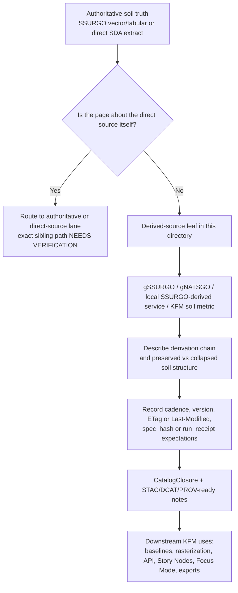

<!-- [KFM_META_BLOCK_V2]
doc_id: kfm://doc/NEEDS-VERIFICATION
title: Soils Derived Sources
type: standard
version: v1
status: draft
owners: NEEDS VERIFICATION
created: YYYY-MM-DD
updated: YYYY-MM-DD
policy_label: NEEDS VERIFICATION
related: [NEEDS-VERIFICATION]
tags: [kfm, soils, sources, derived]
notes: [Current session exposed the PDF corpus but not a mounted repo tree for this lane; metadata and adjacent file links remain placeholders pending repo verification.]
[/KFM_META_BLOCK_V2] -->

# Soils Derived Sources

Routing surface for soil source material that is already rasterized, aggregated, generalized, service-mediated, or otherwise downstream of authoritative soil survey truth.

> [!NOTE]
> **Status:** experimental  
> **Owners:** NEEDS VERIFICATION  
>      
> **Quick jumps:** [Scope](#scope) · [Repo fit](#repo-fit) · [Accepted inputs](#accepted-inputs) · [Exclusions](#exclusions) · [Current verified snapshot](#current-verified-snapshot) · [Directory tree](#directory-tree) · [Quickstart](#quickstart) · [Usage](#usage) · [Diagram](#diagram) · [Tables](#tables) · [Task list & definition of done](#task-list--definition-of-done) · [FAQ](#faq) · [Appendix](#appendix)  
> **Repo fit:** `docs/domains/soils/sources/derived/` → upstream: **NEEDS VERIFICATION** (expected soils-domain and source-hub parents were not directly mounted in this session) · downstream: derived-source leaves plus soil baseline, rasterization, catalog, and publish surfaces that consume them (**exact paths NEEDS VERIFICATION**)

> [!IMPORTANT]
> This directory should function as a **derived-source lane**, not as a second soils architecture manual and not as a catch-all notebook for everything soil-related. Keep pages narrow, source-aware, and explicit about what upstream authority they depend on.

> [!WARNING]
> Current session verification exposed the attached corpus but not a mounted repository tree for this subtree. Treat ownership, adjacent file inventory, sibling README paths, CODEOWNERS, and local workflow claims as **NEEDS VERIFICATION** until directly rechecked in the repo.

> [!CAUTION]
> Convenience is not the same thing as derivation. If a page is about the official direct soil survey product itself, it does **not** belong here just because it is popular or easy to query. This lane is for downstream soil products and packaged surfaces, not for canonical SSURGO truth in its rawest form.

## Scope

This directory is the home for soil source notes where the source is already one or more steps removed from direct authoritative soil survey truth.

In this lane, **derived** usually means at least one of the following:

- rasterized from vector/tabular soil survey data
- aggregated or weighted from lower-level soil tables
- generalized for statewide or national coverage
- repackaged into web-delivery or analysis-first formats
- exposed through local or institutional service layers that are themselves built from upstream soil authorities
- published as KFM-built soil metrics, tiles, or cataloged derivative layers

The practical KFM question for this directory is not “is this soil-related?” It is:

**What transformation already happened, what truth was preserved or collapsed, and what publication burden follows from that?**

This README therefore emphasizes routing, classification, provenance expectations, and loss-awareness.

## Repo fit

### What this file is supposed to do

This README is a directory contract for `docs/domains/soils/sources/derived/`. It should help a maintainer decide:

- whether a soil source page belongs here at all
- how to describe the derivation chain without overstating authority
- what minimum metadata and proof notes a leaf page should include
- what should be routed back to an authoritative-source or direct-observation lane instead

### What this file is not supposed to do

This file is **not** the owner of:

- the whole soils domain strategy
- raw SSURGO/SDA intake contracts
- full soil schema design
- end-to-end raster pipeline implementation
- general environmental or hydrology ingestion policy

Those belong in broader domain, contract, or pipeline documents once their exact repo locations are verified.

## Accepted inputs

Place material here when it is primarily about **derived soil sources** such as:

- gSSURGO and similar statewide or CONUS raster-ready derivatives of SSURGO
- gNATSGO and similar blended fallback soil grids
- local or institutional soil services that explicitly derive from SSURGO or related federal soil authorities
- KFM-generated component-weighted map-unit summaries or statewide soil baselines
- rasterized, tiled, or packaged soil derivatives prepared for analysis or map delivery
- source notes for derived soil products that need cadence, version, ETag, checksum, or refresh monitoring
- release-facing documentation for soil derivatives that flow into catalog, API, Story Node, Focus Mode, or export surfaces

## Exclusions

Do **not** place the following here:

- direct SSURGO bulk-download guidance as the authoritative vector/tabular source of truth
- Soil Data Access query-contract docs that are about primary extraction rather than a downstream derivative
- raw Mesonet or other raw in-situ station observation contracts
- unpublished experiments, half-formed idea notes, or temporary extraction scratchpads
- cross-domain environmental docs that only mention soils in passing
- generalized architecture doctrine that belongs in a higher-level KFM manual
- unsupported claims that a derived soil layer is authoritative when the evidence only supports “derived,” “operational,” or “model-ready”

## Current verified snapshot

The current evidence snapshot for this lane is intentionally narrow.

**CONFIRMED from the visible corpus**

- KFM treats soils, land cover, and agriculture as a structured lane suited to deterministic, receipt-bearing watcher logic.
- SSURGO is treated as the authoritative vector/tabular soil base.
- gSSURGO is treated as a rasterized derivative of SSURGO.
- gNATSGO is treated as a broader seamless raster fallback or large-area derivative surface.
- Soil Data Access (SDA) is treated as the dynamic query layer, not as a replacement for carefully versioned releases.
- The soil hierarchy **Map Unit → Component → Horizon** is a truth-preserving structure that should not be flattened casually.
- Derived soil products are expected to carry provenance, versioning, validation notes, and outward catalog closure.

**NEEDS VERIFICATION in the mounted repo**

- exact sibling directories and parent README files
- current leaf inventory under this directory
- current owners, CODEOWNERS, and status markers
- exact downstream file paths for soil baseline, raster, and catalog docs
- whether this README already exists and needs revision vs. first creation

## Directory tree

The only path that could be treated as directly certain from the task itself is the target location:

```text
docs/
└── domains/
    └── soils/
        └── sources/
            └── derived/
                └── README.md
```

Any additional leaf inventory in this subtree is **NEEDS VERIFICATION** until the mounted repository is directly inspectable.

## Quickstart

### Add a new derived-source page

1. Decide whether the page is truly about a **derived** soil source.
2. Name the upstream authoritative base explicitly.
3. State what transformation or packaging makes the source derived.
4. Record cadence, versioning, and refresh signals.
5. Note what soil structure is preserved and what is collapsed.
6. Record provenance and release-facing proof expectations.
7. Mark unresolved details as **NEEDS VERIFICATION** instead of smoothing them away.

### Minimal authoring shape

```md
# <derived-source name>

One-line purpose for this derived soil source.

## What this source is
- Knowledge character:
- Upstream authoritative base:
- Why it is derived:

## Refresh and versioning
- Cadence:
- Version / release signal:
- Conditional fetch clues:

## Packaging and KFM fit
- Typical formats:
- Likely downstream uses:
- Required proof objects:

## Soil-structure notes
- Does it preserve Map Unit → Component → Horizon?
- If not, what gets collapsed?

## Validation notes
- Common failure modes:
- Known distortions or generalizations:

## Verification notes
- CONFIRMED:
- INFERRED:
- PROPOSED:
- NEEDS VERIFICATION:
```

## Usage

### Directory behavior

This lane should stay easy to scan under review pressure. A reader should be able to tell, quickly:

- what the source actually is
- what it is derived from
- whether it is acceptable for baseline analysis, operational display, or broader publication
- what information is lost compared with the upstream authority
- what proof objects would have to exist before the source is promoted into outward-facing KFM surfaces

### Status vocabulary used in this directory

| Label | Use here |
| --- | --- |
| **CONFIRMED** | Directly supported by the current visible corpus or verified repo evidence |
| **INFERRED** | Strong structural completion that fits KFM doctrine but is not directly proven in the mounted repo |
| **PROPOSED** | Recommended behavior, shape, or next step |
| **UNKNOWN** | Not verified strongly enough in the current session |
| **NEEDS VERIFICATION** | Review flag for path, ownership, implementation, or local inventory that should be checked before commit |

### Naming guidance

**PROPOSED:** prefer short, source-first file names for leaf pages in this directory, such as a clear source slug or derivative family slug, rather than long narrative titles.

### Authoring rule of thumb

If the page cannot answer **“derived from what, by whom, and with what loss or transformation?”**, it is probably not ready for this lane.

## Diagram



## Tables

### Source-family handling matrix

| Source family | Why it belongs here or not | Keep here? | Notes |
| --- | --- | --- | --- |
| SSURGO bulk vector/tabular release | Direct authoritative soil survey truth | No | Route to the authoritative/direct-source lane once that sibling path is verified |
| Soil Data Access direct query contract | Primary extraction surface into SSURGO/STATSGO-backed tables | Usually no | Keep here only when the page is about a downstream packaged derivative built from SDA pulls |
| gSSURGO | Rasterized statewide or CONUS derivative of SSURGO | Yes | Treat as derived, not as a replacement for raw soil hierarchy |
| gNATSGO | Seamless gridded fallback / broader-scale derivative baseline | Yes | Good fit when the page focuses on operational or analytic raster use |
| Kansas GeoPortal or university SSURGO-derived services | Local repackaging of upstream soil truth | Yes | Make the local derivation chain explicit; do not silently upgrade authority |
| KFM component-weighted soil metrics | KFM-built derivative | Yes | Must state weighting logic, aggregation loss, and release proof expectations |
| Raw Mesonet soil-moisture station records | Direct observations, not a soil-survey derivative | No | Route to direct-observation or environmental-ingestion docs |
| Aggregated soil-moisture or ET surfaces used as soil context | Derived observational or modeled soil context | Maybe | Keep here only if the page is truly about a soil-domain derivative rather than raw station or climate-source behavior |

### Minimum fields for each leaf page

| Field | Why it matters |
| --- | --- |
| Source name | Keeps the page identifiable and linkable |
| Upstream authoritative base | Prevents authority drift |
| Knowledge character | Distinguishes authoritative, derived, operational, modeled, or blended status |
| Derivation chain | States what transformation already happened |
| Spatial support / resolution | Keeps statewide, county, and map-unit scales from being blurred |
| Temporal basis / refresh cadence | Makes staleness visible |
| Packaging forms | Clarifies GeoPackage, GeoParquet, COG, PMTiles, API, or service behavior |
| Provenance / version signals | Supports spec-hash, run-receipt, release, or catalog logic |
| Validation notes | Records completeness checks, component-sum checks, or known distortions |
| Rights / sensitivity posture | Prevents inappropriate publication assumptions |
| Downstream KFM uses | Shows why this source matters to analysis, catalog, or trust surfaces |

### Soil-specific distortion checklist

| Risk | Why it matters |
| --- | --- |
| Dominant-component shortcuts | Can bias interpretation by hiding less dominant but still meaningful components |
| Early flattening of Map Unit → Component → Horizon | Loses structure that later analysis may need |
| Rasterizing too early | Reduces fidelity and can hide intra-map-unit variability |
| Mixing SSURGO and gNATSGO without stating scale consequences | Blurs authoritative detail with generalized fallback coverage |
| Missing version pinning | Makes rebuilds and comparisons non-reproducible |
| Missing validation notes | Lets silent corruption pass as normal packaging |

## Task list & definition of done

A new derived-source leaf is ready for review when all applicable checks below are true:

- [ ] The upstream authoritative base is named explicitly.
- [ ] The page explains **why** the source is derived.
- [ ] The page states whether Map Unit → Component → Horizon is preserved, partially collapsed, or fully collapsed.
- [ ] Cadence, release signal, and refresh clues are documented.
- [ ] Packaging forms are listed clearly.
- [ ] Known distortions, generalizations, or weighting logic are called out.
- [ ] Provenance and proof expectations are stated in KFM terms.
- [ ] Rights or sensitivity posture is not guessed.
- [ ] Claims about repo integration, owners, workflows, or sibling paths are marked **NEEDS VERIFICATION** unless directly checked.
- [ ] The page is narrow enough that a reviewer can tell what belongs here and what should be routed elsewhere.

## FAQ

### Why are gSSURGO and gNATSGO good fits for this directory?

Because they are already downstream of more authoritative soil survey structures. They are valuable and often operationally convenient, but they are not the same thing as raw authoritative soil survey truth.

### Does a popular soil source automatically belong here?

No. Popularity, convenience, or web accessibility do not make a source “derived.” The test is whether the source is already packaged, generalized, rasterized, aggregated, or otherwise downstream of a more authoritative base.

### When can SSURGO appear in this lane?

Only when the page is about a derivative built from SSURGO rather than about SSURGO itself. Example: a statewide rasterized or component-weighted product derived from SSURGO can fit here; raw SSURGO vector/tabular guidance should not.

### Are soil-moisture products always part of this directory?

Not always. Raw in-situ station feeds belong with direct observations. Aggregated, modeled, or packaged soil-context layers may fit here if the page is clearly about the derived product and not the raw source contract.

### What must stay visible before a derived source can support outward-facing KFM surfaces?

At minimum: derivation chain, cadence or staleness basis, version or receipt signals, known loss of fidelity, and enough provenance for catalog and review surfaces to remain inspectable.

## Appendix

<details>
<summary><strong>Appendix — evidence snapshot and authoring cues</strong></summary>

### A. Core cues this README preserves

- KFM is Kansas-first and lane-based; source-role differences are structural, not decorative.
- Soil sources work best when the lane keeps authoritative truth, derived products, and operational surfaces visibly separate.
- Derived soil work should be receipt-bearing and catalog-aware rather than treated as informal convenience data.
- Soil hierarchy matters. A good derived-source page says what part of the upstream soil structure survives.
- Current repo-path certainty is lower than corpus certainty in this session, so this README deliberately uses visible **NEEDS VERIFICATION** markers for local inventory and ownership.

### B. Good examples of what a leaf page should make obvious

- whether a statewide raster is acceptable for analytical baseline use
- whether a service layer is simply a convenience wrapper around upstream SSURGO
- whether a KFM-built soil metric is component-weighted, depth-weighted, or dominant-component-only
- whether a derivative product is intended for catalog, analysis, map delivery, or all three

### C. Suggested reviewer questions

1. Does the page silently upgrade a derivative into an authority?
2. Does it hide structure loss caused by aggregation or rasterization?
3. Does it state refresh logic clearly enough to support watcher-style monitoring?
4. Does it name a plausible KFM proof path for promotion?
5. Does it route raw source behavior somewhere else when appropriate?

</details>

[Back to top](#soils-derived-sources)
