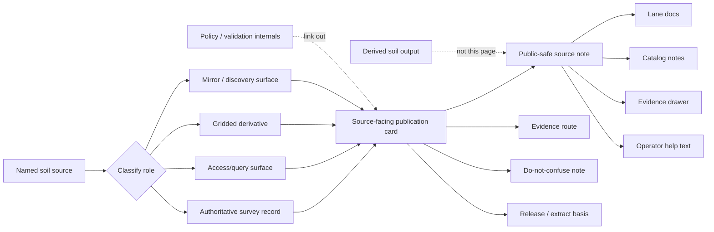

<!-- [KFM_META_BLOCK_V2]
doc_id: kfm://doc/<uuid-NEEDS-VERIFICATION>
title: Kansas Frontier Matrix — Soils — Sources — Publication
type: standard
version: v1
status: draft
owners: @bartytime4life; NEEDS VERIFICATION
created: <YYYY-MM-DD-NEEDS-VERIFICATION>
updated: <YYYY-MM-DD-NEEDS-VERIFICATION>
policy_label: <policy-label-NEEDS-VERIFICATION>
related: [../README.md, ../../README.md, ../../publication/README.md, ../validation/README.md, ../../../../pipelines/ssurgo_to_catchment.md]
tags: [kfm, soils, sources, publication]
notes: [Owner, date, doc ID, and policy metadata still require live-checkout verification before merge.]
[/KFM_META_BLOCK_V2] -->

# Kansas Frontier Matrix — Soils — Sources — Publication

Publication README for how soil source families are named, summarized, and exposed without collapsing authoritative survey truth, access/query surfaces, gridded derivatives, and mirror convenience into one faux “source.”

> Status: `experimental` · Doc state: `draft`  
> Owners: `@bartytime4life` · `NEEDS VERIFICATION`  
>       
> Quick jumps: [Scope](#scope) · [Repo fit](#repo-fit) · [Accepted inputs](#accepted-inputs) · [Exclusions](#exclusions) · [Directory tree](#directory-tree) · [Quickstart](#quickstart) · [Usage](#usage) · [Diagram](#diagram) · [Tables](#tables) · [Task list](#task-list) · [FAQ](#faq) · [Appendix](#appendix)  
> Repo fit: `docs/domains/soils/sources/publication/README.md` · upstream [`../README.md`](../README.md) · lane root [`../../README.md`](../../README.md) · lane publication [`../../publication/README.md`](../../publication/README.md) · sibling validation [`../validation/README.md`](../validation/README.md) · related pipeline [`../../../../pipelines/ssurgo_to_catchment.md`](../../../../pipelines/ssurgo_to_catchment.md)  
> Accepted inputs: source-facing publication defaults, source-card wording, role-specific caution language, version/extraction disclosure rules, mirror/origin distinctions, and example source summaries  
> Exclusions: derived soil-output wording, source-role classification logic already handled upstream, low-level validation thresholds, machine policy, and raw landed source artifacts

> [!IMPORTANT]
> Source-publication rule: before a soil source is shown in a README, source registry, card, API help surface, evidence drawer, or operator-facing note, it must be labeled as one of the following: **authoritative survey record**, **access/query surface**, **gridded derivative**, or **mirror/discovery convenience**.

> [!NOTE]
> This child page exists because KFM has two different publication burdens that are easy to blur:
> 1. how a **source family** is described, and
> 2. how a **derived soil output** is described.  
> The first lives here. The second belongs in [`../../publication/README.md`](../../publication/README.md).

* * *

## Scope

This README governs how soil **source families themselves** may be described once they move beyond internal onboarding and become visible in human-readable repo docs, source cards, evidence drawers, catalog notes, or operator-facing explanatory surfaces.

Its job is not to restate every soil doctrine decision. Its job is narrower and more practical: keep source meaning intact at the moment of publication.

That means preventing four common collapses:

- an authoritative soil survey record being described as if it were interchangeable with a gridded convenience product
- a query surface being described as if it were a sovereign dataset
- a state, university, or portal mirror being described as if it outranked the origin source
- a soil-moisture, erosion, or suitability layer being described as if it were the same thing as soil survey structure

### Reading posture for this file

| Label | Meaning here |
|---|---|
| **CONFIRMED** | Supported by visible repo pages or attached KFM doctrine used in this revision |
| **INFERRED** | Strongly suggested by adjacent docs or source behavior, but not reverified as machine-enforced behavior |
| **PROPOSED** | Recommended wording, structure, or child-page split added in this revision |
| **NEEDS VERIFICATION** | Live-checkout owner, policy, enforcement, or path detail that still needs branch-level confirmation |

### What this page should help maintainers answer

1. When a soil source is named publicly, what role label must go with it?
2. What minimum context must remain visible so users do not confuse source origin with access method or derivative packaging?
3. What wording is safe for SSURGO, Web Soil Survey, Soil Data Access, gSSURGO, gNATSGO, and mirrors?
4. When should source-facing publication be downgraded, generalized, or held for review?

[Back to top](#kansas-frontier-matrix--soils--sources--publication)

* * *

## Repo fit

This README is the **source-facing publication child page** for the soils lane.

| Item | Value |
|---|---|
| Path | `docs/domains/soils/sources/publication/README.md` |
| Path status | **CONFIRMED** on public `main`; prior public content at this path was placeholder-only |
| Role | Explain how soil **sources** may be presented without overstating authority, freshness, or source equivalence |
| Upstream | [`../README.md`](../README.md) — source-role and acquisition entry point |
| Parallel doctrine | [`../../README.md`](../../README.md) — lane-level soils burden |
| Parallel publication doc | [`../../publication/README.md`](../../publication/README.md) — publication of **derived soil outputs** |
| Sibling | [`../validation/README.md`](../validation/README.md) — source-validation companion |
| Related pipeline context | [`../../../../pipelines/ssurgo_to_catchment.md`](../../../../pipelines/ssurgo_to_catchment.md) |
| Owners | `@bartytime4life` · `NEEDS VERIFICATION` |
| Governance anchors | `../../../../governance/ROOT_GOVERNANCE.md` · `../../../../governance/ETHICS.md` (`NEEDS VERIFICATION` in live checkout) |

### Why this page exists separately from `../../publication/README.md`

| This page | `../../publication/README.md` |
|---|---|
| governs how **source families** are described | governs how **derived soil outputs** are described |
| keeps authority, query access, derivation, and mirror status explicit | keeps reporting unit, confidence, downgrade, and public-safe summary posture explicit |
| answers “what is this source?” | answers “what can we safely say with this output?” |
| prevents source-role drift | prevents output-language overclaiming |

> [!TIP]
> The safest split is simple: the parent source README classifies source roles, this child page explains how to publish those source descriptions, and the lane-level publication README handles downstream soil summaries and story-facing outputs.

[Back to top](#kansas-frontier-matrix--soils--sources--publication)

* * *

## Accepted inputs

This file accepts material that clarifies how soil source families should appear once they are visible to humans.

### Accepted inputs

- source-card defaults for SSURGO-class content
- wording guidance for Web Soil Survey and Soil Data Access style access surfaces
- disclosure rules for gridded derivatives such as gSSURGO and gNATSGO
- mirror/discovery caveats for Kansas or institutional distribution portals
- release/version, refresh, extract date, and provenance wording
- example “say this / do not say this” language
- evidence-route expectations for source-facing docs and cards

### Minimum source-publication questions

Before adding or revising a soil source description here, answer these first:

1. **What is being named?** A survey record, a query surface, a gridded derivative, or a mirror?
2. **What authority posture does it carry?** Upstream truth, access path, derivative convenience, or discovery aid?
3. **What is the grain of the thing being described?** Map units, components, horizons, query returns, raster cells, or a portal-level bundle?
4. **What release or extraction basis must remain visible?** Survey release, Annual Soils Refresh cycle, source version, mirror lag, or extract timestamp?
5. **What must nobody confuse it with later?** This should be written down explicitly.

* * *

## Exclusions

This child page should stay narrow. It loses value when it becomes a catch-all for every soil concern.

| Exclusion | Why it does not belong here | Put it with |
|---|---|---|
| Source-role classification logic in full | The parent source README already handles the role split | [`../README.md`](../README.md) |
| Derived soil-output copy | Output wording has a different burden than source wording | [`../../publication/README.md`](../../publication/README.md) |
| Thresholds, validators, and machine checks | Those belong in validation, contracts, and policy surfaces | [`../validation/README.md`](../validation/README.md) and machine-checked surfaces |
| Raw landed files, manifests, or receipts | This is not a storage or registry index | truth-path artifact homes |
| SQL snippets, extraction code, or ETL internals | Helpful elsewhere, but too implementation-heavy here | pipeline docs and code surfaces |
| Soil-moisture or erosion model publication defaults | Those are not soil-survey source descriptions | derived docs or adjacent hydrology/hazard docs |
| Claims that quietly flatten mirror, portal, and origin | That is the exact failure this page should prevent | nowhere |

> [!CAUTION]
> If a source note makes it possible to read **SDA**, **gSSURGO**, **gNATSGO**, or a **state mirror** as the same kind of thing as **SSURGO survey structure**, the note is not ready to publish.

* * *

## Directory tree

### Confirmed local context

```text
docs/
└── domains/
    └── soils/
        ├── README.md
        ├── publication/
        │   └── README.md
        └── sources/
            ├── README.md
            ├── publication/
            │   └── README.md  ← this file
            └── validation/
                └── README.md
```

### Practical adjacency

```text
docs/
├── domains/
│   └── soils/
│       ├── README.md
│       ├── publication/README.md
│       └── sources/
│           ├── README.md
│           ├── publication/README.md
│           └── validation/README.md
└── pipelines/
    └── ssurgo_to_catchment.md
```

### Normalization rule

If the live repo later normalizes the soils lane under a broader agriculture/soils surface, preserve working links and local truth first. Do not rename this child page into a prettier taxonomy while breaking actual navigation.

[Back to top](#kansas-frontier-matrix--soils--sources--publication)

* * *

## Quickstart

Use this sequence when writing or revising a source-facing soil note.

1. **Classify the source role first.**  
   Decide whether the subject is an authoritative survey record, access/query surface, gridded derivative, or mirror/discovery surface.

2. **State the grain.**  
   Say whether the description is about map units, components, horizons, query returns, raster cells, or portal-level bundles.

3. **Expose the release or extraction basis.**  
   A user should be able to tell whether the note refers to an official release, an Annual Soils Refresh cycle, a specific extract, or a mirror snapshot.

4. **Add a do-not-confuse sentence.**  
   Every good source note prevents one likely misreading.

5. **Link the evidence route.**  
   The source note should point toward a source descriptor, acquisition note, pipeline doc, or evidence surface that makes drill-through possible.

6. **Keep derived-output language out of this page.**  
   If the sentence is really about what a soil summary says downstream, move it to [`../../publication/README.md`](../../publication/README.md).

### Minimal source-card stub

```md
## <Source family>

- **Role:** authoritative survey record | access/query surface | gridded derivative | mirror/discovery
- **Authority posture:** <who owns the underlying truth?>
- **Typical grain:** <map unit / component / horizon / raster cell / query result / bundle>
- **Acquisition path:** <download / portal / API / query surface>
- **Version or freshness basis:** <release / ASR cycle / extract timestamp / mirror snapshot>
- **Identifiers to preserve:** <MUKEY / COKEY / CHKEY / query parameters / source release ID>
- **Do not confuse with:** <the most likely bad substitution>
- **Evidence route:** <descriptor / pipeline / receipt / catalog note>
```

### Minimal before/after example

```md
Bad:
“gSSURGO is the official soil truth for Kansas.”

Better:
“gSSURGO is a gridded derivative of SSURGO-class soil survey content used for statewide analytical convenience. Keep the upstream survey structure and release basis visible.”
```

* * *

## Usage

### Use this page for source-facing docs, cards, registries, and explanatory metadata

This page is for the moment when a soil source gets named in:

- README files
- source registries
- evidence drawers
- catalog notes
- API help text
- operator runbooks
- human-readable provenance or release summaries

It is **not** the page for explaining what a derived catchment rollup means to an end user.

### Minimum public-safe source-publication fields

When a soil source is published in prose or card form, keep at least these fields visible whenever they are available.

| Field | Why it matters |
|---|---|
| Source family | tells readers what class of thing they are looking at |
| Role label | prevents authority drift |
| Authority posture | keeps origin and ownership visible |
| Typical grain | prevents reporting-unit confusion |
| Acquisition route | makes access method visible without mistaking it for origin |
| Release / freshness basis | preserves time semantics |
| Identifiers that survive | keeps drill-through possible |
| Do-not-confuse note | blocks the most likely trust failure |
| Evidence route | keeps the source note one hop from inspectable support |

### Role-specific wording rules

| Source role | Safe default phrasing | Must stay visible | Never phrase it like |
|---|---|---|---|
| Authoritative survey record | “authoritative soil survey record” | survey structure, grain, release basis | a generic statewide layer with no structure |
| Access/query surface | “query/access surface for authoritative soil content” | query provenance, extraction basis | the sovereign dataset itself |
| Gridded derivative | “gridded derivative of SSURGO-class content” | cell size, derived nature, version | the authoritative survey truth |
| Mirror/discovery surface | “discovery or distribution mirror” | origin source, lag risk, provenance | the official origin |

### Recommended source-family defaults

| Source family | Recommended label | Must not be hidden |
|---|---|---|
| **SSURGO** | authoritative soil survey record | map unit → component → horizon structure |
| **Web Soil Survey** | portal/access surface for soil survey content | that it is an access route, not a different source family |
| **Soil Data Access (SDA)** | query/access surface for authoritative soil content | query or extraction basis, not just endpoint name |
| **gSSURGO** | gridded derivative of SSURGO-class content | derived nature, raster convenience, release/version basis |
| **gNATSGO** | national gridded derivative / broader-scale continuity surface | broader-scale role and difference from local survey structure |
| **Kansas or institutional portals** | mirror/discovery convenience | origin source and possible lag or repackaging |
| **KFM source summaries** | source-facing explanatory metadata | that they are explanatory surfaces, not the source itself |

### Exposure classes for source-facing publication

| Class | Meaning | Typical use |
|---|---|---|
| **public-safe** | enough detail to understand the source role and evidence route | docs, source cards, catalog notes |
| **generalized** | family-level wording with reduced operational detail | public pages when extract details are noisy or unstable |
| **review-bearing** | source note needs steward or maintainer review before wider reuse | unresolved source conflict, volatile fields, mirror lag, unclear release basis |
| **withheld** | not shown publicly | secrets, tokens, signed URLs, unpublished endpoints, internal-only acquisition details |

### Review triggers

A source-facing note should be reviewed instead of published casually when any of the following are true:

- the source role is ambiguous
- the note leans on a mirror but omits the origin
- a gridded product is being described as if it were survey authority
- a query surface is shown with no extraction or refresh basis
- the note hides volatile or recently changed interpretations
- the source is about to be reused in story, dossier, or API copy where users may mistake it for a conclusion

### Wording patterns worth keeping

| Use this pattern | Because it does this |
|---|---|
| “authoritative survey record” | preserves upstream authority |
| “gridded derivative” | keeps derivation visible |
| “query/access surface” | distinguishes access from origin |
| “mirror/discovery convenience” | blocks portal inflation |
| “release basis” or “extract basis” | keeps time semantics visible |
| “do not confuse with …” | prevents the exact trust failure readers are likely to make |

[Back to top](#kansas-frontier-matrix--soils--sources--publication)

* * *

## Diagram



[Back to top](#kansas-frontier-matrix--soils--sources--publication)

* * *

## Tables

### Source-publication anti-patterns

| Anti-pattern | Why it weakens trust | Safer rewrite |
|---|---|---|
| “SDA is the soil dataset.” | collapses query surface into source truth | “SDA is a query/access surface for authoritative soil content.” |
| “gSSURGO is the official soil truth.” | collapses derivative into survey authority | “gSSURGO is a gridded derivative of SSURGO-class soil content.” |
| “The Kansas portal is the official source.” | inflates mirror status | “The Kansas portal is a distribution or discovery surface; keep the origin source visible.” |
| “This source shows the soil here.” | hides grain and reporting unit | “This source describes soil survey units, raster cells, or query results at a stated grain.” |
| “Updated recently.” | hides time semantics | “Release basis: <cycle/version> · extract basis: <date, if applicable>.” |

### What a source note must still expose when simplified

| If you simplify | You still must expose |
|---|---|
| the taxonomy | the role label |
| the data model | the typical grain |
| the access method | the authority posture |
| the version history | a release or extract basis |
| the full provenance chain | one evidence route |
| the operational details | one do-not-confuse note |

### Relationship to soil hierarchy

| Layer | Publication implication |
|---|---|
| **Map unit** | closest common survey geometry; keep identifiers visible |
| **Component** | mixed-soil reality; dominant-only shortcuts need disclosure |
| **Horizon** | depth-sensitive detail; do not collapse silently if a source note depends on it |
| **Raster cell** | derived reporting unit; never impersonates upstream survey structure |
| **Query result** | access product, not autonomous truth |
| **Portal bundle** | convenience packaging, not a new source ontology |

* * *

## Task list

### Definition of done

- [ ] Every named source family has a role label.
- [ ] Every public-facing source note preserves authority posture and typical grain.
- [ ] No note allows SDA, gSSURGO, gNATSGO, or a portal mirror to read like sovereign survey truth.
- [ ] Release or extract basis is stated whenever freshness matters.
- [ ] At least one evidence route is present.
- [ ] This page stays source-facing and does not absorb derived-output publication logic.
- [ ] Unverified owners, governance anchors, or enforcement claims remain marked `NEEDS VERIFICATION`.

### Reviewer checks

- [ ] Compare wording here against [`../README.md`](../README.md) so role labels stay stable.
- [ ] Compare wording here against [`../../publication/README.md`](../../publication/README.md) so source and output publication burdens do not drift together.
- [ ] Recheck whether `../../../../governance/ROOT_GOVERNANCE.md` and related governance paths exist exactly as written.
- [ ] Add live links to source descriptors or receipts once those surfaces are verified in the checkout.

* * *

## FAQ

### Is Soil Data Access the same thing as SSURGO?

No. In this documentation model, SDA is an **access/query surface** for authoritative soil content, not a replacement for the upstream survey structure.

### Can gSSURGO or gNATSGO be named in public source notes?

Yes, but as **gridded derivatives** or **broader-scale continuity surfaces**, not as replacements for map-unit / component / horizon survey truth.

### What about Web Soil Survey?

Treat it as an **access portal**. It can be the way a user reaches soil content without being the same thing as the source authority behind that content.

### Are Kansas or university portals allowed?

Yes. They are useful as **mirror/discovery conveniences**. Just keep the origin source visible and do not let portal wording outrank the source it mirrors.

### Does this page control how catchment soil summaries or story cards are written?

No. Those are downstream soil outputs and belong in [`../../publication/README.md`](../../publication/README.md) or other derived-output docs.

### Should source notes include validator thresholds or full schema definitions?

Not here by default. Link out to validation, contracts, or pipeline docs instead of turning this README into a shadow policy system.

[Back to top](#kansas-frontier-matrix--soils--sources--publication)

* * *

## Appendix

<details>
<summary>Example source-card patterns</summary>

### Example A — authoritative survey record

```md
## SSURGO

- **Role:** authoritative soil survey record
- **Authority posture:** upstream soil survey truth
- **Typical grain:** map unit → component → horizon
- **Acquisition path:** official download or admitted portal extract
- **Release basis:** official survey release / Annual Soils Refresh cycle
- **Identifiers to preserve:** MUKEY, COKEY, CHKEY
- **Do not confuse with:** gSSURGO, gNATSGO, or a portal mirror
- **Evidence route:** source descriptor + acquisition note + related pipeline
```

### Example B — gridded derivative

```md
## gSSURGO

- **Role:** gridded derivative
- **Authority posture:** derived from SSURGO-class content
- **Typical grain:** raster cell / statewide analytical stack
- **Acquisition path:** official NRCS download or admitted mirror
- **Release basis:** stated product release or refresh cycle
- **Identifiers to preserve:** product version, cell size, upstream lineage note
- **Do not confuse with:** authoritative survey structure
- **Evidence route:** source descriptor + release note + downstream pipeline
```

### Example C — query surface

```md
## Soil Data Access (SDA)

- **Role:** query/access surface
- **Authority posture:** trusted route to authoritative soil content
- **Typical grain:** query result shaped by extraction logic
- **Acquisition path:** SQL or API-driven extract
- **Extract basis:** query text / parameters + timestamp
- **Identifiers to preserve:** source endpoint, extract basis, surviving soil identifiers
- **Do not confuse with:** an autonomous source family that replaces SSURGO survey truth
- **Evidence route:** source descriptor + query note + extract receipt
```

</details>
