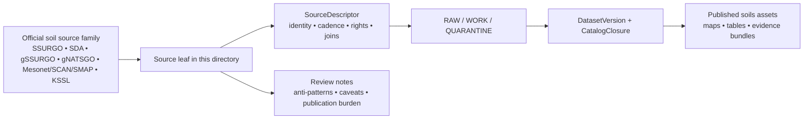

<!-- [KFM_META_BLOCK_V2]
doc_id: kfm://doc/NEEDS-VERIFICATION
title: Soils Source Registry
type: standard
version: v1
status: draft
owners: NEEDS VERIFICATION
created: YYYY-MM-DD
updated: YYYY-MM-DD
policy_label: TBD — verify
related: [../../README.md, ../README.md, ../../../../governance/ROOT_GOVERNANCE.md, ../../../../governance/ETHICS.md, ../../../../governance/SOVEREIGNTY.md]
tags: [kfm, soils, sources, registry]
notes: [Mounted repository inventory for this path was not directly visible in the current session; sibling leaves, owners, dates, and parent-path confirmation require verification before merge.]
[/KFM_META_BLOCK_V2] -->

# Soils Source Registry

Directory index for source-by-source documentation that defines the authoritative intake surface for KFM soils data.

> [!NOTE]
> **Status:** experimental  
> **Owners:** NEEDS VERIFICATION  
>      
> **Quick jumps:** [Scope](#scope) · [Repo fit](#repo-fit) · [Inputs](#accepted-inputs) · [Exclusions](#exclusions) · [Current verified snapshot](#current-verified-snapshot) · [Directory tree](#directory-tree) · [Quickstart](#quickstart) · [Usage](#usage) · [Diagram](#diagram) · [Source family matrix](#source-family-matrix) · [Definition of done](#task-list--definition-of-done) · [FAQ](#faq)  
> **Repo fit:** `docs/domains/soils/sources/sources/` → upstream: [`../README.md`](../README.md), [`../../README.md`](../../README.md), [`../../../../governance/ROOT_GOVERNANCE.md`](../../../../governance/ROOT_GOVERNANCE.md) *(all NEEDS VERIFICATION against the mounted repo)* · downstream: per-source leaves in this directory such as `ssurgo.md`, `soil-data-access.md`, `gssurgo.md`, `gnatsgo.md`, `soil-moisture-context.md`, and `kssl-profiles.md` *(all PROPOSED starter names until repo verification)*

> [!IMPORTANT]
> This directory should behave as a **source-registry lane**, not as a catch-all soil notebook, not as a runtime ETL folder, and not as a published-output catalog. Its job is to make source identity, authority class, canonical joins, rights, refresh behavior, and publication burden explicit before connector or release work begins.

> [!WARNING]
> Current-session evidence was **PDF-rich only**. Sibling file inventory, parent README presence, CODEOWNERS, workflows, tests, and live connector coverage are **NEEDS VERIFICATION** until the mounted repository is directly inspected.

> [!CAUTION]
> Do **not** collapse **SSURGO**, **Soil Data Access**, **gSSURGO**, and **gNATSGO** into one undifferentiated “soil source.” They differ in authority class, resolution, refresh cadence, and downstream use. Keep those differences visible in both documentation and data contracts.

## Scope

This directory is the home for **source leaves** that matter specifically to the **soils lane** in Kansas Frontier Matrix.

It should make it easy for a maintainer to answer five questions before any connector, ETL, catalog, or UI claim is trusted:

1. What is the source, exactly?
2. What identifiers and joins does it control?
3. How does it refresh or change?
4. What rights, caveats, and support limits travel with it?
5. What kinds of KFM outputs can safely depend on it?

In practical terms, this directory is the right place for source pages about:

- detailed soil-survey backbones such as **SSURGO**
- query surfaces such as **Soil Data Access (SDA)**
- statewide or seamless gridded derivatives such as **gSSURGO** and **gNATSGO**
- soil-moisture context surfaces such as **Kansas Mesonet**, **SCAN**, and **SMAP**
- deeper profile or horizon context such as **KSSL profiles**

This directory is **soil-first**. The attached corpus also includes a combined *soils + surficial geology* integration concept, but whether surficial-geology leaves belong under this exact mounted path remains **NEEDS VERIFICATION**.

[Back to top](#soils-source-registry)

## Repo fit

| Path | Role | Relationship | Verification state |
| --- | --- | --- | --- |
| `docs/domains/soils/sources/sources/README.md` | this file | directory README for soil source leaves | **CONFIRMED** target path |
| `../README.md` | parent source-lane index | should route readers upward from individual source leaves | **NEEDS VERIFICATION** |
| `../../README.md` | soils domain index | should define the broader soils lane and link downward to source material | **NEEDS VERIFICATION** |
| `../../../../governance/ROOT_GOVERNANCE.md` | doctrine anchor | use when source ownership, truth path, or promotion law matters | **NEEDS VERIFICATION** |
| `../../../../governance/ETHICS.md` | ethics anchor | use when source handling creates interpretation or stewardship risk | **NEEDS VERIFICATION** |
| `../../../../governance/SOVEREIGNTY.md` | sovereignty / sensitivity anchor | use when precise location, cultural, or stewarded exposure questions arise | **NEEDS VERIFICATION** |
| source leaves in this directory | downstream docs | one page per source family or service surface | mounted inventory **UNKNOWN** |

### What this directory should make easier

| Need | What this directory should provide |
| --- | --- |
| source onboarding | one-page source leaves with identity, cadence, rights, joins, and change-detection notes |
| contract authoring | enough detail to write a `SourceDescriptor`, `IngestReceipt`, and downstream schema without guesswork |
| release review | clear distinctions between authoritative, derived, modeled, and contextual soil surfaces |
| publication safety | visible caveats about resolution, lag, calibration, rights, and sensitivity |

## Accepted inputs

Place a page here when it is primarily a **source-facing** document for the soils lane.

Accepted inputs include:

- source leaves for **SSURGO** official access or download surfaces
- source leaves for **Soil Data Access (SDA)** queries, help pages, and query semantics
- source leaves for **gSSURGO** and **gNATSGO** release surfaces
- source leaves for soil-moisture context providers used by the soils lane, such as **Kansas Mesonet**, **SCAN**, or **SMAP**
- source notes for **KSSL** profile data when horizon-level detail becomes part of governed analysis
- rights, licensing, attribution, and redistribution notes tied to a specific soil source
- canonical join-key notes explaining how **areasymbol**, **MUKEY**, **COKEY**, and **CHKEY** should be preserved
- change-detection notes such as release tag, ETag, Last-Modified, size, schema snapshot, or response-hash strategy
- narrow routing notes that point maintainers to adjacent pipeline, contract, or catalog docs without duplicating them

## Exclusions

Do **not** put the following here:

- ETL runtime docs, watcher code notes, or operator runbooks
- catalog records, release manifests, or published dataset cards
- generalized “soil analysis” prose that is not anchored to a specific source family
- derived soil suitability models, raster outputs, or map tiles presented as if they were raw sources
- engineering borings, proprietary geotechnical products, or restricted consulting maps
- copied upstream documentation dumps
- broad crop-production or land-cover writeups unless the source is primarily part of the soils intake contract
- claims about live connector status, workflow coverage, or mounted file inventory that the repo has not directly verified

## Status vocabulary used in this directory

| Label | Use here |
| --- | --- |
| **CONFIRMED** | Directly supported by the attached corpus or by the explicit target path given for this file |
| **INFERRED** | Small structural completion that fits KFM doctrine and directory logic but is not directly repo-verified |
| **PROPOSED** | Recommended file shape, leaf name, or next step |
| **UNKNOWN** | Not verified strongly enough in the current session |
| **NEEDS VERIFICATION** | Review flag for owners, dates, parent paths, sibling inventory, workflows, or implementation depth |

## Current verified snapshot

| Item | Current state | Notes |
| --- | --- | --- |
| `docs/domains/soils/sources/sources/README.md` | **CONFIRMED** as the requested target path | target file was explicitly named in the task |
| soils lane source families | **CONFIRMED** in corpus | SSURGO, gSSURGO, gNATSGO, SDA, soil-moisture context, and profile/deeper-context sources are all named in project doctrine |
| contract-first source onboarding | **CONFIRMED** in corpus | source onboarding is a contract, not just a download |
| parent README inventory | **INFERRED / NEEDS VERIFICATION** | directory logic strongly suggests parent indexes, but they were not directly mounted |
| sibling source leaves | **UNKNOWN** | current-session evidence did not surface mounted leaf files |
| tests, workflows, CODEOWNERS, schemas | **UNKNOWN** | no mounted repo tree or workflow inventory was directly visible |

That means this README should prioritize **source-role clarity**, **routing**, and **anti-overclaim boundaries** over claims about mature mounted implementation.

## Directory tree

Confirmed path plus a conservative first-wave leaf set:

```text
docs/
└── domains/
    └── soils/
        └── sources/
            └── sources/
                ├── README.md                     # this file
                ├── ssurgo.md                    # PROPOSED
                ├── soil-data-access.md          # PROPOSED
                ├── gssurgo.md                   # PROPOSED
                ├── gnatsgo.md                   # PROPOSED
                ├── soil-moisture-context.md     # PROPOSED (Mesonet / SCAN / SMAP)
                └── kssl-profiles.md             # PROPOSED
```

> [!NOTE]
> If the mounted repo keeps **surficial geology** coupled with soils at this level, add a clearly named routed leaf such as `surficial-geology-context.md`. Do not assume that ownership until the path is directly verified.

## Quickstart

When adding a new soil-source leaf, keep the page narrow and contract-friendly.

1. Pick **one materially distinct source family**.
2. Create a single leaf page in this directory using a stable, lowercase source slug.
3. State the source role, canonical identifiers, access surfaces, refresh/change cues, rights posture, QA notes, and downstream implications.
4. Link upward to the soils lane and sideways to any contract, pipeline, or catalog docs that actually exist.
5. Mark all unverified runtime claims as **NEEDS VERIFICATION** instead of smoothing them into prose.

### Minimal leaf skeleton

```md
# Source Name

One-line purpose for why this source matters to the KFM soils lane.

## Source role
- **Class:** authoritative direct | official query surface | official gridded derivative | contextual moisture source
- **Primary use:** what this source is allowed to anchor
- **Do not confuse with:** adjacent sources that look similar but are not equivalent

## Canonical identifiers and joins
- `areasymbol`
- `MUKEY`
- `COKEY`
- `CHKEY`

## Access and refresh
- official endpoint or distribution surface
- expected release pattern or maintenance window
- change-detection cues: ETag / Last-Modified / release tag / response hash

## Rights and publication notes
- license / redistribution posture
- attribution requirements
- sensitivity or steward-review caveats

## Downstream implications
- source descriptor fields this page should drive
- likely `DatasetVersion` or `CatalogClosure` consequences
- known anti-patterns
```

[Back to top](#soils-source-registry)

## Usage

### When a source deserves its own leaf

Create a separate leaf when **any** of the following changes materially:

| Trigger | Why it warrants its own page |
| --- | --- |
| canonical identifiers differ | joins, keys, or entity identity change |
| access surface differs | portal download, API query, file geodatabase, or remote-sensing feed behave differently |
| refresh or lag pattern differs | release cadence, maintenance windows, or response-hash strategy are not the same |
| rights posture differs | attribution, redistribution, or steward-review obligations change |
| observation vs derivative status differs | authoritative units and derived grids must stay visibly separate |
| publication burden differs | one source is fit for direct grounding while another is only contextual |

### What every soil source leaf must make easy

| Field or concept | Why it matters |
| --- | --- |
| source class | prevents authoritative, derived, and contextual surfaces from collapsing into one “soil source” |
| canonical joins | preserves `areasymbol`, `MUKEY`, `COKEY`, and `CHKEY` where applicable |
| support / scale | keeps detailed survey units distinct from statewide or seamless grids |
| change detection | allows “publish or no publish” decisions without pretending every source has clean semantic versions |
| rights / attribution | blocks silent downstream misuse |
| QA and caveats | keeps lag, maintenance windows, calibration, and schema assumptions visible |
| allowed downstream use | tells maintainers what this source may safely anchor in KFM outputs |

### Contract surfaces this directory should feed

| Contract family | What a good source leaf should clarify |
| --- | --- |
| `SourceDescriptor` | identity, steward, access mode, cadence, rights posture, validation plan, publication intent |
| `IngestReceipt` | what counts as a successful fetch, integrity evidence, and output pointers |
| `DatasetVersion` | which identifiers, support semantics, and provenance markers survive into canonical state |
| `CatalogClosure` | what outward metadata should remain visible at release time |
| `EvidenceBundle` | what support can later be shown in dossiers, stories, exports, or Focus responses |

### Naming guidance for first-wave leaves

Use narrow, source-specific names instead of catch-all files.

| Suggested filename | Intended scope | Status |
| --- | --- | --- |
| `ssurgo.md` | detailed soil-survey backbone | **PROPOSED** |
| `soil-data-access.md` | SQL/query surface, maintenance windows, response hashing | **PROPOSED** |
| `gssurgo.md` | statewide analysis-ready file-geodatabase / rasterized product | **PROPOSED** |
| `gnatsgo.md` | broader seamless gridded backbone | **PROPOSED** |
| `soil-moisture-context.md` | Mesonet / SCAN / SMAP context notes | **PROPOSED** |
| `kssl-profiles.md` | deeper profile and horizon context | **PROPOSED** |

## Diagram



## Source family matrix

| Source family | Authority class | What it should own in KFM | Keep separate from | Leaf status |
| --- | --- | --- | --- | --- |
| **SSURGO official access / portal** | authoritative detailed soil-survey backbone | detailed provenance for mapunit, component, and horizon structure | do not blur with gridded products | first-wave leaf |
| **Soil Data Access (SDA)** | authoritative query surface | canonical SQL/query patterns, response hashes, maintenance-window notes, tabular joins | do not treat query responses as equivalent to formal release packaging | first-wave leaf |
| **gSSURGO** | official statewide analysis-ready derivative | statewide file-geodatabase / rasterized soil layer with release provenance and lag visible | do not present as the same thing as direct SSURGO/SDA truth | first-wave leaf |
| **gNATSGO** | official seamless national/state grid | broader raster backbone where statewide or regional continuity matters | do not substitute for local detailed soil-survey semantics | first-wave leaf |
| **Kansas Mesonet / SCAN / SMAP soil-moisture context** | contextual observed / station / remote-sensing moisture support | temporal moisture context, validation support, and cross-lane joins | do not confuse with static soil-unit authority; keep observed vs remote-sensing status visible | first-wave leaf |
| **KSSL profiles** | deeper profile context | analytically justified profile or horizon detail beyond baseline soil-unit summaries | do not generalize into statewide baseline claims without explicit method | first-wave leaf |
| **Kansas surficial geology / KGS context** | adjacent / conditional | geologic context only if the mounted repo keeps soils and surficial ownership together | do not silently assume this path owns surficial-geology leaves | **NEEDS VERIFICATION** |

### Operating rules that should stay visible

- Preserve **MUKEY / COKEY** structure instead of flattening it away too early.
- Keep **release provenance** visible when using gridded products.
- Treat **SDA maintenance windows** and query variability as first-class operational facts.
- Keep **modeled, gridded, contextual, and observed** surfaces distinct in both docs and downstream contracts.
- Do not let a discovery mirror replace the provenance anchor for a source leaf.

[Back to top](#soils-source-registry)

## Task list / definition of done

| Gate | Requirement |
| --- | --- |
| directory role | this README clearly defines the directory as a source-registry lane rather than a pipeline or output lane |
| source-family coverage | first-wave leaves exist for SSURGO, SDA, gSSURGO, gNATSGO, and soil-moisture context |
| join integrity | every relevant leaf explicitly names canonical identifiers such as `areasymbol`, `MUKEY`, `COKEY`, and `CHKEY` |
| rights clarity | each leaf captures attribution, redistribution posture, and any steward-review constraints |
| change detection | each leaf states how refreshes are detected and what integrity cues are trusted |
| role separation | authoritative, derived, gridded, and contextual surfaces remain visibly distinct |
| routing | parent index and downstream contract or pipeline links are updated where those files actually exist |
| anti-overclaim posture | no leaf claims mounted connector coverage, workflows, or release automation without direct verification |

### Review checklist

- [ ] verify parent path(s) and sibling inventory
- [ ] verify owners and policy label
- [ ] create first-wave leaf pages
- [ ] confirm whether surficial geology belongs under this exact mounted path
- [ ] align filenames with actual repo naming once the tree is mounted
- [ ] cross-link to real schemas, fixtures, or source descriptors if they already exist
- [ ] keep any unverified runtime claim marked **NEEDS VERIFICATION**

## FAQ

### Why not keep one giant `soil-sources.md` page?

Because the attached corpus treats these surfaces as materially different. **SSURGO**, **SDA**, **gSSURGO**, **gNATSGO**, and soil-moisture context do not share one refresh model, one authority class, or one publication burden. Separate leaves preserve those differences.

### Why are Mesonet, SCAN, or SMAP in a soils source registry if soils are mostly static?

Because the corpus repeatedly treats soil-moisture context as part of the soils-and-production lane, but only as **time-varying context**. They help validate, compare, or contextualize soil behavior; they do not replace the static soil-survey backbone.

### Why are so many paths marked NEEDS VERIFICATION?

Because the current session did not directly expose the mounted repository tree, tests, workflows, or file inventory for this directory. KFM doctrine prefers visible uncertainty over persuasive smoothing.

### Should surficial geology live here?

Only if the mounted repo confirms that the soils lane owns that adjacency. The attached corpus includes a combined soils-and-surficial integration concept, but this exact path ownership was not directly verified.

[Back to top](#soils-source-registry)

## Appendix

<details>
<summary>Proposed source-leaf template</summary>

```md
# Source Name

One-line purpose.

## What this source is
Short description of the source surface and why KFM uses it.

## Authority class
- authoritative direct
- official query surface
- official gridded derivative
- contextual moisture source
- conditional adjacent context

## Canonical identifiers
- `areasymbol`
- `MUKEY`
- `COKEY`
- `CHKEY`
- additional source-native ids as needed

## Access surface
- official portal / API / bulk download
- expected cadence
- maintenance windows
- change-detection cues

## Rights and attribution
- license or terms
- attribution text
- redistribution posture
- steward-review caveats

## Known caveats
- lag relative to other sources
- calibration or support limitations
- modeled vs observed boundary
- common misuse to avoid

## Downstream use in KFM
- possible source-descriptor fields
- likely dataset-version implications
- catalog / evidence notes
```

</details>

<details>
<summary>Conditional routing note for surficial context</summary>

If the mounted repo keeps soils and surficial geology coupled, route the geologic context leaf with unusually explicit ownership language. Do not silently widen this directory from “soil sources” to “all earth materials” without confirming the mounted path structure and parent-lane intent.

</details>

[Back to top](#soils-source-registry)
