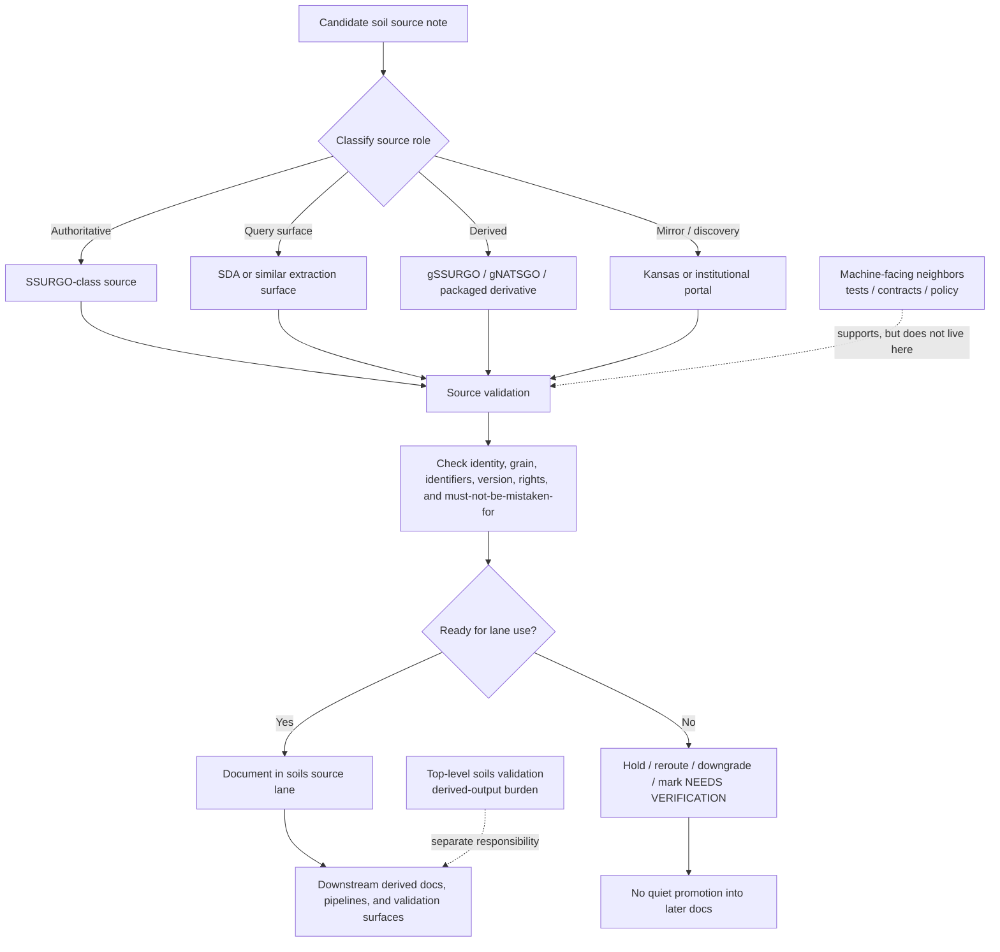

<!-- [KFM_META_BLOCK_V2]
doc_id: kfm://doc/UUID-NEEDS-VERIFICATION
title: Kansas Frontier Matrix — Soils — Source Validation
type: standard
version: v1
status: draft
owners: @bartytime4life, NEEDS VERIFICATION
created: YYYY-MM-DD
updated: YYYY-MM-DD
policy_label: public
related: [docs/domains/soils/README.md, docs/domains/soils/sources/README.md, docs/domains/soils/validation/README.md, docs/pipelines/ssurgo_to_catchment.md, pipelines/soils/gssurgo-ks/README.md, tests/README.md, tests/contracts/README.md]
tags: [kfm, soils, source-validation]
notes: [doc_id and dates need live-repo confirmation; current public-main path exists but was placeholder-only before this revision]
[/KFM_META_BLOCK_V2] -->

# Kansas Frontier Matrix — Soils — Source Validation

_Source-validation README for soil source identity, extraction posture, derivation disclosure, and intake-ready trust signals before KFM turns soil sources into derived baselines or release-facing soil products._

> **Status:** experimental  
> **Owners:** `@bartytime4life` · `NEEDS VERIFICATION` for narrower lane ownership  
>        
> **Quick jumps:** [Scope](#scope) · [Repo fit](#repo-fit) · [Current verified snapshot](#current-verified-snapshot) · [Accepted inputs](#accepted-inputs) · [Exclusions](#exclusions) · [Directory tree](#directory-tree) · [Quickstart](#quickstart) · [Usage](#usage) · [Diagram](#diagram) · [Reference tables](#reference-tables) · [Task list](#task-list--definition-of-done) · [FAQ](#faq) · [Appendix](#appendix)  
> **Repo fit:** `docs/domains/soils/sources/validation/README.md` · upstream [`../README.md`](../README.md) · sibling [`../derived/README.md`](../derived/README.md) · sibling [`../publication/README.md`](../publication/README.md) · domain-level validation neighbor [`../../validation/README.md`](../../validation/README.md) · docs pipeline neighbor [`../../../../pipelines/ssurgo_to_catchment.md`](../../../../pipelines/ssurgo_to_catchment.md) · execution neighbor [`../../../../../pipelines/soils/gssurgo-ks/README.md`](../../../../../pipelines/soils/gssurgo-ks/README.md)  
> **Accepted inputs:** soil-source validation rules, source-family caveats, identifier-retention notes, version/change-signal notes, intake hold/quarantine criteria, and review prompts for authoritative, query-surface, derived, and mirror soil sources  
> **Exclusions:** derived-output weighting logic, public copy rules, executable tests, schema files, workflow YAML, and raw landed data

> [!IMPORTANT]
> This directory should function as a **source-validation lane**, not as a second source catalog and not as a catch-all QA notebook. Its job is to make it hard to onboard a soil source without naming origin authority, source role, grain, retained identifiers, version signals, rights posture, and failure consequences.

> [!NOTE]
> The exact path for this README is already present on current public `main`, but only as a placeholder. This file should therefore replace scaffolding with a real directory contract, while still keeping live-checkout unknowns visible.

> [!WARNING]
> Do not treat this README as proof that a live watcher, schema validator, or release gate already exists for this subtree. Machine-enforced behavior belongs in verified contract, policy, workflow, and test surfaces.

---

## Scope

This directory covers the **human-readable validation burden for soils source material** before a source is trusted downstream.

That burden starts earlier than derived-output validation. It asks whether a soil source note, onboarding page, or source-facing decision is honest about:

- **what the source actually is**
- **whether it is authoritative, query-surface, derived, or mirror/discovery**
- **what support or grain it carries**
- **which identifiers must survive extraction**
- **what release or freshness signals matter**
- **what rights, redistribution, or sensitivity posture applies**
- **what downstream docs must never mistake it for**

For the soils lane, this is where KFM prevents the quiet collapses that cause later docs to drift:

- authoritative survey structure turning into a generic “soil layer”
- Soil Data Access query results being treated like a separate sovereign dataset
- gridded convenience products outranking the vector/tabular authority they derive from
- state or institutional mirrors being used as if they were the origin source
- component / horizon fidelity being implied after the identifiers that prove it were dropped
- “watcher-ready” or “pipeline-ready” claims appearing with no version, checksum, or receipt story

### Truth labels used in this directory

| Label | Meaning here |
| --- | --- |
| **CONFIRMED** | Directly supported by the current visible repo surface or the attached KFM corpus used in this session |
| **INFERRED** | Strongly implied by adjacent KFM docs, but not directly proven as mounted implementation |
| **PROPOSED** | Recommended wording, layout, or workflow shape added to make this directory merge-ready |
| **UNKNOWN** | Not verified strongly enough in the current session |
| **NEEDS VERIFICATION** | A review flag for exact owners, local inventory, workflow depth, or active-branch behavior |

### What this directory is for

This README should help a maintainer answer these questions quickly:

1. Is this soil source page honest about its **authority class**?
2. Is the **grain** clear enough for downstream users to know what they are actually looking at?
3. Are the soil identifiers and extraction details strong enough to support drill-through later?
4. Is the source being described with the right **validation burden**, not merely a download hint?
5. What would make the source note **hold**, **reroute**, **downgrade**, or remain **NEEDS VERIFICATION**?

[Back to top](#kansas-frontier-matrix--soils--source-validation)

---

## Repo fit

This README is the directory contract for `docs/domains/soils/sources/validation/`.

### Working role

Use this directory to keep **source-facing validation** legible. In practice, that means:

- validating source identity before onboarding prose hardens into doctrine
- recording what must stay explicit for authoritative, query, derived, and mirror soil sources
- making failure consequences visible before downstream docs inherit bad assumptions
- routing executable enforcement outward instead of hiding it in prose

### Boundary map

| Surface | What it should own | What it should not own |
| --- | --- | --- |
| [`../README.md`](../README.md) | soil source-role overview and source-family classification | detailed validation burden per source family |
| [`./README.md`](./README.md) | this directory contract for source validation | executable tests, live workflow claims, derived-output weighting rules |
| [`../derived/README.md`](../derived/README.md) | source notes for already-derived soil products | authoritative-source intake validation |
| [`../publication/README.md`](../publication/README.md) | public-facing release posture for soil source material | source onboarding checks or machine test detail |
| [`../../validation/README.md`](../../validation/README.md) | human-readable validation burden for **derived soil outputs** | source onboarding / source-role validation detail |
| [`../../../../pipelines/ssurgo_to_catchment.md`](../../../../pipelines/ssurgo_to_catchment.md) | one focused soil-to-catchment derivation pipeline and its gates | the whole source-validation lane |
| [`../../../../../pipelines/soils/gssurgo-ks/README.md`](../../../../../pipelines/soils/gssurgo-ks/README.md) | execution recipe for one soil ingest family | broad README doctrine for all soils sources |
| [`../../../../../tests/README.md`](../../../../../tests/README.md) | governed verification family boundaries | directory-specific README burden |
| [`../../../../../tests/contracts/README.md`](../../../../../tests/contracts/README.md) | executable contract-shape validation | prose-only source onboarding guidance |

### Repo-fit table

| Item | Value |
| --- | --- |
| **Path** | `docs/domains/soils/sources/validation/README.md` |
| **Path status** | **CONFIRMED** on current public `main`; narrower working-branch reality may still differ |
| **Current public-main state** | placeholder-only file that needs a real directory contract |
| **Upstream** | [`../README.md`](../README.md) · [`../../README.md`](../../README.md) |
| **Key siblings** | [`../derived/README.md`](../derived/README.md) · [`../publication/README.md`](../publication/README.md) · [`../appendices/README.md`](../appendices/README.md) |
| **Domain-level validation neighbor** | [`../../validation/README.md`](../../validation/README.md) |
| **Pipeline-facing neighbors** | [`../../../../pipelines/README.md`](../../../../pipelines/README.md) · [`../../../../pipelines/ssurgo_to_catchment.md`](../../../../pipelines/ssurgo_to_catchment.md) · [`../../../../../pipelines/soils/gssurgo-ks/README.md`](../../../../../pipelines/soils/gssurgo-ks/README.md) |
| **Machine-facing neighbors** | [`../../../../../tests/README.md`](../../../../../tests/README.md) · [`../../../../../tests/contracts/README.md`](../../../../../tests/contracts/README.md) |
| **Owner fallback visible in repo** | [`../../../../../.github/CODEOWNERS`](../../../../../.github/CODEOWNERS) |
| **Primary audience** | maintainers, source stewards, ingest authors, reviewers, and downstream soil-doc authors |

> [!TIP]
> The strongest local reading is: parent `sources/README.md` explains **what source role a thing is**, while this directory explains **what must be checked before that source role can safely enter the lane without misleading later docs**.

[Back to top](#kansas-frontier-matrix--soils--source-validation)

---

## Current verified snapshot

The public-main snapshot that could be directly checked for this directory is intentionally narrow.

### CONFIRMED

- This exact path already exists and is currently placeholder-only.
- The public repo already exposes a soils lane README, a soils sources README, a soils derived-source README, a soils-source appendices README, and a separate domain-level soils validation README.
- The public repo also exposes a soil-to-catchment docs pipeline page and a `pipelines/soils/gssurgo-ks/README.md` execution recipe.
- The public repo exposes `tests/README.md` and `tests/contracts/README.md`, which reinforces that executable validation belongs in dedicated verification families, not in this README.
- Current public owner fallback for `/docs/` remains `@bartytime4life`.

### CONFIRMED from the KFM corpus and adjacent docs

- Source onboarding in KFM is supposed to behave like a **contract**, not like a casual download note.
- The first source/intake proof objects are still the familiar triad: **SourceDescriptor**, **IngestReceipt**, and **ValidationReport**.
- In the soils lane, **SSURGO-class authority**, **Soil Data Access query behavior**, **gSSURGO/gNATSGO derivative status**, and **mirror-vs-origin distinction** are all load-bearing.
- The soil structure **Map Unit → Component → Horizon** must remain visible whenever a page implies that component or horizon fidelity survives extraction.

### NEEDS VERIFICATION

- Whether this directory already has leaf pages beyond `README.md` on the working branch
- Whether any narrower CODEOWNERS split exists for this subtree
- Whether current schemas, fixtures, or policy bundles already reference this path directly
- Whether merge-blocking checks or docs gates currently touch this subtree
- Whether working-branch docs already normalize this lane differently from public `main`

[Back to top](#kansas-frontier-matrix--soils--source-validation)

---

## Accepted inputs

Place material here when it is primarily about **validating soil source meaning before downstream use**.

Typical inputs include:

- source-family validation notes for **SSURGO**, **SDA**, **gSSURGO**, **gNATSGO**, and soil mirrors
- rules for declaring whether a source is **authoritative**, **query-surface**, **derived**, or **mirror/discovery**
- notes on preserved identifiers such as `areasymbol`, `mukey`, `cokey`, and `chkey`
- version, freshness, and change-signal notes such as release date, `ETag`, `Last-Modified`, content hash, schema snapshot, or `spec_hash`
- source-specific cautions about support, grain, or resolution
- hold / downgrade / reroute examples for misleading or under-specified source pages
- source-validation checklists that a reviewer can apply before a source leaf is accepted
- appendix-length caveat links when the actual long-form reference lives in [`../appendices/README.md`](../appendices/README.md)

### Source-validation questions every page or note should answer

1. **What is this source?**
2. **What source role does it have in KFM?**
3. **What is its real support or grain?**
4. **How is it acquired in practice?**
5. **Which identifiers must survive extraction?**
6. **What release, freshness, or schema signals are trustworthy enough to watch?**
7. **What must nobody mistake it for later?**
8. **What happens if those expectations are not met?**

[Back to top](#kansas-frontier-matrix--soils--source-validation)

---

## Exclusions

| Excluded material | Why it does not belong here | Put it in instead |
| --- | --- | --- |
| Derived-output weighting rules | This directory validates **sources before downstream use**, not final rollups | [`../../validation/README.md`](../../validation/README.md) or the owning pipeline doc |
| Public-safe wording or release copy | Publication posture is a separate burden | [`../publication/README.md`](../publication/README.md) |
| Executable test code or workflow YAML | This README should not impersonate enforcement | [`../../../../../tests/`](../../../../../tests/) and the owning workflow surface |
| JSON Schema, fixtures, or Rego | Machine-checkable surfaces should stay machine-checkable | contract / schema / policy surfaces |
| Raw downloads, query dumps, or landed tables | This is not a storage or truth-path artifact home | RAW / WORK / CATALOG artifacts |
| Broad soils domain doctrine | The domain hub already owns that burden | [`../../README.md`](../../README.md) |
| Quiet claims that a watcher or pipeline is already live | Public repo visibility does not prove runtime depth | keep the claim explicit as **PROPOSED** or **NEEDS VERIFICATION** |
| “Soil layer” notes with no role, grain, or source origin | They create downstream trust drift | route back here and fix the source note first |

> [!CAUTION]
> If a source note implies **component** or **horizon** fidelity, it should not silently drop the identifiers or extraction story needed to prove that claim later.

[Back to top](#kansas-frontier-matrix--soils--source-validation)

---

## Directory tree

### Current public-main snapshot

```text
docs/
└── domains/
    └── soils/
        └── sources/
            └── validation/
                └── README.md
```

### Confirmed nearby source-facing subtree

```text
docs/
└── domains/
    └── soils/
        └── sources/
            ├── README.md
            ├── appendices/
            │   └── README.md
            ├── derived/
            │   └── README.md
            ├── publication/
            │   └── README.md
            └── validation/
                └── README.md
```

### Possible future leaves (`PROPOSED / NEEDS VERIFICATION`)

```text
docs/domains/soils/sources/validation/
├── README.md
├── ssurgo-source-checks.md
├── sda-query-validation.md
├── gssurgo-intake-caveats.md
├── gnatsgo-scale-cautions.md
└── mirror-origin-checks.md
```

[Back to top](#kansas-frontier-matrix--soils--source-validation)

---

## Quickstart

Use this sequence when creating or revising any soil source-validation page in this subtree.

1. **Classify the source role first.**  
   Do not start with convenience or popularity. Start with: authoritative, query-surface, derived, or mirror/discovery.

2. **Name the origin source explicitly.**  
   If a page is about a mirror, service, or package, say what authoritative source it depends on.

3. **Declare the real support or grain.**  
   Map unit, component, horizon, raster cell, statewide grid, county package, or service result are not interchangeable.

4. **Preserve the identifiers that make later drill-through possible.**  
   For soil work, this usually means naming the retained key set and any deliberate losses.

5. **Capture version and change signals.**  
   Release date, annual refresh anchor, `ETag`, `Last-Modified`, schema snapshot, query hash, package checksum, or `spec_hash` should be named where they matter.

6. **Write the failure consequence.**  
   Say whether missing information should trigger hold, reroute, downgrade, quarantine, or `NEEDS VERIFICATION`.

7. **Link machine-facing surfaces only when verified.**  
   It is better to name a likely contract/test neighbor as `NEEDS VERIFICATION` than to quietly imply it already exists.

### Minimal leaf starter

```md
# <Source family or source-validation topic>

One-line purpose for why this page belongs in `docs/domains/soils/sources/validation/`.

> **Source role:** authoritative | query-surface | derived | mirror/discovery
> **Origin authority:** 
> **Support / grain:** 
> **Path status:** CONFIRMED | INFERRED | PROPOSED | NEEDS VERIFICATION

## What is being validated
- 

## Must-stay-visible facts
- 
- 

## Required identifiers
- `areasymbol`
- `mukey`
- `cokey`
- `chkey`
- or justified subset / alternative

## Version and freshness signals
- 
- 

## Hold / reroute / downgrade conditions
- 

## Related surfaces
- parent source hub: `../README.md`
- derived-source lane (if relevant): `../derived/README.md`
- domain-level validation: `../../validation/README.md`
```

[Back to top](#kansas-frontier-matrix--soils--source-validation)

---

## Usage

### Use this directory when

Use this subtree when the main question is:

- “Can this soil source be described downstream without misleading people?”
- “What has to stay visible before a source note is trustworthy?”
- “Is this really authoritative, or merely a convenient derivative or mirror?”
- “What version, extraction, or identifier story needs to survive?”

### Keep source validation separate from output validation

A useful rule of thumb:

- **source validation** asks whether the source page is honest enough to enter the lane
- **derived-output validation** asks whether a product built from those sources is internally sound
- **publication validation** asks whether the outward-facing form is safe, supported, and reviewable

Those are related, but they are not the same document burden.

### Keep source validation separate from source explanation

Parent `sources/README.md` is the source-role map.

This directory is the place where that role map becomes review pressure. A page here should make it easier to reject sentences like:

- “SDA is the dataset”
- “gSSURGO is the authority”
- “the Kansas hub layer is the source of record”
- “component-level fidelity is preserved” when only map-unit or raster-level output remains

### Keep the soils hierarchy visible

For KFM, the source-validation lane should make it hard to forget the upstream structure:

```text
Map Unit → Component → Horizon
```

A good page in this directory does not merely mention that hierarchy. It explains whether the source or extraction path preserves it, partially collapses it, or loses it outright.

[Back to top](#kansas-frontier-matrix--soils--source-validation)

---

## Diagram



[Back to top](#kansas-frontier-matrix--soils--source-validation)

---

## Reference tables

### Minimum validation families for this directory

| Validation family | Example question | Outcome if failed | Proof object or neighbor this should point toward |
| --- | --- | --- | --- |
| **Source identity** | Is the page clear about the authoritative origin? | hold / reroute | `SourceDescriptor` |
| **Source-role classification** | Is the source labeled authoritative, query-surface, derived, or mirror? | hold | parent source hub + `SourceDescriptor` |
| **Support / grain clarity** | Is it obvious whether the page is about map units, components, horizons, raster cells, or a service result? | hold / downgrade | `SourceDescriptor` + validation notes |
| **Identifier retention** | If later docs imply component or horizon fidelity, are `mukey` / `cokey` / `chkey` or equivalent retained? | hold | `ValidationReport` |
| **Access / extraction lineage** | Is the acquisition route or query path explicit enough to reproduce? | hold / NEEDS VERIFICATION | `IngestReceipt` |
| **Version / freshness signals** | Does the page name release date, refresh anchor, headers, hashes, or schema signals worth watching? | caution / no automation claim | `IngestReceipt` + run manifest |
| **Rights / redistribution** | Is the source’s usage posture clear enough for later publication? | block / review | decision or release neighbor |
| **Mirror / derivation disclosure** | If the source is a mirror or derivative, does the page keep the upstream authority explicit? | reroute / downgrade | parent source hub + derived-source lane |
| **Failure consequence** | Does the page say what happens when required context is missing? | fix before merge | `ValidationReport` or review note |

### Soil source family handling matrix

| Source family | Validation focus here | Must stay visible | Common failure mode |
| --- | --- | --- | --- |
| **SSURGO** | authoritative-source identity, coverage scope, retained keys, release / refresh posture | authoritative status, survey-area or Kansas scope, retained soil hierarchy, identifiers | described as a generic soil layer with no authority or grain statement |
| **Soil Data Access (SDA)** | query lineage, canonical SQL or field-selection context, returned identifiers, endpoint role | authoritative query-surface status, extraction route, request-time provenance | treated as a standalone sovereign dataset with no query story |
| **gSSURGO** | derivative disclosure, grid support, package/version signals, what was preserved vs collapsed | derived status, statewide or CONUS grid support, lag vs SSURGO-class authority | promoted as equivalent to raw authoritative survey structure |
| **gNATSGO** | broader-scale fallback role, mixed-scale cautions, version signals, raster-first implications | fallback / continuity role, scale consequences, use-case limits | substituted for Kansas-first detailed map-unit truth without warning |
| **Kansas or institutional mirrors** | origin-source disclosure, mirror freshness clues, reason for use, authority boundary | mirrored origin, service or portal status, why the mirror is used | mirror or portal quietly treated as source of record |
| **KFM-built packaged soil derivatives** | only enough to prove they are not raw authorities | upstream authority, derivation chain, routed downstream docs | source-validation page becomes a hidden derived-product README |

### Minimum fields every leaf in this directory should carry

| Field | Why it matters |
| --- | --- |
| **Source name** | makes the page scannable and linkable |
| **Source role** | prevents silent upgrades of authority |
| **Origin source** | keeps mirrors and derivatives subordinate to the right base |
| **Support / grain** | stops map unit, component, horizon, service result, and raster cell from collapsing together |
| **Acquisition route** | keeps download, query, portal, and mirror behavior distinct |
| **Retained identifiers** | preserves drill-through to upstream meaning |
| **Version / freshness signals** | supports watcher-style reasoning without bluffing live automation |
| **Rights / redistribution note** | keeps downstream publication honest |
| **Must-not-be-mistaken-for** | makes the failure mode explicit |
| **Hold / reroute / downgrade conditions** | shows what breaks trust early rather than late |
| **Related downstream docs** | keeps this directory connected but not overloaded |

### Source-validation vs neighboring responsibilities

| Concern | Best home | Why |
| --- | --- | --- |
| “What source family is this?” | [`../README.md`](../README.md) | source-role overview |
| “What must be checked before that source note is trusted?” | `./README.md` and child leaves | this directory’s burden |
| “Did the soil rollup preserve weighting and coverage?” | [`../../validation/README.md`](../../validation/README.md) | derived-output burden |
| “How does one specific soil pipeline overlay SSURGO with catchments?” | [`../../../../pipelines/ssurgo_to_catchment.md`](../../../../pipelines/ssurgo_to_catchment.md) | pipeline-specific behavior |
| “What code or recipe ingests Kansas gSSURGO?” | [`../../../../../pipelines/soils/gssurgo-ks/README.md`](../../../../../pipelines/soils/gssurgo-ks/README.md) | execution-facing lane |
| “What executable contract examples or invalid fixtures exist?” | [`../../../../../tests/contracts/README.md`](../../../../../tests/contracts/README.md) | machine-facing verification |

[Back to top](#kansas-frontier-matrix--soils--source-validation)

---

## Task list / definition of done

A source-validation page in this directory is review-ready when all applicable checks below are true.

- [ ] The source role is explicit.
- [ ] The authoritative origin is named explicitly.
- [ ] Support or grain is declared clearly.
- [ ] Retained identifiers are listed, or their loss is stated honestly.
- [ ] Version, refresh, or change signals are named.
- [ ] Rights / redistribution posture is not guessed.
- [ ] Mirror or derivative status is visible where relevant.
- [ ] “Must not be mistaken for” language is present.
- [ ] Hold / reroute / downgrade conditions are stated.
- [ ] Neighbor links are checked.
- [ ] Machine-enforcement claims are marked **NEEDS VERIFICATION** unless directly proven.
- [ ] The page is narrow enough to help review instead of becoming a second general soils manual.

> [!TIP]
> The best quick test is simple: if a downstream doc borrowed one paragraph from this directory, would it be harder for that downstream doc to overclaim authority, fidelity, freshness, or coverage? If not, the source-validation page is still too thin.

[Back to top](#kansas-frontier-matrix--soils--source-validation)

---

## FAQ

### Is this the same as the top-level soils validation README?

No.

`docs/domains/soils/validation/README.md` is the broader human-readable validation burden for **derived soil outputs**. This directory stays earlier in the truth path and focuses on **source-facing validation**.

### Does this directory prove a live watcher or connector already exists?

No.

It may describe the minimum information a watcher-ready source note should carry, but live automation claims belong in verified pipeline, workflow, contract, or test surfaces.

### Is SDA the same thing as SSURGO?

No.

SDA is a programmatic **query surface** into soil content. It can be authoritative for access, but it should not be documented as a separate sovereign soil authority.

### Why keep gSSURGO and gNATSGO here at all if they are derived?

Because source validation still matters for derived source families. A page may legitimately describe them here, but it must keep their derivative status and upstream authority explicit.

### What must remain visible before a mirror or portal is used downstream?

At minimum:

- the origin source
- the mirror/discovery role
- the freshness or revision clue the mirror exposes
- the reason the mirror is being used at all
- the fact that the mirror does **not** outrank the source of record

[Back to top](#kansas-frontier-matrix--soils--source-validation)

---

## Appendix

<details>
<summary><strong>Appendix A — Minimal leaf template</strong></summary>

```md
# <Source family validation page>

One-line purpose.

> **Source role:** authoritative | query-surface | derived | mirror/discovery
> **Origin source:** 
> **Support / grain:** 
> **Status:** CONFIRMED | INFERRED | PROPOSED | NEEDS VERIFICATION

## What is being validated
- 

## Required identifiers
- `areasymbol`
- `mukey`
- `cokey`
- `chkey`
- or justified equivalent

## Version / freshness signals
- 

## Must not be mistaken for
- 

## Hold / reroute / downgrade conditions
- 

## Related surfaces
- parent lane: `../README.md`
- derived source lane: `../derived/README.md`
- domain-level validation: `../../validation/README.md`
```

</details>

<details>
<summary><strong>Appendix B — Suggested future leaf names (<code>PROPOSED / NEEDS VERIFICATION</code>)</strong></summary>

```text
ssurgo-source-checks.md
sda-query-validation.md
gssurgo-intake-caveats.md
gnatsgo-scale-cautions.md
kansas-soils-mirror-origin-checks.md
```

Naming rule of thumb: prefer short, source-first filenames over narrative titles.

</details>

<details>
<summary><strong>Appendix C — Reviewer prompts</strong></summary>

Good reviewer questions for this directory:

1. Does the page quietly upgrade a derivative or mirror into an authority?
2. Does it hide the grain or support that makes the source meaningful?
3. Does it imply component or horizon fidelity after the identifiers were dropped?
4. Does it give enough version or freshness information to justify watcher-style language?
5. Does it keep output-validation work in the top-level soils validation lane instead of duplicating it here?
6. Does it mark live enforcement depth honestly?

</details>

[Back to top](#kansas-frontier-matrix--soils--source-validation)
