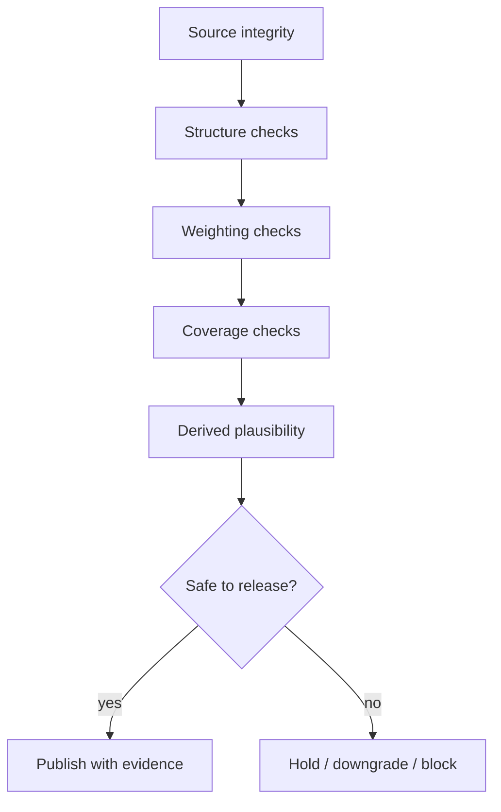

<!-- [KFM_META_BLOCK_V2]
doc_id: kfm://doc/NEEDS-VERIFICATION
title: Kansas Frontier Matrix — Soils — Validation
type: standard
version: v1
status: draft
owners: [@bartytime4life, NEEDS VERIFICATION]
created: 2026-04-01
updated: 2026-04-01
policy_label: public
related: [
  "../README.md",
  "../derived/README.md",
  "../../../pipelines/ssurgo_to_catchment.md",
  "../../../governance/ROOT_GOVERNANCE.md",
  "../../../tests/README.md"
]
tags: [kfm, soils, validation, qa, weighting, coverage, fail-closed]
notes: [
  "Requested as part of the user-directed soils module build.",
  "This subtree is PROPOSED; exact live pathing and owners NEED VERIFICATION.",
  "Validation is framed as burden and gate logic, not as proof that runnable checks already exist."
]
[/KFM_META_BLOCK_V2] -->

# Kansas Frontier Matrix — Soils — Validation

Validation README for soil-source integrity, weighting correctness, coverage visibility, plausibility checks, and fail-closed release posture for derived soil products.

| Status | Owners | Quick fit |
|---|---|---|
|     | @bartytime4life, NEEDS VERIFICATION | Human-readable validation burden for soil inputs and derived outputs before publication or downstream trust use |

**Purpose:** document the minimum validation posture for soil sources and derived soil surfaces without impersonating executable tests.  
**Repo fit:** child page under `docs/domains/soils/`; upstream [`../README.md`](../README.md).  
**Accepted inputs:** validation rules, burden notes, thresholds, caution conditions, and release-blocking examples.  
**Exclusions:** runnable harnesses, schemas, fixtures, and workflow YAML.

**Quick jumps:** [Scope](#scope) · [Repo fit](#repo-fit) · [Accepted inputs](#accepted-inputs) · [Exclusions](#exclusions) · [Directory tree](#directory-tree) · [Quickstart](#quickstart) · [Usage](#usage) · [Diagram](#diagram) · [Tables](#tables) · [Task list](#task-list) · [FAQ](#faq)

> [!IMPORTANT]
> **Validation rule:** a soil summary that cannot explain its coverage, weighting, and source lineage is not ready for trust-bearing use.

## Scope

This page covers human-readable validation expectations for:

- source completeness
- retained identifiers
- component/horizon structure
- rollup correctness
- coverage visibility
- threshold-driven caution or block
- fail-closed behavior when support is weak

## Repo fit

| Item | Value |
|---|---|
| Path | `docs/domains/soils/validation/README.md` |
| Path status | **PROPOSED / NEEDS VERIFICATION** |
| Upstream | [`../README.md`](../README.md) · [`../derived/README.md`](../derived/README.md) |
| Adjacent | [`../../../pipelines/ssurgo_to_catchment.md`](../../../pipelines/ssurgo_to_catchment.md) |
| Machine-facing neighbor | [`../../../tests/README.md`](../../../tests/README.md) |

## Accepted inputs

- validation matrices
- required invariants
- proposed thresholds
- examples of reject / hold / downgrade cases
- rollup integrity notes
- confidence downgrade logic
- release-blocking cautions

## Exclusions

| Exclusion | Why |
|---|---|
| Exact policy code | belongs in machine policy surfaces |
| JSON Schema | belongs in contract/schema surfaces |
| Test implementation | belongs in tests/workflows |
| Public copy rules | belongs in publication docs |

## Directory tree

```text
docs/domains/soils/
├── validation/
│   └── README.md
└── publication/
    └── README.md
```

## Quickstart

1. Validate source identity retention.
2. Validate structure before aggregation.
3. Validate weighting before summary.
4. Validate coverage before publication.
5. Downgrade or block rather than bluff.

## Usage

Use this page when adding or reviewing any soil-derived output. It should be possible to tell, from documentation alone, what conditions would make the release hold, narrow, downgrade, or fail.

## Diagram



## Tables

### Minimum validation families

| Validation family | Example question | Outcome if failed |
|---|---|---|
| Source identity | were source families and versions preserved? | hold |
| Structural continuity | were map-unit / component / horizon relationships preserved? | hold |
| Weighting integrity | were component shares or area shares applied explicitly? | hold |
| Coverage | how much of the reporting unit is actually supported? | downgrade or block |
| Plausibility | are values physically reasonable? | investigate / block |
| Mixed-case handling | is a weak dominant class mislabeled as certain? | downgrade |

### Proposed caution thresholds

| Condition | Suggested posture | Status |
|---|---|---|
| low coverage share | downgrade or block | **PROPOSED** |
| weak primary class dominance | emit mixed / caution | **PROPOSED** |
| missing provenance | block | **INFERRED** |
| unresolved join anomalies | hold | **INFERRED** |

## Task list

- [ ] Verify whether any soil-specific thresholds already exist in policy/tests
- [ ] Align threshold language with live contracts if present
- [ ] Keep validation prose separate from executable claims
- [ ] Add links to fixtures/tests when verified
- [ ] Ensure every derived example has a corresponding validation burden

## FAQ

### Does this page prove checks already exist?

No. It states the burden and expected gates. Live enforcement still needs direct verification.

### What should happen on incomplete coverage?

At minimum, a visible downgrade. In stronger cases, a hold or block.

### Are thresholds fixed here?

No. Unless verified elsewhere, thresholds should remain clearly marked as proposed.
