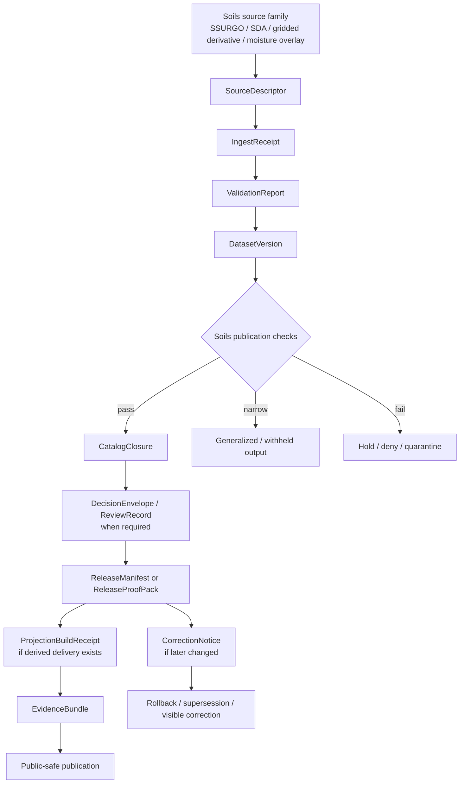

<!-- [KFM_META_BLOCK_V2]
doc_id: kfm://doc/NEEDS-VERIFICATION
title: Soils Publication Validation
type: standard
version: v1
status: draft
owners: NEEDS VERIFICATION
created: YYYY-MM-DD
updated: YYYY-MM-DD
policy_label: NEEDS VERIFICATION
related: [NEEDS VERIFICATION]
tags: [kfm, soils, validation, publication]
notes: [Mounted repository structure, owners, dates, adjacent paths, and local workflow evidence were not directly verified in the current session.]
[/KFM_META_BLOCK_V2] -->

# Soils Publication Validation

Governed publication-validation surface for the KFM soils lane.

> [!NOTE]
> **Status:** experimental  
> **Owners:** NEEDS VERIFICATION  
>      
> **Quick jumps:** [Scope](#scope) · [Repo fit](#repo-fit) · [Accepted inputs](#accepted-inputs) · [Exclusions](#exclusions) · [Current verified snapshot](#current-verified-snapshot) · [Directory tree](#directory-tree) · [Quickstart](#quickstart) · [Usage](#usage) · [Diagram](#diagram) · [Tables](#tables) · [Task list](#task-list--definition-of-done) · [FAQ](#faq) · [Appendix](#appendix)  
> **Repo fit:** `docs/domains/soils/validation/publication/` → upstream: **NEEDS VERIFICATION** · downstream: **NEEDS VERIFICATION**

> [!IMPORTANT]
> This directory is the **publication-validation** home for the soils lane. It is where a candidate soils artifact is judged for outward admissibility, release meaning, and correction readiness. It is **not** the general home for soil-source onboarding, exploratory analysis, raw downloads, or generic GIS notes.

> [!WARNING]
> Current-session workspace evidence exposed a PDF-rich corpus, not a mounted repo tree. Adjacent files, local tests, CODEOWNERS, workflows, manifests, and actual file inventory under this directory remain **UNKNOWN** or **NEEDS VERIFICATION** unless directly surfaced later.

## Scope

This directory exists to keep the **soil publication burden** explicit at the point where artifacts become outward-facing.

In KFM terms, that means this directory should help answer questions such as:

- What soils artifact is being proposed for publication?
- What authoritative source family and resolution choice does it depend on?
- What validation and review evidence exists?
- What remains **observed**, what is **modeled** or **derived**, and what is only **generalized** or **withheld**?
- What release, correction, rollback, or supersession path exists if the artifact later changes?

This lane should stay narrow. It should make publication safer and more inspectable, not become a second soils architecture manual.

## Repo fit

| Path | Role | Relationship |
| --- | --- | --- |
| `docs/domains/soils/validation/publication/README.md` | this file | directory README and routing surface for soils publication validation |
| `docs/domains/soils/validation/publication/` | directory | lane-local publication-validation surface |
| `docs/domains/soils/` | NEEDS VERIFICATION | likely broader soils lane parent |
| `docs/domains/soils/validation/` | NEEDS VERIFICATION | likely parent validation subtree |
| lane-local manifests, examples, proof packs, fixtures, or runbooks | NEEDS VERIFICATION | current session did not directly surface mounted neighbors |

## Accepted inputs

This directory accepts **publication-facing** soils artifacts and review objects such as:

- candidate `SourceDescriptor` records for a soils source family when they materially affect publication meaning
- `IngestReceipt` and `ValidationReport` artifacts that prove the candidate did not skip intake or quarantine logic
- candidate or promoted `DatasetVersion` objects for soil map units, summaries, or derived soil-facing packages
- `CatalogClosure` objects that resolve outward STAC / DCAT / PROV closure
- `DecisionEnvelope` and `ReviewRecord` artifacts when review, narrowing, or denial is required
- `ReleaseManifest` or `ReleaseProofPack` materials that explain why something became public-safe
- `ProjectionBuildReceipt` artifacts for renderer-facing or export-facing derived soils products
- `EvidenceBundle` examples used to support a claim, feature view, story excerpt, or export preview
- lane-local release-ready packaging plans for active soils-related Kansas gaps when those plans directly affect publication posture

## Exclusions

This directory is **not** the home for:

- raw SSURGO, gSSURGO, gNATSGO, or SDA pulls
- exploratory notebooks, ad hoc joins, or working aggregation experiments
- source-harvest scripts and low-level connector notes unless their publication consequence is the point
- general soils science background or cartography primers
- UI-only mockups detached from release, evidence, or correction behavior
- unpublished experiments that do not yet carry reviewable evidence
- assertions that a soils artifact is “done,” “released,” or “operational” without release evidence
- silent substitution of one soil source or resolution for another

## Current verified snapshot

| Label | What is true in this directory now |
| --- | --- |
| **CONFIRMED** | KFM treats soils as part of the Kansas operating lane for **agriculture, soils, erosion, land cover, and rural production**. |
| **CONFIRMED** | Soils publication must keep **modeled** and **observed** layers visibly distinct. |
| **CONFIRMED** | Active Kansas soils-adjacent gaps remain visible in the corpus, especially **groundwater**, **erosion**, and **long-term soil moisture** packaging. |
| **CONFIRMED** | Publication in KFM depends on a contract-and-proof spine rather than a file-drop or convenience publish. |
| **INFERRED** | This directory should function as the soils lane’s local publication-validation routing surface. |
| **UNKNOWN** | Mounted neighboring files, owners, workflows, fixtures, and exact file inventory were not directly surfaced in the current session. |

## Directory tree

Current directly verified snapshot:

```text
docs/
└── domains/
    └── soils/
        └── validation/
            └── publication/
                └── README.md
```

Illustrative local expansion shape only:

```text
docs/
└── domains/
    └── soils/
        └── validation/
            └── publication/
                ├── README.md
                ├── NEEDS-VERIFICATION release-oriented examples
                ├── NEEDS-VERIFICATION proof-pack or manifest references
                └── NEEDS-VERIFICATION lane-local review notes
```

> [!TIP]
> Keep this directory focused on **publishability**. If a file primarily explains ingestion, harmonization, or modeling, route it to the lane that owns that behavior instead of widening this README into a catch-all soils manual.

## Quickstart

### Minimal reviewer flow

1. Start with the **candidate authoritative subject**, not the map tile, screenshot, or export.
2. Confirm the contract spine is present enough to judge publication.
3. Apply the soils-specific burden checks.
4. Confirm outward metadata closure and release evidence.
5. Record whether the candidate should be **promoted**, **generalized**, **held**, **denied**, **corrected**, or left **NEEDS VERIFICATION**.

### Quick gate checklist

```yaml
# illustrative pseudocode only
soil_publication_candidate:
  required_contracts:
    - SourceDescriptor
    - IngestReceipt
    - ValidationReport
    - DatasetVersion
    - CatalogClosure
  required_release_evidence:
    - ReleaseManifest_or_ReleaseProofPack
  required_when_applicable:
    - DecisionEnvelope
    - ReviewRecord
    - ProjectionBuildReceipt
    - EvidenceBundle
    - CorrectionNotice
  soil_specific_checks:
    - source_family_and_resolution_visible
    - observed_vs_modeled_not_silently_mixed
    - aggregation_or_component_weighting_disclosed
    - active_gap_or_limitations_named
```

### Fast triage rule

Use this directory when the core question is:

> “Can this soils artifact be treated as outwardly admissible under KFM?”

Do not use this directory when the core question is:

> “How do we fetch, model, clean, or study soils data?”

## Usage

### 1) Use this directory to validate publication meaning

A candidate belongs here when its **public meaning** is under review.

Common examples:

- a soil map-unit package proposed for release
- a component-weighted soils summary intended for public download
- a derived soils layer intended for map delivery or export
- a release bundle whose evidence trail must be checked before promotion
- a correction or supersession package for an already-published soils artifact

### 2) Keep the authoritative / derived split visible

For soils, the most important publication mistake is often not a broken file. It is a **blurred role**.

Examples of role blur to avoid:

- presenting a gridded derivative as if it were the same thing as the authoritative substrate
- hiding whether a soil-moisture field is observed, assimilated, modeled, or aggregated
- summarizing map-unit components so aggressively that downstream users cannot tell what was lost

### 3) Preserve source and resolution truth

If a candidate uses SSURGO, gSSURGO, gNATSGO, SDA extracts, or soil-moisture overlays, the publication package should make that explicit.

At minimum, the publication record should answer:

- Which source family is authoritative for this artifact?
- What resolution or support does it actually represent?
- Is the result a direct subject set, a summarized subject set, or a projection for delivery?
- What tradeoff was taken for public readability or package size?

### 4) Make KFM’s negative outcomes first-class

A soils candidate does **not** fail this directory simply because it is not publishable yet.

Valid outcomes here include:

- **promote**
- **generalize**
- **hold**
- **deny**
- **quarantine**
- **stale-visible**
- **correct**
- **supersede**

This directory should make those outcomes legible instead of hiding them behind silence.

## Diagram



## Tables

### Publication-facing object matrix

| Object | Why it belongs here | Minimum question this directory should answer |
| --- | --- | --- |
| `SourceDescriptor` | declares source identity, access, semantics, rights, validation, and lineage expectations | Do we know what this soils artifact is actually built from? |
| `IngestReceipt` | proves a fetch and landing event happened | Was there a real intake event, or only a claim that there was? |
| `ValidationReport` | records pass / fail / quarantine outcomes | What checks ran, and what still blocks release? |
| `DatasetVersion` | carries stable candidate or promoted subject identity | What exact subject set is under review? |
| `CatalogClosure` | links STAC / DCAT / PROV outward closure | Can outside readers resolve what this artifact is and where it came from? |
| `DecisionEnvelope` | records policy outcome machine-readably | Was the publication outcome explicit? |
| `ReviewRecord` | captures human approval, denial, or escalation | Did a reviewer actually decide, and in what role? |
| `ReleaseManifest` / `ReleaseProofPack` | assembles public-safe release evidence | Why did this become publishable now? |
| `ProjectionBuildReceipt` | proves a derived layer was built from release scope | Did the delivery-facing soils layer inherit release state correctly? |
| `EvidenceBundle` | packages support for outward claims and previews | Can a public claim about the soils artifact be inspected? |
| `CorrectionNotice` | preserves visible lineage under change | How does this directory keep correction visible instead of overwriting history? |

### Soil-specific publication cautions

| Caution | What must stay visible | Failure to avoid |
| --- | --- | --- |
| Source-role blur | authoritative substrate vs derived delivery | letting browse-friendly layers inherit authority by convenience |
| Resolution drift | whether the artifact is detailed vector, gridded derivative, or broader fallback surface | presenting unlike supports as directly comparable |
| Modeled vs observed collapse | whether moisture or environmental context is observed, assimilated, modeled, or summarized | hiding epistemic differences behind one “soil condition” label |
| Aggregation smoothing | dominant-component rules, component weighting, or summary loss | overstating certainty after compressing intra-map-unit diversity |
| Gap suppression | groundwater, erosion, long-term soil moisture, vegetation-change packaging, and related Kansas gaps | publishing a “complete” lane story when major known gaps remain active |
| Metadata closure failure | STAC / DCAT / PROV and release linkage | making a package downloadable but not reconstructable |
| Correction invisibility | correction, rollback, or supersession path | silently replacing older public meaning |

## Task list / definition of done

A soils publication-validation update is complete when:

- [ ] the candidate subject is identified as a real `DatasetVersion` or equivalent reviewable release object
- [ ] a `SourceDescriptor` or equivalent source declaration makes the source family and support visible
- [ ] intake and validation evidence exists, including quarantine or negative-path state where relevant
- [ ] source choice and resolution are explicit
- [ ] **modeled**, **observed**, **assimilated**, and **derived** roles are not silently merged
- [ ] any component-weighting or dominant-component simplification is disclosed
- [ ] outward metadata closure exists or is explicitly blocked
- [ ] review / decision state is recorded where the lane burden requires it
- [ ] release evidence explains why the artifact is public-safe now
- [ ] derived delivery artifacts carry release linkage instead of inheriting authority by convenience
- [ ] correction or rollback posture is visible if the package changes later
- [ ] no sentence in the update implies mounted repo reality that current evidence did not verify

[Back to top](#soils-publication-validation)

## FAQ

### Why is this directory not the place for raw SSURGO or SDA pulls?

Because KFM separates **source intake** from **public-safe publication**. Raw landing and working transformation are part of the truth path, but this directory is about the point where meaning becomes outward-facing.

### Can a gridded soils derivative stand in for the authoritative substrate?

Only if the role is explicit. This directory should reject any package that quietly swaps a derived surface in as if it were the same thing as the authoritative subject set.

### Are soil-moisture or earth-observation overlays allowed here?

Yes, when their **knowledge character** is explicit and the publication package keeps method, time basis, and source role visible. They should not be flattened into one generic soils truth layer.

### What if the only evidence available is doctrine?

Treat the directory as scaffolded and keep outcomes conservative. Doctrine can define the burden, but doctrine alone does not prove a release happened or that a mounted validation workflow exists.

### Why does this README keep so many placeholders?

Because the current-session evidence did not directly surface mounted owners, adjacent paths, local workflows, or fixtures for this directory. The placeholders are there to avoid turning doctrine into invented repo fact.

[Back to top](#soils-publication-validation)

## Appendix

<details>
<summary><strong>Illustrative publication bundle shape</strong></summary>

```text
# illustrative only — not verified mounted repo inventory
soil-publication-candidate/
├── source-descriptor.json
├── ingest-receipt.json
├── validation-report.json
├── dataset-version.json
├── catalog-closure.json
├── decision-envelope.json
├── review-record.json
├── release-manifest.json
├── projection-build-receipt.json
├── evidence-bundle.json
└── correction-notice.json
```

</details>

<details>
<summary><strong>Illustrative review questions</strong></summary>

1. What exact soil subject is under review?
2. Which source family is authoritative here?
3. What support or resolution does the candidate actually represent?
4. What was summarized, weighted, generalized, or withheld?
5. Which checks passed, failed, or quarantined?
6. Which outward metadata objects resolve this candidate?
7. What release evidence makes this publishable now?
8. What correction path exists if the source later refreshes or a packaging error is found?

</details>

<details>
<summary><strong>Illustrative evidence line styles</strong></summary>

```md
**Evidence:** candidate DatasetVersion + ValidationReport + CatalogClosure + ReleaseManifest

**Evidence:** soils release proof pack + signed run receipt + ProjectionBuildReceipt

**Evidence:** correction notice superseding prior soils package + updated outward metadata closure
```

</details>

<details>
<summary><strong>Status vocabulary used here</strong></summary>

| Label | Use in this directory |
| --- | --- |
| **CONFIRMED** | directly supported by project evidence visible in the current session |
| **INFERRED** | strong structural inference from the attached doctrine and lane logic |
| **PROPOSED** | recommended shape or example, not proven mounted implementation |
| **UNKNOWN** | not directly verified in the current session |
| **NEEDS VERIFICATION** | reviewer action required before treating the value as settled |

</details>

[Back to top](#soils-publication-validation)
