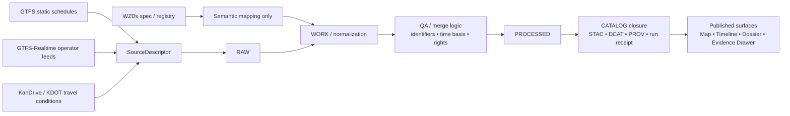

<!-- [KFM_META_BLOCK_V2]
doc_id: kfm://doc/NEEDS-VERIFICATION
title: Transport Domain
type: standard
version: v1
status: draft
owners: NEEDS VERIFICATION
created: YYYY-MM-DD
updated: YYYY-MM-DD
policy_label: public
related: [../README.md, ../../README.md]
tags: [kfm, domains, transport, kansas]
notes: [Workspace verification is PDF-only; owners, dates, adjacent leaves, and exact repo inventory need mounted-repo confirmation.]
[/KFM_META_BLOCK_V2] -->

# Transport Domain

Directory README for KFM’s Kansas-first transport lane: source anchors, merge rules, publication burdens, and evidence-safe routing for transport material.

> [!NOTE]
> **Status:** experimental  
> **Owners:** NEEDS VERIFICATION  
>      
> **Quick jumps:** [Scope](#scope) · [Repo fit](#repo-fit) · [Accepted inputs](#accepted-inputs) · [Exclusions](#exclusions) · [Current verified snapshot](#current-verified-snapshot) · [Directory tree](#directory-tree) · [Quickstart](#quickstart) · [Usage](#usage) · [Diagram](#diagram) · [Lane matrix](#lane-matrix) · [Task list / Definition of done](#task-list--definition-of-done) · [FAQ](#faq)  
> **Repo fit:** `docs/domains/transport/README.md` → upstream: [`../README.md`](../README.md) and [`../../README.md`](../../README.md) (**INFERRED / NEEDS VERIFICATION**) · downstream: transport leaf docs, source descriptors, watcher notes, and dossiers (**NEEDS VERIFICATION**)

> [!IMPORTANT]
> This directory should function as the **transport lane hub**, not as a generic routing-engine notebook, not as a second service-geography manual, and not as a catch-all mobility theory folder. Keep the lane centered on Kansas transport evidence, source onboarding, merge logic, publication burden, and trust-visible delivery.

> [!WARNING]
> Current session verification is **PDF-only**. Treat file inventory, CODEOWNERS, schema paths, workflow hooks, tests, and downstream leaves as **UNKNOWN** or **NEEDS VERIFICATION** until a mounted repository checkout is directly inspected.

## Scope

This directory is the routing surface for KFM transport work that is primarily about:

- roads, rail, bridges, freight corridors, transit, closures, schedules, work zones, and mobility context
- official Kansas transport condition surfaces and operator-feed notes
- source descriptors, merge rules, and publication constraints for transport objects
- transport-facing dossiers, corridor notes, and map/timeline delivery rules that remain one hop from inspectable evidence

This directory is **not** the owner of broad historical migration analysis, generic service-geography doctrine, or standalone hazard chronology. Those are adjacent concerns, but not identical lanes.

[Back to top](#transport-domain)

## Repo fit

| Path | Role | Relationship |
| --- | --- | --- |
| `docs/domains/README.md` | domains subtree hub | likely parent entry point for domain lanes (**INFERRED / NEEDS VERIFICATION**) |
| `docs/domains/transport/README.md` | this file | directory README for the transport lane |
| `docs/domains/transport/*` | lane leaves | transport source notes, watcher notes, corridor dossiers, and schema notes (**NEEDS VERIFICATION**) |
| `docs/domains/hazards/*` | adjacent lane | use when the dominant object is hazard continuity or resilience/public-service continuity rather than transport operations (**INFERRED / NEEDS VERIFICATION**) |

## Accepted inputs

Place material here when it is primarily **transport-lane evidence or lane operations guidance**, such as:

- Kansas transport source descriptors for KDOT, KanDrive, GTFS static feeds, GTFS-Realtime feeds, WZDx mappings, or local operator feeds
- notes that explain the merge difference between inventory, schedule, closure, work-zone, and real-time impact objects
- transport corridor, bridge, route, rail, freight, or transit dossiers that link back to evidence and time basis
- schema notes, fixtures, mapping rules, or validation guidance specific to transport objects
- public-safe layer notes for transport material shown in map, timeline, dossier, or export surfaces

## Exclusions

Do **not** place the following here:

- broad service-geography or municipal-context material that is not transport-centered
- generic routing algorithms, navigation experiments, or optimization notes with no KFM evidence object or Kansas source anchor
- duplicate hazard chronologies, resilience dashboards, or public-service continuity writeups that belong to the hazards lane
- copied spec dumps for GTFS, GTFS-Realtime, WZDx, or TDx with no KFM routing or interpretation value
- mirror/discovery-service summaries presented as if they replace origin authority feeds
- unsupported claims that a feed, watcher, schema, API, or UI integration already exists in the mounted repo

## Status vocabulary used in this directory

| Label | Use here |
| --- | --- |
| **CONFIRMED** | Directly supported by the visible corpus or surfaced project materials in the current session |
| **INFERRED** | Small structural completion that fits KFM doctrine but is not directly repo-verified |
| **PROPOSED** | Recommended directory behavior, starter shape, or next-step packaging |
| **UNKNOWN** | Not verified strongly enough in the current session |
| **NEEDS VERIFICATION** | Review flag for inventory, ownership, paths, workflows, or implementation state |

## Current verified snapshot

| Verified point | Status | Why it matters |
| --- | --- | --- |
| Transport is a structural KFM operating lane, not a decorative category. | **CONFIRMED** | The lane is part of KFM’s Kansas-first domain worldview and should be documented as such. |
| The transport lane covers roads, rail, bridges, freight corridors, transit, closures, schedules, work zones, and mobility context. | **CONFIRMED** | The README should describe the lane by object class, not by generic “mobility” prose. |
| Representative source families include KDOT, GTFS, GTFS-Realtime, WZDx, and local transit feeds. | **CONFIRMED** | The lane needs source-aware intake and cannot be shaped around a single format. |
| Inventory, schedule, closure, and real-time impact feeds require different merge logic. | **CONFIRMED** | This is the most important transport-specific caution in the corpus. |
| Official transport anchor surfaces currently named in the atlas are GTFS-Realtime reference, KanDrive / KDOT travel conditions, and WZDx official specification / registry. | **CONFIRMED** | These are the safest lane anchors to document without inventing repo state. |
| GTFS-Realtime should only be normalized where actual Kansas operator feeds exist. | **CONFIRMED** | The README must avoid implying statewide realtime transit coverage that the mounted repo did not prove. |
| Kansas operational feeds should normalize toward WZDx semantics **without losing provenance anchors**. | **CONFIRMED** | Harmonization is allowed; origin authority must remain visible. |
| Transport is not currently positioned as the first thin-slice build lane. | **CONFIRMED** | The atlas sequences transport expansion after foundations, hydrology, hazards, and soils. |
| Current repo implementation depth for the transport lane remains unverified. | **UNKNOWN** | No mounted tree, tests, manifests, workflows, or runtime evidence were directly surfaced. |

[Back to top](#transport-domain)

## Directory tree

Current lane inventory is **NEEDS VERIFICATION**. The shape below is a **PROPOSED target layout**, not a claim about the mounted repo:

```text
docs/domains/transport/
├── README.md                  # this file
├── sources/                   # source descriptors and anchor notes (PROPOSED)
│   ├── kandrive.md
│   ├── gtfs-static.md
│   ├── gtfs-rt.md
│   └── wzdx.md
├── watchers/                  # watcher/refresh and merge notes (PROPOSED)
├── contracts/                 # schema and mapping notes (PROPOSED)
├── dossiers/                  # corridor, route, bridge, rail, or agency dossiers (PROPOSED)
└── examples/                  # illustrative receipts, STAC/DCAT/PROV examples (PROPOSED)
```

## Quickstart

Start new transport work here by routing it through lane logic before writing code or prose.

1. **Name the object class first.** Decide whether the source is inventory, schedule, work-zone, closure, camera, live impact, corridor context, or dossier material.
2. **Create or update a SourceDescriptor.** KFM doctrine treats source intake as a contract, not a download.
3. **Declare time semantics.** Transport work is especially prone to confusion between schedule time, event time, valid time, fetch time, and update time.
4. **Choose merge logic explicitly.** Static GTFS, GTFS-Realtime, KanDrive conditions, and WZDx-normalized feeds should not be merged as if they were one homogeneous stream.
5. **Keep origin authority visible.** WZDx is a harmonization target; mirrors and registries do not replace operator or agency origin feeds.
6. **Define public-safe outputs before publication.** A lane note should say whether the result belongs in map, timeline, dossier, export, or review-only surfaces.
7. **Mark what is still unknown.** Do not smooth repo or runtime gaps into confident language.

Illustrative starter descriptor:

```yaml
# illustrative example — not a mounted repo contract
source_id: transport.kandrive.current_conditions
lane: transport
segment: road_conditions
source_role: direct_observational
origin_authority: KDOT / KanDrive
cadence: near_real_time
time_basis:
  valid_time: event_or_condition_time
  fetch_time: watcher_time
identifier_strategy:
  agency_id: kdot
  entity_id: native_condition_id_or_corridor_key
merge_class: operational_conditions
publication_intent: operational_context
mirror_policy: do_not_replace_origin
required_artifacts:
  - source_descriptor
  - manifest
  - schema_record
  - stac_dcat_record
  - prov_or_run_receipt
```

## Usage

### 1. Route by source role, not by format alone

A transport feed may be statutory/administrative, direct observational, documentary, or mirror/discovery. Treating all feeds as equivalent because they arrive over HTTP is a trust failure.

### 2. Separate static, scheduled, operational, and event-bounded objects

The transport lane should stay explicit about which object is being handled:

- **inventory**: roads, bridges, corridors, routes, facilities
- **schedule**: static GTFS stops, trips, and timetables
- **operational context**: KanDrive-style road-work, closure, travel-weather, camera, and condition surfaces
- **real-time observations**: GTFS-Realtime positions, trip updates, and alerts where Kansas operator feeds actually exist
- **harmonized roadway events**: WZDx-aligned work zones and restrictions
- **dossier objects**: corridor, route, bridge, or agency narratives that remain downstream of evidence

### 3. Publish only transport-safe derivatives

Public transport surfaces should remain evidence-linked and time-explicit. If the lane cannot explain freshness, identifier stability, merge basis, and provenance, it is not ready for outward delivery.

## Diagram



> [!TIP]
> Use this as the lane’s mental model: **origin feeds stay visible**, harmonization stays explicit, and public surfaces remain downstream of catalog closure and proof objects.

## Lane matrix

| Segment | Primary objects | Typical anchor surfaces | Main burden / caution | Preferred outward shape |
| --- | --- | --- | --- | --- |
| Network & inventory | roads, rail, bridges, corridors, facilities | KDOT / state GIS / operator inventories | inventory is not the same thing as current condition | dossiers, map layers, evidence-linked corridor notes |
| Transit schedules (static) | routes, trips, stops, calendars | operator GTFS static feeds | schedule time is not observed movement | route layers, stop layers, schedule-linked dossier context |
| Transit real-time | vehicle positions, trip updates, alerts | Kansas operator GTFS-Realtime feeds where they actually exist | only normalize where real Kansas feeds exist; dedupe and freshness matter | current-condition map/timeline layers with clear stale-state behavior |
| Road conditions | closures, road work, cameras, travel-weather | KanDrive / KDOT travel conditions | operational context can drift fast; keep fetch/update semantics explicit | timeline and map overlays with freshness cues |
| Work zones & restrictions | work zones, detours, restrictions | operator feeds normalized toward WZDx semantics | WZDx harmonizes; it does not replace provenance anchors | event-bounded layers, review-ready normalized records |
| Freight & logistics context | freight corridors, chokepoints, bridge or closure impact on movement | KDOT and official corridor/operator material | corridor context is not a routing engine by itself | corridor dossiers and constrained exports |
| Narrative / dossier objects | bridge, corridor, route, agency, or event narratives | lane evidence bundles and reviewed notes | must remain downstream of evidence and policy | dossier, story, educator-facing variants |

## Proof objects this lane should expect

| Artifact | Why this lane needs it |
| --- | --- |
| **SourceDescriptor** | names the source, cadence, rights, time basis, and publication intent before ingest |
| **Manifest** | records what was fetched, when, and under which query or conditional headers |
| **Schema record** | stops static GTFS, GTFS-Realtime, KanDrive, and WZDx-normalized objects from being merged dishonestly |
| **STAC / DCAT** | makes outward distributions and lane assets discoverable in a governed way |
| **PROV / run receipt** | lets a reviewer inspect how a transport artifact was produced |
| **Rights / sensitivity note** | keeps operator terms, reuse limits, and public-safe publication classes visible |

[Back to top](#transport-domain)

## Task list / Definition of done

A transport leaf or lane addition is ready for review when:

- [ ] the object class is named explicitly (`inventory`, `schedule`, `realtime`, `conditions`, `work_zones`, `dossier`, or equivalent)
- [ ] a source descriptor exists or the README explains why it is still missing
- [ ] the source role is declared
- [ ] origin authority and mirror/discovery behavior are separated
- [ ] time semantics are explicit
- [ ] identifiers and join strategy are named
- [ ] merge logic is documented for the object class
- [ ] STAC/DCAT/PROV or equivalent outward metadata expectations are stated
- [ ] rights / licensing / publication posture is stated
- [ ] map / timeline / dossier / export placement is stated
- [ ] unknowns and verification obligations remain visible
- [ ] the leaf does not imply repo code, watcher coverage, or runtime behavior that the current evidence does not prove

## FAQ

### Is transport a first-wave thin slice in KFM?

No. The current atlas sequences transport expansion after foundations, hydrology, hazards continuity, and soils.

### Can WZDx replace operator or agency feeds?

No. WZDx is the harmonization target for work zones and restrictions. It should not erase provenance anchors.

### Do mirror or registry feeds count as origin authority?

No. Discovery mirrors help discovery; they do not replace origin authorities.

### Does GTFS-Realtime imply statewide Kansas realtime coverage?

No. The current corpus is explicit that GTFS-Realtime should only be normalized where actual Kansas operator feeds exist.

### Should this directory own broad service geography?

Only where the dominant object is transport-centered. Legal jurisdiction, catchments, and general service geography are related but not identical concerns.

## Appendix

<details>
<summary><strong>Candidate source anchors and watchlist</strong></summary>

| Source or standard | Status in this README | Best use here | Note |
| --- | --- | --- | --- |
| GTFS static operator feeds | **CONFIRMED lane family** | canonical schedules and stop/route geometry | keep operator origin visible |
| GTFS-Realtime reference | **CONFIRMED anchor** | common contract for realtime transit feeds | only normalize where real Kansas feeds exist |
| KanDrive / KDOT travel conditions | **CONFIRMED anchor** | current-condition, closure, camera, and travel-weather normalization | operational context surface for Kansas |
| WZDx official specification / registry | **CONFIRMED anchor** | harmonization target for work zones and restrictions | do not lose provenance anchors while normalizing |
| TDx v1.1 | **PROPOSED watch item** | possible future deepening for generalized roadway restrictions and incidents | treat as adjacent standards watch, not current lane baseline |
| Kansas operator feed inventory | **NEEDS VERIFICATION** | actual feed list for Wichita, Topeka, and other operators | do not imply statewide coverage until verified in mounted repo or checked source descriptors |

</details>

<details>
<summary><strong>Illustrative transport watcher receipt fields</strong></summary>

```json
{
  "feed_url": "https://example.org/feed",
  "feed_etag": "W/\"placeholder\"",
  "spec_hash": "sha256:PLACEHOLDER",
  "sample_count": 0,
  "health_score": 1.0,
  "license": {
    "id": "NEEDS_VERIFICATION",
    "status": "clear|ambiguous|missing"
  },
  "run_id": "YYYY-MM-DDTHH:MM:SSZ"
}
```

Use a receipt like this only as an illustrative starter. Exact schema, path, signer, and policy fields remain **NEEDS VERIFICATION** until a mounted contract or emitted example is surfaced.

</details>

[Back to top](#transport-domain)
