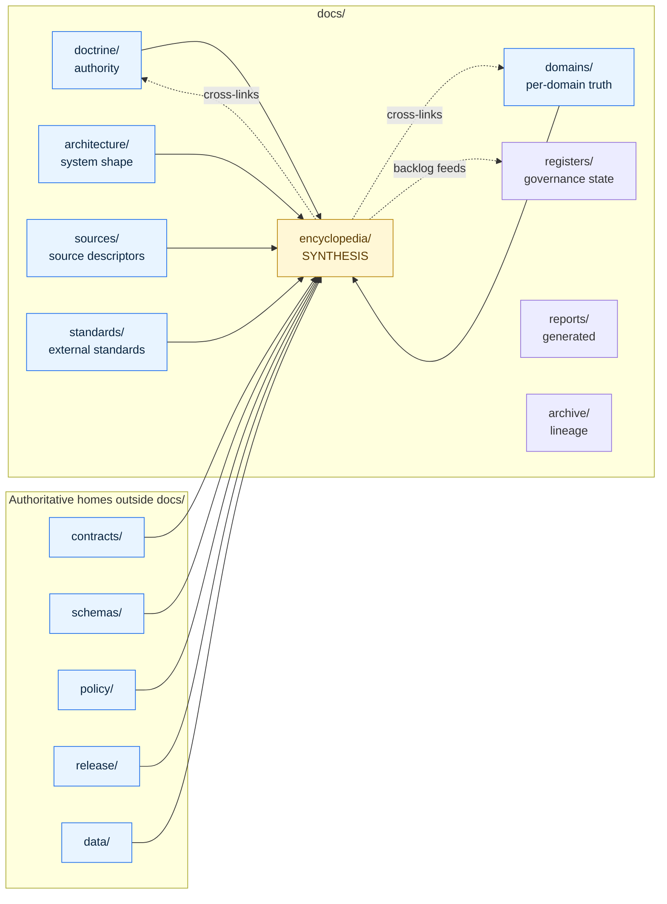

<!-- [KFM_META_BLOCK_V2]
doc_id: kfm://doc/encyclopedia-readme
title: KFM Domain & Capability Encyclopedia — README
type: standard
version: v1
status: draft
owners: Docs steward (TBD); Domain stewards (TBD per chapter)
created: 2026-05-09
updated: 2026-05-09
policy_label: public
related:
  - docs/doctrine/directory-rules.md
  - docs/doctrine/lifecycle-law.md
  - docs/doctrine/truth-posture.md
  - docs/doctrine/trust-membrane.md
  - docs/architecture/system-context.md
  - docs/architecture/governed-api.md
  - docs/domains/README.md
  - docs/registers/VERIFICATION_BACKLOG.md
  - docs/registers/DRIFT_REGISTER.md
tags: [kfm, encyclopedia, synthesis, planning-manuscript, cross-domain]
notes:
  - "Folder docs/encyclopedia/ is PROPOSED; not in the §6.1 canonical docs/ tree."
  - "Encyclopedia is synthesis, not doctrine — supersedes no source doctrine, no source report, no official standard."
  - "All API paths and file paths inside the encyclopedia are PROPOSED until mounted-repo evidence verifies them."
[/KFM_META_BLOCK_V2] -->

# KFM Domain & Capability Encyclopedia

> **A consolidated, cross-domain reference view of every KFM domain, feature, action, viewing mode, knowledge object, governed function, and programming possibility — synthesized from supplied doctrine and domain reports.**

This folder hosts the **Domain & Capability Encyclopedia**, a synthesis manuscript that converts KFM doctrine and per-domain reports into a single product, architecture, and implementation reference. It is a **planning artifact**, not a source of authority. Doctrine, contracts, schemas, and policy still own truth; the encyclopedia organizes and indexes what they say.

---

## Status, owners, and quick jumps

| Field | Value |
|---|---|
| **Folder status** | `experimental` — `docs/encyclopedia/` is **PROPOSED**, not in the canonical `docs/` tree per Directory Rules §6.1 |
| **Document status** | `draft` — encyclopedia v0.1 is a planning manuscript; not adopted as governance |
| **Owners** | Docs steward *(TBD)*; per-chapter domain stewards *(TBD — see [§ Review burden](#review-burden))* |
| **Authority class** | **Synthesis / reference**, not doctrine. Supersedes nothing. |
| **Truth posture** | Encyclopedia content uses CONFIRMED / PROPOSED / UNKNOWN / NEEDS VERIFICATION labels. Implementation maturity is **UNKNOWN** without mounted-repo evidence. |
| **Last reviewed** | `2026-05-09` |

<!-- Badges below are placeholders; targets are NEEDS VERIFICATION until CI surfaces, doc-tooling targets, and link-check workflows are confirmed in the repo. -->


**Quick jumps:** [Scope](#scope) · [Repo fit](#repo-fit) · [What belongs here](#what-belongs-here) · [Exclusions](#exclusions) · [Directory tree](#directory-tree-proposed) · [Encyclopedia structure](#encyclopedia-structure) · [Domain coverage](#domain-coverage) · [Quickstart](#quickstart) · [Diagram](#how-this-folder-relates-to-the-rest-of-docs) · [Validation](#validation) · [Review burden](#review-burden) · [Related folders](#related-folders) · [Open questions](#open-questions)

> [!IMPORTANT]
> The encyclopedia **does not** define new policy, schemas, contracts, or release rules. When the encyclopedia and authoritative documents disagree, the authoritative source wins (Directory Rules §2.1). Open a [DRIFT_REGISTER](../registers/DRIFT_REGISTER.md) entry rather than treating the encyclopedia as canon.

---

## Scope

The encyclopedia consolidates the supplied KFM corpus — Directory Rules, Greenfield Plan, Build Companion, Pipeline Manual, MapLibre operating doctrine, Governed AI plan, and per-domain dossiers — into a single cross-domain atlas. Its purpose is to make the design space **legible at one glance** so that contributors can locate domains, capabilities, objects, viewing modes, AI behaviors, sensitivity rules, and verification gaps without re-reading the entire corpus.

Encyclopedia content is intentionally:

- **Cross-domain** — every named KFM domain and cross-domain system is represented with the same chapter shape.
- **Implementation-aware, not implementation-claiming** — paths, routes, endpoints, package choices, and CI workflows appear only as **PROPOSED** until mounted-repo evidence verifies them.
- **Reversible** — the encyclopedia is versioned; supersession is recorded explicitly (see Appendix L of the manuscript).

It is intentionally **not**:

- A doctrine source (those live in [`docs/doctrine/`](../doctrine/)).
- A schema or contract registry (those live in [`schemas/`](../../schemas/) and [`contracts/`](../../contracts/)).
- A policy or release ruleset (those live in [`policy/`](../../policy/) and [`release/`](../../release/)).
- A per-domain implementation home (per-domain docs live in [`docs/domains/<domain>/`](../domains/)).

[↑ Back to top](#kfm-domain--capability-encyclopedia)

---

## Repo fit

`docs/encyclopedia/` sits inside `docs/` — KFM's human-facing control plane. It is **upstream** of nothing and **downstream** of everything that defines truth: doctrine, contracts, schemas, policy, source registries, release manifests, and domain dossiers all flow into it; nothing flows out as binding governance.

| Direction | Flow | Notes |
|---|---|---|
| **Upstream of encyclopedia** | [`docs/doctrine/`](../doctrine/), [`docs/architecture/`](../architecture/), [`docs/domains/`](../domains/), [`docs/sources/`](../sources/), [`docs/standards/`](../standards/), [`contracts/`](../../contracts/), [`schemas/`](../../schemas/), [`policy/`](../../policy/) | These define truth. The encyclopedia paraphrases and indexes them. |
| **Sibling synthesis** | [`docs/registers/`](../registers/), [`docs/archive/`](../archive/), [`docs/reports/`](../reports/) | Registers index machine-checkable governance state. The encyclopedia indexes the design space. |
| **Downstream readers** | New contributors; domain stewards onboarding; reviewers preparing ADRs; planning conversations | Use the encyclopedia to orient; cite the upstream source for binding decisions. |

> [!NOTE]
> **Placement basis.** Per Directory Rules §3, the encyclopedia is "genuinely cross-domain." Per §6.1 the canonical `docs/` tree does **not** list `encyclopedia/` as a named lane; it lists `doctrine/`, `architecture/`, `adr/`, `domains/`, `sources/`, `standards/`, `runbooks/`, `security/`, `governance/`, `registers/`, `intake/`, `archive/`, `reports/`, `brand/`. Adding `encyclopedia/` is **not** an §2.4 ADR-required change (no canonical root, no schema-home change, no parallel authority for schemas/contracts/policy/sources/registries/releases/proofs/receipts). It is a §17 "new placement example" change, requiring **PR + reviewer sign-off, no ADR**. Until that sign-off lands, treat the folder name as **PROPOSED**. Alternative homes considered and not selected: [`docs/archive/exploratory/`](../archive/) (would relegate active synthesis to lineage status) and [`docs/reports/`](../reports/) (reserved for generated review/release reports, read-only).

[↑ Back to top](#kfm-domain--capability-encyclopedia)

---

## What belongs here

This folder accepts a small, controlled set of artifact classes:

- **The encyclopedia manuscript itself** (versioned), in repo-native Markdown form — e.g., `encyclopedia.md` or chaptered `01-cover.md` … `16-appendices.md`. Form is **PROPOSED** until reviewers and tooling decide between single-file and chaptered layouts.
- **A versioned changelog** for the manuscript — e.g., `CHANGELOG.md` — recording supersession, additions, and removed sections.
- **An index/table of contents** — e.g., `INDEX.md` or this README's [Encyclopedia structure](#encyclopedia-structure) table — pointing to canonical doctrine and per-domain dossiers for each topic.
- **Diagrams and figures** generated specifically for the encyclopedia, scoped under `assets/` and referenced with relative paths.
- **Lineage notes** describing which supplied source documents (the dossier corpus) each chapter draws from, mirroring the source ledger inside the manuscript.

[↑ Back to top](#kfm-domain--capability-encyclopedia)

---

## Exclusions

The following do **not** belong here and have governed homes elsewhere:

| Do **not** put here | Put it in | Why |
|---|---|---|
| New doctrine, invariants, operating laws | [`docs/doctrine/`](../doctrine/) | Doctrine is authority, not synthesis. |
| ADRs amending Directory Rules, schema-home, lifecycle, or trust membrane | [`docs/adr/`](../adr/) | ADRs require §2.4 process; encyclopedia narrates outcomes. |
| Per-domain implementation plans, deep dives, dossier prose | [`docs/domains/<domain>/`](../domains/) | Domain depth lives in domain folders. |
| Object meaning, contract semantics | [`contracts/`](../../contracts/) | Contracts own object meaning (Markdown). |
| Machine-checkable shapes (JSON Schema, JSON-LD) | [`schemas/contracts/v1/...`](../../schemas/) per ADR-0001 | Schema home is canonical. |
| Allow / deny / restrict / abstain rules | [`policy/`](../../policy/) | Policy is admissibility, not narrative. |
| Source descriptors and source authority | [`docs/sources/`](../sources/), [`data/registry/`](../../data/registry/) | Source identity has dedicated registries. |
| Release manifests, rollback cards, correction notices | [`release/`](../../release/) | Release decisions are governed objects. |
| Receipts, proofs, run records | [`data/receipts/`](../../data/receipts/), [`data/proofs/`](../../data/proofs/) | Trust-bearing artifacts have their own homes. |
| Build outputs or QA artifacts | [`artifacts/`](../../artifacts/) | Compatibility root, tightly scoped. |
| Generated dashboards, operational reports | [`docs/reports/`](../reports/) | Generated, read-only. |
| Idea capture, intake notes, exploratory drafts | [`docs/intake/`](../intake/), [`docs/archive/exploratory/`](../archive/) | Intake and exploration have dedicated lanes. |
| Drift, contradiction, verification backlog entries | [`docs/registers/`](../registers/) | Registers track governance state. |

> [!WARNING]
> If a chapter feels like it should *become* policy, contract, schema, or doctrine — that is the signal to **promote it out of the encyclopedia**, not to harden it inside the encyclopedia. Promotion follows the lifecycle and authority rules of the destination root.

[↑ Back to top](#kfm-domain--capability-encyclopedia)

---

## Directory tree (PROPOSED)

> [!NOTE]
> The tree below is **PROPOSED** for review. The exact split between a single manuscript file and chaptered files is not yet decided; both are admissible and the choice should follow whichever pattern adjacent docs already use.

```text
docs/
└── encyclopedia/
    ├── README.md                      # this file — orientation, scope, exclusions, governance fit
    ├── encyclopedia.md                # PROPOSED — single-file rendering of the manuscript (alt: chapters/)
    ├── CHANGELOG.md                   # PROPOSED — versioned supersession and amendment log
    ├── INDEX.md                       # PROPOSED — TOC linking to upstream doctrine for each topic
    ├── chapters/                      # PROPOSED ALT — chaptered layout if/when manuscript is split
    │   ├── 01-cover.md                #   …mirrors the manuscript's 16-section structure
    │   ├── 02-executive-summary.md
    │   ├── 03-source-ledger.md
    │   ├── 04-operating-law.md
    │   ├── 05-master-domain-atlas.md
    │   ├── 06-cross-domain-capability-taxonomy.md
    │   ├── 07-domain-chapters.md
    │   ├── 08-cross-domain-systems.md
    │   ├── 09-master-feature-matrix.md
    │   ├── 10-master-action-matrix.md
    │   ├── 11-master-viewing-mode-atlas.md
    │   ├── 12-programming-possibilities-backlog.md
    │   ├── 13-sensitive-deny-by-default-register.md
    │   ├── 14-implementation-roadmap.md
    │   ├── 15-validation-and-acceptance-plan.md
    │   └── 16-appendices.md
    ├── assets/                        # PROPOSED — encyclopedia-only diagrams/figures
    │   └── .gitkeep
    └── lineage/                       # PROPOSED — source-ledger pointers and supersession notes
        └── .gitkeep
```

[↑ Back to top](#kfm-domain--capability-encyclopedia)

---

## Encyclopedia structure

The manuscript follows a fixed 16-section structure. Every chapter and matrix uses CONFIRMED / PROPOSED / UNKNOWN / NEEDS VERIFICATION labels for content, and ANSWER / ABSTAIN / DENY / ERROR for AI/runtime behaviors.

| §  | Section | What it provides | Authoritative upstream |
|---:|---|---|---|
| 1  | Cover Page | Version, date, source boundary, truth posture, evidence limits | — |
| 2  | Executive Summary | What KFM is and is not; what is CONFIRMED / PROPOSED / UNKNOWN | [`docs/doctrine/`](../doctrine/) |
| 3  | Source Ledger and Evidence Method | Per-source ID table (KFM corpus + external standards), method | [`docs/sources/`](../sources/), [`docs/standards/`](../standards/), [`data/registry/`](../../data/registry/) |
| 4  | KFM Operating Law | Inspectable claim, evidence hierarchy, lifecycle law, trust membrane, publication gate, AI boundary, map-renderer boundary, sensitivity posture | [`docs/doctrine/`](../doctrine/) |
| 5  | Master Domain Atlas | Per-domain purpose, boundary, source families, object families, map products, first credible thin slice | [`docs/domains/`](../domains/) |
| 6  | Cross-Domain Capability Taxonomy | Programmable behaviors, primary objects, governance rules | [`contracts/`](../../contracts/), [`policy/`](../../policy/) |
| 7  | Domain Chapters | A–N structure per domain (mission, sources, objects, model, viewing modes, actions, analytics, knowledge systems, AI rules, validators, APIs, thin slice, risks, roadmap) | [`docs/domains/<domain>/`](../domains/) |
| 8  | Cross-Domain Systems Chapters | MapLibre shell, Evidence Drawer, Focus Mode, search/graph, catalog/proof, review console, public/restricted surfaces | [`docs/architecture/`](../architecture/) |
| 9  | Master Feature Matrix | Domain × {ingest, validate, normalize, map/time, evidence/graph/AI, review/publish/correct/rollback/export, risk controls} | [`contracts/`](../../contracts/), [`policy/`](../../policy/), [`release/`](../../release/) |
| 10 | Master Action Matrix | User actions × outcomes × governance rules | [`docs/governance/`](../governance/), [`policy/`](../../policy/) |
| 11 | Master Viewing Mode Atlas | Map and viewing modes per domain; renderer boundary | [`docs/architecture/map-shell.md`](../architecture/map-shell.md) |
| 12 | Programming Possibilities Backlog | PROPOSED features, validators, APIs, fixtures, thin slices | [`docs/registers/VERIFICATION_BACKLOG.md`](../registers/VERIFICATION_BACKLOG.md) |
| 13 | Sensitive / Deny-by-Default Register | Classes that fail closed (rare species, archaeology, infrastructure precision, living-person, DNA, private landowner data, unknown rights) | [`policy/`](../../policy/), [`docs/security/`](../security/) |
| 14 | Implementation Roadmap | PROPOSED phasing for thin slices and matrix-wide capabilities | [`docs/architecture/`](../architecture/) |
| 15 | Validation and Acceptance Plan | What proves a slice is real (manifests, tests, drills, EvidenceBundle closure) | [`tests/`](../../tests/), [`docs/runbooks/`](../runbooks/) |
| 16 | Appendices and Self-Check | Glossary, acronyms, domain object index, source family index, AI prompt index, policy gate index, open questions, verification backlog, supersession notes | [`docs/registers/`](../registers/) |

[↑ Back to top](#kfm-domain--capability-encyclopedia)

---

## Domain coverage

Encyclopedia chapter 5 (Master Domain Atlas) and chapter 7 (Domain Chapters) provide one entry per **named KFM domain**. The list below mirrors the manuscript and the supplied per-domain dossiers:

<details>
<summary><strong>Sixteen named KFM domains (click to expand)</strong></summary>

1. Spatial Foundation, Cartography, Reference Systems
2. Hydrology
3. Soil
4. Habitat
5. Fauna
6. Flora
7. Agriculture
8. Geology and Natural Resources
9. Atmosphere, Air, and Climate
10. Hazards
11. Roads, Rail, and Trade Routes
12. Settlements, Cities, and Infrastructure
13. Archaeology and Cultural Heritage
14. People, Genealogy, DNA, and Land Ownership
15. Frontier Demography, Economy, Settlement, Land, and Time Matrix
16. Planetary, 3D, Digital Twin, and Synthetic Spatial Systems

Each domain's authoritative home is [`docs/domains/<domain>/`](../domains/). The encyclopedia paraphrases and cross-links; it does not replace those pages.

</details>

[↑ Back to top](#kfm-domain--capability-encyclopedia)

---

## How this folder relates to the rest of `docs/`



> [!NOTE]
> Arrows point **from** authority **into** the encyclopedia: the encyclopedia consumes truth, it does not produce it. The dotted edges back out are **cross-links** (so readers can navigate to authority) and **backlog feeds** (so verification gaps surface in [`docs/registers/`](../registers/)) — neither edge promotes the encyclopedia to authority.

[↑ Back to top](#kfm-domain--capability-encyclopedia)

---

## Quickstart

For readers approaching KFM for the first time, or contributors planning a slice:

1. **Start with the executive summary** — open the manuscript and read §2 to understand what is CONFIRMED, PROPOSED, and UNKNOWN.
2. **Locate your domain** — use the [Domain coverage](#domain-coverage) list, then jump to the relevant §7 chapter and the canonical [`docs/domains/<domain>/`](../domains/) page.
3. **Identify the thin slice** — every domain chapter ends with a "first credible thin slice" specification; this is the recommended scope for a first PR.
4. **Cross-check the operating law** — confirm that your slice respects the lifecycle invariant (RAW → WORK / QUARANTINE → PROCESSED → CATALOG / TRIPLET → PUBLISHED), the trust membrane (governed APIs only), the cite-or-abstain truth posture, and the deny-by-default sensitivity posture (encyclopedia §4 and §13).
5. **Open verification items** — anything PROPOSED or UNKNOWN that your slice depends on belongs in [`docs/registers/VERIFICATION_BACKLOG.md`](../registers/VERIFICATION_BACKLOG.md), not as an inline assertion in the encyclopedia.

> [!TIP]
> If a topic is missing from the encyclopedia, **do not invent it here**. Add it to the upstream authoritative source first (`docs/doctrine/`, `docs/domains/<domain>/`, `contracts/`, `schemas/`, `policy/`), then reflect the resolved decision into the encyclopedia in the next manuscript revision.

[↑ Back to top](#kfm-domain--capability-encyclopedia)

---

## Inputs

The encyclopedia draws from the supplied KFM corpus (PDF dossiers and doctrine), reflected in the manuscript's source ledger:

- **KFM doctrine**: Directory Rules; Greenfield Plan; Build Companion; Pipeline Living Implementation Manual.
- **System-wide synthesis**: Whole-corpus pass dossiers; Implementation Reference (lineage).
- **UI / AI**: MapLibre Operating Architecture; Whole UI + Governed AI Expansion; Governed AI Extended Pro report.
- **Per-domain dossiers**: Hydrology, Soil, Habitat, Fauna, Flora, Agriculture, Geology, Atmosphere/Air, Hazards, Roads/Rail/Trade, Settlements/Infrastructure, Archaeology, People/Genealogy/DNA/Land.
- **External standards (externally checked)**: OpenAPI, JSON Schema, DCAT, PROV-O, STAC, GeoParquet, PMTiles, MapLibre GL JS, USGS / FEMA / NOAA / EPA / USFWS / GBIF / iNaturalist / NatureServe / Census / GNIS / 3DEP / 3D Tiles. KFM profiles, terms, and pinning remain **NEEDS VERIFICATION**.

The full source ledger lives in encyclopedia §3.

[↑ Back to top](#kfm-domain--capability-encyclopedia)

---

## Outputs

The encyclopedia emits **reference content only** — no governed objects:

- Markdown chapters and matrices.
- Diagrams and figures under [`assets/`](#directory-tree-proposed) (PROPOSED).
- Cross-links into doctrine, domain pages, contracts, schemas, policy, and registers.
- Verification items pushed into [`docs/registers/VERIFICATION_BACKLOG.md`](../registers/VERIFICATION_BACKLOG.md) when gaps are identified.

It explicitly does **not** emit: ReleaseManifests, RollbackCards, CorrectionNotices, RunReceipts, ValidationReports, or any other trust-bearing object. Those are produced by their respective owning roots.

[↑ Back to top](#kfm-domain--capability-encyclopedia)

---

## Validation

Validation here is editorial and link-integrity, not policy enforcement. **PROPOSED checks** (NEEDS VERIFICATION until repo CI confirms the workflow names and tools):

| Check | Purpose | Implementer |
|---|---|---|
| Markdown lint | Style consistency | Repo lint workflow *(name TBD — NEEDS VERIFICATION)* |
| Link check | Detect broken relative links to doctrine, domains, contracts, schemas, policy, registers | Doc CI workflow *(name TBD — NEEDS VERIFICATION)* |
| Heading-anchor stability | Preserve stable anchors across revisions | Editorial review |
| Truth-label audit | Every implementation-shaped claim carries a CONFIRMED / PROPOSED / UNKNOWN / NEEDS VERIFICATION label | Editorial review + reviewer checklist |
| Authority-cross-link audit | Each chapter cites its upstream authoritative source | Editorial review |
| Supersession check | Manuscript version + `CHANGELOG.md` updated when content materially changes | Editorial review |

> [!IMPORTANT]
> The encyclopedia **never** asserts validation, enforcement, or release maturity on behalf of other systems. If a chapter says "this is enforced," that statement requires an EvidenceRef to a test, workflow, or release manifest in the repo — otherwise it MUST be labeled PROPOSED.

[↑ Back to top](#kfm-domain--capability-encyclopedia)

---

## Review burden

| Change type | Reviewers required |
|---|---|
| Editorial fixes (typos, link repair, anchor preservation) | Docs steward *(TBD)* |
| Adding/revising a domain chapter (§7) | Docs steward + relevant domain steward *(TBD per domain)* |
| Adding/revising operating law (§4) or sensitivity register (§13) | Docs steward + doctrine owner; **must mirror, not replace,** [`docs/doctrine/`](../doctrine/) and [`policy/`](../../policy/) |
| Adding/revising matrices (§6, §9, §10, §11) | Docs steward + at least one architecture or domain steward |
| Promoting `docs/encyclopedia/` to a canonical lane in §6.1 | Docs steward + per Directory Rules §17, "PR + reviewer sign-off; no ADR" |

**CODEOWNERS reference:** TBD — placeholder until [`.github/CODEOWNERS`](../../.github/CODEOWNERS) (or root `CODEOWNERS`) is populated for this path. **NEEDS VERIFICATION.**

[↑ Back to top](#kfm-domain--capability-encyclopedia)

---

## Related folders

| Folder | Why it matters here |
|---|---|
| [`docs/doctrine/`](../doctrine/) | Authority for invariants the encyclopedia narrates. |
| [`docs/architecture/`](../architecture/) | Authority for system shape (governed API, map shell, deployment topology). |
| [`docs/adr/`](../adr/) | Records decisions the encyclopedia must reflect, never anticipate. |
| [`docs/domains/`](../domains/) | Per-domain authoritative pages; encyclopedia §7 cross-links into here. |
| [`docs/sources/`](../sources/), [`docs/standards/`](../standards/) | Source families and external standards referenced by §3. |
| [`docs/registers/`](../registers/) | Verification backlog, drift, contradiction, deprecation registers. |
| [`docs/runbooks/`](../runbooks/) | Operational procedures referenced by validation/acceptance plan §15. |
| [`contracts/`](../../contracts/), [`schemas/`](../../schemas/), [`policy/`](../../policy/), [`release/`](../../release/) | Authoritative homes for the object families, shapes, gates, and release decisions the encyclopedia indexes. |
| [`tests/`](../../tests/), [`fixtures/`](../../fixtures/) | Where "first credible thin slices" become enforceable proofs. |

[↑ Back to top](#kfm-domain--capability-encyclopedia)

---

## ADRs

No ADRs currently govern this folder. Adding `docs/encyclopedia/` to the canonical `docs/` tree in Directory Rules §6.1 is a **§17 placement-example change** (PR + reviewer sign-off; no ADR). An ADR would only be required if the encyclopedia attempted to claim authority over schemas, contracts, policy, sources, registries, releases, proofs, or receipts — which it does **not**.

[↑ Back to top](#kfm-domain--capability-encyclopedia)

---

## Open questions

| Question | Status | Disposition |
|---|---|---|
| Is `docs/encyclopedia/` accepted as a `docs/` lane? | NEEDS VERIFICATION | Resolve via §17 PR + reviewer sign-off; if rejected, route to [`docs/archive/exploratory/`](../archive/) or [`docs/reports/`](../reports/). |
| Single-file manuscript or chaptered layout? | OPEN | Decide alongside neighboring docs' conventions. |
| Manuscript versioning cadence | NEEDS VERIFICATION | Tie to `CHANGELOG.md` and supersession entries; cadence to be set by docs steward. |
| Asset hosting | NEEDS VERIFICATION | Resolve whether figures live under `assets/` here or under [`packages/ui/`](../../packages/ui/) brand assets. |
| Authority-cross-link automation | NEEDS VERIFICATION | Whether the link-check workflow (name TBD) covers the encyclopedia by default. |
| Steward assignment | UNKNOWN | Per-domain stewards must be named in [`docs/governance/`](../governance/) before §7 chapters are revised. |

[↑ Back to top](#kfm-domain--capability-encyclopedia)

---

## Task list — definition of done for the encyclopedia folder

- [ ] Folder accepted as a `docs/` lane (Directory Rules §17 PR + reviewer sign-off) **or** content relocated to an accepted lane.
- [ ] Manuscript landed in repo-native Markdown form (single file or chaptered).
- [ ] `CHANGELOG.md` initialized.
- [ ] Authority cross-links resolve to existing files in [`docs/doctrine/`](../doctrine/), [`docs/architecture/`](../architecture/), [`docs/domains/`](../domains/), [`contracts/`](../../contracts/), [`schemas/`](../../schemas/), [`policy/`](../../policy/), [`release/`](../../release/) (or are labeled PROPOSED).
- [ ] All implementation-shaped claims labeled CONFIRMED / PROPOSED / UNKNOWN / NEEDS VERIFICATION.
- [ ] All sensitive-domain content respects the deny-by-default register; no exact rare-species / archaeology / infrastructure / living-person / DNA detail.
- [ ] Verification items added to [`docs/registers/VERIFICATION_BACKLOG.md`](../registers/VERIFICATION_BACKLOG.md) for every UNKNOWN / NEEDS VERIFICATION claim.
- [ ] CODEOWNERS entry for this path.
- [ ] Last-reviewed date updated in this README and in the manuscript's cover.

[↑ Back to top](#kfm-domain--capability-encyclopedia)

---

## FAQ

**Is the encyclopedia authoritative?**
No. It is a synthesis manuscript. Authority lives in `docs/doctrine/`, `contracts/`, `schemas/`, `policy/`, `release/`, and per-domain pages. When in conflict, the authoritative source wins (Directory Rules §2.1).

**Can I cite the encyclopedia as the basis for a PR?**
Cite the encyclopedia for **orientation**; cite the upstream authoritative source for **decisions**. PRs that change behavior, schemas, contracts, or policy must cite the rule from the owning root, not the encyclopedia paraphrase.

**Why does every API path say "PROPOSED"?**
Because no mounted KFM repo was inspected when the manuscript was authored. Per the Current-Session Evidence Limit, paths, route names, DTOs, package choices, and CI workflow names are PROPOSED until a repo scan verifies them.

**What if a domain dossier and the encyclopedia disagree?**
The dossier wins. Open a [`DRIFT_REGISTER`](../registers/DRIFT_REGISTER.md) entry and revise the encyclopedia in the next manuscript version.

**Is a single 80+ page manuscript file going to be readable on GitHub?**
Possibly not. The chaptered layout under `chapters/` is the preferred fallback. The choice is open and should follow whichever pattern is already established in adjacent `docs/` lanes.

[↑ Back to top](#kfm-domain--capability-encyclopedia)

---

## Last reviewed

`2026-05-09` — initial draft of this README. Re-review when:

- The manuscript lands in repo-native Markdown form, or
- Directory Rules §6.1 is amended to include or exclude `encyclopedia/`, or
- Domain stewards are assigned in [`docs/governance/`](../governance/), or
- Six months elapse since the last review (per Directory Rules §15).

[↑ Back to top](#kfm-domain--capability-encyclopedia)
