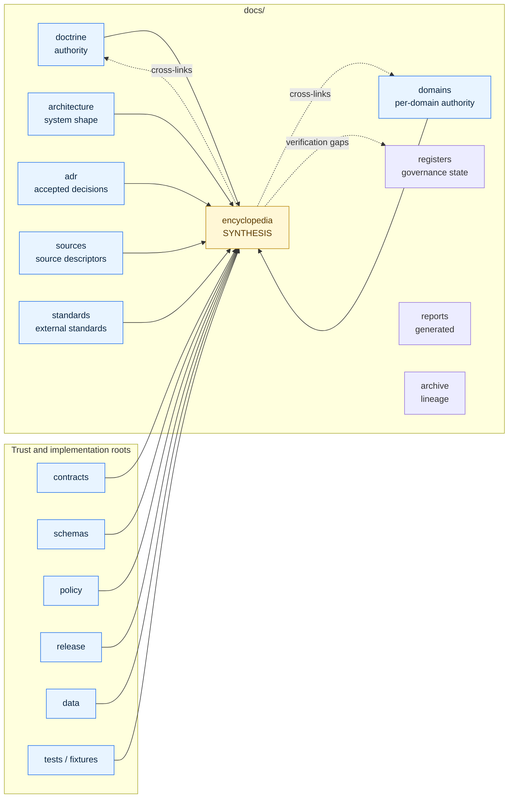

<!-- [KFM_META_BLOCK_V2]
doc_id: kfm://doc/encyclopedia-readme
title: KFM Domain & Capability Encyclopedia — README
type: standard
version: v1.1
status: draft
owners: Docs steward (OWNER_TBD); Domain stewards (OWNER_TBD per chapter)
created: 2026-05-09
updated: 2026-05-15
policy_label: public
related:
  - docs/doctrine/directory-rules.md
  - docs/doctrine/lifecycle-law.md
  - docs/doctrine/truth-posture.md
  - docs/doctrine/trust-membrane.md
  - docs/architecture/system-context.md
  - docs/architecture/governed-api.md
  - docs/domains/README.md
  - docs/registers/VERIFICATION_BACKLOG.md
  - docs/registers/DRIFT_REGISTER.md
tags: [kfm, encyclopedia, synthesis, planning-manuscript, cross-domain]
notes:
  - "Folder docs/encyclopedia/ remains PROPOSED until Directory Rules §17 sign-off or relocation is recorded."
  - "Encyclopedia is synthesis, not doctrine — supersedes no source doctrine, source report, contract, schema, policy, or release rule."
  - "All implementation-shaped paths, API paths, workflows, owners, and tooling names are PROPOSED or NEEDS VERIFICATION until mounted-repo evidence verifies them."
  - "v1.1 clarifies evidence boundary, placement basis, accepted content, exclusions, validation, review burden, and rollback posture."
[/KFM_META_BLOCK_V2] -->

# KFM Domain & Capability Encyclopedia

> **A consolidated, cross-domain reference view of KFM domains, features, actions, viewing modes, knowledge objects, governed functions, and programmable possibilities — synthesized from supplied doctrine and domain reports.**

This folder hosts the **Domain & Capability Encyclopedia**, a synthesis manuscript that converts KFM doctrine and per-domain reports into a single product, architecture, and implementation reference. It is a **planning artifact**, not a source of authority. Doctrine, contracts, schemas, policy, source registries, release objects, and mounted-repo evidence still own truth; the encyclopedia organizes and indexes what they say.

---

## Status, owners, and quick jumps

| Field | Value |
|---|---|
| **Folder status** | `experimental` — `docs/encyclopedia/` is **PROPOSED**, not yet accepted as a canonical `docs/` lane. |
| **Document status** | `draft` — encyclopedia v0.1 is a planning manuscript; this README is an orientation and governance-fit file. |
| **Owners** | Docs steward (`OWNER_TBD`); per-chapter domain stewards (`OWNER_TBD` — see [Review burden](#review-burden)). |
| **Authority class** | **Synthesis / reference**, not doctrine. Supersedes nothing. |
| **Truth posture** | CONFIRMED doctrine where cited from governing documents; PROPOSED placement and file plan; UNKNOWN implementation depth without mounted-repo evidence. |
| **Last reviewed** | `2026-05-15` |

<!-- Badges below are intentionally non-clickable placeholders. Replace with real linked badges only after CI, release, policy, and documentation tooling targets are verified. -->


**Quick jumps:** [Scope](#scope) · [Evidence boundary](#evidence-boundary) · [Repo fit](#repo-fit) · [What belongs here](#what-belongs-here) · [Exclusions](#exclusions) · [Directory tree](#directory-tree-proposed) · [Encyclopedia structure](#encyclopedia-structure) · [Domain coverage](#domain-coverage) · [Quickstart](#quickstart) · [Diagram](#how-this-folder-relates-to-the-rest-of-docs) · [Validation](#validation) · [Review burden](#review-burden) · [Related folders](#related-folders) · [Open questions](#open-questions) · [Task list](#task-list--definition-of-done-for-the-encyclopedia-folder) · [FAQ](#faq) · [Rollback](#rollback-and-correction)

> [!IMPORTANT]
> The encyclopedia **does not** define new policy, schemas, contracts, source authority, release rules, or implementation state. When the encyclopedia and an authoritative document disagree, the authoritative source wins. Open a [`DRIFT_REGISTER`](../registers/DRIFT_REGISTER.md) entry rather than treating the encyclopedia as canon.

[↑ Back to top](#kfm-domain--capability-encyclopedia)

---

## Scope

The encyclopedia consolidates the supplied KFM corpus — including Directory Rules, the Greenfield Plan, Pipeline Manual, MapLibre operating doctrine, Governed AI material, and per-domain dossiers — into a single cross-domain atlas. Its purpose is to make the design space **legible at one glance** so contributors can locate domains, capabilities, objects, viewing modes, AI behaviors, sensitivity rules, and verification gaps without re-reading the entire corpus.

Encyclopedia content is intentionally:

- **Cross-domain** — every named KFM domain and cross-domain system uses the same chapter shape.
- **Implementation-aware, not implementation-claiming** — paths, routes, endpoints, package choices, owners, workflow names, and CI checks remain **PROPOSED** or **NEEDS VERIFICATION** until mounted-repo evidence verifies them.
- **Reversible** — encyclopedia versions, supersession, relocation, corrections, and removals must be recorded explicitly.
- **Navigation-first** — this folder points readers to authority; it does not absorb authority into itself.

It is intentionally **not**:

- A doctrine source. Doctrine belongs in [`docs/doctrine/`](../doctrine/).
- A schema or contract registry. Machine shapes and object semantics belong in [`schemas/`](../../schemas/) and [`contracts/`](../../contracts/).
- A policy or release ruleset. Admissibility and release posture belong in [`policy/`](../../policy/) and [`release/`](../../release/).
- A per-domain implementation home. Domain depth belongs in [`docs/domains/<domain>/`](../domains/).
- A public proof surface. Receipts, proofs, manifests, validation reports, correction notices, and rollback targets belong in their owning roots.

[↑ Back to top](#kfm-domain--capability-encyclopedia)

---

## Evidence boundary

> [!NOTE]
> This README states KFM doctrine where supported by supplied project sources. Current implementation depth remains **UNKNOWN** where repo files, tests, workflows, dashboards, logs, release manifests, or emitted artifacts have not been inspected.

| Evidence class | Status | How this README uses it | What it cannot prove |
|---|---|---|---|
| Existing README text | CONFIRMED baseline | Preserves role, anchors, voice, accepted content, exclusions, and task list. | Does not prove that `docs/encyclopedia/` exists or is accepted in the mounted repo. |
| Directory Rules doctrine | CONFIRMED doctrine | Governs placement, root responsibility, schema-home caution, README expectations, and change discipline. | Does not prove current mounted-repo conformance. |
| KFM domain and architecture dossiers | LINEAGE / PROPOSED design input | Provides the encyclopedia's source corpus and domain list. | Does not prove present code, routes, schemas, tests, or releases. |
| Current repo evidence | UNKNOWN | All implementation-shaped claims remain bounded. | No implementation maturity, branch, workflow, package manager, or runtime behavior is asserted here. |

[↑ Back to top](#kfm-domain--capability-encyclopedia)

---

## Repo fit

`docs/encyclopedia/` is a **PROPOSED** directory inside `docs/`, KFM's human-facing control plane. It is **upstream of nothing** and **downstream of everything that defines truth**: doctrine, contracts, schemas, policy, source registries, release manifests, and domain dossiers all flow into it; nothing flows out as binding governance.

| Direction | Flow | Notes |
|---|---|---|
| **Authority into encyclopedia** | [`docs/doctrine/`](../doctrine/), [`docs/architecture/`](../architecture/), [`docs/domains/`](../domains/), [`docs/sources/`](../sources/), [`docs/standards/`](../standards/), [`contracts/`](../../contracts/), [`schemas/`](../../schemas/), [`policy/`](../../policy/), [`release/`](../../release/), [`data/registry/`](../../data/registry/) | These define truth. The encyclopedia paraphrases, indexes, and cross-links them. |
| **Sibling governance surfaces** | [`docs/registers/`](../registers/), [`docs/archive/`](../archive/), [`docs/reports/`](../reports/) | Registers track governance state; archive preserves lineage; reports capture generated review/release outputs. |
| **Downstream readers** | New contributors, domain stewards, reviewers, planning conversations | Use the encyclopedia to orient; cite the upstream source for binding decisions. |

> [!NOTE]
> **Placement basis.** The encyclopedia is genuinely cross-domain, so it belongs under a responsibility root rather than as a repo-root domain folder. The proposed home is `docs/encyclopedia/` because the artifact is human-facing synthesis. Because `encyclopedia/` is not yet listed as an accepted `docs/` lane, the path stays **PROPOSED** until Directory Rules change discipline is satisfied or the content is relocated to an accepted lane.

Placement decision summary:

| Placement question | Current answer | Status |
|---|---|---|
| Is `docs/encyclopedia/` the proposed home? | Yes, because this is a human-facing cross-domain synthesis artifact. | PROPOSED |
| Is it a new repo root? | No. It is a proposed child under `docs/`. | CONFIRMED design intent; repo state UNKNOWN |
| Does this create schema, contract, policy, source, release, proof, or receipt authority? | No. Those homes remain separate. | CONFIRMED by this README's exclusions |
| Does accepting the lane require an ADR? | Not unless the change also amends a canonical root, schema-home rule, lifecycle phase, or parallel authority home. Directory Rules §17-style PR + reviewer sign-off is the proposed path for a new placement example. | NEEDS VERIFICATION in mounted repo |
| What if reviewers reject this lane? | Relocate to [`docs/archive/exploratory/`](../archive/) or [`docs/reports/`](../reports/) with a migration note and link-preserving redirect if the repo supports one. | PROPOSED |

[↑ Back to top](#kfm-domain--capability-encyclopedia)

---

## What belongs here

This folder accepts a small, controlled set of artifact classes:

- **The encyclopedia manuscript itself**, versioned and in repo-native Markdown form — for example, `encyclopedia.md` or chaptered `01-cover.md` … `16-appendices.md`. Form is **PROPOSED** until reviewers and tooling decide between single-file and chaptered layouts.
- **A versioned changelog**, for example `CHANGELOG.md`, recording supersession, additions, removals, material corrections, and relocation decisions.
- **An index/table of contents**, for example `INDEX.md` or this README's [Encyclopedia structure](#encyclopedia-structure), pointing to canonical doctrine and per-domain dossiers for each topic.
- **Encyclopedia-scoped diagrams and figures**, under `assets/`, only when they explain synthesis or navigation. Asset placement remains **NEEDS VERIFICATION** until reviewer sign-off confirms whether figures belong here or in a shared UI/brand asset root.
- **Lineage notes**, under `lineage/`, describing which supplied source documents each chapter draws from and mirroring the manuscript source ledger.

[↑ Back to top](#kfm-domain--capability-encyclopedia)

---

## Exclusions

The following do **not** belong here and have governed homes elsewhere:

| Do **not** put here | Put it in | Why |
|---|---|---|
| New doctrine, invariants, operating laws | [`docs/doctrine/`](../doctrine/) | Doctrine is authority, not synthesis. |
| ADRs amending Directory Rules, schema-home, lifecycle, or trust membrane | [`docs/adr/`](../adr/) | ADRs record accepted decisions; the encyclopedia narrates outcomes. |
| Per-domain implementation plans, deep dives, dossier prose | [`docs/domains/<domain>/`](../domains/) | Domain depth lives in domain folders. |
| Object meaning and contract semantics | [`contracts/`](../../contracts/) | Contracts own object meaning. |
| Machine-checkable shapes (JSON Schema, JSON-LD) | [`schemas/contracts/v1/...`](../../schemas/) unless an accepted ADR says otherwise | Schema home remains governed outside the encyclopedia. |
| Allow / deny / restrict / abstain rules | [`policy/`](../../policy/) | Policy is admissibility, not narrative. |
| Source descriptors and source authority | [`docs/sources/`](../sources/), [`data/registry/`](../../data/registry/) | Source identity and rights have dedicated registries. |
| Release manifests, rollback cards, correction notices | [`release/`](../../release/) | Release decisions are governed objects. |
| Receipts, proofs, run records | [`data/receipts/`](../../data/receipts/), [`data/proofs/`](../../data/proofs/) | Trust-bearing artifacts have their own homes. |
| Build outputs or QA artifacts | [`artifacts/`](../../artifacts/) only if the mounted repo keeps it as a compatibility root; otherwise use the owning data/release root | Compatibility roots must not become parallel trust homes. |
| Generated dashboards or operational reports | [`docs/reports/`](../reports/) | Generated, read-only reporting belongs elsewhere. |
| Idea capture, intake notes, exploratory drafts | [`docs/intake/`](../intake/), [`docs/archive/exploratory/`](../archive/) | Intake and exploration have dedicated lanes. |
| Drift, contradiction, deprecation, verification backlog entries | [`docs/registers/`](../registers/) | Registers track governance state. |

> [!WARNING]
> If a chapter feels like it should *become* policy, contract, schema, source registry, doctrine, proof, or release material, promote it out of the encyclopedia. Do not harden authority inside this folder.

[↑ Back to top](#kfm-domain--capability-encyclopedia)

---

## Directory tree (PROPOSED)

> [!NOTE]
> The tree below is **PROPOSED** for review. The exact split between a single manuscript file and chaptered files is unresolved; both are admissible and the choice should follow whichever pattern adjacent docs already use.

```text
docs/
└── encyclopedia/
    ├── README.md                      # this file — orientation, scope, exclusions, governance fit
    ├── encyclopedia.md                # PROPOSED — single-file manuscript; mutually exclusive with full chapter split
    ├── CHANGELOG.md                   # PROPOSED — versioned supersession and amendment log
    ├── INDEX.md                       # PROPOSED — TOC linking upstream authority for each topic
    ├── chapters/                      # PROPOSED ALT — chaptered layout if manuscript is split
    │   ├── 01-cover.md
    │   ├── 02-executive-summary.md
    │   ├── 03-source-ledger.md
    │   ├── 04-operating-law.md
    │   ├── 05-master-domain-atlas.md
    │   ├── 06-cross-domain-capability-taxonomy.md
    │   ├── 07-domain-chapters.md
    │   ├── 08-cross-domain-systems.md
    │   ├── 09-master-feature-matrix.md
    │   ├── 10-master-action-matrix.md
    │   ├── 11-master-viewing-mode-atlas.md
    │   ├── 12-programming-possibilities-backlog.md
    │   ├── 13-sensitive-deny-by-default-register.md
    │   ├── 14-implementation-roadmap.md
    │   ├── 15-validation-and-acceptance-plan.md
    │   └── 16-appendices.md
    ├── assets/                        # PROPOSED — encyclopedia-only diagrams/figures
    │   └── .gitkeep
    └── lineage/                       # PROPOSED — source-ledger pointers and supersession notes
        └── .gitkeep
```

Tree constraints:

- Choose **either** `encyclopedia.md` **or** a fully chaptered layout as the manuscript source of truth; do not maintain divergent copies.
- Keep `README.md`, `INDEX.md`, and `CHANGELOG.md` small enough to review without re-reading the whole manuscript.
- Do not place schemas, contracts, policies, receipts, proofs, release manifests, or source descriptors under this tree.

[↑ Back to top](#kfm-domain--capability-encyclopedia)

---

## Encyclopedia structure

The manuscript follows a fixed 16-section structure. Every chapter and matrix uses CONFIRMED / PROPOSED / UNKNOWN / NEEDS VERIFICATION labels for content, and ANSWER / ABSTAIN / DENY / ERROR for AI/runtime behaviors.

| § | Section | What it provides | Authoritative upstream |
|---:|---|---|---|
| 1 | Cover Page | Version, date, source boundary, truth posture, evidence limits | This README + manuscript metadata |
| 2 | Executive Summary | What KFM is and is not; what is CONFIRMED / PROPOSED / UNKNOWN | [`docs/doctrine/`](../doctrine/) |
| 3 | Source Ledger and Evidence Method | Per-source ID table, method, source-status limits | [`docs/sources/`](../sources/), [`docs/standards/`](../standards/), [`data/registry/`](../../data/registry/) |
| 4 | KFM Operating Law | Inspectable claim, evidence hierarchy, lifecycle law, trust membrane, publication gate, AI boundary, map-renderer boundary, sensitivity posture | [`docs/doctrine/`](../doctrine/) |
| 5 | Master Domain Atlas | Per-domain purpose, boundary, source families, object families, map products, first credible thin slice | [`docs/domains/`](../domains/) |
| 6 | Cross-Domain Capability Taxonomy | Programmable behaviors, primary objects, governance rules | [`contracts/`](../../contracts/), [`policy/`](../../policy/) |
| 7 | Domain Chapters | A–N chapter structure per domain | [`docs/domains/<domain>/`](../domains/) |
| 8 | Cross-Domain Systems Chapters | MapLibre shell, Evidence Drawer, Focus Mode, search/graph, catalog/proof, review console, public/restricted surfaces | [`docs/architecture/`](../architecture/) |
| 9 | Master Feature Matrix | Domain × feature/support matrix | [`contracts/`](../../contracts/), [`policy/`](../../policy/), [`release/`](../../release/) |
| 10 | Master Action Matrix | User actions × outcomes × governance rules | [`docs/governance/`](../governance/), [`policy/`](../../policy/) |
| 11 | Master Viewing Mode Atlas | Map and viewing modes per domain; renderer boundary | [`docs/architecture/`](../architecture/) |
| 12 | Programming Possibilities Backlog | PROPOSED features, validators, APIs, fixtures, thin slices | [`docs/registers/VERIFICATION_BACKLOG.md`](../registers/VERIFICATION_BACKLOG.md) |
| 13 | Sensitive / Deny-by-Default Register | Classes that fail closed: rare species, archaeology, infrastructure precision, living-person, DNA, private landowner data, unknown rights | [`policy/`](../../policy/), [`docs/security/`](../security/) |
| 14 | Implementation Roadmap | PROPOSED phasing for thin slices and matrix-wide capabilities | [`docs/architecture/`](../architecture/) |
| 15 | Validation and Acceptance Plan | What proves a slice is real: manifests, tests, drills, EvidenceBundle closure | [`tests/`](../../tests/), [`docs/runbooks/`](../runbooks/) |
| 16 | Appendices and Self-Check | Glossary, domain object index, source family index, AI prompt index, policy gate index, open questions, verification backlog, supersession notes | [`docs/registers/`](../registers/) |

[↑ Back to top](#kfm-domain--capability-encyclopedia)

---

## Domain coverage

Encyclopedia chapters 5 and 7 provide one entry per **named KFM domain**. The list below mirrors the manuscript and supplied per-domain dossiers. Domain existence in the mounted repo remains **NEEDS VERIFICATION** until [`docs/domains/`](../domains/) is inspected.

<details>
<summary><strong>Sixteen named KFM domains (click to expand)</strong></summary>

1. Spatial Foundation, Cartography, Reference Systems
2. Hydrology
3. Soil
4. Habitat
5. Fauna
6. Flora
7. Agriculture
8. Geology and Natural Resources
9. Atmosphere, Air, and Climate
10. Hazards
11. Roads, Rail, and Trade Routes
12. Settlements, Cities, and Infrastructure
13. Archaeology and Cultural Heritage
14. People, Genealogy, DNA, and Land Ownership
15. Frontier Demography, Economy, Settlement, Land, and Time Matrix
16. Planetary, 3D, Digital Twin, and Synthetic Spatial Systems

Each domain's authoritative home is [`docs/domains/<domain>/`](../domains/). The encyclopedia paraphrases and cross-links; it does not replace those pages.

</details>

[↑ Back to top](#kfm-domain--capability-encyclopedia)

---

## How this folder relates to the rest of `docs/`



> [!NOTE]
> Arrows point **from** authority **into** the encyclopedia: the encyclopedia consumes truth; it does not produce truth. Dotted edges back out are navigation and backlog surfaces only.

[↑ Back to top](#kfm-domain--capability-encyclopedia)

---

## Quickstart

For readers approaching KFM for the first time, or contributors planning a slice:

1. **Read the status block first** — confirm that the folder is still PROPOSED and that implementation depth remains UNKNOWN until repo evidence verifies it.
2. **Start with the executive summary** — open the manuscript and read §2 to understand what is CONFIRMED, PROPOSED, and UNKNOWN.
3. **Locate your domain** — use [Domain coverage](#domain-coverage), then jump to the relevant §7 chapter and the canonical [`docs/domains/<domain>/`](../domains/) page.
4. **Identify the thin slice** — each domain chapter should end with a first credible thin-slice specification; treat it as planning guidance until tests, fixtures, and manifests prove it.
5. **Cross-check operating law** — confirm the slice respects the lifecycle invariant, trust membrane, cite-or-abstain posture, and deny-by-default sensitivity posture.
6. **Move verification work to the register** — anything PROPOSED, UNKNOWN, or NEEDS VERIFICATION that a slice depends on belongs in [`docs/registers/VERIFICATION_BACKLOG.md`](../registers/VERIFICATION_BACKLOG.md), not as an unsupported assertion in the encyclopedia.

> [!TIP]
> If a topic is missing from the encyclopedia, **do not invent it here**. Add it to the upstream authoritative source first, then reflect the resolved decision into the encyclopedia in the next manuscript revision.

[↑ Back to top](#kfm-domain--capability-encyclopedia)

---

## Inputs

The encyclopedia draws from the supplied KFM corpus reflected in the manuscript's source ledger:

- **KFM doctrine**: Directory Rules, lifecycle law, truth posture, trust membrane, and related governance docs.
- **Build and pipeline material**: Greenfield Plan, Pipeline Living Implementation Manual, and implementation/reference lineage.
- **UI / AI**: MapLibre Operating Architecture, Whole UI + Governed AI Expansion, Governed AI source-ledger reports, and local-runtime guidance.
- **Per-domain dossiers**: Hydrology, Soil, Habitat, Fauna, Flora, Agriculture, Geology, Atmosphere/Air, Hazards, Roads/Rail/Trade, Settlements/Infrastructure, Archaeology, People/Genealogy/DNA/Land.
- **External standards and source families**: OpenAPI, JSON Schema, DCAT, PROV-O, STAC, GeoParquet, PMTiles, MapLibre GL JS, USGS / FEMA / NOAA / EPA / USFWS / GBIF / iNaturalist / NatureServe / Census / GNIS / 3DEP / 3D Tiles.

External standards, package versions, source terms, endpoint behavior, and profile pinning are **NEEDS VERIFICATION** before operational use. The full source ledger lives in encyclopedia §3.

[↑ Back to top](#kfm-domain--capability-encyclopedia)

---

## Outputs

The encyclopedia emits **reference content only** — no governed trust objects:

- Markdown chapters and matrices.
- Encyclopedia-scoped diagrams and figures under [`assets/`](#directory-tree-proposed) (PROPOSED).
- Cross-links into doctrine, domain pages, contracts, schemas, policy, release, and registers.
- Verification items for [`docs/registers/VERIFICATION_BACKLOG.md`](../registers/VERIFICATION_BACKLOG.md) when gaps are identified.

It explicitly does **not** emit `ReleaseManifest`, `RollbackCard`, `CorrectionNotice`, `RunReceipt`, `ValidationReport`, `EvidenceBundle`, `DecisionEnvelope`, or any other trust-bearing object. Those are produced by their respective owning roots.

[↑ Back to top](#kfm-domain--capability-encyclopedia)

---

## Validation

Validation here is editorial and link-integrity, not policy enforcement. The checks below are **PROPOSED** until repo CI confirms workflow names and tools.

| Check | Purpose | Implementer / evidence needed |
|---|---|---|
| Markdown lint | Style consistency and closed fences | Repo lint workflow (`WORKFLOW_TBD`) |
| Link check | Broken relative links to doctrine, domains, contracts, schemas, policy, release, and registers | Doc CI workflow (`WORKFLOW_TBD`) |
| Heading-anchor stability | Preserve stable anchors across revisions | Editorial review + changelog |
| Truth-label audit | Every implementation-shaped claim carries CONFIRMED / PROPOSED / UNKNOWN / NEEDS VERIFICATION | Editorial review + reviewer checklist |
| Authority-cross-link audit | Each chapter points to upstream authority | Docs steward review |
| Supersession check | Manuscript version and `CHANGELOG.md` updated when content materially changes | Docs steward review |
| Sensitive-content check | No exact rare-species, archaeology, sensitive infrastructure, living-person, DNA, or rights-uncertain detail appears here as public material | Policy/steward review |

> [!IMPORTANT]
> The encyclopedia **never** asserts validation, enforcement, release maturity, or runtime behavior on behalf of other systems. If a chapter says “this is enforced,” that statement requires evidence from a test, workflow, release manifest, or emitted artifact; otherwise it MUST be labeled PROPOSED.

[↑ Back to top](#kfm-domain--capability-encyclopedia)

---

## Review burden

| Change type | Reviewers required |
|---|---|
| Editorial fixes: typos, link repair, anchor preservation | Docs steward (`OWNER_TBD`) |
| Adding or revising a domain chapter (§7) | Docs steward + relevant domain steward (`OWNER_TBD per domain`) |
| Adding or revising operating law (§4) or sensitivity register (§13) | Docs steward + doctrine/policy owner; content must mirror, not replace, [`docs/doctrine/`](../doctrine/) and [`policy/`](../../policy/) |
| Adding or revising matrices (§6, §9, §10, §11) | Docs steward + at least one architecture or domain steward |
| Accepting `docs/encyclopedia/` as a canonical `docs/` lane | Docs steward + Directory Rules reviewer sign-off; ADR only if the change alters a canonical root, schema-home rule, lifecycle phase, or parallel authority home |
| Relocating this content to another lane | Docs steward + owner of destination lane; migration note and backlink/redirect plan recommended |

**CODEOWNERS reference:** `CODEOWNERS_PATH_TBD` — placeholder until [`.github/CODEOWNERS`](../../.github/CODEOWNERS) or root `CODEOWNERS` is verified for this path. **NEEDS VERIFICATION.**

[↑ Back to top](#kfm-domain--capability-encyclopedia)

---

## Related folders

| Folder | Why it matters here |
|---|---|
| [`docs/doctrine/`](../doctrine/) | Authority for invariants the encyclopedia narrates. |
| [`docs/architecture/`](../architecture/) | Authority for system shape, governed API, map shell, and deployment topology. |
| [`docs/adr/`](../adr/) | Records decisions the encyclopedia must reflect, never anticipate. |
| [`docs/domains/`](../domains/) | Per-domain authoritative pages; encyclopedia §7 cross-links into here. |
| [`docs/sources/`](../sources/), [`docs/standards/`](../standards/) | Source families and external standards referenced by §3. |
| [`docs/registers/`](../registers/) | Verification backlog, drift, contradiction, deprecation, and open-decision registers. |
| [`docs/runbooks/`](../runbooks/) | Operational procedures referenced by validation/acceptance plan §15. |
| [`contracts/`](../../contracts/), [`schemas/`](../../schemas/), [`policy/`](../../policy/), [`release/`](../../release/) | Authoritative homes for object meaning, machine shapes, policy gates, and release decisions indexed by the encyclopedia. |
| [`tests/`](../../tests/), [`fixtures/`](../../fixtures/) | Where first credible thin slices become enforceable proof. |
| [`data/receipts/`](../../data/receipts/), [`data/proofs/`](../../data/proofs/), [`data/registry/`](../../data/registry/) | Trust-bearing runtime/source artifacts that the encyclopedia may describe but must not own. |

[↑ Back to top](#kfm-domain--capability-encyclopedia)

---

## ADRs

No folder-specific ADR is currently identified for `docs/encyclopedia/`. Accepting this lane should be treated as a placement decision under Directory Rules change discipline unless it also changes a canonical root, schema-home rule, lifecycle phase, or parallel authority home.

An ADR would be required if the encyclopedia attempted to:

- create a new canonical root,
- change the schema-home rule,
- split or merge lifecycle phases,
- create a parallel home for schemas, contracts, policy, sources, registries, releases, proofs, or receipts,
- reverse an accepted Directory Rules placement decision.

[↑ Back to top](#kfm-domain--capability-encyclopedia)

---

## Open questions

| Question | Status | Disposition |
|---|---|---|
| Is `docs/encyclopedia/` accepted as a `docs/` lane? | NEEDS VERIFICATION | Resolve via reviewer sign-off or relocate to an accepted lane. |
| Does the mounted repo already contain this folder? | UNKNOWN | Inspect repo tree before merging or relocating. |
| Single-file manuscript or chaptered layout? | OPEN | Decide alongside neighboring docs' conventions; avoid maintaining divergent copies. |
| Manuscript versioning cadence | NEEDS VERIFICATION | Tie to `CHANGELOG.md` and supersession entries; cadence to be set by docs steward. |
| Asset hosting | NEEDS VERIFICATION | Resolve whether figures live under `assets/` here or under a shared UI/brand asset root. |
| Authority-cross-link automation | NEEDS VERIFICATION | Confirm whether doc link-check workflow covers this folder. |
| Steward assignment | UNKNOWN | Per-domain stewards must be named in [`docs/governance/`](../governance/) before §7 chapters are materially revised. |
| Existing links into the previous README | UNKNOWN | Preserve headings; run link check before merge. |

[↑ Back to top](#kfm-domain--capability-encyclopedia)

---

## Task list — definition of done for the encyclopedia folder

- [ ] Folder accepted as a `docs/` lane or content relocated to an accepted lane.
- [ ] Mounted-repo tree inspected; all path claims updated from PROPOSED to CONFIRMED or left explicitly PROPOSED.
- [ ] Manuscript landed in repo-native Markdown form: single file **or** chaptered layout, not divergent copies.
- [ ] `CHANGELOG.md` initialized and linked from this README.
- [ ] `INDEX.md` initialized if the manuscript is chaptered or if link density makes it useful.
- [ ] Authority cross-links resolve to existing files in [`docs/doctrine/`](../doctrine/), [`docs/architecture/`](../architecture/), [`docs/domains/`](../domains/), [`contracts/`](../../contracts/), [`schemas/`](../../schemas/), [`policy/`](../../policy/), and [`release/`](../../release/) or are labeled PROPOSED / NEEDS VERIFICATION.
- [ ] All implementation-shaped claims labeled CONFIRMED / PROPOSED / UNKNOWN / NEEDS VERIFICATION.
- [ ] All sensitive-domain content respects the deny-by-default register; no exact rare-species, archaeological, sensitive infrastructure, living-person, DNA, private landowner, or rights-uncertain detail is published here.
- [ ] Verification items added to [`docs/registers/VERIFICATION_BACKLOG.md`](../registers/VERIFICATION_BACKLOG.md) for every material UNKNOWN / NEEDS VERIFICATION claim.
- [ ] CODEOWNERS entry for this path confirmed or `CODEOWNERS_PATH_TBD` retained as a reviewable placeholder.
- [ ] Last-reviewed date updated in this README and in the manuscript cover.

[↑ Back to top](#kfm-domain--capability-encyclopedia)

---

## FAQ

**Is the encyclopedia authoritative?**

No. It is a synthesis manuscript. Authority lives in `docs/doctrine/`, `contracts/`, `schemas/`, `policy/`, `release/`, source registries, and per-domain pages. When in conflict, the authoritative source wins.

**Can I cite the encyclopedia as the basis for a PR?**

Cite the encyclopedia for **orientation**; cite the upstream authoritative source for **decisions**. PRs that change behavior, schemas, contracts, source treatment, release posture, or policy must cite the rule from the owning root, not the encyclopedia paraphrase.

**Why does every API path say “PROPOSED”?**

Because no mounted repo evidence is available inside this README. Paths, route names, DTOs, package choices, workflow names, and CI behavior remain PROPOSED until a repo scan verifies them.

**What if a domain dossier and the encyclopedia disagree?**

Treat the dossier as the stronger domain-specific source unless a higher-authority doctrine, contract, schema, policy, ADR, or mounted-repo implementation record says otherwise. Open a [`DRIFT_REGISTER`](../registers/DRIFT_REGISTER.md) entry and revise the encyclopedia in the next manuscript version.

**Is a single 80+ page manuscript file readable on GitHub?**

Maybe, but the chaptered layout under `chapters/` is the preferred fallback. Choose one manuscript source layout and record the decision in `CHANGELOG.md`.

**Can the encyclopedia include examples?**

Yes, but examples must be labeled as illustrative unless backed by current repo evidence. Examples must not create new policy, contract, schema, release, or implementation claims.

[↑ Back to top](#kfm-domain--capability-encyclopedia)

---

## Rollback and correction

Rollback is required if this README or the encyclopedia folder:

- weakens the trust membrane or cite-or-abstain posture,
- creates parallel authority for schemas, contracts, policy, sources, registries, releases, receipts, or proofs,
- publishes sensitive detail without policy support,
- breaks stable anchors without a migration note,
- claims implementation maturity without repo evidence,
- conflicts with Directory Rules or an accepted ADR.

Rollback target: restore the last accepted README version, revert any folder-placement change, and add a `DRIFT_REGISTER` or `CHANGELOG.md` entry describing why the rollback occurred. If this folder is rejected as a lane, relocate content to the accepted destination and preserve backlinks where the repo supports them.

[↑ Back to top](#kfm-domain--capability-encyclopedia)

---

## Last reviewed

`2026-05-15` — v1.1 Markdown update pass. Re-review when:

- The manuscript lands in repo-native Markdown form, or
- Directory Rules are amended to include or exclude `encyclopedia/`, or
- Domain stewards are assigned in [`docs/governance/`](../governance/), or
- The mounted repo proves different path conventions, or
- Six months elapse since the last review.

[↑ Back to top](#kfm-domain--capability-encyclopedia)
