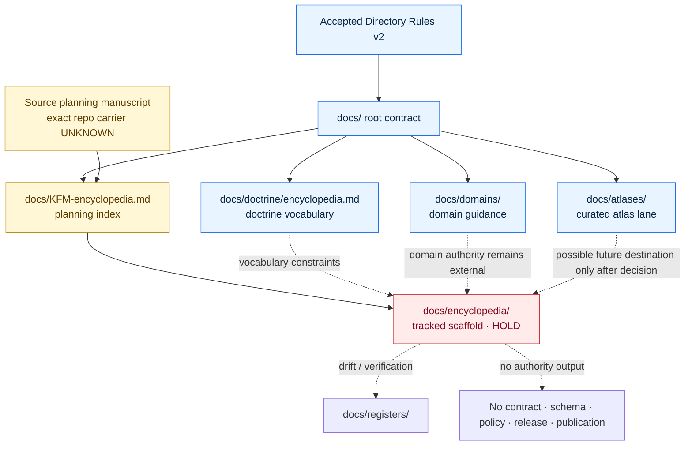

<!-- [KFM_META_BLOCK_V2]
doc_id: kfm://doc/encyclopedia-readme
title: docs/encyclopedia/ — Planning Scaffold Boundary
type: readme
version: v2.0
status: draft; repository-grounded; scaffold-boundary; placement-hold; non-authoritative; no-publication
owners:
  - "@bartytime4life via the default CODEOWNERS route"
reviewers_required:
  - Documentation owner
  - Architecture and directory-governance reviewer
  - Owner of any destination lane affected by a future migration
  - Relevant domain steward before substantive domain content is admitted
created: 2026-05-09
updated: 2026-08-14
policy_label: public; planning-reference; scaffold; cite-or-abstain; no-sensitive-detail
owning_root: docs/
responsibility: >-
  Explain the current docs/encyclopedia scaffold, route readers to the current
  planning and doctrine encyclopedia surfaces, prevent placeholders from being
  mistaken for authority, and define the evidence, decision, validation, migration,
  correction, and rollback boundaries for this held lane.
authority_class: planning-scaffold-boundary
placement_outcome: HOLD
canonical_relationship: >-
  The tracked folder exists, but no accepted decision reviewed in this update admits
  docs/encyclopedia/ as a canonical docs/ lane. docs/KFM-encyclopedia.md is the
  current repository-grounded planning index; docs/doctrine/encyclopedia.md is the
  distinct doctrine-vocabulary surface.
truth_posture: >-
  CONFIRMED current path, seven direct children, seventeen chapter files, sixteen
  generic placeholder chapters, one bounded settlements/infrastructure scaffold,
  accepted Directory Rules v2, the default CODEOWNERS route, and the distinct
  planning-index and doctrine-vocabulary surfaces / CONFLICTED current folder
  presence with the adopted docs/ direct-child map and overlapping encyclopedia
  surfaces / UNKNOWN the source PDF's exact repository carrier, external consumers,
  independent stewardship, and final disposition / NEEDS VERIFICATION an accepted
  placement, migration, mirror, generation, or retirement decision; complete inbound
  reference closure; exact-head hosted checks; and any substantive chapter admission.
evidence_snapshot:
  repository: bartytime4life/Kansas-Frontier-Matrix
  visibility: public
  base_ref: main
  base_commit: dc30e1d38f9a4ecf45fd589d388886fc872dd189
  target_prior_blob: 5eb6f0b10a6e1c16434d3b30c2d38a24eb618408
  direct_child_count: 7
  chapter_file_count: 17
  generic_placeholder_chapter_count: 16
  scoped_scaffold_chapter_count: 1
  changelog_blob: d3d065eb6bc4d93590369f6be4948392781731e6
  index_blob: fa6833280ae520190d06a4485f6cfb1c4d517d52
  manuscript_placeholder_blob: 17c1fb979a11970359dbceb40e75cebf3d360f48
  chapters_tree: 28b053a9ff7c77d243e4225f9571e168b9dccc9a
  assets_tree: d564d0bc3dd917926892c55e3706cc116d5b165e
  lineage_tree: d564d0bc3dd917926892c55e3706cc116d5b165e
  planning_index_blob: 7a2a66a42033f80c291a7176e3ca586ea0576b18
  doctrine_encyclopedia_blob: a5c8f452ca02cc63770b973bf47bd7c1f286a3fa
  docs_root_readme_blob: 1f8bac189dac1d01c1185e8b4fb8e25efd11d09f
  directory_rules_blob: fd49a0b83e55cef52c1124281f093e263526898d
  directory_rules_decision_blob: a4de0d7a96b78da59cfc499d1025e1508afd8dd9
  codeowners_blob: dd2a84aa514d8ecd9208bc347f90f9a2ed37dd61
inspection_boundary: >-
  Current-session GitHub reads against the exact main commit covering this complete
  README, the full direct-child tree, the complete chapter filename/size tree,
  representative and search-confirmed placeholder content, the settlements/
  infrastructure scaffold, the current planning index, the doctrine encyclopedia,
  the docs root README, accepted ADR-0029, adopted Directory Rules v2, CODEOWNERS,
  document-registry posture, and documentation workflow presence. No mounted
  checkout, local documentation test, hosted exact-head run, source PDF repository
  carrier, external-consumer inventory, accepted lane-admission decision, migration,
  deletion, release, deployment, or publication was exercised.
related:
  - ../KFM-encyclopedia.md
  - ../README.md
  - ../doctrine/encyclopedia.md
  - ../doctrine/directory-rules.md
  - ../adr/ADR-0029-adopt-directory-governance-standard-v2.md
  - ../adr/INDEX.md
  - ../domains/README.md
  - ../atlases/README.md
  - ../registers/DRIFT_REGISTER.md
  - ../registers/VERIFICATION_BACKLOG.md
  - ../../control_plane/document_registry.yaml
  - ../../.github/CODEOWNERS
  - ../../.github/workflows/docs-meta-block.yml
  - ../../.github/workflows/link-check.yml
  - ../../.github/workflows/docs-stale-scan.yml
tags: [kfm, encyclopedia, planning, scaffold, documentation, directory-governance, hold, migration, evidence]
notes:
  - "v2.0 is a same-path repository-grounded boundary correction. It changes one explanatory README and does not admit, populate, move, rename, delete, publish, or promote any encyclopedia artifact."
  - "The previous no-repository and proposed-tree claims are stale: the folder and scaffolds are tracked on current main."
  - "Tracked presence is not placement authority. The adopted docs/ direct-child map does not list encyclopedia/, so the lane remains on HOLD pending a governed disposition."
  - "The current planning index is docs/KFM-encyclopedia.md. The doctrine-vocabulary surface is docs/doctrine/encyclopedia.md. This README must not compete with either."
  - "All legacy README anchors are retained so existing inbound fragment links remain stable."
[/KFM_META_BLOCK_V2] -->

<a id="top"></a>
<a id="kfm-domain--capability-encyclopedia"></a>

# KFM Domain & Capability Encyclopedia

> **One-line purpose.** `docs/encyclopedia/` is a tracked planning scaffold whose current responsibility is to preserve a reviewable boundary around placeholder material—not to become a second encyclopedia authority, a domain implementation home, or a publication surface.

[](#status--authority)
[](#repo-fit)
[](#repo-fit)
[](#directory-tree-proposed)
[](#directory-tree-proposed)
[](#outputs)

> [!IMPORTANT]
> **The folder exists; its authority does not follow from that fact.** Current repository evidence confirms `docs/encyclopedia/`, its placeholder files, and its chapter scaffold. Accepted Directory Rules v2 and the current `docs/` root contract do not list `encyclopedia/` as a canonical direct-child lane. The safe placement result is therefore **HOLD** until an accepted decision classifies the lane, its single writer, its source artifact, and its migration or retention path.

> [!CAUTION]
> **Use the current repository surfaces for orientation.** [`docs/KFM-encyclopedia.md`](../KFM-encyclopedia.md) is the repository-grounded planning index for the source manuscript. [`docs/doctrine/encyclopedia.md`](../doctrine/encyclopedia.md) is the separate doctrine-vocabulary surface. This README and its placeholders must not silently compete with either surface.

> [!WARNING]
> A placeholder, chapter filename, directory tree, source manuscript, map, diagram, badge, generated summary, pull request, or green documentation check does not establish doctrine, source authority, evidence closure, policy approval, review, promotion, release, implementation maturity, or KFM publication.

**Quick navigation:** [Status](#status--authority) · [Scope](#scope) · [Evidence](#evidence-boundary) · [Repo fit](#repo-fit) · [Allowed material](#what-belongs-here) · [Exclusions](#exclusions) · [Current tree](#directory-tree-proposed) · [Source structure](#encyclopedia-structure) · [Domain coverage](#domain-coverage) · [Docs relationships](#how-this-folder-relates-to-the-rest-of-docs) · [Quickstart](#quickstart) · [Inputs](#inputs) · [Outputs](#outputs) · [Validation](#validation) · [Review](#review-burden) · [Related](#related-folders) · [ADRs](#adrs) · [Open questions](#open-questions) · [Definition of done](#task-list--definition-of-done-for-the-encyclopedia-folder) · [FAQ](#faq) · [Rollback](#rollback-and-correction) · [Last reviewed](#last-reviewed)

---

<a id="status--authority"></a>

## Status & Authority

| Field | Current bounded result |
|---|---|
| **Tracked path** | `docs/encyclopedia/README.md` — **CONFIRMED** at `main@dc30e1d38f9a4ecf45fd589d388886fc872dd189` |
| **Owning responsibility root** | `docs/` — human-readable governance and explanation |
| **Current lane class** | Present planning scaffold; not admitted as a canonical direct-child lane in the inspected `docs/` root contract |
| **Finite placement result** | `HOLD` — classification and disposition require a governed decision |
| **This README's authority** | Explanatory boundary and navigation only |
| **Current planning encyclopedia index** | [`docs/KFM-encyclopedia.md`](../KFM-encyclopedia.md) |
| **Current doctrine vocabulary surface** | [`docs/doctrine/encyclopedia.md`](../doctrine/encyclopedia.md) |
| **Exact source PDF repository carrier** | `UNKNOWN` — the planning index records the source artifact, but no exact canonical repository path was verified |
| **Tracked scaffold** | Seven direct children; seventeen chapter files; sixteen generic chapter placeholders; one bounded settlements/infrastructure scaffold |
| **Current review route** | Default [`.github/CODEOWNERS`](../../.github/CODEOWNERS) route to `@bartytime4life`; independent documentation stewardship remains `NEEDS VERIFICATION` |
| **Effect of this revision** | Same-path documentation correction only |
| **Release/publication effect** | None |

### Four states that must remain separate

1. **Source-manuscript lineage** records what the supplied planning manuscript covered.
2. **Repository scaffold presence** proves that placeholder paths exist.
3. **Placement authority** decides whether this folder may become a canonical or compatibility lane.
4. **Substantive implementation or publication** requires evidence from the owning contracts, schemas, policy, tests, release records, and governed runtime.

No state implies the next. In particular, a tracked scaffold does not authorize authors to fill every placeholder, and a completed manuscript does not prove that any described capability is implemented.

[Back to top](#top)

---

<a id="scope"></a>

## Scope

This README explains the current boundary around the tracked `docs/encyclopedia/` scaffold.

**In scope**

- the exact tracked path and current child inventory;
- the distinction among the planning index, doctrine encyclopedia, and this scaffold;
- the adopted Directory Rules and `docs/` root-placement boundary;
- what maintainers may safely change while disposition is unresolved;
- the source manuscript's sixteen-section outline as lineage;
- placeholder, duplication, numbering, provenance, and migration risks;
- review, validation, correction, rollback, and re-review expectations.

**Out of scope**

- accepting `docs/encyclopedia/` as a canonical lane;
- selecting a single-file or chaptered encyclopedia authoring system;
- copying the source PDF into the repository;
- populating the sixteen generic chapter placeholders;
- converting the settlements/infrastructure scaffold into domain authority;
- moving, renaming, deleting, mirroring, or generating scaffold files;
- changing the planning index or doctrine encyclopedia;
- changing contracts, schemas, policy, sources, data, receipts, proofs, releases, applications, or runtime behavior;
- releasing, deploying, promoting, or publishing anything.

The source manuscript remains useful planning lineage. Its broad domain, feature, action, viewing-mode, governance, and validation coverage does not resolve the repository's current single-writer and placement questions.

[Back to top](#top)

---

<a id="evidence-boundary"></a>

## Evidence boundary

This revision replaces the previous document-only and no-repository posture with current, commit-pinned repository evidence.

| Surface inspected | CONFIRMED current evidence | Safe conclusion |
|---|---|---|
| This README | Tracked at the target path with prior blob `5eb6f0b10a6e1c16434d3b30c2d38a24eb618408` | Same-path modernization is available; prior text is not current authority |
| Direct-child tree | Seven direct children are tracked | The folder exists; presence alone does not admit the lane |
| Top-level scaffold files | `CHANGELOG.md`, `INDEX.md`, and `encyclopedia.md` each contain only a heading and `Status: PROPOSED placeholder.` | They are placeholders, not indexes, changelogs, or manuscripts in a substantive sense |
| Chapter tree | Seventeen Markdown files are tracked | The tree is a scaffold, not a completed chaptered encyclopedia |
| Generic chapter files | Search-confirmed `Status: PROPOSED placeholder.` in the sixteen structural files from `01-cover.md` through `16-appendices.md` | The source outline has path-shaped stubs only |
| Settlements/infrastructure chapter | `11-settlements-infrastructure.md` is a bounded scaffold sourced from a domain expansion backlog | It is not domain-reviewed authority and creates a duplicate `11-` ordinal |
| Assets and lineage | Each directory contains only `.gitkeep` | No encyclopedia-specific asset or lineage package is established |
| Planning index | [`docs/KFM-encyclopedia.md`](../KFM-encyclopedia.md) is a repository-grounded planning index | Readers should start there for manuscript orientation |
| Doctrine encyclopedia | [`docs/doctrine/encyclopedia.md`](../doctrine/encyclopedia.md) is the distinct vocabulary surface | This scaffold must not redefine KFM terms |
| `docs/` root contract | [`docs/README.md`](../README.md) lists the adopted canonical direct-child lanes and omits `encyclopedia/` | The current lane requires classification; omission is not deletion authority |
| Directory governance | [`ADR-0029`](../adr/ADR-0029-adopt-directory-governance-standard-v2.md) accepts the exact [`Directory Rules v2`](../doctrine/directory-rules.md) bytes | Placement changes must follow adopted authority and migration discipline |
| Review routing | Default CODEOWNERS route is `@bartytime4life` | Review routing exists; completed or independent review is not implied |

### Evidence not established

This update did not establish:

- the exact repository carrier for the 82-page source PDF described by the planning index;
- an accepted lane-admission, compatibility, mirror, generation, migration, or retirement decision;
- a complete inbound-reference or external-consumer inventory;
- a single canonical encyclopedia authoring source;
- a generated relationship among `docs/KFM-encyclopedia.md`, the source PDF, `docs/encyclopedia/encyclopedia.md`, or `chapters/`;
- independent documentation, domain, policy, or release stewardship;
- hosted exact-head check results for the future branch;
- implementation, release, deployment, or publication of any capability described in the source manuscript.

[Back to top](#top)

---

<a id="repo-fit"></a>

## Repo fit

The artifact's responsibility signature is:

| Axis | Current classification |
|---|---|
| `artifact_kind` | Human-readable directory boundary and planning-scaffold orientation |
| `authority_owner` | Documentation explanation only |
| `lifecycle_stage` | Not a lifecycle data object |
| `execution_role` | None |
| `scope_kind` | Cross-domain planning scaffold |
| `exposure` | Public repository-facing documentation |
| `mutability` | Reviewed, versioned replacement |
| `retention` | Durable while consumers or an unresolved disposition require the path |
| `physical_storage` | Git |

Accepted Directory Rules place human-readable explanation under `docs/`, so this README's responsibility root is correct. The unresolved question is the **child-lane identity**. The current [`docs/README.md`](../README.md) canonical map lists `adr/`, `architecture/`, `archive/`, `atlases/`, `doctrine/`, `domains/`, `registers/`, `runbooks/`, `security/`, `sources/`, and `standards/`; it does not admit `encyclopedia/`.

That creates a bounded tension:

- **CONFIRMED implementation fact:** `docs/encyclopedia/` exists.
- **CONFIRMED placement authority:** the adopted canonical map omits it.
- **CONFLICTED relationship:** current presence overlaps with [`docs/KFM-encyclopedia.md`](../KFM-encyclopedia.md), [`docs/doctrine/encyclopedia.md`](../doctrine/encyclopedia.md), and atlas/domain documentation.
- **Placement outcome:** `HOLD`, not silent acceptance and not automatic deletion.

### What HOLD means here

While this lane is held:

- preserve the path and existing history;
- correct false boundary claims and broken navigation;
- inventory consumers, unique material, and provenance;
- do not add substantive encyclopedia content;
- do not make placeholders look accepted through badges, polish, or volume;
- do not delete or migrate files without a separate, reviewable disposition packet;
- do not use this README revision as the authority for a later structural change in the same change set.

### Bounded disposition options

The following are options for a later decision, not decisions made here:

| Option | Required evidence before implementation |
|---|---|
| **Retire the scaffold lane** and keep `docs/KFM-encyclopedia.md` as the planning index | Unique-content inventory, inbound-link closure, source-provenance map, deletion/retirement record, and rollback target |
| **Admit `docs/encyclopedia/`** as a canonical or compatibility lane | Accepted placement decision, lane contract, single-writer model, generation/mirror rules, ownership, validation, and migration plan |
| **Migrate unique material** into an accepted lane such as `docs/atlases/` or another approved destination | Object-by-object classification, destination-owner review, stable identity/link handling, migration receipt, and rollback |
| **Keep a minimal tombstone or redirect** | Verified consumers, explicit canonical target, read-only contract, sunset criteria, and no dual-write path |

This same-path README update chooses none of these options.

[Back to top](#top)

---

<a id="what-belongs-here"></a>

## What belongs here

Until the placement HOLD is resolved, admissible changes are intentionally narrow:

- this boundary README and corrections to it;
- consumer and inbound-link inventories;
- source-provenance and content-identity notes;
- migration, retirement, mirror, or admission decision packets clearly labeled as proposals;
- read-only redirect or tombstone material only after an accepted disposition authorizes it;
- minimal link repairs needed to keep current consumers functioning;
- explicit records of unresolved duplication, numbering, or authority drift.

Substantive encyclopedia chapters, matrices, policy summaries, domain implementations, examples, diagrams, and generated manuscript copies do **not** become admissible merely because a placeholder path exists.

> [!TIP]
> A missing planning topic should be repaired in the current owning surface first. Update doctrine in the owning doctrine file, domain guidance in [`docs/domains/`](../domains/README.md), and the repository-grounded planning crosswalk in [`docs/KFM-encyclopedia.md`](../KFM-encyclopedia.md). Reflect material into this scaffold only after its role is accepted.

[Back to top](#top)

---

<a id="exclusions"></a>

## Exclusions

| Do not place or define here | Owning surface | Boundary reason |
|---|---|---|
| KFM-wide doctrine or canonical vocabulary | [`docs/doctrine/`](../doctrine/README.md) | Doctrine owns operating meaning |
| Architecture decisions | [`docs/adr/`](../adr/INDEX.md) | ADRs record accepted and proposed decisions |
| Per-domain authoritative guidance | [`docs/domains/`](../domains/README.md) | Domains own their bounded language and risk posture |
| Curated atlas collections | [`docs/atlases/`](../atlases/README.md) | Atlas carriers have an accepted documentation lane |
| Semantic object or interface meaning | [`contracts/`](../../contracts/README.md) | Contracts define meaning |
| Machine-valid shape | [`schemas/`](../../schemas/README.md) | Schemas define shape |
| Allow, deny, restrict, redact, or abstain rules | [`policy/`](../../policy/README.md) | Policy decides admissibility |
| Source identity, rights, or activation state | [`docs/sources/`](../sources/README.md) and `data/registry/` | Source authority has dedicated homes |
| Receipts and proofs | `data/receipts/` and `data/proofs/` | Process memory and proof remain distinct |
| Release decisions, manifests, corrections, withdrawals, or rollback cards | [`release/`](../../release/README.md) | Release governance is not planning prose |
| Released public-safe carriers | `data/published/` | Published data requires governed release |
| Runtime, API, renderer, or AI implementation | `apps/`, `packages/`, `runtime/`, and related execution roots | Executable behavior must live with its owner |
| A second copy of the source manuscript or PDF | No destination selected | Provenance, canonicality, and single-writer rules are unresolved |
| Sensitive exact locations or private details | No public documentation surface | Rights and sensitivity uncertainty fail closed |

> [!WARNING]
> Do not “complete” a scaffold by copying narrative from a planning PDF into paths that look authoritative. Content migration must preserve source identity, status, rights, citations, unique wording, current corrections, and one writable owner.

[Back to top](#top)

---

<a id="directory-tree-proposed"></a>

## Directory tree — current repository evidence

The prior README labeled this structure as proposed. The structure is now **CONFIRMED present** at the evidence checkpoint; its long-term authority and disposition remain unresolved.

```text
docs/encyclopedia/
├── README.md
├── CHANGELOG.md                       # placeholder only
├── INDEX.md                           # placeholder only
├── encyclopedia.md                    # placeholder only
├── assets/
│   └── .gitkeep
├── lineage/
│   └── .gitkeep
└── chapters/
    ├── 01-cover.md                    # generic placeholder
    ├── 02-executive-summary.md        # generic placeholder
    ├── 03-source-ledger.md            # generic placeholder
    ├── 04-operating-law.md            # generic placeholder
    ├── 05-master-domain-atlas.md      # generic placeholder
    ├── 06-cross-domain-capability-taxonomy.md
    ├── 07-domain-chapters.md
    ├── 08-cross-domain-systems.md
    ├── 09-master-feature-matrix.md
    ├── 10-master-action-matrix.md
    ├── 11-master-viewing-mode-atlas.md
    ├── 11-settlements-infrastructure.md  # separate bounded scaffold
    ├── 12-programming-possibilities-backlog.md
    ├── 13-sensitive-deny-by-default-register.md
    ├── 14-implementation-roadmap.md
    ├── 15-validation-and-acceptance-plan.md
    └── 16-appendices.md
```

### Current file-state register

| Surface | Count | Current content state | Authority effect |
|---|---:|---|---|
| Boundary README | 1 | Substantive but stale before this revision | Explains only |
| Top-level placeholder files | 3 | Heading plus `Status: PROPOSED placeholder.` | None |
| Generic structural chapter placeholders | 16 | Heading plus `Status: PROPOSED placeholder.` | None |
| Scoped chapter scaffold | 1 | Settlements/infrastructure pointer to a domain expansion backlog | None |
| Asset directory | 1 | `.gitkeep` only | None |
| Lineage directory | 1 | `.gitkeep` only | None |

### Numbering and identity drift

`chapters/` contains both `11-master-viewing-mode-atlas.md` and `11-settlements-infrastructure.md`. The duplicate ordinal is not harmless if a later generator, table of contents, sorter, or stable-ID scheme assumes one chapter per number. Do not renumber either file in this README-only change. A future disposition must identify consumers and preserve stable links before any rename.

### Single-writer rule

The current tree exposes two possible manuscript shapes at once:

- `encyclopedia.md` as a single-file source; and
- `chapters/` as a split source.

Neither contains the manuscript. No generator or synchronization relationship was verified. A later implementation must select exactly one writable source—or a documented external source plus generated mirrors—and prove that all other copies are read-only derivatives.

[Back to top](#top)

---

<a id="encyclopedia-structure"></a>

## Encyclopedia structure — source-manuscript lineage

The source planning manuscript uses a sixteen-section structure. The current chapter filenames preserve that outline as path-shaped lineage, but the files do not contain the manuscript.

| § | Source-manuscript section | Current scaffold path | Current state |
|---:|---|---|---|
| 1 | Cover Page | `chapters/01-cover.md` | Placeholder |
| 2 | Executive Summary | `chapters/02-executive-summary.md` | Placeholder |
| 3 | Source Ledger and Evidence Method | `chapters/03-source-ledger.md` | Placeholder |
| 4 | KFM Operating Law | `chapters/04-operating-law.md` | Placeholder; must never become competing doctrine |
| 5 | Master Domain Atlas | `chapters/05-master-domain-atlas.md` | Placeholder |
| 6 | Cross-Domain Capability Taxonomy | `chapters/06-cross-domain-capability-taxonomy.md` | Placeholder |
| 7 | Domain Chapters | `chapters/07-domain-chapters.md` | Placeholder |
| 8 | Cross-Domain Systems Chapters | `chapters/08-cross-domain-systems.md` | Placeholder |
| 9 | Master Feature Matrix | `chapters/09-master-feature-matrix.md` | Placeholder |
| 10 | Master Action Matrix | `chapters/10-master-action-matrix.md` | Placeholder |
| 11 | Master Viewing Mode Atlas | `chapters/11-master-viewing-mode-atlas.md` | Placeholder |
| 12 | Programming Possibilities Backlog | `chapters/12-programming-possibilities-backlog.md` | Placeholder |
| 13 | Sensitive / Deny-by-Default Register | `chapters/13-sensitive-deny-by-default-register.md` | Placeholder; policy remains external |
| 14 | Implementation Roadmap | `chapters/14-implementation-roadmap.md` | Placeholder |
| 15 | Validation and Acceptance Plan | `chapters/15-validation-and-acceptance-plan.md` | Placeholder |
| 16 | Appendices and Self-Check | `chapters/16-appendices.md` | Placeholder |

The extra `11-settlements-infrastructure.md` file is not part of this sixteen-section outline. It is a later bounded scaffold created from a domain backlog reference. Its presence must be reconciled separately rather than silently folded into the manuscript.

### Truth labels and runtime outcomes

Any future encyclopedia content must preserve two distinct vocabularies:

- **Truth labels:** `CONFIRMED`, `PROPOSED`, `UNKNOWN`, `NEEDS VERIFICATION`, with refinements such as `CONFLICTED`, `STALE`, or `LINEAGE` where supported.
- **Finite outward outcomes:** `ANSWER`, `ABSTAIN`, `DENY`, and `ERROR` for runtime or policy-facing surfaces.

A planning chapter may describe these terms. It cannot execute them or promote its own prose into evidence.

[Back to top](#top)

---

<a id="domain-coverage"></a>

## Domain coverage

The source manuscript covers sixteen named domain or cross-domain areas:

1. Spatial Foundation, Cartography, and Reference Systems
2. Hydrology
3. Soil
4. Habitat
5. Fauna
6. Flora
7. Agriculture
8. Geology and Natural Resources
9. Atmosphere, Air, and Climate
10. Hazards
11. Roads, Rail, and Trade Routes
12. Settlements, Cities, and Infrastructure
13. Archaeology and Cultural Heritage
14. People, Genealogy, DNA, and Land Ownership
15. Frontier Demography, Economy, Settlement, Land, and Time Matrix
16. Planetary, 3D, Digital Twin, and Synthetic Spatial Systems

This list is **source-manuscript coverage**, not a current implementation inventory and not a permission matrix. Current human domain guidance belongs under [`docs/domains/`](../domains/README.md). Contracts, schemas, policy, source descriptors, fixtures, validators, release records, and public products remain in their owning responsibility roots.

For sensitive domains—especially rare species, archaeology, infrastructure, living-person material, genomics, land/title, cultural or sovereign material, and precise locations—unknown authority, rights, or sensitivity must remain redacted, generalized, staged, delayed, quarantined, denied, or absent from public documentation.

[Back to top](#top)

---

<a id="how-this-folder-relates-to-the-rest-of-docs"></a>

## How this folder relates to the rest of `docs/`


```mermaid
flowchart TD
    DIR["Accepted Directory Rules v2"] --> DOCS["docs/ root contract"]
    DOCS --> DOCT["docs/doctrine/encyclopedia.md<br/>doctrine vocabulary"]
    DOCS --> PLAN["docs/KFM-encyclopedia.md<br/>planning index"]
    DOCS --> DOM["docs/domains/<br/>domain guidance"]
    DOCS --> ATL["docs/atlases/<br/>curated atlas lane"]

    SRC["Source planning manuscript<br/>exact repo carrier UNKNOWN"] --> PLAN
    PLAN --> HOLD["docs/encyclopedia/<br/>tracked scaffold · HOLD"]
    DOCT -. vocabulary constraints .-> HOLD
    DOM -. domain authority remains external .-> HOLD
    ATL -. possible future destination only after decision .-> HOLD

    HOLD -. drift / verification .-> REG["docs/registers/"]
    HOLD -. no authority output .-> NONE["No contract · schema · policy · release · publication"]

    classDef authority fill:#e8f4ff,stroke:#1f6feb,color:#0a2540
    classDef planning fill:#fff7d6,stroke:#b8860b,color:#5b3a00
    classDef hold fill:#ffebe9,stroke:#cf222e,color:#82071e
    class DIR,DOCS,DOCT,DOM,ATL authority
    class SRC,PLAN planning
    class HOLD hold
```

The diagram is explanatory. It does not choose a destination for the scaffold or assert that `docs/atlases/` is the correct migration target.

### Navigation rule

- Use the [Doctrine Encyclopedia](../doctrine/encyclopedia.md) for term meaning and doctrine cross-references.
- Use the [KFM Encyclopedia planning index](../KFM-encyclopedia.md) for the source manuscript's current repository-grounded crosswalk.
- Use [Domain documentation](../domains/README.md) for domain-specific language, risks, and current bounded status.
- Use [Accepted ADRs](../adr/INDEX.md) and owning roots for decisions and implementation truth.
- Use this folder only for scaffold-boundary, disposition, provenance, and migration work until the HOLD is resolved.

[Back to top](#top)

---

<a id="quickstart"></a>

## Quickstart

### Reader

1. Start with [`docs/KFM-encyclopedia.md`](../KFM-encyclopedia.md).
2. Resolve terminology through [`docs/doctrine/encyclopedia.md`](../doctrine/encyclopedia.md).
3. Follow links to the owning domain, contract, schema, policy, source, test, or release surface.
4. Treat any manuscript-shaped implementation claim as planning until current repository evidence proves it.
5. Return to this README only to understand the held scaffold and its disposition risks.

### Contributor

1. Confirm the task is boundary, provenance, consumer-inventory, or migration work.
2. Pin current main, the target blob, adopted Directory Rules, and any accepted decision governing the proposed change.
3. Search for equivalent content in the planning index, doctrine encyclopedia, domains, and atlases.
4. Do not populate placeholders or add assets merely to make the tree look complete.
5. Preserve stable paths and anchors until consumer closure is proven.
6. Run applicable metadata, link, staleness, graph, and changed-area checks.
7. Keep structural changes in a separate reviewable packet from the decision that authorizes them.

### Reviewer

Ask:

- Does the change narrow or expand this lane's authority?
- Does it create a second writable encyclopedia source?
- Does it copy source text without provenance or correction lineage?
- Does it move domain, policy, contract, schema, source, receipt, proof, or release authority into docs?
- Does it expose sensitive content?
- Does it preserve inbound links and rollback?
- Is the asserted placement supported by an accepted decision rather than by this README itself?

[Back to top](#top)

---

<a id="inputs"></a>

## Inputs

This boundary README may consume:

- current repository tree, bytes, history, references, and documentation workflows;
- accepted Directory Rules and ADRs;
- the current planning index and doctrine encyclopedia;
- source-manuscript identity and lineage recorded by the planning index;
- domain, atlas, register, and root README contracts;
- explicit consumer, provenance, migration, correction, or rollback evidence;
- authoritative external standards only when a current placement or rights question actually depends on them.

Inputs remain at their own authority rank. A planning PDF does not become doctrine because this README cites it. A repository path does not become canonical because it exists. A validator does not create an accepted decision.

[Back to top](#top)

---

<a id="outputs"></a>

## Outputs

While the lane remains on HOLD, this folder may emit only human-readable, non-authoritative scaffold-governance material such as:

- this boundary README;
- consumer and link inventories;
- provenance and content-identity notes;
- proposed disposition or migration plans;
- explicit drift and verification references;
- an authorized read-only redirect or tombstone after a separate decision.

It does **not** emit or own:

- canonical doctrine or domain authority;
- `SourceDescriptor`, `EvidenceRef`, or `EvidenceBundle`;
- contracts, schemas, or policy;
- `RunReceipt`, proof, review record, or promotion decision;
- release manifest, correction notice, withdrawal notice, or rollback card;
- public-safe data carrier;
- API, MapLibre, AI, or runtime behavior;
- KFM release or publication.

[Back to top](#top)

---

<a id="validation"></a>

## Validation

Documentation checks provide repository-quality evidence. They do not accept the lane, resolve the source manuscript, approve sensitive content, or establish release/publication.

| Check | Repository surface | What it can establish | What it cannot establish |
|---|---|---|---|
| Metadata and document-registry comparison | [`docs-meta-block.yml`](../../.github/workflows/docs-meta-block.yml) | Parseable metadata and bounded registry delta | Authority, adoption, review, or publication |
| Relative link and reference-style checks | [`link-check.yml`](../../.github/workflows/link-check.yml) | Covered repository-relative link integrity | External availability, semantic correctness, or consumer closure |
| Staleness scan | [`docs-stale-scan.yml`](../../.github/workflows/docs-stale-scan.yml) | Configured stale markers and metadata findings | Current implementation or source truth |
| Markdown source checks | Repository-native validators and changed-area jobs | Fences, headings, tables, anchors, and formatting under covered rules | Hosted rendering parity or architecture truth |
| Topology and documentation graph checks | Applicable repository guardrails | Known path/identifier drift against current baselines | Acceptance of a new lane or migration |
| Sensitive-content review | Human/policy review | Bounded absence or approved transformation of risky detail | Rights or sensitivity clearance outside its evidence scope |

### Required source-level checks for this README revision

- UTF-8 with final newline;
- one H1;
- balanced fenced blocks;
- unique explicit anchors;
- all legacy anchors retained;
- internal fragment targets present;
- relative links point to tracked current paths or are explicitly labeled unresolved;
- metadata parses;
- no placeholder owner is converted into a verified reviewer;
- no claim of hosted checks before those checks complete.

### Negative checks

Hold or reject a later change that would:

- populate a placeholder before a placement and single-writer decision;
- create or edit a second manuscript copy without generation rules;
- treat a planning outline as doctrine;
- absorb domain, contract, schema, policy, source, receipt, proof, or release authority;
- introduce sensitive details without qualified review;
- rename or delete paths without consumer closure and rollback;
- use a proposed decision edited in the same packet to authorize structural work;
- report a documentation check as release or publication proof.

[Back to top](#top)

---

<a id="review-burden"></a>

## Review burden

| Change class | Minimum review posture |
|---|---|
| Typo, wording correction, or link repair with no changed meaning | Current documentation review route |
| Evidence refresh or scaffold inventory update | Documentation owner plus reviewer of the affected source |
| Provenance or source-artifact identity change | Documentation owner plus source/provenance reviewer |
| Domain-specific content admission | Documentation owner plus relevant domain steward |
| Sensitive-domain material | Relevant policy/sensitivity authority and domain steward |
| Lane admission, compatibility classification, migration, rename, split, merge, or retirement | Accepted decision as required by Directory Rules; documentation and destination-root owners; independent review proportionate to authority impact |
| Deletion of a scaffold path | Consumer closure, provenance preservation, migration/retirement record, and rollback evidence |

**Current executable review route:** [`.github/CODEOWNERS`](../../.github/CODEOWNERS) falls back to `@bartytime4life` for this path. That route requests review; it is not a `ReviewRecord`, independent approval, stewardship assignment, release decision, or publication authority.

[Back to top](#top)

---

<a id="related-folders"></a>

## Related folders

| Surface | Relationship |
|---|---|
| [`docs/KFM-encyclopedia.md`](../KFM-encyclopedia.md) | Current repository-grounded planning index and source-manuscript crosswalk |
| [`docs/doctrine/encyclopedia.md`](../doctrine/encyclopedia.md) | Distinct doctrine-vocabulary and concept-index surface |
| [`docs/README.md`](../README.md) | Current `docs/` root contract and canonical direct-child map |
| [`docs/doctrine/directory-rules.md`](../doctrine/directory-rules.md) | Adopted placement standard through ADR-0029 |
| [`docs/adr/`](../adr/INDEX.md) | Decision records; no encyclopedia-lane admission decision was identified in this review |
| [`docs/domains/`](../domains/README.md) | Current human domain guidance |
| [`docs/atlases/`](../atlases/README.md) | Accepted curated atlas documentation lane; not selected here as a migration target |
| [`docs/registers/DRIFT_REGISTER.md`](../registers/DRIFT_REGISTER.md) | Human-readable drift record |
| [`docs/registers/VERIFICATION_BACKLOG.md`](../registers/VERIFICATION_BACKLOG.md) | Human-readable unresolved verification work |
| [`control_plane/document_registry.yaml`](../../control_plane/document_registry.yaml) | Proposed machine document registry; currently sparse and not authority-creating |
| [`contracts/`](../../contracts/README.md), [`schemas/`](../../schemas/README.md), [`policy/`](../../policy/README.md) | Owning semantic, shape, and admissibility roots |
| [`release/`](../../release/README.md) | Release decision plane; this folder has no release effect |

[Back to top](#top)

---

<a id="adrs"></a>

## ADRs

[`ADR-0029`](../adr/ADR-0029-adopt-directory-governance-standard-v2.md) is accepted and adopts the exact Directory Rules v2 bytes. It controls the placement method and prevents current repository drift from becoming automatic precedent.

No accepted ADR admitting, migrating, mirroring, generating, or retiring `docs/encyclopedia/` was identified in this review.

A later change must determine its decision class before implementation:

- A boundary-only correction can use routine documentation review.
- A root-internal lane refinement may be reviewable by the owning root if it creates no competing authority or compatibility contract.
- A new canonical or compatibility classification, split, merge, rename, or retirement may require an accepted ADR or another accepted decision packet under Directory Rules.
- The decision and the structural implementation must remain separate when the implementation depends on the decision becoming effective.

This README is not that decision.

[Back to top](#top)

---

<a id="open-questions"></a>

## Open questions

| ID | Question | Current status | Evidence needed |
|---|---|---|---|
| `ENC-HOLD-001` | What is the long-term disposition of `docs/encyclopedia/`? | `HOLD` | Accepted placement, migration, compatibility, or retirement decision |
| `ENC-HOLD-002` | Which artifact is the one writable planning-encyclopedia source? | `CONFLICTED` | Source-provenance map, writer/generator contract, and consumer inventory |
| `ENC-HOLD-003` | Where are the exact source PDF bytes governed in the repository, if anywhere? | `UNKNOWN` | Exact digest-to-path evidence or explicit external-storage record |
| `ENC-HOLD-004` | Are `encyclopedia.md` or `chapters/` intended as generated mirrors? | `UNKNOWN` | Generator, source declaration, generated markers, and reproducible output evidence |
| `ENC-HOLD-005` | Does any substantive unique material exist in the scaffold beyond the settlements pointer? | `NEEDS VERIFICATION` | Full content and history comparison against planning, doctrine, domain, and atlas surfaces |
| `ENC-HOLD-006` | Which consumers depend on current file and fragment paths? | `NEEDS VERIFICATION` | Repository and external inbound-reference inventory |
| `ENC-HOLD-007` | How should the duplicate `11-` chapter ordinal be resolved? | `HOLD` | Consumer and stable-identity analysis plus selected manuscript model |
| `ENC-HOLD-008` | Is the settlements/infrastructure scaffold still needed after current domain documentation updates? | `NEEDS VERIFICATION` | Domain-owner review and source-backlog reconciliation |
| `ENC-HOLD-009` | Who owns planning-encyclopedia stewardship and independent review? | `UNKNOWN` | Verified stewardship assignment |
| `ENC-HOLD-010` | What rights and attribution apply to any future repository copy of the source manuscript or figures? | `NEEDS VERIFICATION` | Source rights, provenance, and redistribution review |
| `ENC-HOLD-011` | Should current placeholders be retained, tombstoned, migrated, generated, or deleted? | `HOLD` | Accepted disposition plus rollback and correction plan |
| `ENC-HOLD-012` | Are documentation workflows and required checks sufficient for a future structural change? | `NEEDS VERIFICATION` | Exact-head hosted results, ruleset coupling, and changed-area coverage |

Open questions belong in the owning register when they become repository-wide tracked work. This README keeps the local decision context visible; it does not silently create machine or governance state.

[Back to top](#top)

---

<a id="task-list--definition-of-done-for-the-encyclopedia-folder"></a>

## Task list — definition of done for the encyclopedia scaffold

### Evidence and authority

- [ ] Adopt or record one finite disposition: admit, migrate, mirror, tombstone, retire, or continue HOLD.
- [ ] Identify the one writable source of planning-encyclopedia content.
- [ ] Pin the source manuscript or external carrier by durable identity and provenance.
- [ ] Verify the current planning index, doctrine encyclopedia, domain docs, and atlas relationships.
- [ ] Assign verified stewardship and review routes appropriate to the selected disposition.

### Content and identity

- [ ] Classify every tracked scaffold file as unique content, redirect, generated mirror, migration source, tombstone, or deletion candidate.
- [ ] Resolve the duplicate `11-` ordinal without breaking consumers.
- [ ] Decide whether the settlements/infrastructure scaffold is retained, migrated, or retired with domain-owner review.
- [ ] Preserve stable document IDs, paths, anchors, and source lineage where required.
- [ ] Prohibit dual-write manuscript copies.

### Migration and safety

- [ ] Inventory repository and known external consumers.
- [ ] Prepare link, identity, and redirect handling before any move or deletion.
- [ ] Record a migration/retirement manifest and Git-recoverable rollback target.
- [ ] Verify no contract, schema, policy, source, receipt, proof, release, or published authority moves into the scaffold.
- [ ] Apply sensitive-content and rights review before importing any manuscript text or figures.

### Validation

- [ ] Run metadata, link, Markdown, staleness, graph, topology, and changed-area checks applicable to the final packet.
- [ ] Verify exact-head hosted results and report inherited failures separately from introduced defects.
- [ ] Update the `docs/` root map, document registry, and related navigation only after the disposition becomes effective.
- [ ] Record correction and re-review triggers.

Until these items close through a governed sequence, “definition of done” means the scaffold remains clearly bounded and non-authoritative—not that every placeholder is filled.

[Back to top](#top)

---

<a id="faq"></a>

## FAQ

### Is `docs/encyclopedia/` real?

Yes. The path and its tracked scaffold are confirmed on current main. Its **canonical or compatibility authority is not confirmed**.

### Is this the main KFM Encyclopedia?

No. Start with [`docs/KFM-encyclopedia.md`](../KFM-encyclopedia.md) for the current planning index. Use [`docs/doctrine/encyclopedia.md`](../doctrine/encyclopedia.md) for doctrine vocabulary.

### May I fill the chapter placeholders?

Not while the lane is on HOLD. First resolve placement, provenance, single-writer, generation, ownership, rights, consumer, and validation questions.

### Does the source manuscript prove the repository implements its features?

No. The manuscript is planning lineage. Current implementation claims require current code, configuration, contract, schema, policy, fixture, test, workflow, artifact, log, or runtime evidence.

### Why not delete the placeholders now?

Deletion would be structural work. Consumer closure, unique-content and history review, provenance preservation, an accepted disposition, and rollback are not yet established.

### Why not declare the folder canonical because it exists?

Accepted Directory Rules explicitly separate current repository convention from placement authority. Conflicting convention is drift to classify, not automatic precedent.

### Can this folder contain examples?

Only after its role is accepted and the examples are supported, rights-safe, sensitivity-safe, clearly labeled, and subordinate to owning authority. While held, add examples to the current owning surface instead.

### Can a green documentation workflow resolve the HOLD?

No. Workflows can validate covered source properties. They cannot accept a lane, appoint stewards, determine rights, approve migration, or publish.

### What happens to the old anchors?

This revision preserves the legacy README anchors. Any future rename or split must preserve or deliberately migrate them with consumer evidence.

[Back to top](#top)

---

<a id="rollback-and-correction"></a>

## Rollback and correction

This README changes documentation only. It does not alter scaffold files, authority, source material, implementation, release, or public state.

Rollback target:

```text
docs/encyclopedia/README.md
blob: 5eb6f0b10a6e1c16434d3b30c2d38a24eb618408
base: dc30e1d38f9a4ecf45fd589d388886fc872dd189
```

Revert or correct this README when it:

- misstates the current tree or source identity;
- narrows or expands an accepted placement decision incorrectly;
- directs readers to a stale canonical surface;
- implies that placeholders are authoritative;
- creates a second writable encyclopedia source;
- leaks sensitive or rights-uncertain material;
- breaks stable anchors;
- claims review, validation, release, or publication without evidence.

A future structural rollback must also restore paths, aliases, generated relationships, consumer links, and source lineage affected by that structural change. Git history alone is recoverability evidence, not a complete correction plan for external consumers.

[Back to top](#top)

---

<a id="last-reviewed"></a>

## Last reviewed

**2026-08-14** against:

- `main@dc30e1d38f9a4ecf45fd589d388886fc872dd189`;
- target prior blob `5eb6f0b10a6e1c16434d3b30c2d38a24eb618408`;
- planning index blob `7a2a66a42033f80c291a7176e3ca586ea0576b18`;
- doctrine encyclopedia blob `a5c8f452ca02cc63770b973bf47bd7c1f286a3fa`;
- adopted Directory Rules blob `fd49a0b83e55cef52c1124281f093e263526898d`;
- accepted ADR-0029 blob `a4de0d7a96b78da59cfc499d1025e1508afd8dd9`;
- docs root README blob `1f8bac189dac1d01c1185e8b4fb8e25efd11d09f`;
- CODEOWNERS blob `dd2a84aa514d8ecd9208bc347f90f9a2ed37dd61`.

Re-review when:

- a lane-admission, migration, compatibility, generation, tombstone, or retirement decision is accepted;
- the source manuscript obtains a verified repository or external-storage carrier;
- `docs/KFM-encyclopedia.md`, the Doctrine Encyclopedia, the docs root map, or Directory Rules changes materially;
- any scaffold file gains substantive content;
- a consumer, rights, sensitivity, provenance, or stable-identity issue is discovered;
- CODEOWNERS or independent stewardship changes;
- six months elapse without a disposition review.

[Back to top](#top)
