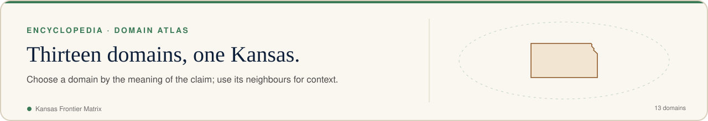
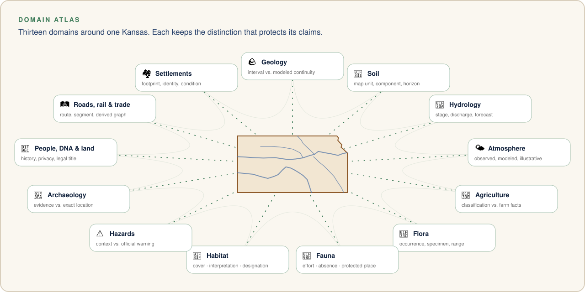

<!-- [KFM_META_BLOCK_V2]
doc_id: kfm://doc/encyclopedia/chapters/05-master-domain-atlas
title: "Master domain atlas"
type: planning-reference
version: v1.0
status: draft; repository-grounded; non-authoritative; placement-hold
owners: ["@bartytime4life via CODEOWNERS; domain review remains pending"]
created: 2026-10-08
created_note: Metadata records substantive draft authorship; the existing path predates this edition.
updated: 2026-10-08
policy_label: public; planning-reference
owning_root: docs/
responsibility: "Explain master domain atlas and route readers to the owning KFM sources."
truth_posture: PROPOSED guidance; repository-grounded draft at ebcc4988a08a3b96d10ee65ae9b4b09a37af5ebe; not ADR acceptance, source admission, release or publication.
related:
  - docs/encyclopedia/INDEX.md
  - docs/KFM-encyclopedia.md
[/KFM_META_BLOCK_V2] -->

<!-- kfm-showcase:start -->

  <a href="../../../README.md#see-it-in-action"><picture><source media="(prefers-color-scheme: dark)" srcset="../../brand/readme/kfm-banner-domain-atlas-dark.svg" /></picture></a>

<!-- kfm-showcase:end -->

# Master domain atlas

<!-- kfm-showcase:start -->

  
  
  
  

<!-- kfm-showcase:end -->

Evidence snapshot: `main@ebcc4988a08a3b96d10ee65ae9b4b09a37af5ebe`. Draft reference; formal lane acceptance remains pending.

Choose a domain by the meaning of the claim, then use neighboring domains for context. The [domain index](../../domains/README.md) is the detailed navigation authority. This atlas summarizes questions and boundary checks; it does not certify implementation maturity.

<!-- kfm-showcase:start -->

  <picture><source media="(prefers-color-scheme: dark)" srcset="../../brand/readme/kfm-domain-constellation-dark.svg" /></picture>

Illustration, not a data product — this page's text is authoritative. See <a href="../../brand/readme/README.md">README artwork</a>.
<!-- kfm-showcase:end -->

| Domain | Typical question | Preserve this distinction |
|---|---|---|
| [Geology](../../domains/geology/README.md) | What material or structure is recorded below ground? | Logged interval, interpretation and modeled continuity |
| [Soil](../../domains/soil/README.md) | What properties are associated with a horizon or map unit? | Map unit, component, horizon, station and grid support |
| [Hydrology](../../domains/hydrology/README.md) | How do water observations change through time? | Stage, discharge, groundwater, network and forecast |
| [Atmosphere](../../domains/atmosphere/README.md) | Which weather or air context applies? | Observed, modeled, forecast and illustrative motion |
| [Agriculture](../../domains/agriculture/README.md) | How does crop or land-use context vary? | Classification, reported statistics and farm-level facts |
| [Flora](../../domains/flora/README.md) | Which plant record or taxonomy is being used? | Occurrence, specimen, range and inferred suitability |
| [Fauna](../../domains/fauna/README.md) | What animal occurrence evidence exists? | Observation effort, absence and protected location |
| [Habitat](../../domains/habitat/README.md) | Which ecological units or designations intersect? | Land cover, habitat interpretation and legal designation |
| [Hazards](../../domains/hazards/README.md) | What historical or current context is available? | Context, official warning and operational advice |
| [Archaeology](../../domains/archaeology/README.md) | What public-safe cultural evidence is usable? | Evidence, interpretation and sensitive exact locations |
| [People, DNA and land](../../domains/people-dna-land/README.md) | What lineage or land relationship is documented? | Historical evidence, living-person privacy and legal title |
| [Roads, rail and trade](../../domains/roads-rail-trade/README.md) | Which corridor or network relationship is supported? | Route, segment, membership and derived graph |
| [Settlements and infrastructure](../../domains/settlements-infrastructure/README.md) | Which place or infrastructure record applies? | Footprint, facility identity, condition and service status |

## Selecting evidence across domains

Write the primary claim first. Identify the owning domain and exact source objects. List each contextual layer separately, including its time and geometry support. State the transformation or join that connects them. Keep unresolved temporal, spatial or identity mismatches visible.

For an aquifer investigation, for example, a borehole log can inform local stratigraphy while groundwater measurements describe a different observation. Neither automatically yields a continuous aquifer surface or recoverable water volume. Read the [cross-domain systems chapter](08-cross-domain-systems.md) before combining them.

[Chapter index](../INDEX.md) · [Reader guide](01-cover.md)

<!-- kfm-showcase:start -->

  

  <a href="../../../README.md"><b>↩ Project home</b></a> ·
  <a href="../../../README.md#see-it-in-action">See it in action</a> ·
  <a href="../../../README.md#take-the-tour">Tour</a> ·
  <a href="../../../README.md#things-to-try">Things to try</a> ·
  <a href="../../../README.md#faq">FAQ</a> ·
  <a href="../../brand/readme/README.md">Artwork</a>

<!-- kfm-showcase:end -->
