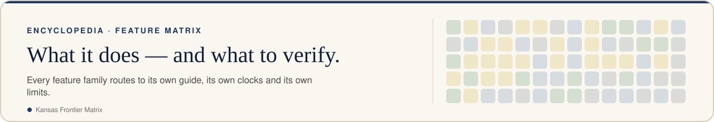

<!-- [KFM_META_BLOCK_V2]
doc_id: kfm://doc/encyclopedia/chapters/09-master-feature-matrix
title: "Master feature matrix"
type: planning-reference
version: v1.0
status: draft; repository-grounded; non-authoritative; placement-hold
owners: ["@bartytime4life via CODEOWNERS; domain review remains pending"]
created: 2026-10-08
created_note: Metadata records substantive draft authorship; the existing path predates this edition.
updated: 2026-10-08
policy_label: public; planning-reference
owning_root: docs/
responsibility: "Explain master feature matrix and route readers to the owning KFM sources."
truth_posture: PROPOSED guidance; repository-grounded draft at ebcc4988a08a3b96d10ee65ae9b4b09a37af5ebe; not ADR acceptance, source admission, release or publication.
related:
  - docs/encyclopedia/INDEX.md
  - docs/KFM-encyclopedia.md
[/KFM_META_BLOCK_V2] -->

<!-- kfm-showcase:start -->

  <a href="../../../README.md#see-it-in-action"><picture><source media="(prefers-color-scheme: dark)" srcset="../../brand/readme/kfm-banner-feature-matrix-dark.svg" /></picture></a>

<!-- kfm-showcase:end -->

# Master feature matrix

<!-- kfm-showcase:start -->

  
  
  
  

<!-- kfm-showcase:end -->

Evidence snapshot: `main@ebcc4988a08a3b96d10ee65ae9b4b09a37af5ebe`. Draft reference; formal lane acceptance remains pending.

This matrix routes readers to current source documentation. It describes the repository snapshot, not a certification that every feature is available in every deployed or local environment.

<!-- kfm-showcase:start -->

  <picture><source media="(prefers-color-scheme: dark)" srcset="../../brand/readme/kfm-capability-board-dark.svg" /></picture>

Illustration, not a data product — this page's text is authoritative. See <a href="../../brand/readme/README.md">README artwork</a>.
<!-- kfm-showcase:end -->

| Feature family | Source guide | What to verify in use |
|---|---|---|
| Map exploration and research | [Research tools](../../../apps/site/source/docs/map-research-tools.md) | Area, layer source, selected object and saved-view scope |
| Time and comparison | [History comparison](../../../apps/site/source/docs/history-comparison.md) | Advertised intervals, selected frame, missing periods |
| Water context | [Water flow paths](../../../apps/site/source/docs/water-flow-paths.md) | Point values versus network geometry and forecasts |
| Underground context | [Underground Explorer](../../../apps/site/source/docs/underground-explorer.md) | Recorded intervals, vertical reference and gaps |
| Cutaway surface | [Surface detail](../../../apps/site/source/docs/cutaway-surface-detail.md) | Optional overlay completion, imagery date and coverage |
| Earth Engine context | [Discovery](../../../apps/site/source/docs/EARTH_ENGINE_DISCOVERY.md) | Catalog metadata versus authenticated execution |
| Smoke and thermal context | [Imagery bridges](../../../apps/site/source/docs/smoke-imagery-bridges.md) | Product role and acquisition/valid times |
| Local originals and receipts | [Local consolidation](../../../apps/site/source/docs/local-pc-consolidation.md) | Store identity, protected files and capture verification |
| Display tile reuse | [Basemap cache](../../../apps/site/source/docs/basemap-cache.md) | 10 GB cap, expiry, partial coverage and service connection |

## How to read a capability claim

A feature can have source code, tests, a built artifact, a saved Site version and observed browser behavior. Record each separately. The hosted Site and monorepo mirror have separate source histories; match exact commits when claiming parity.

The 10 GB basemap cache is a disposable display service. The acquisition workflow separately describes a 500 GB decimal replaceable transfer cache and protected candidates. Those limits govern different storage responsibilities and should not be added together or treated as a source-admission budget.

## Updating this matrix

Add a row only when there is a maintained owning guide and a clear user task. Link detailed limitations instead of copying mutable implementation counts. If the owning source moves or is retired, repair the navigation and retain historical context where readers still need it.

[Chapter index](../INDEX.md) · [Reader guide](01-cover.md)

<!-- kfm-showcase:start -->

  

  <a href="../../../README.md"><b>↩ Project home</b></a> ·
  <a href="../../../README.md#see-it-in-action">See it in action</a> ·
  <a href="../../../README.md#take-the-tour">Tour</a> ·
  <a href="../../../README.md#things-to-try">Things to try</a> ·
  <a href="../../../README.md#faq">FAQ</a> ·
  <a href="../../brand/readme/README.md">Artwork</a>

<!-- kfm-showcase:end -->
