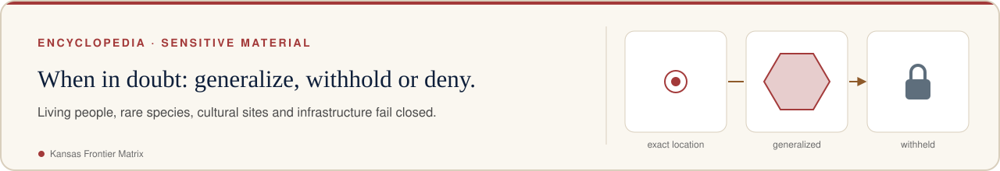

<!-- [KFM_META_BLOCK_V2]
doc_id: kfm://doc/encyclopedia/chapters/13-sensitive-deny-by-default-register
title: "Sensitive-material decision guide"
type: planning-reference
version: v1.0
status: draft; repository-grounded; non-authoritative; placement-hold
owners: ["@bartytime4life via CODEOWNERS; domain review remains pending"]
created: 2026-10-08
created_note: Metadata records substantive draft authorship; the existing path predates this edition.
updated: 2026-10-08
policy_label: public; planning-reference
owning_root: docs/
responsibility: "Explain sensitive-material decision guide and route readers to the owning KFM sources."
truth_posture: PROPOSED guidance; repository-grounded draft at ebcc4988a08a3b96d10ee65ae9b4b09a37af5ebe; not ADR acceptance, source admission, release or publication.
related:
  - docs/encyclopedia/INDEX.md
  - docs/KFM-encyclopedia.md
[/KFM_META_BLOCK_V2] -->

<!-- kfm-showcase:start -->

  <a href="../../../README.md#see-it-in-action"><picture><source media="(prefers-color-scheme: dark)" srcset="../../brand/readme/kfm-banner-sensitive-material-dark.svg" /></picture></a>

<!-- kfm-showcase:end -->

# Sensitive-material decision guide

<!-- kfm-showcase:start -->

  
  
  
  

<!-- kfm-showcase:end -->

Evidence snapshot: `main@ebcc4988a08a3b96d10ee65ae9b4b09a37af5ebe`. Draft reference; formal lane acceptance remains pending.

This chapter is a public-safe guide for recognizing sensitive work. It contains no protected records and does not replace the owning policy or an authorized review decision. The [security index](../../security/README.md) and [sensitivity policy lane](../../../policy/sensitivity/README.md) provide the detailed boundaries.

<!-- kfm-showcase:start -->

  <picture><source media="(prefers-color-scheme: dark)" srcset="../../brand/readme/kfm-sensitive-dispositions-dark.svg" /></picture>

Illustration, not a data product — this page's text is authoritative. See <a href="../../brand/readme/README.md">README artwork</a>.
<!-- kfm-showcase:end -->

| Material | Exposure to consider | Working disposition while unresolved |
|---|---|---|
| Living-person or genetic records | Identity, familial inference and unintended linkage | Keep private; establish consent and purpose before use |
| Rare-species records | Location precision and collection pressure | Preserve restriction/generalization metadata |
| Archaeological or cultural sites | Exact location and community authority | Restrict details and route to the appropriate authority |
| Infrastructure records | Condition, dependencies and harmful precision | Use only an explicitly permitted representation |
| Land and community boundaries | Mistaken ownership, title or sovereignty inference | Preserve source role; avoid legal conclusions |
| Credentials and private endpoints | Account or service access | Keep out of documentation, browser bundles and logs |

## Review procedure

Identify the data, intended audience and requested operation. Determine which fields and joins create exposure, including combinations with otherwise public datasets. Record the relevant source terms and unresolved rights or sensitivity questions. Find the actual reviewer and policy authority; a placeholder role is not an assigned person.

Select a disposition supported by that authority: restricted retention, generalized representation, omission, abstention or denial. Validate the resulting representation, including export paths and linked detail views. A generalized map is insufficient if its download exposes original coordinates.

## Documentation output

Record the decision ID or explicitly state that review is pending. Describe the public-safe reason without reproducing protected details. Include the affected version, permitted audience, expiration/review triggers and correction or revocation route where those are established.

The [sensitivity escalation runbook](../../runbooks/SENSITIVITY_ESCALATION.md) and [revocation guide](../../runbooks/revocation.md) describe the handoff. This guidance does not assert that every policy module is executable or enforced in a running service.

[Chapter index](../INDEX.md) · [Reader guide](01-cover.md)

<!-- kfm-showcase:start -->

  

  <a href="../../../README.md"><b>↩ Project home</b></a> ·
  <a href="../../../README.md#see-it-in-action">See it in action</a> ·
  <a href="../../../README.md#take-the-tour">Tour</a> ·
  <a href="../../../README.md#things-to-try">Things to try</a> ·
  <a href="../../../README.md#faq">FAQ</a> ·
  <a href="../../brand/readme/README.md">Artwork</a>

<!-- kfm-showcase:end -->
