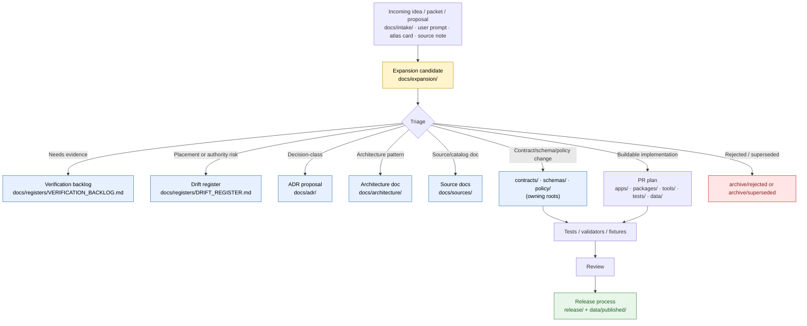

<!-- [KFM_META_BLOCK_V2]
doc_id: kfm://doc/docs-expansion-readme
title: docs/expansion/ — Expansion Lane
type: readme
version: v1
status: draft
owners: <PLACEHOLDER — Docs steward + Expansion steward + Architecture steward>
created: 2026-06-12
updated: 2026-06-12
policy_label: public
related:
  - docs/README.md
  - docs/doctrine/directory-rules.md
  - docs/doctrine/truth-posture.md
  - docs/doctrine/trust-membrane.md
  - docs/doctrine/lifecycle-law.md
  - docs/architecture/contract-schema-policy-split.md
  - docs/intake/README.md
  - docs/registers/DRIFT_REGISTER.md
  - docs/registers/VERIFICATION_BACKLOG.md
  - docs/adr/
  - control_plane/document_registry.yaml
tags: [kfm, docs, expansion, backlog, governance, doctrine, adr, review, trust-membrane]
notes:
  - "Initial README for docs/expansion/. Target path is CONFIRMED as an existing empty README on the GitHub default branch in this authoring session; broader directory contents remain NEEDS VERIFICATION."
  - "This lane is docs-companion only. It does not own contracts, schemas, policy, source registries, release decisions, proof objects, receipts, or implementation code."
  - "Expansion candidates remain PROPOSED until accepted through ADR, contract/schema/policy change, implementation PR, validation, and review as appropriate."
  - "Privacy-first Focus Mode consent patterns and other high-sensitivity UI/AI proposals belong here only as proposals; they do not bypass trust membrane, consent, evidence, policy, review, or release gates."
[/KFM_META_BLOCK_V2] -->

<a id="top"></a>

# `docs/expansion/`

> **A governed documentation lane for turning KFM ideas, proposed capabilities, and future-work packets into reviewable expansion candidates — without pretending they are implemented.**


> [!IMPORTANT]
> **Status:** draft  
> **Owner:** `TODO(owner): assign Docs steward + Expansion steward + Architecture steward`  
> **Path:** `docs/expansion/README.md`  
> **Truth posture:** CONFIRMED target file presence / PROPOSED lane contract / UNKNOWN broader implementation depth  
> **Rule:** Expansion material is **not implementation proof**, **not release authority**, and **not source truth**.

---

## Quick jump

| Start here | Workflows | Governance | Reference |
|---|---|---|---|
| [Scope](#1-scope) · [Repo fit](#2-repo-fit) · [What belongs here](#3-what-belongs-here) · [What does not belong here](#4-what-does-not-belong-here) | [Directory map](#5-directory-map-proposed) · [Expansion flow](#6-expansion-flow) · [Candidate states](#7-candidate-states) · [Definition of done](#8-definition-of-done-for-an-expansion-candidate) | [Trust membrane](#9-trust-membrane-rules) · [Sensitive proposals](#10-sensitive-or-consent-bearing-proposals) · [Review burden](#11-review-burden) · [Validation](#12-validation) | [Maintenance checklist](#13-maintenance-checklist) · [Related docs](#14-related-docs) · [Open questions](#15-open-questions) · [Evidence basis](#16-evidence-basis) |

---

## 1. Scope

`docs/expansion/` is the **human-facing expansion lane** for KFM.

It holds reviewable Markdown that helps maintainers decide whether a proposed idea should become:

- an ADR;
- a contract or schema change;
- a policy or sensitivity rule;
- a source-family or catalog documentation update;
- an implementation PR;
- a test / validator / fixture wave;
- a runbook;
- a future atlas / backlog item;
- or a rejected, deferred, or superseded proposal.

This lane is for the space between **raw idea** and **governed implementation plan**. It is intentionally slower than a scratchpad and more disciplined than a brainstorm.

> [!NOTE]
> This README states the proposed contract for the lane. It does not prove that every sibling file, workflow, validator, ADR, or control-plane record already exists. Treat unverified paths and objects as **PROPOSED** or **NEEDS VERIFICATION** until confirmed against the repository.

[↑ Back to top](#top)

---

## 2. Repo fit

`docs/expansion/` belongs under `docs/` because its primary responsibility is **explaining proposals to humans**. It does not define machine shape, object meaning, policy decisions, release authority, proof objects, or runtime behavior.

```text
repo root
└── docs/
    ├── README.md                         # human-facing control plane
    ├── doctrine/                         # operating law
    ├── architecture/                     # architectural decisions and system explanations
    ├── adr/                              # accepted / proposed / superseded decisions
    ├── intake/                           # incoming ideas, source notes, and carry-forward material
    ├── registers/                        # drift, verification, document registries
    └── expansion/                        # THIS LANE — reviewable expansion candidates
        └── README.md                     # this file
```

| Neighbor | Relationship to this lane | Status |
|---|---|---|
| [`../README.md`](../README.md) | Parent docs root; states that `docs/` is the human-facing control plane. | CONFIRMED from current GitHub fetch. |
| [`../intake/`](../intake/) | Upstream holding area for incoming notes, rough ideas, and untriaged material. | PROPOSED / NEEDS VERIFICATION. |
| [`../adr/`](../adr/) | Destination when an expansion changes authority, schema-home, lifecycle, policy, root structure, or other ADR-class decision. | PROPOSED / NEEDS VERIFICATION. |
| [`../architecture/`](../architecture/) | Destination when an expansion becomes accepted architecture guidance. | PROPOSED / NEEDS VERIFICATION. |
| [`../registers/DRIFT_REGISTER.md`](../registers/DRIFT_REGISTER.md) | Records placement, authority, naming, lifecycle, schema, policy, or release drift. | PROPOSED / NEEDS VERIFICATION. |
| [`../../control_plane/`](../../control_plane/) | Machine-readable registers. Expansion docs may point there; they do not replace it. | PROPOSED / NEEDS VERIFICATION. |
| [`../../contracts/`](../../contracts/) | Object-family meaning. Expansion docs may propose changes; they do not define them. | PROPOSED / NEEDS VERIFICATION. |
| [`../../schemas/`](../../schemas/) | Machine-readable shape. Expansion docs may propose schema waves; they do not host schemas. | PROPOSED / NEEDS VERIFICATION. |
| [`../../policy/`](../../policy/) | Allow / deny / restrict / abstain logic. Expansion docs may propose policy work; they do not enforce it. | PROPOSED / NEEDS VERIFICATION. |
| [`../../release/`](../../release/) | Release decisions. Expansion docs are never release manifests. | PROPOSED / NEEDS VERIFICATION. |

[↑ Back to top](#top)

---

## 3. What belongs here

Use this lane for **reviewable expansion candidates** that need doctrine, architecture, policy, source, UI, map, AI, or validation discussion before implementation.

Good fits:

- capability proposals that affect multiple KFM lanes;
- candidate feature cards that need review before becoming issues or PRs;
- source-led expansion notes that are too mature for `docs/intake/` but not yet authoritative;
- UI / Focus Mode / Evidence Drawer patterns that must preserve the trust membrane;
- privacy-first, consent-first, or sensitivity-aware interaction patterns;
- implementation-thin-slice proposals that need contract / schema / policy / validator mapping;
- expansion roadmaps that preserve evidence, policy, review, release, correction, and rollback;
- comparison notes for multiple proposal options;
- proposal bundles that need ADR triage;
- backlog items that require explicit verification before build work.

Each expansion document SHOULD answer:

1. What is being proposed?
2. What evidence or doctrine supports it?
3. Which KFM invariant does it touch?
4. Which root owns the future implementation?
5. Which contracts, schemas, policies, validators, fixtures, docs, or runbooks would change?
6. What risks or sensitive lanes are involved?
7. What is the smallest reversible next step?
8. What must be verified before implementation or publication?

[↑ Back to top](#top)

---

## 4. What does not belong here

> [!CAUTION]
> Expansion docs are **not** a shortcut around authority roots. A proposal may be born here, but the binding object belongs in the root that owns it.

| Do not put here | Correct home |
|---|---|
| JSON Schema, Pydantic models, or machine shapes | `schemas/contracts/v1/...` |
| Object-family contracts or semantic definitions | `contracts/` |
| Rego / policy logic or deny rules | `policy/` |
| Source descriptors, rights records, or sensitivity registry rows | `data/registry/`, `policy/sensitivity/`, `control_plane/` |
| Receipts, proofs, manifests, release records, rollback cards | `data/receipts/`, `data/proofs/`, `release/` |
| Raw, work, quarantine, processed, catalog, triplet, or published data | `data/` lifecycle roots |
| Application code or UI components | `apps/`, `packages/` |
| Validators, generators, build tools | `tools/`, `tests/`, `fixtures/` |
| Operational runbooks | `docs/runbooks/` |
| Accepted architectural decisions | `docs/adr/` |
| Loose untriaged brainstorming | `docs/intake/` |
| Published truth claims | Evidence-backed catalog / release artifacts, not proposal docs |

If an expansion page starts becoming a schema, policy, registry, release, or proof authority, open a drift entry and migrate the binding content to the proper root.

[↑ Back to top](#top)

---

## 5. Directory map (PROPOSED)

> [!WARNING]
> The structure below is a proposed operating layout. The only path confirmed in this authoring pass is the target README path itself. Create sibling files only after checking the current repository tree and the Directory Rules path-validation checklist.

```text
docs/expansion/
├── README.md                         # lane contract and navigation
├── INDEX.md                          # PROPOSED — expansion-candidate index
├── BACKLOG.md                        # PROPOSED — triaged future-work queue
├── OPEN-QUESTIONS.md                 # PROPOSED — lane-local questions, if not centralized
├── _template/
│   └── EXPANSION_CANDIDATE.md        # PROPOSED — candidate template
├── focus-mode/
│   └── consent-first-pattern.md      # PROPOSED — privacy/consent UI + AI pattern
├── map-ui/
│   └── trust-visible-layer-controls.md
├── sources/
│   └── source-family-expansion-template.md
├── validation/
│   └── finite-outcome-fixtures.md
└── archive/
    ├── superseded/
    └── rejected/
```

### 5.1 Naming convention

Prefer short, kebab-case filenames:

```text
docs/expansion/<topic>/<short-proposal-name>.md
```

Examples:

```text
docs/expansion/focus-mode/consent-first-pattern.md
docs/expansion/validation/finite-outcome-fixtures.md
docs/expansion/sources/source-role-anti-collapse-lint.md
```

> [!TIP]
> If a proposal becomes authoritative, do **not** keep editing it in place as if this lane owns the decision. Move or supersede it through the owning root, then leave a short pointer here.

[↑ Back to top](#top)

---

## 6. Expansion flow



The key distinction: `docs/expansion/` can **describe** and **route** an idea. It does not approve, publish, or implement it.

[↑ Back to top](#top)

---

## 7. Candidate states

Expansion candidates SHOULD use a finite state vocabulary so maintainers can scan the lane without reading every page.

| State | Meaning | Allowed next steps |
|---|---|---|
| `seed` | Rough idea, likely from intake or prompt material. | Add evidence basis; classify owner root. |
| `candidate` | Clear enough to review. | Triage as ADR / architecture / build / source / validation / defer. |
| `needs-evidence` | Useful idea, but evidence is too weak or missing. | Add verification backlog entry; abstain from implementation. |
| `needs-adr` | Would change authority, root placement, schema-home, lifecycle, policy, or trust boundary. | Draft ADR before implementation. |
| `planned` | Accepted as future work but not yet implemented. | Create issues, PR plan, tests, rollback plan. |
| `implemented-pending-proof` | A PR or scaffold exists, but tests / receipts / manifests / review are not yet proven. | Run validation and attach evidence. |
| `accepted` | Proposal has moved into the correct authoritative home. | Leave pointer and supersession note here. |
| `deferred` | Not wrong, but intentionally postponed. | Record reason and revisit trigger. |
| `rejected` | Not compatible with KFM doctrine, evidence, policy, or scope. | Archive with reason. |
| `superseded` | Replaced by a later proposal or ADR. | Link forward to replacement. |

[↑ Back to top](#top)

---

## 8. Definition of done for an expansion candidate

An expansion candidate is ready to leave this lane only when it has:

- [ ] a clear title and one-line purpose;
- [ ] an owner or `OWNER_TBD` with a review reason;
- [ ] an evidence basis table;
- [ ] a truth-label posture (`CONFIRMED`, `PROPOSED`, `UNKNOWN`, `NEEDS VERIFICATION`, etc.);
- [ ] a proposed owning root, checked against Directory Rules;
- [ ] affected docs, contracts, schemas, policies, tests, fixtures, data, release, and UI surfaces listed;
- [ ] source-role, rights, sensitivity, consent, privacy, and public-safety implications stated;
- [ ] validation and failure cases listed, including `DENY`, `ABSTAIN`, and `ERROR` where relevant;
- [ ] rollback or supersession path stated;
- [ ] open questions and verification blockers recorded;
- [ ] a clear destination: ADR, architecture doc, implementation PR, registry update, runbook, backlog, defer, reject, or supersede.

[↑ Back to top](#top)

---

## 9. Trust membrane rules

> [!IMPORTANT]
> Expansion proposals MUST preserve the KFM trust membrane:
>
> `RAW → WORK / QUARANTINE → PROCESSED → CATALOG / TRIPLET → PUBLISHED`
>
> Public surfaces consume governed APIs, released artifacts, EvidenceBundle resolution, policy decisions, review state, and appropriate citation behavior. Proposal language must not normalize direct reads from raw/canonical/internal stores.

Every expansion page touching public UI, maps, Focus Mode, AI, exports, or story surfaces MUST say how it prevents:

- direct public access to RAW / WORK / QUARANTINE / candidate data;
- direct model access to canonical or raw stores;
- AI answers without EvidenceBundle or citation closure;
- generated text being treated as source truth;
- policy-denied content surfacing through preview, export, screenshot, or cache;
- sensitive exact locations being rendered publicly without transform receipts and review;
- admin shortcuts becoming the normal public path.

[↑ Back to top](#top)

---

## 10. Sensitive or consent-bearing proposals

Some proposals are review-sensitive even before implementation. Examples include:

- privacy-first Focus Mode patterns;
- user consent or opt-in flows;
- living-person, genealogy, DNA, land-owner, or household data;
- archaeology, sacred places, burial locations, or culturally restricted knowledge;
- rare species, sensitive habitat, den sites, nest sites, roosts, hibernacula, or poaching-risk layers;
- critical infrastructure or public-safety exposure;
- AI summaries that could imply identity, ownership, title, legal status, health, or emergency condition.

Sensitive expansion candidates MUST include:

| Required surface | Why |
|---|---|
| Consent / authority basis | Shows who is allowed to decide and under what terms. |
| Data-minimization rule | Prevents collecting or rendering more than needed. |
| Default-deny behavior | Keeps ambiguity from becoming exposure. |
| Evidence boundary | Prevents AI or UI from inventing support. |
| Policy gate | Captures allow / restrict / deny / abstain / error. |
| Review state | Shows whether a human steward approved the proposal. |
| Withdrawal / correction path | Allows reversal, correction, and audit. |
| Public-safe rendering plan | Generalizes, redacts, delays, or suppresses sensitive details. |
| Rollback target | Names what must be undone if the proposal proves unsafe. |

### 10.1 Example expansion class — consent-first Focus Mode pattern

A consent-first Focus Mode proposal may live here while it is still a candidate. It SHOULD NOT ship until the owning architecture, UI, policy, runtime, receipt, and review surfaces exist.

Minimum proposal checklist:

- [ ] consent prompt text is human-readable and purpose-limited;
- [ ] consent state is explicit, revocable, and scoped;
- [ ] no answer uses private, sensitive, or unreleased data without policy approval;
- [ ] Focus Mode returns `ABSTAIN` or `DENY` when consent or evidence is missing;
- [ ] AI output remains interpretive and evidence-subordinate;
- [ ] `AIReceipt`, `PolicyDecision`, and `EvidenceBundle` references are planned or implemented;
- [ ] no direct model endpoint or raw-data path is exposed to the user;
- [ ] the UI clearly distinguishes preview, candidate, catalog, and published states;
- [ ] correction and rollback behavior is described before release.

[↑ Back to top](#top)

---

## 11. Review burden

| Change type | Review required |
|---|---|
| New expansion candidate | Docs steward + proposed owning-root steward. |
| Candidate touching root placement or authority | Docs steward + ADR reviewer. |
| Candidate touching contracts or schemas | Contract steward + schema steward. |
| Candidate touching policy, rights, consent, or sensitivity | Policy steward + sensitivity / rights reviewer. |
| Candidate touching public UI, Focus Mode, AI, map rendering, exports, or story surfaces | UI / AI steward + trust-membrane reviewer. |
| Candidate touching sources, catalog, provenance, receipts, proofs, or releases | Source steward + evidence / release steward. |
| Candidate moving to `accepted` | Owning-root steward confirms destination and supersession link. |
| Candidate being rejected or superseded | Docs steward records reason and rollback / forward link. |

> [!WARNING]
> Approval in this lane is editorial / routing approval only. It is not release approval, policy approval, source activation, or implementation acceptance.

[↑ Back to top](#top)

---

## 12. Validation

Validation for this lane is mostly documentation QA plus authority-boundary review.

| Check | Status | Notes |
|---|---|---|
| Markdown lint | NEEDS VERIFICATION | Confirm actual docs lint workflow. |
| Link check | NEEDS VERIFICATION | Relative links must resolve from `docs/expansion/`. |
| Meta block check | PROPOSED | Ensure every expansion candidate carries KFM Meta Block v2 or the local repo's accepted equivalent. |
| Truth-label review | PROPOSED | Claims should distinguish doctrine, proposal, implementation proof, and unknowns. |
| Directory Rules path check | PROPOSED | Any proposed destination must identify owning root. |
| ADR-class check | PROPOSED | Root changes, schema-home changes, lifecycle changes, parallel authority, or invariant changes require ADR. |
| Sensitive-lane check | PROPOSED | Consent, privacy, rights, sovereignty, ecology, archaeology, living-person, DNA, land-title, and security proposals fail closed. |
| Trust-membrane check | PROPOSED | No public path reads raw, internal, candidate, or direct model runtime outputs. |
| No-parallel-authority check | PROPOSED | Expansion docs do not become schemas, policies, registries, release manifests, or proof objects. |
| Rollback / supersession check | PROPOSED | Every accepted, rejected, or superseded candidate has a clear pointer. |

[↑ Back to top](#top)

---

## 13. Maintenance checklist

Run this review periodically or before major repo-structure changes:

- [ ] Confirm `docs/expansion/README.md` still reflects actual lane usage.
- [ ] Confirm every expansion candidate has an owner, status, evidence basis, and destination.
- [ ] Confirm accepted candidates have moved to the owning root and left a pointer here.
- [ ] Confirm rejected / superseded candidates are archived with reason.
- [ ] Confirm ADR-class candidates have ADR links or remain `needs-adr`.
- [ ] Confirm sensitive candidates have default-deny / consent / review language.
- [ ] Confirm no candidate is treated as implementation proof without current repo evidence.
- [ ] Confirm no machine-readable contract, schema, policy, registry, receipt, proof, release, or data artifact lives here.
- [ ] Confirm current links to `docs/intake/`, `docs/adr/`, `docs/architecture/`, `docs/registers/`, `contracts/`, `schemas/`, `policy/`, `tools/`, `tests/`, `data/`, and `release/`.

[↑ Back to top](#top)

---

## 14. Related docs

- [`../README.md`](../README.md) — `docs/` root orientation.
- [`../doctrine/directory-rules.md`](../doctrine/directory-rules.md) — placement authority and root responsibility rules.
- [`../doctrine/truth-posture.md`](../doctrine/truth-posture.md) — cite-or-abstain posture.
- [`../doctrine/trust-membrane.md`](../doctrine/trust-membrane.md) — public path and governed API discipline.
- [`../doctrine/lifecycle-law.md`](../doctrine/lifecycle-law.md) — lifecycle invariant.
- [`../architecture/contract-schema-policy-split.md`](../architecture/contract-schema-policy-split.md) — responsibility split across contracts, schemas, policy, tests, and fixtures.
- [`../intake/README.md`](../intake/README.md) — upstream incoming material lane. `NEEDS VERIFICATION: confirm presence and current contract.`
- [`../registers/DRIFT_REGISTER.md`](../registers/DRIFT_REGISTER.md) — drift recording.
- [`../registers/VERIFICATION_BACKLOG.md`](../registers/VERIFICATION_BACKLOG.md) — verification backlog.
- [`../adr/`](../adr/) — ADR destination for accepted decisions. `NEEDS VERIFICATION: confirm local ADR naming convention.`
- [`../../control_plane/document_registry.yaml`](../../control_plane/document_registry.yaml) — machine-readable document register. `NEEDS VERIFICATION: confirm presence and field shape.`

[↑ Back to top](#top)

---

## 15. Open questions

| ID | Question | Status | Notes |
|---|---|---|---|
| OPEN-EXP-01 | Should `docs/expansion/` be a long-term lane or should it merge into `docs/intake/` once triage matures? | PROPOSED | Requires docs-steward decision. |
| OPEN-EXP-02 | Should expansion candidates be indexed in `control_plane/document_registry.yaml` or only in a human `INDEX.md`? | NEEDS VERIFICATION | Machine register shape not inspected. |
| OPEN-EXP-03 | Is a lane-local `OPEN-QUESTIONS.md` useful, or should all expansion questions route to central registers? | PROPOSED | Avoid parallel numbering authority. |
| OPEN-EXP-04 | What is the exact template for expansion candidates? | PROPOSED | `_template/EXPANSION_CANDIDATE.md` should be authored after adjacent doc conventions are inspected. |
| OPEN-EXP-05 | Which owners should CODEOWNERS assign to this lane? | NEEDS VERIFICATION | `.github/CODEOWNERS` not inspected in this pass. |
| OPEN-EXP-06 | Should consent-first Focus Mode patterns get their own subfolder under `docs/expansion/focus-mode/` or live under `docs/architecture/` after first draft? | PROPOSED | Use `docs/expansion/` only while proposal remains non-authoritative. |

[↑ Back to top](#top)

---

## 16. Evidence basis

| Source | Status | Supports | Limits |
|---|---|---|---|
| `docs/expansion/README.md` fetched from GitHub default branch | CONFIRMED | Target file exists and was empty at fetch time. | Does not prove sibling directory contents, branch protections, workflow enforcement, or intended lane contract. |
| `docs/README.md` fetched from GitHub default branch | CONFIRMED | `docs/` is the human-facing control plane; executable code, machine schemas, policy code, data, release manifests, receipts, and proofs do not belong under docs. | Very short; does not define `docs/expansion/` specifically. |
| `docs/doctrine/directory-rules.md` v1.4 fetched from GitHub default branch | CONFIRMED doctrine | Placement responsibility, authority order, ADR requirements, lifecycle invariant, and path-validation protocol. | Some path claims remain PROPOSED / NEEDS VERIFICATION by the doctrine itself. |
| Uploaded KFM repository Markdown authoring prompt | CONFIRMED authoring instruction source | GitHub README polish, truth labels, no-overclaim rules, meta block, repo-unavailable behavior, and trust-membrane posture. | Instruction source; not repo implementation proof. |
| Prior KFM atlas / pass corpus | LINEAGE / doctrine support | Expansion vocabulary, truth labels, trust membrane, finite outcomes, source-role anti-collapse, validation, drift, and ADR backlog concepts. | Does not prove current repository implementation unless verified against repo evidence. |

[↑ Back to top](#top)

---

## 17. Rollback and supersession

This README is safe to roll back if it:

- conflicts with an accepted ADR;
- contradicts Directory Rules;
- creates a parallel authority lane;
- weakens the trust membrane;
- implies unverified implementation maturity;
- or conflicts with the eventual `docs/intake/` / `docs/adr/` / `docs/architecture/` contract.

Rollback target:

```text
docs/expansion/README.md@<previous-commit-sha>
```

Supersession rule:

1. Keep this file with `status: superseded`.
2. Add a forward link to the replacement lane or ADR.
3. Move accepted binding content to the owning root.
4. Do not leave stale proposals that look authoritative.

[↑ Back to top](#top)

---

<sub>Last updated: 2026-06-12 · Status: draft · Authority: docs-companion · Evidence posture: CONFIRMED target file presence / PROPOSED lane contract / UNKNOWN broader implementation depth</sub>

