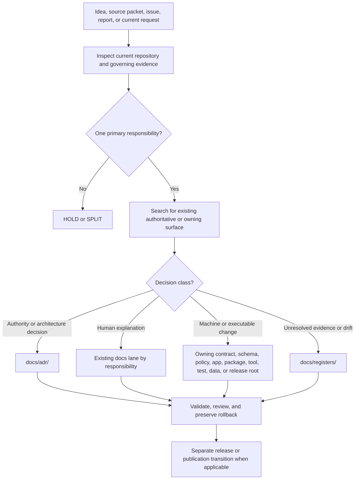

<!-- [KFM_META_BLOCK_V2]
doc_id: kfm://doc/docs-expansion-readme
title: docs/expansion/ — Provisional Expansion Coordination Surface
type: README
version: v2.0
status: hold; repository-grounded; non-authoritative; no-new-children
owners:
  - "@bartytime4life"
created: 2026-06-12
updated: 2026-08-14
policy_label: repository-facing
owning_root: docs/
responsibility: "Document the current docs/expansion path, preserve its proposal lineage, prevent it from becoming a parallel planning or authority lane, and route expansion work to the responsibility that actually owns it."
truth_posture: "CONFIRMED current path, direct inventory, history, adopted Directory Rules v2, ADR-0029, docs-root boundary, domain-local expansion surfaces, and CODEOWNERS route / HOLD canonical lane status and new-child admission / NEEDS VERIFICATION final disposition, consumers, migration, automation coverage, and independent stewardship"
evidence_snapshot: "main@f90df7054d3bfa9d88d0bf3829e4b4b894705ffe; target blob c5aafbe748176f1bf71d38a52983f8d914768cf9; docs root README blob 1f8bac189dac1d01c1185e8b4fb8e25efd11d09f; Directory Rules blob fd49a0b83e55cef52c1124281f093e263526898d; CODEOWNERS blob dd2a84aa514d8ecd9208bc347f90f9a2ed37dd61"
related:
  - docs/README.md
  - docs/doctrine/directory-rules.md
  - docs/adr/ADR-0029-adopt-directory-governance-standard-v2.md
  - docs/domains/README.md
  - docs/architecture/README.md
  - docs/atlases/README.md
  - docs/intake/README.md
  - docs/registers/README.md
  - docs/registers/DRIFT_REGISTER.md
  - docs/registers/VERIFICATION_BACKLOG.md
  - docs/archive/README.md
  - control_plane/root_registry.yaml
  - .github/CODEOWNERS
notes:
  - "The path was created on 2026-06-12 by commit cef9332a7b45c7af703e7aa01d08185557ba015b and populated later that day by commit 6671cc73aa82d07555770a4bed8d45d27e64f414."
  - "At the evidence snapshot, README.md was the only direct child of docs/expansion/."
  - "Accepted Directory Rules v2 and the current docs-root README do not admit docs/expansion/ as a canonical direct-child lane."
  - "This same-path revision keeps the README as a boundary guard, freezes new child admission, and does not move, delete, publish, promote, or authorize any expansion artifact."
[/KFM_META_BLOCK_V2] -->

<a id="top"></a>

# `docs/expansion/` — Provisional Expansion Coordination Surface

> [!IMPORTANT]
> **Placement outcome: `HOLD` for the lane; `PLACE` for this README only.**
> `docs/expansion/` exists in the repository, but the adopted Directory Rules
> v2 and the current [`docs/` root contract](../README.md) do not identify it
> as a canonical documentation lane. Until a reviewed placement decision
> selects one unique responsibility, do not add expansion packets, indexes,
> backlogs, templates, archives, or subdirectories here.

Expansion is a kind of change, not an authority class and not a storage
category. A proposal may concern a domain, architecture, source, standard,
policy, contract, schema, validator, application, release, or research task.
Its durable home follows the responsibility that owns that work.

This README records the unresolved path, preserves the June 2026 proposal
lineage, and routes future work without pretending that a polished proposal is
implemented, accepted, released, or published.

## Quick navigation

- [Current evidence and status](#current-evidence-and-status)
- [Purpose of this README](#purpose-of-this-readme)
- [Authority and non-effects](#authority-and-non-effects)
- [Current contents and write freeze](#current-contents-and-write-freeze)
- [What expansion means in KFM](#what-expansion-means-in-kfm)
- [Routing expansion work](#routing-expansion-work)
- [Current domain-local expansion surfaces](#current-domain-local-expansion-surfaces)
- [Admission and routing workflow](#admission-and-routing-workflow)
- [Finite placement outcomes](#finite-placement-outcomes)
- [Legacy proposal vocabulary](#legacy-proposal-vocabulary)
- [Trust, evidence, and sensitivity boundaries](#trust-evidence-and-sensitivity-boundaries)
- [Inputs, outputs, and consumers](#inputs-outputs-and-consumers)
- [Validation](#validation)
- [Ownership and review](#ownership-and-review)
- [Correction, migration, and rollback](#correction-migration-and-rollback)
- [Open verification backlog](#open-verification-backlog)
- [Re-review triggers](#re-review-triggers)
- [Status summary](#status-summary)

<a id="1-scope"></a>
<a id="2-repo-fit"></a>
<a id="16-evidence-basis"></a>

## Current evidence and status

The following statements are bounded to
`main@f90df7054d3bfa9d88d0bf3829e4b4b894705ffe`.

| Question | Evidence-backed result |
|---|---|
| Does the path exist? | **CONFIRMED.** `docs/expansion/` exists. |
| What are its direct contents? | **CONFIRMED.** `README.md` is the only direct child. |
| When was it introduced? | **CONFIRMED.** Commit `cef9332a7b45c7af703e7aa01d08185557ba015b` created the README on 2026-06-12; commit `6671cc73aa82d07555770a4bed8d45d27e64f414` populated it later that day. |
| Is the lane listed in the adopted canonical `docs/` tree? | **No.** The accepted Directory Rules v2 and current `docs/README.md` list other canonical children and omit `expansion/`. |
| Does path presence make it canonical? | **No.** Repository presence is implementation evidence, not placement authority. |
| Is an accepted expansion-lane ADR verified? | **No accepted decision was verified in the inspected evidence.** |
| May this README be corrected at the same path? | **`PLACE`.** A same-path boundary update preserves identity and adds no authority. |
| May new child content be added here now? | **`HOLD`.** No unique canonical responsibility has been selected. |
| Does this README activate a workflow or object family? | **No.** It is human-readable routing guidance only. |
| Does this change move or retire the directory? | **No.** Structural convergence remains a separate governed change. |

Accepted
[ADR-0029](../adr/ADR-0029-adopt-directory-governance-standard-v2.md)
adopts the exact Directory Rules v2 bytes at
[`docs/doctrine/directory-rules.md`](../doctrine/directory-rules.md). Those
rules make path selection an authority decision, prohibit parallel writable
homes, and require a finite placement outcome. The safe current outcome is to
keep this README as a boundary guard while holding all other writes.

### Evidence snapshot

| Surface | Verified identity | What it supports |
|---|---|---|
| Repository base | `main@f90df7054d3bfa9d88d0bf3829e4b4b894705ffe` | Current branch evidence for this update |
| Prior target | Blob `c5aafbe748176f1bf71d38a52983f8d914768cf9` | Exact rollback source and prior lane proposal |
| Direct inventory | `README.md` only | No implemented `INDEX.md`, `BACKLOG.md`, template tree, archive tree, or proposal sublane |
| `docs/` root contract | Blob `1f8bac189dac1d01c1185e8b4fb8e25efd11d09f` | Canonical documentation responsibility and direct-child map |
| Directory Rules v2 | Blob `fd49a0b83e55cef52c1124281f093e263526898d` | Adopted placement and README law through ADR-0029 |
| Review routing | `.github/CODEOWNERS` blob `dd2a84aa514d8ecd9208bc347f90f9a2ed37dd61` | Current named GitHub review route; not proof that review occurred |
| Domain-local search | Multiple `docs/domains/<domain>/EXPANSION_PLAN.md` files | Expansion planning already appears inside owning domain lanes |

<a id="purpose-of-this-readme"></a>

## Purpose of this README

This README has five bounded purposes:

1. **Correct stale repository claims.** The prior edition said the target had
   been empty and treated sibling contents as broadly unknown. Current evidence
   proves a populated README and an otherwise empty direct inventory.
2. **Prevent accidental lane admission.** A folder with a detailed README must
   not silently become a canonical planning, backlog, archive, or intake
   authority.
3. **Route expansion by responsibility.** Authors should update the existing
   domain, architecture, source, register, ADR, implementation, or release
   surface that actually owns the change.
4. **Preserve useful lineage.** The June 2026 proposal vocabulary remains
   explainable without preserving its proposed directory tree as current
   authority.
5. **Keep convergence reversible.** A later accepted decision may admit,
   migrate, mirror, tombstone, or retire this path without first disentangling
   ungoverned children.

This file is not an expansion index, issue tracker, implementation backlog,
source registry, document registry, release queue, or publication surface.

<a id="authority-and-non-effects"></a>

## Authority and non-effects

| Property | Current posture |
|---|---|
| Owning responsibility root | `docs/` — human-readable governance and explanation |
| Direct-child lane status | `HOLD`; present but not admitted as canonical |
| Artifact kind | Lane README and boundary guard |
| Exposure | Repository-facing |
| Mutability | Reviewed, versioned replacement |
| Retention | Durable until the path is admitted, migrated, or retired through governed change |
| Normal writer | Reviewed feature-branch change routed through current CODEOWNERS |
| Machine authority | None |
| Runtime consumer | None verified |
| Release or publication authority | None |

This README does **not**:

- amend the canonical `docs/` child map;
- accept, create, or supersede an ADR;
- classify `docs/expansion/` as canonical, compatibility, deprecated, archive,
  intake, generated, or mirror;
- create a new document type, object family, issue state, lifecycle state, or
  promotion gate;
- authorize another file, subdirectory, PDF, atlas, index, backlog, template,
  packet, or generated artifact here;
- centralize domain expansion plans that already live under domain ownership;
- migrate content from `docs/domains/`, `docs/architecture/`,
  `docs/atlases/`, `docs/intake/`, `docs/registers/`, or `docs/archive/`;
- update a machine projection in `control_plane/`;
- define contract meaning, schema shape, policy admissibility, source identity,
  evidence closure, review state, release state, publication, correction, or
  rollback;
- claim that a proposal, issue, branch, pull request, test, receipt, badge, or
  merge proves implementation or publication.

> [!CAUTION]
> “Expansion” describes intent to add or deepen capability. It does not answer
> who owns the resulting artifact. Routing by the word *expansion* would create
> a cross-cutting parallel authority and weaken correction, supersession, and
> rollback.

<a id="current-contents-and-write-freeze"></a>
<a id="5-directory-map-proposed"></a>

## Current contents and write freeze

The verified direct inventory is:

```text
docs/expansion/
└── README.md
```

### Permitted changes while the lane is on `HOLD`

- Correct or clarify this README without changing the lane's authority.
- Preserve legacy anchors and forward links needed by known consumers.
- Add a migration, tombstone, or retirement pointer only after a reviewed
  decision and verified consumer inventory require it.
- Remove obsolete wording in this README when stronger repository evidence
  supersedes it.

### Prohibited changes while the lane is on `HOLD`

Do not add:

- `INDEX.md`, `BACKLOG.md`, `OPEN-QUESTIONS.md`, candidate templates, packet
  folders, topic sublanes, archive subtrees, or other proposed June 2026
  children;
- centralized copies of domain `EXPANSION_PLAN.md`, `EXPANSION_BACKLOG.md`,
  `IDEAS.md`, or implementation backlogs;
- schemas, contracts, policy rules, source descriptors, registries, tests,
  fixtures, validators, application code, pipeline code, or configuration;
- RAW, WORK, QUARANTINE, PROCESSED, CATALOG/TRIPLETS, or PUBLISHED data;
- EvidenceBundles, receipts, proofs, manifests, promotion decisions, release
  records, correction notices, or rollback cards;
- copied source reports, generated summaries, PDFs, exports, mirrors, symlinks,
  redirects, or aliases without an accepted placement and migration decision;
- secrets, private endpoints, restricted source material, private personal
  data, protected exact locations, or harmful precision.

A change that adds new content here before placement is resolved should return
`HOLD_UNRESOLVED` or fail the applicable topology guard rather than treating
folder existence as permission.

<a id="3-what-belongs-here"></a>
<a id="4-what-does-not-belong-here"></a>

## What expansion means in KFM

Expansion is a **change classification**. It may mean:

- deeper coverage inside an existing domain;
- a new cross-domain relationship or architecture seam;
- a new source family or source-role rule;
- a contract, schema, policy, validation, or fixture extension;
- a new application, API, MapLibre, Evidence Drawer, or Focus Mode capability;
- an operational procedure or security control;
- a catalog, release, correction, or rollback enhancement;
- a research question, atlas addition, or exploratory idea.

None of those responsibilities is owned by `docs/expansion/` merely because the
work is new. The destination follows the artifact's primary responsibility and
current authority.

### Expansion is not promotion

The KFM lifecycle remains:

```text
RAW -> WORK / QUARANTINE -> PROCESSED -> CATALOG / TRIPLETS -> PUBLISHED
```

A proposal may identify a future change to that pipeline. It does not move an
artifact through the pipeline. Promotion remains a governed state transition
with evidence, policy, review, release, correction, and rollback support
appropriate to significance.

<a id="routing-expansion-work"></a>
<a id="6-expansion-flow"></a>

## Routing expansion work

Use the proposed artifact's **primary responsibility**, not its novelty, title,
producer, or literary form.

| Expansion concern | Existing responsibility to evaluate first | Boundary |
|---|---|---|
| Domain concepts, source roles, risks, feature backlog, or implementation plan | [`docs/domains/<domain>/`](../domains/) | Keep domain guidance with its owning domain; do not centralize a parallel copy here. |
| System structure or cross-domain seam | [`docs/architecture/`](../architecture/) | Architecture remains subordinate to accepted ADRs and current implementation evidence. |
| Architecture or governance decision | [`docs/adr/`](../adr/) | Decision status comes from the ADR process, not proposal wording. |
| Curated atlas, master index, category atlas, or stable synthesis | [`docs/atlases/`](../atlases/) | Check identity, lineage, existing carriers, and authority before adding another atlas. |
| Exploratory packet, unclassified proposal, or prior-pass fragment | [`docs/intake/`](../intake/) — current repository surface; placement must be rechecked | Intake is exploratory and cannot be cited as canon. If its own authority is unresolved, return `HOLD`. |
| Human-readable drift, verification, supersession, or status tracking | [`docs/registers/`](../registers/) | Registers describe state; machine projections remain under `control_plane/`. |
| Source identity, attribution, rights, limits, or human source guidance | `docs/sources/` | Human guidance does not replace machine source-registry instances. |
| Stable KFM operating or trust law | `docs/doctrine/` | Requires the doctrine review burden and cannot be promoted by an ordinary proposal. |
| Operational procedure | `docs/runbooks/` | A runbook does not establish architecture or policy authority. |
| Threat, incident, exposure, or security review | `docs/security/` | Sensitive details remain redacted or staged. |
| KFM or external standard/profile | `docs/standards/` | Separate normative KFM requirements from external reference material. |
| Frozen, superseded, deprecated, or historical documentation | `docs/archive/` | Preserve prior identity, status, and forward lineage. |
| Semantic meaning | [`contracts/`](../../contracts/README.md) | Documentation may propose a contract change but cannot define the binding meaning here. |
| Machine-valid shape | [`schemas/`](../../schemas/README.md) | Schemas remain the machine-shape authority. |
| Allow, deny, restrict, redact, generalize, or abstain behavior | [`policy/`](../../policy/README.md) | Admissibility remains policy-owned. |
| Machine governance projection or registry | [`control_plane/`](../../control_plane/README.md) | Machine projections cannot self-authorize human governance. |
| Executable app, package, connector, pipeline, validator, or configuration | `apps/`, `packages/`, `connectors/`, `pipelines/`, `tools/`, or `configs/` by execution role | Route implementation by runtime responsibility, not by proposal origin. |
| Regression proof | [`tests/`](../../tests/README.md) and `fixtures/` | Passing tests are evidence, not release or publication authority. |
| Lifecycle data, receipts, proofs, or published artifacts | [`data/`](../../data/README.md) | Preserve lifecycle and accountability families. |
| Release decision, manifest, correction notice, or rollback card | [`release/`](../../release/README.md) | Release remains separate from proposal, implementation, and merge. |

If two responsibilities both appear primary, split the artifact into linked
parts or return `HOLD`. Do not use a central expansion document to avoid making
the ownership decision.

### Routing flow


```mermaid
flowchart TD
    A["Idea, source packet, issue, report, or current request"] --> B["Inspect current repository and governing evidence"]
    B --> C{"One primary responsibility?"}
    C -->|"No"| H["HOLD or SPLIT"]
    C -->|"Yes"| D["Search for existing authoritative or owning surface"]
    D --> E{"Decision class?"}
    E -->|"Authority or architecture decision"| ADR["docs/adr/"]
    E -->|"Human explanation"| DOC["Existing docs lane by responsibility"]
    E -->|"Machine or executable change"| IMPL["Owning contract, schema, policy, app, package, tool, test, data, or release root"]
    E -->|"Unresolved evidence or drift"| REG["docs/registers/"]
    ADR --> V["Validate, review, and preserve rollback"]
    DOC --> V
    IMPL --> V
    REG --> V
    V --> R["Separate release or publication transition when applicable"]
```

The flow routes work. It does not approve or publish it.

<a id="current-domain-local-expansion-surfaces"></a>

## Current domain-local expansion surfaces

Current repository search confirms that expansion planning already appears
inside owning domain lanes. Representative examples include:

- [`docs/domains/agriculture/EXPANSION_PLAN.md`](../domains/agriculture/EXPANSION_PLAN.md)
- [`docs/domains/archaeology/EXPANSION_PLAN.md`](../domains/archaeology/EXPANSION_PLAN.md)
- [`docs/domains/atmosphere/EXPANSION_PLAN.md`](../domains/atmosphere/EXPANSION_PLAN.md)
- [`docs/domains/fauna/EXPANSION_PLAN.md`](../domains/fauna/EXPANSION_PLAN.md)
- [`docs/domains/hydrology/EXPANSION_PLAN.md`](../domains/hydrology/EXPANSION_PLAN.md)
- [`docs/domains/soil/EXPANSION_PLAN.md`](../domains/soil/EXPANSION_PLAN.md)

This list is representative, not exhaustive. It proves a repository pattern,
not the canonical status, completeness, currency, or implementation of every
listed plan. Each domain file remains bounded by its own metadata, evidence,
review state, and owning lane.

Centralizing these files under `docs/expansion/` would create duplicate
planning homes and ambiguous correction lineage. Cross-domain work should
instead reference the domain-owned plans and place only the true cross-domain
decision or architecture artifact in its owning lane.

<a id="admission-and-routing-workflow"></a>
<a id="8-definition-of-done-for-an-expansion-candidate"></a>

## Admission and routing workflow

Before creating or materially expanding any KFM artifact because of a new idea:

1. **Resolve the current request.** State the requested outcome, repository,
   base revision, terminal boundary, and non-goals.
2. **Inspect current evidence.** Read the existing target, neighboring README
   contracts, accepted ADRs, Directory Rules, implementation, tests, workflows,
   manifests, and open pull requests needed to avoid duplication.
3. **Classify the artifact.** Identify one primary responsibility, object
   family, lifecycle relationship, exposure class, and owner.
4. **Search for the existing home.** Update the current surface instead of
   creating a sibling `new`, `final`, `v2`, `complete`, or “expansion” copy.
5. **Separate evidence classes.** Distinguish current repository evidence,
   accepted doctrine, lineage material, external reference, inference,
   proposal, and unresolved verification.
6. **Choose one finite placement outcome.** Use `PLACE`, `SPLIT`, `MIGRATE`,
   `MIRROR`, `HOLD`, or `DENY`.
7. **Close direct dependencies.** Identify required contracts, schemas, policy,
   source records, fixtures, validators, tests, docs, generated outputs,
   migration notes, correction paths, and rollback targets.
8. **Select the smallest coherent change.** Keep proposal, implementation, and
   governance adoption separate when one cannot legitimately authorize the
   next in the same packet.
9. **Validate the changed area.** Check source, metadata, links, anchors,
   topology, tests, policy boundaries, sensitive exposure, generated
   relationships, and rollback.
10. **Obtain the required review.** An ordinary documentation pull request
    cannot silently admit a new canonical lane or change another authority.
11. **Keep release separate.** A merge, passing check, generated receipt, or
    rendered page does not create KFM publication.

### Minimum handoff record

A routed expansion proposal should identify, in its owning surface:

- the goal and bounded problem;
- current evidence and source limitations;
- `CONFIRMED`, `PROPOSED`, `UNKNOWN`, and `NEEDS VERIFICATION` claims;
- the owning responsibility and exact current or proposed target;
- affected contracts, schemas, policy, sources, tests, apps, data, release, and
  documentation;
- rights, sensitivity, sovereignty, privacy, and public-safety implications;
- acceptance checks and negative fixtures;
- correction, supersession, and rollback behavior;
- open decisions and the role authorized to resolve them;
- explicit non-goals, including release and publication when not authorized.

<a id="finite-placement-outcomes"></a>
<a id="7-candidate-states"></a>

## Finite placement outcomes

Use the Directory Rules placement vocabulary rather than inventing a
lane-local state machine.

| Outcome | Meaning |
|---|---|
| `PLACE` | One existing or admitted responsibility uniquely owns the artifact. |
| `SPLIT` | Different responsibilities must be separated into linked artifacts. |
| `MIGRATE` | An existing artifact must move through a reviewed compatibility and rollback plan. |
| `MIRROR` | A verified consumer requires a read-only derived or compatibility copy with one canonical writer. |
| `HOLD` | Evidence, authority, ownership, sensitivity, consumers, or migration support is insufficient. |
| `DENY` | The proposed placement or behavior would violate a hard boundary or create unsafe exposure. |

### Current outcomes for `docs/expansion/`

| Proposed action | Outcome | Reason |
|---|---|---|
| Maintain this README at the existing path | `PLACE` | Same-path boundary documentation preserves identity and adds no lane authority. |
| Add an expansion candidate, index, backlog, template, packet, sublane, or archive here | `HOLD` | The direct-child lane is not admitted and has no unique authority contract. |
| Treat this directory as the central home for domain expansion plans | `DENY` | Domain-local expansion surfaces already exist; central duplication would create parallel authority. |
| Move or delete the directory now | `HOLD` | Consumers, migration path, forward links, and accepted disposition are not closed. |
| Update `docs/README.md` to make the lane canonical in this same change | `DENY` for this packet | This README cannot authorize its own admission; canonical-lane change requires a separate reviewed governance decision. |
| Add a future tombstone or redirect | `HOLD` until decision | Requires an accepted target, verified consumers, one canonical writer, validation, and rollback. |

<a id="legacy-proposal-vocabulary"></a>

## Legacy proposal vocabulary

The prior README was a detailed **proposal** for a writable expansion lane. It
introduced local planning terms and a proposed tree. Those concepts remain
lineage, not current repository authority.

### Prior candidate-state terms

The June 2026 edition described:

`seed` · `candidate` · `needs-evidence` · `needs-adr` · `planned` ·
`implemented-pending-proof` · `accepted` · `deferred` · `rejected` ·
`superseded`

These labels may still help interpret an old document. They are **not** proven
as:

- an accepted KFM-wide vocabulary;
- a schema or contract;
- a machine-enforced workflow;
- an issue or pull-request state model;
- a lifecycle transition;
- a release or publication state.

New work should use the state vocabulary already owned by the destination
surface and the finite Directory Rules placement outcomes above. A future
shared proposal-state contract would require its own semantic owner, machine
shape, policy implications, compatibility plan, fixtures, validators, and
decision record.

### Prior proposed tree

The prior edition proposed children such as `INDEX.md`, `BACKLOG.md`,
`OPEN-QUESTIONS.md`, `_template/`, `focus-mode/`, `map-ui/`, `sources/`,
`validation/`, and `archive/`. Current direct inventory confirms that none of
those children exists under `docs/expansion/`.

This revision does not create them, reserve their names, or imply that they
belong here. Their underlying concerns route to existing responsibility lanes.

<a id="9-trust-membrane-rules"></a>
<a id="10-sensitive-or-consent-bearing-proposals"></a>

## Trust, evidence, and sensitivity boundaries

Every expansion-related change remains subordinate to the KFM trust membrane.

### Evidence posture

- `EvidenceBundle` outranks generated language.
- A report, prompt, idea card, issue, pull request, map, test, badge, summary,
  atlas, or AI answer is not root truth.
- A source-derived proposal must preserve source role, authority, date,
  rights, limitations, spatial and temporal scope, and currentness risk.
- Claims about current implementation require current code, config, schema,
  tests, workflows, artifacts, logs, or realistic governed-flow evidence.
- Missing support produces `UNKNOWN`, `NEEDS VERIFICATION`, `ABSTAIN`,
  `DENY`, `ERROR`, or `HOLD` rather than plausible completion.

### Public-path posture

Expansion work touching APIs, MapLibre, Evidence Drawer, Focus Mode, AI,
exports, stories, search, or dashboards must prevent:

- direct public reads from RAW, WORK, QUARANTINE, unpublished candidate, or
  canonical/internal stores;
- direct browser access to a model provider or local model runtime;
- generated answers without evidence resolution, policy checks, and valid
  citations;
- style-only hiding of sensitive data that remains retrievable;
- preview, cache, export, screenshot, or error surfaces leaking denied content;
- a draft proposal, implementation branch, or passing workflow being presented
  as released or published truth.

### Rights and sensitivity posture

For living-person, genomic, rare-species, archaeology, infrastructure,
land/title, sovereignty, cultural, sacred, private-location, or harmful-
precision concerns, prefer:

- quarantine;
- redaction or generalization;
- staged or role-limited access;
- delayed release;
- abstention or denial;
- explicit transform receipts and reasons;
- qualified review;
- correction, withdrawal, and rollback support.

This README does not establish a sensitivity threshold, consent model, or
review authority. Those belong to policy and qualified stewardship.

<a id="inputs-outputs-and-consumers"></a>

## Inputs, outputs, and consumers

### Inputs

A routed expansion effort may begin from:

- a current user request;
- a source or research packet;
- an existing domain plan, atlas, report, or prior-pass idea;
- a current repository gap, failing check, incident, drift finding, or
  verification backlog item;
- a standards or dependency change;
- an evidence, rights, sensitivity, correction, or rollback requirement;
- a proposed UI, map, API, AI, or operational capability.

Inputs remain evidence or task data. They do not independently authorize a
path, source activation, policy decision, implementation, release, or
publication.

### Outputs

Because this lane is frozen, durable outputs go directly to their owning
surface. Depending on the result, the output may be:

- an update to an existing domain, architecture, source, standard, runbook, or
  security document;
- an ADR proposal or accepted decision through the ADR process;
- a drift or verification register entry;
- a contract, schema, policy, fixture, validator, test, application, pipeline,
  data, or release change in the owning root;
- a small implementation pull request with explicit acceptance and rollback;
- a documented `HOLD`, `DENY`, `NO_OP`, rejection, or supersession outcome.

### Consumers

Normal consumers are maintainers, reviewers, domain and responsibility owners,
researchers, and implementation planners. No runtime, API, renderer, model,
release system, or public client is verified as a consumer of this directory.

<a id="validation"></a>
<a id="12-validation"></a>

## Validation

Documentation validation is evidence about repository quality. It is not proof
of implementation, security, policy approval, release, or publication.

### Source-level checks for this README

- one H1 and ordered heading structure;
- valid `KFM_META_BLOCK_V2` delimiters and required identity fields;
- UTF-8, final newline, no tabs, and no trailing whitespace;
- balanced fenced blocks and valid Mermaid source;
- unique explicit anchors;
- preservation of legacy inbound anchor names from the prior README;
- relative links resolved against the inspected repository;
- current path, inventory, blob, commit, and review-route claims replayed
  against the evidence snapshot;
- no new direct child under `docs/expansion/`;
- no wording that admits the lane, creates a parallel authority, or represents
  proposal as implementation.

### Repository-hosted checks to observe on the pull request

The changed area should be covered by the repository's documentation,
topology, security, and broad validation workflows, including as applicable:

- `docs-meta-block`;
- `docs-control-plane`;
- `docs-document-graph`;
- `docs-build`;
- `docs-stale-scan`;
- `link-check`;
- `accessibility`;
- `citation-validation`;
- `contract-drift`;
- `repository-topology` through the aggregate validator workflows;
- `security` and `codeql`.

A red repository-wide check must be classified against the exact base before
attributing causality to this one-file documentation change. Do not weaken a
validator, ratchet, receipt check, or policy gate to make this README green.

### Negative checks

Hold or reject a change that would:

- add a second writable doctrine, contract, schema, policy, source, registry,
  release, receipt, proof, backlog, or planning authority;
- claim implementation, deployment, review, release, or publication without
  evidence;
- expose secrets, private data, restricted content, or unsafe precision;
- use an unaccepted governance proposal to authorize dependent structural work;
- break stable anchors or known consumers without compatibility handling;
- hand-edit a generated or mirrored target rather than its canonical source;
- create new children here merely because this directory already exists.

<a id="ownership-and-review"></a>
<a id="11-review-burden"></a>

## Ownership and review

[`CODEOWNERS`](../../.github/CODEOWNERS) routes the repository default and
documentation changes to `@bartytime4life`. That is the only verified named
GitHub owner in the inspected evidence.

CODEOWNERS is review routing. It is not a stewardship assignment,
independent approval, policy decision, release approval, or proof that review
occurred.

### Current review posture

| Change | Minimum posture |
|---|---|
| Correct this README without changing lane authority | Normal reviewed documentation pull request |
| Add a child to this directory | `HOLD` until lane admission and ownership are decided |
| Admit, classify, migrate, mirror, tombstone, or retire the lane | Governance and architecture review appropriate to the Directory Rules trigger, plus consumer and rollback evidence |
| Route a domain expansion plan | Domain owner and affected responsibility owners review the actual destination change |
| Change contract, schema, policy, source, evidence, release, or public behavior | Review by the owning root and any sensitivity, rights, security, or release roles required by significance |
| Publish or expose an artifact | Separate governed release transition; never implied by docs review |

Independent documentation stewardship and separation of duties remain
`NEEDS VERIFICATION`.

<a id="correction-migration-and-rollback"></a>
<a id="17-rollback-and-supersession"></a>

## Correction, migration, and rollback

### Correcting this README

Use a reviewed feature-branch change that:

1. pins the current target and governing evidence;
2. changes only the smallest necessary documentation closure;
3. preserves stable identity and anchors;
4. validates source and repository links;
5. reports inherited failures separately;
6. leaves release and publication untouched.

### Admitting the lane later

A proposal to make `docs/expansion/` writable must define at least:

- the unique responsibility that cannot be served by an existing canonical
  lane;
- its root class and adoption authority;
- permitted artifact types, writers, consumers, exposure, mutability, and
  retention;
- naming, metadata, identity, versioning, correction, supersession, and archive
  rules;
- the relationship to domain-local expansion plans, `docs/intake/`,
  `docs/atlases/`, `docs/registers/`, and implementation backlogs;
- machine projections, validation, topology rules, and negative fixtures;
- source, rights, sensitivity, and public-path boundaries;
- migration and rollback for existing references;
- updates to `docs/README.md`, `control_plane/root_registry.yaml`, and other
  accepted projections required by the decision;
- a separate release or publication path for any downstream artifact.

This README cannot satisfy those requirements by declaring itself canonical.

### Migrating or retiring the lane later

Before move, tombstone, or deletion:

1. identify the exact source and target identities;
2. inventory repository and external consumers where possible;
3. select one canonical writer and any bounded read-only compatibility window;
4. move or split content by responsibility;
5. repair links, fragments, indexes, registries, and generated projections;
6. validate topology and documentation graph closure;
7. record correction and supersession lineage;
8. define rollback to the prior tree;
9. prove zero remaining writers before physical deletion.

### Current rollback target

Restore the prior blob:

```text
c5aafbe748176f1bf71d38a52983f8d914768cf9
```

or revert the documentation commit that updates this file. No runtime, data,
release, or public state is changed by this README revision.

<a id="open-verification-backlog"></a>
<a id="15-open-questions"></a>

## Open verification backlog

| ID | Question | Status | Required evidence or decision |
|---|---|---|---|
| `EXP-01` | Should this path be admitted, migrated into an existing lane, converted to a tombstone, or retired? | `HOLD` | Accepted placement decision with one responsibility, consumers, validation, migration, and rollback |
| `EXP-02` | What is the durable relationship between this path and the current `docs/intake/` repository surface? | `NEEDS VERIFICATION` | Reconcile both lanes against Directory Rules and current consumers without letting either self-authorize |
| `EXP-03` | Are domain `EXPANSION_PLAN.md`, `EXPANSION_BACKLOG.md`, `IDEAS.md`, and implementation-backlog conventions consistent enough to document as a shared pattern? | `NEEDS VERIFICATION` | Commit-pinned domain inventory, metadata comparison, owner review, and a decision on shared versus domain-local vocabulary |
| `EXP-04` | Does KFM need a cross-domain human expansion index, and which admitted lane would own it? | `PROPOSED` | Search current atlases, registers, domain indexes, issues, and control-plane projections before creating another index |
| `EXP-05` | Are there repository or external consumers of the current path or its legacy anchors? | `NEEDS VERIFICATION` | Inbound-link, fragment, generated-output, external-consumer, and documentation-graph review |
| `EXP-06` | Which independent documentation or architecture steward can review a future authority change? | `NEEDS VERIFICATION` | Verified identity, repository permission, and approved responsibility assignment |
| `EXP-07` | Do current topology and documentation checks prevent new unadmitted children under this path? | `NEEDS VERIFICATION` | Exact-head hosted workflow evidence and focused negative fixture |
| `EXP-08` | Should the prior candidate-state labels be retained anywhere as a shared proposal vocabulary? | `HOLD` | Semantic owner, contract/schema decision, compatibility study, fixtures, and evidence that a shared vocabulary is needed |

Unresolved items belong in
[`docs/registers/VERIFICATION_BACKLOG.md`](../registers/VERIFICATION_BACKLOG.md)
or
[`docs/registers/DRIFT_REGISTER.md`](../registers/DRIFT_REGISTER.md)
when the owning register accepts them. This README does not create a competing
lane-local register.

<a id="related-docs"></a>
<a id="14-related-docs"></a>

## Governing and adjacent surfaces

| Surface | Relationship |
|---|---|
| [`docs/README.md`](../README.md) | Canonical human-readable documentation root contract and direct-child map |
| [`docs/doctrine/directory-rules.md`](../doctrine/directory-rules.md) | Exact Directory Rules v2 bytes adopted by ADR-0029 |
| [`docs/adr/ADR-0029-adopt-directory-governance-standard-v2.md`](../adr/ADR-0029-adopt-directory-governance-standard-v2.md) | Accepted decision that makes the Directory Rules v2 bytes effective |
| [`docs/domains/`](../domains/) | Owning human lane for domain-specific expansion guidance |
| [`docs/architecture/`](../architecture/) | System and cross-domain architecture explanations |
| [`docs/atlases/`](../atlases/) | Curated atlas and master-index lane |
| [`docs/intake/`](../intake/) | Current exploratory intake surface; its own placement and maturity must be read from current evidence |
| [`docs/registers/`](../registers/) | Human-readable drift, verification, supersession, and status tracking |
| [`docs/archive/`](../archive/) | Frozen documentation lineage and retired material |
| [`control_plane/root_registry.yaml`](../../control_plane/root_registry.yaml) | Machine projection of root governance; cannot self-authorize a lane |
| [`.github/CODEOWNERS`](../../.github/CODEOWNERS) | Current GitHub review-routing evidence |
| [`contracts/`](../../contracts/README.md) | Semantic meaning authority |
| [`schemas/`](../../schemas/README.md) | Machine-shape authority |
| [`policy/`](../../policy/README.md) | Admissibility authority |
| [`tests/`](../../tests/README.md) | Verification and regression evidence |
| [`data/`](../../data/README.md) | Lifecycle and accountability data families |
| [`release/`](../../release/README.md) | Release, correction, and rollback decision families |

<a id="re-review-triggers"></a>
<a id="13-maintenance-checklist"></a>

## Re-review triggers

Re-review this boundary when:

- an accepted ADR admits, migrates, mirrors, tombstones, or retires the lane;
- `docs/README.md` or Directory Rules changes the canonical direct-child map;
- a new direct child appears under `docs/expansion/`;
- domain-local expansion documents are consolidated or given a shared contract;
- the `docs/intake/`, `docs/atlases/`, or `docs/registers/` relationship changes;
- a machine registry or topology validator begins treating the lane as admitted;
- CODEOWNERS or stewardship changes;
- an inbound or external consumer is discovered;
- a correction, security finding, sensitive exposure, or broken migration
  affects this path;
- a compatibility deadline or physical-deletion proposal is introduced.

### Maintenance checklist

- [ ] Reconfirm the exact base commit and target blob.
- [ ] Reconfirm the direct inventory.
- [ ] Reconfirm the adopted Directory Rules and accepted ADR status.
- [ ] Reconfirm the `docs/` canonical child map.
- [ ] Reconfirm CODEOWNERS and independent-review posture.
- [ ] Search for new inbound links and legacy-fragment consumers.
- [ ] Search for new domain-local or cross-domain expansion surfaces.
- [ ] Confirm no new child has treated path presence as permission.
- [ ] Confirm all implementation and release claims remain evidence-bounded.
- [ ] Confirm rollback still restores a known prior blob.

<a id="status-summary"></a>

## Status summary

**CONFIRMED**

- `docs/expansion/` exists on current `main`.
- `README.md` is its only direct child.
- The path and populated README date to 2026-06-12.
- ADR-0029 accepts the exact Directory Rules v2 bytes.
- The current canonical `docs/` child map omits `expansion/`.
- Domain-local expansion plans exist under multiple `docs/domains/<domain>/`
  lanes.
- `@bartytime4life` is the current verified GitHub review route.

**HOLD**

- canonical-lane admission;
- new child content;
- centralized expansion indexes or backlogs;
- migration, mirror, tombstone, or deletion;
- a shared proposal-state vocabulary;
- any dependent structural change.

**NEEDS VERIFICATION**

- final lane disposition;
- complete consumer inventory;
- relationship to `docs/intake/`, atlases, registers, and domain plans;
- machine-projection and topology coverage;
- independent stewardship and separation of duties.

No contract, schema, policy, source, evidence, implementation, release,
deployment, publication, correction, or runtime state changes through this
README.

[Back to top](#top)
