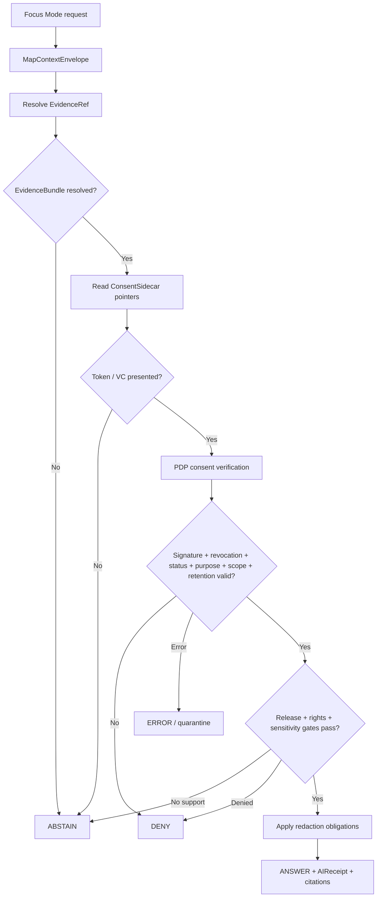

<!-- [KFM_META_BLOCK_V2]
doc_id: kfm://doc/focus-mode/consent-pattern
title: Focus Mode Consent Pattern
type: standard
version: v0.1
status: draft
owners: OWNER_TBD — Focus Mode steward · Consent/privacy steward · Policy steward · Security steward · Evidence steward · Release steward · Docs steward
created: 2026-06-21
updated: 2026-06-21
policy_label: public; focus-mode; consent; privacy; fail-closed; governed-ai
tags: [kfm, focus-mode, consent, privacy, policy-as-code, evidence, release, rollback, governed-ai]
related:
  - ./README.md
  - ../standards/CONSENT_TOKENS.md
  - ../doctrine/directory-rules.md
  - ../domains/people-dna-land/CONSENT_MODEL.md
  - ../domains/people-dna-land/CONSENT_REGISTER.md
  - ../architecture/sensitivity.md
notes:
  - "This file adds a compact privacy-first consent pattern for Focus Mode surfaces."
  - "Current repo evidence uses docs/focus-mode/ paths while directory-rules.md describes docs/focus-modes/ as the doctrine path; this file follows the existing live path and records the drift as NEEDS VERIFICATION."
  - "Consent is a necessary gate, not a sufficient publication decision."
  - "This pattern is documentation only; policy bundles, schemas, fixtures, validators, and runtime behavior remain NEEDS VERIFICATION unless separately proven."
[/KFM_META_BLOCK_V2] -->

<a id="top"></a>

# Focus Mode Consent Pattern

> A compact, privacy-first consent pattern for KFM Focus Mode surfaces. It shows how a Focus Mode should request, verify, carry, redact, answer, and revoke consent-bound evidence without bending the KFM trust membrane.

<p>
  
  
  
  
  
  
</p>

**Path:** `docs/focus-mode/CONSENT_PATTERN.md`  
**Status:** `draft` / pattern note  
**Owners:** `OWNER_TBD`  
**Audience:** Focus Mode authors, UI implementers, policy stewards, source stewards, evidence stewards, and release reviewers.

> [!IMPORTANT]
> Consent does **not** publish data. A valid consent token is a necessary gate, never a sufficient one. A Focus Mode must still pass evidence validation, source-role review, sensitivity review, rights review, policy review, release promotion, correction lineage, and rollback readiness.

## Quick jumps

[Scope](#scope) · [What this pattern is](#what-this-pattern-is) · [Why it is safe](#why-it-is-safe) · [Implementation pattern](#implementation-pattern) · [Runtime flow](#runtime-flow) · [Finite outcomes](#finite-outcomes) · [UI copy](#ui-copy) · [Validation](#validation) · [Exclusions](#exclusions) · [Evidence basis](#evidence-basis) · [Rollback](#rollback)

---

## Scope

This document applies when a Focus Mode answer, map layer, Evidence Drawer panel, overlay, story card, export, or AI response touches evidence that is consent-bound, living-person-sensitive, privacy-scoped, embargoed, revocable, or otherwise policy-restricted.

It is a **documentation pattern**, not the policy bundle, schema, consent token, consent receipt, EvidenceBundle, ReleaseManifest, or UI implementation.

---

## What this pattern is

The pattern is simple:

```text
Focus Mode request
  -> resolve EvidenceRef to EvidenceBundle
  -> inspect ConsentSidecar pointers
  -> verify ConsentToken / ConsentVC at the PDP
  -> apply redaction profile and k-anonymity obligations
  -> emit finite outcome with receipt
  -> render only released, consent-allowed, policy-safe content
```

A Focus Mode should never ask, “Did the user consent?” as a loose text question. It should ask:

> “Can this specific surface, for this specific purpose, at this time, render this specific evidence-backed object under the active consent token and release policy?”

---

## Why it is safe

This pattern preserves KFM doctrine because it keeps every authority separate:

| Layer | Job | Must not become |
|---|---|---|
| `ConsentReceipt` | Durable record of a consent event | A render-time bearer credential. |
| `ConsentToken` / `ConsentVC` | Short-lived active grant | A publication decision. |
| `ConsentSidecar` | Pointer-only metadata beside evidence/release artifacts | PII embedded in public tiles. |
| `EvidenceBundle` | Evidence support for claims | Generated language or UI state. |
| `PDP` | Policy decision point | A bypassable UI helper. |
| `ReleaseManifest` | Publication authority | A consent token. |
| `RuntimeResponseEnvelope` / `AIReceipt` | Auditable outcome record | The evidence itself. |

> [!CAUTION]
> The dangerous shortcut is: “token present → show the data.” KFM must not do that. The correct posture is: token verified + purpose/scope/retention/revocation/redaction satisfied + EvidenceBundle resolved + release state valid + sensitivity gates passed → finite outcome.

---

## Implementation pattern

### 1. Declare consent requirements per Focus Mode surface

Each Focus Mode surface should declare what it needs before it can render:

| Surface | Required declaration |
|---|---|
| Map layer | `required_scope`, `render_purpose`, `redaction_profile`, `sensitivity_class`, `release_ref`. |
| Evidence Drawer panel | `required_scope`, `evidence_refs`, `claim_scope`, `citation_policy`, `redaction_profile`. |
| AI answer | `required_scope`, `prompt_purpose`, `EvidenceBundle refs`, `finite_outcome`, `receipt_required`. |
| Export/story card | `required_scope`, `release_ref`, `consent_sidecar_ref`, `retention`, `rollback_ref`. |

### 2. Carry consent as pointers, not payloads

Public artifacts must not embed bearer tokens, stable PII, raw consent receipts, or directly identifying consent history.

Use pointer-only fields such as:

```yaml
consent_sidecar:
  consent_scope: ["focus_mode.render", "evidence.view"]
  purpose: ["mapping", "review"]
  retention: "P30D"
  no_reidentification: true
  redaction_profile: "profile:living-person:k10-cell500m"
  consent_receipt_pointer: "kfm://consent-receipt/NEEDS-VERIFICATION"
  status_pointer: "kfm://consent-status/NEEDS-VERIFICATION"
```

> [!NOTE]
> The example is illustrative. The canonical field names and schema home remain `NEEDS VERIFICATION` until the consent token and sidecar schemas are expanded and accepted.

### 3. Verify at the PDP before every render

The Focus Mode UI, AI panel, and map layer should never decide consent locally. They should call the governed policy path and require a finite outcome.

```text
if EvidenceRef does not resolve:
  ABSTAIN
else if consent token is missing for consent-bound evidence:
  ABSTAIN
else if token is expired, revoked, wrong audience, wrong purpose, or introspection unreachable:
  DENY
else if consent sidecar/schema is malformed:
  ERROR
else if release/sensitivity/rights gates are incomplete:
  ABSTAIN or DENY according to policy
else:
  ANSWER with redaction obligations applied
```

### 4. Apply redaction before render

Allowed content still needs obligations applied:

- generalize precise living-person locations;
- enforce k-anonymity thresholds;
- suppress unsupported household/person-level inference;
- hide raw identifiers and stable pseudonym joins;
- show redaction/consent disclosure in Evidence Drawer;
- attach `AIReceipt` / runtime receipt with policy decision and reason code.

### 5. Re-check revocation and retention

Focus Mode must re-check consent at render time, not only at ingest time. Revocation, retention expiry, embargo, and status-list changes must affect map layers, AI answers, exports, and cached artifacts.

---

## Runtime flow



---

## Finite outcomes

| Outcome | Focus Mode behavior |
|---|---|
| `ANSWER` | Render only released, consent-allowed, redacted, cited content; emit receipt. |
| `ABSTAIN` | Explain that evidence or consent support is insufficient; do not infer or downgrade redaction silently. |
| `DENY` | Block the render/action because policy, revocation, purpose, scope, rights, sensitivity, or retention failed. |
| `ERROR` | Quarantine or fail closed when token parsing, sidecar validation, PDP call, or schema validation fails. |

---

## UI copy

Use plain language that avoids leaking details.

| Case | Suggested copy |
|---|---|
| Missing consent | “This Focus Mode cannot show that evidence because the required consent proof is missing.” |
| Revoked consent | “This content is no longer available under the active consent policy.” |
| Purpose mismatch | “This request is outside the approved consent purpose for this evidence.” |
| Redacted but allowed | “Some details are generalized or hidden because this evidence is privacy-protected.” |
| Evidence unresolved | “KFM cannot answer from this item because the evidence bundle did not resolve.” |
| Release missing | “This item has not reached a governed release state for public display.” |

Avoid saying “the person refused,” “the subject revoked,” or exposing identifying consent-state details in public UI copy.

---

## Validation

Before this pattern is treated as implemented, verify:

- [ ] `ConsentToken` / `ConsentSidecar` schemas exist and are non-scaffold.
- [ ] Policy bundle exists for consent render decisions.
- [ ] Focus Mode payload includes required consent/sensitivity/release fields.
- [ ] Every consent-bound EvidenceRef resolves to an EvidenceBundle before render.
- [ ] PDP checks signature, audience, purpose, scope, retention, revocation, and status list.
- [ ] Introspection unreachable fails closed.
- [ ] Redaction profile and k-anonymity obligations are applied before render.
- [ ] AI answers emit receipts and finite outcomes.
- [ ] No public artifact embeds PII, bearer tokens, raw receipts, or stable consent identifiers.
- [ ] Revocation invalidates cached tiles, exports, vector indexes, stories, and AI answer cache where applicable.
- [ ] Negative fixtures cover missing token, revoked token, expired token, audience mismatch, purpose mismatch, retention elapsed, malformed sidecar, unresolved EvidenceBundle, missing release, and invalid redaction profile.

---

## Exclusions

| Does not belong here | Correct home |
|---|---|
| Consent token machine shape | `schemas/contracts/v1/runtime/consent_token.schema.json` or accepted successor. |
| Consent object meaning | `contracts/runtime/consent_token.md` or accepted successor. |
| Consent policy bundle | `policy/consent/` or accepted successor. |
| Focus Mode payload schema | `schemas/contracts/v1/focus_mode/`. |
| Focus Mode object contract | `contracts/focus_mode/`. |
| Evidence proof | `data/proofs/` or accepted EvidenceBundle home. |
| Release approval | `release/`. |
| UI implementation | `apps/explorer-web/src/focus-modes/`. |
| Private source data | `data/raw/`, `data/work/`, or `data/quarantine/` lifecycle roots. |

---

## Evidence basis

| Source | Status | Supports | Limits |
|---|---|---|---|
| `docs/standards/CONSENT_TOKENS.md` | `CONFIRMED repo evidence` | Consent is short-lived, signed, fail-closed, checked at render/publication boundaries; consent is necessary but not sufficient for publication. | Runtime implementation, policy bundle, schemas, and validators still need verification. |
| `docs/focus-mode/README.md` | `CONFIRMED repo evidence / CONFLICTED naming` | Focus Mode is a governed proof slice and public UI must not read raw/work/quarantine directly. | File content refers to `docs/focus-modes/` while live path evidence uses `docs/focus-mode/`. |
| `docs/doctrine/directory-rules.md` | `CONFIRMED doctrine` | Focus Mode is multi-root and must not become a root folder; public clients use governed paths. | Path naming drift between `docs/focus-mode` and `docs/focus-modes` remains unresolved. |
| User-provided authoring prompt v2 | `CONFIRMED user-supplied guidance` | Requires evidence-grounded, implementation-honest, visually polished Markdown with rollback and verification posture. | Prompt guidance, not repo implementation proof. |

---

## Rollback

Rollback if this file is used to claim implemented consent enforcement, PDP availability, schema completeness, fixture coverage, UI integration, cache invalidation, release maturity, or policy parity without direct repo evidence.

Rollback target: delete `docs/focus-mode/CONSENT_PATTERN.md` or replace it with a pointer to the accepted Focus Mode consent standard after ADR/path reconciliation.

<p align="right"><a href="#top">Back to top</a></p>
