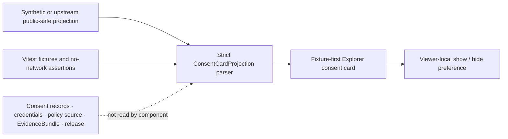
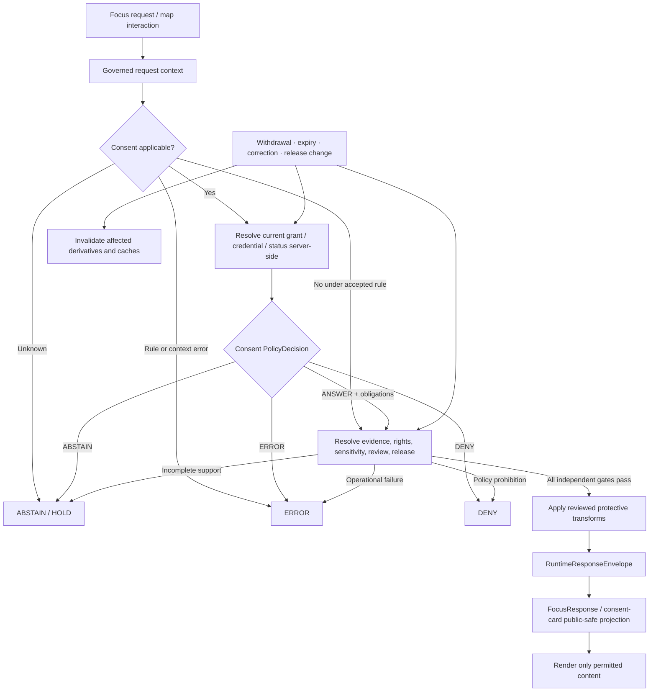

<!-- [KFM_META_BLOCK_V2]
doc_id: kfm://doc/focus-mode/consent-pattern
title: Focus Mode Consent Boundary and Projection Pattern
type: standard
version: v1.0
status: draft; repository-grounded; documentation-only; mixed-maturity; no-consent-authority; no-runtime-enforcement; non-release; non-publication
owner: "@bartytime4life via CODEOWNERS; consent, privacy, identity, security, policy, domain, accessibility, release, correction, and independent-review authority NEEDS VERIFICATION"
created: 2026-06-21
updated: 2026-08-22
policy_label: public; documentation; focus-mode; consent; privacy; identity; policy; projection; fail-closed; cite-or-abstain; no-credentials; no-release; no-publication
owning_root: docs/
responsibility: >-
  Explain the Focus Mode-specific consent boundary, reconcile the v0.1
  token-and-sidecar flow with current repository evidence, distinguish the
  fixture-first Explorer consent-card projection from subject consent and
  operational authorization, preserve legacy anchors, and expose the contract,
  schema, policy, runtime, withdrawal, redaction, review, release, correction,
  and rollback work still required before production use.
authority: >-
  Human-readable reconciliation, integration guidance, review criteria, and
  maintenance documentation only. Consent events, grants, credentials, status,
  policy decisions, evidence, release records, runtime envelopes, application
  behavior, correction, withdrawal, and publication remain with their owning
  roots and accountable authorities.
current_path: docs/focus-mode/CONSENT_PATTERN.md
canonical_relationship: >-
  Same-path documentation correction inside the repository-present singular
  Focus compatibility lane. Accepted Directory Rules v2 supports PLACE for
  this docs-root edit but does not settle the mixed Focus tree's final split,
  migration, aliases, consumer closure, or retirement.
truth_posture: >-
  CONFIRMED the current path and prior v0.1 bytes, the repository-grounded
  parent Focus boundary, accepted ADR-0029 and adopted Directory Rules v2, the
  current consent-token standard, the documentation-only parent consent-policy
  lane, the empty permissive ConsentGrant and ConsentReceipt schema scaffolds,
  the consent schema-family compatibility placeholder, the current
  PolicyDecision and RuntimeResponseEnvelope finite outcomes, the conditional
  AIReceipt role, the bounded synthetic People-DNA-Land consent and revocation
  profiles, and the strict fixture-first Explorer consent-card projection and
  tests / LINEAGE the v0.1 ConsentToken, ConsentVC, ConsentSidecar, PDP,
  k-anonymity, exact redaction-profile, per-render introspection, cache
  invalidation, and receipt-emission flow / PROPOSED applicability evaluation,
  accepted consent object families, issuer and verifier trust, server-side
  status resolution, policy composition, governed API projection, operational
  protective transforms, withdrawal propagation, and end-to-end Focus
  integration / CONFLICTED overlapping ConsentToken, ConsentGrant,
  ConsentReceipt, ConsentSidecar, ConsentDecision, domain-assessment, and UI
  projection vocabularies without one accepted shared machine family /
  UNKNOWN production consent records, qualified consent authority, identity
  proof, live status or revocation service, parent evaluator binding,
  operational cleanup, public release integration, deployment, and public
  parity / NEEDS VERIFICATION every implementation or legal-use claim beyond
  the inspected repository shapes and bounded fixture behavior.
evidence_snapshot:
  repository: bartytime4life/Kansas-Frontier-Matrix
  base_ref: main
  inspected_commit: d365545e1035907160a14c6068f0612bea195b11
  target_prior_blob: 4fdc70ca51ece5b1f9821bf3d04abf62c65d24e5
  focus_readme_blob: 8600c0ac09452b4b03e5f60b94f1eb27c072b5db
  consent_tokens_standard_blob: 3b8ce6326f7d2a846116e00144cb065b82d43ffc
  consent_policy_readme_blob: 7dbae5ea1434ecf896176a891dadefea76913999
  consent_grant_schema_blob: 90309ad224271ded87c4f66be68be1e67bcc199f
  consent_receipt_schema_blob: a178b759fa19922f8d6c6adf1ec13402f9784e75
  consent_schema_index_blob: f3df7888166287e4a86c3696204b64799b995eab
  policy_decision_contract_blob: ebfe97f98263e6309db6d2772cb2c5e548819650
  runtime_response_contract_blob: 9dfc286984b5b52b383753fe6215a2b31df8c876
  ai_receipt_contract_blob: 1e028525569b6032cd573e71d98df6b961fa70db
  focus_response_contract_blob: 5fe3e2763d2b3735e94a53a416114d9b37e7be64
  consent_overlay_contract_blob: d548e5eb93efe0b48accfa497de90dd924f753eb
  revocation_assessment_contract_blob: dbf1fdff6585f3db4213c17d8f18bfc81ecec04d
  consent_card_projection_blob: 8f919bb124f21b432ccbceb0c4efc17ddd8b6ab1
  consent_card_readme_blob: e8e285c6f63f492b13d8cfa0a0eee2299613938d
  consent_card_test_blob: 9b48541a1a16188e82596286774dfce1b4cdf08f
  redaction_profiles_standard_blob: 5edf72e4f291cc444614f617e341061bfc9852dc
  directory_rules_blob: fd49a0b83e55cef52c1124281f093e263526898d
  codeowners_blob: dd2a84aa514d8ecd9208bc347f90f9a2ed37dd61
inspection_boundary: >-
  Current-session GitHub reads covered the complete target, parent Focus
  documentation boundary, consent-token and redaction standards, accepted
  directory governance, parent consent policy, current generic consent schema
  surfaces, PolicyDecision, RuntimeResponseEnvelope, AIReceipt, FocusResponse,
  bounded People-DNA-Land consent profiles, the Explorer consent-card adapter,
  feature README, tests, CODEOWNERS, open pull requests, and matching task
  branches. No mounted clone, local repository command, real subject or
  credential, issuer, verifier, status service, policy evaluator, governed API
  request, evidence resolution, release record, withdrawal execution,
  correction cascade, cache invalidation, deployment, or public endpoint was
  exercised.
related:
  - ./README.md
  - ../standards/CONSENT_TOKENS.md
  - ../standards/REDACTION_PROFILES.md
  - ../architecture/sensitivity.md
  - ../doctrine/directory-rules.md
  - ../adr/ADR-0029-adopt-directory-governance-standard-v2.md
  - ../../policy/consent/README.md
  - ../../contracts/policy/policy_decision.md
  - ../../contracts/runtime/runtime_response_envelope.md
  - ../../contracts/runtime/ai_receipt.md
  - ../../contracts/ui/focus_response.md
  - ../../schemas/contracts/v1/runtime/consent_grant.schema.json
  - ../../schemas/governance/consent_receipt.schema.json
  - ../../schemas/contracts/v1/consent/README.md
  - ../../contracts/domains/people-dna-land/consented_genealogy_overlay.md
  - ../../contracts/domains/people-dna-land/consent_revocation_propagation_assessment.md
  - ../../apps/explorer-web/src/adapters/ConsentCardProjection.ts
  - ../../apps/explorer-web/src/features/consent_card/README.md
  - ../../apps/explorer-web/tests/consent-card.test.ts
tags: [kfm, focus-mode, consent, privacy, identity, policy, evidence, ui-projection, finite-outcomes, withdrawal, correction, fail-closed, compatibility, non-publication]
notes:
  - "v1.0 is a same-path repository-grounded modernization of the v0.1 pattern."
  - "All legacy section anchors and the prior H1 anchor are preserved for inbound-link compatibility."
  - "The former ConsentToken / ConsentVC / ConsentSidecar / PDP flow is retained only as design lineage; current repository evidence does not establish that operational path."
  - "The fixture-first Explorer consent card records a viewer-local display choice and consumes a public-safe projection; it does not grant, revoke, or prove a subject's consent."
  - "No contract, schema, policy, credential profile, source, application, cache, release, deployment, or publication state is changed by this documentation revision."
[/KFM_META_BLOCK_V2] -->

<a id="top"></a>
<a id="focus-mode-consent-pattern"></a>

# Focus Mode Consent Boundary and Projection Pattern

> **One-line purpose.** Explain how a Focus Mode should remain downstream of consent, evidence, policy, rights, sensitivity, release, correction, and withdrawal authority—and accurately describe the small consent-card projection KFM currently proves without presenting it as production consent enforcement.

[](#status-and-authority)
[](#status-and-authority)
[](#current-repository-evidence)
[](#current-repository-evidence)
[](#current-repository-evidence)
[](#graduation-gates)
[](#rollback)

> [!IMPORTANT]
> **Consent applies only when the governing use requires it, and it is never sufficient.** A current consent result cannot establish evidence truth, source rights, data quality, sensitivity clearance, review completion, release state, or publication authority.

> [!CAUTION]
> **The repository does not currently prove an operational Focus consent path.** The generic `ConsentGrant` and `ConsentReceipt` schemas are permissive empty scaffolds, the shared parent consent-policy lane is documentation-only and evaluator-unbound, and no accepted token profile, qualified issuer/verifier trust framework, live status service, or governed producer is established.

> [!WARNING]
> **Viewer preference is not subject consent.** The current Explorer consent card lets a viewer choose whether an already governed public-safe layer projection is shown in that browser session. It does not issue, grant, alter, withdraw, revoke, or prove a subject's consent to inclusion.

**Quick navigation:** [Status](#status-and-authority) · [Scope](#scope) · [Pattern](#what-this-pattern-is) · [Safety](#why-it-is-safe) · [Evidence](#current-repository-evidence) · [Objects](#object-and-authority-separation) · [Implementation](#implementation-pattern) · [Runtime](#runtime-flow) · [Outcomes](#finite-outcomes) · [UI copy](#ui-copy) · [Withdrawal](#withdrawal-correction-and-propagation) · [Security](#security-privacy-rights-and-sovereignty) · [Validation](#validation) · [Graduation](#graduation-gates) · [Exclusions](#exclusions) · [Evidence basis](#evidence-basis) · [Open work](#open-verification-register) · [Maintenance](#maintenance-and-change-procedure) · [Rollback](#rollback)

---

<a id="status-and-authority"></a>

## Status and authority

| Field | Current bounded result |
|---|---|
| **Tracked path** | `docs/focus-mode/CONSENT_PATTERN.md` at `main@d365545e1035907160a14c6068f0612bea195b11` |
| **Owning root** | `docs/` — human-readable explanation, integration guidance, and review criteria |
| **Directory result** | **PLACE** for this same-path documentation correction; structural Focus-tree migration remains **HOLD** |
| **Parent Focus boundary** | The singular `docs/focus-mode/` lane is repository-present and explicitly treated as a compatibility lane with mixed authority |
| **Generic consent standard** | Repository-grounded standards guidance exists; no accepted KFM token or credential profile is established |
| **Parent consent policy** | Documentation-only, evaluator-unbound, and not activated |
| **Generic consent schemas** | `ConsentGrant` and governance `ConsentReceipt` are empty permissive `PROPOSED` scaffolds |
| **Bounded executable evidence** | Synthetic People-DNA-Land validation profiles and a fixture-first Explorer consent-card projection |
| **Operational consent enforcement** | **UNKNOWN / HOLD** |
| **Release and publication effect** | None |

This page may describe a safe boundary and a future integration pattern. It cannot determine whether consent is legally or ethically applicable, authenticate a person or representative, issue a grant or credential, evaluate policy, resolve evidence, approve release, execute withdrawal, invalidate a derivative, or authorize publication.

### Truth labels used here

| Label | Meaning |
|---|---|
| `CONFIRMED` | Verified from current repository bytes, accepted directory governance, exact contracts/schemas/code/tests, or current-session GitHub evidence |
| `PROPOSED` | A future object, integration, field, service, rule, test, or sequence not established as current behavior |
| `UNKNOWN` | Current evidence cannot support a stronger claim |
| `NEEDS VERIFICATION` | A concrete repository, governance, identity, legal, policy, security, operational, or review check can settle the question |
| `LINEAGE` | Prior wording or design retained for history and compatibility but not current authority |
| `CONFLICTED` | Current surfaces overlap or disagree in object identity, vocabulary, home, or authority |
| `HOLD` | Do not activate, depend on, release, or publish until closure evidence exists |

[Back to top](#top)

---

<a id="scope"></a>

## Scope

This page applies to a Focus Mode surface when the requested operation may depend on consent or withdrawal state. Examples include:

- a map layer or overlay involving living-person or consent-bound material;
- an Evidence Drawer projection that may reveal protected relationships, purposes, audiences, or derived detail;
- a Focus answer that could use consent-restricted evidence;
- an export, story, saved view, graph projection, index, cache, or derived public carrier whose continued availability depends on current consent status;
- a viewer-facing control that asks whether an already governed layer should be shown locally; and
- a correction or withdrawal event that should narrow or stop downstream use.

This page is a **Focus integration boundary**, not the general consent-token standard. The broader credential, grant, status, withdrawal, interoperability, and graduation discussion belongs in [`CONSENT_TOKENS.md`](../standards/CONSENT_TOKENS.md).

### In scope

- consent applicability at a Focus boundary;
- separation of subject consent, viewer preference, policy decision, evidence, release, and UI projection;
- current repository maturity and known conflicts;
- a proposed server-side evaluation sequence;
- current and future finite-outcome behavior;
- public-safe UI copy and accessibility posture;
- withdrawal, correction, invalidation, and cache obligations;
- validation and graduation evidence; and
- documentation rollback.

### Out of scope

- deciding the lawful or ethical basis for a particular use;
- defining who may consent for another person, group, community, or sovereign authority;
- accepting a token, credential, signature, status-list, issuer, verifier, or identity profile;
- defining canonical consent object fields or schema homes;
- creating a policy evaluator or parent consent rule;
- specifying operational redaction parameters;
- processing real people, DNA, credentials, consent records, or protected locations;
- approving release, deployment, or publication; and
- replacing domain-specific consent, rights, sovereignty, sensitivity, or retention requirements.

> [!NOTE]
> **Consent, rights, sensitivity, sovereignty, source role, evidence, review, and release answer different questions.** A Focus surface must not infer one from another or let the most permissive dimension override an unresolved restrictive one.

[Back to top](#top)

---

<a id="what-this-pattern-is"></a>

## What this pattern is

The pattern is a trust-boundary rule:

```text
Focus request or viewer action
  -> governed server-side context
  -> determine whether consent is applicable
  -> resolve evidence and current consent/status support
  -> evaluate consent policy with explicit operation, purpose, audience, scope, and time
  -> compose independent rights, sensitivity, evidence, review, release, and correction gates
  -> emit a public-safe finite runtime projection
  -> render only what that projection permits
```

The client-facing question is not simply:

> “Is a token present?”

The bounded question is:

> “For this exact operation, purpose, audience, subject or authority binding, data or relationship scope, spatial and temporal precision, derivative, and current time, does the governed system have current support to return a public-safe Focus result—and do every independent gate and obligation also permit it?”

### Applicability comes first

A mature system must distinguish:

| Condition | Correct posture |
|---|---|
| Consent is not applicable under an accepted policy for the exact operation | Continue to independent evidence, rights, sensitivity, review, release, and correction gates; do not invent a consent requirement |
| Consent is applicable and current support is sufficient | Pass only the consent dimension and continue to all other gates |
| Consent applicability cannot be established | `ABSTAIN`, `DENY`, `HOLD`, or `ERROR` according to the accepted policy and failure class |
| Consent is required but missing, expired, withdrawn, revoked, out of scope, or otherwise invalid | Fail closed; do not downgrade the operation or silently substitute a less protective use |
| A verifier or status service fails | Preserve operational failure as `ERROR` or another accepted fail-closed state; do not treat failure as consent |

The current repository does not yet establish the accepted applicability rules, legal basis, representative authority, parent evaluator, or operational status service needed to run this sequence.

### What changed from v0.1

The prior page described one specific `ConsentToken` / `ConsentVC` / `ConsentSidecar` / PDP route as though it were the implementation pattern. Current evidence requires a narrower statement:

- those names remain useful design lineage, not accepted shared machine authority;
- current generic consent schemas do not define those shapes;
- the parent consent-policy lane is not bound to an evaluator;
- no live issuer, verifier, status service, or introspection route is established;
- the current Explorer component consumes a strict public-safe projection and performs no consent verification itself;
- no active redaction profile or operational transform was verified; and
- withdrawal propagation is represented only by bounded synthetic assessment profiles, not executed cleanup.

[Back to top](#top)

---

<a id="why-it-is-safe"></a>

## Why it is safe

The pattern is safe only when responsibilities remain separate and the UI receives the least information needed for the permitted presentation.

### Authority separation

| Surface | One job | Must not become |
|---|---|---|
| Consent interaction or authority event | Record what action occurred under which authenticated authority and notice | Evidence truth, policy decision, or release |
| Durable consent record or receipt | Preserve auditable lineage of the event | Active bearer credential or public UI payload |
| Current grant projection | Represent the currently effective consent scope | Proof of identity, evidence, rights, or publication |
| Credential or presentation | Carry a minimal, short-lived verifier-bound assertion or reference | Consent itself, release approval, or a durable repository fixture |
| Status or withdrawal observation | Report current expiry, withdrawal, revocation, suspension, or uncertainty | Proof that all derivatives were invalidated |
| `PolicyDecision` | Record one finite consent-policy result and obligations | Runtime transport, evidence, review, or release |
| `EvidenceBundle` / `EvidenceRef` | Support the claim and evidence posture | Consent or policy authority |
| Release and correction records | Authorize exact released derivatives and carry correction/rollback lineage | Consent credential or UI state |
| `RuntimeResponseEnvelope` | Carry the client-facing finite outcome and trust posture | Raw evidence, policy execution, or publication truth |
| `FocusResponse` or app projection | Present permitted public-safe state | Runtime authority or canonical consent data |
| `AIReceipt` | Record an AI-mediated runtime event when AI participates | Universal receipt, evidence truth, or publication approval |
| Viewer-local preference | Control whether this viewer shows a permitted layer in this session | Subject consent or withdrawal |

No row automatically creates the next row.

### Data-minimization rule

A public Focus client should receive only a projection needed to render the allowed state. It should not receive:

- bearer tokens or active credentials;
- private claims or subject identifiers;
- raw consent records or complete history;
- signing keys or status credentials;
- introspection responses;
- hidden policy inputs or sensitive reason detail;
- exact protected locations, relationships, or identity joins;
- operational redaction parameters that weaken protection; or
- raw evidence from canonical or lifecycle stores.

### Fail-closed rule

The safe default is not “hide the button but keep the payload.” The safe default is:

1. withhold restricted payload upstream;
2. return a finite public-safe outcome;
3. expose only a non-sensitive explanation;
4. block exports and alternate presentation paths;
5. preserve correction and withdrawal lineage; and
6. require affirmative evidence before wider exposure.

[Back to top](#top)

---

<a id="current-repository-evidence"></a>

## Current repository evidence

### Repository maturity map

| Surface | What current bytes establish | What they do **not** establish |
|---|---|---|
| [`docs/focus-mode/README.md`](./README.md) | The current singular Focus documentation lane, its compatibility posture, bounded Explorer implementation, and operational holds | A canonical final Focus tree or authenticated end-to-end Focus service |
| [`docs/standards/CONSENT_TOKENS.md`](../standards/CONSENT_TOKENS.md) | Repository-grounded object-boundary guidance, upstream-currentness notes, security baseline, and graduation burden | An accepted token profile, issuer, verifier, trust registry, or runtime |
| [`policy/consent/README.md`](../../policy/consent/README.md) | A documentation-only shared parent lane plus bounded domain and UI inventory | Accepted parent rule, bundle, evaluator binding, PDP, or production `PolicyDecision` |
| [`consent_grant.schema.json`](../../schemas/contracts/v1/runtime/consent_grant.schema.json) | A tracked `PROPOSED` schema path | Any usable fields or enforcement; it has empty `properties` and `additionalProperties: true` |
| [`consent_receipt.schema.json`](../../schemas/governance/consent_receipt.schema.json) | A tracked `PROPOSED` governance schema path | Any usable receipt profile; it has empty `properties` and `additionalProperties: true` |
| [`schemas/contracts/v1/consent/README.md`](../../schemas/contracts/v1/consent/README.md) | A compatibility placeholder warning against duplicate schema authority | Canonical consent schema-family placement |
| [`PolicyDecision`](../../contracts/policy/policy_decision.md) | A proposed schema-paired finite outcome record with policy family `consent` | An implemented consent evaluator |
| [`RuntimeResponseEnvelope`](../../contracts/runtime/runtime_response_envelope.md) | The proposed client-facing finite outcome shape and evidence/precision rules | Semantic outcome selection, evidence resolution, controlled consent vocabulary, or deployed API behavior |
| [`AIReceipt`](../../contracts/runtime/ai_receipt.md) | A proposed accountability receipt for AI-mediated events | A universal receipt requirement or proof of truth |
| [`FocusResponse`](../../contracts/ui/focus_response.md) | A UI-facing projection concept downstream of the runtime envelope | A closed production response schema or deployed Focus UI route |
| [`ConsentedGenealogyOverlayCandidate`](../../contracts/domains/people-dna-land/consented_genealogy_overlay.md) | A closed, synthetic, restricted, no-network fixture profile with explicit non-release rules | Real identity, real consent, real DNA, evidence closure, policy approval, release, or public use |
| [`ConsentRevocationPropagationAssessment`](../../contracts/domains/people-dna-land/consent_revocation_propagation_assessment.md) | A synthetic assessment over `READ`, `ANSWER`, `EXPORT`, `TILE`, `GRAPH`, `INDEX`, and `CACHE` dependencies | Execution of withdrawal, deletion, invalidation, purge, cleanup, SLOs, or public correction |
| [`ConsentCardProjection.ts`](../../apps/explorer-web/src/adapters/ConsentCardProjection.ts) | A strict app-local parser for one public-safe fixture profile with finite outcomes and closed fields | Transport, evidence resolution, policy evaluation, consent issuance, status checking, or revocation |
| [`consent-card.test.ts`](../../apps/explorer-web/tests/consent-card.test.ts) | Deterministic tests for valid display, negative states, expiry, malformed payload rejection, no-leak copy, and absence of network/lifecycle-store reads | Production API, real consent records, operational policy, or deployment |
| [`REDACTION_PROFILES.md`](../standards/REDACTION_PROFILES.md) | No active profile catalog, no functional transform runtime, and fixture-only receipt proof | An approved k-anonymity threshold, radius, cell size, privacy budget, or safe transform |

### Confirmed bounded Explorer behavior

The current Explorer adapter recognizes one exact fixture profile:

```text
kfm.explorer.consent-card.public-safe.v1
```

Its projection uses:

- finite outcomes `ANSWER`, `ABSTAIN`, `DENY`, and `ERROR`;
- profile-specific reason codes;
- public-safe layer label, basis, scope, and expiry fields for an answer;
- `subject_consent_state` as a separate upstream projection;
- an obligation-set reference and policy-decision reference for an answer; and
- empty negative-state detail to prevent sensitive leakage.

The feature then lets the viewer opt in to or withdraw local display. Tests verify that the subject-consent label does not change when the viewer changes that browser-session preference.

### Current conflicts and holds

| Area | Current issue | Disposition |
|---|---|---|
| Shared object names | `ConsentToken`, `ConsentGrant`, `ConsentReceipt`, `ConsentSidecar`, and `ConsentDecision` overlap without one accepted family | `CONFLICTED`; preserve distinctions and do not invent a canonical winner here |
| Policy topology | Shared parent consent lane versus domain-nested Rego scaffolds | `HOLD` pending accepted ownership and evaluator design |
| Schema topology | Runtime grant scaffold, governance receipt scaffold, and compatibility consent-family placeholder | `HOLD` pending semantic and schema-home decision |
| Outcome vocabulary | Client-facing `ANSWER` differs from domain assessment `SATISFIED` and older lower-level `ALLOW` examples | Require explicit normalization; do not expose internal results directly |
| Redaction | No active profile or transform executor verified | `HOLD` for operational use |
| Withdrawal | Synthetic propagation assessment exists, but no cleanup executor or measured propagation | `HOLD` for production |
| Identity and authority | No qualified consent authority, issuer, verifier, representative rule, or custody model verified | `UNKNOWN / NEEDS VERIFICATION` |
| Public use | No released consent-governed Focus product or end-to-end public parity verified | `HOLD` |

[Back to top](#top)

---

<a id="object-and-authority-separation"></a>

## Object and authority separation

The repository uses several useful names, but current evidence does not make all of them canonical. Reviewers should reason by responsibility first.

### Minimum responsibility set

| Responsibility | Candidate name seen in current materials | Current posture |
|---|---|---|
| Consent event or durable lineage | `ConsentReceipt` or another event/record family | Generic schema is an empty proposed scaffold |
| Effective operation/purpose scope | `ConsentGrant` | Generic schema is an empty proposed scaffold |
| Short-lived presentation | `ConsentToken`, `ConsentVC`, or another credential profile | No KFM profile adopted |
| Adjacent pointer/projection | `ConsentSidecar` | Design lineage; no accepted shared schema |
| Current status or withdrawal observation | status list, grant status, revocation receipt, or status service response | No live service verified |
| Policy result | `PolicyDecision` with `policy_family=consent` | Proposed schema-paired contract; evaluator not established |
| Domain fixture assessment | `ConsentRevocationPropagationAssessment` | Bounded synthetic profile only |
| Public UI projection | `GovernedConsentCardProjection` | Strict fixture-first app adapter |
| Client runtime result | `RuntimeResponseEnvelope` | Proposed schema-paired client envelope |
| AI accountability | `AIReceipt` | Applicable only when AI participates |

A future ADR or semantic-contract decision may choose different names or split responsibilities further. This page does not pre-authorize that choice.

### Immutable event, mutable projection

A safe design should preserve historical consent events and issue new status or grant projections rather than silently rewriting the past.

```text
consent interaction/event
  -> append-only durable record
  -> current grant projection
  -> short-lived presentation or reference
  -> status observation and policy evaluation
  -> finite runtime result
  -> later withdrawal/correction creates new lineage
```

A public client should not reconstruct this chain from raw records. It should consume a governed projection that already applies caller role, disclosure, and release constraints.

[Back to top](#top)

---

<a id="implementation-pattern"></a>

## Implementation pattern

Everything in this section beyond the confirmed fixture-first Explorer behavior is **PROPOSED** and remains on production `HOLD`.

### 1. Establish applicability and authority

Before requesting a credential or status:

- identify the exact operation;
- identify the purpose and audience;
- identify the subject, holder, representative, or community authority model where applicable;
- identify the fields, relationships, geometry, temporal range, derivative, export, and retention involved;
- determine which consent rule and version applies; and
- prove that the caller is permitted to ask.

Do not infer consent applicability from domain name alone. Some aggregate or historical material may be non-applicable under an accepted rule; other derived joins may require stricter treatment than either input.

### 2. Resolve governed evidence and source context

A Focus answer or layer still needs current evidence support. The service should:

1. resolve `EvidenceRef` through governed interfaces;
2. determine whether an admissible `EvidenceBundle` supports the claim and precision;
3. retain source role and limitations;
4. carry rights, sensitivity, sovereignty, correction, and release context; and
5. abstain rather than let a credential substitute for evidence.

### 3. Resolve current consent support server-side

A future governed service may need to verify:

- grant identity and exact version;
- issuer or authority trust;
- subject, holder, or representative binding;
- audience and intended verifier;
- purpose and operation;
- fields, relationships, spatial and temporal scope;
- derivative and export constraints;
- issued, effective, expiry, retention, withdrawal, revocation, or suspension state;
- status freshness;
- proof or signature integrity;
- replay or substitution risk; and
- obligations that downstream consumers must satisfy.

The browser should not receive active credentials or perform authoritative verification.

### 4. Evaluate explicit policy inputs

A consent policy evaluation should receive an accepted, versioned input contract rather than hidden fetches or UI state. Missing required input fails closed.

A mature result should normalize into the current client-facing finite vocabulary:

```text
ANSWER | ABSTAIN | DENY | ERROR
```

The consent result clears only the consent dimension. It must then compose with independent evidence, rights, sensitivity, sovereignty, review, release, correction, and capability decisions.

### 5. Apply protective transforms before delivery

When policy obligations require generalization, redaction, aggregation, delay, withholding, or export blocking:

- perform the transform upstream of the public client;
- bind the exact profile and implementation identity;
- validate the output;
- record an appropriate receipt without leaking protected parameters;
- require accountable review where significance warrants it; and
- authorize only the exact derivative through governed release.

No active KFM redaction profile or functional transform executor was verified in the current repository. Exact k-anonymity, radius, cell-size, or similar values from v0.1 are not current operational authority.

### 6. Emit a public-safe runtime projection

The governed API should emit only what the client needs:

- finite outcome;
- public-safe reason code and text;
- permitted layer or payload reference for `ANSWER`;
- minimal scope and expiry disclosure when safe;
- obligation and policy references when the caller may inspect them;
- evidence, citation, freshness, and correction posture;
- no credential, private consent state, or sensitive policy input; and
- an AIReceipt reference only when AI participated and disclosure is allowed.

### 7. Keep viewer preference local and subordinate

For the current consent card:

- no layer is shown until a valid `ANSWER` projection is locally accepted;
- local withdrawal hides the layer in the current browser state;
- an optional upstream notice callback does not prove remote withdrawal or cleanup;
- `ABSTAIN`, `DENY`, `ERROR`, malformed, or expired projections have no “view anyway” path; and
- local state must never be written back as subject consent.

### 8. Re-evaluate after change

A later withdrawal, expiry, policy change, correction, source change, release change, or sensitivity finding should produce new governed state and re-evaluate affected surfaces. Cached authorization must not outlive the accepted freshness and invalidation contract.

[Back to top](#top)

---

<a id="runtime-flow"></a>

## Runtime flow

### Current bounded repository slice


```mermaid
flowchart LR
  UP["Synthetic or upstream public-safe projection"] --> PARSE["Strict ConsentCardProjection parser"]
  PARSE --> CARD["Fixture-first Explorer consent card"]
  CARD --> VIEW["Viewer-local show / hide preference"]
  TEST["Vitest fixtures and no-network assertions"] --> PARSE

  RAW["Consent records · credentials · policy source · EvidenceBundle · release"] -. "not read by component" .-> PARSE
```

The solid path is current bounded code and tests. The dotted relationship is an explicit exclusion, not an implemented upstream producer.

### Proposed end-to-end Focus path


```mermaid
flowchart TB
  REQ["Focus request / map interaction"] --> CTX["Governed request context"]
  CTX --> APP{"Consent applicable?"}
  APP -->|"No under accepted rule"| EVD["Resolve evidence, rights, sensitivity, review, release"]
  APP -->|"Unknown"| ABS["ABSTAIN / HOLD"]
  APP -->|"Rule or context error"| ERR["ERROR"]
  APP -->|"Yes"| STAT["Resolve current grant / credential / status server-side"]
  STAT --> POL{"Consent PolicyDecision"}
  POL -->|"ABSTAIN"| ABS
  POL -->|"DENY"| DENY["DENY"]
  POL -->|"ERROR"| ERR
  POL -->|"ANSWER + obligations"| EVD
  EVD -->|"Incomplete support"| ABS
  EVD -->|"Policy prohibition"| DENY
  EVD -->|"Operational failure"| ERR
  EVD -->|"All independent gates pass"| XFORM["Apply reviewed protective transforms"]
  XFORM --> ENV["RuntimeResponseEnvelope"]
  ENV --> UI["FocusResponse / consent-card public-safe projection"]
  UI --> RENDER["Render only permitted content"]
  CHG["Withdrawal · expiry · correction · release change"] --> STAT
  CHG --> EVD
  CHG --> INV["Invalidate affected derivatives and caches"]
```

This diagram is a target architecture, not a current runtime claim.

### No direct paths

The following paths remain prohibited:

```text
browser -> raw consent record
browser -> active credential or introspection response
browser -> policy source or evaluator internals
browser -> canonical evidence store
browser -> model runtime
token present -> render
viewer opt-in -> subject consent
test pass -> release
commit or merge -> publication
```

[Back to top](#top)

---

<a id="finite-outcomes"></a>

## Finite outcomes

### Client-facing outcome selection

| Outcome | Consent-bound Focus meaning | Client behavior |
|---|---|---|
| `ANSWER` | Consent is non-applicable under an accepted rule or the consent dimension is supported for the exact operation; every other required gate also passes; obligations are satisfied; a public-safe released projection exists | Render only the permitted projection, citations, caveats, expiry, and correction state |
| `ABSTAIN` | Applicability, current status, evidence support, rights, freshness, scope, release, or another required fact cannot be established safely | Keep payload hidden; explain the bounded insufficiency without inference |
| `DENY` | An accepted policy blocks the operation, including a required consent state that is withdrawn, revoked, expired, out of purpose, out of audience, out of scope, or otherwise prohibited | Do not render restricted payload or offer a bypass; show only safe denial copy |
| `ERROR` | Shape, integrity, verifier, evaluator, status service, producer, transform, or runtime path failed | Fail closed, preserve the operational failure, and avoid implying consent or denial facts not established |

`ANSWER` is not release approval. It is a client-facing outcome for one evaluated context and remains subject to the exact released projection and obligations.

### Current Explorer projection vocabulary

The current adapter confirms these profile-specific outcome/reason pairs:

| Outcome | Reason code | Scope |
|---|---|---|
| `ANSWER` | `CONSENT_CARD_READY` | Current `kfm.explorer.consent-card.public-safe.v1` fixture profile only |
| `ABSTAIN` | `CONSENT_UNRESOLVED` | Current profile only |
| `DENY` | `POLICY_DENIED` | Current profile only |
| `ERROR` | `UPSTREAM_ERROR` | Current profile only |

The feature also emits local presentation codes such as `CONSENT_EXPIRED` and `INVALID_PAYLOAD`. These are component behavior, not an accepted shared consent-policy reason registry.

### Normalization boundary

The domain revocation-assessment profile uses `SATISFIED` for its positive internal result. Older consent material also uses lower-level `ALLOW`. Neither should be sent directly to a general Focus client as though it were the current runtime vocabulary.

A future normalizer must preserve:

```text
engine/domain result
  -> accepted policy semantics
  -> PolicyDecision
  -> RuntimeResponseEnvelope
  -> Focus/UI projection
```

Normalization must not hide `ABSTAIN`, convert `ERROR` to success, or treat a consent-dimension pass as complete authorization.

[Back to top](#top)

---

<a id="ui-copy"></a>

## UI copy

Public copy must explain the surface state without exposing a person's identity, private consent history, credential status, protected relationship, exact scope, or internal policy reason.

### Viewer versus subject copy

The current fixture-first card preserves this distinction:

> Your choice controls whether this layer is shown in this browser session. It does not grant or revoke a subject's consent to inclusion.

That statement should remain visible or equivalently conveyed anywhere a local viewer control could be mistaken for subject consent.

### Suggested public-safe copy

| Case | Suggested copy |
|---|---|
| Consent support unresolved | “Consent details are unresolved. This content remains hidden.” |
| Policy denial | “Policy does not permit this content to be shown.” |
| Upstream operational failure | “The governed service could not complete the request. This content remains hidden.” |
| Projection expired | “The consent details for this view have expired. Refresh through the governed service.” |
| Evidence unresolved | “KFM cannot answer from this item because the supporting evidence did not resolve.” |
| Release missing | “This item is not available through a current governed release.” |
| Public-safe generalization applied | “Some details are generalized or withheld to protect privacy.” |
| Viewer opted in | “This layer is shown for this browser session.” |
| Viewer withdrew local display | “This layer is hidden in this browser session.” |

### Copy that should not be exposed by default

Avoid public statements such as:

- “The person refused.”
- “The subject revoked consent at [time].”
- “The holder's credential failed.”
- “The person is in the consent register.”
- “The protected relationship is [detail].”
- “The exact reason is [sensitive policy input].”
- “View anyway.”
- “Consent verified, therefore public.”

### Accessibility and trust visibility

A consent-sensitive Focus surface should:

- expose `ANSWER`, `ABSTAIN`, `DENY`, and `ERROR` as distinct accessible states;
- announce state changes without trapping focus;
- never rely on color alone;
- keep the layer hidden by default until a valid answer projection is accepted;
- disable or omit bypass actions for negative and malformed states;
- provide a safe route to obligations or evidence details only when the caller may inspect them;
- preserve expiry and correction notices; and
- keep local viewer withdrawal available without implying remote cleanup.

[Back to top](#top)

---

<a id="withdrawal-correction-and-propagation"></a>

## Withdrawal, correction, and propagation

### Expiry is not withdrawal

Expiry of a credential or presentation only says that one presentation is no longer valid. It does not prove that:

- the underlying grant was withdrawn;
- a durable consent event was corrected;
- downstream derivatives were invalidated;
- caches, indexes, graphs, tiles, exports, or AI context were purged; or
- a public correction was issued.

### Current bounded propagation model

The synthetic `ConsentRevocationPropagationAssessment` inventories seven consequential surfaces:

```text
READ · ANSWER · EXPORT · TILE · GRAPH · INDEX · CACHE
```

Its fixtures can declare whether those surfaces are ready, blocked, invalidated, purged, or pending and whether receipt references are present. The validator does not execute any of those actions or authenticate the receipt references.

### Future operational requirements

A production withdrawal or correction path should prove, as applicable:

1. authenticated authority for the change;
2. immutable event and prior-state lineage;
3. current status propagation;
4. next-use denial for reads, answers, and exports;
5. invalidation or purge for tiles, graphs, indexes, and caches;
6. affected release and derivative inventory;
7. public correction or withdrawal notice where necessary;
8. new runtime envelopes for affected clients;
9. measured completion and failure handling;
10. retention-compatible deletion or tombstoning;
11. replay-safe receipts; and
12. rollback or forward-correction handling when propagation fails.

Until those behaviors are implemented and measured, production consent-governed Focus use remains on `HOLD`.

### Cache rule

No cache may extend authorization beyond the accepted status-freshness contract. A stale positive result must not be treated as current merely because the underlying content is unchanged.

[Back to top](#top)

---

<a id="security-privacy-rights-and-sovereignty"></a>

## Security, privacy, rights, and sovereignty

### Credential and secret handling

Active consent credentials and verification material are sensitive security data. Do not place them in:

- repository fixtures;
- issues or pull-request bodies;
- public URLs or browser history;
- screenshots or screen recordings;
- analytics or telemetry;
- logs or error messages;
- generated documentation receipts;
- map tiles, vector indexes, graph exports, or public manifests;
- model prompts or AI receipts; or
- sample payloads intended for public review.

Synthetic fixtures must not resemble real credentials closely enough to be usable or linkable.

### Independent gates

| Gate | Question | Consent cannot replace |
|---|---|---|
| Rights | May KFM acquire, retain, transform, and redistribute the source? | License, terms, attribution, or legal authority |
| Consent | Is the exact purpose-bound use authorized and current under the accepted authority model? | Rights, evidence, sensitivity, or release |
| Sensitivity | Could this content, precision, relation, or composition cause harm? | Consent or source authority |
| Sovereignty/community authority | Who has authority to control or condition this knowledge? | Individual token mechanics |
| Evidence | What does the source actually support? | Consent, policy, or model confidence |
| Review | Has the right accountable reviewer examined the bounded subject? | Automated validation |
| Release | Which exact derivative is approved for which audience and correction path? | Any earlier gate |

### Representative and collective authority

Current repository evidence does not settle:

- minors or dependent persons;
- guardians, delegates, executors, or representatives;
- deceased persons and surviving-family interests;
- multi-party relationships;
- household or kinship joins;
- tribal, cultural, sacred, or community-controlled knowledge;
- conflicting holders or withdrawal requests; or
- jurisdiction-specific legal bases.

These are governance and qualified-review questions, not fields this page may invent.

### No re-identification

A public-safe projection must not enable re-identification through combinations of layer label, geography, time, relationship, expiry, evidence, or status. The output itself requires review; a transform or consent result does not automatically make the composition safe.

[Back to top](#top)

---

<a id="validation"></a>

## Validation

Validation must distinguish the bounded behavior currently proved from the end-to-end behavior still required.

### Confirmed bounded repository checks

| Surface | Current bounded check |
|---|---|
| Explorer adapter | Exact field allowlist, profile identity, bounded strings, reference syntax, canonical UTC seconds, finite outcome/reason pairing, answer requirements, and empty negative detail |
| Explorer feature | Viewer-local opt-in/withdrawal, expiry fallback, fixed no-leak negative copy, and no “view anyway” path |
| Explorer tests | Valid answer, viewer/subject distinction, expiry, all finite negative outcomes, malformed payload rejection, canary non-leakage, and absence of network or lifecycle-store reads |
| Genealogy overlay candidate | Synthetic non-identifying consent/revocation, precision, evidence-ref, hash, and explicit non-release constraints |
| Revocation propagation assessment | Closed seven-surface inventory, finite status outcomes, declared action/receipt references, and fail-closed fixture behavior |
| Generic schemas | Presence only; the grant and receipt scaffolds do not validate substantive consent semantics |

A green bounded test proves only its stated fixture behavior.

### Documentation checks for this page

- [x] One H1 and one complete `KFM_META_BLOCK_V2`.
- [x] Existing path retained.
- [x] Legacy H1 and section anchors retained.
- [x] Relative links point to repository-present paths inspected in this task.
- [x] Markdown fences and HTML metadata markers are balanced.
- [x] Tables have consistent column counts.
- [x] No credential, real person, protected location, private consent state, or operational redaction parameter is included.
- [x] Current behavior and future design are separated.
- [x] Documentation, tests, PRs, merges, releases, and publication are not collapsed.
- [ ] Hosted exact-head repository workflows.
- [ ] Accountable human review.

### End-to-end tests required before production

#### Applicability and authority

- [ ] consent-not-applicable under an accepted policy;
- [ ] consent required for exact operation/purpose/audience;
- [ ] unknown applicability;
- [ ] representative or delegated authority;
- [ ] conflicting authority;
- [ ] subject/holder binding mismatch; and
- [ ] unauthorized caller or verifier.

#### Credential and status

- [ ] valid, expired, withdrawn, revoked, suspended, malformed, replayed, wrong-audience, wrong-purpose, wrong-scope, wrong-derivative, and wrong-retention cases;
- [ ] key rotation and verifier trust changes;
- [ ] status freshness and unavailable status service;
- [ ] no sensitive data in reasons, logs, receipts, or telemetry; and
- [ ] no browser exposure of active credentials.

#### Evidence, policy, transform, and release

- [ ] unresolved EvidenceRef and unsupported precision;
- [ ] rights, sensitivity, sovereignty, review, and release failures independent of consent;
- [ ] accepted redaction-profile selection;
- [ ] transform execution and receipt verification;
- [ ] obligation enforcement by every consumer;
- [ ] no raw/internal-store path;
- [ ] no direct browser-to-model path; and
- [ ] exact released derivative binding.

#### Withdrawal and correction

- [ ] next-use denial for `READ`, `ANSWER`, and `EXPORT`;
- [ ] invalidation or purge for `TILE`, `GRAPH`, `INDEX`, and `CACHE`;
- [ ] partial propagation failure;
- [ ] retry, idempotency, and race behavior;
- [ ] correction and public-notice propagation;
- [ ] stale client and offline artifact behavior;
- [ ] measured completion receipts; and
- [ ] rollback or forward correction.

#### UI and accessibility

- [ ] fixed safe copy for every finite outcome;
- [ ] no restricted-detail leakage;
- [ ] keyboard and screen-reader state changes;
- [ ] no bypass for negative or malformed states;
- [ ] viewer preference remains separate from subject consent;
- [ ] export/share/copy preserves trust state; and
- [ ] expiry and correction notices remain visible.

[Back to top](#top)

---

<a id="graduation-gates"></a>

## Graduation gates

The Focus consent path should remain `HOLD` until each gate has current evidence.

| Gate | Required evidence | Current posture |
|---|---|---|
| 1. Authority and applicability | Qualified owners, authority model, legal/ethical applicability rules, representative and collective rules | `UNKNOWN / NEEDS VERIFICATION` |
| 2. Semantic objects | Accepted contracts separating event, record, grant, presentation, status, decision, and projection | `CONFLICTED / PROPOSED` |
| 3. Machine shape | Closed schemas, canonical homes, registry entries, compatibility plan | Generic grant/receipt are empty scaffolds; family home unresolved |
| 4. Security profile | Accepted credential/status profile, algorithms, issuer/verifier trust, key lifecycle, threat model | No KFM profile adopted |
| 5. Policy | Accepted parent rule, explicit input contract, reason/obligation registry, evaluator binding, negative tests | Parent lane documentation-only and evaluator-unbound |
| 6. Evidence and release | Governed EvidenceRef resolution, rights/sensitivity/review composition, exact released derivative | No end-to-end Focus proof |
| 7. Protective transforms | Accepted profile catalog, functional server-side executor, receipts, residual-risk review | No active catalog or functional runtime verified |
| 8. Governed producer | Authenticated API emits only public-safe projections and current finite outcomes | Current component is fixture-first and producerless |
| 9. Withdrawal propagation | Operational status, dependency inventory, invalidation/purge, receipts, SLOs, drills | Synthetic assessment only |
| 10. Client parity | Map, drawer, Focus, export, story, search, graph, AI, cache, and offline behavior verified | `UNKNOWN` |
| 11. Operations | Monitoring, incident response, correction, rollback, custody, retention, and recovery | `UNKNOWN` |
| 12. Accountable review | Consent/privacy, identity, security, policy, domain, accessibility, release, and independent review | Only default CODEOWNERS route confirmed |

Passing one gate does not waive another.

[Back to top](#top)

---

<a id="exclusions"></a>

## Exclusions

| Does not belong in this page | Owning boundary |
|---|---|
| General consent credential and interoperability guidance | [`docs/standards/CONSENT_TOKENS.md`](../standards/CONSENT_TOKENS.md) |
| Consent object semantic meaning | A reviewed contract under [`contracts/`](../../contracts/README.md) |
| Machine-valid consent shape | A reviewed schema under [`schemas/`](../../schemas/README.md) after the family decision |
| Consent policy source and evaluation rules | [`policy/consent/`](../../policy/consent/README.md) and accepted evaluator bindings |
| Identity, issuer, verifier, key, and status-service implementation | Appropriate runtime/security/identity implementation roots after governance decisions |
| Evidence support | `EvidenceRef`, `EvidenceBundle`, citation, and resolver authorities |
| Active credentials, private records, or protected data | Controlled operational stores; never this public documentation page |
| Redaction profile selection or transform parameters | Accepted policy/profile catalog and controlled transform implementation |
| Runtime finite response meaning | [`contracts/runtime/runtime_response_envelope.md`](../../contracts/runtime/runtime_response_envelope.md) |
| UI response meaning | [`contracts/ui/focus_response.md`](../../contracts/ui/focus_response.md) |
| Explorer projection implementation | [`apps/explorer-web/`](../../apps/explorer-web/) |
| Release, correction, withdrawal, and rollback decisions | [`release/`](../../release/README.md) and their semantic/machine authorities |
| Production consent, legal, privacy, or sovereignty approval | Qualified accountable authorities outside this document |

This page must not become a second standards page, a substitute consent contract, a machine schema, a public credential example, a policy rule, or a release checklist that claims approval.

[Back to top](#top)

---

<a id="evidence-basis"></a>

## Evidence basis

| Evidence | Status | Supports | Limits |
|---|---|---|---|
| Prior `CONSENT_PATTERN.md` blob `4fdc70c...` | `CONFIRMED LINEAGE` | Original section structure, privacy-first intent, and legacy token/sidecar/PDP flow | Does not prove current implementation |
| [`docs/focus-mode/README.md`](./README.md) | `CONFIRMED repository boundary` | Singular lane, mixed-authority compatibility posture, bounded Explorer slice, operational holds | Does not settle final Focus placement |
| [`CONSENT_TOKENS.md`](../standards/CONSENT_TOKENS.md) | `CONFIRMED repository-grounded standard` | Current object separation, security posture, upstream-currentness notes, and graduation burden | No profile adoption or runtime authority |
| [`policy/consent/README.md`](../../policy/consent/README.md) | `CONFIRMED parent-lane state` | Documentation-only parent, bounded domain/UI inventory, evaluator and activation gaps | No policy decision execution |
| Generic consent schemas | `CONFIRMED scaffolds` | Tracked paths and proposed titles | Empty properties and permissive additional fields provide no substantive validation |
| [`PolicyDecision`](../../contracts/policy/policy_decision.md) | `CONFIRMED proposed contract/schema pairing` | Current finite outward outcomes and `consent` policy family | Evaluator and reason/obligation authority not proved |
| [`RuntimeResponseEnvelope`](../../contracts/runtime/runtime_response_envelope.md) | `CONFIRMED proposed contract/schema/validator surface` | Current client-facing finite outcome boundary | Consent semantics and deployed runtime remain unproved |
| [`AIReceipt`](../../contracts/runtime/ai_receipt.md) | `CONFIRMED proposed contract/schema pairing` | AI-mediated event accountability | Conditional applicability; not evidence or release |
| People-DNA-Land consent profiles | `CONFIRMED bounded synthetic implementation` | Deterministic no-network negative-path behavior | No real people, consent, identity, evidence, cleanup, release, or publication |
| Explorer consent-card adapter and tests | `CONFIRMED fixture-first implementation` | Strict public-safe projection, viewer/subject separation, no-leak negative states, no network/internal-store reads | No governed producer, policy, credential, evidence, or deployment |
| [`REDACTION_PROFILES.md`](../standards/REDACTION_PROFILES.md) | `CONFIRMED repository-grounded standard` | No active profile or transform runtime verified | Does not approve operational parameters |
| Directory Rules v2 and ADR-0029 | `CONFIRMED accepted placement authority` | Same-path docs-root correction and authority separation | Does not make consent machinery implemented |
| [`CODEOWNERS`](../../.github/CODEOWNERS) | `CONFIRMED review routing` | Default review route to `@bartytime4life` | Does not prove qualification, independence, or completed review |

### Evidence precedence for this page

1. Current contracts, schemas, policy boundaries, code, fixtures, tests, and accepted directory governance establish current repository state.
2. Repository-grounded standards and architecture explain boundaries but do not create implementation authority.
3. Older domain consent prose and the v0.1 pattern are lineage where they conflict with newer current evidence.
4. A future accepted ADR, contract, schema, policy, or measured runtime result may supersede this documentation and should trigger an explicit update.

[Back to top](#top)

---

<a id="open-verification-register"></a>

## Open verification register

| Priority | Question | Evidence required to close |
|---|---|---|
| P0 | When is consent applicable, and who has authority to decide? | Accepted policy/legal/ethical basis, named qualified roles, representative and collective rules |
| P0 | What are the canonical shared consent object families and homes? | Accepted semantic contracts, Directory Rules decision where needed, schemas, migration/compatibility record |
| P0 | Which credential/status profile is allowed? | Security and privacy threat model, issuer/verifier trust framework, algorithm/key/status decisions, negative tests |
| P0 | Which parent consent policy is executable? | Accepted rule package, explicit input contract, evaluator binding, output normalization, reason and obligation registry |
| P0 | How does withdrawal propagate? | Operational dependency resolver, action executor, receipts, SLOs, failure/retry behavior, drills |
| P0 | Which redaction profiles and transforms are approved? | One accepted catalog, functional executor, review, receipts, residual-risk proof, release bindings |
| P1 | Which governed service produces Focus consent projections? | API contract/schema, authenticated implementation, policy/evidence/release integration, fixtures and tests |
| P1 | How does `SATISFIED` normalize to client `ANSWER`? | Accepted mapping contract, tests preserving negative/error semantics |
| P1 | Which fields may a public caller inspect? | Caller-role policy, projection schema, no-leak tests, accessibility review |
| P1 | How do map, drawer, Focus, export, story, graph, index, cache, and AI stay in parity? | Consumer inventory, contract tests, invalidation tests, deployed evidence |
| P2 | What freshness and caching policy applies to status and positive results? | Accepted service contract, TTL/freshness rules, outage posture, monitoring, replay tests |
| P2 | How are corrections and public notices represented? | Accepted correction/withdrawal contracts, client behavior, release lineage, rollback drill |
| P2 | What operational custody and retention rules apply? | Security/privacy review, data classification, storage and deletion controls, incident plan |
| P3 | Should the Focus consent card graduate from fixture profile to shared UI contract? | Producer and consumer evidence, closed projection schema, compatibility analysis, accountable review |

[Back to top](#top)

---

<a id="maintenance-and-change-procedure"></a>

## Maintenance and change procedure

Update this page when any of the following changes materially:

- an accepted consent object-family or schema-home decision;
- the consent-token standard or parent consent-policy status;
- a credential, issuer/verifier, status, or identity profile;
- PolicyDecision outcome, reason, or obligation semantics;
- RuntimeResponseEnvelope or FocusResponse shape;
- Explorer consent-card profile, fields, reason codes, copy, or tests;
- a governed producer or runtime route;
- an accepted redaction profile or transform executor;
- withdrawal/correction propagation behavior;
- release or public-use posture;
- Directory Rules or Focus-tree migration; or
- accountable owner/reviewer assignments.

For each material change:

1. pin the repository revision and affected blobs;
2. distinguish semantic, schema, policy, implementation, fixture, test, release, and documentation effects;
3. preserve legacy anchors or document a migration;
4. update the current-evidence table;
5. add or update negative-path tests before claiming behavior;
6. state correction and rollback;
7. avoid embedding real consent or credential material; and
8. stop at reviewable repository state unless a separate governed transition is authorized.

### Documentation acceptance checklist

- [ ] Same path retained or migration separately authorized.
- [ ] One clear owning responsibility.
- [ ] Generic standard and Focus integration responsibilities do not overlap.
- [ ] Current code and schemas are not overstated.
- [ ] Viewer preference and subject consent remain distinct.
- [ ] Finite outcomes remain distinct.
- [ ] Sensitive public reasons are separated from internal detail.
- [ ] Withdrawal and cache behavior is not claimed without execution evidence.
- [ ] All relative links and same-document fragments resolve.
- [ ] Rollback target and non-effects are explicit.

[Back to top](#top)

---

<a id="rollback"></a>

## Rollback

This revision changes documentation only.

### Before merge

- close the draft pull request;
- abandon the feature branch; and
- leave `main` unchanged.

Branch deletion is a separate repository operation.

### After an authorized merge

Use one of these transparent paths:

1. revert the documentation commit through normal Git history; or
2. issue a bounded forward-correction pull request that preserves the v1.0 lineage and repairs the specific defect.

The prior target blob is:

```text
4fdc70ca51ece5b1f9821bf3d04abf62c65d24e5
```

Do not rewrite shared history. Do not represent a documentation revert as:

- withdrawal of real consent;
- revocation of a credential;
- policy deactivation;
- evidence correction;
- cache invalidation;
- rollback of a released derivative;
- deployment rollback; or
- KFM publication rollback.

### Supersession trigger

Replace this page with a short compatibility pointer only after:

- an accepted successor clearly owns Focus consent integration;
- inbound repository consumers and anchors are inventoried;
- the replacement preserves the current evidence and non-authority boundaries;
- a migration and rollback plan is reviewed; and
- no public or operational surface depends on this page as implementation authority.

> **Non-effect.** This page does not issue consent, establish identity, verify a credential, resolve status, evaluate policy, resolve evidence, select or execute redaction, authorize release, invalidate a derivative, deploy a service, publish a Focus Mode, or change repository settings.

<p align="right"><a href="#top">Back to top</a></p>
