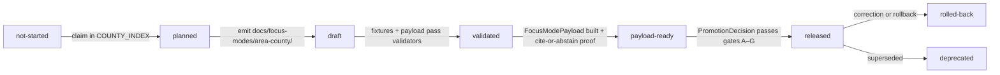

<!-- [KFM_META_BLOCK_V2]
doc_id: kfm://doc/focus-modes-readme  # NEEDS_VERIFICATION until registered
title: Focus Modes — County Focus Mode Control Plane
type: standard
version: v0.2
status: draft
owners:
  - <OWNER:focus-mode-steward>
  - <OWNER:directory-rules-steward>
created: 2026-05-21
updated: 2026-05-22
policy_label: public
authority: restates directory-rules.md §6.7 (NEVER overrides it)
related:
  - docs/standards/directory-rules.md
  - docs/standards/PROV.md
  - docs/adr/ADR-0001-schema-home.md                                      # NEEDS_VERIFICATION
  - docs/adr/ADR-0027-county-focus-mode-control-plane.md                  # PROPOSED — this control plane
  - docs/focus-modes/COUNTY_INDEX.md
  - docs/focus-modes/_template/county-build-plan.md
  - contracts/focus_mode/focus_mode_payload.md
  - schemas/contracts/v1/focus_mode/focus_mode_payload.schema.json        # NEEDS_VERIFICATION (PROPOSED emission)
  - tools/validators/validate_focus_mode_index.py
  - tools/validators/validate_focus_mode_payload.py                       # PROPOSED follow-up
tags:
  - kfm
  - focus-mode
  - proof-slice
  - evidence-first
  - map-first
  - governed-ai
  - directory-rules
  - control-plane
notes:
  - PROPOSED v1.2 deliverable referenced as a deferred item in directory-rules.md §18.d.
  - Restates directory-rules.md §6.7 placement contract, casing convention, and first-PR sequence.
  - All cross-root paths are governed by directory-rules.md §6.7; this README is an orientation, not an override.
  - Existence of per-county build plans is PROPOSED until verified against the live repository.
[/KFM_META_BLOCK_V2] -->

<a id="top"></a>

# `docs/focus-modes/` — County Focus Mode Control Plane

> **One README, many lanes.** A Focus Mode is a governed, evidence-bounded, county- or region-scale **proof slice** that demonstrates the full KFM trust path for a bounded spatial frame — without becoming a root folder, a domain, or a parallel authority.


**Status:** Draft (control plane, first emission) · **Lane:** `docs/focus-modes/` · **Authority:** human-facing control plane (semantic), not machine truth · **Owners:** `<OWNER:focus-mode-steward>`, `<OWNER:directory-rules-steward>` · **Last reviewed:** 2026-05-22

> [!IMPORTANT]
> **A Focus Mode is NOT a domain, NOT a root folder, and NOT a publication target by itself.** It is a cross-cutting *compositional unit* — a "proof slice" — that binds a county (or region/corridor) to released layers, an Evidence Drawer profile, a `FocusModePayload` contract, a `MapReleaseManifest`, and a rollback target. Its files MUST live as lanes inside the appropriate responsibility roots. **(CONFIRMED doctrine** — `directory-rules.md` §6.7; `kfm_repository_structure_guiding_document.md` §8.3.)

> [!IMPORTANT]
> **Reconciliation invariant.** This file **restates** the canonical Focus Mode placement contract defined in `directory-rules.md` §6.7. If this README and `directory-rules.md` ever diverge, **`directory-rules.md` wins.** Open a PR to update *this* file; do **not** edit `directory-rules.md` to match a stale restatement here.

---

## Contents

- [1. Scope and what this lane is](#1-scope-and-what-this-lane-is)
- [2. What is a Focus Mode?](#2-what-is-a-focus-mode)
- [3. Repo fit](#3-repo-fit)
- [4. What lives here, what does NOT](#4-what-lives-here-what-does-not)
- [5. Directory layout (inside `docs/focus-modes/`)](#5-directory-layout-inside-docsfocus-modes)
- [6. The control plane in this directory](#6-the-control-plane-in-this-directory)
- [7. Cross-root composition](#7-cross-root-composition)
- [8. Canonical placement table](#8-canonical-placement-table)
- [9. Casing convention per host root](#9-casing-convention-per-host-root)
- [10. Lifecycle of a county Focus Mode](#10-lifecycle-of-a-county-focus-mode)
- [11. Trust flow inside a Focus Mode](#11-trust-flow-inside-a-focus-mode)
- [12. Per-area lane: required files](#12-per-area-lane-required-files)
- [13. Sensitivity defaults (fail-closed lanes)](#13-sensitivity-defaults-fail-closed-lanes)
- [14. Add-a-county procedure](#14-add-a-county-procedure)
- [15. Recommended first-PR sequence](#15-recommended-first-pr-sequence)
- [16. Authoring checklist](#16-authoring-checklist)
- [17. Validation and CI hooks](#17-validation-and-ci-hooks)
- [18. ADR triggers](#18-adr-triggers)
- [19. Focus-mode registry (in-flight drafts)](#19-focus-mode-registry-in-flight-drafts)
- [20. What a Focus Mode is NOT](#20-what-a-focus-mode-is-not)
- [21. Drift register and open items](#21-drift-register-and-open-items)
- [22. FAQ](#22-faq)
- [23. Cross-references](#23-cross-references)
- [24. README contract self-check](#24-readme-contract-self-check)

---

## 1. Scope and what this lane is

**CONFIRMED doctrine.** `docs/focus-modes/` is the **human-facing control plane** for the County Focus Mode family. It holds, per area, the planning + acceptance documents that a `FocusModePayload` later materializes from: `README.md`, `build-plan.md`, `layer-registry.md`, `evidence-model.md`, `acceptance-checklist.md`, `source-seed-list.md`, `public-safety-notes.md`. *(directory-rules.md §6.7.2.)*

This README is the **orientation** for the directory. It exists for one reason: a Focus Mode is a *cross-cutting compositional unit* whose files land in **at least nine different responsibility roots**, and new authors need a single place that:

- defines what a Focus Mode is (and is not);
- restates the canonical per-root placement contract;
- restates the deliberate **per-root casing convention**;
- shows the recommended first-PR sequence;
- indexes the draft build plans already in flight.

It is **not** the home for:

- machine schemas (those live at `schemas/contracts/v1/focus_mode/`);
- semantic object contracts (those live at `contracts/focus_mode/`);
- payload fixtures (those live at `fixtures/focus_modes/<area>/{valid,invalid}/`);
- UI prototypes (those live at `apps/explorer-web/src/focus-modes/<area>/`);
- validators (those live at `tools/validators/`);
- published artifacts, release manifests, policy bundles, or receipts.

> [!NOTE]
> **CONFIRMED doctrine** — this file restates `directory-rules.md` §6.7.1 through §6.7.6. **PROPOSED** — every other repo-shaped claim below is provisional until verified against the live repository.

[↑ Back to top](#top)

---

## 2. What is a Focus Mode?

**CONFIRMED doctrine.** A **Focus Mode** is a governed, evidence-bounded, county- or region-scale proof slice. It demonstrates the full KFM trust path —

> `SourceDescriptor → SourceIntakeRecord → EvidenceRef → EvidenceBundle → Claim / AtlasCard → DecisionEnvelope → ReleaseManifest → Public UI`

— for a bounded spatial frame.

A Focus Mode is **simultaneously two things**, and both must be visible in placement:

| Sense | What it is | Where it lives |
|---|---|---|
| **AI surface** within the map shell | Evidence-bounded AI returning finite **ANSWER / ABSTAIN / DENY / ERROR** outcomes over a `MapContextEnvelope`, with `AIReceipt` and `CitationValidationReport` attached. | UI in `apps/explorer-web/`; consumes `MapContextEnvelope`; **never** reads `data/raw/`, `data/work/`, or `data/quarantine/`. |
| **Proof-slice composition** | The bundle of docs, contracts, schemas, fixtures, UI code, validators, catalog entries, and release candidates for one bounded area. | Lanes inside `docs/`, `contracts/`, `schemas/`, `fixtures/`, `apps/`, `tools/`, `data/`, `release/` — **never** a new root. |

> [!IMPORTANT]
> The placement rules in §8 apply to **both senses simultaneously**. A Focus Mode is not finished when the docs land; it is finished when every lane has a populated, validated, released composition behind a `ReleaseManifest`.

[↑ Back to top](#top)

---

## 3. Repo fit

| Aspect | Value |
|---|---|
| **Path** | `docs/focus-modes/` (kebab-case, **plural**; per `directory-rules.md` §6.7.2) |
| **Upstream authority** | `directory-rules.md` §3 (root-stays-boring), §6.7 (proof-slice placement contract), §7.1.a (`apps/explorer-web/` canonical), §12 (Domain Placement Law), §13.5 (drift anti-patterns 8–10), §18.d (v1.2 deferred items). |
| **Downstream consumers** | Per-county `docs/focus-modes/<area>-county/` folders; sibling lanes in `contracts/focus_mode/`, `schemas/contracts/v1/focus_mode/`, `fixtures/focus_modes/<area>/`, `apps/explorer-web/src/focus-modes/<area>/`, `data/catalog/sources/<area>/`, `data/published/layers/<area>/`, `release/candidates/<area>-focus-mode/`. |
| **Truth class** | Orientation / restatement. **Not** a normative authority on its own. Authority remains in `directory-rules.md`. |
| **Doc class** | Standard doc (KFM Meta Block v2 required) **and** directory README (README-like minimums required). |

[↑ Back to top](#top)

---

## 4. What lives here, what does NOT

| Category | Belongs in `docs/focus-modes/` | Belongs elsewhere (canonical) |
|---|---|---|
| Per-area planning & acceptance | ✅ `docs/focus-modes/<area>-<scope>/{README,build-plan,layer-registry,evidence-model,acceptance-checklist,source-seed-list,public-safety-notes}.md` | — |
| Area-specific framing notes (optional) | ✅ `docs/focus-modes/<area>-<scope>/<area>-specific-framing-notes.md` (e.g., `shawnee-mission-and-indigenous-history-notes.md`, `tri-state-mining-district-notes.md`) | — |
| Master index of all county slices | ✅ `docs/focus-modes/COUNTY_INDEX.md` | — |
| Build-plan template | ✅ `docs/focus-modes/_template/county-build-plan.md` | — |
| Semantic Markdown for `FocusModePayload`, `LayerRegistryEntry`, `AtlasCard` | ❌ | `contracts/focus_mode/` |
| Machine schema (`.schema.json`) | ❌ | `schemas/contracts/v1/focus_mode/` |
| Valid / invalid payload fixtures | ❌ | `fixtures/focus_modes/<area>/{valid,invalid}/` |
| Mock APIs, layer registries (code), UI prototypes | ❌ | `apps/explorer-web/src/focus-modes/<area>/` (**not** `apps/web/` — OPEN-DR-06 drift) |
| Validators | ❌ | `tools/validators/` |
| Release manifests | ❌ | `release/manifests/focus_modes/` |
| Released layer artifacts | ❌ | `data/published/layers/<area>/` |
| Published payloads | ❌ | `data/published/api_payloads/focus-modes/<area>.json` |
| Source descriptors (yaml) | ❌ | `data/catalog/sources/<area>/source_descriptors.yaml` |
| Policy overrides | ❌ | `policy/sensitivity/<area>/` (when justified) |
| Policy bundles (runtime / promotion / release gates) | ❌ | `policy/{runtime,promotion,release}/` |

> [!CAUTION]
> Creating a top-level `focus-mode/`, `focus_mode/`, `focus-modes/`, or `focus_modes/` folder at repo root is **drift** per `directory-rules.md` §13.5 anti-pattern #8 and `kfm_repository_structure_guiding_document.md` §3 (root-stays-boring). Use the host-root lanes above.

> [!WARNING]
> Putting `.schema.json` files under `contracts/focus_mode/` is **drift anti-pattern #10** in `directory-rules.md` §13.5. Schemas live in `schemas/contracts/v1/focus_mode/` per ADR-0001 (`NEEDS_VERIFICATION` of ADR number against the live repo).

[↑ Back to top](#top)

---

## 5. Directory layout (inside `docs/focus-modes/`)

**PROPOSED tree.** The shape below is the convergent pattern across the 17+ draft county build plans. Live-repo presence is `NEEDS_VERIFICATION`.

```text
docs/focus-modes/
├── README.md                          # this file — lane doctrine + add-a-county procedure
├── COUNTY_INDEX.md                    # master index: 105 KS counties, status, paths, validation state
├── _template/
│   └── county-build-plan.md           # standardized template with YAML front-matter spec
├── <area>-county/                     # kebab-case + scope suffix (added one PR at a time)
│   ├── README.md
│   ├── build-plan.md
│   ├── layer-registry.md
│   ├── evidence-model.md
│   ├── acceptance-checklist.md
│   ├── source-seed-list.md
│   ├── public-safety-notes.md
│   └── <area>-specific-framing-notes.md   # optional
├── <area>-corridor/                   # multi-county corridor (e.g., smoky-hill-corridor)
│   └── …
└── <area>-region/                     # multi-county region (rare)
    └── …
```

> [!NOTE]
> A corridor or region (e.g., `smoky-hill-corridor`) is its **own** area name and **does not mirror** under each member county. See [§9 — one area = one Focus Mode](#9-casing-convention-per-host-root) and `directory-rules.md` §6.7.4.

[↑ Back to top](#top)

---

## 6. The control plane in this directory

This directory itself contains four in-directory artifacts plus four out-of-directory companions that together gate further per-county work. **CONFIRMED doctrine** (the shapes); **PROPOSED implementation** (the files emitted in this PR).

### 6.1 In-directory artifacts

| File | Role |
|---|---|
| `README.md` | This file. Lane doctrine + add-a-county procedure. |
| `COUNTY_INDEX.md` | Master index of all 105 Kansas counties; status, lane, owner, priority, sensitivity flags, source-seed family. |
| `_template/county-build-plan.md` | Standardized template with mandatory YAML front-matter spec. |
| `<area>-county/` (per-area lanes) | The seven required files (§12) plus optional framing notes. |

### 6.2 Out-of-directory companions

| File | Canonical home | Role |
|---|---|---|
| `validate_focus_mode_index.py` | `tools/validators/` | Lightweight validator: broken links, missing READMEs, duplicate selection, naming drift. |
| `validate_focus_mode_payload.py` | `tools/validators/` | PROPOSED. Payload validator (per-area instance). |
| `focus_mode_payload.md` | `contracts/focus_mode/` | Plan → governed UI payload semantic contract. |
| `focus_mode_payload.schema.json` | `schemas/contracts/v1/focus_mode/` | Machine schema (NEEDS VERIFICATION in live repo; emit in PR-1 if absent). |
| `ADR-0027-county-focus-mode-control-plane.md` | `docs/adr/` | ADR formalizing this control plane. |

[↑ Back to top](#top)

---

## 7. Cross-root composition

A single area `<area>` (e.g., `ellsworth`) appears as a sub-segment inside **at least nine responsibility roots simultaneously**. The diagram is the canonical mental model; the table in §8 is the source of truth.


> [!CAUTION]
> The diagram is **schematic**. The exact path patterns, especially the **casing of `<area>` per root**, are not interchangeable — see §9.

[↑ Back to top](#top)

---

## 8. Canonical placement table

**CONFIRMED v1.2 pattern.** Restated verbatim from `directory-rules.md` §6.7.2. Live-repo verification is `NEEDS_VERIFICATION` at the area-segment level.

| Root | Path pattern | Authority | Notes |
|---|---|---|---|
| `docs/` | `docs/focus-modes/<area>-<scope>/` (e.g., `docs/focus-modes/ellsworth-county/`) | Canonical | Kebab-case area + scope suffix (`-county`, `-region`, `-corridor`). Holds the seven required files (§12) and optional area-specific framing notes. |
| `contracts/` | `contracts/focus_mode/` | Canonical (new top-level family; v1.2) | Snake_case, **singular**. Joins existing `contracts/{source,evidence,data,runtime,release,correction,governance,domains}/`. Holds the **semantic Markdown** for `FocusModePayload`, `LayerRegistryEntry`, `AtlasCard` (if not under `contracts/atlas/`), and area-bounding contracts. **MUST NOT** hold `.schema.json` files. |
| `schemas/` | `schemas/contracts/v1/focus_mode/` | Canonical (per ADR-0001 schema home) | Holds `focus_mode_payload.schema.json`, `layer_registry_entry.schema.json`, and area-bounding schema files. |
| `fixtures/` | `fixtures/focus_modes/<area>/{valid,invalid}/` | Canonical | **Plural snake_case** here (`focus_modes`), in contrast to `contracts/focus_mode/` (singular). Each area MUST have both `valid/` and `invalid/` populated. Negative fixtures (unresolved evidence, public RAW access, missing policy label, model output as evidence, exact sensitive geometry) are **required, not optional**. |
| `apps/` | `apps/explorer-web/src/focus-modes/<area>/` | Canonical (per §7.1.a, CONFIRMED at commit `b6a279…`) | New work targets `apps/explorer-web/`. Several draft county build plans reference `apps/web/`; that path is **drift** (OPEN-DR-06) and SHOULD be reconciled on next revision. |
| `tools/` | `tools/validators/validate_focus_mode_payload.py`, `validate_atlas_card.py`, `validate_evidence_bundle.py`, `validate_layer_registry.py`, `validate_focus_mode_index.py` | Canonical | Flat validator naming under `tools/validators/`; orchestrated per §7.5.a. |
| `data/catalog/` | `data/catalog/sources/<area>/source_descriptors.yaml`, `data/catalog/stac/<area>/` | Canonical | Area lives parallel to `data/catalog/domain/<domain>/`, **not** under it. An area composes across domains; it is not a domain. |
| `data/published/` | `data/published/layers/<area>/`, `data/published/api_payloads/focus-modes/<area>.json` | Canonical | Released layer artifacts scoped to the focus area. |
| `data/registry/` | `data/registry/sources/<area>/` (optional) | Canonical | Only when an area-bounded source slice needs its own registry view. |
| `release/` | `release/candidates/<area>-focus-mode/`, `release/manifests/<area>-focus-mode-v<n>.json` | Canonical | Release candidate dossiers and `ReleaseManifest` files. |
| `pipeline_specs/` | `pipeline_specs/focus_modes/<area>/` (optional) | Canonical | Only when an area needs its own declarative pipeline composition. |
| `examples/` | `examples/focus-modes/<area>/` (optional) | Canonical | Worked, runnable area-scoped example wiring. |
| `policy/` | `policy/sensitivity/<area>/` (optional) | Canonical | Only when per-area sensitivity overrides cross-domain defaults; requires deny-fixture and ADR-level justification. |

[↑ Back to top](#top)

---

## 9. Casing convention per host root

> [!IMPORTANT]
> The Focus Mode pattern uses **three casing styles by host root, and this is intentional**. The convention follows the *host root's* convention, not the Focus Mode pattern's convention. The cost is that the same area (e.g., `ellsworth`) appears as **`ellsworth-county`**, **`ellsworth`**, and **`ellsworth-focus-mode`** across roots. This is tracked as **OPEN-DR-08** for ADR-level resolution; pending ADR, the per-root table below is the v1.2 recommendation.

| Casing style | Where it applies | Example |
|---|---|---|
| **Kebab-case + scope suffix** | `docs/` (matches kebab-case lane convention; preserves human-readable scope) | `docs/focus-modes/ellsworth-county/`, `docs/focus-modes/smoky-hill-corridor/` |
| **Snake_case, area-only** | `contracts/`, `schemas/`, `fixtures/`, `pipeline_specs/` (matches Python/JSON identifier convention; scope dropped because parent encodes scope) | `contracts/focus_mode/`, `schemas/contracts/v1/focus_mode/`, `fixtures/focus_modes/ellsworth/`, `pipeline_specs/focus_modes/ellsworth/` |
| **Kebab-case, area-only** | `apps/`, `data/{catalog,published,registry}/`, `release/`, `examples/` (matches URL/filesystem convention) | `apps/explorer-web/src/focus-modes/ellsworth/`, `data/published/layers/ellsworth/`, `release/candidates/ellsworth-focus-mode/`, `examples/focus-modes/ellsworth/` |

**Why mixed casing is acceptable here:** mixing follows established norms inside each root rather than forcing one style across roots that have different conventions. The single-area-three-spellings cost is paid once and documented here so that new authors do not invent siblings like `docs/focus-modes/ellsworth/` (missing scope suffix) or `apps/explorer-web/src/focus-modes/ellsworth-county/` (wrong root for the scope suffix).

### One area = one Focus Mode

**CONFIRMED.** An area MUST appear as exactly one Focus Mode composition. If a Focus Mode grows beyond a county (e.g., `smoky-hill-corridor` spanning Ellsworth + Saline + Russell counties), it gets **its own area name**; it does NOT mirror under each member county.

### Scope suffix area-lane summary (the `docs/` view)

- Kebab-case + scope suffix.
- Examples: `ellsworth-county/`, `smoky-hill-corridor/`, `cheyenne-bottoms-region/`.
- The scope suffix MUST be one of: `-county`, `-region`, `-corridor`. Other scopes require an ADR.

[↑ Back to top](#top)

---

## 10. Lifecycle of a county Focus Mode



| Status | Entry condition | Exit condition |
|---|---|---|
| `not-started` | County exists in Kansas (1 of 105) | An owner is recorded in `COUNTY_INDEX.md` |
| `planned` | Owner + scope agreed | `docs/focus-modes/<area>-county/` lane exists with at least `README.md` + `build-plan.md` |
| `draft` | All seven lane files exist | All validators in §17 pass on the lane |
| `validated` | Validators pass | A `FocusModePayload` instance exists at `data/published/api_payloads/focus-modes/<area>.json` and validates against `schemas/contracts/v1/focus_mode/focus_mode_payload.schema.json` |
| `payload-ready` | Payload validates + citation closure proven | `PromotionDecision` envelope passes promotion gates A–G (per `ai-build-operating-contract.md` Part VI) |
| `released` | `MapReleaseManifest` + rollback target exist | A correction is filed or a successor release supersedes |
| `rolled-back` | `RollbackCard` written, cache invalidated | Re-validation closes a corrected version |
| `deprecated` | Successor released, deprecation notice in lane README | (terminal) |

[↑ Back to top](#top)

---

## 11. Trust flow inside a Focus Mode

**CONFIRMED doctrine / PROPOSED implementation.** A Focus Mode demonstrates the full KFM trust path end-to-end for one bounded area. No step is optional; no step may be skipped.



```mermaid
flowchart LR
    SD[SourceDescriptor]:::source
    SIR[SourceIntakeRecord]:::source
    ER[EvidenceRef]:::evidence
    EB[EvidenceBundle]:::evidence
    AC[Claim / AtlasCard]:::claim
    DE[DecisionEnvelope]:::decision
    RM[ReleaseManifest]:::release
    UI[Public UI<br/>apps/explorer-web/]:::ui
    FM[Focus Mode AI<br/>ANSWER/ABSTAIN/DENY/ERROR]:::ai

    SD --> SIR --> ER --> EB --> AC --> DE --> RM --> UI
    EB -.evidence-bounded synthesis.-> FM
    UI -.MapContextEnvelope.-> FM
    FM -.AIReceipt + CitationValidationReport.-> UI

    classDef source fill:#e0f2fe,stroke:#075985,color:#000
    classDef evidence fill:#ecfccb,stroke:#3f6212,color:#000
    classDef claim fill:#fef3c7,stroke:#78350f,color:#000
    classDef decision fill:#fce7f3,stroke:#831843,color:#000
    classDef release fill:#ffedd5,stroke:#9a3412,color:#000
    classDef ui fill:#dbeafe,stroke:#1e3a8a,color:#000
    classDef ai fill:#f3e8ff,stroke:#581c87,color:#000
```

| Stage | Object families | Outcomes |
|---|---|---|
| Source | `SourceDescriptor`, `SourceIntakeRecord` | admitted / quarantined |
| Evidence | `EvidenceRef`, `EvidenceBundle` | resolved / unresolved |
| Claim | `Claim`, `AtlasCard`, `LayerRegistryEntry` | citable / draft |
| Decision | `PolicyDecision`, `PromotionDecision`, `DecisionEnvelope` | ALLOW / DENY / ABSTAIN / ERROR |
| Release | `ReleaseManifest`, `RollbackCard` | released / rolled back |
| UI surface | `EvidenceDrawerPayload`, `MapContextEnvelope` | drawer + map state |
| AI surface (Focus Mode) | `FocusModeRequest`, `FocusModeResponse`, `AIReceipt`, `CitationValidationReport` | **ANSWER / ABSTAIN / DENY / ERROR** |

> [!IMPORTANT]
> The Focus Mode AI surface is **never the root truth source**. It synthesizes only over **resolved, visible, policy-safe evidence** and **must cite, abstain, deny, or error** — never invent.

[↑ Back to top](#top)

---

## 12. Per-area lane: required files

**CONFIRMED canonical pattern** per `directory-rules.md` §6.7.2; **NEEDS VERIFICATION** at the live-repo area-segment level.

### 12.1 Seven required files

| File | Required | Role |
|---|---|---|
| `README.md` | yes | Lane-level KFM Meta Block, status, owner, links, public-safety posture summary. |
| `build-plan.md` | yes | The plan itself (use `_template/county-build-plan.md`). Phased: control plane → mock API → UI prototype → repo integration → source intake → release. |
| `layer-registry.md` | yes | Per-layer entries: source role, time scope, sensitivity class, owner, release state, evidence ref, style ref. |
| `evidence-model.md` | yes | Area-specific EvidenceRef / EvidenceBundle conventions; required citations per claim type. Each claim carries an `EvidenceRef` ID. |
| `acceptance-checklist.md` | yes | Per-county checklist (a)–(h) from COUNTY-01 acceptance card. Definition-of-done for the proof slice. |
| `source-seed-list.md` | yes | Per-county source-seed signals + rights posture; descriptors + intake status. |
| `public-safety-notes.md` | yes | Sensitivity, rights, geoprivacy, redaction posture for this area; per-lane DENY/ABSTAIN reasons. |

### 12.2 Optional files

| File | Role |
|---|---|
| `<area>-specific-framing-notes.md` | Free-form framing notes specific to the area (e.g., `shawnee-mission-and-indigenous-history-notes.md`, `tri-state-mining-district-notes.md`). Useful for areas with culturally or politically sensitive history that benefits from a dedicated framing artifact. |

[↑ Back to top](#top)

---

## 13. Sensitivity defaults (fail-closed lanes)

**CONFIRMED doctrine** per `Master_MapLibre_Components-Functions-Features_v2_1_FULL.md` §16.3 COUNTY-04 and `kfm_unified_doctrine_synthesis.md` Part VII (publication, rights, sensitivity).

| Lane | Default outcome | Rationale |
|---|---|---|
| Parcel / title claims | ABSTAIN or DENY | private property; potential misuse |
| Exact archaeology coordinates | DENY | sovereignty / cultural heritage |
| Burial / sacred locations | DENY | sovereignty / cultural heritage |
| Rare species exact locations | DENY or generalize | species protection |
| Critical infrastructure exact details | DENY | public-safety vulnerability |
| Living-person identifiers | DENY | privacy |
| DNA / genomic data | DENY | privacy + CARE/FAIR |
| Emergency-alert claims | ABSTAIN | KFM is not an alert authority |

Per-county `policy/sensitivity/<area>/` overrides cross-domain defaults **only with a documented justification and a deny-fixture for the overridden lane** (`fixtures/focus_modes/<area>/invalid/`).

[↑ Back to top](#top)

---

## 14. Add-a-county procedure

**PROPOSED workflow** (gated by validator in §17; ADR-required for any deviation from §6.7.2 placement):

1. **Claim** in `COUNTY_INDEX.md`: change the row's `status` from `not-started` to `planned`, fill `owner`, and run `python tools/validators/validate_focus_mode_index.py docs/focus-modes/` to verify no naming collision.
2. **Scaffold** the lane: copy `_template/county-build-plan.md` to `docs/focus-modes/<area>-county/build-plan.md` and fill in the YAML front-matter. Emit the other six lane files as stubs.
3. **Seed evidence**: every layer claim in `layer-registry.md` and `evidence-model.md` MUST carry an `EvidenceRef` that resolves (or fail-closed `ABSTAIN`). No claim survives without one. *(kfm_unified_doctrine_synthesis.md Part III cite-or-abstain.)*
4. **Mark sensitivity defaults** in `public-safety-notes.md`: parcel/title → ABSTAIN/DENY; exact archaeology → DENY; rare species → DENY/generalize; critical infrastructure → DENY; emergency-alert claims → ABSTAIN. **(See §13.)**
5. **Run the validator.** Lane advances to `draft` only when the validator passes on this lane.
6. **Hand off** to the mock-API + UI PR sequence per `directory-rules.md` §6.7.6 (the four-PR sequence below in §15). **County plans in `docs/focus-modes/` are PR-1 of that sequence.**

> [!IMPORTANT]
> **County plans do not become a `FocusModePayload` by sitting in `docs/focus-modes/`.** They become a payload only when (a) the semantic contract at `contracts/focus_mode/focus_mode_payload.md` is satisfied, (b) the schema at `schemas/contracts/v1/focus_mode/focus_mode_payload.schema.json` validates a generated instance, (c) `fixtures/focus_modes/<area>/valid/` contains a passing example, and (d) `fixtures/focus_modes/<area>/invalid/` contains negative fixtures covering DENY, ABSTAIN, and ERROR paths. The plan-to-payload crosswalk lives in `contracts/focus_mode/focus_mode_payload.md` §3.

[↑ Back to top](#top)

---

## 15. Recommended first-PR sequence

**CONFIRMED recommendation (not normative).** From `directory-rules.md` §6.7.6. The sequence preserves the cite-or-abstain posture from the very first commit:

1. **Control plane** (PR-1)
   - `docs/focus-modes/<area>-<scope>/{README.md, build-plan.md, layer-registry.md, acceptance-checklist.md, evidence-model.md, source-seed-list.md, public-safety-notes.md}`
   - `contracts/focus_mode/focus_mode_payload.md`
   - `schemas/contracts/v1/focus_mode/focus_mode_payload.schema.json`
   - `fixtures/focus_modes/<area>/{valid,invalid}/...`

2. **Mock API + layer registry** (PR-2)
   - `apps/explorer-web/src/focus-modes/<area>/{mock-api.js, layers.js}`
   - Fixture payloads.

3. **UI prototype** (PR-3)
   - `apps/explorer-web/src/focus-modes/<area>/{index.js, evidence-drawer.js, timeline.js, ai-panel.js, styles.css}`

4. **Validators + negative fixtures** (PR-4)
   - `tools/validators/validate_focus_mode_payload.py`
   - Invalid fixtures exercising every `DENY` / `ABSTAIN` / `ERROR` path.

> [!NOTE]
> If an existing county build plan shows a different sequence, **the sequence is a recommendation, not authority** — the placement contract in §8 is. The recommendation is also why every county build plan begins with a *control plane* PR before any UI code.

[↑ Back to top](#top)

---

## 16. Authoring checklist

Use this checklist for **any new Focus Mode** (county, corridor, or region). Items map directly to `directory-rules.md` §6.7.

### 16.1 Control plane

- [ ] Area name chosen; scope suffix decided (`-county`, `-region`, `-corridor`)
- [ ] Row in `COUNTY_INDEX.md` moved from `not-started` → `planned`; owner filled
- [ ] `docs/focus-modes/<area>-<scope>/README.md` created with KFM Meta Block v2
- [ ] `docs/focus-modes/<area>-<scope>/build-plan.md` drafted (phases + acceptance) from `_template/county-build-plan.md`
- [ ] `docs/focus-modes/<area>-<scope>/layer-registry.md` drafted with sensitivity classes
- [ ] `docs/focus-modes/<area>-<scope>/evidence-model.md` drafted; every claim carries an `EvidenceRef` ID
- [ ] `docs/focus-modes/<area>-<scope>/acceptance-checklist.md` drafted with COUNTY-01 items (a)–(h)
- [ ] `docs/focus-modes/<area>-<scope>/source-seed-list.md` drafted with rights posture
- [ ] `docs/focus-modes/<area>-<scope>/public-safety-notes.md` drafted with §13 defaults

### 16.2 Contracts and schemas

- [ ] `contracts/focus_mode/focus_mode_payload.md` exists (semantic Markdown, NO `.schema.json`)
- [ ] `schemas/contracts/v1/focus_mode/focus_mode_payload.schema.json` validates against KFM JSON Schema conventions
- [ ] `schemas/contracts/v1/focus_mode/layer_registry_entry.schema.json` present

### 16.3 Fixtures (both directions)

- [ ] `fixtures/focus_modes/<area>/valid/` populated
- [ ] `fixtures/focus_modes/<area>/invalid/` populated with **all** required negatives:
  - [ ] `unresolved_evidence_ref.invalid.json`
  - [ ] `public_raw_access.invalid.json`
  - [ ] `missing_policy_label.invalid.json`
  - [ ] `model_output_as_evidence.invalid.json`
  - [ ] `exact_sensitive_geometry.invalid.json` (where sensitivity applies)

### 16.4 App shell

- [ ] UI lives in `apps/explorer-web/src/focus-modes/<area>/` (**not** `apps/web/` — OPEN-DR-06)
- [ ] `mock-api.js`, `layers.js`, `index.js`, `evidence-drawer.js`, `timeline.js`, `ai-panel.js` present
- [ ] No reads from `data/raw/`, `data/work/`, or `data/quarantine/`

### 16.5 Catalog, published, release

- [ ] `data/catalog/sources/<area>/source_descriptors.yaml` exists
- [ ] `data/published/layers/<area>/` populated only after release
- [ ] `release/candidates/<area>-focus-mode/` dossier prepared
- [ ] `release/manifests/<area>-focus-mode-v<n>.json` written **before** any public UI exposure

### 16.6 Governance gates

- [ ] Every public claim resolves an `EvidenceRef` to an `EvidenceBundle`
- [ ] `PolicyDecision` produced for every release candidate (ALLOW / DENY / ABSTAIN / ERROR)
- [ ] Focus Mode AI returns one of **ANSWER / ABSTAIN / DENY / ERROR** — never free-form generation
- [ ] `AIReceipt` and `CitationValidationReport` attached to every AI answer
- [ ] `RollbackCard` and prior `ReleaseManifest` reference present

[↑ Back to top](#top)

---

## 17. Validation and CI hooks

**PROPOSED.** The control plane is gated by one validator that the canonical orchestrator (`tools/validate_all.py`, CONFIRMED live-repo location per `directory-rules.md` §7.5.a / OPEN-DR-07) discovers via `tools/validators/registry.yaml`:

```bash
python tools/validators/validate_focus_mode_index.py docs/focus-modes/
```

Checks performed (see `tools/validators/validate_focus_mode_index.py` for the source):

1. `COUNTY_INDEX.md` parses; the table contains exactly the 105 Kansas counties; no duplicates; statuses ∈ enum.
2. Every row with `status` ≥ `planned` points to an existing `docs/focus-modes/<area>-county/` lane.
3. Every existing lane contains the seven required files (§12.1).
4. Every `build-plan.md` has YAML front-matter with the required keys (see `_template/county-build-plan.md`).
5. `ui_shell` front-matter key equals `apps/explorer-web` (no `apps/web/` drift — OPEN-DR-06).
6. No `.schema.json` files exist under any `docs/focus-modes/` lane (schema-home violation per §6.4).
7. No lane references `apps/web/src/focus-modes/`.
8. Internal markdown links resolve.
9. No duplicate county claim (one county cannot appear in two area lanes).
10. Area lane names match kebab-case + scope-suffix pattern (`<area>-county|region|corridor`).
11. Every `acceptance-checklist.md` contains all eight COUNTY-01 acceptance items (a)–(h).
12. Sensitivity defaults table present in every `public-safety-notes.md`.

CI MUST call `python tools/validate_all.py`, which discovers and runs this validator. Pre-commit hook is OPTIONAL but recommended.

[↑ Back to top](#top)

---

## 18. ADR triggers

**CONFIRMED required-ADR triggers** per `directory-rules.md` §2.4 and `ai-build-operating-contract.md` §28. Any of the following in this lane requires an accepted ADR before merge:

- Adding, removing, or renaming a top-level focus-mode artifact root (e.g., introducing `focus_modes/` at repo root — denied; or changing `docs/focus-modes/` casing).
- Adding a new scope suffix beyond `-county`, `-region`, `-corridor`.
- Changing the seven required per-lane files (§12.1).
- Changing the YAML front-matter spec in `_template/county-build-plan.md` in a way that invalidates existing plans.
- Changing the lifecycle states (§10) or the promotion gates referenced therein.
- Changing the sensitivity defaults (§13).
- Introducing a per-area schema home (denied by default; machine schemas are in `schemas/contracts/v1/focus_mode/`, area-agnostic, per ADR-0001).
- Changing the canonical UI shell from `apps/explorer-web/` to anything else.
- Resolving OPEN-DR-08 (the three-casings-per-area design) to a single casing.

[↑ Back to top](#top)

---

## 19. Focus-mode registry (in-flight drafts)

**PROPOSED — draft build plans only.** The build plans below are `status: draft`, all dated 2026-05-21, and their existence in the live repository is `NEEDS_VERIFICATION`. None has yet produced a published `ReleaseManifest`. For the full 105-county universe (including all `not-started` rows and per-county sensitivity flags), see [`COUNTY_INDEX.md`](./COUNTY_INDEX.md).

| # | Area | Scope | Build plan path (PROPOSED) | Distinguishing profile |
|---|---|---|---|---|
| 1 | Ellsworth | county | `docs/focus-modes/ellsworth-county/build-plan.md` | First flagship proof slice; Smoky Hill River, Fort Harker, Kanopolis context |
| 2 | Riley | county | `docs/focus-modes/riley-county/build-plan.md` | Manhattan, Kansas State, Fort Riley, Flint Hills |
| 3 | Shawnee | county | `docs/focus-modes/shawnee-county/build-plan.md` | State capital, civil rights history, Kansas River |
| 4 | Ford | county | `docs/focus-modes/ford-county/build-plan.md` | Dodge City, cattle trail, Santa Fe Trail |
| 5 | Wyandotte | county | `docs/focus-modes/wyandotte-county/build-plan.md` | Kansas City KS, Kansas/Missouri rivers confluence, Indigenous removal history |
| 6 | Sedgwick | county | `docs/focus-modes/sedgwick-county/build-plan.md` | Wichita metro, aviation, Arkansas River |
| 7 | Douglas | county | `docs/focus-modes/douglas-county/build-plan.md` | Lawrence, Bleeding Kansas, KU |
| 8 | Leavenworth | county | `docs/focus-modes/leavenworth-county/build-plan.md` | Military reservation, federal penitentiary, oldest Kansas city |
| 9 | Reno | county | `docs/focus-modes/reno-county/build-plan.md` | Hutchinson, salt industry, state fair |
| 10 | Johnson | county | `docs/focus-modes/johnson-county/build-plan.md` | Overland Park, Olathe, Shawnee Mission, suburban growth |
| 11 | Barton | county | `docs/focus-modes/barton-county/build-plan.md` | Great Bend, Cheyenne Bottoms, Central Flyway, Santa Fe Trail |
| 12 | Geary | county | `docs/focus-modes/geary-county/build-plan.md` | Junction City, Fort Riley adjacency |
| 13 | Finney | county | `docs/focus-modes/finney-county/build-plan.md` | Garden City, Ogallala Aquifer, irrigation, meatpacking, immigration |
| 14 | Cherokee | county | `docs/focus-modes/cherokee-county/build-plan.md` | Galena, Baxter Springs, Route 66, Tri-State Mining, Big Brutus |
| 15 | Saline | county | `docs/focus-modes/saline-county/build-plan.md` | Salina hub; transportation, floodplain, civic GIS |
| 16 | Crawford | county | `docs/focus-modes/crawford-county/build-plan.md` | Pittsburg, southeast Kansas coal fields, mined-land recovery |
| 17 | Lyon | county | `docs/focus-modes/lyon-county/build-plan.md` | Emporia, Flint Hills edge, Kansas Turnpike corridor |

> [!NOTE]
> The first eleven counties motivated the §6.7 placement contract in `directory-rules.md` v1.2; counties 12–17 are subsequent draft plans following the same template. Per-build-plan implementation maturity is `UNKNOWN` until the live repository is mounted. `COUNTY_INDEX.md` carries the larger ≥30-county set from `Master_MapLibre_Components-Functions-Features_v2_1_FULL.md` Appendix C at `status: draft`, and all remaining Kansas counties (to 105) at `status: not-started`.

[↑ Back to top](#top)

---

## 20. What a Focus Mode is NOT

**CONFIRMED.** Restated verbatim from `directory-rules.md` §6.7.5. A Focus Mode MUST NOT:

> [!CAUTION]
>
> - Become a root folder (`focus_modes/` or `focus-modes/` at repo root → §3 violation, §13.5 anti-pattern #8).
> - Hold `.schema.json` files inside `contracts/focus_mode/` (→ §6.4 schema-home violation, §13.1 anti-pattern, §13.5 anti-pattern #10).
> - Use `apps/web/` (→ §7.1 canonical-shell violation; OPEN-DR-06).
> - Read directly from `data/raw/`, `data/work/`, or `data/quarantine/` from public UI (→ §7.1 trust-membrane violation).
> - Publish without a `ReleaseManifest` under `release/manifests/` (→ §9.2 lifecycle invariant; §13.4 lifecycle skip).
> - Treat AI output as proof (→ §6.7.1 finite-outcome rule; §13.5 "model output as evidence").
> - Carry a domain into a root folder via the focus-mode pattern (→ §12 Domain Placement Law).

> [!NOTE]
> Drifts 8, 9, and 10 in `directory-rules.md` §13.5 — "Focus-mode as root", "Focus-mode app shell divergence" (`apps/web/` vs `apps/explorer-web/`), and "Focus-mode schema in `contracts/`" — were added in v1.2 specifically to defend the Focus Mode pattern against the most common drift attempts.

[↑ Back to top](#top)

---

## 21. Drift register and open items

Two registers track items surfaced from this lane:

- **`OPEN-FM-*`** — items only this lane tracks (lane-internal control-plane decisions).
- **`OPEN-DR-*`** — corpus-wide drifts surfaced here but registered in `directory-rules.md` §18.

| ID | Item | Status | Action |
|---|---|---|---|
| OPEN-FM-01 | `docs/focus-mode/` (singular) vs `docs/focus-modes/` (plural) — which is present in the live tree? | NEEDS VERIFICATION | Inspect; migrate if singular drift is found. ADR-required if migrating. Canonical is **plural**. |
| OPEN-FM-02 | Eleven counties (`directory-rules.md` v1.2 §0) vs ≥30 (`Master_MapLibre_Components-Functions-Features_v2_1_FULL.md` Appendix C) — corpus internal disagreement | CONFIRMED corpus state | `COUNTY_INDEX.md` lists the ≥30 from MapLibre v2.1 Appendix C as `draft`; the 11 are marked as "priority subset" (P1). |
| OPEN-FM-03 | County plans referencing `apps/web/` instead of `apps/explorer-web/` (same as OPEN-DR-06) | CONFIRMED drift in corpus | Validator check 5 + 7 (§17) catches this; revise on next plan iteration. |
| OPEN-FM-04 | Validator orchestrator at `tools/validate_all.py` (live) vs `tools/validators/validate_all.py` (doctrine) (same as OPEN-DR-07) | CONFIRMED live; doctrine variance | CI calls live path; ADR pending. |
| OPEN-FM-05 | `contracts/focus_mode/focus_mode_payload.md` exists? `schemas/contracts/v1/focus_mode/focus_mode_payload.schema.json` exists? | NEEDS VERIFICATION | If not present, control-plane PR-1 emits both. |
| OPEN-FM-06 | Per-area sensitivity overrides at `policy/sensitivity/<area>/` — are any overrides justified yet? | UNKNOWN | None defaulted; record any override in the ADR per §18 trigger. |
| OPEN-FM-07 | Owner for each county lane — `<OWNER>` placeholders in `COUNTY_INDEX.md` | NEEDS VERIFICATION | Fill as plans move from `not-started` to `planned`. |
| OPEN-FM-08 | Optional area-specific framing notes — naming convention not yet codified | PROPOSED | Examples in use: `shawnee-mission-and-indigenous-history-notes.md`, `tri-state-mining-district-notes.md`. ADR if standardization needed. |
| OPEN-DR-06 | Several draft county build plans reference `apps/web/`; canonical is `apps/explorer-web/` | CONFIRMED drift | Tracked in `directory-rules.md` §18. |
| OPEN-DR-07 | Validator orchestrator path (`tools/validate_all.py` live vs doctrine variant) | CONFIRMED variance | Tracked in `directory-rules.md` §18. |
| OPEN-DR-08 | Three casings per area across roots (kebab+scope vs snake_case vs kebab area-only) | OPEN | ADR-level resolution pending; pending ADR, §9 table stands. |
| OPEN-DR-09 | Existence of `docs/registers/DRIFT_REGISTER.md` | NEEDS VERIFICATION | Confirm against live repo. |

[↑ Back to top](#top)

---

## 22. FAQ

<details>
<summary><strong>Why is the casing different across roots? Can't we just pick one?</strong></summary>

The casing follows the **host root's** existing convention rather than imposing a Focus-Mode-wide style across roots that have different established norms. `docs/` is kebab-case; `contracts/`, `schemas/`, `fixtures/` are snake_case (matching Python/JSON identifier convention); `apps/`, `data/`, `release/` are kebab-case (matching URL/filesystem convention). Forcing one style would create drift inside whichever roots got overridden. This is recorded as **OPEN-DR-08** in `directory-rules.md` §18.d for ADR-level reconsideration; pending ADR, the per-root convention in §9 stands.

</details>

<details>
<summary><strong>Why is <code>contracts/focus_mode/</code> singular but <code>fixtures/focus_modes/</code> plural?</strong></summary>

`contracts/` follows the existing pattern of singular family names (`contracts/source/`, `contracts/evidence/`, `contracts/release/`). `fixtures/` follows the existing pattern of plural collection names (`fixtures/valid/`, `fixtures/invalid/`, `fixtures/domains/`). Each root's convention won locally rather than forcing a Focus-Mode-wide override. See `directory-rules.md` §6.7.2.

</details>

<details>
<summary><strong>What if I want to publish before all the fixtures exist?</strong></summary>

You can't. `directory-rules.md` §6.7.5 explicitly forbids publishing without a `ReleaseManifest`, and §6.7.2 requires both `valid/` and `invalid/` fixture sets populated. The required negative fixtures (unresolved evidence, public RAW access, missing policy label, model output as evidence, exact sensitive geometry) are **required, not optional**. Publishing without them collapses the cite-or-abstain posture.

</details>

<details>
<summary><strong>Can a Focus Mode become its own root folder eventually?</strong></summary>

No. `directory-rules.md` §3 (root-stays-boring) and §13.5 anti-pattern #8 explicitly forbid `focus_modes/` or `focus-modes/` as repo-root entries. A Focus Mode is **cross-cutting**, not a domain. The whole point of the §6.7 placement contract is that Focus Modes compose **across** responsibility roots; promoting them to a root would re-fragment the lifecycle.

</details>

<details>
<summary><strong>Several county build plans say <code>apps/web/</code> — is that correct?</strong></summary>

No. The canonical shell is `apps/explorer-web/` (`directory-rules.md` §7.1.a, CONFIRMED at commit `b6a279…`). Eleven+ draft build plans use `apps/web/`; that is **drift** and is tracked as **OPEN-DR-06**. New work targets `apps/explorer-web/`. Existing draft plans SHOULD be reconciled on their next revision.

</details>

<details>
<summary><strong>Where does ADR-0001 live? I see it referenced but cannot find the file.</strong></summary>

`ADR-0001` is referenced as the **schema home** ADR (`schemas/contracts/v1/...` is canonical, `contracts/<domain>/<x>.schema.json` is forbidden). Its exact path in the live repo is `NEEDS_VERIFICATION`; the corpus consistently references it but does not always specify the path. Likely candidates: `docs/adr/ADR-0001-schema-home.md` or `docs/standards/adr/ADR-0001-schema-home.md`. Confirm against the live repo before linking.

</details>

<details>
<summary><strong>Why <code>docs/focus-modes/</code> (plural) and not <code>docs/focus-mode/</code> (singular)?</strong></summary>

`docs/` uses plural collection names for sibling lanes (`docs/adr/`, `docs/runbooks/`, `docs/standards/`). The directory holds **many** county Focus Modes, so the plural matches the convention. A singular `docs/focus-mode/` in the live tree would be drift requiring ADR-gated migration — see **OPEN-FM-01**.

</details>

<details>
<summary><strong>Is the AI surface allowed to read the data layers directly?</strong></summary>

No. The AI surface consumes only a `MapContextEnvelope` (the resolved, policy-checked, evidence-bounded UI state) and produces a `FocusModeResponse` with `AIReceipt` and `CitationValidationReport` attached. It never reads `data/raw/`, `data/work/`, `data/quarantine/`, or even raw `data/published/` artifacts. The trust membrane between data and AI is fixed; the AI outranks no evidence (`ai-build-operating-contract.md` §10).

</details>

[↑ Back to top](#top)

---

## 23. Cross-references

- `directory-rules.md` §6.7 (Focus Modes placement contract); §7.1.a (`apps/explorer-web/` canonical); §12 (Domain Placement Law); §13.5 (drift register); §15 (per-root README contract); §18.d (v1.2 deferred items).
- `kfm_repository_structure_guiding_document.md` §3 (root-stays-boring); §8 (Focus Mode placement contract).
- `kfm_unified_doctrine_synthesis.md` Part III (cite-or-abstain); Part VI (promotion gates); Part VII (publication/sensitivity); Part XI (validator worked example).
- `ai-build-operating-contract.md` §10 (AI is interpretive); §26 (governed loop); §27 (PR discipline); §28 (ADR triggers); §29 (object-family guardrails).
- `Master_MapLibre_Components-Functions-Features_v2_1_FULL.md` §16.3 (COUNTY-01..04 family); Appendix C (county build plan index).
- `docs/standards/PROV.md` — provenance standards profile applied to `EvidenceBundle` and `AIReceipt`.
- `docs/adr/ADR-0001-schema-home.md` — schema-home rule (`NEEDS_VERIFICATION` of exact ADR path).
- `docs/adr/ADR-0027-county-focus-mode-control-plane.md` — ADR formalizing this control plane.
- `docs/registers/DRIFT_REGISTER.md` — running register of OPEN-DR items, including OPEN-DR-06 / -07 / -08 / -09 (`NEEDS_VERIFICATION` of existence).
- `contracts/focus_mode/focus_mode_payload.md` — this control plane's plan-to-payload contract.
- `tools/validators/validate_focus_mode_index.py` — this control plane's validator.
- Per-county build plans — see [§19](#19-focus-mode-registry-in-flight-drafts) and [`COUNTY_INDEX.md`](./COUNTY_INDEX.md).

[↑ Back to top](#top)

---

## 24. README contract self-check

Per `directory-rules.md` §15, every canonical/compatibility root README must declare:

| Field | Value |
|---|---|
| Purpose | Human-facing control plane for County Focus Mode planning + acceptance lanes |
| Authority level | Canonical sub-lane of `docs/` (§6.1, §6.7.2) — semantic; never machine truth |
| Status | CONFIRMED root pattern; PROPOSED first-emission file set |
| What belongs here | §4 above |
| What does NOT belong here | §4 above |
| Inputs | Doctrine (Directory Rules v1.2, Doctrine Synthesis, MapLibre v2.1, Build Manual), ADRs, county source seeds |
| Outputs | Lane-level planning markdown consumed by the validator (§17), the `contracts/focus_mode/focus_mode_payload.md` crosswalk, and downstream `apps/explorer-web/src/focus-modes/<area>/` |
| Validation | `tools/validators/validate_focus_mode_index.py`; orchestrated by `tools/validate_all.py` |
| Review burden | Focus Mode steward + Directory Rules steward + per-county owner + sensitivity reviewer where applicable |
| Related folders | `contracts/focus_mode/`, `schemas/contracts/v1/focus_mode/`, `fixtures/focus_modes/`, `apps/explorer-web/src/focus-modes/`, `tools/validators/`, `data/catalog/sources/`, `data/published/api_payloads/focus-modes/`, `release/manifests/focus_modes/`, `policy/sensitivity/` |
| ADRs | ADR-0027 (PROPOSED; this control plane); ADR-0001 (schema home); ADR-S-05 (sensitivity tiers, PROPOSED) |
| Last reviewed | 2026-05-22 |

---

> [!NOTE]
> **Reconciliation invariant.** When this README and `directory-rules.md` disagree, `directory-rules.md` is authoritative. Open a PR to update *this* file; do **not** edit `directory-rules.md` to match a stale restatement here.

---

**Last updated:** 2026-05-22 · **Version:** v0.2 (draft, merged) · **Authority:** restates `directory-rules.md` §6.7 · [↑ Back to top](#top)
