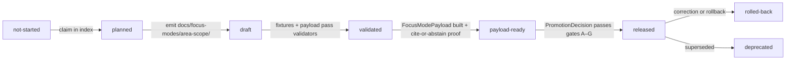

<!-- [KFM_META_BLOCK_V2]
doc_id: kfm://doc/focus-mode-readme  # NEEDS_VERIFICATION until registered
title: Focus Mode — State + County Focus Mode Control Plane
type: standard
version: v0.5
status: draft
owners:
  - <OWNER:focus-mode-steward>
  - <OWNER:directory-rules-steward>
created: 2026-05-21
updated: 2026-05-24
policy_label: public
authority: restates docs/doctrine/directory-rules.md §6.7 (NEVER overrides it); §6.7 amended per ADR-0029 to canonize the singular lane name, container subdirectories, snake_case area dirs with _<scope> suffix, and consolidated single-file build plan; -state scope added per ADR-0028 (pending acceptance)
related:
  - docs/doctrine/directory-rules.md
  - docs/standards/PROV.md
  - docs/adr/ADR-0001-schema-home--schemas-contracts-v1-is-canonical.md
  - docs/adr/ADR-0027-county-focus-mode-control-plane.md
  - docs/adr/ADR-0028 — State-scale Focus Mode scope.md                   # adds -state to allowed scope suffixes; filename naming separate question (ADR-0029 §10.3)
  - docs/adr/ADR-0029-focus-mode-lane-structure-canonized.md              # this README v0.5 implements ADR-0029 structural decisions
  - docs/focus-mode/COUNTY_INDEX.md                                       # NEEDS_VERIFICATION — lives at counties/COUNTY_INDEX.md per ADR-0029 §3.2 (container-scoped)
  - docs/focus-mode/counties/COUNTY_INDEX.md
  - docs/focus-mode/state/STATE_INDEX.md                                  # gated on ADR-0028
  - docs/focus-mode/counties/_template/county_focus_mode_build_plan.md    # consolidated single-file template per ADR-0029 §3.4
  - docs/focus-mode/state/_template/state_focus_mode_build_plan.md        # consolidated single-file template; gated on ADR-0028
  - docs/focus-mode/ORGANIZATION_RULES.md                                 # v0.2 — categorization spec per ADR-0029 §6.1
  - docs/focus-mode/counties/domains.md                                   # v0.1 — cross-domain composition reference
  - contracts/focus_mode/focus_mode_payload.md
  - schemas/contracts/v1/focus_mode/focus_mode_payload.schema.json        # NEEDS_VERIFICATION (PROPOSED emission)
  - tools/validators/validate_focus_mode_index.py                         # validator update REQUIRED per ADR-0029 §6.3
  - tools/validators/validate_focus_mode_payload.py                       # PROPOSED follow-up
tags:
  - kfm
  - focus-mode
  - proof-slice
  - evidence-first
  - map-first
  - governed-ai
  - directory-rules
  - control-plane
  - multi-scale
  - state-scale
  - county-scale
  - domain-coverage
  - lane-structure-canonized
notes:
  - v0.5 (2026-05-24) reflects ADR-0029 (Focus Mode lane structure canonized). Bookkeeping bump on v0.3 structure; no §-renumbering. Specifically reconciled: lane root is singular `docs/focus-mode/` (closes OPEN-FM-01); container subdirectories `counties/`, `state/`, `regions/`, `corridors/` are canonical (ADR-0029 §3.2); per-area dirs use `snake_case` with `_<scope>` suffix (closes OPEN-DR-08; ADR-0029 §3.3); per-area build plan is a single consolidated file `<area>_<scope>_focus_mode_build_plan.md` (ADR-0029 §3.4) — supersedes the seven-file split implied by v0.3 §13.
  - The v0.3 plural form `docs/focus-modes/` is legacy spelling per ADR-0029 §3.6; surviving uses in body text below mark a sentence-by-sentence sweep that is OUT OF SCOPE for this bookkeeping bump and tracked as a separate cleanup PR.
  - Restates docs/doctrine/directory-rules.md §6.7 placement contract, casing convention, and first-PR sequence — as amended by ADR-0029 §7.
  - All cross-root paths are governed by docs/doctrine/directory-rules.md §6.7; this README is an orientation, not an override.
  - Existence of per-county build plans is CONFIRMED at commit `44a6e7c` (64 county lanes present; templates pending pack-v2 emission).
[/KFM_META_BLOCK_V2] -->

<a id="top"></a>

# `docs/focus-mode/` — State + County Focus Mode Control Plane

> [!NOTE]
> **v0.5 (2026-05-24)** — bookkeeping bump per ADR-0029. The lane root is singular `docs/focus-mode/`; container subdirectories (`counties/`, `state/`, `regions/`, `corridors/`) are canonical; per-area dirs use `snake_case` with `_<scope>` suffix; the per-area build plan is a single consolidated file. Surviving plural `docs/focus-modes/` spellings in the body below are legacy and tracked as a separate cleanup PR. See `docs/adr/ADR-0029-focus-mode-lane-structure-canonized.md`.

> **One README, many lanes, two scales.** A Focus Mode is a governed, evidence-bounded **proof slice** that demonstrates the full KFM trust path for a bounded spatial frame — at **state scale (Kansas-wide)** and at **county scale**, with the same 13 KFM domains represented at both scales. It is not a root folder, not a domain, and not a publication target by itself.


-orange)


**Status:** Draft v0.3 (control plane, first emission) · **Lane:** `docs/focus-modes/` · **Authority:** human-facing control plane (semantic), not machine truth · **Owners:** `<OWNER:focus-mode-steward>`, `<OWNER:directory-rules-steward>` · **Last reviewed:** 2026-05-23

> [!IMPORTANT]
> **A Focus Mode is NOT a domain, NOT a root folder, and NOT a publication target by itself.** It is a cross-cutting *compositional unit* — a "proof slice" — that binds a spatial frame (the whole state, a county, a region, or a corridor) to released layers, an Evidence Drawer profile, a `FocusModePayload` contract, a `MapReleaseManifest`, and a rollback target. Its files MUST live as lanes inside the appropriate responsibility roots. **(CONFIRMED doctrine** — `directory-rules.md` §6.7; `kfm_repository_structure_guiding_document.md` §8.3.)

> [!CAUTION]
> **PROPOSED v0.3 extension — state-scale scope (`-state`) is not yet in canonical doctrine.** This README proposes extending `directory-rules.md` §6.7 to add `-state` as a fourth allowed scope suffix (alongside `-county`, `-region`, `-corridor`). **Per `directory-rules.md` §18 ADR trigger ("adding a new scope suffix"), this extension requires `ADR-0028-state-scale-focus-mode-scope.md` to be accepted before any `kansas-state/` lane is merged.** Until ADR-0028 lands, all `-state`-scope content in this README is **PROPOSED** and serves as the design spec the ADR will evaluate.

> [!IMPORTANT]
> **Reconciliation invariant.** This file **restates** the canonical Focus Mode placement contract defined in `directory-rules.md` §6.7. If this README and `directory-rules.md` ever diverge, **`directory-rules.md` wins.** Open a PR to update *this* file (or to amend `directory-rules.md` via an ADR); do **not** edit `directory-rules.md` to match a stale restatement here. The v0.3 `-state` scope extension is an explicit PROPOSAL pending `ADR-0028`; it does **not** yet have authority in `directory-rules.md` §6.7.

---

## Contents

- [1. Scope and what this lane is](#1-scope-and-what-this-lane-is)
- [2. What is a Focus Mode?](#2-what-is-a-focus-mode)
- [3. Scales: state, county, region, corridor](#3-scales-state-county-region-corridor)
- [4. Repo fit](#4-repo-fit)
- [5. What lives here, what does NOT](#5-what-lives-here-what-does-not)
- [6. Directory layout (inside `docs/focus-modes/`)](#6-directory-layout-inside-docsfocus-modes)
- [7. The control plane in this directory](#7-the-control-plane-in-this-directory)
- [8. Cross-root composition](#8-cross-root-composition)
- [9. Canonical placement table](#9-canonical-placement-table)
- [10. Casing convention per host root](#10-casing-convention-per-host-root)
- [11. Lifecycle of a Focus Mode (state or county)](#11-lifecycle-of-a-focus-mode-state-or-county)
- [12. Trust flow inside a Focus Mode](#12-trust-flow-inside-a-focus-mode)
- [13. Per-area lane: required files](#13-per-area-lane-required-files)
- [14. Domain × scale coverage matrix](#14-domain--scale-coverage-matrix)
- [15. Sensitivity defaults (fail-closed lanes)](#15-sensitivity-defaults-fail-closed-lanes)
- [16. Add-an-area procedure (state or county)](#16-add-an-area-procedure-state-or-county)
- [17. Recommended first-PR sequence](#17-recommended-first-pr-sequence)
- [18. Authoring checklist](#18-authoring-checklist)
- [19. Validation and CI hooks](#19-validation-and-ci-hooks)
- [20. ADR triggers](#20-adr-triggers)
- [21. Focus-mode registry (in-flight drafts)](#21-focus-mode-registry-in-flight-drafts)
- [22. What a Focus Mode is NOT](#22-what-a-focus-mode-is-not)
- [23. Drift register and open items](#23-drift-register-and-open-items)
- [24. FAQ](#24-faq)
- [25. Cross-references](#25-cross-references)
- [26. README contract self-check](#26-readme-contract-self-check)

---

## 1. Scope and what this lane is

**CONFIRMED doctrine.** `docs/focus-modes/` is the **human-facing control plane** for the Focus Mode family. It holds, per area, the planning + acceptance documents that a `FocusModePayload` later materializes from: `README.md`, `build-plan.md`, `layer-registry.md`, `evidence-model.md`, `acceptance-checklist.md`, `source-seed-list.md`, `public-safety-notes.md`. *(directory-rules.md §6.7.2.)*

**PROPOSED v0.3 — `docs/focus-modes/` hosts areas at two scales simultaneously:**

- **State scale** — exactly **one** Kansas-wide Focus Mode (`kansas-state/`) that demonstrates the trust path at the statewide frame, with all 13 KFM domains represented at state-aggregated resolution.
- **County / region / corridor scale** — **many** bounded Focus Modes (`<county>-county/`, `<region>-region/`, `<corridor>-corridor/`) that demonstrate the trust path at finer spatial frames, with the same 13 domains represented at higher resolution where applicable.

This README is the **orientation** for the directory. It exists for one reason: a Focus Mode is a *cross-cutting compositional unit* whose files land in **at least nine different responsibility roots**, and new authors need a single place that:

- defines what a Focus Mode is (and is not);
- defines what "scale" means and how state and county scales coexist;
- restates the canonical per-root placement contract;
- restates the deliberate **per-root casing convention**;
- defines the **domain × scale coverage matrix** every Focus Mode must satisfy;
- shows the recommended first-PR sequence;
- indexes the draft build plans already in flight at each scale.

It is **not** the home for:

- machine schemas (those live at `schemas/contracts/v1/focus_mode/`);
- semantic object contracts (those live at `contracts/focus_mode/`);
- payload fixtures (those live at `fixtures/focus_modes/<area>/{valid,invalid}/`);
- UI prototypes (those live at `apps/explorer-web/src/focus-modes/<area>/`);
- validators (those live at `tools/validators/`);
- published artifacts, release manifests, policy bundles, or receipts.

> [!NOTE]
> **CONFIRMED doctrine** — this file restates `directory-rules.md` §6.7.1 through §6.7.6. **PROPOSED v0.3** — the state-scale extension (`-state` scope and `kansas-state/` lane) is a doctrine amendment pending `ADR-0028`. **PROPOSED** — every other repo-shaped claim below is provisional until verified against the live repository.

[↑ Back to top](#top)

---

## 2. What is a Focus Mode?

**CONFIRMED doctrine.** A **Focus Mode** is a governed, evidence-bounded proof slice. It demonstrates the full KFM trust path —

> `SourceDescriptor → SourceIntakeRecord → EvidenceRef → EvidenceBundle → Claim / AtlasCard → DecisionEnvelope → ReleaseManifest → Public UI`

— for a bounded spatial frame.

A Focus Mode is **simultaneously two things**, and both must be visible in placement:

| Sense | What it is | Where it lives |
|---|---|---|
| **AI surface** within the map shell | Evidence-bounded AI returning finite **ANSWER / ABSTAIN / DENY / ERROR** outcomes over a `MapContextEnvelope`, with `AIReceipt` and `CitationValidationReport` attached. | UI in `apps/explorer-web/`; consumes `MapContextEnvelope`; **never** reads `data/raw/`, `data/work/`, or `data/quarantine/`. |
| **Proof-slice composition** | The bundle of docs, contracts, schemas, fixtures, UI code, validators, catalog entries, and release candidates for one bounded area at one scale. | Lanes inside `docs/`, `contracts/`, `schemas/`, `fixtures/`, `apps/`, `tools/`, `data/`, `release/` — **never** a new root. |

> [!IMPORTANT]
> The placement rules in §9 apply to **both senses simultaneously**, and at **every scale**. A Focus Mode is not finished when the docs land; it is finished when every lane has a populated, validated, released composition behind a `ReleaseManifest`.

[↑ Back to top](#top)

---

## 3. Scales: state, county, region, corridor

> [!CAUTION]
> **PROPOSED v0.3.** Until `directory-rules.md` §6.7 is amended via `ADR-0028`, the only **canonical** scope suffixes are `-county`, `-region`, `-corridor`. The `-state` scope and the `kansas-state/` lane described in this section are **PROPOSED** and **MUST NOT** be merged until ADR-0028 is accepted. The text below is the design spec the ADR will evaluate.

### 3.1 Why two scales?

KFM has historically planned Focus Modes at **county scale** because counties are the canonical Kansas administrative unit, the natural cadence for source-seed work, and the natural sensitivity boundary for many lanes (parcels, archaeology, infrastructure). But a county-only view has two structural problems:

1. **No umbrella view.** With 105 counties and no statewide composition, the trust path is never demonstrated end-to-end at the frame most users actually open first (the whole state). There is no `MapReleaseManifest` whose extent is "Kansas."
2. **Domain coverage is fragmented.** Some domains are inherently statewide before they are countywide — atmosphere, statewide road networks, statewide hazards (drought, declarations), the Frontier Matrix object family (county-year panels, admin-boundary changes). A county-first model forces these to be reconstructed at every county lane rather than maintained once at the statewide frame.

The v0.3 extension adds a **state-scale Focus Mode** (`kansas-state/`) that resolves both. The state-scale Focus Mode is **not a roll-up** of county Focus Modes and **not derived** from them; it is a parallel composition at a different scale, with its own `SourceDescriptor → … → ReleaseManifest` chain and its own `FocusModePayload`.

### 3.2 The scale enumeration (PROPOSED v0.3)

| Scale | Scope suffix | Cardinality | Area name pattern | Example area | Authority |
|---|---|---|---|---|---|
| **State** | `-state` | exactly **1** | `kansas` | `kansas-state` | **PROPOSED** (ADR-0028) |
| **County** | `-county` | up to 105 (one per KS county) | `<county-name>` | `ellsworth-county` | CONFIRMED (§6.7.2) |
| **Region** | `-region` | open | `<region-name>` | `cheyenne-bottoms-region` | CONFIRMED (§6.7.2) |
| **Corridor** | `-corridor` | open | `<corridor-name>` | `smoky-hill-corridor` | CONFIRMED (§6.7.2) |

> [!NOTE]
> **One scope suffix per area.** A Focus Mode chooses exactly one scope suffix. A county-scale view of `ellsworth` (`ellsworth-county`) and a state-scale view of `kansas` (`kansas-state`) are **different Focus Modes**, each with its own complete composition. They share the same 13-domain coverage requirement at their respective scales (§14).

### 3.3 What state scale means, concretely

A **state-scale Focus Mode** demonstrates the trust path at the Kansas-wide frame. Compared to a county-scale Focus Mode it differs in five ways:

| Dimension | State scale (`kansas-state`) | County scale (`<county>-county`) |
|---|---|---|
| **Spatial extent** | All of Kansas | One county |
| **Source seeds (typical)** | Statewide datasets (USGS HUC-4, KGS statewide bedrock, KDHE statewide air-quality network, KDOT statewide network, NRCS gNATSGO, statewide NFHL, KS DASC statewide layers) | County-bounded slices of statewide datasets + county-specific sources (county GIS, county-level historical records) |
| **Resolution / generalization** | Aggregated, generalized; smallest enumeration unit is typically county or HUC-8 | Field-level / parcel-level / 30 m raster where rights permit |
| **Sensitivity posture (default)** | Generally **lower** at state scale because aggregation defeats some re-identification risks; **but** rare-species locations, archaeology coordinates, critical-infrastructure detail, and living-person data remain **deny-default at both scales** (§15) | Generally **higher** at county scale because precision enables re-identification |
| **Cadence** | Coarser — releases follow statewide source-publication cadences (annual / quarterly for many) | Finer — county-bounded slices can refresh more often, but only when the upstream evidence supports it |

**Critical invariant.** The state-scale Focus Mode and any county-scale Focus Mode are **independent compositions**. A claim at state scale and a claim at county scale that overlap geographically MAY share evidence, but each must resolve its own `EvidenceRef` to its own `EvidenceBundle` and pass its own `PromotionDecision`. The state-scale `FocusModePayload` is not a join of county payloads.

### 3.4 Relationship to KFM's 13 domains

**CONFIRMED corpus** (per `KFM_Domains_v1_1` Appendix C and `kfm_unified_doctrine_synthesis.md`). The 13 thematic KFM domains are:

> Hydrology · Soil · Atmosphere/Air · Geology · Fauna · Flora · Habitat · Agriculture · Hazards · Roads/Rail · Settlements/Infrastructure · Archaeology · People/DNA/Land

(Three cross-cutting spine families — Spatial Foundation, Frontier Matrix, Planetary/3D — apply to every Focus Mode at every scale and are not enumerated as domains in the matrix.)

**PROPOSED v0.3 coverage rule.** Every Focus Mode (state or county) MUST address all 13 domains in its `layer-registry.md` — either with a populated entry, or with an explicit ABSTAIN row documenting why the domain is not represented at this scale and area. See §14 for the matrix, §15 for sensitivity defaults at each scale.

[↑ Back to top](#top)

---

## 4. Repo fit

| Aspect | Value |
|---|---|
| **Path** | `docs/focus-modes/` (kebab-case, **plural**; per `directory-rules.md` §6.7.2) |
| **Upstream authority** | `directory-rules.md` §3 (root-stays-boring), §6.7 (proof-slice placement contract), §7.1.a (`apps/explorer-web/` canonical), §12 (Domain Placement Law), §13.5 (drift anti-patterns 8–10), §18.d (v1.2 deferred items); **PROPOSED amendment via ADR-0028** (adds `-state` to allowed scope suffixes). |
| **Downstream consumers** | One state-scale lane (`kansas-state/`, PROPOSED); many per-county lanes (`docs/focus-modes/<area>-county/`); sibling lanes in `contracts/focus_mode/`, `schemas/contracts/v1/focus_mode/`, `fixtures/focus_modes/<area>/`, `apps/explorer-web/src/focus-modes/<area>/`, `data/catalog/sources/<area>/`, `data/published/layers/<area>/`, `release/candidates/<area>-focus-mode/`. |
| **Truth class** | Orientation / restatement. **Not** a normative authority on its own. Authority remains in `directory-rules.md`. |
| **Doc class** | Standard doc (KFM Meta Block v2 required) **and** directory README (README-like minimums required). |

[↑ Back to top](#top)

---

## 5. What lives here, what does NOT

| Category | Belongs in `docs/focus-modes/` | Belongs elsewhere (canonical) |
|---|---|---|
| Per-area planning & acceptance (state scale, PROPOSED) | ✅ `docs/focus-modes/kansas-state/{README,build-plan,layer-registry,evidence-model,acceptance-checklist,source-seed-list,public-safety-notes}.md` | — |
| Per-area planning & acceptance (county/region/corridor scale) | ✅ `docs/focus-modes/<area>-<scope>/{README,build-plan,layer-registry,evidence-model,acceptance-checklist,source-seed-list,public-safety-notes}.md` | — |
| Area-specific framing notes (optional) | ✅ `docs/focus-modes/<area>-<scope>/<area>-specific-framing-notes.md` (e.g., `shawnee-mission-and-indigenous-history-notes.md`, `tri-state-mining-district-notes.md`) | — |
| Master index of all county slices | ✅ `docs/focus-modes/COUNTY_INDEX.md` | — |
| State-scale index (PROPOSED) | ✅ `docs/focus-modes/STATE_INDEX.md` (single-area index; PROPOSED) | — |
| Build-plan templates | ✅ `docs/focus-modes/_template/county-build-plan.md`; `docs/focus-modes/_template/state-build-plan.md` (PROPOSED) | — |
| Semantic Markdown for `FocusModePayload`, `LayerRegistryEntry`, `AtlasCard` | ❌ | `contracts/focus_mode/` |
| Machine schema (`.schema.json`) | ❌ | `schemas/contracts/v1/focus_mode/` |
| Valid / invalid payload fixtures | ❌ | `fixtures/focus_modes/<area>/{valid,invalid}/` |
| Mock APIs, layer registries (code), UI prototypes | ❌ | `apps/explorer-web/src/focus-modes/<area>/` (**not** `apps/web/` — OPEN-DR-06 drift) |
| Validators | ❌ | `tools/validators/` |
| Release manifests | ❌ | `release/manifests/focus_modes/` |
| Released layer artifacts | ❌ | `data/published/layers/<area>/` |
| Published payloads | ❌ | `data/published/api_payloads/focus-modes/<area>.json` |
| Source descriptors (yaml) | ❌ | `data/catalog/sources/<area>/source_descriptors.yaml` |
| Policy overrides | ❌ | `policy/sensitivity/<area>/` (when justified) |
| Policy bundles (runtime / promotion / release gates) | ❌ | `policy/{runtime,promotion,release}/` |

> [!CAUTION]
> Creating a top-level `focus-mode/`, `focus_mode/`, `focus-modes/`, or `focus_modes/` folder at repo root is **drift** per `directory-rules.md` §13.5 anti-pattern #8 and `kfm_repository_structure_guiding_document.md` §3 (root-stays-boring). Use the host-root lanes above. **The `kansas-state/` PROPOSED lane is also subject to this rule — it lives at `docs/focus-modes/kansas-state/`, never at repo root.**

> [!WARNING]
> Putting `.schema.json` files under `contracts/focus_mode/` is **drift anti-pattern #10** in `directory-rules.md` §13.5. Schemas live in `schemas/contracts/v1/focus_mode/` per ADR-0001 (`NEEDS_VERIFICATION` of ADR number against the live repo).

[↑ Back to top](#top)

---

## 6. Directory layout (inside `docs/focus-modes/`)

**PROPOSED tree.** The shape below is the convergent pattern across the 17+ draft county build plans, extended in v0.3 with the proposed state-scale lane. Live-repo presence is `NEEDS_VERIFICATION`.

```text
docs/focus-modes/
├── README.md                          # this file — lane doctrine + add-an-area procedure
├── COUNTY_INDEX.md                    # master index: 105 KS counties, status, paths, validation state
├── STATE_INDEX.md                     # PROPOSED v0.3 — single-area state-scale index
├── _template/
│   ├── county-build-plan.md           # standardized template with YAML front-matter spec
│   └── state-build-plan.md            # PROPOSED v0.3 — state-scale template
├── kansas-state/                      # PROPOSED v0.3 — the single state-scale Focus Mode (ADR-0028)
│   ├── README.md
│   ├── build-plan.md
│   ├── layer-registry.md              # 13-domain coverage at state-aggregated resolution
│   ├── evidence-model.md
│   ├── acceptance-checklist.md
│   ├── source-seed-list.md            # statewide datasets (USGS, KGS, KDHE, KDOT, NRCS, KS DASC, …)
│   ├── public-safety-notes.md         # state-scale sensitivity posture (see §15)
│   └── kansas-statewide-framing-notes.md   # optional framing notes
├── <area>-county/                     # kebab-case + scope suffix (added one PR at a time)
│   ├── README.md
│   ├── build-plan.md
│   ├── layer-registry.md
│   ├── evidence-model.md
│   ├── acceptance-checklist.md
│   ├── source-seed-list.md
│   ├── public-safety-notes.md
│   └── <area>-specific-framing-notes.md   # optional
├── <area>-corridor/                   # multi-county corridor (e.g., smoky-hill-corridor)
│   └── …
└── <area>-region/                     # multi-county region (rare)
    └── …
```

> [!NOTE]
> A corridor or region (e.g., `smoky-hill-corridor`) is its **own** area name and **does not mirror** under each member county. See [§10 — one area = one Focus Mode](#10-casing-convention-per-host-root) and `directory-rules.md` §6.7.4. The same rule applies at state scale: `kansas-state` is its own area and does **not** mirror under each county.

[↑ Back to top](#top)

---

## 7. The control plane in this directory

This directory itself contains six in-directory artifacts plus four out-of-directory companions that together gate further per-area work. **CONFIRMED doctrine** (the shapes); **PROPOSED implementation** (the files emitted in this PR); **PROPOSED v0.3** (the state-scale additions, pending ADR-0028).

### 7.1 In-directory artifacts

| File | Role | Status |
|---|---|---|
| `README.md` | This file. Lane doctrine + add-an-area procedure. | CONFIRMED role; v0.3 draft |
| `COUNTY_INDEX.md` | Master index of all 105 Kansas counties; status, lane, owner, priority, sensitivity flags, source-seed family. | PROPOSED |
| `STATE_INDEX.md` | Single-area state-scale index; status, lane, owner, scale_class = state. | PROPOSED v0.3 (ADR-0028) |
| `_template/county-build-plan.md` | Standardized template with mandatory YAML front-matter spec (county scale). | PROPOSED |
| `_template/state-build-plan.md` | Standardized template with mandatory YAML front-matter spec (state scale). | PROPOSED v0.3 (ADR-0028) |
| `kansas-state/` (state-scale lane) | The seven required files (§13) plus optional framing notes. | PROPOSED v0.3 (ADR-0028) |
| `<area>-county/` (per-area lanes) | The seven required files (§13) plus optional framing notes. | PROPOSED per area |

### 7.2 Out-of-directory companions

| File | Canonical home | Role |
|---|---|---|
| `validate_focus_mode_index.py` | `tools/validators/` | Lightweight validator: broken links, missing READMEs, duplicate selection, naming drift; **extended in v0.3** to recognize `-state` scope and verify exactly one `kansas-state/` lane. |
| `validate_focus_mode_payload.py` | `tools/validators/` | PROPOSED. Payload validator (per-area instance); MUST accept `scale_class ∈ {state, county, region, corridor}`. |
| `focus_mode_payload.md` | `contracts/focus_mode/` | Plan → governed UI payload semantic contract. **PROPOSED v0.3 amendment:** add `scale_class` and `domain_coverage` fields. |
| `focus_mode_payload.schema.json` | `schemas/contracts/v1/focus_mode/` | Machine schema (NEEDS VERIFICATION in live repo; emit in PR-1 if absent). **PROPOSED v0.3 amendment:** enumerate `scale_class` values; require `domain_coverage` array. |
| `ADR-0027-county-focus-mode-control-plane.md` | `docs/adr/` | ADR formalizing this control plane. |
| `ADR-0028-state-scale-focus-mode-scope.md` | `docs/adr/` | **PROPOSED v0.3** — ADR adding `-state` to the allowed scope-suffix enumeration in `directory-rules.md` §6.7. Required before any `kansas-state/` lane merges. |

[↑ Back to top](#top)

---

## 8. Cross-root composition

```mermaid
flowchart TD
    A([Focus Mode area<br/>scale ∈ state, county, region, corridor]):::area

    A --> D[docs/focus-modes/&lt;area&gt;-&lt;scope&gt;/]:::docs
    A --> C[contracts/focus_mode/]:::contracts
    A --> S[schemas/contracts/v1/focus_mode/]:::schemas
    A --> F[fixtures/focus_modes/&lt;area&gt;/]:::fixtures
    A --> U[apps/explorer-web/src/focus-modes/&lt;area&gt;/]:::apps
    A --> T[tools/validators/validate_focus_mode_payload.py]:::tools
    A --> DC[data/catalog/sources/&lt;area&gt;/]:::data
    A --> DP[data/published/layers/&lt;area&gt;/]:::data
    A --> R[release/candidates/&lt;area&gt;-focus-mode/]:::release

    classDef area fill:#6f42c1,stroke:#3d1f6d,color:#fff,font-weight:bold
    classDef docs fill:#dbeafe,stroke:#1e3a8a,color:#000
    classDef contracts fill:#fee2e2,stroke:#7f1d1d,color:#000
    classDef schemas fill:#fef3c7,stroke:#78350f,color:#000
    classDef fixtures fill:#dcfce7,stroke:#14532d,color:#000
    classDef apps fill:#e0e7ff,stroke:#3730a3,color:#000
    classDef tools fill:#fae8ff,stroke:#581c87,color:#000
    classDef data fill:#cffafe,stroke:#155e75,color:#000
    classDef release fill:#ffedd5,stroke:#9a3412,color:#000
```

A single area `<area>` (e.g., `ellsworth` at county scale; `kansas` at state scale) appears as a sub-segment inside **at least nine responsibility roots simultaneously**. The diagram is the canonical mental model; the table in §9 is the source of truth.



> [!CAUTION]
> The diagram is **schematic**. The exact path patterns, especially the **casing of `<area>` per root and the inclusion or omission of the scope suffix**, are not interchangeable — see §10.

> [!NOTE]
> The diagram applies at **every scale**. For `kansas-state` (PROPOSED v0.3), `<area>` is `kansas` (snake_case / kebab-case area-only roots) or `kansas-state` (`docs/` scope-suffixed root). For `ellsworth-county`, `<area>` is `ellsworth` (area-only roots) or `ellsworth-county` (`docs/` scope-suffixed root).

[↑ Back to top](#top)

---

## 9. Canonical placement table

**CONFIRMED v1.2 pattern** for `-county`, `-region`, `-corridor` scopes — restated verbatim from `directory-rules.md` §6.7.2. **PROPOSED v0.3** for the `-state` scope row, pending `ADR-0028`. Live-repo verification is `NEEDS_VERIFICATION` at the area-segment level.

| Root | County-scale pattern (CONFIRMED) | State-scale pattern (PROPOSED v0.3) | Authority | Notes |
|---|---|---|---|---|
| `docs/` | `docs/focus-modes/<area>-<scope>/` (e.g., `docs/focus-modes/ellsworth-county/`) | `docs/focus-modes/kansas-state/` | Canonical (county) · PROPOSED (state) | Kebab-case area + scope suffix. Holds the seven required files (§13) and optional area-specific framing notes. |
| `contracts/` | `contracts/focus_mode/` | `contracts/focus_mode/` (shared; same lane) | Canonical (new top-level family; v1.2) | Snake_case, **singular**. Joins existing `contracts/{source,evidence,data,runtime,release,correction,governance,domains}/`. Holds the **semantic Markdown** for `FocusModePayload`, `LayerRegistryEntry`, `AtlasCard` (if not under `contracts/atlas/`), and area-bounding contracts. **PROPOSED v0.3 amendment:** payload semantic contract gains `scale_class` and `domain_coverage` fields. **MUST NOT** hold `.schema.json` files. |
| `schemas/` | `schemas/contracts/v1/focus_mode/` | `schemas/contracts/v1/focus_mode/` (shared; same lane) | Canonical (per ADR-0001 schema home) | Holds `focus_mode_payload.schema.json`, `layer_registry_entry.schema.json`, and area-bounding schema files. **PROPOSED v0.3 amendment:** enumerate `scale_class ∈ {state, county, region, corridor}`. |
| `fixtures/` | `fixtures/focus_modes/<area>/{valid,invalid}/` (e.g., `fixtures/focus_modes/ellsworth/`) | `fixtures/focus_modes/kansas/{valid,invalid}/` | Canonical (county) · PROPOSED (state) | **Plural snake_case** here (`focus_modes`), in contrast to `contracts/focus_mode/` (singular). Each area MUST have both `valid/` and `invalid/` populated. Negative fixtures (unresolved evidence, public RAW access, missing policy label, model output as evidence, exact sensitive geometry) are **required, not optional**. |
| `apps/` | `apps/explorer-web/src/focus-modes/<area>/` (e.g., `apps/explorer-web/src/focus-modes/ellsworth/`) | `apps/explorer-web/src/focus-modes/kansas/` | Canonical (per §7.1.a, CONFIRMED at commit `b6a279…`) | New work targets `apps/explorer-web/`. Several draft county build plans reference `apps/web/`; that path is **drift** (OPEN-DR-06) and SHOULD be reconciled on next revision. |
| `tools/` | `tools/validators/validate_focus_mode_payload.py`, `validate_atlas_card.py`, `validate_evidence_bundle.py`, `validate_layer_registry.py`, `validate_focus_mode_index.py` | (shared validators) | Canonical | Flat validator naming under `tools/validators/`; orchestrated per §7.5.a. Validators MUST accept all four scale values. |
| `data/catalog/` | `data/catalog/sources/<area>/source_descriptors.yaml`, `data/catalog/stac/<area>/` | `data/catalog/sources/kansas/source_descriptors.yaml`, `data/catalog/stac/kansas/` | Canonical (county) · PROPOSED (state) | Area lives parallel to `data/catalog/domain/<domain>/`, **not** under it. An area composes across domains; it is not a domain. |
| `data/published/` | `data/published/layers/<area>/`, `data/published/api_payloads/focus-modes/<area>.json` | `data/published/layers/kansas/`, `data/published/api_payloads/focus-modes/kansas.json` | Canonical (county) · PROPOSED (state) | Released layer artifacts scoped to the focus area. |
| `data/registry/` | `data/registry/sources/<area>/` (optional) | `data/registry/sources/kansas/` (optional, PROPOSED) | Canonical | Only when an area-bounded source slice needs its own registry view. |
| `release/` | `release/candidates/<area>-focus-mode/`, `release/manifests/<area>-focus-mode-v<n>.json` | `release/candidates/kansas-focus-mode/`, `release/manifests/kansas-focus-mode-v<n>.json` | Canonical (county) · PROPOSED (state) | Release candidate dossiers and `ReleaseManifest` files. **OPEN-FM-14 (NEW v0.3):** consider whether to disambiguate state-scale release candidate as `kansas-state-focus-mode/` to avoid visual collision with "Kansas Frontier Matrix" (the whole project). |
| `pipeline_specs/` | `pipeline_specs/focus_modes/<area>/` (optional) | `pipeline_specs/focus_modes/kansas/` (optional, PROPOSED) | Canonical | Only when an area needs its own declarative pipeline composition. |
| `examples/` | `examples/focus-modes/<area>/` (optional) | `examples/focus-modes/kansas/` (optional, PROPOSED) | Canonical | Worked, runnable area-scoped example wiring. |
| `policy/` | `policy/sensitivity/<area>/` (optional) | `policy/sensitivity/kansas/` (optional, PROPOSED) | Canonical | Only when per-area sensitivity overrides cross-domain defaults; requires deny-fixture and ADR-level justification. State scale should generally inherit cross-domain defaults; per-state overrides are rare. |

[↑ Back to top](#top)

---

## 10. Casing convention per host root

> [!IMPORTANT]
> The Focus Mode pattern uses **three casing styles by host root, and this is intentional**. The convention follows the *host root's* convention, not the Focus Mode pattern's convention. The cost is that the same area (e.g., `ellsworth`) appears as **`ellsworth-county`**, **`ellsworth`**, and **`ellsworth-focus-mode`** across roots; similarly the state-level area appears as **`kansas-state`**, **`kansas`**, and **`kansas-focus-mode`** (PROPOSED v0.3). This is tracked as **OPEN-DR-08** for ADR-level resolution; pending ADR, the per-root table below is the v1.2 recommendation, extended in v0.3 with state-scale examples.

| Casing style | Where it applies | County-scale example | State-scale example (PROPOSED v0.3) |
|---|---|---|---|
| **Kebab-case + scope suffix** | `docs/` (matches kebab-case lane convention; preserves human-readable scope) | `docs/focus-modes/ellsworth-county/`, `docs/focus-modes/smoky-hill-corridor/` | `docs/focus-modes/kansas-state/` |
| **Snake_case, area-only** | `contracts/`, `schemas/`, `fixtures/`, `pipeline_specs/` (matches Python/JSON identifier convention; scope dropped because parent encodes scope) | `contracts/focus_mode/`, `schemas/contracts/v1/focus_mode/`, `fixtures/focus_modes/ellsworth/`, `pipeline_specs/focus_modes/ellsworth/` | `fixtures/focus_modes/kansas/`, `pipeline_specs/focus_modes/kansas/` |
| **Kebab-case, area-only** | `apps/`, `data/{catalog,published,registry}/`, `release/`, `examples/` (matches URL/filesystem convention) | `apps/explorer-web/src/focus-modes/ellsworth/`, `data/published/layers/ellsworth/`, `release/candidates/ellsworth-focus-mode/`, `examples/focus-modes/ellsworth/` | `apps/explorer-web/src/focus-modes/kansas/`, `data/published/layers/kansas/`, `release/candidates/kansas-focus-mode/` (see OPEN-FM-14), `examples/focus-modes/kansas/` |

**Why mixed casing is acceptable here:** mixing follows established norms inside each root rather than forcing one style across roots that have different conventions. The single-area-three-spellings cost is paid once and documented here so that new authors do not invent siblings like `docs/focus-modes/ellsworth/` (missing scope suffix) or `apps/explorer-web/src/focus-modes/ellsworth-county/` (wrong root for the scope suffix).

### One area = one Focus Mode (at one scale)

**CONFIRMED** (county scale); **PROPOSED v0.3** (extended to state scale). An area MUST appear as exactly one Focus Mode composition at one scale. If a Focus Mode grows beyond a county (e.g., `smoky-hill-corridor` spanning Ellsworth + Saline + Russell counties), it gets **its own area name**; it does NOT mirror under each member county. Similarly, the state-scale `kansas` area is its own composition; it does NOT mirror under each county.

**A county and the state can address the same domain (e.g., hydrology) at different scales — those are independent Focus Modes, not duplicates.** The county-scale `ellsworth-county` and the state-scale `kansas-state` will both contain a hydrology layer-registry entry, but at different resolutions, with different `EvidenceRef`s, and behind different `ReleaseManifest`s.

### Scope suffix area-lane summary (the `docs/` view)

- Kebab-case + scope suffix.
- Examples: `kansas-state/` (PROPOSED v0.3), `ellsworth-county/`, `smoky-hill-corridor/`, `cheyenne-bottoms-region/`.
- The scope suffix MUST be one of: `-state` (PROPOSED v0.3), `-county`, `-region`, `-corridor`. Other scopes require an ADR.

[↑ Back to top](#top)

---

## 11. Lifecycle of a Focus Mode (state or county)

The lifecycle is identical at every scale. The cadence and the source-seed character differ; the states and transitions do not.



| Status | Entry condition | Exit condition |
|---|---|---|
| `not-started` | Area exists (state of Kansas; or one of 105 KS counties; or a defined region/corridor) | An owner is recorded in `COUNTY_INDEX.md` or `STATE_INDEX.md` |
| `planned` | Owner + scope agreed | `docs/focus-modes/<area>-<scope>/` lane exists with at least `README.md` + `build-plan.md` |
| `draft` | All seven lane files exist (§13) | All validators in §19 pass on the lane |
| `validated` | Validators pass | A `FocusModePayload` instance exists at `data/published/api_payloads/focus-modes/<area>.json` and validates against `schemas/contracts/v1/focus_mode/focus_mode_payload.schema.json` (including the v0.3 `scale_class` and `domain_coverage` fields) |
| `payload-ready` | Payload validates + citation closure proven + 13-domain coverage (or explicit ABSTAIN) satisfied | `PromotionDecision` envelope passes promotion gates A–G (per `ai-build-operating-contract.md` Part VI) |
| `released` | `MapReleaseManifest` + rollback target exist | A correction is filed or a successor release supersedes |
| `rolled-back` | `RollbackCard` written, cache invalidated | Re-validation closes a corrected version |
| `deprecated` | Successor released, deprecation notice in lane README | (terminal) |

### Scale-specific cadence guidance (PROPOSED v0.3)

- **State scale (`kansas-state`)** — Lifecycle is typically slower: source seeds are statewide datasets that refresh on annual or quarterly cadences (NRCS gNATSGO, USGS NHD, KGS bedrock, KS DASC). The state-scale payload should be re-released when a material domain crosses a publish threshold (e.g., a new annual atmosphere dataset), not on every county change.
- **County / region / corridor scale** — Lifecycle can be faster where evidence supports it. County-bounded slices of statewide sources MAY re-release between statewide refreshes if county-specific evidence (e.g., a county GIS update) warrants it; the cadence is still governed by source-evidence cadence, not by editorial preference.

[↑ Back to top](#top)

---

## 12. Trust flow inside a Focus Mode

**CONFIRMED doctrine / PROPOSED implementation.** A Focus Mode demonstrates the full KFM trust path end-to-end for one bounded area at one scale. No step is optional; no step may be skipped. **The trust path is identical at state and county scales.**

```mermaid
flowchart LR
    SD[SourceDescriptor]:::source
    SIR[SourceIntakeRecord]:::source
    ER[EvidenceRef]:::evidence
    EB[EvidenceBundle]:::evidence
    AC[Claim / AtlasCard]:::claim
    DE[DecisionEnvelope]:::decision
    RM[ReleaseManifest]:::release
    UI[Public UI<br/>apps/explorer-web/]:::ui
    FM[Focus Mode AI<br/>ANSWER/ABSTAIN/DENY/ERROR]:::ai

    SD --> SIR --> ER --> EB --> AC --> DE --> RM --> UI
    EB -.evidence-bounded synthesis.-> FM
    UI -.MapContextEnvelope.-> FM
    FM -.AIReceipt + CitationValidationReport.-> UI

    classDef source fill:#e0f2fe,stroke:#075985,color:#000
    classDef evidence fill:#ecfccb,stroke:#3f6212,color:#000
    classDef claim fill:#fef3c7,stroke:#78350f,color:#000
    classDef decision fill:#fce7f3,stroke:#831843,color:#000
    classDef release fill:#ffedd5,stroke:#9a3412,color:#000
    classDef ui fill:#dbeafe,stroke:#1e3a8a,color:#000
    classDef ai fill:#f3e8ff,stroke:#581c87,color:#000
```



| Stage | Object families | Outcomes |
|---|---|---|
| Source | `SourceDescriptor`, `SourceIntakeRecord` | admitted / quarantined |
| Evidence | `EvidenceRef`, `EvidenceBundle` | resolved / unresolved |
| Claim | `Claim`, `AtlasCard`, `LayerRegistryEntry` | citable / draft |
| Decision | `PolicyDecision`, `PromotionDecision`, `DecisionEnvelope` | ALLOW / DENY / ABSTAIN / ERROR |
| Release | `ReleaseManifest`, `RollbackCard` | released / rolled back |
| UI surface | `EvidenceDrawerPayload`, `MapContextEnvelope` | drawer + map state |
| AI surface (Focus Mode) | `FocusModeRequest`, `FocusModeResponse`, `AIReceipt`, `CitationValidationReport` | **ANSWER / ABSTAIN / DENY / ERROR** |

> [!IMPORTANT]
> The Focus Mode AI surface is **never the root truth source**. It synthesizes only over **resolved, visible, policy-safe evidence** and **must cite, abstain, deny, or error** — never invent. This invariant holds at state and county scales. A state-scale AI answer that aggregates across counties MUST cite the state-scale `EvidenceBundle` for that domain, not stitch county-scale evidence on the fly.

[↑ Back to top](#top)

---

## 13. Per-area lane: required files

**CONFIRMED canonical pattern** per `directory-rules.md` §6.7.2; **NEEDS VERIFICATION** at the live-repo area-segment level. **PROPOSED v0.3** — the same seven required files apply at state scale (in `kansas-state/`); the YAML front-matter gains a `scale_class` field.

### 13.1 Seven required files

| File | Required | Role |
|---|---|---|
| `README.md` | yes | Lane-level KFM Meta Block, status, owner, links, public-safety posture summary; declares `scale_class`. |
| `build-plan.md` | yes | The plan itself (use `_template/county-build-plan.md` or `_template/state-build-plan.md`). Phased: control plane → mock API → UI prototype → repo integration → source intake → release. YAML front-matter MUST include `scale_class ∈ {state, county, region, corridor}`. |
| `layer-registry.md` | yes | Per-layer entries: `domain` (one of the 13), `scale_class`, source role, time scope, sensitivity class, owner, release state, evidence ref, style ref. **MUST include the §14 domain × scale coverage matrix as a section** (PROPOSED v0.3). |
| `evidence-model.md` | yes | Area-specific EvidenceRef / EvidenceBundle conventions; required citations per claim type. Each claim carries an `EvidenceRef` ID. State-scale and county-scale evidence models differ in admissibility (state typically admits aggregated sources; county admits county-bounded slices). |
| `acceptance-checklist.md` | yes | Per-area checklist (a)–(h) from COUNTY-01 acceptance card. Definition-of-done for the proof slice. **PROPOSED v0.3:** add item (i) — 13-domain coverage satisfied (populated or explicit-ABSTAIN). |
| `source-seed-list.md` | yes | Per-area source-seed signals + rights posture; descriptors + intake status. State-scale lists typically begin with statewide datasets (USGS, KGS, KDHE, KDOT, NRCS, KS DASC); county-scale lists typically begin with county GIS, county historical records, and county-bounded slices of statewide datasets. |
| `public-safety-notes.md` | yes | Sensitivity, rights, geoprivacy, redaction posture for this area; per-lane DENY/ABSTAIN reasons; **scale-aware sensitivity defaults per §15** (PROPOSED v0.3). |

### 13.2 Optional files

| File | Role |
|---|---|
| `<area>-specific-framing-notes.md` | Free-form framing notes specific to the area (e.g., `shawnee-mission-and-indigenous-history-notes.md`, `tri-state-mining-district-notes.md`, `kansas-statewide-framing-notes.md`). Useful for areas with culturally or politically sensitive history, or for statewide framing that benefits from a dedicated artifact. |

### 13.3 YAML front-matter spec (PROPOSED v0.3 amendment to `_template/county-build-plan.md`)

```yaml
# Required keys
scale_class: state | county | region | corridor   # PROPOSED v0.3 new key
area: kansas | <county-slug> | <region-slug> | <corridor-slug>
area_display_name: "Kansas" | "Ellsworth County" | "Smoky Hill Corridor" | …
ui_shell: apps/explorer-web                       # MUST equal this; apps/web/ is OPEN-DR-06 drift
status: not-started | planned | draft | validated | payload-ready | released | rolled-back | deprecated
owner: <OWNER:...>
domain_coverage:                                  # PROPOSED v0.3 new key — see §14
  hydrology: populated | abstain
  soil: populated | abstain
  atmosphere_air: populated | abstain
  geology: populated | abstain
  fauna: populated | abstain
  flora: populated | abstain
  habitat: populated | abstain
  agriculture: populated | abstain
  hazards: populated | abstain
  roads_rail: populated | abstain
  settlements_infrastructure: populated | abstain
  archaeology: populated | abstain
  people_dna_land: populated | abstain
sensitivity_overrides: []                         # paths under policy/sensitivity/<area>/ if any
created: YYYY-MM-DD
updated: YYYY-MM-DD
```

[↑ Back to top](#top)

---

## 14. Domain × scale coverage matrix

> [!IMPORTANT]
> **PROPOSED v0.3.** Every Focus Mode (state or county) MUST address all **13 thematic KFM domains** in its `layer-registry.md`. Each (domain, area) cell is one of two values: **populated** (a layer-registry entry exists with a resolved `EvidenceRef`, a sensitivity class, and a style ref) or **abstain** (an explicit row documenting why the domain is not represented at this scale and area — e.g., "no archaeology sites in this county survive the steward-review threshold for public release" or "atmosphere is represented at state scale; the county view inherits the state-scale layer without a county-specific composition"). An empty/missing domain is a **validator failure** (§19).

### 14.1 The 13 canonical domains

Restated from `KFM_Domains_v1_1_plus_Pass23_Pass32_Consolidated_Atlas.md` Appendix C and `kfm_unified_doctrine_synthesis.md`:

| # | Domain | Short-name | Sensitivity profile (PROPOSED defaults) |
|---|---|---|---|
| 1 | Hydrology | `hydrology` | T0 mostly; T1 for water-quality detail |
| 2 | Soil | `soil` | T0 |
| 3 | Atmosphere / Air | `atmosphere_air` | T0 |
| 4 | Geology | `geology` | T0 aggregate; T2 for mineral occurrence detail in sensitive contexts |
| 5 | Fauna | `fauna` | T0 for taxon; **T4 default for sensitive occurrences**; T1 via generalization |
| 6 | Flora | `flora` | T0 for taxon; **T4 default for rare-plant records**; T1 via generalization |
| 7 | Habitat | `habitat` | T0 mostly; T1 for stewardship zones |
| 8 | Agriculture | `agriculture` | T0 aggregate; T1 for field-candidate detail |
| 9 | Hazards | `hazards` | T0 (KFM is **never** an alert authority) |
| 10 | Roads / Rail / Trade | `roads_rail` | T0 mostly; T2 / T4 for sensitive condition detail |
| 11 | Settlements / Infrastructure | `settlements_infrastructure` | T0 mostly; **T4 default for critical-infrastructure detail**; T1 for generalized footprint |
| 12 | Archaeology / Cultural Heritage | `archaeology` | **T4 default**; T1 generalized only after steward review |
| 13 | People / DNA / Land / Genealogy | `people_dna_land` | T1 / T2; **T4 for living-person and DNA fields**; T0 aggregate |

> [!NOTE]
> Three cross-cutting spine families — **Spatial Foundation**, **Frontier Matrix** (object-family group: GeographyVersion, County-Year Panel, Admin Boundary Change, Crosswalk, …), and **Planetary / 3D** — are NOT enumerated in the matrix because they apply to **every** Focus Mode at every scale by construction. They are spine, not domain.

### 14.2 The matrix (canonical layout)

Each Focus Mode's `layer-registry.md` MUST include a section rendering its row of this matrix. The matrix below is **the schema**, not a populated instance.

| Domain ↓ \ Scale → | State (`kansas-state`) | County (`<county>-county`) | Region (`<region>-region`) | Corridor (`<corridor>-corridor`) |
|---|---|---|---|---|
| Hydrology | statewide HUC-4, major-river course, statewide gauges, NFHL coverage summary | county sub-watersheds (HUC-12), county-bounded river segments, USGS gauges intersecting county, NFHL zones in county | regional watershed extent, regional river system | corridor-aligned reaches, in-corridor gauges |
| Soil | statewide gNATSGO mosaic, hydrologic soil group summary | SSURGO at county resolution, Mesonet soil-moisture sites in county | regional ecoregion soil profile | corridor soil profile |
| Atmosphere / Air | statewide weather/air stations, climate normals, statewide AQ network | county-intersecting stations, county-relevant advisories | regional advisory polygons | corridor-aligned observations |
| Geology | statewide bedrock, surficial, mineral occurrence summary | county bedrock, surficial, mineral records | regional formation extent | corridor formation traverse |
| Fauna | statewide range polygons (rare species **generalized**), statewide migration overlays | county occurrence (**sensitive deny-default**), county range intersections | regional range extent | corridor range traverse |
| Flora | statewide rare-plant generalized ranges, vegetation community map | county flora occurrence (**sensitive deny-default**) | regional community extent | corridor community traverse |
| Habitat | statewide ecological-system map, statewide stewardship zones | county habitat patches, county stewardship zones | regional habitat connectivity | corridor habitat connectivity |
| Agriculture | statewide CDL, statewide yield aggregates | county CDL classes, county crop-rotation context | regional crop pattern | corridor agricultural context |
| Hazards | statewide hazard event index, disaster declarations | county-intersecting hazard events, county-declared disasters | regional hazard exposure | corridor hazard exposure |
| Roads / Rail / Trade | statewide road/rail network, statewide corridor routes | county-intersecting segments | regional network | corridor itself + intersecting segments |
| Settlements / Infrastructure | statewide settlements, statewide critical-infrastructure footprint (**deny-default** for critical-detail) | county settlements, ghost towns, generalized critical-infrastructure footprint | regional settlement pattern | corridor-aligned settlements |
| Archaeology / Cultural Heritage | **deny-default** for site coords; statewide cultural-temporal period overlay; sovereignty review path | **deny-default** for site coords; county cultural-temporal context | regional cultural-temporal context | corridor cultural-temporal context |
| People / DNA / Land / Genealogy | statewide aggregate (T0); **deny-default** living-person and DNA | county aggregate (T0); **deny-default** living-person and DNA; county land office records (T1) | regional aggregate | corridor aggregate |

### 14.3 Coverage rule (PROPOSED v0.3 normative)

For each Focus Mode:

1. The `layer-registry.md` MUST list all 13 domains as rows.
2. Each row MUST be `populated` (with a resolved `EvidenceRef`, sensitivity class, owner) **or** `abstain` (with an inline justification documenting why the domain is not represented at this scale and area).
3. The YAML front-matter `domain_coverage` map (§13.3) MUST reflect the same 13 keys.
4. The validator (§19) MUST verify keys 1 and 3 are consistent.
5. An **empty** or **missing** domain row is a validator failure. Silent omission collapses cite-or-abstain.

> [!CAUTION]
> The coverage rule does **not** mean every Focus Mode has full data in every domain. It means every Focus Mode has explicitly addressed every domain — by populating it or by abstaining on the record. Honest incompleteness beats persuasive omission.

[↑ Back to top](#top)

---

## 15. Sensitivity defaults (fail-closed lanes)

**CONFIRMED doctrine** per `Master_MapLibre_Components-Functions-Features_v2_1_FULL.md` §16.3 COUNTY-04 and `kfm_unified_doctrine_synthesis.md` Part VII (publication, rights, sensitivity). **PROPOSED v0.3** — the table below adds an explicit scale dimension.

| Lane | Default outcome (county scale) | Default outcome (state scale) | Rationale |
|---|---|---|---|
| Parcel / title claims | ABSTAIN or DENY | ABSTAIN (aggregate ownership statistics permitted) | private property; potential misuse |
| Exact archaeology coordinates | **DENY** | **DENY** | sovereignty / cultural heritage; scale does not change this |
| Burial / sacred locations | **DENY** | **DENY** | sovereignty / cultural heritage |
| Rare species exact locations | **DENY** or generalize | **DENY** or generalize | species protection; even statewide rare-species locations stay sensitive |
| Critical infrastructure exact details | **DENY** | **DENY** for exact detail; generalized statewide footprint permitted | public-safety vulnerability |
| Living-person identifiers | **DENY** | **DENY** | privacy |
| DNA / genomic data | **DENY** | **DENY** | privacy + CARE/FAIR |
| Emergency-alert claims | ABSTAIN | ABSTAIN | KFM is not an alert authority |
| Atmosphere aggregate (e.g., climate normals) | T0 | T0 | aggregation defeats most re-id risks |
| Hydrology aggregate (e.g., HUC-4 boundaries) | T0 | T0 | public regulatory product |
| Hazards aggregate (e.g., disaster declarations) | T0 | T0 | public agency releases |

**Key invariant (PROPOSED v0.3).** Aggregation at state scale lowers risk for some domains (parcels, fauna occurrences, infrastructure footprints) but does **not** lower risk for archaeology coordinates, rare-species exact locations, living-person data, or DNA. Scale is **not** an escape hatch from deny-default lanes.

Per-area `policy/sensitivity/<area>/` overrides cross-domain defaults **only with a documented justification and a deny-fixture for the overridden lane** (`fixtures/focus_modes/<area>/invalid/`).

[↑ Back to top](#top)

---

## 16. Add-an-area procedure (state or county)

**PROPOSED workflow** (gated by validator in §19; ADR-required for any deviation from §6.7.2 placement; ADR-required for state-scale via ADR-0028):

### 16.1 Add a county (CONFIRMED workflow)

1. **Claim** in `COUNTY_INDEX.md`: change the row's `status` from `not-started` to `planned`, fill `owner`, and run `python tools/validators/validate_focus_mode_index.py docs/focus-modes/` to verify no naming collision.
2. **Scaffold** the lane: copy `_template/county-build-plan.md` to `docs/focus-modes/<area>-county/build-plan.md` and fill in the YAML front-matter (including v0.3 `scale_class: county` and `domain_coverage` map). Emit the other six lane files as stubs.
3. **Seed evidence**: every layer claim in `layer-registry.md` and `evidence-model.md` MUST carry an `EvidenceRef` that resolves (or fail-closed `ABSTAIN`). No claim survives without one. *(kfm_unified_doctrine_synthesis.md Part III cite-or-abstain.)*
4. **Mark sensitivity defaults** in `public-safety-notes.md` per §15 (county column).
5. **Address all 13 domains** in `layer-registry.md` per §14 (populate or abstain on the record).
6. **Run the validator.** Lane advances to `draft` only when the validator passes on this lane.
7. **Hand off** to the mock-API + UI PR sequence per §17.

### 16.2 Add the state-scale Focus Mode (PROPOSED v0.3, ADR-0028 required)

> [!CAUTION]
> Until ADR-0028 is accepted, the steps below are **PROPOSED**. Do not merge a `kansas-state/` lane before ADR-0028.

1. **ADR.** Open `docs/adr/ADR-0028-state-scale-focus-mode-scope.md` proposing the addition of `-state` to the `directory-rules.md` §6.7.2 allowed scope-suffix enumeration. Reference this README (§3) as the design spec.
2. **Claim** in `STATE_INDEX.md` (newly created in this PR): the single row `area: kansas`, `scope: state`, `status: planned`, `owner: <OWNER:state-scale-steward>`.
3. **Scaffold** the lane: copy `_template/state-build-plan.md` (newly created) to `docs/focus-modes/kansas-state/build-plan.md` with YAML front-matter `scale_class: state`, `area: kansas`. Emit the other six lane files as stubs.
4. **Seed evidence** at statewide cadence: source-seed list begins with USGS NHD, KGS statewide bedrock, KDHE statewide AQ network, KDOT statewide network, NRCS gNATSGO, statewide NFHL, KS DASC statewide layers. Each `EvidenceRef` MUST resolve to a statewide `EvidenceBundle`.
5. **Address all 13 domains** in `layer-registry.md` per §14 (state column). The state-scale lane is the umbrella where every domain MUST be populated; abstain only when the domain has no admissible statewide source (rare — most have one).
6. **Mark sensitivity defaults** per §15 (state column).
7. **Run the validator.** It MUST be extended to recognize `-state` scope and verify exactly **one** `kansas-state/` lane.
8. **Hand off** to the mock-API + UI PR sequence per §17.

> [!IMPORTANT]
> **The state-scale lane is not a roll-up.** Do not derive `kansas-state/layer-registry.md` from county lane outputs. Build it from statewide source seeds independently. County lanes and the state lane share governance and templates; they do **not** share evidence chains.

[↑ Back to top](#top)

---

## 17. Recommended first-PR sequence

**CONFIRMED recommendation (not normative).** From `directory-rules.md` §6.7.6. The sequence preserves the cite-or-abstain posture from the very first commit, and applies identically at state and county scales:

1. **Control plane** (PR-1)
   - `docs/focus-modes/<area>-<scope>/{README.md, build-plan.md, layer-registry.md, acceptance-checklist.md, evidence-model.md, source-seed-list.md, public-safety-notes.md}`
   - `contracts/focus_mode/focus_mode_payload.md` (PROPOSED v0.3 amendment: `scale_class`, `domain_coverage`)
   - `schemas/contracts/v1/focus_mode/focus_mode_payload.schema.json` (PROPOSED v0.3 amendment as above)
   - `fixtures/focus_modes/<area>/{valid,invalid}/...`

2. **Mock API + layer registry** (PR-2)
   - `apps/explorer-web/src/focus-modes/<area>/{mock-api.js, layers.js}`
   - Fixture payloads (one per scale, with `scale_class` set).

3. **UI prototype** (PR-3)
   - `apps/explorer-web/src/focus-modes/<area>/{index.js, evidence-drawer.js, timeline.js, ai-panel.js, styles.css}`

4. **Validators + negative fixtures** (PR-4)
   - `tools/validators/validate_focus_mode_payload.py` (accepts all four scale values)
   - Invalid fixtures exercising every `DENY` / `ABSTAIN` / `ERROR` path at the relevant scale.

> [!NOTE]
> If an existing county build plan shows a different sequence, **the sequence is a recommendation, not authority** — the placement contract in §9 is. The recommendation is also why every build plan begins with a *control plane* PR before any UI code.

> [!IMPORTANT]
> **Recommended ordering across scales (PROPOSED v0.3):** Ship `kansas-state/` PR-1 **before or alongside** the first county PR-1. The state-scale lane is the umbrella reference for the 13-domain coverage matrix; landing it first means county lanes have a coverage exemplar to reference. This is a recommendation, not a hard requirement — a county lane MAY land first if the state lane is blocked on ADR-0028.

[↑ Back to top](#top)

---

## 18. Authoring checklist

Use this checklist for **any new Focus Mode** (state, county, corridor, or region). Items map directly to `directory-rules.md` §6.7 and the v0.3 amendments above.

### 18.1 Control plane

- [ ] Area name chosen; scope suffix decided (`-state`, `-county`, `-region`, `-corridor`)
- [ ] For `-state`: ADR-0028 accepted (or PR is part of the ADR review pack)
- [ ] Row in `COUNTY_INDEX.md` or `STATE_INDEX.md` moved from `not-started` → `planned`; owner filled
- [ ] `docs/focus-modes/<area>-<scope>/README.md` created with KFM Meta Block v2
- [ ] `docs/focus-modes/<area>-<scope>/build-plan.md` drafted from `_template/county-build-plan.md` or `_template/state-build-plan.md`
  - [ ] YAML front-matter includes `scale_class`, `area`, `domain_coverage` (13 keys)
- [ ] `docs/focus-modes/<area>-<scope>/layer-registry.md` drafted with sensitivity classes and §14 matrix row
- [ ] `docs/focus-modes/<area>-<scope>/evidence-model.md` drafted; every claim carries an `EvidenceRef` ID
- [ ] `docs/focus-modes/<area>-<scope>/acceptance-checklist.md` drafted with COUNTY-01 items (a)–(h) plus v0.3 item (i) (13-domain coverage)
- [ ] `docs/focus-modes/<area>-<scope>/source-seed-list.md` drafted with rights posture (statewide datasets for `-state`; county-bounded slices + county-specific sources for `-county`)
- [ ] `docs/focus-modes/<area>-<scope>/public-safety-notes.md` drafted with §15 scale-aware defaults

### 18.2 Contracts and schemas

- [ ] `contracts/focus_mode/focus_mode_payload.md` exists (semantic Markdown, NO `.schema.json`)
  - [ ] v0.3 amendment: `scale_class` and `domain_coverage` fields documented
- [ ] `schemas/contracts/v1/focus_mode/focus_mode_payload.schema.json` validates against KFM JSON Schema conventions
  - [ ] v0.3 amendment: `scale_class` enum is `{state, county, region, corridor}`
- [ ] `schemas/contracts/v1/focus_mode/layer_registry_entry.schema.json` present
  - [ ] v0.3 amendment: `domain` enum lists all 13 canonical domains; `scale_class` field present

### 18.3 Fixtures (both directions)

- [ ] `fixtures/focus_modes/<area>/valid/` populated
- [ ] `fixtures/focus_modes/<area>/invalid/` populated with **all** required negatives:
  - [ ] `unresolved_evidence_ref.invalid.json`
  - [ ] `public_raw_access.invalid.json`
  - [ ] `missing_policy_label.invalid.json`
  - [ ] `model_output_as_evidence.invalid.json`
  - [ ] `exact_sensitive_geometry.invalid.json` (where sensitivity applies)
  - [ ] `missing_domain_coverage.invalid.json` (PROPOSED v0.3 — payload omits one of the 13 domains)
  - [ ] `wrong_scale_class.invalid.json` (PROPOSED v0.3 — county-scale data in a state-scale payload)

### 18.4 App shell

- [ ] UI lives in `apps/explorer-web/src/focus-modes/<area>/` (**not** `apps/web/` — OPEN-DR-06)
- [ ] `mock-api.js`, `layers.js`, `index.js`, `evidence-drawer.js`, `timeline.js`, `ai-panel.js` present
- [ ] No reads from `data/raw/`, `data/work/`, or `data/quarantine/`

### 18.5 Catalog, published, release

- [ ] `data/catalog/sources/<area>/source_descriptors.yaml` exists
- [ ] `data/published/layers/<area>/` populated only after release
- [ ] `release/candidates/<area>-focus-mode/` dossier prepared
- [ ] `release/manifests/<area>-focus-mode-v<n>.json` written **before** any public UI exposure

### 18.6 Governance gates

- [ ] Every public claim resolves an `EvidenceRef` to an `EvidenceBundle`
- [ ] `PolicyDecision` produced for every release candidate (ALLOW / DENY / ABSTAIN / ERROR)
- [ ] Focus Mode AI returns one of **ANSWER / ABSTAIN / DENY / ERROR** — never free-form generation
- [ ] `AIReceipt` and `CitationValidationReport` attached to every AI answer
- [ ] `RollbackCard` and prior `ReleaseManifest` reference present
- [ ] 13-domain coverage satisfied (populated or explicit-ABSTAIN) — PROPOSED v0.3

[↑ Back to top](#top)

---

## 19. Validation and CI hooks

**PROPOSED.** The control plane is gated by one validator that the canonical orchestrator (`tools/validate_all.py`, CONFIRMED live-repo location per `directory-rules.md` §7.5.a / OPEN-DR-07) discovers via `tools/validators/registry.yaml`:

```bash
python tools/validators/validate_focus_mode_index.py docs/focus-modes/
```

Checks performed (see `tools/validators/validate_focus_mode_index.py` for the source):

1. `COUNTY_INDEX.md` parses; the table contains exactly the 105 Kansas counties; no duplicates; statuses ∈ enum.
2. *(PROPOSED v0.3)* `STATE_INDEX.md` parses; contains exactly **one** row (`area: kansas`, `scope: state`); status ∈ enum.
3. Every row with `status` ≥ `planned` points to an existing `docs/focus-modes/<area>-<scope>/` lane.
4. Every existing lane contains the seven required files (§13.1).
5. Every `build-plan.md` has YAML front-matter with the required keys (see `_template/county-build-plan.md` / `_template/state-build-plan.md`).
6. *(PROPOSED v0.3)* `scale_class` front-matter key matches the lane's scope suffix (a `-county` lane has `scale_class: county`, etc.); enum is `{state, county, region, corridor}`.
7. *(PROPOSED v0.3)* `domain_coverage` front-matter map contains all 13 canonical domain keys; each value ∈ `{populated, abstain}`.
8. *(PROPOSED v0.3)* `layer-registry.md` contains a §14 matrix row that lists all 13 domains; entries are consistent with the front-matter `domain_coverage` map.
9. `ui_shell` front-matter key equals `apps/explorer-web` (no `apps/web/` drift — OPEN-DR-06).
10. No `.schema.json` files exist under any `docs/focus-modes/` lane (schema-home violation per §6.4).
11. No lane references `apps/web/src/focus-modes/`.
12. Internal markdown links resolve.
13. No duplicate area claim (one county cannot appear in two area lanes; one state lane is the unique `kansas-state/`).
14. Area lane names match kebab-case + scope-suffix pattern (`<area>-state|county|region|corridor`).
15. Every `acceptance-checklist.md` contains all eight COUNTY-01 acceptance items (a)–(h), plus v0.3 item (i) on 13-domain coverage.
16. Sensitivity defaults table present in every `public-safety-notes.md`.
17. *(PROPOSED v0.3)* For `-state` scope, the lane name is exactly `kansas-state/` and the `area` field is exactly `kansas`.

CI MUST call `python tools/validate_all.py`, which discovers and runs this validator. Pre-commit hook is OPTIONAL but recommended.

[↑ Back to top](#top)

---

## 20. ADR triggers

**CONFIRMED required-ADR triggers** per `directory-rules.md` §2.4 and `ai-build-operating-contract.md` §28. Any of the following in this lane requires an accepted ADR before merge:

- Adding, removing, or renaming a top-level focus-mode artifact root (e.g., introducing `focus_modes/` at repo root — denied; or changing `docs/focus-modes/` casing).
- **Adding a new scope suffix beyond `-county`, `-region`, `-corridor`** — this trigger directly governs the v0.3 addition of `-state`. **ADR-0028 is the required artifact.**
- Changing the seven required per-lane files (§13.1).
- Changing the YAML front-matter spec in `_template/county-build-plan.md` or `_template/state-build-plan.md` in a way that invalidates existing plans (including the v0.3 `scale_class` and `domain_coverage` additions — ADR-0028 covers these).
- Changing the lifecycle states (§11) or the promotion gates referenced therein.
- Changing the sensitivity defaults (§15), including the scale-dependent additions.
- **Changing the 13-domain coverage rule** (§14) — adding, removing, or renaming canonical domains. Requires its own ADR distinct from ADR-0028.
- Introducing a per-area schema home (denied by default; machine schemas are in `schemas/contracts/v1/focus_mode/`, area-agnostic, per ADR-0001).
- Changing the canonical UI shell from `apps/explorer-web/` to anything else.
- Resolving OPEN-DR-08 (the three-casings-per-area design) to a single casing.
- Resolving OPEN-FM-14 (state-scale release-candidate disambiguation: `kansas-focus-mode/` vs `kansas-state-focus-mode/`).

[↑ Back to top](#top)

---

## 21. Focus-mode registry (in-flight drafts)

**PROPOSED — draft build plans only.** The build plans below are `status: draft`. The state-scale row is **PROPOSED v0.3 pending ADR-0028**. The county draft plans are dated 2026-05-21; their existence in the live repository is `NEEDS_VERIFICATION`. None has yet produced a published `ReleaseManifest`. For the full 105-county universe (including all `not-started` rows and per-county sensitivity flags), see [`COUNTY_INDEX.md`](./COUNTY_INDEX.md). For the state row, see [`STATE_INDEX.md`](./STATE_INDEX.md) (PROPOSED v0.3).

### 21.1 State-scale (PROPOSED v0.3)

| # | Area | Scope | Build plan path (PROPOSED) | Distinguishing profile |
|---|---|---|---|---|
| 0 | Kansas | state | `docs/focus-modes/kansas-state/build-plan.md` | **Umbrella proof slice.** Statewide trust path; 13-domain coverage at state-aggregated resolution; statewide source seeds (USGS NHD, KGS, KDHE, KDOT, NRCS gNATSGO, NFHL, KS DASC). Cadence: annual / quarterly per upstream source. ADR-0028 required. |

### 21.2 County-scale (draft plans in flight)

| # | Area | Scope | Build plan path (PROPOSED) | Distinguishing profile |
|---|---|---|---|---|
| 1 | Ellsworth | county | `docs/focus-modes/ellsworth-county/build-plan.md` | First flagship proof slice; Smoky Hill River, Fort Harker, Kanopolis context |
| 2 | Riley | county | `docs/focus-modes/riley-county/build-plan.md` | Manhattan, Kansas State, Fort Riley, Flint Hills |
| 3 | Shawnee | county | `docs/focus-modes/shawnee-county/build-plan.md` | State capital, civil rights history, Kansas River |
| 4 | Ford | county | `docs/focus-modes/ford-county/build-plan.md` | Dodge City, cattle trail, Santa Fe Trail |
| 5 | Wyandotte | county | `docs/focus-modes/wyandotte-county/build-plan.md` | Kansas City KS, Kansas/Missouri rivers confluence, Indigenous removal history |
| 6 | Sedgwick | county | `docs/focus-modes/sedgwick-county/build-plan.md` | Wichita metro, aviation, Arkansas River |
| 7 | Douglas | county | `docs/focus-modes/douglas-county/build-plan.md` | Lawrence, Bleeding Kansas, KU |
| 8 | Leavenworth | county | `docs/focus-modes/leavenworth-county/build-plan.md` | Military reservation, federal penitentiary, oldest Kansas city |
| 9 | Reno | county | `docs/focus-modes/reno-county/build-plan.md` | Hutchinson, salt industry, state fair |
| 10 | Johnson | county | `docs/focus-modes/johnson-county/build-plan.md` | Overland Park, Olathe, Shawnee Mission, suburban growth |
| 11 | Barton | county | `docs/focus-modes/barton-county/build-plan.md` | Great Bend, Cheyenne Bottoms, Central Flyway, Santa Fe Trail |
| 12 | Geary | county | `docs/focus-modes/geary-county/build-plan.md` | Junction City, Fort Riley adjacency |
| 13 | Finney | county | `docs/focus-modes/finney-county/build-plan.md` | Garden City, Ogallala Aquifer, irrigation, meatpacking, immigration |
| 14 | Cherokee | county | `docs/focus-modes/cherokee-county/build-plan.md` | Galena, Baxter Springs, Route 66, Tri-State Mining, Big Brutus |
| 15 | Saline | county | `docs/focus-modes/saline-county/build-plan.md` | Salina hub; transportation, floodplain, civic GIS |
| 16 | Crawford | county | `docs/focus-modes/crawford-county/build-plan.md` | Pittsburg, southeast Kansas coal fields, mined-land recovery |
| 17 | Lyon | county | `docs/focus-modes/lyon-county/build-plan.md` | Emporia, Flint Hills edge, Kansas Turnpike corridor |

> [!NOTE]
> The first eleven counties motivated the §6.7 placement contract in `directory-rules.md` v1.2; counties 12–17 are subsequent draft plans following the same template. Per-build-plan implementation maturity is `UNKNOWN` until the live repository is mounted. `COUNTY_INDEX.md` carries the larger ≥30-county set from `Master_MapLibre_Components-Functions-Features_v2_1_FULL.md` Appendix C at `status: draft`, and all remaining Kansas counties (to 105) at `status: not-started`. The state-scale row is **PROPOSED v0.3** pending ADR-0028.

[↑ Back to top](#top)

---

## 22. What a Focus Mode is NOT

**CONFIRMED.** Restated verbatim from `directory-rules.md` §6.7.5. A Focus Mode MUST NOT:

> [!CAUTION]
>
> - Become a root folder (`focus_modes/` or `focus-modes/` at repo root → §3 violation, §13.5 anti-pattern #8). **This applies to the v0.3 state-scale lane too — `kansas-state/` lives at `docs/focus-modes/kansas-state/`, never at repo root.**
> - Hold `.schema.json` files inside `contracts/focus_mode/` (→ §6.4 schema-home violation, §13.1 anti-pattern, §13.5 anti-pattern #10).
> - Use `apps/web/` (→ §7.1 canonical-shell violation; OPEN-DR-06).
> - Read directly from `data/raw/`, `data/work/`, or `data/quarantine/` from public UI (→ §7.1 trust-membrane violation).
> - Publish without a `ReleaseManifest` under `release/manifests/` (→ §9.2 lifecycle invariant; §13.4 lifecycle skip).
> - Treat AI output as proof (→ §6.7.1 finite-outcome rule; §13.5 "model output as evidence").
> - Carry a domain into a root folder via the focus-mode pattern (→ §12 Domain Placement Law).
> - **(PROPOSED v0.3)** Derive a state-scale composition by joining county-scale outputs — the state-scale Focus Mode must be built from statewide source seeds, not stitched from county slices.
> - **(PROPOSED v0.3)** Skip the 13-domain coverage rule (§14) at any scale — every Focus Mode addresses every domain, either by populating it or by abstaining on the record.

> [!NOTE]
> Drifts 8, 9, and 10 in `directory-rules.md` §13.5 — "Focus-mode as root", "Focus-mode app shell divergence" (`apps/web/` vs `apps/explorer-web/`), and "Focus-mode schema in `contracts/`" — were added in v1.2 specifically to defend the Focus Mode pattern against the most common drift attempts. PROPOSED v0.3 adds two more drift signatures (state-scale roll-up; domain-coverage omission); these will be added to §13.5 as part of the ADR-0028 review pack.

[↑ Back to top](#top)

---

## 23. Drift register and open items

Two registers track items surfaced from this lane:

- **`OPEN-FM-*`** — items only this lane tracks (lane-internal control-plane decisions).
- **`OPEN-DR-*`** — corpus-wide drifts surfaced here but registered in `directory-rules.md` §18.

| ID | Item | Status | Action |
|---|---|---|---|
| OPEN-FM-01 | `docs/focus-mode/` (singular) vs `docs/focus-modes/` (plural) — which is present in the live tree? | NEEDS VERIFICATION | Inspect; migrate if singular drift is found. ADR-required if migrating. Canonical is **plural**. |
| OPEN-FM-02 | Eleven counties (`directory-rules.md` v1.2 §0) vs ≥30 (`Master_MapLibre_Components-Functions-Features_v2_1_FULL.md` Appendix C) — corpus internal disagreement | CONFIRMED corpus state | `COUNTY_INDEX.md` lists the ≥30 from MapLibre v2.1 Appendix C as `draft`; the 11 are marked as "priority subset" (P1). |
| OPEN-FM-03 | County plans referencing `apps/web/` instead of `apps/explorer-web/` (same as OPEN-DR-06) | CONFIRMED drift in corpus | Validator check 9 + 11 (§19) catches this; revise on next plan iteration. |
| OPEN-FM-04 | Validator orchestrator at `tools/validate_all.py` (live) vs `tools/validators/validate_all.py` (doctrine) (same as OPEN-DR-07) | CONFIRMED live; doctrine variance | CI calls live path; ADR pending. |
| OPEN-FM-05 | `contracts/focus_mode/focus_mode_payload.md` exists? `schemas/contracts/v1/focus_mode/focus_mode_payload.schema.json` exists? | NEEDS VERIFICATION | If not present, control-plane PR-1 emits both. v0.3 adds `scale_class` and `domain_coverage` fields. |
| OPEN-FM-06 | Per-area sensitivity overrides at `policy/sensitivity/<area>/` — are any overrides justified yet? | UNKNOWN | None defaulted; record any override in the ADR per §20 trigger. |
| OPEN-FM-07 | Owner for each county lane — `<OWNER>` placeholders in `COUNTY_INDEX.md` | NEEDS VERIFICATION | Fill as plans move from `not-started` to `planned`. |
| OPEN-FM-08 | Optional area-specific framing notes — naming convention not yet codified | PROPOSED | Examples in use: `shawnee-mission-and-indigenous-history-notes.md`, `tri-state-mining-district-notes.md`, `kansas-statewide-framing-notes.md`. ADR if standardization needed. |
| **OPEN-FM-09** | **PROPOSED v0.3** — `-state` scope addition to `directory-rules.md` §6.7.2 | **PROPOSED** | **Pending ADR-0028 acceptance. Do NOT merge `kansas-state/` lane before ADR-0028.** |
| **OPEN-FM-10** | **PROPOSED v0.3** — 13-domain coverage rule (every Focus Mode addresses every domain, populated or abstained on the record) | **PROPOSED** | Adopt via ADR-0028 or a separate ADR; validator extension required (§19 checks 7, 8, 15). |
| **OPEN-FM-11** | **PROPOSED v0.3** — relationship between state-scale claims and county-scale claims when geographically overlapping | **OPEN** | Resolution: independent compositions, independent `EvidenceBundle`s; no automatic linking. Cross-scale crosswalks (e.g., a state hydrology layer that links to per-county sub-watershed layers) MAY exist but are optional and live in `contracts/focus_mode/cross_scale_crosswalk.md` (PROPOSED future artifact). |
| **OPEN-FM-12** | **PROPOSED v0.3** — sensitivity defaults at state scale (generally lower, but deny-default lanes remain at both scales) | PROPOSED | §15 table is the working answer; revisit if state-scale aggregation introduces new risks (e.g., rare-species concentration disclosed via aggregate). |
| **OPEN-FM-13** | **PROPOSED v0.3** — source-seed-list character at state vs county — statewide datasets vs county-bounded slices | PROPOSED | §16.1 / §16.2 procedures distinguish; `_template/state-build-plan.md` (PROPOSED) prescribes statewide-source-first ordering. |
| **OPEN-FM-14** | **PROPOSED v0.3** — state-scale release candidate folder naming: `release/candidates/kansas-focus-mode/` (matches county convention) vs `release/candidates/kansas-state-focus-mode/` (disambiguates from "Kansas Frontier Matrix" project name) | OPEN | ADR-0028 should decide. Default (pending ADR): `kansas-focus-mode/` matches the county pattern. |
| OPEN-DR-06 | Several draft county build plans reference `apps/web/`; canonical is `apps/explorer-web/` | CONFIRMED drift | Tracked in `directory-rules.md` §18. |
| OPEN-DR-07 | Validator orchestrator path (`tools/validate_all.py` live vs doctrine variant) | CONFIRMED variance | Tracked in `directory-rules.md` §18. |
| OPEN-DR-08 | Three casings per area across roots (kebab+scope vs snake_case vs kebab area-only) | OPEN | ADR-level resolution pending; pending ADR, §10 table stands. |
| OPEN-DR-09 | Existence of `docs/registers/DRIFT_REGISTER.md` | NEEDS VERIFICATION | Confirm against live repo. |

[↑ Back to top](#top)

---

## 24. FAQ

<details>
<summary><strong>Why add a state-scale Focus Mode at all? Counties already cover Kansas.</strong></summary>

Two reasons. First, **there is currently no umbrella view** that demonstrates the full trust path at the statewide frame — the frame most users open the map at first. Second, **several KFM domains are inherently statewide before they are county-bounded** — atmosphere/air, statewide hazard declarations, statewide network features, the Frontier Matrix object family. A county-only model forces these to be reconstructed at every county lane rather than maintained once at the state frame. The v0.3 state-scale Focus Mode (`kansas-state`) fixes both. It is **PROPOSED pending ADR-0028**; until that ADR is accepted, the only canonical scopes remain `-county`, `-region`, `-corridor`.

</details>

<details>
<summary><strong>Is the state-scale Focus Mode just a roll-up of the counties?</strong></summary>

**No.** This is the most important thing to get right. The state-scale Focus Mode is an **independent composition** built from statewide source seeds (USGS NHD at HUC-4, KGS statewide bedrock, KDHE statewide AQ network, KS DASC statewide layers, etc.). It has its own `SourceDescriptor → EvidenceRef → EvidenceBundle → Claim → DecisionEnvelope → ReleaseManifest` chain. A county-scale claim and a state-scale claim that overlap geographically MAY draw on overlapping evidence, but each resolves its own `EvidenceRef`. Joining county outputs to fabricate a state view is a v0.3 drift signature (§22).

</details>

<details>
<summary><strong>Does every Focus Mode really need to address all 13 domains?</strong></summary>

**Yes**, but "address" allows two outcomes: **populate** (a real layer-registry entry with an `EvidenceRef` and sensitivity class) or **abstain on the record** (an explicit row that documents why the domain is not represented at this scale and area). An empty or missing domain is a validator failure (§19). The reason is cite-or-abstain: silent omission collapses the truth posture. Honest incompleteness ("this county has no admissible archaeology data at the public threshold; ABSTAIN") is fine; silence is not.

</details>

<details>
<summary><strong>Why is the casing different across roots? Can't we just pick one?</strong></summary>

The casing follows the **host root's** existing convention rather than imposing a Focus-Mode-wide style across roots that have different established norms. `docs/` is kebab-case; `contracts/`, `schemas/`, `fixtures/` are snake_case (matching Python/JSON identifier convention); `apps/`, `data/`, `release/` are kebab-case (matching URL/filesystem convention). Forcing one style would create drift inside whichever roots got overridden. This is recorded as **OPEN-DR-08** in `directory-rules.md` §18.d for ADR-level reconsideration; pending ADR, the per-root convention in §10 stands.

</details>

<details>
<summary><strong>Why is <code>contracts/focus_mode/</code> singular but <code>fixtures/focus_modes/</code> plural?</strong></summary>

`contracts/` follows the existing pattern of singular family names (`contracts/source/`, `contracts/evidence/`, `contracts/release/`). `fixtures/` follows the existing pattern of plural collection names (`fixtures/valid/`, `fixtures/invalid/`, `fixtures/domains/`). Each root's convention won locally rather than forcing a Focus-Mode-wide override. See `directory-rules.md` §6.7.2.

</details>

<details>
<summary><strong>What if I want to publish before all the fixtures exist?</strong></summary>

You can't. `directory-rules.md` §6.7.5 explicitly forbids publishing without a `ReleaseManifest`, and §6.7.2 requires both `valid/` and `invalid/` fixture sets populated. The required negative fixtures (unresolved evidence, public RAW access, missing policy label, model output as evidence, exact sensitive geometry; plus v0.3 missing-domain-coverage and wrong-scale-class) are **required, not optional**. Publishing without them collapses the cite-or-abstain posture.

</details>

<details>
<summary><strong>Can a Focus Mode become its own root folder eventually?</strong></summary>

No. `directory-rules.md` §3 (root-stays-boring) and §13.5 anti-pattern #8 explicitly forbid `focus_modes/` or `focus-modes/` as repo-root entries. A Focus Mode is **cross-cutting**, not a domain. The whole point of the §6.7 placement contract is that Focus Modes compose **across** responsibility roots; promoting them to a root would re-fragment the lifecycle. This applies to the v0.3 state-scale lane too.

</details>

<details>
<summary><strong>Several county build plans say <code>apps/web/</code> — is that correct?</strong></summary>

No. The canonical shell is `apps/explorer-web/` (`directory-rules.md` §7.1.a, CONFIRMED at commit `b6a279…`). Eleven+ draft build plans use `apps/web/`; that is **drift** and is tracked as **OPEN-DR-06**. New work targets `apps/explorer-web/`. Existing draft plans SHOULD be reconciled on their next revision.

</details>

<details>
<summary><strong>Where does ADR-0001 live? I see it referenced but cannot find the file.</strong></summary>

`ADR-0001` is referenced as the **schema home** ADR (`schemas/contracts/v1/...` is canonical, `contracts/<domain>/<x>.schema.json` is forbidden). Its exact path in the live repo is `NEEDS_VERIFICATION`; the corpus consistently references it but does not always specify the path. Likely candidates: `docs/adr/ADR-0001-schema-home.md` or `docs/standards/adr/ADR-0001-schema-home.md`. Confirm against the live repo before linking.

</details>

<details>
<summary><strong>Why <code>docs/focus-modes/</code> (plural) and not <code>docs/focus-mode/</code> (singular)?</strong></summary>

`docs/` uses plural collection names for sibling lanes (`docs/adr/`, `docs/runbooks/`, `docs/standards/`). The directory holds **many** Focus Modes (one at state scale, up to 105 at county scale, plus regions and corridors), so the plural matches the convention. A singular `docs/focus-mode/` in the live tree would be drift requiring ADR-gated migration — see **OPEN-FM-01**.

</details>

<details>
<summary><strong>Why is the state-scale lane named <code>kansas-state</code> and not just <code>kansas</code> or <code>statewide</code>?</strong></summary>

The convention is `<area>-<scope>` in `docs/`, where `<area>` is a place identifier and `<scope>` is one of `-state`, `-county`, `-region`, `-corridor`. The area name is `kansas` (the place); the scope is `-state` (the scale). In area-only roots (`fixtures/`, `apps/`, `data/`, `release/`) the area appears as `kansas` without scope. `statewide` would be a scope description rather than a place identifier, breaking the area-name convention. See §10.

</details>

<details>
<summary><strong>Is the AI surface allowed to read the data layers directly?</strong></summary>

No. The AI surface consumes only a `MapContextEnvelope` (the resolved, policy-checked, evidence-bounded UI state) and produces a `FocusModeResponse` with `AIReceipt` and `CitationValidationReport` attached. It never reads `data/raw/`, `data/work/`, `data/quarantine/`, or even raw `data/published/` artifacts. The trust membrane between data and AI is fixed; the AI outranks no evidence (`ai-build-operating-contract.md` §10). This is identical at state and county scales.

</details>

[↑ Back to top](#top)

---

## 25. Cross-references

- `directory-rules.md` §6.7 (Focus Modes placement contract); §7.1.a (`apps/explorer-web/` canonical); §12 (Domain Placement Law); §13.5 (drift register); §15 (per-root README contract); §18.d (v1.2 deferred items).
- `kfm_repository_structure_guiding_document.md` §3 (root-stays-boring); §8 (Focus Mode placement contract).
- `kfm_unified_doctrine_synthesis.md` Part III (cite-or-abstain); Part VI (promotion gates); Part VII (publication/sensitivity); Part XI (validator worked example).
- `ai-build-operating-contract.md` §10 (AI is interpretive); §26 (governed loop); §27 (PR discipline); §28 (ADR triggers); §29 (object-family guardrails).
- `Master_MapLibre_Components-Functions-Features_v2_1_FULL.md` §16.3 (COUNTY-01..04 family); Appendix C (county build plan index).
- `KFM_Domains_v1_1_plus_Pass23_Pass32_Consolidated_Atlas.md` Appendix C (13-domain object-family enumeration).
- `docs/standards/PROV.md` — provenance standards profile applied to `EvidenceBundle` and `AIReceipt`.
- `docs/adr/ADR-0001-schema-home.md` — schema-home rule (`NEEDS_VERIFICATION` of exact ADR path).
- `docs/adr/ADR-0027-county-focus-mode-control-plane.md` — ADR formalizing this control plane.
- `docs/adr/ADR-0028-state-scale-focus-mode-scope.md` — **PROPOSED v0.3** ADR adding `-state` scope; required before `kansas-state/` lane merges.
- `docs/registers/DRIFT_REGISTER.md` — running register of OPEN-DR items, including OPEN-DR-06 / -07 / -08 / -09 (`NEEDS_VERIFICATION` of existence).
- `contracts/focus_mode/focus_mode_payload.md` — this control plane's plan-to-payload contract.
- `tools/validators/validate_focus_mode_index.py` — this control plane's validator.
- Per-area build plans — see [§21](#21-focus-mode-registry-in-flight-drafts), [`COUNTY_INDEX.md`](./COUNTY_INDEX.md), and [`STATE_INDEX.md`](./STATE_INDEX.md).

[↑ Back to top](#top)

---

## 26. README contract self-check

Per `directory-rules.md` §15, every canonical/compatibility root README must declare:

| Field | Value |
|---|---|
| Purpose | Human-facing control plane for Focus Mode planning + acceptance lanes at **state and county scales** (PROPOSED v0.3 for state scale, pending ADR-0028) |
| Authority level | Canonical sub-lane of `docs/` (§6.1, §6.7.2) — semantic; never machine truth. PROPOSED extension of §6.7 to include `-state` scope, pending ADR-0028. |
| Status | CONFIRMED root pattern (county/region/corridor); PROPOSED v0.3 state-scale extension; PROPOSED first-emission file set |
| What belongs here | §5 above |
| What does NOT belong here | §5 above |
| Inputs | Doctrine (Directory Rules v1.2, Doctrine Synthesis, MapLibre v2.1, Build Manual, Domains v1.1), ADRs (including PROPOSED ADR-0028), county and statewide source seeds |
| Outputs | Lane-level planning markdown consumed by the validator (§19), the `contracts/focus_mode/focus_mode_payload.md` crosswalk (with v0.3 `scale_class` and `domain_coverage` fields), and downstream `apps/explorer-web/src/focus-modes/<area>/` |
| Validation | `tools/validators/validate_focus_mode_index.py`; orchestrated by `tools/validate_all.py`; v0.3 adds checks 2, 6, 7, 8, 15, 17 |
| Review burden | Focus Mode steward + Directory Rules steward + per-area owner + state-scale steward (PROPOSED) + sensitivity reviewer where applicable |
| Related folders | `contracts/focus_mode/`, `schemas/contracts/v1/focus_mode/`, `fixtures/focus_modes/`, `apps/explorer-web/src/focus-modes/`, `tools/validators/`, `data/catalog/sources/`, `data/published/api_payloads/focus-modes/`, `release/manifests/focus_modes/`, `policy/sensitivity/` |
| ADRs | ADR-0027 (PROPOSED; this control plane); ADR-0028 (**PROPOSED v0.3**; adds `-state` scope); ADR-0001 (schema home); ADR-S-05 (sensitivity tiers, PROPOSED) |
| Last reviewed | 2026-05-23 |

---

> [!NOTE]
> **Reconciliation invariant.** When this README and `directory-rules.md` disagree, `directory-rules.md` is authoritative. Open a PR to update *this* file; do **not** edit `directory-rules.md` to match a stale restatement here. The v0.3 `-state` scope extension and the 13-domain coverage rule are **PROPOSALS pending ADR-0028**; they have no authority in `directory-rules.md` §6.7 until that ADR is accepted.

---

**Last updated:** 2026-05-23 · **Version:** v0.3 (draft, adds state-scale scope PROPOSED) · **Authority:** restates `directory-rules.md` §6.7; PROPOSES `-state` extension via ADR-0028 · [↑ Back to top](#top)
