<!-- [KFM_META_BLOCK_V2]
doc_id: kfm://doc/focus-modes-readme  # NEEDS_VERIFICATION until registered
title: Focus Modes
type: standard
version: v0.1
status: draft
owners: [NEEDS_VERIFICATION]
created: 2026-05-21
updated: 2026-05-21
policy_label: public
related:
  - docs/standards/directory-rules.md
  - docs/standards/PROV.md
  - docs/adr/ADR-0001-schema-home.md            # NEEDS_VERIFICATION
  - docs/focus-modes/ellsworth-county/build-plan.md
  - docs/focus-modes/riley-county/build-plan.md
  - docs/focus-modes/shawnee-county/build-plan.md
  - docs/focus-modes/ford-county/build-plan.md
  - docs/focus-modes/wyandotte-county/build-plan.md
  - docs/focus-modes/sedgwick-county/build-plan.md
  - docs/focus-modes/douglas-county/build-plan.md
  - docs/focus-modes/leavenworth-county/build-plan.md
  - docs/focus-modes/reno-county/build-plan.md
  - docs/focus-modes/johnson-county/build-plan.md
  - docs/focus-modes/barton-county/build-plan.md
  - docs/focus-modes/geary-county/build-plan.md
  - docs/focus-modes/finney-county/build-plan.md
  - docs/focus-modes/cherokee-county/build-plan.md
  - docs/focus-modes/saline-county/build-plan.md
  - docs/focus-modes/crawford-county/build-plan.md
  - docs/focus-modes/lyon-county/build-plan.md
tags: [kfm, focus-mode, proof-slice, evidence-first, map-first, governed-ai, directory-rules]
notes:
  - PROPOSED v1.2 deliverable referenced as a deferred item in directory-rules.md §18.d.
  - Restates directory-rules.md §6.7 placement contract, casing convention, and first-PR sequence for new Focus Mode authors.
  - All cross-root paths are governed by directory-rules.md §6.7; this README is an orientation, not an override.
  - Existence of per-county build plans is PROPOSED until verified against the live repository.
[/KFM_META_BLOCK_V2] -->

<a id="top"></a>

# Focus Modes

> **One README, many lanes.** A Focus Mode is a governed, evidence-bounded, county- or region-scale **proof slice** that demonstrates the full KFM trust path for a bounded spatial frame — without becoming a root folder, a domain, or a parallel authority.


**Status:** Draft · **Owners:** `NEEDS_VERIFICATION` · **Last updated:** 2026-05-21

> [!IMPORTANT]
> This file **restates** the canonical Focus Mode placement contract defined in `directory-rules.md` §6.7. If this README and `directory-rules.md` ever diverge, **`directory-rules.md` wins.** Open a PR to reconcile this file, not the other way around.

---

## Quick links

- [1. Scope](#1-scope)
- [2. What is a Focus Mode?](#2-what-is-a-focus-mode)
- [3. Repo fit](#3-repo-fit)
- [4. Inputs — what belongs under `docs/focus-modes/<area>/`](#4-inputs--what-belongs-under-docsfocus-modesarea)
- [5. Exclusions — what does not belong here](#5-exclusions--what-does-not-belong-here)
- [6. Directory layout (inside `docs/focus-modes/`)](#6-directory-layout-inside-docsfocus-modes)
- [7. Cross-root composition](#7-cross-root-composition)
- [8. Canonical placement table](#8-canonical-placement-table)
- [9. Casing convention per host root](#9-casing-convention-per-host-root)
- [10. What a Focus Mode is NOT](#10-what-a-focus-mode-is-not)
- [11. Trust flow inside a Focus Mode](#11-trust-flow-inside-a-focus-mode)
- [12. Recommended first-PR sequence](#12-recommended-first-pr-sequence)
- [13. Focus-mode registry](#13-focus-mode-registry)
- [14. Authoring checklist](#14-authoring-checklist)
- [15. FAQ](#15-faq)
- [16. Related docs](#16-related-docs)

---

## 1. Scope

This README is the **orientation** for the `docs/focus-modes/` directory. It exists for one reason: a Focus Mode is a *cross-cutting compositional unit* whose files land in **at least nine different responsibility roots**, and new authors need a single place that:

- defines what a Focus Mode is (and is not);
- restates the canonical per-root placement contract;
- restates the deliberate **per-root casing convention**;
- shows the recommended first-PR sequence;
- indexes the draft build plans already in flight.

> [!NOTE]
> **CONFIRMED doctrine** — this file restates `directory-rules.md` §6.7.1 through §6.7.6. **PROPOSED** — every other repo-shaped claim below is provisional until verified against the live repository.

[Back to top](#top)

---

## 2. What is a Focus Mode?

**CONFIRMED doctrine.** A **Focus Mode** is a governed, evidence-bounded, county- or region-scale proof slice. It demonstrates the full KFM trust path —

> `SourceDescriptor → SourceIntakeRecord → EvidenceRef → EvidenceBundle → Claim / AtlasCard → DecisionEnvelope → ReleaseManifest → Public UI`

— for a bounded spatial frame.

A Focus Mode is **simultaneously two things**, and both must be visible in placement:

| Sense | What it is | Where it lives |
|---|---|---|
| **AI surface** within the map shell | Evidence-bounded AI returning finite **ANSWER / ABSTAIN / DENY / ERROR** outcomes over a `MapContextEnvelope`, with `AIReceipt` and `CitationValidationReport` attached. | UI in `apps/explorer-web/`; consumes `MapContextEnvelope`; **never** reads `data/raw/`, `data/work/`, or `data/quarantine/`. |
| **Proof-slice composition** | The bundle of docs, contracts, schemas, fixtures, UI code, validators, catalog entries, and release candidates for one bounded area. | Lanes inside `docs/`, `contracts/`, `schemas/`, `fixtures/`, `apps/`, `tools/`, `data/`, `release/` — **never** a new root. |

> [!IMPORTANT]
> The placement rules in §8 apply to **both senses simultaneously**. A Focus Mode is not finished when the docs land; it is finished when every lane has a populated, validated, released composition behind a `ReleaseManifest`.

[Back to top](#top)

---

## 3. Repo fit

| Aspect | Value |
|---|---|
| **Path** | `docs/focus-modes/` (kebab-case, plural; per `directory-rules.md` §6.7.2) |
| **Upstream authority** | `directory-rules.md` §3 (root-stays-boring), §6.7 (proof-slice placement contract), §7.1.a (`apps/explorer-web/` canonical), §12 (Domain Placement Law), §13.5 (drift anti-patterns 8–10). |
| **Downstream consumers** | Per-county `docs/focus-modes/<area>-county/` folders; sibling lanes in `contracts/focus_mode/`, `schemas/contracts/v1/focus_mode/`, `fixtures/focus_modes/<area>/`, `apps/explorer-web/src/focus-modes/<area>/`, `data/catalog/sources/<area>/`, `data/published/layers/<area>/`, `release/candidates/<area>-focus-mode/`. |
| **Truth class** | Orientation / restatement. **Not** a normative authority on its own. Authority remains in `directory-rules.md`. |
| **Doc class** | Standard doc (KFM Meta Block v2 required) **and** directory README (README-like minimums required). |

[Back to top](#top)

---

## 4. Inputs — what belongs under `docs/focus-modes/<area>/`

For each area (county, corridor, region), the `docs/focus-modes/<area>-<scope>/` folder is the **human-readable spine** of the proof slice. **PROPOSED** file set, per the eleven-plus draft build plans:

| File | Role |
|---|---|
| `README.md` | One-line purpose, badges, links to siblings, public-safety posture. |
| `build-plan.md` | Phased plan: control plane → mock API → UI prototype → repo integration → source intake → release. |
| `layer-registry.md` | Per-layer table: source role, time scope, sensitivity class, owner, release state. |
| `evidence-model.md` | Area-specific EvidenceRef / EvidenceBundle conventions; required citations per claim type. |
| `acceptance-checklist.md` | Definition-of-done for the proof slice (validators pass, negative fixtures pass, ReleaseManifest exists). |
| `source-seed-list.md` | Seed source identifiers, descriptors, intake status. |
| `public-safety-notes.md` | Sensitivity, rights, geoprivacy, redaction posture for this area. |
| *(area-specific framing notes)* | E.g., `shawnee-mission-and-indigenous-history-notes.md`, `tri-state-mining-district-notes.md`. |

> [!NOTE]
> The file list above is **PROPOSED** — it reflects the convergent pattern across the seventeen draft county plans, not a verified live-repo tree.

[Back to top](#top)

---

## 5. Exclusions — what does not belong here

`docs/focus-modes/<area>/` is documentation only. The following live elsewhere and are governed by their own host root's README:

| Artifact | Goes here (canonical) | Does NOT go here |
|---|---|---|
| Semantic Markdown for `FocusModePayload`, `LayerRegistryEntry`, `AtlasCard` | `contracts/focus_mode/` | `docs/focus-modes/<area>/` |
| `.schema.json` files | `schemas/contracts/v1/focus_mode/` | `contracts/focus_mode/`, `docs/focus-modes/<area>/` |
| Valid / invalid fixtures | `fixtures/focus_modes/<area>/{valid,invalid}/` | `docs/focus-modes/<area>/`, `tests/` (unit-scoped fixtures are a separate question; see §6.6 of `directory-rules.md`) |
| UI code | `apps/explorer-web/src/focus-modes/<area>/` | `apps/web/` (drift; see OPEN-DR-06), `docs/focus-modes/<area>/` |
| Validators | `tools/validators/validate_focus_mode_payload.py` (and siblings) | `docs/focus-modes/<area>/` |
| Catalog source descriptors | `data/catalog/sources/<area>/source_descriptors.yaml` | `docs/focus-modes/<area>/` |
| Released layer artifacts | `data/published/layers/<area>/` | `docs/focus-modes/<area>/` |
| Release candidate dossier and `ReleaseManifest` | `release/candidates/<area>-focus-mode/`, `release/manifests/<area>-focus-mode-v<n>.json` | `docs/focus-modes/<area>/`, `artifacts/` (see §13.2 anti-pattern) |
| Policy bundles (runtime / promotion / release gates) | `policy/{runtime,promotion,release}/` | `docs/focus-modes/<area>/`, `release/*.rego` (drift) |

> [!WARNING]
> Putting `.schema.json` files under `contracts/focus_mode/` is **drift anti-pattern #10** in `directory-rules.md` §13.5. Schemas live in `schemas/contracts/v1/focus_mode/` per ADR-0001 (`NEEDS_VERIFICATION` of ADR number against the live repo).

[Back to top](#top)

---

## 6. Directory layout (inside `docs/focus-modes/`)

**PROPOSED tree.** The shape below is the convergent pattern across the seventeen draft county build plans. Live-repo presence is `NEEDS_VERIFICATION`.

```text
docs/focus-modes/
├── README.md                          # this file
├── <area>-county/                     # kebab-case + scope suffix
│   ├── README.md
│   ├── build-plan.md
│   ├── layer-registry.md
│   ├── evidence-model.md
│   ├── acceptance-checklist.md
│   ├── source-seed-list.md
│   ├── public-safety-notes.md
│   └── <area>-specific-framing-notes.md
├── <area>-corridor/                   # multi-county corridor (e.g., smoky-hill-corridor)
│   └── …
└── <area>-region/                     # multi-county region (rare)
    └── …
```

> [!NOTE]
> A corridor or region (e.g., `smoky-hill-corridor`) is its **own** area name and **does not mirror** under each member county. See [§6.7.4 — One area = one Focus Mode](#9-casing-convention-per-host-root) (restated in §9 below).

[Back to top](#top)

---

## 7. Cross-root composition

```mermaid
flowchart TD
    A([Focus Mode area]):::area

    A --> D[docs/focus-modes/&lt;area&gt;-&lt;scope&gt;/]:::docs
    A --> C[contracts/focus_mode/]:::contracts
    A --> S[schemas/contracts/v1/focus_mode/]:::schemas
    A --> F[fixtures/focus_modes/&lt;area&gt;/]:::fixtures
    A --> U[apps/explorer-web/src/focus-modes/&lt;area&gt;/]:::apps
    A --> T[tools/validators/validate_focus_mode_payload.py]:::tools
    A --> DC[data/catalog/sources/&lt;area&gt;/]:::data
    A --> DP[data/published/layers/&lt;area&gt;/]:::data
    A --> R[release/candidates/&lt;area&gt;-focus-mode/]:::release

    classDef area fill:#6f42c1,stroke:#3d1f6d,color:#fff,font-weight:bold
    classDef docs fill:#dbeafe,stroke:#1e3a8a,color:#000
    classDef contracts fill:#fee2e2,stroke:#7f1d1d,color:#000
    classDef schemas fill:#fef3c7,stroke:#78350f,color:#000
    classDef fixtures fill:#dcfce7,stroke:#14532d,color:#000
    classDef apps fill:#e0e7ff,stroke:#3730a3,color:#000
    classDef tools fill:#fae8ff,stroke:#581c87,color:#000
    classDef data fill:#cffafe,stroke:#155e75,color:#000
    classDef release fill:#ffedd5,stroke:#9a3412,color:#000
```

A single area `<area>` (e.g., `ellsworth`) appears as a sub-segment inside **at least nine responsibility roots simultaneously**. The diagram is the canonical mental model; the table in §8 is the source of truth.



> [!CAUTION]
> The diagram is **schematic**. The exact path patterns, especially the **casing of `<area>` per root**, are not interchangeable — see §9.

[Back to top](#top)

---

## 8. Canonical placement table

**CONFIRMED v1.2 pattern.** Restated verbatim from `directory-rules.md` §6.7.2. Live-repo verification is `NEEDS_VERIFICATION` at the area-segment level.

| Root | Path pattern | Authority | Notes |
|---|---|---|---|
| `docs/` | `docs/focus-modes/<area>-<scope>/` (e.g., `docs/focus-modes/ellsworth-county/`) | Canonical | Kebab-case area + scope suffix (`-county`, `-region`, `-corridor`). Holds `README.md`, `build-plan.md`, `layer-registry.md`, `evidence-model.md`, `acceptance-checklist.md`, `source-seed-list.md`, `public-safety-notes.md`, and area-specific framing notes. |
| `contracts/` | `contracts/focus_mode/` | Canonical (new top-level family; v1.2) | Snake_case, **singular**. Joins existing `contracts/{source,evidence,data,runtime,release,correction,governance,domains}/`. Holds the **semantic Markdown** for `FocusModePayload`, `LayerRegistryEntry`, `AtlasCard` (if not under `contracts/atlas/`), and area-bounding contracts. **MUST NOT** hold `.schema.json` files. |
| `schemas/` | `schemas/contracts/v1/focus_mode/` | Canonical (per ADR-0001 schema home) | Holds `focus_mode_payload.schema.json`, `layer_registry_entry.schema.json`, and area-bounding schema files. |
| `fixtures/` | `fixtures/focus_modes/<area>/{valid,invalid}/` | Canonical | Note the **plural snake_case** here (`focus_modes`), in contrast to `contracts/focus_mode/` (singular). Each area MUST have both `valid/` and `invalid/` populated. Negative fixtures (unresolved evidence, public RAW access, missing policy label, model output as evidence, exact sensitive geometry) are **required, not optional**. |
| `apps/` | `apps/explorer-web/src/focus-modes/<area>/` | Canonical (per §7.1.a, CONFIRMED at commit `b6a279…`) | New work targets `apps/explorer-web/`. Several draft county build plans reference `apps/web/`; that path is **drift** (OPEN-DR-06) and SHOULD be reconciled on next revision. |
| `tools/` | `tools/validators/validate_focus_mode_payload.py`, `validate_atlas_card.py`, `validate_evidence_bundle.py`, `validate_layer_registry.py` | Canonical | Flat validator naming under `tools/validators/`; orchestrated per §7.5.a. |
| `data/catalog/` | `data/catalog/sources/<area>/source_descriptors.yaml`, `data/catalog/stac/<area>/` | Canonical | Area lives parallel to `data/catalog/domain/<domain>/`, **not** under it. An area composes across domains; it is not a domain. |
| `data/published/` | `data/published/layers/<area>/`, `data/published/api_payloads/focus-modes/<area>.json` | Canonical | Released layer artifacts scoped to the focus area. |
| `data/registry/` | `data/registry/sources/<area>/` (optional) | Canonical | Only when an area-bounded source slice needs its own registry view. |
| `release/` | `release/candidates/<area>-focus-mode/`, `release/manifests/<area>-focus-mode-v<n>.json` | Canonical | Release candidate dossiers and `ReleaseManifest` files. |
| `pipeline_specs/` | `pipeline_specs/focus_modes/<area>/` (optional) | Canonical | Only when an area needs its own declarative pipeline composition. |
| `examples/` | `examples/focus-modes/<area>/` (optional) | Canonical | Worked, runnable area-scoped example wiring. |

[Back to top](#top)

---

## 9. Casing convention per host root

> [!IMPORTANT]
> The Focus Mode pattern uses **three casing styles by host root, and this is intentional**. The convention follows the *host root's* convention, not the Focus Mode pattern's convention. The cost is that the same area (e.g., `ellsworth`) appears as **`ellsworth-county`**, **`ellsworth`**, and **`ellsworth-focus-mode`** across roots. This is tracked as **OPEN-DR-08** for ADR-level resolution; pending ADR, the per-root table below is the v1.2 recommendation.

| Casing style | Where it applies | Example |
|---|---|---|
| **Kebab-case + scope suffix** | `docs/` (matches kebab-case lane convention; preserves human-readable scope) | `docs/focus-modes/ellsworth-county/`, `docs/focus-modes/smoky-hill-corridor/` |
| **Snake_case, area-only** | `contracts/`, `schemas/`, `fixtures/`, `pipeline_specs/` (matches Python/JSON identifier convention; scope dropped because parent encodes scope) | `contracts/focus_mode/`, `schemas/contracts/v1/focus_mode/`, `fixtures/focus_modes/ellsworth/`, `pipeline_specs/focus_modes/ellsworth/` |
| **Kebab-case, area-only** | `apps/`, `data/{catalog,published,registry}/`, `release/`, `examples/` (matches URL/filesystem convention) | `apps/explorer-web/src/focus-modes/ellsworth/`, `data/published/layers/ellsworth/`, `release/candidates/ellsworth-focus-mode/`, `examples/focus-modes/ellsworth/` |

**Why mixed casing is acceptable here:** mixing follows established norms inside each root rather than forcing one style across roots that have different conventions. The single-area-three-spellings cost is paid once and documented here so that new authors do not invent siblings like `docs/focus-modes/ellsworth/` (missing scope suffix) or `apps/explorer-web/src/focus-modes/ellsworth-county/` (wrong root for the scope suffix).

### One area = one Focus Mode

**CONFIRMED.** An area MUST appear as exactly one Focus Mode composition. If a Focus Mode grows beyond a county (e.g., `smoky-hill-corridor` spanning Ellsworth + Saline + Russell counties), it gets **its own area name**; it does NOT mirror under each member county.

[Back to top](#top)

---

## 10. What a Focus Mode is NOT

**CONFIRMED.** Restated verbatim from `directory-rules.md` §6.7.5. A Focus Mode MUST NOT:

> [!CAUTION]
> - Become a root folder (`focus_modes/` or `focus-modes/` at repo root → §3 violation, §13.5 anti-pattern #8).
> - Hold `.schema.json` files inside `contracts/focus_mode/` (→ §6.4 schema-home violation, §13.1 anti-pattern, §13.5 anti-pattern #10).
> - Use `apps/web/` (→ §7.1 canonical-shell violation; OPEN-DR-06).
> - Read directly from `data/raw/`, `data/work/`, or `data/quarantine/` from public UI (→ §7.1 trust-membrane violation).
> - Publish without a `ReleaseManifest` under `release/manifests/` (→ §9.2 lifecycle invariant; §13.4 lifecycle skip).
> - Treat AI output as proof (→ §6.7.1 finite-outcome rule; §13.5 "model output as evidence").
> - Carry a domain into a root folder via the focus-mode pattern (→ §12 Domain Placement Law).

> [!NOTE]
> Drifts 8, 9, and 10 in `directory-rules.md` §13.5 — "Focus-mode as root", "Focus-mode app shell divergence" (`apps/web/` vs `apps/explorer-web/`), and "Focus-mode schema in `contracts/`" — were added in v1.2 specifically to defend the Focus Mode pattern against the most common drift attempts.

[Back to top](#top)

---

## 11. Trust flow inside a Focus Mode

**CONFIRMED doctrine / PROPOSED implementation.** A Focus Mode demonstrates the full KFM trust path end-to-end for one bounded area. No step is optional; no step may be skipped.



```mermaid
flowchart LR
    SD[SourceDescriptor]:::source
    SIR[SourceIntakeRecord]:::source
    ER[EvidenceRef]:::evidence
    EB[EvidenceBundle]:::evidence
    AC[Claim / AtlasCard]:::claim
    DE[DecisionEnvelope]:::decision
    RM[ReleaseManifest]:::release
    UI[Public UI<br/>apps/explorer-web/]:::ui
    FM[Focus Mode AI<br/>ANSWER/ABSTAIN/DENY/ERROR]:::ai

    SD --> SIR --> ER --> EB --> AC --> DE --> RM --> UI
    EB -.evidence-bounded synthesis.-> FM
    UI -.MapContextEnvelope.-> FM
    FM -.AIReceipt + CitationValidationReport.-> UI

    classDef source fill:#e0f2fe,stroke:#075985,color:#000
    classDef evidence fill:#ecfccb,stroke:#3f6212,color:#000
    classDef claim fill:#fef3c7,stroke:#78350f,color:#000
    classDef decision fill:#fce7f3,stroke:#831843,color:#000
    classDef release fill:#ffedd5,stroke:#9a3412,color:#000
    classDef ui fill:#dbeafe,stroke:#1e3a8a,color:#000
    classDef ai fill:#f3e8ff,stroke:#581c87,color:#000
```

| Stage | Object families | Outcomes |
|---|---|---|
| Source | `SourceDescriptor`, `SourceIntakeRecord` | admitted / quarantined |
| Evidence | `EvidenceRef`, `EvidenceBundle` | resolved / unresolved |
| Claim | `Claim`, `AtlasCard`, `LayerRegistryEntry` | citable / draft |
| Decision | `PolicyDecision`, `PromotionDecision`, `DecisionEnvelope` | ALLOW / DENY / ABSTAIN / ERROR |
| Release | `ReleaseManifest`, `RollbackCard` | released / rolled back |
| UI surface | `EvidenceDrawerPayload`, `MapContextEnvelope` | drawer + map state |
| AI surface (Focus Mode) | `FocusModeRequest`, `FocusModeResponse`, `AIReceipt`, `CitationValidationReport` | **ANSWER / ABSTAIN / DENY / ERROR** |

> [!IMPORTANT]
> The Focus Mode AI surface is **never the root truth source**. It synthesizes only over **resolved, visible, policy-safe evidence** and **must cite, abstain, deny, or error** — never invent.

[Back to top](#top)

---

## 12. Recommended first-PR sequence

**CONFIRMED recommendation (not normative).** From `directory-rules.md` §6.7.6. The sequence preserves the cite-or-abstain posture from the very first commit:

1. **Control plane**  
   `docs/focus-modes/<area>-<scope>/{README.md, build-plan.md, layer-registry.md, acceptance-checklist.md}`  
   `contracts/focus_mode/focus_mode_payload.md`  
   `schemas/contracts/v1/focus_mode/focus_mode_payload.schema.json`  
   `fixtures/focus_modes/<area>/{valid,invalid}/...`

2. **Mock API + layer registry**  
   `apps/explorer-web/src/focus-modes/<area>/{mock-api.js, layers.js}`  
   Fixture payloads.

3. **UI prototype**  
   `apps/explorer-web/src/focus-modes/<area>/{index.js, evidence-drawer.js, timeline.js, ai-panel.js, styles.css}`

4. **Validators + negative fixtures**  
   `tools/validators/validate_focus_mode_payload.py`  
   Invalid fixtures exercising every `DENY` / `ABSTAIN` / `ERROR` path.

> [!NOTE]
> If an existing county build plan shows a different sequence, **the sequence is a recommendation, not authority** — the placement contract in §8 is. The recommendation is also why every county build plan begins with a *control plane* PR before any UI code.

[Back to top](#top)

---

## 13. Focus-mode registry

**PROPOSED — draft build plans only.** The build plans below are `status: draft`, all dated 2026-05-21, and their existence in the live repository is `NEEDS_VERIFICATION`. None has yet produced a published `ReleaseManifest`.

| # | Area | Scope | Build plan path (PROPOSED) | Distinguishing profile |
|---|---|---|---|---|
| 1 | Ellsworth | county | `docs/focus-modes/ellsworth-county/build-plan.md` | First flagship proof slice; Smoky Hill River, Fort Harker, Kanopolis context |
| 2 | Riley | county | `docs/focus-modes/riley-county/build-plan.md` | Manhattan, Kansas State, Fort Riley, Flint Hills |
| 3 | Shawnee | county | `docs/focus-modes/shawnee-county/build-plan.md` | State capital, civil rights history, Kansas River |
| 4 | Ford | county | `docs/focus-modes/ford-county/build-plan.md` | Dodge City, cattle trail, Santa Fe Trail |
| 5 | Wyandotte | county | `docs/focus-modes/wyandotte-county/build-plan.md` | Kansas City KS, Kansas/Missouri rivers confluence, Indigenous removal history |
| 6 | Sedgwick | county | `docs/focus-modes/sedgwick-county/build-plan.md` | Wichita metro, aviation, Arkansas River |
| 7 | Douglas | county | `docs/focus-modes/douglas-county/build-plan.md` | Lawrence, Bleeding Kansas, KU |
| 8 | Leavenworth | county | `docs/focus-modes/leavenworth-county/build-plan.md` | Military reservation, federal penitentiary, oldest Kansas city |
| 9 | Reno | county | `docs/focus-modes/reno-county/build-plan.md` | Hutchinson, salt industry, state fair |
| 10 | Johnson | county | `docs/focus-modes/johnson-county/build-plan.md` | Overland Park, Olathe, Shawnee Mission, suburban growth |
| 11 | Barton | county | `docs/focus-modes/barton-county/build-plan.md` | Great Bend, Cheyenne Bottoms, Central Flyway, Santa Fe Trail |
| 12 | Geary | county | `docs/focus-modes/geary-county/build-plan.md` | Junction City, Fort Riley adjacency |
| 13 | Finney | county | `docs/focus-modes/finney-county/build-plan.md` | Garden City, Ogallala Aquifer, irrigation, meatpacking, immigration |
| 14 | Cherokee | county | `docs/focus-modes/cherokee-county/build-plan.md` | Galena, Baxter Springs, Route 66, Tri-State Mining, Big Brutus |
| 15 | Saline | county | `docs/focus-modes/saline-county/build-plan.md` | Salina hub; transportation, floodplain, civic GIS |
| 16 | Crawford | county | `docs/focus-modes/crawford-county/build-plan.md` | Pittsburg, southeast Kansas coal fields, mined-land recovery |
| 17 | Lyon | county | `docs/focus-modes/lyon-county/build-plan.md` | Emporia, Flint Hills edge, Kansas Turnpike corridor |

> [!NOTE]
> The first eleven counties motivated the §6.7 placement contract in `directory-rules.md` v1.2; counties 12–17 are subsequent draft plans following the same template. Per-build-plan implementation maturity is `UNKNOWN` until the live repository is mounted.

[Back to top](#top)

---

## 14. Authoring checklist

Use this checklist for **any new Focus Mode** (county, corridor, or region). Items map directly to `directory-rules.md` §6.7.

### Control plane

- [ ] Area name chosen; scope suffix decided (`-county`, `-region`, `-corridor`)
- [ ] `docs/focus-modes/<area>-<scope>/README.md` created with KFM Meta Block v2
- [ ] `docs/focus-modes/<area>-<scope>/build-plan.md` drafted (phases + acceptance)
- [ ] `docs/focus-modes/<area>-<scope>/layer-registry.md` drafted with sensitivity classes
- [ ] `docs/focus-modes/<area>-<scope>/public-safety-notes.md` drafted

### Contracts and schemas

- [ ] `contracts/focus_mode/focus_mode_payload.md` exists (semantic Markdown, NO `.schema.json`)
- [ ] `schemas/contracts/v1/focus_mode/focus_mode_payload.schema.json` validates against KFM JSON Schema conventions
- [ ] `schemas/contracts/v1/focus_mode/layer_registry_entry.schema.json` present

### Fixtures (both directions)

- [ ] `fixtures/focus_modes/<area>/valid/` populated
- [ ] `fixtures/focus_modes/<area>/invalid/` populated with **all** required negatives:
  - [ ] `unresolved_evidence_ref.invalid.json`
  - [ ] `public_raw_access.invalid.json`
  - [ ] `missing_policy_label.invalid.json`
  - [ ] `model_output_as_evidence.invalid.json`
  - [ ] `exact_sensitive_geometry.invalid.json` (where sensitivity applies)

### App shell

- [ ] UI lives in `apps/explorer-web/src/focus-modes/<area>/` (**not** `apps/web/`)
- [ ] `mock-api.js`, `layers.js`, `index.js`, `evidence-drawer.js`, `timeline.js`, `ai-panel.js` present
- [ ] No reads from `data/raw/`, `data/work/`, or `data/quarantine/`

### Catalog, published, release

- [ ] `data/catalog/sources/<area>/source_descriptors.yaml` exists
- [ ] `data/published/layers/<area>/` populated only after release
- [ ] `release/candidates/<area>-focus-mode/` dossier prepared
- [ ] `release/manifests/<area>-focus-mode-v<n>.json` written **before** any public UI exposure

### Governance gates

- [ ] Every public claim resolves an `EvidenceRef` to an `EvidenceBundle`
- [ ] `PolicyDecision` produced for every release candidate (ALLOW / DENY / ABSTAIN / ERROR)
- [ ] Focus Mode AI returns one of **ANSWER / ABSTAIN / DENY / ERROR** — never free-form generation
- [ ] `AIReceipt` and `CitationValidationReport` attached to every AI answer
- [ ] `RollbackCard` and prior `ReleaseManifest` reference present

[Back to top](#top)

---

## 15. FAQ

<details>
<summary><strong>Why is the casing different across roots? Can't we just pick one?</strong></summary>

The casing follows the **host root's** existing convention rather than imposing a Focus-Mode-wide style across roots that have different established norms. `docs/` is kebab-case; `contracts/`, `schemas/`, `fixtures/` are snake_case (matching Python/JSON identifier convention); `apps/`, `data/`, `release/` are kebab-case (matching URL/filesystem convention). Forcing one style would create drift inside whichever roots got overridden. This is recorded as **OPEN-DR-08** in `directory-rules.md` §18.d for ADR-level reconsideration; pending ADR, the per-root convention in §9 stands.

</details>

<details>
<summary><strong>Why is <code>contracts/focus_mode/</code> singular but <code>fixtures/focus_modes/</code> plural?</strong></summary>

`contracts/` follows the existing pattern of singular family names (`contracts/source/`, `contracts/evidence/`, `contracts/release/`). `fixtures/` follows the existing pattern of plural collection names (`fixtures/valid/`, `fixtures/invalid/`, `fixtures/domains/`). Each root's convention won locally rather than forcing a Focus-Mode-wide override. See `directory-rules.md` §6.7.2.

</details>

<details>
<summary><strong>What if I want to publish before all the fixtures exist?</strong></summary>

You can't. `directory-rules.md` §6.7.5 explicitly forbids publishing without a `ReleaseManifest`, and §6.7.2 requires both `valid/` and `invalid/` fixture sets populated. The required negative fixtures (unresolved evidence, public RAW access, missing policy label, model output as evidence, exact sensitive geometry) are **required, not optional**. Publishing without them collapses the cite-or-abstain posture.

</details>

<details>
<summary><strong>Can a Focus Mode become its own root folder eventually?</strong></summary>

No. `directory-rules.md` §3 (root-stays-boring) and §13.5 anti-pattern #8 explicitly forbid `focus_modes/` or `focus-modes/` as repo-root entries. A Focus Mode is **cross-cutting**, not a domain. The whole point of the §6.7 placement contract is that Focus Modes compose **across** responsibility roots; promoting them to a root would re-fragment the lifecycle.

</details>

<details>
<summary><strong>Several county build plans say <code>apps/web/</code> — is that correct?</strong></summary>

No. The canonical shell is `apps/explorer-web/` (`directory-rules.md` §7.1.a, CONFIRMED at commit `b6a279…`). Eleven draft build plans use `apps/web/`; that is **drift** and is tracked as **OPEN-DR-06**. New work targets `apps/explorer-web/`. Existing draft plans SHOULD be reconciled on their next revision.

</details>

<details>
<summary><strong>Where does ADR-0001 live? I see it referenced but cannot find the file.</strong></summary>

`ADR-0001` is referenced as the **schema home** ADR (`schemas/contracts/v1/...` is canonical, `contracts/<domain>/<x>.schema.json` is forbidden). Its exact path in the live repo is `NEEDS_VERIFICATION`; the corpus consistently references it but does not always specify the path. Likely candidates: `docs/adr/ADR-0001-schema-home.md` or `docs/standards/adr/ADR-0001-schema-home.md`. Confirm against the live repo before linking.

</details>

[Back to top](#top)

---

## 16. Related docs

- `docs/standards/directory-rules.md` — **authority** for everything in this file (§6.7, §7.1.a, §12, §13.5, §18.d).
- `docs/standards/PROV.md` — provenance standards profile applied to `EvidenceBundle` and `AIReceipt`.
- `docs/adr/ADR-0001-schema-home.md` — schema-home rule (`NEEDS_VERIFICATION` of exact ADR path).
- `docs/registers/DRIFT_REGISTER.md` — running register of OPEN-DR items, including OPEN-DR-06 / -07 / -08 / -09 (`NEEDS_VERIFICATION` of existence).
- Per-county build plans — see [§13](#13-focus-mode-registry).
- Master MapLibre Components-Functions-Features — source of the Focus Mode AI / `MapContextEnvelope` / `FocusModeRequest` / `FocusModeResponse` doctrine.
- KFM Domains Atlas v1.1 + Pass 23–32 — cross-domain coverage that any single Focus Mode must compose across.

---

> [!NOTE]
> **Reconciliation invariant.** When this README and `directory-rules.md` disagree, `directory-rules.md` is authoritative. Open a PR to update *this* file; do **not** edit `directory-rules.md` to match a stale restatement here.

---

**Last updated:** 2026-05-21 · **Version:** v0.1 (draft) · **Authority:** restates `directory-rules.md` §6.7 · [Back to top](#top)
