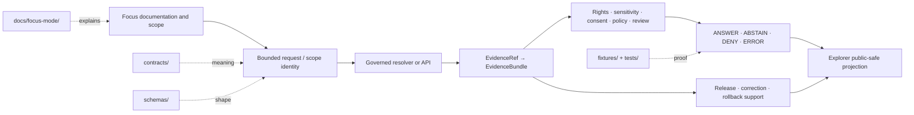

<!-- [KFM_META_BLOCK_V2]
doc_id: kfm://doc/focus-mode-readme
title: Focus Mode Documentation Control and Compatibility Lane
type: readme
version: v1.0
status: draft; repository-grounded; mixed-authority; compatibility-lane; bounded-implementation; non-release; non-publication
owner: "@bartytime4life via CODEOWNERS; Focus Mode stewardship and independent release authority NEEDS VERIFICATION"
created: 2026-05-21
updated: 2026-08-14
policy_label: public; documentation; focus-mode; composition-scope; governed-ai; compatibility; cite-or-abstain; non-publication
owning_root: docs/
responsibility: Explain and contain the current Focus Mode documentation surfaces, their bounded implementation relationships, and their unresolved placement and authority seams without accepting an ADR, creating a canonical path, activating policy, applying release state, or publishing a Focus Mode.
truth_posture: >-
  CONFIRMED current singular documentation lane, consent pattern, county and state
  subtrees, accepted Directory Rules v2, proposed ADR-0027 and ADR-0028,
  semantic contract and schema scaffolds, inactive Focus policy, bounded Explorer
  composed-claim projection, deterministic tests, and read-only mock workflow /
  PROPOSED Focus composition semantics, county and state control-plane decisions,
  future path convergence, domain-profile closure, and operational Focus runtime /
  CONFLICTED singular-versus-plural documentation placement, geographic-state
  versus system-state material, request-response contract and schema ownership,
  and Focus/focus_mode family naming / UNKNOWN authenticated Focus API service,
  live evidence and policy evaluation, accountable review authority, release,
  correction propagation, rollback execution, deployment, and public parity /
  NEEDS VERIFICATION exact-head hosted checks, complete county inventory and
  consistency, state-scope registration, validator integration, and migration
  consumer closure.
current_path: docs/focus-mode/README.md
evidence_snapshot:
  repository: bartytime4life/Kansas-Frontier-Matrix
  base_ref: main
  base_commit: d9bb2653860430f4929039f1af557415bf7e81db
  target_prior_blob: 008cf7b3496fdfe56ff3a23b12cb470c27dcf76e
  focus_mode_tree:
    consent_pattern_blob: 4fdc70ca51ece5b1f9821bf3d04abf62c65d24e5
    counties_tree: 0cab3e9e9c8b812fed257940e3e2b06fc20c1337
    state_tree: 4d555dff0911355209d274ce474afc18b0397d46
  directory_rules_blob: fd49a0b83e55cef52c1124281f093e263526898d
  directory_rules_decision: ADR-0029 accepted
  adr_0027_blob: 4dfb29c963cd5662265d3cb97f98be82212d5e08
  adr_0028_blob: d14ea2b4ad57294ab52da643c954a7f83d5e24e9
  focus_mode_contract_readme_blob: cf6faac30891f3f874f37a011b123bb6d473214e
  focus_schema_readme_blob: 5debcb6f96e5eaa2e5bd91effa8e9c16c50c2e8d
  focus_policy_readme_blob: 35001e958a6b51d2f22004d5e637d72baeab49af
  focus_panel_types_blob: 919ba17b92405d0998689ca8579fa42e74f4df60
  focus_panel_resolver_blob: 45aa4e7479a8c95138f98cc48c846f39a16aec2d
  focus_panel_test_blob: c32dbb2ccfa73b0b195aff3c231c19c5e8a19333
  focus_mock_workflow_blob: fbd56c7cda991ff8f3b804cc0c278e62daaa7abf
  focus_index_validator_blob: 89391d75680e859dddf3696b9b782369f364c73e
  validator_registry_blob: c65c1c2b27b85be4bdc3c42d0555c6e8e44698e2
inspection_boundary: >-
  Current-session GitHub reads covered the complete target, the direct Focus
  documentation tree, county and state landing/index/template surfaces, accepted
  Directory Rules v2, ADR-0027, ADR-0028, Focus semantic-contract and schema
  families, Focus policy, validator orchestration, the Explorer composed-claim
  projection and tests, and the read-only Focus mock workflow. No mounted clone,
  local command execution, live evidence resolver, policy evaluator, governed
  Focus API request, model call, release record, correction propagation, rollback
  drill, deployment, or public endpoint was exercised.
related:
  - ../doctrine/directory-rules.md
  - ../adr/ADR-0027-county-focus-mode-control-plane.md
  - "../adr/ADR-0028 — State-scale Focus Mode scope.md"
  - ../adr/ADR-0029-adopt-directory-governance-standard-v2.md
  - ./CONSENT_PATTERN.md
  - ./counties/README.md
  - ./counties/COUNTY_INDEX.md
  - ./state/README.md
  - ./state/STATE_INDEX.md
  - ../../contracts/focus_mode/README.md
  - ../../contracts/focus_mode/focus_mode_payload.md
  - ../../contracts/focus/README.md
  - ../../schemas/contracts/v1/focus/README.md
  - ../../policy/focus/README.md
  - ../../apps/explorer-web/src/features/focus_panel/README.md
  - ../../apps/explorer-web/tests/focus-composed-claim.test.ts
  - ../../.github/workflows/focus-mock-test.yml
  - ../../tools/validators/validate_focus_mode_index.py
  - ../../tools/validators/validator_registry.json
tags: [kfm, docs, focus-mode, composition-scope, county, state, governed-ai, evidence, finite-outcomes, compatibility, migration-hold, non-publication]
notes:
  - "v1.0 is a same-path repository-grounded modernization of the stale v0.3 planning README."
  - "This edition confirms the singular lane that exists, removes unsupported claims that a plural lane is already canonical, and records exact future placement as HOLD."
  - "The existing county and state subtrees are indexed without treating their internal proposals as accepted authority."
  - "The current Explorer composed-claim projection is acknowledged as bounded implementation; it is not represented as an authenticated end-to-end Focus runtime."
  - "Legacy section anchors from v0.3 are preserved for inbound-link compatibility."
[/KFM_META_BLOCK_V2] -->

<a id="top"></a>
<a id="docsfocus-modes--state--county-focus-mode-control-plane"></a>

# `docs/focus-mode/` — Focus Mode Documentation Control and Compatibility Lane

> **One-line purpose.** This tracked lane explains and contains the current Focus Mode planning, state-vocabulary, consent, and compatibility surfaces while the project resolves their final authority and placement. It is not a Focus runtime, policy decision, release record, or publication surface.

[](#status-and-authority)
[](#4-repo-fit)
[](#4-repo-fit)
[](#9-canonical-placement-table)
[](#current-implementation-maturity)
[](#current-implementation-maturity)
[](#current-implementation-maturity)
[](#22-what-a-focus-mode-is-not)

> [!IMPORTANT]
> **Focus Mode has two related but distinct meanings.** It is a governed runtime interaction that returns a finite response over bounded evidence, and it is a composition scope that organizes a proof slice across responsibility roots. Neither meaning creates source, evidence, policy, review, release, or publication authority.

> [!CAUTION]
> **The current path is repository-present but not declared the final canonical write target.** Accepted Directory Rules v2 says a Focus Mode is a composition scope with stable identity; it does not assign one exact Focus documentation tree. The plural `docs/focus-modes/` path is absent, while proposed ADR-0027 and ADR-0028 do not have acceptance authority. This README therefore receives a same-path documentation update and keeps structural convergence on **HOLD**.

> [!WARNING]
> **A green test, schema-valid envelope, county plan, state index, map projection, model response, pull request, or merge is not a Focus release.** Public use still requires evidence closure, policy and review, release records, correction lineage, and a usable rollback target appropriate to the claim and audience.

**Quick navigation:** [Status](#status-and-authority) · [Scope](#1-scope-and-what-this-lane-is) · [Meaning](#2-what-is-a-focus-mode) · [Scales](#3-scales-state-county-region-corridor) · [Repo fit](#4-repo-fit) · [Contents](#5-what-lives-here-what-does-not) · [Tree](#6-directory-layout-inside-docsfocus-modes) · [Control plane](#7-the-control-plane-in-this-directory) · [Composition](#8-cross-root-composition) · [Placement](#9-canonical-placement-table) · [Naming](#10-casing-convention-per-host-root) · [Lifecycle](#11-lifecycle-of-a-focus-mode-state-or-county) · [Trust flow](#12-trust-flow-inside-a-focus-mode) · [Support packet](#13-per-area-lane-required-files) · [Coverage](#14-domain--scale-coverage-matrix) · [Sensitivity](#15-sensitivity-defaults-fail-closed-lanes) · [Change procedure](#16-add-an-area-procedure-state-or-county) · [PR sequence](#17-recommended-first-pr-sequence) · [Checklist](#18-authoring-checklist) · [Validation](#19-validation-and-ci-hooks) · [ADRs](#20-adr-triggers) · [Registry](#21-focus-mode-registry-in-flight-drafts) · [Exclusions](#22-what-a-focus-mode-is-not) · [Open work](#23-drift-register-and-open-items) · [FAQ](#24-faq) · [References](#25-cross-references) · [Self-check](#26-readme-contract-self-check)

---

<a id="status-and-authority"></a>

## Status and authority

| Field | Current bounded result |
|---|---|
| **Tracked path** | `docs/focus-mode/README.md` — CONFIRMED at `main@d9bb2653860430f4929039f1af557415bf7e81db` |
| **Owning root** | `docs/` — human-facing explanation and navigation |
| **Local responsibility** | Contain and explain the existing mixed Focus documentation lane; do not settle its structural migration |
| **Directory authority** | ADR-0029 is accepted and adopts Directory Rules v2 at `docs/doctrine/directory-rules.md` |
| **County decision** | ADR-0027 is proposed; its older exact plural-path selection is not accepted authority |
| **State decision** | ADR-0028 is proposed; `kansas-state` identity, cardinality, domain profile, and mixed-state-tree split remain non-binding |
| **Current path disposition** | **PLACE** for this same-path documentation repair; **HOLD** for rename, move, split, plural-tree creation, or deletion |
| **Current implementation posture** | Bounded Explorer composed-claim projection and synthetic tests; inactive policy; no authenticated end-to-end Focus service |
| **Release/publication effect** | None |

This README is an explanatory and compatibility boundary. It cannot accept an ADR, register a scope, define machine shape, evaluate policy, authenticate evidence or review, apply release state, or make a public answer true.

[Back to top](#top)

---

<a id="1-scope-and-what-this-lane-is"></a>

## 1. Scope and what this lane is

The current lane contains four direct children:

```text
docs/focus-mode/
├── README.md
├── CONSENT_PATTERN.md
├── counties/
└── state/
```

It currently mixes three documentation responsibilities:

1. **Composition planning** — county plans, indexes, templates, source-seed notes, acceptance ideas, and proposed state-scale material.
2. **Cross-cutting state vocabulary** — finite outcomes, lifecycle, review, payload, revocation, transition, and rollback state documents.
3. **Consent and privacy guidance** — a fail-closed Focus consent pattern.

That mix is repository evidence, not a final design. This README makes the mixture visible so later governance work can split, migrate, retain, or supersede the correct objects without losing history or creating parallel authority.

In scope here:

- current navigation and responsibility boundaries;
- the two meanings of Focus Mode;
- current county, state, consent, contract, schema, policy, validator, Explorer, workflow, and release maturity;
- safe authoring and review rules;
- migration holds and acceptance evidence.

Out of scope here:

- accepting ADR-0027 or ADR-0028;
- choosing or creating a new canonical path;
- migrating the county corpus or state doctrine;
- activating policy or a model provider;
- creating source, evidence, review, release, correction, or rollback records;
- claiming deployment or KFM publication.

[Back to top](#top)

---

<a id="2-what-is-a-focus-mode"></a>

## 2. What is a Focus Mode?

A Focus Mode is a **bounded governed composition**, not a domain and not a truth store.

| Sense | Responsibility | Current bounded evidence | Must not become |
|---|---|---|---|
| **Runtime interaction** | Turn a bounded question and governed context into `ANSWER`, `ABSTAIN`, `DENY`, or `ERROR` | Explorer has a no-network composed-claim projection with strict parsing, EvidenceRef scope checks, fixed negative states, and synthetic tests | Browser model client, policy engine, evidence resolver, release authority |
| **Composition scope** | Identify a county, state, corridor, watershed, region, or other bounded proof slice and reference domain lanes | Directory Rules v2 requires a stable `scope_id` and reference composition | New root, new domain, copied canonical records, automatic public payload |
| **Documentation packet** | Explain scope, source roles, evidence needs, sensitivity, acceptance, and release dependencies | County and state planning corpora exist under this lane | Machine schema, policy source, emitted proof, release record |
| **Public-safe projection** | Carry only released or otherwise authorized evidence and trust state through governed interfaces | Semantic and schema scaffolds exist; one bounded Explorer projection is implemented | Sovereign truth or substitute for EvidenceBundle and ReleaseManifest |

The durable trust path remains:

```text
bounded request or scope
  -> governed context
  -> EvidenceRef resolution
  -> EvidenceBundle support
  -> rights / sensitivity / consent / policy / review
  -> finite response or held composition
  -> release, correction, and rollback records when public exposure is authorized
  -> governed API and public-safe UI projection
```

A map selection, `MapContextEnvelope`, county plan, state index, or AIReceipt may contribute context or process memory. None is evidence truth by itself.

[Back to top](#top)

---

<a id="3-scales-state-county-region-corridor"></a>

## 3. Scales: state, county, region, corridor

Accepted Directory Rules v2 names county, corridor, watershed, region, and Focus Mode as **composition scopes**. It requires a stable `scope_id`, references to governed domain lanes, scope-specific UI under the owning app, scope-specific fixtures under the owning fixture lane, and no copying of canonical domain records merely to fill a scope directory.

The current Focus documentation also contains proposals for county and Kansas-wide state compositions:

| Scope concept | Current repository evidence | Decision posture |
|---|---|---|
| County | `counties/COUNTY_INDEX.md`, a reusable template, numerous county directories, and county plans exist | Corpus is present; control-plane architecture and migration remain proposed under ADR-0027 |
| Kansas state | `state/STATE_INDEX.md` and a state template exist beside cross-cutting state doctrine | `kansas-state` and its coverage rule remain proposed under ADR-0028 |
| Region, corridor, watershed | Directory Rules recognizes them as composition scopes; this lane does not establish complete registries or releases | NEEDS VERIFICATION |
| Runtime state | Finite outcome, lifecycle, review, payload, revocation, transition, and rollback documents exist under `state/` | Cross-cutting state vocabulary, not geographic scope; placement remains conflicted |

> [!IMPORTANT]
> **Do not infer a state release from county Focus outputs.** State processing may use authoritative source records organized by county and may share scope-valid evidence. County Focus payloads, summaries, layers, or releases do not become the evidence root for a statewide claim merely because they can be aggregated.

> [!CAUTION]
> The old v0.3 README asserted a fixed 13-domain-by-scale matrix and treated an exact `-state` documentation grammar as the proposed extension. Current accepted Directory Rules v2 and proposed ADR-0028 narrow the safe conclusion: domain profiles, `kansas-state`, exact cardinality, and exact future paths require explicit acceptance and implementation evidence.

[Back to top](#top)

---

<a id="4-repo-fit"></a>

## 4. Repo fit

### Directory Rules basis

Accepted ADR-0029 adopts Directory Rules v2. Under §12.4, Focus Mode is a composition scope, not a root or domain. Under the general responsibility model:

- human explanations belong under `docs/`;
- semantic meaning belongs under `contracts/`;
- machine shape belongs under `schemas/`;
- admissibility belongs under `policy/`;
- fixtures and tests prove bounded behavior;
- app-local UI stays under the owning app;
- lifecycle objects stay under their lifecycle and object-family roots;
- release, correction, withdrawal, and rollback decisions stay under `release/`.

### Current path evidence

| Path | Current role | Safe conclusion |
|---|---|---|
| `docs/focus-mode/` | Mixed documentation and compatibility grouping | Present; final authority and migration unresolved |
| `docs/focus-modes/` | Exact plural alternative | Absent at the inspected base; absence does not authorize creation |
| `contracts/focus_mode/` | Focus payload semantic-contract lane | Present and draft |
| `contracts/focus/` | Minimal competing semantic stub | Present; ownership overlap needs resolution |
| `schemas/contracts/v1/focus/` | Request, response, citation-report scaffolds and a runtime-envelope alias | Present; mixed scaffolds and overlap |
| `schemas/contracts/v1/focus_mode/` | Previously proposed payload schema family | Absent at the inspected base |
| `policy/focus/` | Focus request/response and requirement rule scaffolds | Present but inactive and evaluator-unbound |
| `apps/explorer-web/src/features/focus_panel/` | App-local composed-claim projection | Present with TypeScript implementation and tests |
| `release/` and `data/published/` | Release decisions and public-safe carriers | No Focus release was established by this inspection |

No path in this table grants authority merely by existing. A structural change requires a reviewed path decision, consumer inventory, compatibility plan, validation, and rollback.

[Back to top](#top)

---

<a id="5-what-lives-here-what-does-not"></a>

## 5. What lives here, what does not

### Current direct contents

| Surface | Purpose | Current posture |
|---|---|---|
| [`README.md`](README.md) | Lane orientation, current evidence, authority and migration boundary | Repository-grounded draft |
| [`CONSENT_PATTERN.md`](CONSENT_PATTERN.md) | Privacy-first consent, revocation, redaction, and finite-outcome pattern | Draft guidance; no policy/runtime authority |
| [`counties/`](counties/) | County index, template, county plans, and many local README files | Large planning corpus with mixed maturity and naming |
| [`state/`](state/) | Cross-cutting state doctrine plus proposed Kansas-scale index/template | Mixed authority; geographic and system-state meanings collide |

### Does not belong here

| Artifact | Owning surface |
|---|---|
| JSON Schema | `schemas/contracts/v1/...` under an accepted family |
| Semantic object contract | `contracts/...` under the owning object family |
| Rego or other policy source | `policy/...` |
| Explorer implementation | `apps/explorer-web/...` |
| Governed API or model-adapter code | `apps/governed-api/`, runtime, or accepted implementation package |
| Source or EvidenceBundle instance | Governed registry, evidence, proof, or lifecycle lane |
| Receipt, proof, review, decision, manifest, correction, or rollback instance | Its accepted object-family lane |
| Public-safe payload or map carrier | `data/published/...` after governed release |
| Hidden chain-of-thought, provider trace, credentials, raw prompt bundle, or restricted coordinates | Nowhere in public documentation or client payloads |

[Back to top](#top)

---

<a id="6-directory-layout-inside-docsfocus-modes"></a>

## 6. Current directory layout

The current tracked tree is the evidence-bearing layout for this README:

```text
docs/focus-mode/
├── README.md
├── CONSENT_PATTERN.md
├── counties/
│   ├── README.md
│   ├── COUNTY_INDEX.md
│   ├── _template/
│   └── <many county directories and build plans>
└── state/
    ├── README.md
    ├── STATE_INDEX.md
    ├── _template/
    ├── finite-outcomes.md
    ├── lifecycle-states.md
    ├── map-context-state.md
    ├── payload-state.md
    ├── review-state.md
    ├── revocation-state.md
    └── transitions/
```

This is not presented as the target tree. It is the current tree that a future migration must classify without silent deletion or authority collapse.

### Reading order

| Need | Read first | Then |
|---|---|---|
| Understand the lane | This README | Directory Rules v2 and ADR-0027/0028 |
| Inspect county planning | [`counties/README.md`](counties/README.md) | [`COUNTY_INDEX.md`](counties/COUNTY_INDEX.md), template, selected county plans |
| Inspect system-state vocabulary | [`state/README.md`](state/README.md) | Finite outcomes, lifecycle, review, payload, revocation, and transitions |
| Inspect proposed state geography | [`state/STATE_INDEX.md`](state/STATE_INDEX.md) | State template and ADR-0028 |
| Inspect consent posture | [`CONSENT_PATTERN.md`](CONSENT_PATTERN.md) | Consent standards and domain-specific policy |
| Inspect current Explorer behavior | Explorer Focus Panel README | TypeScript projection, fixtures, and test |

[Back to top](#top)

---

<a id="7-the-control-plane-in-this-directory"></a>

## 7. The control plane in this directory

A documentation control plane should make work discoverable and reviewable without becoming machine or release authority.

The current Focus documentation surfaces provide:

- county and state planning indexes;
- templates and numerous scoped build plans;
- cross-cutting state vocabulary;
- consent and privacy guidance;
- links to semantic contracts, schemas, policy, UI, validators, workflows, and release requirements.

They do **not** currently establish one complete, accepted control plane because:

- the singular versus plural path is unresolved under current v2 authority;
- ADR-0027 and ADR-0028 remain proposed;
- county plans have inconsistent paths, filenames, local README maturity, and proposal depth;
- geographic state scope shares a directory with unrelated system-state doctrine;
- request/response, payload, and Focus family names overlap across contracts and schemas;
- the county index validator targets an absent plural layout and is not registered in the current validator orchestrator;
- no public Focus release packet was verified.

Treat indexes as collision-prevention and planning records. Treat templates as authoring aids. Treat validation as bounded evidence. None is canonical claim truth or release approval.

[Back to top](#top)

---

<a id="8-cross-root-composition"></a>

## 8. Cross-root composition

A Focus Mode composes references across responsibility roots. It must not duplicate the objects those roots own.


```mermaid
flowchart LR
  PLAN["Focus documentation and scope"] --> REQUEST["Bounded request / scope identity"]
  REQUEST --> API["Governed resolver or API"]
  API --> EVIDENCE["EvidenceRef → EvidenceBundle"]
  EVIDENCE --> POLICY["Rights · sensitivity · consent · policy · review"]
  POLICY --> OUTCOME["ANSWER · ABSTAIN · DENY · ERROR"]
  OUTCOME --> UI["Explorer public-safe projection"]
  EVIDENCE --> RELEASE["Release · correction · rollback support"]
  RELEASE --> UI

  CONTRACT["contracts/"] -. meaning .-> REQUEST
  SCHEMA["schemas/"] -. shape .-> REQUEST
  FIXTURE["fixtures/ + tests/"] -. proof .-> OUTCOME
  DOCS["docs/focus-mode/"] -. explains .-> PLAN
```

| Responsibility | Current relevant surface | Boundary |
|---|---|---|
| Scope and planning | `docs/focus-mode/` | Explains and indexes only |
| Payload semantics | `contracts/focus_mode/` | Meaning, not shape or authorization |
| Request/response semantics | `contracts/ui/`, `contracts/ai/focus_mode_*`, `contracts/focus/` | Overlapping proposals require convergence |
| Machine shape | `schemas/contracts/v1/focus/`, canonical runtime schemas | Scaffold and alias maturity varies |
| Policy | `policy/focus/` plus general evidence, consent, sensitivity, runtime, release policy | Focus-local policy currently inactive |
| Explorer projection | `apps/explorer-web/src/features/focus_panel/` | No-network browser projection over an injected governed resolver |
| Evidence | EvidenceRef/EvidenceBundle families | Must resolve before consequential `ANSWER` |
| Release | `release/` and public-safe carriers | Separate transition; none established here |

[Back to top](#top)

---

<a id="9-canonical-placement-table"></a>

## 9. Placement and authority table

The old heading is retained for link compatibility. The current result is not a table of already-canonical Focus paths; it is a table of responsibility owners and present disposition.

| Concern | Responsibility root | Current evidence | Disposition |
|---|---|---|---|
| This lane README | `docs/` | Existing tracked path | **PLACE** for same-path repair |
| County and state planning corpus | `docs/` | Existing singular subtree | **HOLD** for migration pending accepted path decision and consumer inventory |
| Cross-cutting state doctrine | `docs/` | Mixed into `state/` with geographic proposals | **SPLIT candidate / HOLD** pending authority decision |
| Focus payload semantics | `contracts/` | `contracts/focus_mode/` exists | **PLACE** as draft lane; resolve competing `contracts/focus/` and AI/UI semantics |
| Focus request/response shape | `schemas/` | `schemas/contracts/v1/focus/` scaffolds exist | **HOLD** for family ownership and schema hardening |
| Focus policy | `policy/` | Four Rego scaffolds plus README | **PLACE inactive scaffolds / HOLD activation** |
| Explorer Focus projection | `apps/` | Bounded TypeScript implementation and tests exist | **PLACE** under Explorer feature boundary |
| Focus index validation | `tools/validators/` | County-only validator exists but targets absent plural tree | **HOLD integration** until path/index contract is selected |
| Receipts and proofs | `data/receipts/`, `data/proofs/` or accepted families | No operational Focus packet verified | **HOLD** |
| Release, correction, rollback | `release/` and related receipt/proof lanes | No Focus release verified | **HOLD** |

A future `PathDecisionRecord` should identify the one responsibility owner for each artifact, classify aliases and compatibility windows, enumerate consumers, and define rollback before any move or deletion.

[Back to top](#top)

---

<a id="10-casing-convention-per-host-root"></a>

## 10. Naming and identity across roots

Directory Rules v2 distinguishes path slugs, language-native module names, object IDs, display labels, and storage locators. They do not need identical spelling, but each mapping must be explicit.

Current Focus spellings include:

```text
focus-mode       # current docs path segment
focus_mode       # semantic contract family and language-style identifier
focus            # schema, policy, and minimal contract family
focus_panel      # Explorer feature module
Focus Mode       # display label
```

This is not automatically wrong; the risk is **parallel authority**. A path family must have one primary responsibility and a documented relationship to aliases or adjacent families.

Safe rules for new work:

- do not create another Focus family solely to obtain preferred casing;
- do not infer canonicality from pluralization;
- register stable scope and object identities separately from paths;
- preserve externally referenced IDs through migration;
- use language conventions inside code roots without turning module names into repository-wide authority;
- require migration notes when a schema `$id`, link, import, or release reference contains the path.

[Back to top](#top)

---

<a id="11-lifecycle-of-a-focus-mode-state-or-county"></a>

## 11. Lifecycle of a Focus Mode

Focus scope maturity and KFM data lifecycle are separate axes.

```text
Scope planning:   proposed -> documented -> validated -> implementation-candidate
Runtime outcome:  ANSWER | ABSTAIN | DENY | ERROR
Data lifecycle:   RAW -> WORK / QUARANTINE -> PROCESSED -> CATALOG / TRIPLET -> PUBLISHED
Release lineage:  candidate -> reviewed decision -> released -> corrected / withdrawn / rolled back
```

A county or state plan may be detailed while the underlying data remains unadmitted or unreleased. An Explorer projection may pass synthetic tests while no governed service exists. A released source layer may exist while a Focus composition remains unreviewed.

Minimum safe transition toward public use:

1. register stable scope identity and profile;
2. resolve sources, rights, sensitivity, consent, evidence, and temporal support;
3. validate contracts, schemas, fixtures, policy, and bounded runtime behavior;
4. obtain accountable review and a finite release-family decision;
5. bind the public-safe carrier to evidence, release, correction, and rollback records;
6. verify governed API and UI parity;
7. retain prior state and correction lineage.

`ABSTAIN`, `DENY`, `ERROR`, `HOLD`, and quarantine are not interchangeable. Runtime outcomes, planning state, review state, lifecycle state, and release state must remain explicit.

[Back to top](#top)

---

<a id="12-trust-flow-inside-a-focus-mode"></a>

## 12. Trust flow inside a Focus Mode

```text
Explorer request or bounded fixture
  -> strict request parsing and scope identity
  -> governed resolver boundary
  -> response identity and EvidenceRef-scope validation
  -> evidence, policy, review, release, freshness, and citation projection
  -> fixed finite public copy
  -> Evidence Drawer handoff
  -> correction and rollback-aware public state
```

Current Explorer code proves a bounded subset of this flow:

- strict request and response parsing;
- closed `ANSWER`, `ABSTAIN`, `DENY`, `ERROR` outcomes;
- request/claim identity matching;
- EvidenceRef scope containment;
- citation and Evidence Drawer consistency checks;
- fixed no-leak negative-state copy;
- no browser transport inside the feature resolver;
- no direct model-provider, MapLibre, or lifecycle-store imports in the tested Focus sources;
- process-receipt labeling that explicitly says it is not release proof.

The code receives an **injected governed resolver**. It does not authenticate live evidence, run Focus policy, invoke a model, apply release state, or prove an API route exists. Exact-head test execution remains `NEEDS VERIFICATION` until CI completes for the reviewed revision.

[Back to top](#top)

---

<a id="13-per-area-lane-required-files"></a>

## 13. Required support packet, not a magic file list

The earlier README treated seven documentation files as universally required for every future lane. Current evidence does not establish that exact list as accepted doctrine. The safer rule is responsibility closure.

A material Focus composition should make the following support discoverable, whether through separate files, accepted registers, or referenced shared objects:

| Support | Required question |
|---|---|
| Scope identity | What stable `scope_id`, kind, geography, time, and profile are being composed? |
| Domain dispositions | Which domain-profile entries are populated, held, abstained, denied, or not applicable, and why? |
| Layer and carrier refs | Which released or candidate public-safe carriers are in scope? |
| Evidence model | Which EvidenceRefs resolve to which EvidenceBundles, source roles, limitations, and citations? |
| Rights and sensitivity | Which rights, consent, sovereignty, precision, audience, and transform rules apply? |
| Runtime contract | What bounded request/response and finite outcome shapes apply? |
| Validation | Which positive and negative fixtures, validators, tests, and exact tool/profile versions apply? |
| Review and release | Which accountable review, decision, manifest, correction, and rollback records bind public use? |
| Maintenance | How are freshness, supersession, revocation, correction, and consumer invalidation handled? |

Do not create duplicate per-scope copies of shared contracts, schemas, policy, or domain records merely to satisfy a checklist.

[Back to top](#top)

---

<a id="14-domain--scale-coverage-matrix"></a>

## 14. Domain and scale coverage

A Focus composition should not silently omit a domain that its accepted profile requires. However, the current README does not establish one accepted universal 13-domain profile.

Safe current posture:

- profiles are versioned and explicit;
- each required profile entry has one governed disposition;
- `populated` requires supported evidence, policy, review, and carrier references;
- `abstain` records insufficient support without inventing data;
- `deny` records a policy prohibition without exposing restricted reasons;
- candidate `hold` may record unresolved implementation or review, but does not satisfy release;
- missing, duplicate, aliased, or unsupported entries block profile closure;
- state and county compositions evaluate their own scope-valid support;
- one scale does not become the sovereign evidence root for another.

The exact profile vocabulary, cardinality, allowed candidate states, and release mapping remain governed decisions. ADR-0028 proposes one state-scale rule; it remains non-binding.

[Back to top](#top)

---

<a id="15-sensitivity-defaults-fail-closed-lanes"></a>

## 15. Sensitivity defaults

Focus Mode composes many domains, so the most restrictive applicable rights and sensitivity posture can control a requested projection.

Default fail-closed concerns include:

- living-person, genealogy, DNA, genomic, health, household, and private-land information;
- archaeology, sacred/cultural material, and protected-site locations;
- rare species, nests, dens, roosts, sensitive habitat, and field locations;
- critical or exploitable infrastructure and operational details;
- private wells, parcels, access credentials, protected source terms, and embargoed material;
- derived combinations that enable re-identification or harmful precision.

Required behavior:

1. resolve evidence and source roles;
2. check consent, rights, sensitivity, audience, purpose, release, and correction state;
3. apply redaction, generalization, suppression, or staged access before rendering;
4. preserve public-safe reason codes and obligations without leaking protected detail;
5. return `ABSTAIN`, `DENY`, or `ERROR` when support or enforcement is incomplete;
6. emit or reference the appropriate process memory without treating it as release proof.

The consent pattern in this lane is guidance. Current Focus policy is inactive and must not be represented as operational enforcement.

[Back to top](#top)

---

<a id="16-add-an-area-procedure-state-or-county"></a>

## 16. Add or revise a Focus scope safely

Before creating or materially expanding a county, state, region, corridor, or watershed Focus scope:

1. pin current main, Directory Rules, accepted ADRs, this lane, existing indexes, open branches, and overlapping pull requests;
2. determine whether the scope already exists under another identity or path;
3. register or propose a stable `scope_id` without treating a filename as identity;
4. select the versioned domain profile and record non-goals;
5. inventory source, evidence, rights, sensitivity, consent, precision, time, review, release, correction, and rollback dependencies;
6. choose the one owning root for each new artifact;
7. create the smallest dependency-closed fixture-first slice;
8. validate positive and negative behavior, no-network boundaries, link/metadata integrity, and rollback;
9. keep the work in candidate or draft state until governance and release gates close;
10. never copy canonical domain truth into a Focus docs folder.

A direct user request can authorize implementation work on a feature branch. It does not accept an ADR, establish source rights, authenticate review, or authorize public release.

[Back to top](#top)

---

<a id="17-recommended-first-pr-sequence"></a>

## 17. Recommended convergence sequence

The current dependency order is narrower than the old “create the plural control plane first” plan.

| Order | Review boundary | Result |
|---:|---|---|
| 1 | **Decision reconciliation** | Re-review ADR-0027 under accepted Directory Rules v2; resolve exact path authority, county index grammar, and compatibility strategy |
| 2 | **State-term split** | Accept/reject ADR-0028 and classify geographic state material separately from finite/lifecycle/review/payload/revocation state doctrine |
| 3 | **Contract and schema convergence** | Resolve `focus`, `focus_mode`, UI, AI-request, AI-response, and runtime-envelope ownership; close schemas and fixtures |
| 4 | **Validator convergence** | Align the county/state index contract with current paths; register validators in the orchestrator; add negative fixtures |
| 5 | **Runtime slice** | Bind the existing Explorer composed-claim projection to an authenticated governed resolver in an isolated no-network test profile |
| 6 | **Policy and evidence slice** | Activate reviewed Focus policy only with native tests, bundle/evaluator identity, EvidenceBundle resolution, and decision receipts |
| 7 | **Release and recovery slice** | Prove one public-safe Focus composition with release, correction, withdrawal, invalidation, and rollback evidence |
| 8 | **Structural migration** | Move, split, redirect, or retire legacy docs only after consumers, links, generated artifacts, and rollback are closed |

Each step should be independently reviewable. A later step must not use a proposed decision in the same packet as already-accepted authority.

[Back to top](#top)

---

<a id="18-authoring-checklist"></a>

## 18. Authoring checklist

Before changing Focus documentation:

- [ ] Read the complete current target and its immediate lane.
- [ ] Pin the base commit and target blob.
- [ ] Inspect accepted Directory Rules and relevant accepted ADRs.
- [ ] Treat ADR-0027 and ADR-0028 as proposed unless their source and index prove otherwise.
- [ ] Search for concurrent branches and pull requests.
- [ ] Separate geographic scope, runtime outcome, lifecycle state, review state, payload state, and release state.
- [ ] Preserve stable identities and existing inbound anchors.
- [ ] Mark implementation claims from current code/tests/workflows, not planning prose.
- [ ] Keep contracts, schemas, policy, fixtures, tests, receipts, proofs, decisions, releases, and carriers in their owning roots.
- [ ] Do not expose private diagnostics, restricted coordinates, raw prompts, credentials, or hidden reasoning.
- [ ] Define changed-area validation and rollback.
- [ ] Keep publication and repository-settings changes out of ordinary documentation PRs.

[Back to top](#top)

---

<a id="19-validation-and-ci-hooks"></a>

## 19. Validation and CI hooks

### Current bounded validation surfaces

| Surface | What it proves | What it does not prove |
|---|---|---|
| Explorer unit test `focus-composed-claim.test.ts` | Strict parsing, finite outcomes, EvidenceRef containment, no-leak copy, and no-network/provider/lifecycle-import boundaries over synthetic fixtures | Live API, policy, evidence authenticity, review, release, deployment |
| `focus-mock-test` workflow | Static mock-boundary readiness plus deterministic finite-envelope and MockAdapter proof | Operational Focus runtime or public answer |
| `validate_focus_mode_index.py` | Proposed county-index and lane rules for the plural layout it was written against | Current singular-lane conformance, state scope, payload admission, release |
| Validator orchestrator | Deterministic registered validator execution | The Focus index validator is not currently registered |
| Docs workflows | Metadata, Markdown, links, document graph, staleness, topology, and changed-area checks as configured | Runtime behavior or release authority |

### Repository-native commands for a focused implementation review

```bash
pnpm --filter explorer-web run test:unit
pnpm --filter explorer-web run build
python tools/validate_all.py --validate-registry
```

The direct county-index validator should not be presented as a passing canonical check against the current singular tree. Its contract and target path must first be reconciled.

For this README, required hosted evidence includes documentation metadata, Markdown/build, link, document-graph, staleness, topology, and changed-area checks. Pending CI is reported as pending, not passed.

[Back to top](#top)

---

<a id="20-adr-triggers"></a>

## 20. ADR triggers

An accepted decision or migration record is required before work that materially changes:

- the canonical Focus documentation path or alias window;
- county or state control-plane identity and index grammar;
- the meaning or cardinality of `kansas-state`;
- the versioned domain profile and release dispositions;
- the split between geographic state scope and system-state doctrine;
- contract or schema authority among `focus`, `focus_mode`, UI, AI, and runtime families;
- policy package, bundle, evaluator, or outcome semantics;
- public API or model-adapter boundary;
- release, correction, withdrawal, or rollback authority;
- a path embedded in schema `$id`, public URI, release manifest, or external consumer.

Documentation may record a proposal and its evidence. It must not use its own proposed text as authority for the dependent change.

[Back to top](#top)

---

<a id="21-focus-mode-registry-in-flight-drafts"></a>

## 21. Current registry and draft surfaces

| Surface | Current evidence | Trust label |
|---|---|---|
| County index | `counties/COUNTY_INDEX.md` enumerates the 105 Kansas counties | CONFIRMED file; registry semantics and lane parity NEEDS VERIFICATION |
| County template | `counties/_template/county-build-plan.md` exists | CONFIRMED authoring aid; not release contract |
| County corpus | Numerous snake_case county directories and plans exist with inconsistent local README and filename maturity | CONFIRMED mixed corpus |
| State index | `state/STATE_INDEX.md` contains proposed Kansas-scale material | CONFIRMED file; state composition remains PROPOSED |
| State template | `state/_template/state-build-plan.md` exists | CONFIRMED authoring aid; not accepted state scope |
| State doctrine | Finite-outcome, lifecycle, map-context, payload, review, revocation, and transition docs exist | CONFIRMED files; placement and authority conflicted |
| Consent pattern | Top-level consent pattern exists | CONFIRMED draft guidance |
| Explorer projection | Composed-claim feature source and synthetic tests exist | CONFIRMED bounded implementation |
| Operational release registry | No Focus release packet was verified | UNKNOWN / HOLD |

Indexes should carry identity, status, owner route, evidence needs, and validation state honestly. They must not claim release merely because documentation exists.

[Back to top](#top)

---

<a id="22-what-a-focus-mode-is-not"></a>

## 22. What a Focus Mode is not

A Focus Mode is not:

- a new root or domain;
- a duplicate database of county or state truth;
- a map viewport treated as evidence;
- a browser model client;
- an unrestricted prompt-to-answer path;
- an excuse to expose canonical, RAW, WORK, QUARANTINE, private graph/vector, model, or registry stores;
- a county plan or state index treated as a public payload;
- a policy result treated as evidence truth;
- an AIReceipt treated as proof or release approval;
- a schema-valid envelope treated as a true answer;
- a test or workflow pass treated as a release;
- a hidden-detail filter applied only in the browser;
- a release without correction, withdrawal, and rollback support.

Maps, tiles, summaries, graph projections, scenes, screenshots, exports, and generated language remain downstream carriers.

[Back to top](#top)

---

<a id="23-drift-register-and-open-items"></a>

## 23. Drift register and open items

| ID | Status | Open item | Closure evidence |
|---|---|---|---|
| `FM-01` | **CONFLICTED** | Singular current docs path versus plural proposal | Accepted path decision, consumer inventory, alias and rollback plan |
| `FM-02` | **CONFLICTED** | Geographic state scope mixed with system-state doctrine | Reviewed split/migration decision and repaired links |
| `FM-03` | **PROPOSED** | ADR-0027 county control-plane architecture | Acceptance or supersession under v2 authority |
| `FM-04` | **PROPOSED** | ADR-0028 `kansas-state`, domain-profile, and cross-scale rules | Acceptance or rejection plus implementation packet |
| `FM-05` | **CONFLICTED** | `contracts/focus/`, `contracts/focus_mode/`, UI and AI request/response semantics overlap | One accepted object-family map and compatibility plan |
| `FM-06` | **CONFLICTED** | `schemas/contracts/v1/focus/` scaffolds versus absent `focus_mode/` payload family and UI schema references | Closed schemas, owner decision, fixtures, migration tests |
| `FM-07` | **HOLD** | Focus policy is inactive and package names diverge | Reviewed rules, native tests, bundle/evaluator binding, governed consumer |
| `FM-08` | **HOLD** | County index validator targets absent plural layout and is unregistered | Selected path/index contract, registry wiring, positive/negative runs |
| `FM-09` | **NEEDS VERIFICATION** | County-plan completeness, naming, local README maturity, and link health | Recursive inventory and ratcheted report |
| `FM-10` | **NEEDS VERIFICATION** | Exact-head Explorer composed-claim tests and build | Hosted or local execution tied to reviewed head |
| `FM-11` | **UNKNOWN** | Authenticated Focus resolver/API, evidence/policy execution, receipts, and replay | Runtime contract, route, logs, fixtures, decisions, receipts |
| `FM-12` | **HOLD** | First governed Focus release, correction, withdrawal, and rollback | Isolated public-safe release and recovery drill |
| `FM-13` | **UNKNOWN** | Production/public parity across API, Explorer, cache, export, and AI surfaces | Deployment, public-safe probes, correction propagation evidence |

Do not close a drift item merely by changing prose. Close it with the authority, bytes, tests, migration, and rollback evidence appropriate to its consequence.

[Back to top](#top)

---

<a id="24-faq"></a>

## 24. FAQ

### Is `docs/focus-mode/` canonical?

**CONFIRMED:** it is the current tracked path. **UNKNOWN / HOLD:** its final canonical write status. Directory Rules v2 does not choose an exact Focus docs tree, and the relevant Focus ADRs remain proposed.

### Should a new `docs/focus-modes/` tree be created now?

Not from this README alone. First resolve authority, consumers, index grammar, state-term split, compatibility window, validation, and rollback. Creating the plural tree prematurely would create another independently writable authority.

### Does the county index prove all county Focus Modes are implemented?

No. It proves an index exists. Plans and folders have mixed maturity; payload, policy, evidence, release, correction, and rollback closure must be checked separately.

### Does the state index prove a Kansas state Focus Mode exists?

No. It is proposed planning material. ADR-0028 remains proposed, and no verified state payload, governed request, release, correction, or rollback was established.

### Is Focus Mode implemented in Explorer?

A bounded composed-claim projection is implemented and has synthetic tests. It strictly parses, checks identity and EvidenceRef scope, produces fixed finite states, and avoids direct network/provider/lifecycle imports. That is not an authenticated end-to-end Focus service or a public release.

### Is Focus policy active?

No safe evidence supports that conclusion. The current Focus Rego files are scaffolds, are not evaluated by the Focus mock workflow, and lack an accepted bundle/evaluator/consumer integration.

### Can AI answer without evidence because the question is harmless?

No consequential answer bypasses cite-or-abstain. Missing, stale, conflicted, unauthorized, or out-of-scope support yields `ABSTAIN`, `DENY`, or `ERROR` as appropriate.

### Does consent alone authorize display?

No. Consent is necessary where applicable but not sufficient. Evidence, rights, sensitivity, policy, review, release, correction, and rollback posture still control.

[Back to top](#top)

---

<a id="25-cross-references"></a>

## 25. Cross-references

| Concern | Reference | Current posture |
|---|---|---|
| Adopted placement law | [`../doctrine/directory-rules.md`](../doctrine/directory-rules.md) | Accepted exact bytes through ADR-0029 |
| County control-plane decision | [`../adr/ADR-0027-county-focus-mode-control-plane.md`](../adr/ADR-0027-county-focus-mode-control-plane.md) | Proposed |
| State-scale decision | [`ADR-0028 — State-scale Focus Mode scope.md`](../adr/ADR-0028%20%E2%80%94%20State-scale%20Focus%20Mode%20scope.md) | Proposed |
| Directory adoption decision | [`../adr/ADR-0029-adopt-directory-governance-standard-v2.md`](../adr/ADR-0029-adopt-directory-governance-standard-v2.md) | Accepted |
| County landing | [`counties/README.md`](counties/README.md) | Draft / stale authority claims require reconciliation |
| County index | [`counties/COUNTY_INDEX.md`](counties/COUNTY_INDEX.md) | Planning registry |
| State landing | [`state/README.md`](state/README.md) | Mixed state doctrine |
| State index | [`state/STATE_INDEX.md`](state/STATE_INDEX.md) | Proposed state composition |
| Consent | [`CONSENT_PATTERN.md`](CONSENT_PATTERN.md) | Draft pattern |
| Payload semantics | [`../../contracts/focus_mode/README.md`](../../contracts/focus_mode/README.md) | Draft semantic lane |
| Machine shape | [`../../schemas/contracts/v1/focus/README.md`](../../schemas/contracts/v1/focus/README.md) | Mixed scaffolds and alias |
| Policy | [`../../policy/focus/README.md`](../../policy/focus/README.md) | Repository-grounded inactive boundary |
| Explorer feature | [`../../apps/explorer-web/src/features/focus_panel/README.md`](../../apps/explorer-web/src/features/focus_panel/README.md) | Bounded implementation and open runtime work |
| Explorer test | [`../../apps/explorer-web/tests/focus-composed-claim.test.ts`](../../apps/explorer-web/tests/focus-composed-claim.test.ts) | Synthetic unit proof; execution state separate |
| Mock workflow | [`../../.github/workflows/focus-mock-test.yml`](../../.github/workflows/focus-mock-test.yml) | Read-only bounded workflow and explicit hold |
| County index validator | [`../../tools/validators/validate_focus_mode_index.py`](../../tools/validators/validate_focus_mode_index.py) | Proposed and not aligned to current lane |
| Validator registry | [`../../tools/validators/validator_registry.json`](../../tools/validators/validator_registry.json) | Focus index validator not registered |

[Back to top](#top)

---

<a id="26-readme-contract-self-check"></a>

## 26. README contract self-check

| Requirement | This edition |
|---|---|
| Purpose and responsibility | Defines this lane as explanatory and compatibility documentation |
| Authority boundary | Keeps docs separate from contracts, schemas, policy, evidence, review, release, and publication |
| Current inventory | Records the direct tree and high-signal cross-root implementation surfaces |
| Truth labels | Separates confirmed bytes from proposals, conflicts, unknowns, and verification work |
| Directory Rules basis | Uses accepted v2 and refuses to infer an exact future path |
| Inputs and outputs | Explains scope/request inputs and finite public-safe projections |
| Exposure and sensitivity | Preserves governed interfaces, cite-or-abstain, consent, redaction, and fail-closed behavior |
| Validation | Names current bounded tests/workflows and their limits |
| Review burden | Identifies proposed ADRs, migration triggers, and independent-authority gaps |
| Rollback | Same-path documentation can be reverted without operational state mutation |
| Legacy compatibility | Preserves the v0.3 section anchors used by inbound links |
| Publication boundary | States that this file performs no release, deployment, activation, or publication |

### Rollback

Revert the documentation commit or restore prior target blob:

```text
008cf7b3496fdfe56ff3a23b12cb470c27dcf76e
```

This README changes no contract, schema, policy rule, fixture, validator, workflow, app code, receipt, proof, review, release record, lifecycle state, deployment, or public surface.

### Change history

| Edition | Date | Change | Authority effect |
|---|---|---|---|
| v0.3 | 2026-05-23 | Proposed plural state-and-county control plane under older Directory Rules assumptions | None; proposal only |
| **v1.0** | **2026-08-14** | Reconciled current singular tree, accepted Directory Rules v2, proposed ADRs, bounded Explorer implementation, inactive policy, schema/contract drift, validation, and migration holds | **None — documentation only** |

### Re-review triggers

Review this README when:

- ADR-0027 or ADR-0028 changes status or is superseded;
- a Focus path decision, split, alias, or migration lands;
- county or state indexes change grammar;
- Focus contracts or schema authority converge;
- policy becomes active;
- the governed Focus API/resolver is implemented;
- a Focus release, correction, withdrawal, or rollback is exercised;
- the Explorer composed-claim profile changes materially;
- six months pass.

[Back to top](#top)
