<!-- [KFM_META_BLOCK_V2]
doc_id: kfm://doc/focus-mode-counties-readme
title: County Focus Modes — Index
type: standard
version: v0.1
status: draft
owners: <TODO — KFM doctrine maintainers; NEEDS_VERIFICATION>
created: 2026-05-21
updated: 2026-05-21
policy_label: public-draft
related: [../README.md, ../../doctrine/directory-rules.md, ../../../contracts/focus_mode/README.md, ../../../schemas/contracts/v1/focus_mode/README.md, ../../../fixtures/focus_modes/README.md]
tags: [kfm, focus-mode, county, index, doctrine, directory]
notes: [PROPOSED location; see § Path divergence note and the v1.2 canonical at docs/focus-modes/README.md., No mounted repository was inspected when authoring this index., Every per-county sub-link is PROPOSED until a mounted checkout confirms its location.]
[/KFM_META_BLOCK_V2] -->

<a id="top"></a>

# County Focus Modes — Index

> Orientation surface for Kansas Frontier Matrix (KFM) **county-scoped Focus Modes**: their scope, governed object model, lifecycle posture, the counties currently drafted, and how a new county is admitted into the pattern.

[](#operating-posture)
[](#scope)
[](#operating-posture)
[](#lifecycle-posture)
[](#operating-posture)
[](#path-divergence-note)
[](#what-belongs-here)

**Status:** `DRAFT` · `PROPOSED` · `NEEDS_VERIFICATION`  
**Owners:** _TODO — KFM doctrine maintainers_  
**Last updated:** 2026-05-21  
**Repo access mode:** `NO_MOUNTED_REPO_EVIDENCE`

---

## Mini-TOC

- [Operating posture](#operating-posture)
- [Path divergence note](#path-divergence-note)
- [Scope](#scope)
- [Repo fit](#repo-fit)
- [What belongs here](#what-belongs-here)
- [What does not belong here](#what-does-not-belong-here)
- [Directory tree (PROPOSED)](#directory-tree-proposed)
- [Pattern diagram](#pattern-diagram)
- [County roster](#county-roster)
- [Lifecycle posture](#lifecycle-posture)
- [Adding a new county](#adding-a-new-county)
- [Acceptance task list](#acceptance-task-list)
- [FAQ](#faq)
- [Open verification questions](#open-verification-questions)
- [Related docs](#related-docs)
- [Appendix · Per-root path map](#appendix--per-root-path-map)

---

## Operating posture

> [!IMPORTANT]
> **A county Focus Mode is a governed *proof slice*, not a county encyclopedia, dashboard, or tour map.** It must preserve KFM's core invariants:
>
> - `EvidenceBundle` outranks generated language.
> - Public clients consume **governed APIs, released artifacts, catalog records, tile services, and policy-safe runtime envelopes** — never `RAW`, `WORK`, `QUARANTINE`, or canonical/internal stores.
> - Publication is a **governed state transition**, not a file move. A county does not become public without a `ReleaseManifest` and a rollback target.
> - AI outputs are **downstream carriers**, not sovereign truth. `AIReceipt` and finite outcomes (`ANSWER` / `ABSTAIN` / `DENY`) are mandatory on every governed AI surface.
> - Sensitive detail — exact archaeology, sacred/burial sites, rare-species precise locations, private-person, household, well, parcel-as-title, infrastructure-vulnerability, and active-operations data — is **denied or generalized by default**, with transforms and reasons recorded.

`CONFIRMED` (KFM doctrine corpus) — *Directory Rules* §6.7 (Focus Mode pattern), §7.1 (trust membrane), §9 (lifecycle invariant); per-county build plans in the [County roster](#county-roster) restate this posture.

[Back to top](#top)

---

## Path divergence note

> [!WARNING]
> This README sits at `docs/focus-mode/counties/README.md`. That path **does not match the v1.2 PROPOSED canonical** location given by *Directory Rules* §6.7.2, §6.7.3, and §18.d / `OPEN-DR-08`. Three drifts are present and unresolved.

| Drift | This README's path | v1.2 PROPOSED canonical | Used in some build plans |
|---|---|---|---|
| Plurality (`docs/`) | `focus-mode/` (singular kebab-case) | `focus-modes/` (plural kebab-case) | `focus_modes/` (plural snake_case, e.g. Crawford, Saline build plans) |
| Intermediate grouping | `counties/` (county-scope folder) | flat — counties sit directly under the parent | `counties/` (Crawford, Saline) |
| Per-county leaf name | `<area>/` (area-only) | `<area>-county/` (with `-county` suffix) | `<area>/` (Crawford, Saline) |

Until an `ADR` resolves the placement:

- This file is treated as **`PROPOSED`**. Its links to per-county subdirectories are also `PROPOSED`.
- The existing per-county build plans (see [County roster](#county-roster)) reference the v1.2 canonical layout in their own `related:` blocks (`docs/focus-modes/<area>-county/build-plan.md`); two build plans (Crawford, Saline) reference yet a third style (`docs/focus_modes/counties/<area>/`). **None of those references matches this README's siblings.** Resolution requires either an `ADR` retiring the v1.2 PROPOSED layout or a coordinated revision of every per-county build plan plus this README.
- **Do not** convert this README into evidence that `docs/focus-mode/counties/` is the canonical home. It is not, until an `ADR` says so.

`PROPOSED` — placement choice. `NEEDS_VERIFICATION` — *Directory Rules* §6.7.x reconciliation against a mounted repository.

[Back to top](#top)

---

## Scope

A **county Focus Mode** is one specialization of the broader KFM `Focus Mode` pattern (*Directory Rules* §6.7). A Focus Mode is an **area-scoped composition** that binds, for a named area:

- catalog records (`SourceDescriptor`, STAC records),
- published layer artifacts (PMTiles, vector layers, raster sets),
- evidence (`EvidenceRef` → `EvidenceBundle`),
- governed API payloads (`FocusModePayload`, `LayerRegistryEntry`, `AtlasCard`),
- policy posture (`PolicyDecision`, sensitivity tier),
- release state (`ReleaseManifest`, `RollbackPlan`),
- and an `apps/explorer-web/` UI shell.

The **county** specialization restricts the area to a single Kansas county. Per §6.7.4, **one area equals one Focus Mode composition** — a multi-county region (a corridor, a watershed, a settlement system) is a *different* Focus Mode with its own area name and does not mirror under each member county.

`CONFIRMED` (corpus doctrine). `INFERRED` — that this README's purpose is to index the county specialization specifically, given the requested `counties/` scope of the parent folder.

[Back to top](#top)

---

## Repo fit

This README is an **orientation lane** in `docs/`. It does not host schemas, contracts, policies, fixtures, runtime code, release artifacts, or published data. Those live in their canonical homes — see [Appendix · Per-root path map](#appendix--per-root-path-map).

| Direction | Path (`PROPOSED`) | Authority class |
|---|---|---|
| Parent | `docs/focus-mode/README.md` | Documentation lane (the v1.2 canonical is `docs/focus-modes/README.md`) |
| Siblings of this folder | `docs/focus-mode/corridors/`, `docs/focus-mode/watersheds/`, `docs/focus-mode/regions/` (illustrative) | Future area-type folders, if the `counties/` grouping pattern is adopted |
| Children of this folder | `./<area>/build-plan.md`, `./<area>/layer-registry.md`, `./<area>/acceptance-checklist.md`, `./<area>/source-seed-list.md`, plus area-specific sensitivity notes | One subfolder per drafted county |

[Back to top](#top)

---

## What belongs here

- **Per-county `README.md`** — short orientation per county pointing to its build plan and supporting notes.
- **`build-plan.md`** per county — the long-form governed proof-slice plan. Sixteen such drafts exist in the project corpus today; see [County roster](#county-roster).
- **`layer-registry.md`** per county — the public-safe layer catalog (`LayerRegistryEntry` instances by name with policy posture).
- **`acceptance-checklist.md`** per county — the gating checklist before a county Focus Mode advances to a `ReleaseCandidate`.
- **`source-seed-list.md`** per county — candidate sources, **not** yet `SourceDescriptor` evidence.
- **Per-county sensitivity / public-safety notes** (e.g., `mining-and-remediation-notes.md`, `private-well-privacy-notes.md`, `military-installation-notes.md`) when the county profile warrants them.
- **This `README.md`** — the index itself.

> [!NOTE]
> Every file above is **documentation / control-plane**. Documentation does not by itself satisfy any KFM lifecycle gate. A county does not become "released" because its documentation is complete.

[Back to top](#top)

---

## What does not belong here

- ❌ **Schema files** (`*.schema.json`) — they belong at the canonical schema home per `ADR-0001`. Most likely `schemas/contracts/v1/focus_mode/`.
- ❌ **Contract README files** describing the `FocusModePayload` / `LayerRegistryEntry` / `AtlasCard` contracts themselves — those belong under `contracts/focus_mode/`.
- ❌ **Rego policies** (`*.rego`) — they belong under `policy/` (or `policies/`; the singular/plural split is itself an open drift item).
- ❌ **Fixtures** — `valid/` and `invalid/` JSON test bundles belong under `fixtures/focus_modes/<area>/`.
- ❌ **UI code** — the canonical map-first shell lives at `apps/explorer-web/src/focus-modes/<area>/`. **Not** `apps/web/`. See *Directory Rules* §7.1.a and `OPEN-DR-06`.
- ❌ **Published data, tiles, STAC catalog records** — those live under `data/published/layers/<area>/` and `data/catalog/stac/focus_modes/counties/<area>/`.
- ❌ **Release manifests and rollback plans** — those live under `release/manifests/` and `release/candidates/`.
- ❌ **Validators** (Python or otherwise) — they live under `tools/validators/`.
- ❌ **Domain content** (hydrology, soil, fauna, flora, …) treated as if it were focus-mode content. Domains are a separate placement under *Directory Rules* §12 (Domain Placement Law); Focus Modes compose across domains but **are not themselves domains** (§6.7.5).

[Back to top](#top)

---

## Directory tree (PROPOSED)

> [!CAUTION]
> The tree below is `PROPOSED` and **not verified against a mounted repository**. The flat `<area>/` leaf naming (no `-county` suffix) follows the convention used in `contracts/focus_mode/` and `fixtures/focus_modes/`, where the scope-bearing parent already encodes the area type. It does **not** match the `related:` references in the existing per-county build plans, which use `docs/focus-modes/<area>-county/`. See [Path divergence note](#path-divergence-note).

```text
docs/focus-mode/counties/
├── README.md                            ← THIS FILE
├── ellsworth/
│   ├── README.md
│   ├── build-plan.md
│   ├── layer-registry.md
│   ├── acceptance-checklist.md
│   ├── source-seed-list.md
│   └── <sensitivity-notes>.md           # per-county; not always present
├── riley/
├── shawnee/
├── ford/
├── wyandotte/
├── sedgwick/
├── douglas/
├── leavenworth/
├── reno/
├── johnson/
├── barton/
├── geary/
├── finney/
├── cherokee/
├── saline/
└── crawford/
```

[Back to top](#top)

---

## Pattern diagram

A county Focus Mode composes across **multiple responsibility roots**. The diagram shows the **flow of evidence and authority**, not file containment.

```mermaid
flowchart LR
    subgraph DOCS["docs/focus-mode/counties/&lt;area&gt;/"]
        direction TB
        D1[build-plan.md]
        D2[layer-registry.md]
        D3[acceptance-checklist.md]
        D4[source-seed-list.md]
    end

    subgraph CONTRACTS["contracts/focus_mode/ + schemas/contracts/v1/focus_mode/"]
        direction TB
        C1[FocusModePayload]
        C2[LayerRegistryEntry]
        C3[AtlasCard]
    end

    subgraph EVIDENCE["EvidenceRef &rarr; EvidenceBundle"]
        direction TB
        E1[SourceDescriptor]
        E2[EvidenceBundle]
    end

    subgraph DATA["data/catalog/ &rarr; data/published/"]
        direction TB
        DT1[STAC records]
        DT2[Published layers]
    end

    subgraph RELEASE["release/"]
        direction TB
        R1[ReleaseManifest]
        R2[RollbackPlan]
    end

    subgraph APPS["apps/explorer-web/src/focus-modes/&lt;area&gt;/"]
        direction TB
        U1[Map shell]
        U2[Evidence Drawer]
        U3[AI panel · finite outcomes]
    end

    subgraph POLICY["policy/ · OPA"]
        P1[Publication gates]
        P2[Sensitivity gates]
    end

    DOCS    -.specifies.-> CONTRACTS
    DOCS    -.specifies.-> EVIDENCE
    EVIDENCE --> CONTRACTS
    CONTRACTS --> DATA
    DATA --> RELEASE
    POLICY --> RELEASE
    RELEASE --> APPS
    EVIDENCE --> APPS
    POLICY --> APPS
```



`PROPOSED` — diagram reflects the v1.2 canonical placements per *Directory Rules* §6.7.2; the `DOCS` node uses **this** README's `docs/focus-mode/counties/` placement, which is itself `PROPOSED` (see [Path divergence note](#path-divergence-note)).

[Back to top](#top)

---

## County roster

Sixteen county Focus Mode build plans are present in the project corpus as of 2026-05-21. None has been verified against a mounted repository. The **Ordinal** column reflects the **drafting order asserted by each plan's own narrative**, not a release order.

| # | County | Drafting focus profile | Status | Plan (`PROPOSED` link) |
|---|---|---|---|---|
| 1 | **Ellsworth** | Frontier county history; Fort Harker / Kanopolis; settlement; environmental baseline | draft | [./ellsworth/build-plan.md](./ellsworth/build-plan.md) |
| 2 | **Riley** | Flint Hills ecology; Fort Riley; Konza Prairie; research-site sensitivity; rivers | draft | [./riley/build-plan.md](./riley/build-plan.md) |
| 3 | **Shawnee** | State government; civil-rights history; Topeka urban geography; archives | draft | [./shawnee/build-plan.md](./shawnee/build-plan.md) |
| 4 | **Ford** | Dodge City; Santa Fe Trail; Fort Dodge; Arkansas River; High Plains agriculture | draft | [./ford/build-plan.md](./ford/build-plan.md) |
| 5 | **Wyandotte** | Urban governance; river confluence; tribal/burial sensitivity; environmental justice; rail/industry | draft | [./wyandotte/build-plan.md](./wyandotte/build-plan.md) |
| 6 | **Sedgwick** | Wichita metro; aviation; Chisholm Trail; severe weather; public health; infrastructure | draft | [./sedgwick/build-plan.md](./sedgwick/build-plan.md) |
| 7 | **Douglas** | Free-State / Bleeding Kansas; KU; Haskell; rivers; archives; traumatic public memory | draft | [./douglas/build-plan.md](./douglas/build-plan.md) |
| 8 | **Leavenworth** | Fort Leavenworth; Missouri River; territorial politics; corrections; military education | draft | [./leavenworth/build-plan.md](./leavenworth/build-plan.md) |
| 9 | **Reno** | Hutchinson; salt mining; Cosmosphere; Arkansas lowlands; wetlands; State Fair | draft | [./reno/build-plan.md](./reno/build-plan.md) |
| 10 | **Johnson** | Suburban metro; archives; streamways; corporate campuses; property/privacy | draft | [./johnson/build-plan.md](./johnson/build-plan.md) |
| 11 | **Barton** | Great Bend; Cheyenne Bottoms; Central Flyway; Santa Fe Trail; wetlands; oil/wheat | draft | [./barton/build-plan.md](./barton/build-plan.md) |
| 12 | **Geary** | Junction City; Fort Riley community-facing; Milford Lake; river confluence; recreation | draft | [./geary/build-plan.md](./geary/build-plan.md) |
| 13 | **Finney** | Garden City; Ogallala Aquifer; irrigation; meatpacking; immigration/labor | draft | [./finney/build-plan.md](./finney/build-plan.md) |
| 14 | **Cherokee** | Galena / Baxter Springs; Tri-State lead-zinc mining; Route 66; Big Brutus; Spring River | draft | [./cherokee/build-plan.md](./cherokee/build-plan.md) |
| 15 | **Saline** | Salina hub; Smoky Hill / Saline River; floodplain; civic GIS; agriculture | draft | [./saline/build-plan.md](./saline/build-plan.md) |
| 16 | **Crawford** | Pittsburg; Tri-State coal field; mined-land ecology; floodplain updates; agriculture | draft | [./crawford/build-plan.md](./crawford/build-plan.md) |

`CONFIRMED` (corpus) — the existence of 16 county build plans and their drafting focus profiles, drawn from each plan's `Purpose:` line and `Why <County>` section.  
`PROPOSED` — every link target, because (a) the live repository is not mounted in this session and (b) each existing build plan's own `related:` block references a different path style than the sibling layout used here.

[Back to top](#top)

---

## Lifecycle posture

A county Focus Mode follows KFM's lifecycle invariant exactly. **Documentation in this folder does not advance lifecycle state.**


| Phase | County-level meaning | Documentation home |
|---|---|---|
| `RAW` | Source fetches into `data/raw/<domain>/<source_id>/<run_id>/` | not here |
| `WORK / QUARANTINE` | Normalization, rights review, sensitivity review | not here |
| `PROCESSED` | Validated, source-roled, evidence-resolved domain records | not here |
| `CATALOG / TRIPLET` | STAC + triplet/graph + `SourceDescriptor` for area-scoped slice | `data/catalog/...` (not here) |
| `PUBLISHED` | `ReleaseManifest` + rollback target + public layers + governed API payloads | `release/...` + `data/published/...` (not here) |

`CONFIRMED` (corpus) — lifecycle invariant per *Directory Rules* §9, reaffirmed in every per-county build plan's `Operating posture` callout.

[Back to top](#top)

---

## Adding a new county

The recommended four-PR sequence below is **not normative** but mirrors *Directory Rules* §6.7.6 and is the sequence every existing build plan in the [roster](#county-roster) proposes. It preserves cite-or-abstain posture from the very first commit.

<details>
<summary><strong>PR-0001 — Control plane (docs only)</strong></summary>

Lands the area's documentation under this folder (or the v1.2 canonical, per resolution of the path divergence). Pure documentation; no schema, no fixture, no UI, no release.

```text
docs/focus-mode/counties/<area>/README.md           ← orientation
docs/focus-mode/counties/<area>/build-plan.md       ← long-form proof-slice plan
docs/focus-mode/counties/<area>/layer-registry.md   ← public-safe layer catalog
docs/focus-mode/counties/<area>/source-seed-list.md ← candidate sources
docs/focus-mode/counties/<area>/acceptance-checklist.md
```

Plus any county-specific sensitivity notes (e.g., `mining-and-remediation-notes.md`, `private-well-privacy-notes.md`, `military-installation-notes.md`, `tribal-sensitivity-notes.md`).

</details>

<details>
<summary><strong>PR-0002 — Contracts and fixtures</strong></summary>

```text
fixtures/focus_modes/<area>/valid/focus_mode_payload.valid.json
fixtures/focus_modes/<area>/valid/layer_registry.valid.json
fixtures/focus_modes/<area>/valid/atlas_card.<topic>.valid.json
fixtures/focus_modes/<area>/invalid/unresolved_evidence_ref.invalid.json
fixtures/focus_modes/<area>/invalid/public_raw_access.invalid.json
fixtures/focus_modes/<area>/invalid/missing_policy_label.invalid.json
fixtures/focus_modes/<area>/invalid/model_output_as_evidence.invalid.json
fixtures/focus_modes/<area>/invalid/<area>-sensitive-detail.invalid.json
```

Schemas (the `FocusModePayload`, `LayerRegistryEntry`, `AtlasCard`, `EvidenceRef`, `EvidenceBundle`, `ReleaseManifest` schemas) are **shared** across counties and live at the canonical schema home — they are not added per county.

</details>

<details>
<summary><strong>PR-0003 — Mock governed API</strong></summary>

```text
apps/explorer-web/src/focus-modes/<area>/mock-api.js
apps/explorer-web/src/focus-modes/<area>/layers.js
apps/explorer-web/src/focus-modes/<area>/mock-data.js
```

Mock endpoints typically include:

```text
GET  /api/focus-modes/<area>
GET  /api/layers/<area>
GET  /api/evidence/{bundle_id}
GET  /api/atlas-cards/{card_id}
POST /api/ai/answer            # must return finite outcome + AIReceipt
GET  /api/releases/<area>-focus-mode
```

</details>

<details>
<summary><strong>PR-0004 — UI shell</strong></summary>

```text
apps/explorer-web/src/focus-modes/<area>/index.js
apps/explorer-web/src/focus-modes/<area>/evidence-drawer.js
apps/explorer-web/src/focus-modes/<area>/timeline.js
apps/explorer-web/src/focus-modes/<area>/ai-panel.js
apps/explorer-web/src/focus-modes/<area>/styles.css
```

> [!WARNING]
> Several existing build plans in the roster reference `apps/web/src/focus-modes/<area>/` rather than `apps/explorer-web/`. That is **drift** per *Directory Rules* §7.1.a and `OPEN-DR-06`. New work must target `apps/explorer-web/`.

</details>

[Back to top](#top)

---

## Acceptance task list

A county Focus Mode is not considered "complete" until each of the following is true. Every per-county `acceptance-checklist.md` should restate and instantiate these for its county.

- [ ] **Scope is explicit** — geography, time buckets, included domains, excluded domains.
- [ ] **Every planned layer has a policy posture** — `public`, `restricted`, `quarantine`, or `denied`.
- [ ] **Every claim-bearing object has an `EvidenceRef`** that resolves to an `EvidenceBundle`.
- [ ] **Sensitive detail boundaries are explicit** — archaeology, sacred/burial, rare-species precise locations, private wells, households, parcels-as-title, infrastructure vulnerability, active operations.
- [ ] **Public UI references only governed surfaces** — never `RAW`, `WORK`, `QUARANTINE`, canonical/internal stores, or direct model runtime outputs.
- [ ] **Invalid fixtures fail closed** — at minimum: unresolved evidence ref, public RAW access, missing policy label, model output as evidence, area-specific sensitive-detail exposure.
- [ ] **Finite-outcome rule holds for AI** — `ANSWER` / `ABSTAIN` / `DENY`, with an `AIReceipt` on every response.
- [ ] **`ReleaseManifest` and `RollbackPlan` exist** before any public surface.
- [ ] **Release can be rolled back** — corrections and reversals are governed, not improvised.
- [ ] **No publication claims are made from placeholders** — `NEEDS_VERIFICATION`, `TODO`, and unowned files do not satisfy lifecycle gates.

[Back to top](#top)

---

## FAQ

> [!NOTE]
> Several FAQ answers below resolve **drift questions** that are formally open in *Directory Rules* §18.d. Their answers here are `PROPOSED`, not `CONFIRMED`.

**Q: Why is this folder `focus-mode/` (singular) and not `focus-modes/` (plural)?**  
A: Unknown. The v1.2 PROPOSED canonical is plural (`docs/focus-modes/`). The singular variant in this README's path is a **`PROPOSED` divergence** that requires an `ADR` to formalize or a rename PR to retire. See [Path divergence note](#path-divergence-note).

**Q: Why introduce a `counties/` intermediate folder?**  
A: To group county-scoped Focus Modes separately from other area types (corridors, watersheds, regions). The v1.2 canonical puts all area types flat under `focus-modes/` with `<area>-county/`, `<area>-corridor/`, etc., naming. Both groupings are defensible; the choice is `PROPOSED` and `NEEDS_VERIFICATION`.

**Q: Can two counties share one Focus Mode?**  
A: No. *Directory Rules* §6.7.4 — **one area equals one Focus Mode composition**. A multi-county region (e.g., `smoky-hill-corridor` spanning Ellsworth + Saline + Russell) gets its **own** area name and does not mirror under each member county.

**Q: Where do the contracts and schemas live?**  
A: `contracts/focus_mode/` (singular, snake_case) and `schemas/contracts/v1/focus_mode/` (per `ADR-0001`). Not here.

**Q: Where does the UI shell live?**  
A: `apps/explorer-web/src/focus-modes/<area>/` (*Directory Rules* §7.1.a; `CONFIRMED` at the live-repo commit referenced by the *KFM Repository Structure Guiding Document*). Not `apps/web/`.

**Q: Where do release manifests and rollback plans live?**  
A: `release/manifests/<area>-focus-mode-v<n>.json` and `release/candidates/<area>-focus-mode/`. Not here.

**Q: Is documentation enough to "publish" a county?**  
A: No. Documentation is `RAW`-equivalent relative to the lifecycle. Publication is a governed state transition that requires `EvidenceBundle`, `PolicyDecision`, `PromotionDecision`, `ReleaseManifest`, and a rollback target.

[Back to top](#top)

---

## Open verification questions

The following items are unresolved in this session and are mirrored from per-county build plans plus *Directory Rules* §18.d.

```text
[ ] Confirm canonical docs home for county Focus Modes:
    docs/focus-modes/<area>-county/     (v1.2 PROPOSED canonical)               vs.
    docs/focus-mode/counties/<area>/    (this README's placement)               vs.
    docs/focus_modes/counties/<area>/   (used in Crawford and Saline build plans).
    Resolution: ADR (Directory Rules §2.4 / §17 PR + reviewer sign-off,
    depending on scope of the rename).
[ ] Confirm whether the per-county leaf uses `<area>/` (flat) or
    `<area>-county/` (with `-county` suffix).
[ ] Confirm policy root: policy/  vs  policies/.
[ ] Confirm validator orchestrator location:
    tools/validate_all.py  vs  tools/validators/validate_all.py  (OPEN-DR-07).
[ ] Confirm canonical resolution of OPEN-DR-06
    (apps/explorer-web/ vs apps/web/ in legacy build-plan references).
[ ] Confirm whether `data/catalog/stac/focus_modes/counties/<area>/` is the
    canonical STAC slice path, or whether it should drop the `counties/` segment.
[ ] Confirm county Focus Mode ReleaseManifest naming convention:
    release/manifests/<area>-focus-mode-v<n>.json.
[ ] Confirm owners and review cadence for this index README.
```

[Back to top](#top)

---

## Related docs

> [!NOTE]
> Links below are `PROPOSED` and not verified against a mounted repository. Some targets may not exist yet; some may exist at different paths than shown (see [Path divergence note](#path-divergence-note)).

- `PROPOSED` — [Directory Rules](../../doctrine/directory-rules.md) · §6.7 Focus Mode pattern · §7.1.a `apps/explorer-web/` · §9 lifecycle invariant · §18.d open drift items.
- `PROPOSED` — [`docs/focus-mode/README.md`](../README.md) — parent docs lane.
- `PROPOSED` — [`contracts/focus_mode/README.md`](../../../contracts/focus_mode/README.md) — `FocusModePayload` / `LayerRegistryEntry` / `AtlasCard` contracts.
- `PROPOSED` — [`schemas/contracts/v1/focus_mode/README.md`](../../../schemas/contracts/v1/focus_mode/README.md) — canonical schema home (per `ADR-0001`).
- `PROPOSED` — [`fixtures/focus_modes/README.md`](../../../fixtures/focus_modes/README.md) — fixture conventions (note the plural `focus_modes`).
- `PROPOSED` — *KFM Repository Structure Guiding Document* — live-repo evidence for canonical roots and drift items.
- `PROPOSED` — `docs/registers/DRIFT_REGISTER.md` — running list of drift items, including those flagged in this README.

[Back to top](#top)

---

## Appendix · Per-root path map

> [!NOTE]
> The same county appears under **different casings** across responsibility roots. This is intentional (*Directory Rules* §6.7.3) — each root follows its own conventions. The cost is that a single county appears as `ellsworth-county`, `ellsworth`, and `ellsworth-focus-mode` across the tree. `OPEN-DR-08` in §18.d proposes resolution via per-root README documentation (such as this file) rather than a global rename.

| Root | County path style | Example | Authority class |
|---|---|---|---|
| `docs/` (v1.2 canonical) | `docs/focus-modes/<area>-county/` | `docs/focus-modes/ellsworth-county/` | Canonical (`PROPOSED`) |
| `docs/` (this README) | `docs/focus-mode/counties/<area>/` | `docs/focus-mode/counties/ellsworth/` | `PROPOSED` divergence |
| `contracts/` | `contracts/focus_mode/` (shared, not per-county) | `contracts/focus_mode/focus_mode_payload.schema.json` | Compatibility (`PROPOSED`) |
| `schemas/` | `schemas/contracts/v1/focus_mode/` | `schemas/contracts/v1/focus_mode/focus_mode_payload.schema.json` | Canonical per `ADR-0001` |
| `fixtures/` | `fixtures/focus_modes/<area>/{valid,invalid}/` | `fixtures/focus_modes/ellsworth/valid/...` | Canonical |
| `apps/` | `apps/explorer-web/src/focus-modes/<area>/` | `apps/explorer-web/src/focus-modes/ellsworth/index.js` | Canonical (`CONFIRMED` at commit per Guiding Document) |
| `data/catalog/` | `data/catalog/sources/<area>/`, `data/catalog/stac/focus_modes/counties/<area>/` | `data/catalog/stac/focus_modes/counties/ellsworth/collection.json` | Canonical (`PROPOSED`) |
| `data/published/` | `data/published/layers/<area>/`, `data/published/api_payloads/focus-modes/<area>.json` | `data/published/layers/ellsworth/` | Canonical |
| `release/` | `release/candidates/<area>-focus-mode/`, `release/manifests/<area>-focus-mode-v<n>.json` | `release/candidates/ellsworth-focus-mode/` | Canonical |
| `tools/` | `tools/validators/validate_*.py` (shared) | `tools/validators/validate_focus_mode_payload.py` | Canonical |
| `policy/` | `policy/focus_modes/county_publication.rego`; root `policy/` vs `policies/` is itself open | `policy/focus_modes/<area>_sensitive_geometry.rego` | `PROPOSED` |

[Back to top](#top)

---

> _Documentation is part of the working system. It must not substitute for verification._

**Related:** [Directory Rules](../../doctrine/directory-rules.md) · [Parent docs lane](../README.md) · [Contracts](../../../contracts/focus_mode/README.md) · [Schemas](../../../schemas/contracts/v1/focus_mode/README.md) · [Fixtures](../../../fixtures/focus_modes/README.md)  
**Last updated:** 2026-05-21 · **Version:** v0.1 · **Status:** draft · **Repo evidence:** not mounted

[↑ Back to top](#top)
