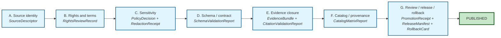

<!-- [KFM_META_BLOCK_V2]
doc_id: kfm://doc/<county-slug>-county-focus-mode-build-plan
title: <County Name> County Focus Mode — Build Plan
type: standard
version: v1
status: draft
owners: <OWNER>
created: <YYYY-MM-DD>
updated: <YYYY-MM-DD>
policy_label: public
related:
  - directory-rules.md#67
  - kfm_unified_doctrine_synthesis.md#8
  - kfm_unified_doctrine_synthesis.md#11
  - Master_MapLibre_Components-Functions-Features_v2_1_FULL.md#163
  - docs/focus-mode/README.md#3
  - docs/focus-mode/counties/COUNTY_INDEX.md
  - docs/focus-mode/state/STATE_INDEX.md
  - contracts/focus_mode/focus_mode_payload.md
  - schemas/contracts/v1/focus_mode/focus_mode_payload.schema.json
  - tools/validators/validate_focus_mode_index.py
tags: [kfm, focus-mode, build-plan, county-scale]
notes:
  - PROPOSED. Template; placeholders MUST be filled before merge.
  - Structured plan data lives at §12 (validator input); KFM Meta Block above is the standard doc-level metadata only.
[/KFM_META_BLOCK_V2] -->

<!--
COUNTY BUILD PLAN TEMPLATE — KFM Focus Mode Control Plane

Copy this file to:
  docs/focus-mode/counties/<county-slug>-county/build-plan.md
  (example: docs/focus-mode/counties/ellsworth-county/build-plan.md)

Path note: directory-rules.md §6.7.3 (CONFIRMED doctrine) requires kebab-case
lane folders in docs/. Earlier drafts of this template instructed an
underscored folder + verbose filename (<county-slug>_county/
<county-slug>_county_focus_mode_build_plan.md); that pattern conflicts with
§6.7.3 and with the YAML field `area.lane` below, which is kebab-case.
The path above is the canonical form.

Then, in parallel:
  1. Update the KFM Meta Block v2 above (title, owners, dates, doc_id slug).
  2. Fill the §12 "Plan data block (validator input)" YAML at the bottom of
     this file. That YAML is the structured spec the validator parses.
  3. Fill every "PROPOSED. <prompt>." narrative under §§1–10 with
     slice-specific content. Keep section anchor IDs unchanged.

The validator at tools/validators/validate_focus_mode_index.py parses the
SINGLE fenced ```yaml block located at §12 in this file. It will REJECT this
template while placeholders are present and ACCEPT a fully-filled instance.

Validator rejection contract (what is checked at §12):
  - kfm_artifact == "focus_mode_build_plan"
  - schema_version == "1"
  - area.lane matches the parent folder name exactly (kebab-case + "-county")
  - area.scope ∈ {county, region, corridor}
  - owner is not an unresolved <PLACEHOLDER>
  - last_reviewed is a valid ISO date, not "YYYY-MM-DD"
  - sensitivity_lanes defaults present; any override carries justification,
    deny-fixture path, and (where required) additional_reviewer
  - canonical_paths.* point inside the responsibility roots named in
    directory-rules.md §6.7

This template is also the spec: do not change required keys or field types
in §12 without an ADR (see docs/focus-mode/README.md §20).
-->

<a id="top"></a>

# `<County Name>` County Focus Mode — Build Plan

> *Per-slice planning and acceptance artifact for one county-scale Focus Mode. Becomes a `FocusModePayload` only through the crosswalk in `contracts/focus_mode/focus_mode_payload.md §3` after all seven promotion gates pass.*

> **Status:** see §12 plan data `status` · **Lane:** `docs/focus-mode/counties/<county-slug>-county/` · **Owner:** see §12 plan data `owner` · **Priority:** see §12 plan data `priority`


-lightgrey)


> [!IMPORTANT]
> This file is one of **seven required files** per area lane (§13 of `docs/focus-mode/README.md`). It is a **planning + acceptance** artifact, **not a publication target**. The slice becomes a `FocusModePayload` only through the crosswalk in `contracts/focus_mode/focus_mode_payload.md` §3, and only after gates A–G (§8) all pass.

> [!NOTE]
> **How to use this template.** Copy this file to `docs/focus-mode/counties/<county-slug>-county/build-plan.md`, then (1) update the KFM Meta Block v2 at the top of this file (doc-level metadata: title, owners, dates), (2) fill every `<PLACEHOLDER>` in the **§12 Plan data block** at the bottom of this file, and (3) fill every `PROPOSED. <prompt>.` narrative under §§1–10 with slice-specific content. Keep section anchor IDs unchanged so validator anchor checks pass. The validator's rejection contract is listed in the HTML comment at the top of the source file.

---

## Contents

- [1. Slice scope](#1-slice-scope)
- [2. Geographic and temporal frame](#2-geographic-and-temporal-frame)
- [3. Domains in scope](#3-domains-in-scope)
- [4. Source-seed signals (summary)](#4-source-seed-signals-summary)
- [5. Layer plan (summary)](#5-layer-plan-summary)
- [6. Evidence model (summary)](#6-evidence-model-summary)
- [7. Public-safety posture (summary)](#7-public-safety-posture-summary)
- [8. Promotion path](#8-promotion-path)
- [9. Acceptance criteria reference](#9-acceptance-criteria-reference)
- [10. Open questions](#10-open-questions)
- [11. Cross-references](#11-cross-references)
- [12. Plan data block (validator input)](#12-plan-data-block-validator-input)
- [Appendix — glossary and template legend](#appendix--glossary-and-template-legend)

---

## 1. Slice scope

PROPOSED. State, in one paragraph, what a public user can ask of this Focus Mode and what they will get back. Reference the proof-slice pattern (`Master_MapLibre_Components-Functions-Features_v2_1_FULL.md` §16.3 COUNTY-01). State what this slice does **not** show and why (see §7).

> [!TIP]
> When filling: keep it to one paragraph. Lead with what the slice **does** answer; close with one sentence on what it **refuses** to answer at county scale.

[↑ Back to top](#top)

---

## 2. Geographic and temporal frame

PROPOSED. Bounding geometry (county boundary plus tolerance), CRS, time window for layers (earliest/latest source observation), refresh cadence per source family. The `MapContextEnvelope` schema at `schemas/contracts/v1/ui/map_context_envelope.schema.json` defines acceptable bounds/time fields.

| Frame attribute | Required content | Example (illustrative) |
|---|---|---|
| Bounding geometry | County polygon + buffer tolerance (m) | Ellsworth County polygon, 250 m buffer |
| CRS | EPSG code; document any reprojection at slice boundary | EPSG:4326 (display); EPSG:5070 (analysis) |
| Time window | `earliest` / `latest` ISO timestamps spanning published layers | `1860-01-01T00:00:00Z` → `2026-05-21T00:00:00Z` |
| Refresh cadence | Per source family (daily / weekly / monthly / annual / on-event) | County GIS: monthly; KDOT projects: weekly; KDA / NASS: annual |
| Temporal-role separation | One column per role: `source_time`, `observed_time`, `valid_time`, `retrieval_time`, `release_time`, `correction_time` | (kept distinct where material) |

[↑ Back to top](#top)

---

## 3. Domains in scope

PROPOSED. The KFM domain bounded-contexts this slice composes across. Standard set listed below; strike or annotate per-slice rationale.

| # | Domain | Default at county scale | Per-slice note (fill at slice time) |
|---|---|---|---|
| 1 | Hydrology | in scope | PROPOSED. |
| 2 | Soil | in scope | PROPOSED. |
| 3 | Atmosphere | in scope | PROPOSED. |
| 4 | Geology | in scope | PROPOSED. |
| 5 | Fauna | in scope | PROPOSED. |
| 6 | Flora | in scope | PROPOSED. |
| 7 | Habitat | in scope | PROPOSED. |
| 8 | Archaeology | **aggregates-only** | PROPOSED — no exact locations at any scale (see §7). |
| 9 | Settlements / Infrastructure | in scope | PROPOSED — note any sensitive critical-infrastructure carve-outs. |
| 10 | Hazards | in scope | PROPOSED. |
| 11 | Agriculture | in scope | PROPOSED. |
| 12 | People / DNA / Land / Genealogy | **aggregates-only** | PROPOSED — living-person, DNA, and parcel-title fail-closed per §7. |
| 13 | Roads / Railroads | in scope | PROPOSED. |

> [!NOTE]
> A domain marked **out of scope** for a specific county requires a one-line rationale in the "Per-slice note" column. Domains 8 and 12 are aggregates-only by default at every scale; they are not strikeable to "in scope (exact)" without a sensitivity override (§7).

[↑ Back to top](#top)

---

## 4. Source-seed signals (summary)

PROPOSED. Bulleted summary; full ledger in `source-seed-list.md`. Each source MUST carry rights posture per `data/catalog/sources/<county-slug>-county/source_descriptors.yaml`.

| Source-seed family (from §12 plan data) | Typical role at county scale | Notes (fill at slice time) |
|---|---|---|
| County / City GIS | Parcels (aggregated), zoning, public-facility layers | PROPOSED. |
| KDOT projects | Active road and bridge project network | PROPOSED. |
| FEMA / USGS floodplain administration | Floodplain, gauge, watershed | PROPOSED. |
| KDA / NASS agriculture data | County-level crop / livestock aggregates | PROPOSED. |
| KGS geology | County-level surficial / structural geology | PROPOSED. |
| KHRI / Museum heritage | Heritage register (aggregates-only) | PROPOSED. |

> [!IMPORTANT]
> Every source family enumerated here MUST appear as a `SourceDescriptor` under `data/catalog/sources/<county-slug>-county/source_descriptors.yaml` before this slice can advance past `draft`.

[↑ Back to top](#top)

---

## 5. Layer plan (summary)

PROPOSED. Bulleted summary; per-layer detail (source, policy, evidence ref, style ref, sensitivity tier) lives in `layer-registry.md`. Each entry MUST have a `SourceDescriptor`, a `LayerManifest`, a `PolicyDecision`, and a sensitivity label (COUNTY-01 acceptance item (c)).

> [!CAUTION]
> The §12 plan-data counters `required_layers_min` and `required_layers_with_policy_decision` MUST be equal before `status` advances to `validated`. The validator enforces this.

| Layer-plan column | Required value at slice time |
|---|---|
| `layer_id` | Stable identifier; appears in `LayerManifest` |
| `source_descriptor` | Path under `data/catalog/sources/<county-slug>-county/` |
| `policy_decision` | `ALLOW` / `DENY` / `HOLD` per layer |
| `style_ref` | Style file under `apps/explorer-web/src/focus-modes/<county-slug>-county/` |
| `sensitivity_tier` | `T0` – `T4` per `kfm_unified_doctrine_synthesis.md` §15 |
| `evidence_ref` | Resolves to `EvidenceBundle` under `data/published/.../<county-slug>-county/` |

[↑ Back to top](#top)

---

## 6. Evidence model (summary)

PROPOSED. What claims the slice will display, each tied to an `EvidenceRef` ID. Full model in `evidence-model.md`. **Cite-or-abstain is the default truth posture** (`kfm_unified_doctrine_synthesis.md` Part III).

The §12 plan-data counters `evidence_refs_resolved` and `evidence_refs_total` track closure. The ratio MUST be `1.0` (every claim resolves to an `EvidenceBundle`) before the slice advances past `draft`. A claim whose `EvidenceRef` does not resolve **MUST** be removed from the model or marked `ABSTAIN`-only — it does not pass through silently.

[↑ Back to top](#top)

---

## 7. Public-safety posture (summary)

PROPOSED. Bulleted summary; full posture in `public-safety-notes.md`. Defaults applied from `docs/focus-mode/README.md §15` and reflected in §12 plan-data `sensitivity_lanes`.

| Sensitivity lane | Default outcome (county scale) | Why fail-closed |
|---|---|---|
| `parcel_title` | **ABSTAIN** | Living-person + private-land collision; exact title implication risks reidentification. |
| `exact_archaeology` | **DENY** | Looting risk; KSHS / federal protections; aggregates-only at every scale. |
| `burial_sacred` | **DENY** | Tribal-sovereignty and cultural-sensitivity floor; no exact public exposure. |
| `rare_species_exact` | **DENY** | Poaching / collection risk; exact occurrence denied for sensitive taxa. |
| `critical_infrastructure_exact` | **DENY** | Security; aggregates only. |
| `living_person_identifiers` | **DENY** | Privacy floor. |
| `dna_genomic` | **DENY** | Consent + revocation discipline. |
| `emergency_alert` | **ABSTAIN** | KFM is not an emergency-broadcast surface; defer to authoritative NWS / county EOC. |

Any per-lane override requires:

- a written **justification**;
- a **deny-fixture** under `fixtures/focus_modes/<county-slug>-county/invalid/` exercising the exact outcome the override changes;
- the entry recorded in §12 plan-data `sensitivity_overrides[]`.

> [!WARNING]
> Empty `sensitivity_overrides: []` is the expected default. A non-empty override list triggers Gate C (Sensitivity) re-review on every revision and changes the gate evidence requirements.

[↑ Back to top](#top)

---

## 8. Promotion path

PROPOSED. The seven promotion gates A–G (per `kfm_unified_doctrine_synthesis.md §8`, CONFIRMED canonical labels) this slice must clear before `released`. **Per-slice promotion is a governed state transition, not a file move** (`kfm_unified_doctrine_synthesis.md` Part II invariants).

> [!IMPORTANT]
> **Canonical gate labels.** The labels below match `kfm_unified_doctrine_synthesis.md §8` (CONFIRMED). Pass 10 C5-01 notes that the corpus has used slightly different labels in different sections; ADR-S-08 (PROPOSED) would finalize them. Use these labels in §12 plan-data `release.promotion_gates_passed[]` and in CI workflow names.



| Gate | Canonical purpose (synthesis §8) | What this slice checks at county scale | Required artifact | Status |
|---|---|---|---|---|
| **A — Source identity** | `SourceDescriptor` exists; source role + authority class known. | Every source family in §4 has a `SourceDescriptor` under `canonical_paths.source_descriptors`. | `SourceDescriptor` validation report. | not-run |
| **B — Rights and terms** | License / terms / contact / attribution obligations resolved. | Every source's SPDX license is on the allowlist; attribution carried forward into `LayerManifest`. | `RightsReviewRecord`. | not-run |
| **C — Sensitivity** | Living-person, DNA, archaeology, rare species, infrastructure, cultural sensitivity, private land, or sovereignty risks resolved. | §7 sensitivity-lane defaults applied; any override has fixture + (where required) additional reviewer. | `PolicyDecision` + `RedactionReceipt` (where transformed). | not-run |
| **D — Schema / contract** | Artifacts match schemas and API contracts. | Every layer-registry entry validates against `schemas/contracts/v1/focus_mode/`; payload validates against `focus_mode_payload.schema.json`. | `SchemaValidationReport`. | not-run |
| **E — Evidence closure** | `EvidenceRef` resolves to `EvidenceBundle`; citations valid. | `evidence_refs_resolved == evidence_refs_total`; every §6 claim has a resolving bundle. | `EvidenceBundle` + `CitationValidationReport`. | not-run |
| **F — Catalog / provenance** | STAC / DCAT / PROV and `CatalogMatrix` closed. | Catalog entries published under `data/catalog/sources/<county-slug>-county/` and `data/catalog/stac/<county-slug>-county/`. | `CatalogMatrixReport`. | not-run |
| **G — Review / release / rollback** | `PromotionDecision`, release manifest, proof pack, rollback target, correction path. | §12 `release.release_manifest_id` and `release.rollback_target_id` set; reviewer ≠ author; correction path declared. | `PromotionReceipt` + `ReleaseManifest` + `RollbackCard`. | not-run |

> [!CAUTION]
> **A gate that did not run is a gate that failed.** Empty §12 `release.promotion_gates_passed[]` does not mean "all green" — it means **zero**. The validator and Conftest/OPA bundle default-deny when evidence is missing (Pass 10 C5-02, CONFIRMED).

[↑ Back to top](#top)

---

## 9. Acceptance criteria reference

The eight COUNTY-01 acceptance items (a)–(h) live in `acceptance-checklist.md`. The validator checks that file for the eight literal items and verifies each item is marked `pass`, `fail`, or `not-run` (no other values accepted).

| Acceptance item | What it asserts (paraphrased; see `acceptance-checklist.md` for canonical text) |
|---|---|
| (a) | §12 plan data block validates against the schema in this template. |
| (b) | All in-scope domains have a per-slice note in §3. |
| (c) | Every layer in `layer-registry.md` has a `SourceDescriptor`, `LayerManifest`, `PolicyDecision`, and sensitivity label. |
| (d) | Every source family in §4 has a `SourceDescriptor`. |
| (e) | `evidence_refs_resolved == evidence_refs_total > 0`. |
| (f) | Sensitivity lanes match §7 defaults or carry compliant overrides. |
| (g) | Promotion gates A–G all `pass`. |
| (h) | Release manifest + rollback target + correction path declared. |

[↑ Back to top](#top)

---

## 10. Open questions

PROPOSED. Open `NEEDS VERIFICATION` / `UNKNOWN` items specific to this slice. Add ADR triggers to §12 plan-data `adr_open_questions[]`.

| # | Question / item | Class | Resolves when |
|---|---|---|---|
| 1 | `PROPOSED — fill at slice time` | `NEEDS VERIFICATION` | `<evidence that would settle>` |

[↑ Back to top](#top)

---

## 11. Cross-references

| Reference | Role | Status |
|---|---|---|
| `docs/focus-mode/README.md` | Control plane (state + county scales) | PROPOSED |
| `docs/focus-mode/counties/COUNTY_INDEX.md` | Master index (county scale) | PROPOSED |
| `docs/focus-mode/state/STATE_INDEX.md` | Companion index (state scale, PROPOSED) | PROPOSED |
| `contracts/focus_mode/focus_mode_payload.md` §3 | Plan → payload crosswalk | PROPOSED |
| `schemas/contracts/v1/focus_mode/focus_mode_payload.schema.json` | Payload machine schema | PROPOSED |
| `schemas/contracts/v1/ui/map_context_envelope.schema.json` | `MapContextEnvelope` schema | PROPOSED |
| `tools/validators/validate_focus_mode_index.py` | Validator | PROPOSED |
| `directory-rules.md` §6.7 | Focus Mode placement contract | CONFIRMED doctrine |
| `kfm_unified_doctrine_synthesis.md` §8 | Promotion gates A–G (canonical labels) | CONFIRMED doctrine |
| `kfm_unified_doctrine_synthesis.md` §11 | Finite outcome envelope vocabulary | CONFIRMED doctrine |
| `Master_MapLibre_Components-Functions-Features_v2_1_FULL.md` §16.3 | COUNTY-01..04 governance cards | CONFIRMED corpus reference |

[↑ Back to top](#top)

---

## 12. Plan data block (validator input)

This is the **single fenced YAML block** the validator at `tools/validators/validate_focus_mode_index.py` parses. It is the structured spec for this slice. Fill every `<PLACEHOLDER>` exactly per the inline comments. Do not change required keys or field types without an ADR (see `docs/focus-mode/README.md §20`).

> [!IMPORTANT]
> **One YAML block only.** The validator locates this block by the marker comment `# === KFM Focus Mode Build Plan: structured plan data (REQUIRED) ===` on its first line. Do not introduce a second `yaml`-fenced block before this one in the file, and do not split this block across fences.

> [!NOTE]
> **Why this block is here, not at the top.** Per the KFM Meta Block v2 doctrine, the invisible HTML-comment metadata at the top of this file carries the standard document-level metadata (`doc_id`, `title`, `type`, `version`, `status`, `owners`, `created`, `updated`, `policy_label`, `related`, `tags`, `notes`). The YAML below carries the **slice-specific structured assertions** the validator reads — schema version, area identity, canonical paths, sensitivity lanes, gate state, and ADR dependencies. These are separate concerns. When you fill the template, update both blocks in parallel: the KFM Meta Block above for doc identity, and the YAML below for plan content.

```yaml
# === KFM Focus Mode Build Plan: structured plan data (REQUIRED) ===
# Schema authority: contracts/focus_mode/focus_mode_payload.md §3 (plan→payload crosswalk)
# Validator: tools/validators/validate_focus_mode_index.py
schema_version: "1"                        # bump only via ADR
kfm_artifact: "focus_mode_build_plan"      # MUST equal this literal
area:
  county: "<County Name>"                  # human-readable, e.g., "Ellsworth"
  lane: "<county-slug>-county"             # kebab-case slug + "-county"; MUST match folder name
  scope: "county"                          # one of: county | region | corridor (state lives in state-build-plan.md)
status: "draft"                            # one of: planned | draft | validated | payload-ready | released | rolled-back | deprecated
owner: "<OWNER>"                           # GitHub handle or steward role; do not leave blank
priority: "P2"                             # P1 (Directory Rules v1.2 priority) | P2 (corpus draft) | P3 (later)
last_reviewed: "YYYY-MM-DD"                # ISO date; updated each substantive revision
plan_anchors:                              # CONFIRMED doctrine citations the plan rests on
  - "directory-rules.md#67"                # Focus Modes placement contract
  - "kfm_unified_doctrine_synthesis.md"    # cite-or-abstain + promotion gates
  - "Master_MapLibre_Components-Functions-Features_v2_1_FULL.md#163"  # COUNTY-01..04
ui_shell: "apps/explorer-web"              # MUST be apps/explorer-web (apps/web is drift per OPEN-DR-06)
canonical_paths:                           # where artifacts from this plan land
  ui_lane: "apps/explorer-web/src/focus-modes/<county-slug>-county/"
  fixtures: "fixtures/focus_modes/<county-slug>-county/{valid,invalid}/"
  source_descriptors: "data/catalog/sources/<county-slug>-county/source_descriptors.yaml"
  published_payload: "data/published/api_payloads/focus-modes/<county-slug>-county.json"
  release_manifest: "release/manifests/focus_modes/<county-slug>-county-v1.json"
sensitivity_lanes:                         # per-lane outcome; defaults from docs/focus-mode/README.md §15
  parcel_title: "ABSTAIN"                  # ABSTAIN | DENY (override only with justification)
  exact_archaeology: "DENY"
  burial_sacred: "DENY"
  rare_species_exact: "DENY"
  critical_infrastructure_exact: "DENY"
  living_person_identifiers: "DENY"
  dna_genomic: "DENY"
  emergency_alert: "ABSTAIN"
sensitivity_overrides: []                  # list any per-lane override; each entry requires:
#  - lane: "parcel_title"
#    new_outcome: "ANSWER"
#    justification: "..."
#    deny_fixture_path: "fixtures/focus_modes/<county-slug>-county/invalid/..."
source_seed_families:                      # short list; full ledger in source-seed-list.md
  - "County/City GIS"
  - "KDOT projects"
  - "FEMA / USGS floodplain administration"
  - "KDA / NASS agriculture data"
  - "KGS geology"
  - "KHRI / Museum heritage"
required_layers_min: 0                     # set when layer-registry.md is populated
required_layers_with_policy_decision: 0    # MUST equal required_layers_min before validated
evidence_refs_resolved: 0                  # claims with EvidenceRef that resolves to EvidenceBundle
evidence_refs_total: 0                     # all claims in evidence-model.md; resolved/total MUST be 1.0 to advance past draft
release:
  promotion_gates_passed: []               # subset of [A, B, C, D, E, F, G]; must be all seven to reach released
  release_manifest_id: null                # set when MapReleaseManifest is signed
  rollback_target_id: null                 # set when rollback target is recorded
  correction_path: null                    # how a correction is filed for this slice
adr_open_questions: []                     # any ADR triggers raised by this plan
# === end structured plan data ===
```

[↑ Back to top](#top)

---

## Appendix — glossary and template legend

<details>
<summary><strong>A.1 Key objects referenced by this template</strong></summary>

| Object | One-line role *(per `kfm_unified_doctrine_synthesis.md §10`, CONFIRMED)* |
|---|---|
| `SourceDescriptor` | Identity, role, authority class, rights, sensitivity precheck of a source. |
| `RightsReviewRecord` | Resolved license / terms / contact / attribution obligations. |
| `PolicyDecision` | `ALLOW` / `DENY` / `HOLD` with reason codes and obligations. |
| `RedactionReceipt` | Record of a public-safe field or geometry transformation. |
| `SchemaValidationReport` | PASS/FAIL across schema and API contract checks. |
| `EvidenceRef` / `EvidenceBundle` | Reference that must resolve to a closed evidence package before public claim authority. |
| `CitationValidationReport` | Pass/fail citation closure for the slice. |
| `CatalogMatrixReport` | STAC / DCAT / PROV / graph closure across the slice. |
| `PromotionReceipt` | Signed record of a `PromotionDecision`. |
| `ReleaseManifest` | Authoritative record of what is `PUBLISHED`. |
| `RollbackCard` | Rollback target preserving history while repointing current release state. |
| `FocusModePayload` | The bounded, released, citation-closed evidence projection this plan ultimately produces. |
| `MapContextEnvelope` | Bounded context (camera + layer IDs + feature IDs + temporal snapshot + release refs + selected evidence refs). |

</details>

<details>
<summary><strong>A.2 Placeholder legend</strong></summary>

| Token in this template | Meaning | Replace with |
|---|---|---|
| `<County Name>` | Human-readable county name | e.g., `Ellsworth` |
| `<county-slug>` | Kebab-case slug | e.g., `ellsworth` |
| `<county-slug>-county` | Lane folder name | e.g., `ellsworth-county` |
| `<OWNER>` | GitHub handle or steward role | e.g., `@<handle>` or `county-lane-steward` |
| `<YYYY-MM-DD>` / `YYYY-MM-DD` | ISO date | e.g., `2026-05-24` |
| `PROPOSED.` lines under §§1–10 | Author prompt | Slice-specific narrative; remove the `PROPOSED.` prefix only when the underlying claim is verified. |

</details>

<details>
<summary><strong>A.3 Dual-block authoring (KFM Meta Block + §12 plan data)</strong></summary>

When filling this template, two blocks need parallel updates:

| Field in §12 plan data | Mirrors / drives field in KFM Meta Block v2 (top of file) |
|---|---|
| `area.county` | `title` (composed as `<County Name> County Focus Mode — Build Plan`) |
| `area.lane` | `doc_id` slug (composed as `kfm://doc/<county-slug>-county-focus-mode-build-plan`) |
| `owner` | `owners` |
| `last_reviewed` | `updated` |
| `status` (template vocab) | `status` (KFM vocab) — map: `planned`/`draft` → `draft`; `validated`/`payload-ready` → `review`; `released` → `published` |
| `plan_anchors[]` + `canonical_paths.*` | `related[]` |
| (none — template-specific) | `created` (set once, never changed) |
| (none — template-specific) | `policy_label` (defaults to `public` for county-scale slices) |
| (none — template-specific) | `tags` (defaults to `[kfm, focus-mode, build-plan, county-scale]`) |

The validator may, in a future pass (PROPOSED), cross-check the KFM Meta Block against §12 for these mirrored fields. For now the cross-check is a reviewer responsibility.

</details>

<details>
<summary><strong>A.4 Validator rejection signals (quick reference)</strong></summary>

The validator at `tools/validators/validate_focus_mode_index.py` returns a `DecisionEnvelope` with `outcome ∈ {PASS, FAIL, ERROR}`. Common reject reasons:

| Reason code (PROPOSED) | Likely cause |
|---|---|
| `placeholder_unresolved` | `<County Name>`, `<county-slug>`, `<OWNER>`, or `YYYY-MM-DD` still present in §12. |
| `lane_folder_mismatch` | §12 `area.lane` does not match the parent folder name. |
| `scope_value_invalid` | §12 `area.scope` not in `{county, region, corridor}`. |
| `plan_data_block_missing` | No fenced ```yaml block found at §12 carrying the marker comment. |
| `plan_data_block_duplicated` | More than one `yaml`-fenced block carrying the marker comment was found. |
| `sensitivity_override_unsupported` | §12 `sensitivity_overrides[]` entry missing `justification`, `deny_fixture_path`, or (where required) `additional_reviewer`. |
| `evidence_closure_open` | §12 `evidence_refs_resolved != evidence_refs_total` while `status` ≥ `validated`. |
| `gate_letter_unknown` | §12 `release.promotion_gates_passed[]` contains a value outside `[A, B, C, D, E, F, G]`. |
| `meta_block_missing` | KFM Meta Block v2 not present at top of file. |
| `meta_plan_field_mismatch` | KFM Meta Block field disagrees with §12 mirrored field (e.g., `updated` ≠ `last_reviewed`). |

</details>

---

**Related (mini)** · [`docs/focus-mode/README.md`](../../README.md) · [`docs/focus-mode/counties/COUNTY_INDEX.md`](../COUNTY_INDEX.md) · [`docs/focus-mode/state/STATE_INDEX.md`](../../state/STATE_INDEX.md) · [`directory-rules.md` §6.7](../../../../directory-rules.md) · [`kfm_unified_doctrine_synthesis.md` §8](../../../../kfm_unified_doctrine_synthesis.md) · [`Master_MapLibre_Components-Functions-Features_v2_1_FULL.md` §16.3](../../../../Master_MapLibre_Components-Functions-Features_v2_1_FULL.md)

**Last updated:** see §12 plan data `last_reviewed` · **Plan-data schema:** `schema_version: "1"` (see §12) · **Path status:** PROPOSED *(canonical per directory-rules.md §6.7)*

[↑ Back to top](#top)
