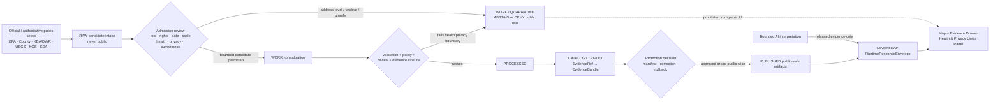
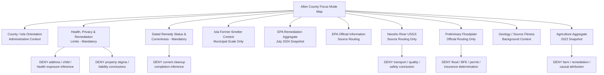
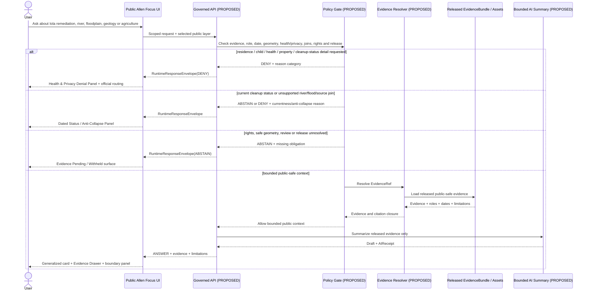
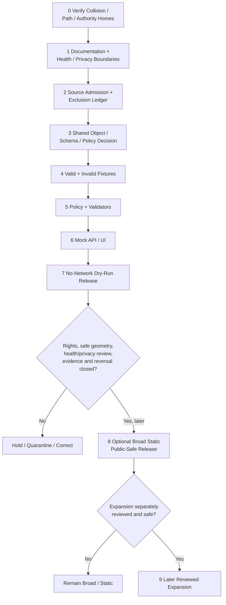

<!-- KFM_META_BLOCK_V2
doc_id: NEEDS_VERIFICATION
title: Allen County Focus Mode Build Plan
type: standard
version: v1
status: draft
owners: [NEEDS_VERIFICATION]
created: 2026-05-22
updated: 2026-05-22
policy_label: public_draft
repository_path: NEEDS_VERIFICATION - candidate only: docs/focus-modes/allen-county/allen_county_focus_mode_build_plan.md
schema_contract_policy_homes: NEEDS_VERIFICATION - inspect the live repository, accepted ADRs, per-root READMEs and shared object-family authority before extending any contract, schema, policy, fixture, source-registry, proof, receipt, release or published-artifact home
review_assignments: NEEDS_VERIFICATION - environmental-remediation/public-health, living-person/private-property, floodplain/currentness, hydrology/water-quality, rights, documentation and release review duties must be established before implementation or publication
correction_path: NEEDS_VERIFICATION
rollback_path: NEEDS_VERIFICATION
release_status: NEEDS_VERIFICATION - planning artifact only; no implementation, source admission, promotion or publication claimed
related:
  - Directory Rules.pdf (consulted in this run; supplied placement doctrine)
  - KFM county Focus Mode completed-county register supplied in the series prompt
  - Doniphan County, Jefferson County, Hamilton County, Graham County, Mitchell County, Marshall County, Logan County, Clark County and Harvey County generated or identified during this continuation sequence
tags: [kfm, focus-mode, allen-county, iola, gas, la-harpe, former-united-zinc, superfund, residential-yards, lead, public-health, remediation, neosho-river, floodplain, agriculture, environmental-regulatory, public-safe-boundary]
notes:
  - CONFIRMED: Allen County is not included in the completed-county register available in this series context and is distinct from the subsequently generated county-plan artifacts known in this continuation sequence.
  - CONFIRMED: Accessible uploaded/File Library project materials were searched in this run; no Allen County Focus Mode Build Plan artifact was returned.
  - CONFIRMED: Directory Rules.pdf was consulted in this run before repository-path proposals were made.
  - CONFIRMED: Official or authoritative public-source pages were checked in this run for the Iola Former United Zinc and Associated Smelters NPL Superfund Site, EPA cleanup-document routing, Allen County administration, preliminary floodplain mapping, Neosho River USGS monitoring-source availability, KGS geologic source fitness and KDA agricultural aggregates.
  - NEEDS_VERIFICATION: A live KFM repository, complete project index, accepted ADR set, implementation tree, rights register, remediation/public-health review assignments and release machinery were not inspected for final collision or landing verification.
  - PROPOSED: Allen County is selected as the next legacy-industrial remediation, residential-yard public-health and environmental-regulatory restraint proof slice.
-->

<a id="top"></a>

# Allen County Focus Mode Build Plan

> **Product thesis:** Build a public-safe Allen County Focus Mode around Iola's officially documented former-smelter cleanup context, the Neosho River corridor, preliminary floodplain source routing, geology and county-scale agriculture—without exposing tested or eligible residences, mapping lead-risk targets or child-use locations, converting EPA remediation information into a personal health or cleanup-status verdict, or using water/flood/agricultural context to infer private exposure, liability or compliance.


| Identity / status field | Determination |
|---|---|
| Selected county | **Allen County, Kansas** |
| Selection status | **PROPOSED** as the next KFM county Focus Mode proof slice. |
| Completed-register comparison | **CONFIRMED** within available series evidence: Allen County is absent from the user-supplied completed register and is not among the subsequently generated Doniphan, Jefferson, Hamilton, Graham, Mitchell, Marshall, Logan, Clark or Harvey plans identified in the continuation context. |
| Available-material collision search | **CONFIRMED** for the accessible project corpus searched in this run: queries for `Allen County Focus Mode Build Plan`, `allen_county_focus_mode_build_plan.md`, and Allen/Iola/Superfund Focus Mode terms returned Directory Rules and general KFM materials, not an Allen County plan. |
| Full collision verification | **NEEDS_VERIFICATION** because no live repository tree or complete project index was inspected. |
| Distinct proof-slice value | EPA-documented former lead/zinc smelter legacy in Iola; residential-yard remediation and childhood lead-health messaging; separate EPA OU1/OU2 remedy roles; city/county context involving Gas and La Harpe; Neosho River official observation routing; preliminary floodplain mapping; historical geology/source-fitness limits; agricultural aggregates. |
| Difference from completed environmental counties | Cherokee County and Montgomery County are already in the supplied register. Allen's distinct proposed value is **urban residential-yard remediation and public-health/privacy-safe representation in Iola**, not a repeat of their county products. |
| Most consequential public-safe boundary | **Remediation/public-health and privacy non-determination:** KFM may present source-attributed, time-labeled EPA public cleanup context at broad municipal scale, but it must not identify or map tested, qualifying, cleaned or uncleaned residences; child-care, playground or household exposure targets; blood-lead or individual health status; property value, liability or stigma; or current cleanup eligibility/outcomes for an address. |
| Coupled public-safe boundary | **Water/flood/agriculture anti-collapse:** Neosho River observation, preliminary floodplain mapping, geology and agriculture may support separate context or official-routing cards only; they must not be joined into contamination-source, exposure, parcel-flood, permit, insurance, farm-liability or current water-quality conclusions. |
| Document posture | Repo-ready, source-checked future implementation plan; not an implemented, reviewed, promoted or published county product. |
| Directory placement posture | **PROPOSED / NEEDS_VERIFICATION:** candidate human-documentation home under `docs/focus-modes/allen-county/`, justified by supplied Directory Rules but not confirmed against a live repository. |
| First milestone | **Allen Iola Remediation Privacy-and-Health Trust Boundary Proof** |

## Quick links

[Executive build note](#executive-build-note) · [Evidence boundary](#evidence-boundary-table) · [Operating posture](#1-operating-posture) · [Why Allen County](#2-why-this-county) · [Product thesis](#3-product-thesis) · [Scope boundary](#4-scope-boundary) · [First demo layers](#5-first-demo-layers) · [User journeys](#6-user-journeys) · [UI surfaces](#7-ui-surfaces) · [Governed object model](#8-governed-object-model) · [Repository shape](#9-proposed-repository-shape) · [Build phases](#10-build-phases) · [First PR sequence](#11-first-pr-sequence) · [Acceptance checklist](#12-acceptance-checklist) · [Fixture plan](#13-fixture-plan) · [Risk register](#14-risk-register) · [Source seeds](#15-source-seed-list) · [Verification questions](#16-open-verification-questions) · [First milestone](#17-recommended-first-milestone) · [Appendices](#appendix-a---public-safe-narrative-skeleton)

<a id="executive-build-note"></a>

## Executive build note

**PROPOSED.** Allen County is a strong next KFM proof slice because EPA's public record describes a remediation and health-education setting in Iola where map utility and privacy harm sit close together. EPA's July 2024 fact sheet, on an EPA page last updated in December 2025, identifies the Former United Zinc and Associated Smelters National Priorities List Superfund Site in Iola; states that lead is the primary contaminant of concern; describes residential-yard testing and cleanup; and reports a dated aggregate of nearly 3,000 tested residential properties, 1,371 above 400 ppm, and 253 then remaining eligible properties not yet cleaned. EPA also states that former smelting occurred at three Iola facilities from 1896 through the 1920s and that it has continued sampling and cleanup since residential-soil testing began in 2006.

That is unusually valuable public evidence for KFM, but it is also unusually easy to misuse. A public map could wrongly turn an official remediation program into an address-level exposure map, a list of households or children presumed at risk, a current cleanup-completion tracker, or a stigma-producing property layer. It could also incorrectly join site context with a USGS Neosho River monitoring location, preliminary floodplain mapping or county agricultural aggregates and imply causation, current contamination or legal responsibility that none of those sources establishes.

The correct first product is therefore not a “contamination map.” It is an **environmental-remediation trust boundary proof**: broad, source-attributed municipal context; a prominent public-health/privacy denial panel; dated EPA aggregate/remedy-status cards; official routing to EPA and responsible health authorities; separate Neosho River/floodplain/geology/agriculture context; and negative fixtures that demonstrate KFM will not expose households or make health, property, cleanup, water-quality or liability judgments.

> [!CAUTION]
> ## Defining public-safe boundary - EPA cleanup evidence is not a household exposure, health or property verdict
> EPA publicly documents lead contamination and residential-yard cleanup activity within the Iola Superfund site context. That evidence supports a carefully attributed public explanation of the cleanup program and its time basis. It does **not** authorize KFM to identify, predict or imply whether a particular home, family, child-use location, farm, parcel or address is contaminated, tested, cleaned, eligible for cleanup, healthy, safe, stigmatized or legally affected.
>
> The first Allen County product may show **municipal-scale, time-labeled public remediation context and official source routing**. It must **DENY or ABSTAIN** from exact residential/child-use geometry, address-level cleanup or exposure status, individual health inference, property-value/liability claims, “safe to live/play/garden” answers, present water-quality claims, cross-source contamination attribution, or parcel flood/permit/insurance decisions.

<a id="evidence-boundary-table"></a>

## Evidence-boundary table

| Truth label | What this document supports now | What this document cannot imply |
|---|---|---|
| `CONFIRMED` | Allen County is not in the completed-county register available to this run; accessible project-material search returned no Allen County plan; `Directory Rules.pdf` was consulted; the official/authoritative public pages identified in §15 were checked; this downloadable Markdown artifact was generated in this run. | No live-repository file presence, source admission, implementation, derivative-display rights, approved public geometry, public-health/privacy review, policy/test/API/UI behavior, release or publication is confirmed. |
| `PROPOSED` | Allen County selection; first-slice thesis; public-safe layer/card/UI/object/path/fixture/policy/PR/milestone plan; a future broad public remediation-context product. | A proposed design does not show that KFM has built, approved, reviewed or released the product. |
| `NEEDS_VERIFICATION` | Live-repository collision/path check; accepted ADRs and shared object homes; exact official-source rights and display permissions; municipal-scale safe geometry; EPA document/source versioning; review duties; current flood/map/water source suitability; correction and rollback mechanics. | Checkable gaps cannot be treated as implementation facts or passed release gates. |
| `UNKNOWN` | Any Allen plan outside the searched accessible materials; actual KFM implementation maturity; existing routes/contracts/tests/workflows; review assignments and release state. | Unsupported assumptions remain outside claim scope. |

---

## 1. Operating posture

### KFM governing rules applied to Allen County

| Governing rule | Allen County consequence |
|---|---|
| EvidenceBundle outranks generated language. | Any public statement about the EPA site, cleanup activity, lead, Iola, the Neosho River, floodplain, geology or agriculture must resolve to admitted evidence with role, date, geographic scope and limitations. |
| Public clients use governed interfaces and released public-safe artifacts only. | Public UI must not read `RAW`, `WORK`, `QUARANTINE`, unreviewed site records, address-level cleanup candidates, household/private records, direct source-system side effects or direct model outputs. |
| Cite-or-abstain is the truth posture. | Missing evidence, rights, safe generalization, privacy/public-health review, currentness or release closure yields `ABSTAIN`, `DENY` or `ERROR`, never a confident contamination or health answer. |
| Publication is a governed state transition, not a file move. | A rendered EPA-context card, city marker, flood layer, river link or AI summary is not published truth until validated, reviewed and released. |
| Source roles remain distinct. | EPA remedial/public-health messaging, Allen County administration, KDA/DWR preliminary floodplain mapping, USGS observation routing, KGS scientific/geologic context, KDHE environmental registry candidates and KDA agricultural aggregate must not collapse. |
| Public-health and privacy risks fail closed. | No household, child, residence, property, medical, tested/cleaned/eligible-site or stigma-producing result is exposed by default. |
| AI is interpretive only. | AI may summarize released broad context; it cannot identify exposure, certify safety, infer cleanup eligibility/completion, diagnose health risk, determine liability or promote a release. |
| Correction and rollback remain visible. | Any later public release must permit prompt withdrawal if it reveals excessive detail, creates harmful inference, becomes stale or misstates official remedy status. |

### Truth labels and finite outcomes

| Label / outcome | Meaning for this artifact |
|---|---|
| `CONFIRMED` | Verified during this run from supplied doctrine, accessible file search, opened official/authoritative public sources or generated artifact output. |
| `PROPOSED` | Future design, path, object, schema/policy/fixture, workflow, UI, review or release recommendation. |
| `NEEDS_VERIFICATION` | A checkable issue not verified strongly enough for implementation or publication. |
| `UNKNOWN` | Not resolved from evidence available in this run. |
| `ANSWER` | A bounded public-safe response supported by admitted/released evidence and policy/citation/review closure. |
| `ABSTAIN` | Evidence, authority, rights, safe resolution, privacy/public-health review or currentness is insufficient. |
| `DENY` | A request would expose sensitive information, issue a health/property/liability/current-status judgment, encourage unsafe reliance or bypass governance. |
| `ERROR` | A governed failure that returns no unsupported claim. |
| `DEFER` | Candidate intentionally held for later reviewed work. |
| `EXCLUDE` | Candidate source content or map output unsuitable for the first public product. |

### Public trust-membrane flowchart



### County-specific non-negotiable guardrails

1. **Residential-location suppression guardrail.** KFM must not ingest into a public layer or generate from EPA information any address, residence, tested/qualified/cleaned/unresolved-property identifier or mappable household status.
2. **Child-use and personal-health guardrail.** EPA's public-health messaging and aggregate remedial context may be attributed; KFM must not expose or infer affected children, families, child-care/playground locations, blood-lead status or medical risk for any identifiable person or site.
3. **Dated remedy-status guardrail.** Aggregate numbers from EPA fact sheets must be labeled by the fact sheet date and must not be narrated as current cleanup totals or final completion state without newly admitted authoritative evidence.
4. **Municipal-scale generalization guardrail.** Public depiction of the former-smelter/cleanup context should be broad city-level or other explicitly approved generalized geometry. A public EPA site map or record repository does not automatically authorize KFM to reproduce detailed site or residential geography.
5. **Environmental-regulatory role guardrail.** EPA cleanup status, remedy roles and health messaging remain EPA/regulatory evidence. KFM does not pronounce compliance, responsibility, legal liability, remediation success at a property or final health protectiveness beyond the admitted scope of EPA wording.
6. **Hydrology anti-collapse guardrail.** The Neosho River USGS monitoring location is a separate official observation-source route. It cannot be joined to the EPA site to claim transport, exposure, water-quality impact, health safety or contamination without appropriate admitted evidence and review.
7. **Floodplain/property guardrail.** KDA/DWR's Allen County map was labeled preliminary on the checked page. KFM may route users to official floodplain processes; it must not issue final/effective parcel, permit, insurance or safety outcomes.
8. **Historical geology fitness guardrail.** KGS identifies its county map as extracted from the state geologic map and references a 1969 groundwater/geology publication. It supports background science/source-fitness context only, not current contamination or groundwater-health conclusions.
9. **Agriculture/privacy guardrail.** KDA county aggregate statistics may be shown with reference year. No farm, operator, soil, food, livestock, water-quality, remediation or liability inference follows.
10. **Registry and regulatory-search restraint.** A public environmental-site search tool may be an official routing resource, but KFM must not scrape or expose site-detail joins as a public first-slice “risk atlas,” particularly where data freshness or site-level privacy/interpretation issues remain unresolved.

---

## 2. Why this county

### Selection screen against completed counties

| Selection test | Result | Status |
|---|---|---|
| Is Allen County listed in the user-supplied completed-county register? | No match found. | `CONFIRMED` within available register evidence |
| Is Allen County one of the subsequently generated Doniphan, Jefferson, Hamilton, Graham, Mitchell, Marshall, Logan, Clark or Harvey plans? | No. | `CONFIRMED` |
| Did accessible project-material search identify an Allen County Focus Mode plan? | No Allen County build-plan artifact was returned by searches for the county, requested filename and Iola/Superfund focus-mode terms. | `CONFIRMED` for searched accessible materials |
| Was a live repository or every project-storage/index surface searched? | No. | `NEEDS_VERIFICATION` |
| Does Allen add a distinct proof slice despite Cherokee and Montgomery already being used? | Yes. Allen centers EPA-documented **residential-yard remediation and public-health/privacy-safe municipal representation in Iola**, rather than repeating those prior counties' plans. | `PROPOSED`, grounded in EPA official sources |
| Are official/authoritative public-source seeds strong? | Yes: EPA, Allen County, KDA/DWR, USGS, KGS and KDA sources were checked; KDHE's official registry interface was checked as a later-verification/defer candidate. | `CONFIRMED` source checks; admission remains `NEEDS_VERIFICATION` |

### Proof-slice rationale

| Proof dimension | Checked official/authoritative public-source anchor | KFM proof value | Public-safe constraint |
|---|---|---|---|
| Legacy industrial remediation and urban residential context | EPA July 2024 fact sheet states EPA is implementing residential-yard lead testing and cleanup across Iola because of former-smelter contamination within the NPL Superfund site. | Tests environmental-regulatory context and privacy-safe urban mapping. | Broad municipal context only; no address/test/cleanup status layer. |
| Public-health messaging tied to official remediation | EPA states lead is the main contaminant of concern, identifies particular vulnerability of young children and points to health testing resources. | Tests public-health routing with deny-by-default individual inference. | No child/family/medical/exposure determination. |
| Time-aware aggregate remediation reporting | EPA July 2024 fact sheet reports nearly 3,000 residential properties tested, 1,371 above 400 ppm and 253 then remaining eligible properties not cleaned. | Tests dated aggregate/status cards with stale-state protections. | Values must remain explicitly tied to July 2024; not present totals or parcel status. |
| Remedy-state/source-role separation | EPA October 2023 FYR fact sheet describes OU1 Residential Yard Remedy and OU2 Former Smelters work and states EPA found OU1 working as intended at that review stage. | Tests distinction between remedy evaluation, ongoing work and public narrative. | Do not claim cleanup completion, present protectiveness or property result. |
| Historic smelter/municipal history | EPA states smelting occurred at three Iola facilities from 1896 to the 1920s, with associated context in Gas and La Harpe. | Tests time-aware industrial-history card linked to remediation evidence. | Do not turn history into current liability or exposure map. |
| County public-service routing | Allen County official site exposes county department/public works/alert/appraiser routing from Iola. | Tests county orientation and field-minimization. | Appraiser/alert/private-service content excluded from first public slice. |
| Floodplain official-source routing | KDA/DWR Allen County Floodplain Mapping page identifies preliminary floodplain mapping data dated 12/11/2024 and a Base Flood Elevation portal. | Tests preliminary/currentness and property non-determination. | Not a final/effective parcel flood or permit/insurance answer. |
| Neosho River official monitoring-source candidate | USGS identifies monitoring location `USGS-07183000`, Neosho River near Iola, operated in cooperation with Kansas Water Office, USACE Tulsa District and USGS cooperative funds. | Tests official hydrology-routing layer and anti-collapse with remediation. | No live hydrology, contaminant transport or safety conclusion in first slice. |
| Geology/source fitness | KGS states no detailed digital mapping has been completed for Allen County on that page; its displayed county map is extracted from the state geologic map and cites a 1969 groundwater/geology report. | Tests evidence fitness and historical-science labeling. | Not modern contamination or groundwater-quality evidence. |
| Agriculture / working landscape aggregate | KDA reports 468 farms, 249,954 acres and $59 million in crop/livestock sales in 2022 according to USDA Census of Agriculture. | Supports county-scale context. | No named farm/remediation/water-quality or liability inference. |
| Environmental registry source candidate with freshness caution | KDHE's Identified Sites List page describes itself as a public record/search for contaminated sites and states displayed ISL data were last updated June 3, 2021 during a system transition. | Tests abstention when a public official registry is stale or too detailed for product need. | Not a first-slice public map; defer until freshness, scope, privacy and policy review. |

### Why Allen adds a distinct series proof

Allen County adds a proof challenge that is both map-relevant and ethically demanding: **how to make public environmental-remediation evidence legible without producing an exposure-targeting product**.

This slice differs from previously completed or generated counties because:

- The core evidence is an **EPA remedial/public-health program involving residential yards**, not just a natural resource, visitor feature, reservoir or broad industrial history.
- Public-source data include aggregate remediation counts and official health messaging that are useful for public understanding but highly prone to **staleness, stigma and household inference**.
- A public map must deliberately avoid mapping the people and properties most directly affected, even when the user asks for a more detailed “risk” view.
- Multiple adjacent evidence lanes—river observations, preliminary flood mapping, geology and agriculture—could be wrongly joined into contamination or liability narratives unless source-role anti-collapse rules are explicit.
- The safe product's success is measured as much by what it refuses to display as by what it teaches.

### Public benefit and governance value

| Public benefit | Governance value |
|---|---|
| Learn why EPA has a public remediation and health-information role in Iola. | Demonstrates official regulatory-source fidelity and bounded public narrative. |
| Understand the historical relationship between former smelting and modern cleanup context at a non-personal scale. | Demonstrates time-aware history without stigma-producing mapping. |
| View dated aggregate cleanup reporting with limitations plainly shown. | Demonstrates stale-state and currentness discipline. |
| Route to responsible official sources for testing, cleanup and health questions. | Demonstrates KFM as informed gateway, not health adjudicator. |
| See Neosho River, floodplain, geology and agriculture as separately governed context. | Demonstrates source-role separation and anti-collapse joins. |
| Inspect denial reasons, evidence status, correction and rollback posture. | Demonstrates trust-visible Focus Mode design prior to implementation. |

### Specific county anchors supported by checked official sources

| County anchor | Verified public statement used in this plan | Source role |
|---|---|---|
| Iola Former United Zinc and Associated Smelters NPL Superfund Site | EPA July 2024 fact sheet identifies the NPL site and residential-yard testing/cleanup opportunity across Iola due to former-smelter contamination. | Federal environmental-remediation/public-health context |
| Lead contaminant and health context | EPA identifies lead as main contaminant of concern and provides general public-health messaging and responsible health-routing. | Federal health-context/public-information role |
| Aggregate remediation snapshot | EPA July 2024 fact sheet reports nearly 3,000 tested properties, 1,371 above 400 ppm, all but 253 cleaned at the fact-sheet date. | Dated aggregate remedy-context evidence |
| Smelter history | EPA identifies three Iola facilities operating from 1896 into the 1920s, with broader local context involving Gas and La Harpe. | Federal historic-remediation context |
| Allen County public administration | Allen County official website identifies its Iola county government/public-department routing. | County administrative context |
| Preliminary floodplain source | KDA/DWR map page labels Allen County floodplain mapping data preliminary and dated 12/11/2024. | State floodplain/currentness routing |
| Neosho River official monitoring source | USGS identifies the Neosho River near Iola monitoring location and cooperating agencies. | Federal observation-source routing |
| Geology/source fitness | KGS labels its county map state-map-derived and references 1969 groundwater/geology publication. | Scientific/background source fitness |
| Agriculture | KDA reports 468 farms, 249,954 acres and $59 million in 2022 crop and livestock sales. | Statistical aggregate |

---

## 3. Product thesis

### One-sentence thesis

**Allen County Focus Mode should present Iola's EPA-documented former-smelter remediation context as a dated, municipal-scale, evidence-linked public-health and environmental-regulatory story connected cautiously to river, floodplain, geology and agriculture context—while refusing household exposure, cleanup-status, health, property, water-quality and liability conclusions.**

### What the first product promises

| Promise | Proposed public behavior |
|---|---|
| A respectful municipal-scale remediation orientation | Users can learn why EPA has a public cleanup role in Iola without seeing affected property or household detail. |
| Dated aggregate status with official attribution | EPA aggregate snapshot cards are explicitly tagged to fact-sheet date and source role. |
| Public-health boundary before exploration | A mandatory Health, Privacy & Remediation Limits panel appears with EPA-context interaction. |
| Environmental context without false joins | Neosho River, preliminary floodplain, geology and agriculture are separate, role-labeled cards or official-source routes. |
| Official source routing | Users can reach responsible EPA/county/KDA/USGS/KGS source categories rather than receive KFM determinations. |
| Reversible governed behavior | Public answers show outcomes, evidence, limitations, review/release posture, correction and rollback requirements. |

### What the first product does not promise

- It is **not** an address-level contaminated-yard, tested-property, cleanup-eligibility or cleaned-property map.
- It is **not** an individual health, blood-lead, childhood exposure, gardening/play safety or medical-advice tool.
- It is **not** a property-value, liability, stigma, cleanup-compliance or legal-determination system.
- It is **not** a present Neosho River water-quality, pollutant-transport, flood-safety or drinking-water conclusion.
- It is **not** a parcel floodplain, Base Flood Elevation, insurance or permit decision surface.
- It is **not** a private-farm, livestock, food, soil or water-quality attribution tool.
- It is **not** evidence that repository paths, contracts, policies, tests, APIs, UI components, review records or public releases already exist.

---

## 4. Scope boundary

### Public-safe first-slice content

| Included first-slice content | Checked-source basis | Required presentation limit | Status |
|---|---|---|---|
| Allen County / Iola / Gas / La Harpe orientation card | Allen County official site; EPA public fact sheet | Municipal/county context only; no property/person or site-eligibility field. | `PROPOSED` |
| **Health, Privacy & Remediation Limits panel** | EPA July 2024 and October 2023 public fact sheets | Mandatory; explains why no residence, child-use, exposure or health verdict is shown. | `PROPOSED` - mandatory |
| **Dated Remedy Status & Currentness panel** | EPA July 2024 aggregate snapshot; EPA October 2023 FYR context | Mandatory with aggregate/remedy content; labels source date and prevents current-completion claims. | `PROPOSED` - mandatory |
| Broad Iola former-smelter public context card | EPA fact sheets | Municipal-scale/historic public context only; no address, facility-detail or exposure target. | `PROPOSED` |
| Dated EPA residential-yard remediation aggregate card | EPA July 2024 fact sheet | Aggregate snapshot labeled `as reported July 2024`; no map of properties or current total. | `PROPOSED` |
| EPA official source-routing card | EPA fact sheet and Site Profile page | Routes to official public information repository and appropriate official contact category. | `PROPOSED` |
| Neosho River observation-source routing card | USGS monitoring-location page | Identifies official monitoring-source availability; no live value or contamination/flood conclusion. | `PROPOSED` |
| Preliminary floodplain source-routing card | KDA/DWR Allen County Floodplain Mapping page | Shows preliminary/data-date limitation and official BFE source routing. | `PROPOSED` |
| Geology and source-fitness card | KGS Allen County geologic-map page | Historic/background geologic context and fit-for-use warning only. | `PROPOSED` |
| Agriculture aggregate snapshot | KDA Allen County statistics | County aggregate and 2022 reference year visible; no farm/remediation join. | `PROPOSED` |
| KDHE registry caution note | KDHE BER Identified Sites List page | Documents why stale/detail-rich public registry is not automatically a first-slice layer. | `DEFER` / `EXCLUDE` from public map |

### Deferred content

| Deferred candidate | Why deferred | Required unlock |
|---|---|---|
| Detailed EPA site/operable-unit map rendering or site-boundary overlay | Could support residence/property/exposure inference and must be rights/scale/release reviewed. | Public-purpose necessity, EPA terms/rights, public-health/privacy and safe-generalization approval. |
| Any tested/qualifying/cleaned/uncleaned residential property representation | Household/property/health stigma risk and unnecessary public exposure. | `DENY` for public first product; no anticipated unlock absent exceptional policy basis. |
| Child-use location linkage or exposure-sensitive public-facility map | Health/privacy/safety and stigma risk. | `DENY` by default; not needed for first slice. |
| Current cleanup completion or eligibility status card | EPA aggregate values checked are dated fact-sheet material and may be superseded. | Newly admitted current official source, stale-state policy, narrow aggregate purpose and review. |
| KDHE identified-site public search ingestion | Page states ISL display data were last updated June 3, 2021 and data may be detail-rich. | Freshness, fields, rights, privacy, source-role and public-purpose review; likely official link-out only. |
| Neosho River live values or water-quality card | Observation and regulatory-water evidence can be misread as contamination or health conclusion. | Dedicated currentness/source-role/health policy and explicitly bounded product purpose. |
| Floodplain geometry or BFE interaction | Preliminary mapping and property/legal implications. | Current/effective official product, rights, map-state labeling, deny parcel/permit/insurance outcomes. |
| Parcel, appraiser, owner or address data | Living-person/property exposure and remediation stigma risk. | Excluded from first slice; separate high-significance privacy purpose required. |
| Agriculture-to-remediation or water-quality join | Causation, liability and private-operation inference. | Not part of initial product; likely deny unless aggregate public research purpose and policy established. |
| Lehigh Portland/Prairie Spirit/Southwind public recreation layers | May add positive public context, but not required for remediation proof and deserves separate source review. | Later optional public-benefit expansion after source rights and focus boundaries are established. |

### Denied-by-default or excluded content

| Request/content class | Required outcome | Reason |
|---|---|---|
| “Show which Iola homes tested above EPA's lead threshold or still need cleanup.” | `DENY` | Residence/property health and stigma exposure. |
| “Tell me whether my yard is contaminated or safe for children or gardening.” | `DENY` with official EPA/health routing | Individual health/exposure decision outside KFM scope. |
| “Map child cares, playgrounds or families likely affected by the smelter site.” | `DENY` | Child/privacy/public-health targeting risk. |
| “Use EPA cleanup history to reduce or increase a property's value or assign liability.” | `DENY` | Property/legal/stigma inference. |
| “Combine Neosho River gauge context with EPA records to say pollution is moving downstream today.” | `DENY` / `ABSTAIN` | Unsupported cross-source transport/current-water-quality inference. |
| “Use preliminary floodplain mapping to decide whether my parcel requires insurance or a permit.” | `DENY` | Preliminary/current official property determination outside scope. |
| “Identify farms contributing contaminants to the remediation or river context from agriculture statistics.” | `DENY` | Aggregate-to-private causation/liability inference. |
| “Scrape every KDHE environmental site record into a public risk map.” | `DENY` / `EXCLUDE` | Freshness, privacy, scope, stigma and source-role concerns. |
| Restricted, non-public, official-use-only, operationally sensitive, rights-unclear or unsafe data | `EXCLUDE` / `QUARANTINE` | Not suitable for public-derived product. |

### Boundary implementation matrix

| Risk-bearing topic | Safe first-slice expression | Visible warning | Prohibited transformation |
|---|---|---|---|
| Iola Superfund/remediation context | General municipal-scale EPA public context card. | “Official remediation context - not an address, health or liability determination.” | Residence/property exposure map. |
| EPA aggregate status | Dated aggregate card quoting/paraphrasing official snapshot at high level. | “EPA July 2024 snapshot; not current completion status.” | Live/unlabeled/current property status tracker. |
| Public health | Official-source routing and general limitation. | “Individual testing and health decisions belong to responsible professionals/agencies.” | Child/family/medical inference. |
| Neosho River | USGS source-routing card only initially. | “No contamination transport or water-safety conclusion.” | EPA + gauge pollution conclusion. |
| Floodplain | KDA/DWR preliminary-source routing. | “Preliminary data; no parcel/insurance/permit verdict.” | Parcel flood determination. |
| KGS geology | Historical/background source-fitness card. | “State-map-derived/historical context; not remediation or current water-quality evidence.” | Contamination/groundwater-health inference. |
| Agriculture | KDA county aggregate snapshot. | “Aggregate; 2022 reference year.” | Farm/remediation/contamination attribution. |
| KDHE registry candidate | Steward-review or link-out candidate only. | “Displayed registry freshness and public-purpose review required.” | Bulk public risk layer. |

---

## 5. First demo layers

### Prioritized first public-safe layer/card table

| Priority | Proposed public-safe layer or card | Checked source seed(s) | Source role | Evidence/policy gate | Status |
|---:|---|---|---|---|---|
| 1 | Allen County / Iola orientation card | Allen County official site; EPA fact sheet | Administrative + federal remediation context | Verify municipal-scale geometry/rights; exclude private/property/appraiser fields. | `PROPOSED` |
| 2 | **Health, Privacy & Remediation Limits panel** | EPA July 2024/October 2023 fact sheets | Federal public-health/remediation boundary | Mandatory with any remediation content; no residence/child/health/property inference. | `PROPOSED` - mandatory |
| 3 | **Dated Remedy Status & Currentness panel** | EPA July 2024 fact sheet; EPA October 2023 FYR | Federal remedial/currentness boundary | Mandatory with any aggregate or status content; date and remedy phase explicit. | `PROPOSED` - mandatory |
| 4 | Iola former-smelter broad historic/remediation context card | EPA July 2024 fact sheet | Federal remediation/history context | City-scale/context only; no facility/residence target. | `PROPOSED` |
| 5 | EPA July 2024 residential-yard aggregate snapshot card | EPA July 2024 fact sheet | Dated federal aggregate/remedial public information | Aggregate counts only, fact-sheet date visible; no geometry or current label. | `PROPOSED` |
| 6 | EPA official information-repository/routing card | EPA fact sheet; EPA Site Profile | Federal record/source-routing | Link/routing only; no automatic data extraction/public map admission. | `PROPOSED` |
| 7 | Neosho River official observation-source routing card | USGS `07183000` | Federal observation source candidate | No live values, contamination, transport or safety conclusion. | `PROPOSED`; live layer `DEFER` |
| 8 | Preliminary Allen floodplain source-routing card | KDA/DWR mapping page | State floodplain/preliminary map context | Preliminary/date label; no parcel/BFE/permit/insurance result. | `PROPOSED` |
| 9 | Allen geology/source-fitness context card | KGS Allen geologic-map page | Scientific/background source fitness | Source-scale/date limits visible; no contamination or modern groundwater claim. | `PROPOSED` |
| 10 | 2022 agriculture aggregate card | KDA Allen County statistics | Statistical aggregate | County-scale metric only; no private/causal join. | `PROPOSED` |
| — | Detailed residential testing/cleanup map | EPA or any candidate | Privacy/public-health/property sensitive | Not required and unsafe for public product. | `DENY` / `EXCLUDE` |
| — | Child-use location/exposure map | Any candidate | Sensitive public health | Not public-safe. | `DENY` / `EXCLUDE` |
| — | KDHE public registry ingestion/map | KDHE ISL | Environmental regulatory with freshness/detail constraints | Not first-slice public layer; freshness/purpose unresolved. | `DEFER` / `EXCLUDE` |
| — | River contamination/current-health map | USGS/KDHE/EPA or future sources | Health/water-quality/currentness | Requires separate high-significance review; no first-slice need. | `DENY` / `DEFER` |
| — | Parcel flood/remediation/property interaction | Floodplain/GIS/remediation candidates | Property/legal/privacy | Not first-slice public purpose. | `DENY` / `EXCLUDE` |

### Mermaid map-composition diagram



### Layer-card truth contract

Every future public-visible claim-bearing card or layer is `PROPOSED` to require:

| Required field or obligation | Allen County rule |
|---|---|
| `card_id` / `layer_id` / `schema_version` | Stable deterministic identity candidate and controlled version. |
| `county_id` | `ks-allen`; any Iola, Gas, La Harpe, Neosho watershed or external scope must be explicitly bounded. |
| `claim_scope` | Narrow public purpose and expressly prohibited transformations. |
| `source_role_refs[]` | Preserve EPA remedial/public-health, county administrative, KDA/DWR floodplain, USGS observation, KGS scientific/background, KDHE registry candidate and KDA statistical roles. |
| `evidence_ref` | Resolves to an admitted `EvidenceBundle`; unresolved claim cannot support `ANSWER` or claim-bearing display. |
| `remediation_public_health_posture` | Declares context-only/aggregate-only use and denies address/child/health/property exposure inferences. |
| `residential_geometry_posture` | Declares suppression/generalization/denial of residential, child-use and cleanup-status geometry. |
| `remedy_status_time_basis` | Records fact-sheet/review date, remedy context and stale/currentness behavior. |
| `hydrology_anti_collapse_posture` | Blocks unreviewed joins between EPA context and river/water-quality observations. |
| `flood_property_posture` | Records preliminary/effective state and denies parcel, BFE, permit and insurance determinations. |
| `agriculture_privacy_posture` | Declares aggregate-only display and prohibits private/causal attribution. |
| `rights_status` | Rights/terms/attribution and derivative-display status verified before generated maps/assets. |
| `geometry_posture` | Municipal-scale/generalized/withheld/deferred/released scale with transform receipt as required. |
| `policy_decision_ref` | Required before display or answer. |
| `review_record_refs[]` | Required for remediation, health, privacy, map precision, water-quality, flood/property or release-significant outputs. |
| `citation_validation_ref` | Required for generated public narrative. |
| `release_manifest_ref` | Required before published labeling. |
| `correction_ref` / `rollback_ref` | Required before public release. |

---

## 6. User journeys

### Public learning journeys

| User question or action | Proposed safe experience | Boundary behavior |
|---|---|---|
| “Why does Allen County Focus Mode discuss Iola and former smelters?” | Broad EPA-backed city-context card explains official cleanup-program history and evidence role. | No residences, addresses or individual exposure shown. |
| “What does EPA's public fact sheet say about cleanup?” | Dated aggregate card presents only source-attributed July 2024 aggregate context and limitations. | No current completion or property answer. |
| “Where can affected residents find official information?” | EPA official-source routing card directs users to responsible agency/source categories. | KFM does not evaluate eligibility or health. |
| “What is the Neosho River connection shown on the map?” | USGS official source-routing card identifies river monitoring-source availability as separate context. | No contaminant transport or water-safety inference. |
| “Where do floodplain questions go?” | KDA/DWR preliminary mapping routing card explains official process and data date. | No final parcel, BFE, insurance or permit answer. |
| “What geology context exists?” | KGS source-fitness card explains its state-map-derived/historical nature. | Not contamination/remediation or present groundwater evidence. |
| “How large is agriculture in Allen County?” | KDA/USDA-referenced aggregate card. | No farm, water-quality or remediation attribution. |
| “Why doesn't the map show a risk score for my property?” | Health/Privacy panel explains refusal to create residence-specific public exposure products. | Trust demonstration. |

### Trust-demonstration journeys

| Trust test | Proposed UI behavior | Finite outcome |
|---|---|---|
| User opens Evidence Drawer for Iola cleanup context | Shows EPA source role, fact-sheet date, broad geometry posture, public-health/privacy limitations, review/release placeholders and no-property-result rule. | `ANSWER` for bounded context |
| User requests homes still eligible for cleanup | Denial panel refuses residence-level status disclosure. | `DENY` |
| User asks whether their yard is safe for children | Denial panel routes to official/qualified health/remediation processes without interpretation. | `DENY` |
| User asks whether cleanup is now completed | UI states the admitted/checked aggregate is dated and current status is not established. | `ABSTAIN` |
| User asks whether Neosho River monitoring proves contamination moved from the site | Anti-collapse panel explains evidence gap. | `ABSTAIN` / `DENY` |
| User asks for preliminary flood data as an insurance decision | Flood panel refuses. | `DENY` |
| User asks for agriculture totals | Safe aggregate card displays metrics and reference year. | `ANSWER` |
| Rights, map-scale or health-review closure is missing | Candidate content is withheld. | `ABSTAIN` |
| Public client tries to fetch raw or property-level remediation candidates | Trust membrane blocks access. | `DENY` / `ERROR` |

### County-specific denied or abstained requests

| Example request | Required outcome | Candidate reason code |
|---|---|---|
| “Map every Iola home tested above 400 ppm or still waiting for EPA cleanup.” | `DENY` | `RESIDENTIAL_REMEDIATION_STATUS_EXPOSURE` |
| “Is my address contaminated or safe for children, gardening or resale?” | `DENY` | `INDIVIDUAL_HEALTH_OR_PROPERTY_VERDICT_OUT_OF_SCOPE` |
| “Show child-care centers or playgrounds associated with cleanup.” | `DENY` | `CHILD_USE_LOCATION_OR_HEALTH_TARGETING` |
| “Has EPA finished the Iola cleanup as of today?” | `ABSTAIN` absent current admitted source | `REMEDY_STATUS_CURRENTNESS_UNVERIFIED` |
| “Join EPA records to the USGS river station and tell me which downstream areas are unsafe.” | `DENY` | `UNSUPPORTED_CONTAMINANT_TRANSPORT_OR_WATER_SAFETY_INFERENCE` |
| “Use preliminary flood mapping to decide my permit or insurance requirement.” | `DENY` | `PRELIMINARY_FLOOD_DATA_AS_PROPERTY_DECISION` |
| “Identify farms responsible for environmental conditions from the agriculture card.” | `DENY` | `AGGREGATE_TO_PRIVATE_CAUSATION_INFERENCE` |
| “Show every KDHE identified contaminated site and nearby property owner.” | `DENY` | `REGISTRY_TO_PRIVATE_RISK_ATLAS_DENIED` |
| “Blend EPA, river, flood and farm sources into one current liability map.” | `ABSTAIN` / `DENY` | `SOURCE_ROLE_COLLAPSE_REQUESTED` |

---

## 7. UI surfaces

### Required UI surface register

| UI surface | Allen County role | Trust-visible requirements | Status |
|---|---|---|---|
| Header | “Allen County - Iola Environmental Remediation & Neosho Context.” | Shows draft/release state, cite-or-abstain posture and remediation privacy/public-health boundary badge. | `PROPOSED` |
| Map canvas | Renders only approved broad/generalized public-safe artifacts. | No address, tested/cleaned/eligible property, child-use location, private/person record, pollutant transport, parcel flood or unreviewed registry layer. | `PROPOSED` |
| Layer drawer | Groups county orientation, EPA broad context, dated aggregate, official routing, river source, preliminary floodplain, geology and agriculture. | Each item shows source role, time basis, geometry/health/privacy posture, evidence and release state. | `PROPOSED` |
| Evidence Drawer | Main trust-inspection surface. | Displays EvidenceBundle, fact-sheet date, role separation, broad spatial scope, health/privacy limits, policy/review, correction and rollback references. | `PROPOSED` |
| Answer panel | Presents bounded Focus Mode results. | Finite outcome, citations, date and limitation fields; no implicit address/exposure/current-health conclusion. | `PROPOSED` |
| Denial panel | Explains denied or abstained requests. | Reason category and responsible official-source routing where appropriate; never reveals withheld property/health detail. | `PROPOSED` |
| Timeline/time-basis surface | Separates 1896-1920s smelting history, 2006 onward EPA sampling/cleanup context, October 2023 FYR, July 2024 aggregate fact sheet, 12/11/2024 preliminary floodplain data, 2022 agriculture and future current sources. | Prevents dated information from masquerading as current. | `PROPOSED` |
| **Health, Privacy & Remediation Limits panel** | Defines primary county public-safe boundary. | Opens with any EPA/remediation content; explains suppression of residences, children, health and property judgments. | `PROPOSED` - mandatory |
| **Dated Remedy Status & Currentness panel** | Controls aggregate/remedy status interpretation. | Shows source date, admissible scope and `ABSTAIN` for unverified current completion/status. | `PROPOSED` - mandatory |
| Water / Flood Anti-Collapse panel | Controls Neosho and floodplain interactions. | No river contamination, health, flood/property, BFE, insurance or permit conclusion. | `PROPOSED` |
| Agriculture / Private Inference Limits panel | Controls aggregate use. | No farm, operator, contamination or liability inference. | `PROPOSED` |
| Correction / withdrawal surface | Supports safe repair. | Displays correction, supersession, withdrawal and rollback state if releases occur. | `PROPOSED` |

### Legend vocabulary table

| Legend label | Meaning shown to users | Display constraint |
|---|---|---|
| `Official remediation context - generalized` | EPA-supported broad Iola cleanup context. | No residential/address or individual health result. |
| `Dated remediation aggregate` | Aggregate EPA snapshot tied to a fact-sheet date. | Not current completion or property status. |
| `Health/privacy protected` | Detail withheld to prevent household/child/property harm. | No query/export of sensitive geometry. |
| `Official record routing` | Link or source-category direction to responsible agency documents. | Not automatic KFM admission or answer. |
| `Observation source routing - no water conclusion` | USGS station/source availability. | Not contamination transport, drinking-water or safety finding. |
| `Preliminary flood source - no determination` | KDA/DWR preliminary mapping context. | Not final parcel/BFE/permit/insurance result. |
| `Historical/background geology` | KGS context with map/source-fitness limitation. | Not remediation or current groundwater-quality evidence. |
| `Statistical aggregate - 2022` | County agriculture summary. | No private operation or causation inference. |
| `Evidence pending / withheld` | Rights, review, safe geometry, currentness or release gate incomplete. | No claim-bearing public display. |
| `Denied: health, privacy, property or unsupported join` | Request exceeds public-safe scope. | No sensitive payload returned. |

### UI / API / policy / evidence sequence diagram



---

## 8. Governed object model

### Shared KFM object-family proposal

| Object family | Allen County application | Critical trust control | Status |
|---|---|---|---|
| `SourceDescriptor` | Classifies EPA, Allen County, KDA/DWR floodplain, USGS, KGS, KDA statistics and deferred KDHE registry candidates. | Declares role, scope, date/currentness, rights, geometry, health/privacy posture and exclusions. | `PROPOSED`; shared-home verification required |
| `EvidenceRef` | Connects cards/layers/answers to supporting evidence. | No consequential public output without resolution. | `PROPOSED` |
| `EvidenceBundle` | Packages admitted public-safe evidence and limitations. | Carries remediation date, role, geography/generalization, privacy/health constraints and forbidden joins. | `PROPOSED` |
| `PolicyDecision` | Encodes allow/abstain/deny/review duties. | Residence/child/health/property, currentness, flood, hydrology anti-collapse, statistics and release gates. | `PROPOSED` |
| `RuntimeResponseEnvelope` | Public output carrier. | Only `ANSWER`, `ABSTAIN`, `DENY`, `ERROR`. | `PROPOSED` |
| `CitationValidationReport` | Confirms visible narrative evidence support. | Rejects current-status overclaim, individual health/property result and unsupported cross-source contamination claims. | `PROPOSED` |
| `ReleaseManifest` | Future released-slice record. | Requires evidence, rights, review, safe geography, correction and rollback closure. | `PROPOSED` |
| `AIReceipt` | Records bounded AI summarization. | Cannot certify safety, contamination, cleanup eligibility/completion, liability or release authority. | `PROPOSED` |
| `CorrectionNotice` | Carries correction or withdrawal. | Required if a released layer/card misstates remedy status, creates stigma, exposes private detail or becomes stale. | `PROPOSED` |
| `RollbackPlan` or rollback reference | Defines public withdrawal/reversion target. | Required before any release. | `PROPOSED` |
| `ReviewRecord` | Records required human/steward decision. | Required for remediation/public-health, privacy, geometry, joins, currentness and release decisions. | `PROPOSED` |

### Allen-specific object candidates

| Candidate object | Purpose | Mandatory policy behavior |
|---|---|---|
| `RemediationHealthPrivacyBoundaryNotice` | Makes individual-exposure and privacy restraint visible. | Blocks residence, child-use, medical, address and property-result output. |
| `DatedRemedyAggregateSnapshot` | Represents EPA public aggregate in time-aware form. | Must display source/date; cannot be called current without new evidence. |
| `RemedyCurrentnessDecision` | Governs whether any cleanup-status claim may be displayed. | `ABSTAIN` if freshness/release status is unresolved. |
| `ResidentialGeometrySuppressionDecision` | Records why fine remediation/household geometry is absent. | Deny address/property/child-use display by default. |
| `IolaBroadRemediationContextCard` | Municipal-scale public orientation. | No exposure or current cleanup-status fields. |
| `EpaOfficialRoutingCard` | Directs users to the responsible official source class. | Does not automate eligibility, testing or health guidance. |
| `NeoshoObservationAntiCollapseCard` | Identifies USGS source routing and prevents misuse. | No pollutant-transport/water-safety join absent separate evidence. |
| `PreliminaryFloodplainRoutingCard` | Identifies state mapping context and preliminary status. | No parcel/BFE/permit/insurance outcome. |
| `GeologySourceFitnessCard` | Makes KGS map/date limitations visible. | No current contamination/groundwater claim. |
| `AgricultureAggregateSnapshot` | Holds 2022 KDA metrics. | No private-farm/remediation/causality output. |
| `SensitiveDetailExclusionReceipt` | Records why a candidate public source detail is withheld. | Public surface exposes reason class, never withheld household data. |

### Source-role anti-collapse rules

| Must remain distinct | Why it matters in Allen County | Required enforcement |
|---|---|---|
| EPA remediation/public-health context ↔ individual health or property status | Official community-wide program material does not establish a public map of any home/person result. | Health/privacy panel, geometry suppression and denial fixtures. |
| EPA July 2024 aggregate ↔ present cleanup status | Dated aggregate figures can become stale and cannot be called current without new admission. | `time_basis`, stale-state and currentness abstention. |
| EPA OU1 remedy evaluation ↔ all-site completion or address result | Operable units and review statements have bounded meaning. | Role/object distinction and no-completion overclaim test. |
| USGS Neosho monitoring source ↔ EPA contamination transport | A stream monitoring source is not proof of transport, exposure or causal linkage. | Anti-collapse policy and join denial. |
| Preliminary flood mapping ↔ parcel determination | Preliminary map availability is not a final/effective KFM property decision. | Preliminary badge and denial behavior. |
| KGS background geology ↔ current environmental condition | Historical/scientific context does not answer remediation or water-quality questions. | Fitness card and temporal denial. |
| KDA agricultural aggregate ↔ farm liability/source attribution | County totals do not identify any contributor or impacted operation. | Aggregate-only schema and no join. |
| KDHE public registry availability ↔ public risk atlas | Official public search and stale display date do not justify broad republishing or scoring. | Deferred source descriptor and freshness/privacy review. |
| AI-generated narrative ↔ regulatory or health authority | Fluent text can conceal role/currentness/private inference errors. | Evidence closure, policy and AIReceipt. |

### Minimal public runtime response JSON example

```json
{
  "schema_version": "v1",
  "object_type": "RuntimeResponseEnvelope",
  "response_id": "kfm.response.allen.iola_remediation_context.v1",
  "county_id": "ks-allen",
  "outcome": "ANSWER",
  "question_scope": "Bounded public context about EPA-documented former-smelter residential-yard remediation in Iola.",
  "answer": "EPA public fact sheets identify a Former United Zinc and Associated Smelters National Priorities List Superfund Site context in Iola involving residential-yard lead testing and cleanup associated with former smelting. A July 2024 EPA fact sheet provides a dated aggregate cleanup snapshot. This public KFM view presents municipal-scale, source-attributed context only and does not identify tested, qualifying, cleaned or uncleaned homes; determine individual health or exposure; assess property value or liability; or make current water, flood or cleanup-status conclusions.",
  "evidence_refs": [
    "kfm.evidence_ref.allen.epa.iola_remediation_context.v1",
    "kfm.evidence_ref.allen.epa.residential_yard_aggregate_2024_07.v1"
  ],
  "policy": {
    "decision": "allow_bounded_public_context",
    "boundary_notice": "REMEDIATION_HEALTH_PRIVACY_AND_CURRENTNESS_LIMITS_APPLY"
  },
  "citations_validated": true,
  "limitations": [
    "Municipal-scale context only; residential and child-use geometry is withheld.",
    "EPA aggregate figures are tied to the July 2024 fact sheet and are not represented as current totals.",
    "No health, exposure, property, cleanup eligibility, water-quality, flood or legal determination is made."
  ],
  "release_manifest_ref": "NEEDS_VERIFICATION",
  "review_record_refs": ["NEEDS_VERIFICATION"],
  "correction_ref": "NEEDS_VERIFICATION",
  "rollback_ref": "NEEDS_VERIFICATION",
  "spec_hash": "NEEDS_VERIFICATION"
}
```

### Minimal denial envelope example

```json
{
  "schema_version": "v1",
  "object_type": "RuntimeResponseEnvelope",
  "response_id": "kfm.response.allen.residential_cleanup_status.denied.v1",
  "county_id": "ks-allen",
  "outcome": "DENY",
  "reason_code": "RESIDENTIAL_REMEDIATION_STATUS_EXPOSURE",
  "answer": null,
  "public_message": "This public Focus Mode does not identify homes, families, child-use locations or properties by contamination, testing, cleanup or health status. Official EPA and qualified health channels should be used for individual testing, cleanup or health questions.",
  "safe_redirect_category": "RESPONSIBLE_OFFICIAL_REMEDIATION_OR_HEALTH_SOURCE",
  "evidence_refs": [],
  "spec_hash": "NEEDS_VERIFICATION"
}
```

### Deterministic identity candidates and `spec_hash` posture

| Identity candidate | Canonical identity intent | Status |
|---|---|---|
| `kfm.source.allen.<authority>.<resource>.v1` | Authority + bounded public resource + role/admission version. | `PROPOSED` |
| `kfm.card.allen.remediation_health_privacy_boundary.v1` | County + health/privacy boundary + version. | `PROPOSED` |
| `kfm.card.allen.remedy_currentness_boundary.v1` | County + dated remedy-status constraint + version. | `PROPOSED` |
| `kfm.card.allen.iola_broad_remediation_context.v1` | County + bounded municipal public claim + version. | `PROPOSED` |
| `kfm.layer.allen.<public_safe_scope>.v1` | County + approved generalized spatial scope + transform/version. | `PROPOSED` |
| `kfm.evidence_ref.allen.<claim_scope>.v1` | County claim scope + evidence-resolution target. | `PROPOSED` |
| `spec_hash` | Canonical hash of meaning-bearing payload, evidence references, date/currentness, geometry suppression, policy posture and public-release declaration; algorithm must reuse a verified KFM canonicalization standard. | `PROPOSED / NEEDS_VERIFICATION` |

---

## 9. Proposed repository shape

### Directory Rules basis

**CONFIRMED doctrine inspected during this run.** The supplied `Directory Rules.pdf` states that file location encodes responsibility, governance and lifecycle; topic does not justify a repository root; human-facing explanation belongs under `docs/`; semantic meaning belongs under `contracts/`; machine-checkable shape belongs under `schemas/`; allow/deny/restrict/abstain decisions belong under `policy/`; fixtures and tests have their own roots; lifecycle data belongs under `data/`; and release decisions, correction and rollback belong under `release/`. It further states that domain-specific material belongs as a segment within responsibility roots, identifies `schemas/contracts/v1/<...>` as the default schema-home convention and preserves this lifecycle:

`RAW -> WORK / QUARANTINE -> PROCESSED -> CATALOG / TRIPLET -> PUBLISHED`

> [!WARNING]
> Every repository path below is **`PROPOSED / NEEDS_VERIFICATION`** until checked against a live KFM repository, accepted ADRs, per-root README contracts and existing authority homes. This artifact does not modify a repository and does not claim that any proposed path exists.

### Candidate path table

| Responsibility | Candidate path | Directory Rules basis | Status |
|---|---|---|---|
| This build-plan document | `docs/focus-modes/allen-county/allen_county_focus_mode_build_plan.md` | Human planning document belongs under `docs/`; exact Focus Mode series lane requires live-repo verification. | `PROPOSED / NEEDS_VERIFICATION` |
| County overview and public-safe boundary | `docs/focus-modes/allen-county/README.md`, `public-safe-boundary.md` | Human-facing governance/product explanation. | `PROPOSED` |
| Source-seed/admission narrative | `docs/focus-modes/allen-county/source-seed-list.md` | Human-readable source planning; not canonical registry. | `PROPOSED` |
| Layer/card registry narrative | `docs/focus-modes/allen-county/layer-registry.md` | Human-facing product planning. | `PROPOSED` |
| Remediation/privacy review notes | `docs/focus-modes/allen-county/remediation-health-privacy-review-notes.md` | Human review/verification explanation. | `PROPOSED` |
| Semantic contract extension only if required | `contracts/domains/focus_mode/allen/` | `contracts/` owns meaning; verified shared reuse preferred. | `NEEDS_VERIFICATION` |
| Machine-schema extension only if required | `schemas/contracts/v1/domains/focus_mode/allen/` | `schemas/` owns machine shape under supplied default schema-home doctrine. | `NEEDS_VERIFICATION` |
| Policy/profile extension only if required | `policy/domains/focus_mode/allen/` or verified shared remediation/public-health/privacy profile | `policy/` owns allow/deny/abstain/restrict behavior; reuse preferred. | `NEEDS_VERIFICATION` |
| Valid/invalid fixtures | `fixtures/domains/focus_mode/allen/{valid,invalid}/` | Fixtures own test inputs. | `NEEDS_VERIFICATION` |
| Tests | `tests/domains/focus_mode/allen/` | Tests prove enforceability. | `NEEDS_VERIFICATION` |
| Validator reuse/extension | `tools/validators/focus_mode/` or verified canonical lane | Tools own reusable validators; avoid county-only forks without need. | `NEEDS_VERIFICATION` |
| Source registry records | `data/registry/sources/focus_mode/allen/` or verified canonical source-registry lane | Source/lifecycle records belong under registry responsibilities. | `NEEDS_VERIFICATION` |
| Future processed/catalog products | `data/processed/focus_mode/allen/`, `data/catalog/domain/focus_mode/allen/` | Lifecycle products only after admission/validation. | `PROPOSED`; not created |
| Future published public-safe assets | `data/published/layers/focus_mode/allen/` | Public artifacts only after governed promotion. | `PROPOSED`; not created |
| Future release/correction/rollback decisions | `release/candidates/focus_mode/allen/` and verified decision homes | `release/` owns decisions and reversal. | `NEEDS_VERIFICATION`; not created |

### Proposed responsibility-rooted tree

```text
# Candidate target only - not an observed repository inventory.

docs/
  focus-modes/
    allen-county/
      README.md
      allen_county_focus_mode_build_plan.md
      public-safe-boundary.md
      source-seed-list.md
      layer-registry.md
      remediation-health-privacy-review-notes.md
      acceptance-checklist.md

contracts/
  domains/
    focus_mode/
      allen/                          # only if shared semantic contracts cannot be reused

schemas/
  contracts/
    v1/
      domains/
        focus_mode/
          allen/                      # only after live schema-home verification

policy/
  domains/
    focus_mode/
      allen/                          # prefer shared remediation/health/privacy policies

fixtures/
  domains/
    focus_mode/
      allen/
        valid/
        invalid/

tests/
  domains/
    focus_mode/
      allen/

data/
  registry/
    sources/
      focus_mode/
        allen/
  processed/
    focus_mode/
      allen/                          # future admitted products only
  catalog/
    domain/
      focus_mode/
        allen/                        # future evidence/catalog products only
  published/
    layers/
      focus_mode/
        allen/                        # future promoted public-safe artifacts only

release/
  candidates/
    focus_mode/
      allen/                          # future decisions/manifests/correction/rollback only
```

### Placement prohibitions

- Do **not** create top-level `allen/`, `iola/`, `superfund/`, `lead/`, `remediation/`, `exposure/`, `contamination/`, `floodplain/` or `focus-mode/` authority buckets.
- Do **not** create parallel contract, schema, policy, source-registry, receipt, proof, release or published-artifact homes without a verified ADR or migration decision.
- Do **not** place residential, household, child-use, medical, cleanup-eligibility, tested/cleaned-property, appraiser/owner, detailed remediation or rights-unclear data in public artifact/UI homes.
- Do **not** place rendered public map assets under `release/` or decision/rollback records under `data/published/`.
- Do **not** transform official public records, map links or search portals into public spatial layers without source admission, privacy/health review and release closure.
- Do **not** join river/flood/geology/agriculture cards to remediation records in a way that creates unsupported exposure, liability or causation claims.
- Do **not** claim any file exists unless a repository has been inspected.

---

## 10. Build phases

| Phase | Purpose | Entry gate | Proposed outputs | Exit validation | Rollback posture |
|---:|---|---|---|---|---|
| 0 | Verify collision, path and authority homes | Current artifact and accessible project-file search only. | Live repo/county-index scan; ADR/root README/object/policy/release inventory; final landing decision. | No duplicate Allen plan; path basis recorded. | Do not land/rename while unresolved. |
| 1 | Establish documentation and public-safe boundaries | Phase 0 placement result. | Build plan; health/privacy/remediation boundary note; dated-currentness note; anti-collapse join note. | Primary boundaries prominent and internally consistent. | Revert documentation-only change. |
| 2 | Source admission and exclusion ledger | Checked official source set identified. | Candidate source descriptors; permitted/prohibited scope; dates/currentness; rights; geometry; privacy/health review fields; exclusion register. | No source supports a claim beyond its role/date/scale. | Withdraw candidate admission; preserve audit note. |
| 3 | Shared object/schema/policy decision | Existing authority homes verified. | Shared reuse map; minimal extension only where proved; ADR/migration note if required. | Single authority per object/rule family; identity posture defined. | Supersede unnecessary extension. |
| 4 | Fixture-first negative-path proof | Object and policy scope settled. | Valid broad-context fixtures and invalid address/health/status/join/flood/private/release fixtures. | Highest-risk cases fail closed before UI work. | Revert fixtures with no public effect. |
| 5 | Policy and validators | Fixtures exist in a verified repo environment. | Evidence closure, role, geometry/privacy, public-health, currentness, anti-collapse, flood/property and release checks. | Repo-native tests pass; unsafe cases deny/abstain. | Roll back candidate policy/validator change; preserve lineage. |
| 6 | Mock governed API/UI | Fixture and policy behavior stable. | Static fixture-driven map/cards; Evidence Drawer; mandatory panels; denial and timeline surfaces. | UI reads fixture/released-envelope mocks only; no raw/private/remediation-detail inputs. | Remove mock bindings. |
| 7 | No-network dry-run release proof | Mock slice validates. | Candidate manifest, citation report, review record, AIReceipt, correction and rollback references. | Closure/withdrawal rehearsal succeeds without publication. | Invalidate dry-run manifest. |
| 8 | Optional minimal static public-safe publication | Explicit evidence, rights, public-health/privacy, safe geometry, policy, review and release approval. | Narrow city-/county-context cards and source routing. | Output is bounded, citeable, non-stigmatizing, correctable and reversible. | Execute approved withdrawal/rollback. |
| 9 | Optional later reviewed expansion | Dedicated environmental-water/currentness/public-benefit proof. | Carefully scoped added context only. | New risk-specific gates pass. | Remove expansion and return to broad static slice. |

### Mermaid dependency graph



---

## 11. First PR sequence

> [!IMPORTANT]
> **Live source integration and public release are not first-PR work.** Allen County requires residential privacy suppression, public-health non-determination, remedy-currentness labeling, unsupported-join denial and flood/property controls before any public map enrichment or generated environmental narrative is treated as product.

| PR | Required sequence | Proposed contents | Acceptance emphasis |
|---:|---|---|---|
| 1 | Verification and documentation control | Inspect live repo for Allen collision, approved docs lane, shared authority homes and ADRs; land this plan/boundary note only after verification. | No implementation/release claim; defining boundary visible. |
| 2 | Source ledger/admission and public-safe boundary | Candidate descriptors, source-role table, date/rights/privacy/health/geometry/review backlog and withheld-detail register. | Public remediation evidence remains broad, dated and non-personal. |
| 3 | Contracts/schemas or shared-object reuse | Verify shared KFM object and policy families; minimally extend only for a proved gap. | No parallel authority homes. |
| 4 | Valid and invalid fixtures | Broad safe context examples plus address, child-use, health, current-status, unsupported river/flood/farm join and release failures. | Denial/abstention defined before UI. |
| 5 | Policy and validators | Evidence, role, currentness, geometry/privacy, health, property, join and release gates. | Unsafe outputs fail closed. |
| 6 | Mock governed API/UI | Fixture-backed map/cards, Evidence Drawer, mandatory panels, Denial Panel and Timeline. | No raw, address-level, live-status or private public path. |
| 7 | Dry-run release proof | Fixture-only manifest/citation/review/AI/correction/rollback closure. | Demonstrates auditability and withdrawal without publication. |
| 8 | Only then optional minimal public-safe publication | Broad municipal/context cards and official source routing after explicit approval. | No household/exposure/property/current-status layer. |
| 9 | Later reviewed expansion | Additional hydrology/public-benefit or current agency routing only after dedicated gates. | Remains constrained, dated and reversible. |

### Explicit first-PR exclusions

The first PR and recommended first milestone must **not** include:

- tested, eligible, cleaned or uncleaned residence/property data;
- child-care, playground, family, blood-lead or individual health location data;
- contamination/exposure, safe-yard, safe-garden, liability or property-value conclusions;
- current cleanup completion/eligibility claims beyond dated official snapshot context;
- river/flood/geology/agriculture joins presented as contamination transport or causal evidence;
- parcel flood/BFE/permit/insurance outputs;
- bulk KDHE environmental-registry public map ingestion;
- public released map artifacts;
- direct public AI/model endpoints.

---

## 12. Acceptance checklist

### Governance and evidence

- [ ] Allen County remains unused after final live repository/project-index verification.
- [ ] Final landing path is supported by Directory Rules and any applicable accepted ADR/root README evidence.
- [ ] Every consequential public card/layer/answer resolves through `EvidenceRef` to an admissible public-safe `EvidenceBundle`.
- [ ] Every source defines role, bounded allowed claim, prohibited inference, rights posture, date/currentness, spatial resolution and review obligations.
- [ ] EPA, county, KDA/DWR floodplain, USGS observation, KGS science, KDA aggregate and any deferred KDHE registry roles remain distinct.
- [ ] AI does not provide exposure, health, remediation status, property/liability, river-quality, flood or farm-attribution conclusions.
- [ ] Finite outcomes `ANSWER`, `ABSTAIN`, `DENY`, `ERROR` are modeled and testable.
- [ ] Missing evidence, rights, safe geometry, privacy/health review, currentness or release closure fails closed.

### Public/sensitive boundary

- [ ] Health, Privacy & Remediation Limits panel is mandatory in the first product.
- [ ] Dated Remedy Status & Currentness panel is mandatory with EPA aggregate or remedy-state content.
- [ ] No residence, tested/eligible/cleaned/uncleaned-property or address-level cleanup-status map is public.
- [ ] No child-use, individual health, blood-lead, safe-yard/garden or medical conclusion is generated.
- [ ] No property value, stigma, liability, compliance or ownership inference is generated.
- [ ] EPA aggregate figures remain labeled as dated official snapshots, not current totals.
- [ ] USGS river context cannot become contamination transport or water-safety conclusion without separately admitted evidence and review.
- [ ] Preliminary floodplain context cannot become parcel/BFE/insurance/permit conclusion.
- [ ] KDA agriculture aggregate cannot support named/private operation or environmental causation inference.
- [ ] Rights-unclear, stale, detail-rich or unsafe data are withheld, excluded or quarantined.

### Product and UI

- [ ] Header shows draft/release posture and remediation public-health/privacy boundary.
- [ ] Map canvas contains only approved broad/generalized public-safe artifacts.
- [ ] Layer drawer shows source role, date, geometry/privacy, evidence and release state.
- [ ] Evidence Drawer exposes remedy date/currentness, public-health/privacy restrictions, forbidden joins and correction/rollback posture.
- [ ] Denial panel explains refusal safely without exposing private or risk-sensitive detail.
- [ ] Timeline separates historic smelting, EPA remedy/fact-sheet dates, preliminary flood mapping date, 2022 aggregate data and any later current sources.
- [ ] Users can understand public remediation context without receiving an exposure, property or medical judgment.

### Repository, validation, release, correction and rollback

- [ ] Live repository and county-plan index are inspected before landing.
- [ ] Shared contract/schema/policy/validator/fixture/release homes are verified before county-specific additions.
- [ ] Valid/invalid fixtures cover address, health, currentness, unsupported joins, flood/property, statistics/privacy and release failures.
- [ ] Validators prevent public access to `RAW`, `WORK`, `QUARANTINE`, unresolved evidence or incomplete release closure.
- [ ] No-network dry-run demonstrates bounded response, citation, review, correction and rollback posture.
- [ ] Release manifest, correction route and rollback target exist before any future published label.
- [ ] No repository modification, test success, review completion, implemented route or publication is claimed without evidence.

---

## 13. Fixture plan

### Valid fixture table

| Valid fixture candidate | What it demonstrates | Minimum safe content | Status |
|---|---|---|---|
| `allen_county_public_orientation.valid.json` | County/Iola source-routing context can be shown. | Administrative role, municipal context, no property/person detail. | `PROPOSED` |
| `remediation_health_privacy_boundary_notice.valid.json` | UI can explain the principal boundary. | EPA evidence refs, denial classes, generalized scope. | `PROPOSED` |
| `dated_remedy_currentness_notice.valid.json` | Dated EPA aggregate may be represented honestly. | Fact-sheet date, status limitation, stale/current rule. | `PROPOSED` |
| `iola_broad_remediation_context.valid.json` | Municipal-scale EPA context is safe. | Broad context, no address or exposure field. | `PROPOSED` |
| `epa_residential_yard_aggregate_2024_07.valid.json` | Aggregate dated snapshot can be displayed. | Aggregate values, source/date, no geometry/current claim. | `PROPOSED` |
| `epa_official_source_routing.valid.json` | Users can be routed to responsible official information. | Agency role and source category only. | `PROPOSED` |
| `neosho_usgs_source_routing_only.valid.json` | Hydrology source can be identified without unsupported join. | Station/source identity, no values or contamination conclusion. | `PROPOSED` |
| `allen_preliminary_floodplain_routing.valid.json` | Preliminary official map routing can be shown with limitations. | Preliminary/date label, no parcel determination. | `PROPOSED` |
| `allen_geology_source_fitness.valid.json` | Historical/background science can be labeled properly. | KGS role/source-fitness statement, no modern remediation inference. | `PROPOSED` |
| `allen_agriculture_aggregate_2022.valid.json` | County aggregate is safe for display. | Metrics/year/aggregate label, no environmental attribution. | `PROPOSED` |

### Invalid / fail-closed fixture table

| Invalid fixture candidate | Unsafe payload or inference | Expected outcome | Boundary tested |
|---|---|---|---|
| `residential_cleanup_status_map.invalid.json` | Shows tested/qualified/cleaned/uncleaned home locations or status. | `DENY` | Residential privacy/remediation |
| `child_use_exposure_targeting.invalid.json` | Shows child-care/playground/child-risk targets connected to cleanup. | `DENY` | Child/public health/privacy |
| `individual_yard_health_verdict.invalid.json` | Says a yard/address is contaminated or safe for children/gardening. | `DENY` | Individual health/exposure |
| `epa_snapshot_as_current_completion.invalid.json` | Presents July 2024 figures as current/final cleanup status. | `ABSTAIN` / validation fail | Time/currentness |
| `property_value_or_liability_from_cleanup.invalid.json` | Infers liability, stigma, value or sale impact for a property. | `DENY` | Property/legal |
| `epa_usgs_transport_join.invalid.json` | Claims river contamination transport/current safety from EPA and USGS source routing. | `DENY` / validation fail | Unsupported join/water quality |
| `preliminary_flood_parcel_verdict.invalid.json` | Issues SFHA/BFE/permit/insurance outcome from preliminary flood map. | `DENY` | Flood/property/currentness |
| `ag_aggregate_to_private_causation.invalid.json` | Identifies farm/operator or assigns environmental responsibility from aggregate. | `DENY` | Privacy/statistics/causation |
| `kdhe_registry_risk_atlas.invalid.json` | Publishes bulk registry-derived risk map absent freshness/privacy/review closure. | `DENY` / `EXCLUDE` | Regulatory registry/freshness |
| `source_role_collapse.invalid.json` | Blends EPA, river, flood, geology and agriculture into one present exposure/liability story. | `ABSTAIN` / validation fail | Evidence integrity |
| `unresolved_evidence_ref.invalid.json` | Claim-bearing public output lacks EvidenceBundle resolution. | `ABSTAIN` / validation fail | Evidence |
| `rights_or_health_review_missing.invalid.json` | Public artifact lacks rights/public-health/privacy/geometry review closure. | Block / `ABSTAIN` | Rights/review |
| `missing_release_correction_rollback.invalid.json` | Artifact marked public without reversal controls. | Validation fail | Publication |
| `public_raw_work_quarantine_access.invalid.json` | Public output reads internal/unreleased remediation candidates. | `DENY` / validation fail | Trust membrane |

### Fixture-to-test matrix

| Test objective | Valid fixtures | Invalid fixtures | Required proof |
|---|---|---|---|
| Remediation context without residential exposure | `remediation_health_privacy_boundary_notice`, `iola_broad_remediation_context`, `epa_residential_yard_aggregate_2024_07` | `residential_cleanup_status_map`, `child_use_exposure_targeting`, `individual_yard_health_verdict` | Broad/aggregate context allowed; personal/location inference denied. |
| Dated-status integrity | `dated_remedy_currentness_notice`, `epa_residential_yard_aggregate_2024_07` | `epa_snapshot_as_current_completion` | Date visible; stale/unverified current claims abstain. |
| Property/legal restraint | boundary fixtures | `property_value_or_liability_from_cleanup` | No property stigma or liability output. |
| Hydrology/flood anti-collapse | `neosho_usgs_source_routing_only`, `allen_preliminary_floodplain_routing` | `epa_usgs_transport_join`, `preliminary_flood_parcel_verdict` | Source routing allowed; transport/property conclusions denied. |
| Statistics/background evidence limits | `allen_geology_source_fitness`, `allen_agriculture_aggregate_2022` | `ag_aggregate_to_private_causation`, `source_role_collapse` | Context/aggregate allowed; causation/role collapse denied. |
| Deferred regulatory-registry safety | future descriptor-only fixture | `kdhe_registry_risk_atlas` | Registry not emitted as public map absent review/freshness closure. |
| Evidence/source-role closure | all valid fixtures | `unresolved_evidence_ref`, `rights_or_health_review_missing` | `ANSWER` requires evidence, review and source-role fidelity. |
| Release/lifecycle closure | future valid dry-run release fixture | `missing_release_correction_rollback`, `public_raw_work_quarantine_access` | No public state absent governed lifecycle and reversal. |

### Highest-risk fixture pack required before mock UI acceptance

```text
invalid/
  residential_cleanup_status_map.invalid.json
  child_use_exposure_targeting.invalid.json
  individual_yard_health_verdict.invalid.json
  epa_snapshot_as_current_completion.invalid.json
  property_value_or_liability_from_cleanup.invalid.json
  epa_usgs_transport_join.invalid.json
  preliminary_flood_parcel_verdict.invalid.json
  ag_aggregate_to_private_causation.invalid.json
  rights_or_health_review_missing.invalid.json
  missing_release_correction_rollback.invalid.json
```

---

## 14. Risk register

| County-specific risk | Likelihood before controls | Impact | Required mitigation | Release posture |
|---|---:|---:|---|---|
| Public product identifies or enables inference about residential remediation/test/eligibility status | High absent controls | Severe | Mandatory health/privacy panel; municipal/generalized scope; no residential geometry; deny fixtures. | Block violating output. |
| Public product creates child/family exposure stigma or a personal health inference | Medium/High | Severe | No child-use/individual health map; official health routing only; review and denial tests. | `DENY` / block release. |
| July 2024 aggregate snapshot is displayed as current/final cleanup status | High absent date controls | High/Severe | Required time-basis field, stale-state handling and currentness abstention. | Block undated/overclaimed card. |
| EPA broad context becomes property-value, liability or cleanup-compliance product | Medium | High/Severe | No parcel/appraiser join; legal/property denial policy. | Deny such output. |
| USGS Neosho source is joined to EPA remediation to imply present water contamination or downstream risk | Medium | Severe | Separate roles; anti-collapse join rule; no live values; dedicated future water-quality review only. | Block join-based claim. |
| Preliminary flood mapping becomes final parcel or permit/insurance determination | Medium | High | Preliminary/date label; official routing only; denial fixtures. | Detail deferred/denied. |
| KGS historic/background science becomes current contamination or groundwater claim | Medium | High | Source-fitness panel; no remediation/health use. | Background only. |
| Agricultural aggregates become private-farm liability or source attribution | Low/Medium | High | Aggregate-only schema; no joins; denial fixtures. | Aggregate only. |
| KDHE registry freshness/detail issues lead to a public risk atlas with stale or stigmatizing data | Medium | High/Severe | Keep deferred; require source freshness, privacy, purpose, rights and review. | `DEFER` / `EXCLUDE`. |
| Rights/derivative-display permissions for official maps/documents or spatial transformations are unclear | Medium | High | Source admission/rights checklist; no public transformed release until verified. | No release while unclear. |
| Existing Allen artifact/path conflict is missed | Medium until live repo check | Medium | Live collision/path/ADR inspection before landing. | No merge until verified. |
| AI generates confident but unsupported health, exposure, current-status or liability narrative | Medium | Severe | No direct public model path; evidence-only generation; policy/citation validation and AIReceipt. | Block if unmitigated. |

---

## 15. Source seed list

### Current official or authoritative public sources actually checked during this run

Checked-at date: **2026-05-22**. “Checked” means the public page was opened or reviewed during planning for a bounded source anchor. It does **not** mean that material has been admitted into KFM, that rights for derivative public display are resolved, that public-health/privacy review is complete, that map geometry is approved or that a release exists.

| Checked source | Source character / authority role | Verified source anchor used in this plan | Intended first-slice use | Allowed claim scope now | Rights, sensitivity, currentness and publication limits |
|---|---|---|---|---|---|
| [U.S. EPA - Former United Zinc and Associated Smelters NPL Superfund Site, Iola, Allen County, Kansas, Fact Sheet, July 2024](https://www.epa.gov/ks/former-united-zinc-and-associated-smelters-national-priorities-list-npl-superfund-site-iola-3) | Federal environmental-remediation and public-health information source; page last updated December 15, 2025 | EPA states it is implementing free residential-yard lead testing and cleanup across Iola due to former-smelter contamination; identifies lead as the main contaminant of concern; reports that nearly 3,000 residential properties had been tested, 1,371 were above 400 ppm and all but 253 had been cleaned at the fact-sheet snapshot; states smelting activities occurred at three Iola facilities from 1896 to the 1920s and that EPA continued sampling/cleanup after residential testing began in 2006. | Core broad Iola remediation card; dated aggregate card; Health/Privacy panel; official-routing card. | Source-attributed, **July 2024-dated** aggregate and general remediation/public-health context only. | No address/residence/child-use/health/property/eligibility/current-completion map; page availability does not authorize derivative sensitive geometry; status must remain date-labeled. |
| [U.S. EPA - First Five-Year Review Fact Sheet, October 2023](https://www.epa.gov/ks/former-united-zinc-and-associated-smelters-national-priorities-list-npl-superfund-site-iola-2) | Federal remedy-review and public-information source; page last updated December 12, 2025 | EPA describes completion of its first FYR of the Interim ROD for the Residential Yard Remedy (OU1), describes OU1 and OU2 roles and states at that review stage that the residential-yard remedy was working as intended; it also describes continued testing/cleanup and public information repositories. | Remedy-role/currentness card and evidence for no-completion overclaim. | Bounded EPA review/remedy-context statement tied to the review fact sheet. | Not proof of present completion, address-level result or a KFM health determination; later EPA material may supersede or refine status. |
| [U.S. EPA - Former United Zinc & Associated Smelters Site Profile: Site Documents & Data](https://cumulis.epa.gov/supercpad/SiteProfiles/index.cfm?colid=41622&doc=Y&fuseaction=second.scs&id=0705026&region=07&type=SC) | Federal official record/document repository routing | EPA identifies the Iola site and provides a repository for reports/documents; page warns electronic files are courtesy copies and official record copies govern discrepancies. | Official-record/source-routing card and admission checklist requirement. | Supports official-document routing and record-authority caution. | Does not mean every document/geometry may be republished or mapped; use official-record/rights/review process before derivative display. |
| [Allen County, Kansas - Official Website](https://www.allencounty.org/) | County government / administrative source routing | Official page identifies county government at Iola and exposes departments/public works/alerts/appraiser/publications and county-community routing. | County/Iola orientation card and privacy exclusion rationale. | Administrative/source-routing context only. | Appraiser, alerts, property and other private/high-stakes records are excluded from first public product absent separate purpose and review. |
| [KDA/DWR - Allen County Floodplain Mapping](https://gis2.kda.ks.gov/gis/allen/) | State floodplain mapping/source-routing surface | Page identifies “Allen County Floodplain Mapping,” labels displayed content “Preliminary Floodplain Mapping Data 12/11/2024,” and routes users to a BFE Portal. | Preliminary floodplain official-routing card. | Supports existence and preliminary/date posture of official flood source route. | Not final/effective parcel flood status, BFE result, insurance, permit or safety decision; rights/currentness and any spatial use require verification. |
| [USGS Water Data for the Nation - Neosho R NR Iola, KS, USGS-07183000](https://waterdata.usgs.gov/monitoring-location/USGS-07183000/) | Federal observation-source routing candidate | USGS identifies the Neosho River near Iola monitoring location and states it is operated in cooperation with Kansas Water Office, USACE Tulsa District and USGS Cooperative Matching Funds; page provides routes to APIs/statistics/revisions. | Neosho official observation-source routing card. | Supports official source identity and future currentness design candidate only. | No live value, contaminant transport, flood, drinking-water or public-health conclusion in first slice; maintenance/revision/currentness handling required before use. |
| [Kansas Geological Survey - Allen County Geologic Map Page](https://www.kgs.ku.edu/General/Geology/County/abc/allen.html) | State-university scientific/background source and fitness statement | KGS states no detailed digital mapping has been done for Allen County on the page and its map is extracted from the state geologic map; cites a 1969 geology and groundwater resources publication; page updated December 2, 2020. | Geology/source-fitness card. | Supports background geologic source role and the need for scale/date limits. | Not modern remediation, contaminant, groundwater-health or water-quality evidence; figure/map transformation and rights require verification. |
| [Kansas Department of Agriculture - Allen County Agricultural Statistics](https://www.agriculture.ks.gov/kansas-agriculture/kansas-agricultural-statistics/allen) | State statistical aggregate summary referencing USDA Census | KDA reports 468 farms, 249,954 acres and $59 million in crop and livestock sales in 2022 and states the data are according to USDA 2022 Census of Agriculture. | Agriculture aggregate snapshot. | County-level aggregate with explicit reference year. | No farm/operator/landowner/water-quality/remediation/causal inference; evidence packaging and derivative-display posture `NEEDS_VERIFICATION`. |
| [KDHE Bureau of Environmental Remediation - Identified Sites List](https://keap.kdhe.ks.gov/ber_isl/) | State environmental-registry search source, checked as a cautionary candidate | KDHE identifies the ISL as a public record/search of environmentally contaminated sites excluding underground and above-ground tank sites; page states displayed data were last updated at 8 a.m. CST on June 3, 2021 during a database transition. | **Deferred source candidate and freshness/privacy warning**, not a public first-slice map layer. | Supports the finding that official registry availability does not equal fit-for-use or currentness. | Data freshness is explicitly limited; detail-rich registry is unsuitable for first public layer without admission, privacy, rights, purpose and currentness review. |

### Source handling note: public official detail deliberately constrained

| Official detail or capability | Why it is not automatically emitted in KFM public output | Proposed handling |
|---|---|---|
| EPA aggregate counts of residential properties tested, exceeding threshold and remaining eligible at the fact-sheet date | Public and useful at aggregate level, but could be misrepresented as current or joined to private locations. | Permit a dated aggregate card only after admission; never attach address geometry. |
| EPA discusses residential yards and child high-use areas in cleanup/public-health context | Detail signals high sensitivity and directs public health response; mapping it creates stigma/targeting risk. | Mandatory suppression of residence/child-use geometry and individual inference. |
| EPA offers public Site Profile documents and maps | Official record routing is valuable, but documents may contain detail beyond public-safe product need. | Source routing and steward admission only; no automatic layer ingestion. |
| KDA/DWR exposes preliminary floodplain mapping | The page itself marks the data preliminary and property decisions are high-stakes. | Routing card with preliminary/date badge; no parcel output. |
| USGS exposes a monitoring location and API/revisions | Live/historic water data could be misjoined with remediation evidence or interpreted as safety. | Identify source category only initially; dynamic card deferred. |
| KDHE exposes public registry search with a stated stale update date | Public availability and stale data do not support a current public risk map. | Defer/exclude map ingestion unless later verified and governed. |
| KDA agriculture reports safe aggregate metrics | Aggregate context is helpful; linking it to remediation or water risk would create causal/private overclaim. | Separate aggregate card only. |

### Candidate official or authoritative sources for later verification

| Candidate source family | Potential later use | Required verification before admission |
|---|---|---|
| Most current EPA fact sheet, Five-Year Review, Record of Decision, Administrative Record or official Site Profile status documents | Updated aggregate/remedy-phase/source-routing card. | Latest controlling document, authoritative record copy, allowed public claim scope, privacy/generalization, rights and stale-state propagation. |
| EPA community involvement materials and official public meeting notices | Responsible source-routing and correction/currentness context. | No household or personally identifying mapping; dates and status verified. |
| KDHE current environmental-remediation record for the Iola site, if available and suitable | State corroborating regulatory context. | Freshness, role relation to EPA, rights, public-purpose, detail minimization and no stigma map. |
| FEMA/current effective KDA floodplain products for Allen County | Later official flood-source routing or safe generalized context. | Effective-versus-preliminary status, rights, no parcel/insurance/permit determination and zoom/export limits. |
| USGS admitted Neosho River observation/data products | Later official hydrology source-routing or timestamped public observation card. | Station/data fitness, freshness/revisions/outage, no contaminant transport or public-safety interpretation. |
| KDHE TMDL or surface-water assessments relevant to the Neosho watershed | Separate regulatory water-quality context if a later public need exists. | Temporal/geographic scope, no EPA-site causal attribution, no individual/farm liability and review. |
| KDWP public recreation or LeHigh Portland/Prairie Spirit public assets in Allen County | Later positive public-place/recreation context separate from remediation. | Source rights, currentness, safety/ecology limits and product balance review. |
| USDA/NASS underlying Allen County record | Reproducible agriculture EvidenceBundle. | Stable retrieval, citation, aggregation and public-display terms. |
| County/municipal GIS sources and field documentation | Potential broad administrative frame only. | Fields, rights, privacy, parcel suppression and no cleanup-status join. |

### Source admission checklist

- [ ] Verify publisher/authority and stable source identity.
- [ ] Record page/document retrieval date, fact-sheet/review/statistic/effective date and expected stale-state behavior.
- [ ] Assign exact source role: EPA remediation/public-health, EPA official record repository, county administrative, state floodplain, federal observation, scientific/background, statistical aggregate or deferred environmental registry.
- [ ] Define the narrow permitted public claim scope and forbidden transformation.
- [ ] Verify rights, attribution, redistribution and derivative-display permissions for text, maps, figures, coordinates, data and generated layers.
- [ ] Apply public-health, residential/privacy, child-use, property/stigma, water-quality, flood/legal and currentness classifications.
- [ ] Determine whether geometry is broad/generalized, withheld, deferred or approved; record any transformation receipt requirement.
- [ ] Require explicit date labels on aggregate remediation or preliminary map representations.
- [ ] Prevent joins that transform separately valid sources into unsupported exposure, transport, liability, farm or parcel conclusions.
- [ ] Resolve admitted claims through `EvidenceRef` to `EvidenceBundle`.
- [ ] Obtain required policy decisions and review records.
- [ ] Require release manifest, correction and rollback closure before public publication.
- [ ] Recheck official source status, rights, privacy/health posture, geometry and currentness immediately before any release.

---

## 16. Open verification questions

### Repository-path and existing-plan verification

- [ ] Does the live KFM repository contain an existing Allen County, Iola, Former United Zinc, Superfund or environmental-remediation Focus Mode artifact not surfaced by accessible file search?
- [ ] Is `docs/focus-modes/<county>/` an approved human-documentation lane, or does the live repository use another responsibility-rooted convention?
- [ ] Do accepted ADRs or per-root README contracts amend the proposed documentation, schema, policy, source-registry or release paths?
- [ ] Is there a county-plan index or lineage register that must be updated if this document is landed?

### Existing shared contract/schema/policy verification

- [ ] Does KFM already implement `SourceDescriptor`, `EvidenceRef`, `EvidenceBundle`, `PolicyDecision`, `RuntimeResponseEnvelope`, `CitationValidationReport`, `ReviewRecord`, `ReleaseManifest`, `AIReceipt`, `CorrectionNotice` and `RollbackPlan`?
- [ ] Is `schemas/contracts/v1/...` the live canonical schema home under accepted ADRs, or has it been amended?
- [ ] Is there an existing remediation/public-health/privacy/property/currentness or unsupported-join policy profile to reuse?
- [ ] Does Focus Mode already carry date/currentness, suppressed-geometry, safe-scale, source-role, denial-reason and correction/rollback fields?
- [ ] Which existing fixtures, tests, validators and UI components are canonical?

### Remediation, public health, privacy and public geometry

- [ ] What public geometry, if any, is appropriate for representing the EPA Iola site context: city label/card only, generalized municipal envelope, or another reviewed safe representation?
- [ ] Which official EPA document is current and controlling at implementation time for remediation aggregate/status claims?
- [ ] What public-health/privacy review is required before an aggregate EPA card is released?
- [ ] Must all property-, child-use- and cleanup-status-linked detail remain categorically excluded from public KFM artifacts?
- [ ] What correction/withdrawal trigger applies if a card becomes stale or is perceived as identifying affected households or locations?
- [ ] What rights and attribution rules apply to EPA maps, figures, fact-sheet graphics or source transforms?

### Hydrology, floodplain, geology, registry and agriculture

- [ ] What current/effective floodplain source supersedes or complements the checked preliminary 12/11/2024 KDA/DWR page for future release purposes?
- [ ] What official USGS Neosho data, if any, may be displayed safely without implying remediation-related contamination transport or public safety?
- [ ] Should KGS source-fitness/geology be included only as a note rather than as a map layer because it is state-map-derived/historical?
- [ ] Is a KDHE registry connection ever justified for public Focus Mode, given its stated 2021 displayed-data update limitation and potential stigma/detail risk?
- [ ] How will agriculture aggregate remain isolated from private farm, remediation, water-quality, liability and compliance inference?
- [ ] Which positive public-place assets can later provide balanced public learning without weakening the remediation/privacy boundary?

### Correction and rollback machinery

- [ ] What canonical homes and object shapes govern release manifests, review records, correction notices, withdrawal notices and rollback plans?
- [ ] How can a released card/layer be disabled immediately if it reveals excessive detail or is misinterpreted as a health/property outcome?
- [ ] How are official EPA updates, corrected aggregate figures, flood-map changes, source-rights changes or review findings propagated to release state?
- [ ] How are withdrawn artifacts retained for audit while public aliases are removed or superseded?

### Final uniqueness confirmation

- [ ] Immediately before merge, rerun live repository and project-index search to confirm Allen County has not already been built elsewhere.

---

## 17. Recommended first milestone

## Milestone 1 - Allen Iola Remediation Privacy-and-Health Trust Boundary Proof

### Milestone statement

Create the documentation-, source-ledger-, policy-profile- and fixture-first control plane proving that KFM can present **bounded, dated, municipal-scale public context about EPA-documented former-smelter residential-yard remediation in Iola** while refusing residence/child-use exposure, individual health, present cleanup-status, property/liability, unsupported water/flood joins and private-farm causation conclusions.

### Deliverables

| Deliverable | Purpose | Status |
|---|---|---|
| Verified landing decision for this plan | Prevent duplicate or wrong-home repository work. | `NEEDS_VERIFICATION` |
| `public-safe-boundary.md` companion candidate | Consolidate remediation/public-health/privacy/currentness/anti-collapse constraints. | `PROPOSED` |
| Remediation-health-privacy review-duty note | Record required EPA/current-source, privacy, rights and public-health review before expansion. | `PROPOSED` |
| Dated remedy-status/currentness note | Prevent official snapshots from becoming unlabeled present claims. | `PROPOSED` |
| Source admission and exclusion ledger | Preserve source roles, rights, dates, allowed scope and withheld-detail classes. | `PROPOSED` |
| Minimal layer/card registry | Define a broad safe first product before mapping. | `PROPOSED` |
| Valid/invalid fixture package | Make the highest-risk refusal and abstention behavior testable. | `PROPOSED` |
| Shared-object/path verification memo | Avoid authority-home drift and implementation overclaim. | `PROPOSED` |
| Mock Evidence Drawer and mandatory-panel specification | Demonstrate trust-visible UI without publication. | `PROPOSED` |
| No-network dry-run release outline | Define evidence/policy/review/correction/rollback closure without public release. | `PROPOSED` |

### Definition-of-done checklist

- [ ] Live repository collision, path and authority-home inspection is completed before landing or explicitly blocks it.
- [ ] Final path cites Directory Rules and any applicable accepted ADR/root README.
- [ ] Remediation/public-health/privacy and dated-currentness boundaries appear in metadata, executive note, UI, source ledger, fixtures, policy backlog and risk register.
- [ ] No address, residence, tested/eligible/cleaned/uncleaned-property, child-use or individual-health output enters the first public product.
- [ ] No present remediation-completion or property/liability conclusion is generated from dated fact sheets.
- [ ] No unsupported river/flood/geology/agriculture contamination or liability join enters the first product.
- [ ] No bulk environmental-registry risk map or parcel/appraiser display enters the first product.
- [ ] Valid and invalid fixtures specify required finite outcomes and are ready for repo-native implementation.
- [ ] Mock UI uses only fixture/released-envelope simulation and no raw/live/private/remediation-detail candidate data.
- [ ] No public release or direct public model path is included.
- [ ] Correction and rollback obligations remain explicit.

### Go / no-go decision table

| Decision point | `GO` only when | `NO-GO` condition |
|---|---|---|
| Land documentation | Live repo verifies no collision and approved docs lane. | Existing Allen plan or placement conflict. |
| Admit a source candidate | Role, rights, date/currentness, safe scale, privacy/health review and permitted use are recorded. | Rights, freshness, privacy, health or geometry uncertainty. |
| Build mock public UI | Only broad fixture-derived context and denial behavior are needed. | UI requires addresses, tested/cleaned status, child-use, individual health or live/current map data. |
| Make static public release candidate | Evidence/policy/rights/safe-scale/review/citation/correction/rollback closure is complete. | Any public-health, privacy, currentness, property, unsupported-join or registry-fitness gap. |
| Expand later | Dedicated evidence/public-purpose/privacy/currentness review and safe-transform approval exist. | Expansion risks irreversible stigma, exposure, private identification or misleading health/legal reliance. |

---

## Appendix A - Public-safe narrative skeleton

> **Draft public-safe narrative skeleton - not published content**
>
> Allen County may be explored through public, evidence-linked context about Iola and official environmental-remediation work associated with historic smelting. EPA public fact sheets identify a Former United Zinc and Associated Smelters National Priorities List Superfund Site context in Iola, describe lead as the principal contaminant of concern and document residential-yard testing and cleanup through dated aggregate reporting. A first KFM experience may explain that broad municipal and historical context, direct users to responsible official sources and separately present Neosho River source routing, preliminary floodplain routing, background geology and county-scale agriculture. It must not identify or imply affected residences, families, children, child-use places, tested/cleaned/eligible properties, personal exposure or health status, current cleanup completion, property value or liability, contaminant movement, parcel flood/permit/insurance outcomes, or private farm responsibility. Every released claim must remain source-role-labeled, date-aware, public-safe, reviewable, correctable and reversible.

### Candidate first-view sequence

1. **Where this is:** Allen County and Iola public administrative orientation.
2. **Boundary before exploration:** Health, Privacy & Remediation Limits panel.
3. **Currentness before status:** Dated Remedy Status & Currentness panel.
4. **Broad remediation context:** city-scale former-smelter/EPA public-context card.
5. **Dated aggregate:** EPA July 2024 remediation snapshot card.
6. **Official source routing:** EPA public information repository/source-category card.
7. **Water context separated:** Neosho River USGS source-routing card with no contamination inference.
8. **Flood context separated:** preliminary KDA/DWR mapping routing card with no parcel decision.
9. **Science fitness:** KGS geology/background limitation card.
10. **Working landscape:** 2022 agriculture aggregate.
11. **Trust tools:** Evidence Drawer, denial panel, correction and rollback explanation.

---

## Appendix B - Required negative-path reason-code categories

| Reason-code category | Candidate reason code | Required system posture |
|---|---|---|
| Residential cleanup-status exposure | `RESIDENTIAL_REMEDIATION_STATUS_EXPOSURE` | `DENY`; no address/home/testing/cleanup status output. |
| Child-use/health targeting | `CHILD_USE_LOCATION_OR_HEALTH_TARGETING` | `DENY`; no child/family/place exposure mapping. |
| Individual health or property verdict | `INDIVIDUAL_HEALTH_OR_PROPERTY_VERDICT_OUT_OF_SCOPE` | `DENY`; official/qualified routing only. |
| Remedy-status currentness unresolved | `REMEDY_STATUS_CURRENTNESS_UNVERIFIED` | `ABSTAIN`; dated snapshots only. |
| Property stigma/liability inference | `PROPERTY_STIGMA_OR_LIABILITY_INFERENCE_DENIED` | `DENY`. |
| Unsupported contamination transport/water-safety inference | `UNSUPPORTED_CONTAMINANT_TRANSPORT_OR_WATER_SAFETY_INFERENCE` | `DENY` / validation failure. |
| Preliminary flood data used as property decision | `PRELIMINARY_FLOOD_DATA_AS_PROPERTY_DECISION` | `DENY`; official current process routing only. |
| Environmental registry risk-atlas misuse | `REGISTRY_TO_PRIVATE_RISK_ATLAS_DENIED` | `DENY` / `EXCLUDE`. |
| Aggregate-to-private causation inference | `AGGREGATE_TO_PRIVATE_CAUSATION_INFERENCE` | `DENY`. |
| Minimum-necessary display not established | `MINIMUM_NECESSARY_DISPLAY_NOT_ESTABLISHED` | `ABSTAIN`; withhold excess detail. |
| Source rights unknown | `SOURCE_RIGHTS_UNVERIFIED` | `ABSTAIN` / quarantine. |
| Source currentness unknown or stale | `SOURCE_CURRENTNESS_UNVERIFIED` | `ABSTAIN`; no current display. |
| Source-role collapse | `SOURCE_ROLE_COLLAPSE_REQUESTED` | `ABSTAIN` / validation failure. |
| Evidence unresolved | `EVIDENCE_REF_UNRESOLVED` | `ABSTAIN` / validation failure. |
| Required review missing | `REQUIRED_REVIEW_NOT_RECORDED` | Block display/promotion. |
| Publication closure incomplete | `PUBLICATION_GATE_INCOMPLETE` | Block promotion/publication. |
| Public internal lifecycle access | `PUBLIC_INTERNAL_LIFECYCLE_ACCESS` | `DENY` / validation failure. |
| Model output treated as evidence | `MODEL_OUTPUT_NOT_EVIDENCE` | `ABSTAIN` / validation failure. |

---

## Appendix C - References and evidence-use note

### Evidence-use note

This document is a **future implementation planning artifact**, not a released Allen County Focus Mode product.

1. **KFM doctrine used:** `Directory Rules.pdf` was consulted during this run and supports the responsibility-root, schema-home and lifecycle placement posture in §9. It does not prove that any proposed path exists in a live repository.
2. **Series collision control:** Allen County was compared with the completed-county register available in this series context, including the subsequently generated Doniphan, Jefferson, Hamilton, Graham, Mitchell, Marshall, Logan, Clark and Harvey plans known in this continuation. Accessible project materials were searched and no Allen plan was returned. Final live-repository collision verification remains required.
3. **Official-source checks:** the public pages listed below were opened or reviewed for bounded planning anchors. They are candidate source seeds, not admitted KFM data or approved released artifacts.
4. **Remediation/public-health boundary:** EPA public remediation and health-information materials support broad, dated evidence-linked context and official routing; they do not authorize household, child, personal-health, property, stigma or liability output.
5. **Currentness boundary:** EPA aggregate/remedy material used here is tied to named fact-sheet/review dates; KFM must not portray it as present completion status absent newly admitted official evidence.
6. **Anti-collapse boundary:** river observation, preliminary floodplain, geology, agriculture and registry information remain separate evidence roles and cannot be fused into unsupported exposure, transport, risk or liability conclusions.
7. **Rights/release boundary:** public page access is not itself proof of rights to transform, cache, tile, spatially amplify or publish source material in KFM.

### Official or authoritative public-source references checked this run

- U.S. Environmental Protection Agency. **Former United Zinc and Associated Smelters National Priorities List (NPL) Superfund Site, Iola, Allen County, Kansas - Fact Sheet, July 2024.** Checked 2026-05-22; page indicates last updated December 15, 2025.  
  <https://www.epa.gov/ks/former-united-zinc-and-associated-smelters-national-priorities-list-npl-superfund-site-iola-3>
- U.S. Environmental Protection Agency. **EPA Announces Completion of First Five-Year Review - Former United Zinc and Associated Smelters NPL Superfund Site, Iola, Allen County, Kansas - Fact Sheet, October 2023.** Checked 2026-05-22; page indicates last updated December 12, 2025.  
  <https://www.epa.gov/ks/former-united-zinc-and-associated-smelters-national-priorities-list-npl-superfund-site-iola-2>
- U.S. Environmental Protection Agency. **Former United Zinc & Associated Smelters Site Profile - Reports and Documents.** Checked 2026-05-22.  
  <https://cumulis.epa.gov/supercpad/SiteProfiles/index.cfm?colid=41622&doc=Y&fuseaction=second.scs&id=0705026&region=07&type=SC>
- Allen County, Kansas. **Official Website.** Checked 2026-05-22.  
  <https://www.allencounty.org/>
- Kansas Department of Agriculture / Division of Water Resources. **Allen County Floodplain Mapping.** Checked 2026-05-22; page labels displayed mapping data preliminary and dated 12/11/2024.  
  <https://gis2.kda.ks.gov/gis/allen/>
- U.S. Geological Survey. **Neosho R NR Iola, KS - USGS-07183000.** Checked 2026-05-22 as an official observation-source routing candidate only.  
  <https://waterdata.usgs.gov/monitoring-location/USGS-07183000/>
- Kansas Geological Survey. **Allen County Geologic Map Page.** Checked 2026-05-22; page identifies map/source-fitness limitations and was updated December 2, 2020.  
  <https://www.kgs.ku.edu/General/Geology/County/abc/allen.html>
- Kansas Department of Agriculture. **Allen County Agricultural Statistics.** Checked 2026-05-22.  
  <https://www.agriculture.ks.gov/kansas-agriculture/kansas-agricultural-statistics/allen>
- Kansas Department of Health and Environment, Bureau of Environmental Remediation. **Identified Sites List Search Page.** Checked 2026-05-22 as a deferred/freshness-caution candidate only; page states displayed ISL data were last updated June 3, 2021 during database transition.  
  <https://keap.kdhe.ks.gov/ber_isl/>

### Artifact status statement

**PROPOSED planning artifact only.** This document selects and designs a possible Allen County Focus Mode slice. It does not claim repository modification, source admission, rights clearance, approved remediation/public geometry, public-health or privacy review completion, implemented schemas/policies/tests/runtime, promotion, release or publication.

[Back to top](#top)
