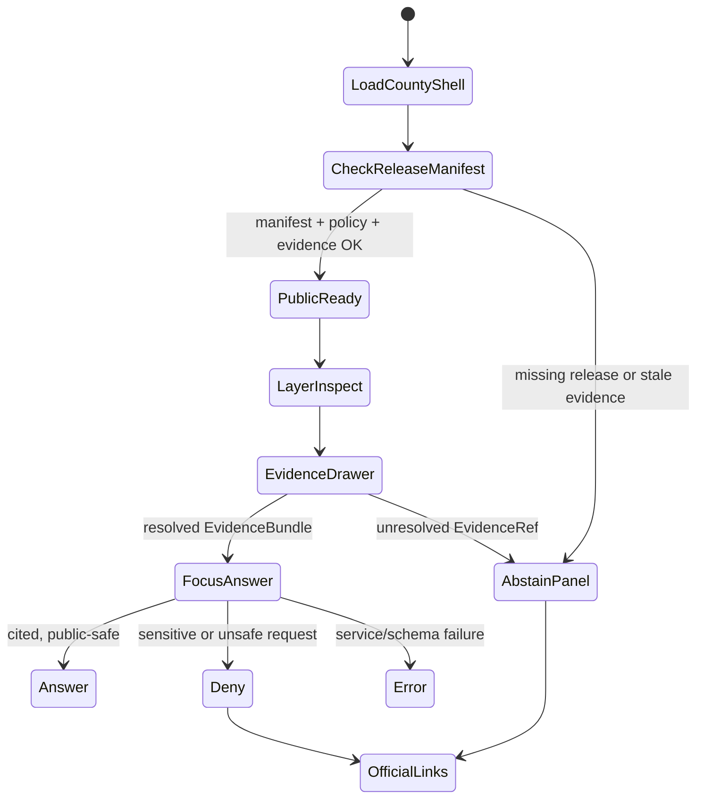
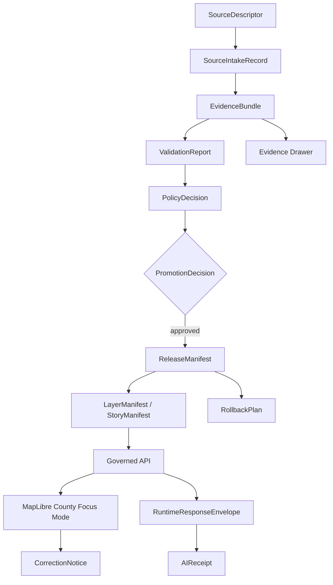
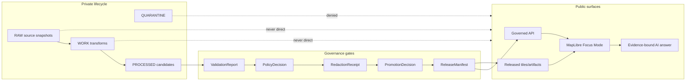
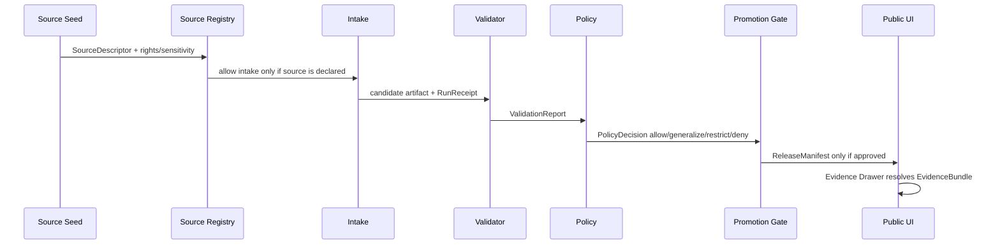

<!--
doc_id: NEEDS_VERIFICATION
title: Atchison County Focus Mode Build Plan
type: standard
version: v1
status: draft
owners:
  - NEEDS_VERIFICATION
created: 2026-05-21
updated: 2026-05-21
policy_label: public
related:
  - docs/doctrine/directory-rules.md # NEEDS_VERIFICATION
  - docs/doctrine/truth-posture.md # NEEDS_VERIFICATION
  - docs/doctrine/trust-membrane.md # NEEDS_VERIFICATION
  - docs/doctrine/lifecycle-law.md # NEEDS_VERIFICATION
  - docs/focus-modes/counties/README.md # PROPOSED / NEEDS_VERIFICATION
  - docs/focus-modes/counties/atchison/README.md # PROPOSED / NEEDS_VERIFICATION
tags:
  - kfm
  - focus-mode
  - kansas
  - atchison-county
  - missouri-river
  - floodplain
  - agriculture
  - geology
  - transportation
  - cultural-heritage
notes:
  - "Repo paths in this document are PROPOSED until verified against a mounted Kansas Frontier Matrix repository."
  - "County facts and source seeds require source-rights, freshness, and authority verification before publication."
  - "Public surfaces must use governed APIs, released artifacts, catalog/triplet/graph records, tile services, EvidenceBundle resolution, and policy-safe runtime envelopes."
  - "Sensitive cultural, cemetery, living-person, private property, infrastructure, and exact vulnerability details fail closed or are generalized."
-->

<a id="top"></a>

# Atchison County Focus Mode Build Plan

> **Status:** PROPOSED county proof-slice plan  
> **County:** Atchison County, Kansas  
> **Focus Mode theme:** Missouri River · floodplain modernization · agriculture · historic transport edge  
> **Truth posture:** cite-or-abstain · fail-closed · evidence-first · map-first · time-aware · auditable · reversible  
> **Repository posture:** NO_LOCAL_REPO_EVIDENCE for this generated plan. All paths are PROPOSED and NEEDS_VERIFICATION before landing.

<p align="center">
  
  
  
  
  
</p>

<p align="center">
  <a href="#operating-posture">Operating posture</a> ·
  <a href="#why-this-county">Why this county</a> ·
  <a href="#first-demo-layers">Demo layers</a> ·
  <a href="#governed-object-model">Object model</a> ·
  <a href="#proposed-repository-shape">Repo shape</a> ·
  <a href="#source-seed-list">Sources</a> ·
  <a href="#recommended-first-milestone">Milestone</a>
</p>

---

## Executive determination

**Atchison County is a strong next KFM county Focus Mode proof slice** because it concentrates several KFM trust problems into a compact northeast Kansas county: official county GIS, Missouri River boundary and floodplain complexity, White Clay / Brewery / Stranger Creek flood history, U.S. 59 / U.S. 73 and rail corridor context, 2022 agriculture statistics, Kansas Geological Survey mapping, and heritage interpretation tied to the Missouri River, Lewis & Clark, Kanza history, Atchison city, and historic rail development.

This plan is **not** a publication approval and does not assert that any repo file, schema, endpoint, route, validator, CI workflow, release manifest, or runtime behavior currently exists. It is a build plan for a future governed slice.

> [!IMPORTANT]
> Atchison County Focus Mode must not expose RAW, WORK, QUARANTINE, unpublished candidates, direct canonical/internal stores, exact sensitive cultural-resource locations, cemetery/burial detail beyond public-safe context, living-person details, parcel-owner claims as title truth, water/sewer/utility vulnerability detail, bridge/rail operational vulnerability, or direct model output as public truth.

---

<a id="operating-posture"></a>

## Operating posture

| Rule | Atchison County application |
|---|---|
| EvidenceBundle outranks generated language | Every public claim about flood zones, agriculture, geology, transportation, property context, or history resolves to an EvidenceBundle or the UI abstains. |
| Public clients use governed interfaces | The public viewer reads governed API payloads, released PMTiles / GeoParquet / COG artifacts, catalog records, graph/triplet summaries, and policy-safe RuntimeResponseEnvelopes only. |
| RAW / WORK / QUARANTINE are not public | County ArcGIS exports, FIS extracts, parcel-derived transforms, and any source snapshots remain hidden until validation, review, policy, and release gates complete. |
| Publication is a governed transition | A layer moving from candidate to public requires PromotionDecision, ReleaseManifest, receipts, rollback target, and correction path. |
| AI is interpretive only | Focus Mode can explain cited layers and EvidenceBundles; it cannot invent county facts, decide release, or turn uncited text into truth. |
| Sensitive detail fails closed | Cultural sites, burials, private people, parcels, utility systems, critical infrastructure, and exact vulnerability surfaces are denied, redacted, or generalized. |
| Map is not the sovereign record | Tiles, popups, screenshots, Story Nodes, and AI summaries are downstream carriers. Catalog/proof/evidence/policy/release records carry authority. |

**Default runtime outcomes:** `ANSWER`, `ABSTAIN`, `DENY`, `ERROR`.

---

<a id="why-this-county"></a>

## Why this county

Atchison County gives KFM a compact but high-signal county slice where **river physics, public records, historic interpretation, and infrastructure context collide**. It is not as urban-heavy as Wyandotte or Johnson, not as agriculture-only as some western counties, and not as ecology-only as a habitat slice. It is a good proof point for a public-safe county Focus Mode because it forces KFM to draw clean boundaries between public context, source evidence, and sensitive detail.

### County-specific proof pressure

| Pressure | Why it matters for KFM | Public-safe posture |
|---|---|---|
| County GIS richness | Atchison County publishes maps for parcel ownership, roads/bridges, voters, 911 service, FEMA flood hazard, tax districts, water districts, sewer collection, cemetery map, and possible parcel issues. | Use as source seeds only; do not treat parcel/public works layers as publication authority without rights, sensitivity, and source-role checks. |
| Missouri River boundary and floodplain behavior | The county’s eastern edge is tied to a large engineered river with cross-state boundary, floodplain, levee, and navigation history. | Show generalized river/floodplain context; avoid emergency-alert behavior and exact vulnerability claims. |
| White Clay / Brewery / Stranger Creek flood record | Flood history includes local creeks, engineered drainage, historic damage, and FEMA FIS modeling. | Explain historical and regulatory context with dates/source roles; do not provide safety instructions or real-time warnings. |
| Agriculture + settlement edge | 2022 agriculture metrics can anchor a county land-use and economy panel. | Use aggregate statistics and CDL-derived class histograms; avoid farm-specific claims unless public, cited, and policy-approved. |
| Geology / geohydrology | KGS identifies Atchison mapping gaps and county geohydrology / quadrangle map products. | Show public geologic context; keep landslide/vulnerability interpretations generalized unless reviewed. |
| Historic transport and river city context | Atchison’s riverfront, rail heritage, bridges, and roads create a rich Story Node candidate. | Separate historic interpretation from legal/property/public safety claims; cite source bundles. |
| Cemetery and cultural-resource sensitivity | County map seeds include cemetery mapping; river-corridor heritage can intersect Indigenous and burial contexts. | Fail closed on exact sensitive locations; use generalized interpretive overlays with cultural/steward review. |

### Product thesis

**Atchison County Focus Mode should help a public user ask:**

> “How do the Missouri River, floodplain history, roads, agriculture, geology, and historic settlement patterns fit together in Atchison County — and what evidence supports each map claim?”

The first version should feel like a county “evidence cockpit,” not an answer bot. It should show what KFM knows, what it can cite, what it refuses to expose, what is stale, and what requires review.

---

<a id="product-thesis"></a>

## Product thesis

**Atchison County Focus Mode** is a county-level governed map experience that combines first-wave public sources into an inspectable, policy-aware, time-aware county narrative. It should support exploration without pretending to be a legal, emergency, title, engineering, or cultural-resource authority.

### What this Focus Mode is

- A **public-safe county context lens** for Atchison County.
- A **source-ledger-backed demo slice** for KFM county Focus Mode patterns.
- A **MapLibre-facing UI plan** using released artifacts and governed API payloads.
- A **governance stress test** for floodplain, parcel, infrastructure, heritage, and sensitive-location boundaries.
- A **fixture-first implementation plan** before live ingestion or publication.

### What this Focus Mode is not

- Not an emergency flood warning system.
- Not a property title, appraisal, survey, or legal boundary authority.
- Not a live road construction routing product.
- Not a cultural-site locator.
- Not a cemetery/burial disclosure tool.
- Not a public utility vulnerability map.
- Not a direct AI chat over raw county or source records.

---

<a id="scope-boundary"></a>

## Scope boundary

### Included in the first governed slice

| Area | Included public-safe output |
|---|---|
| County orientation | Boundary, county seat context, municipalities/townships as public geography, source-cited summary. |
| Official GIS context | Links/source descriptors for county map services; public-safe derived layer inventory only after rights and sensitivity review. |
| Floodplain context | FEMA / KDA effective floodplain context; FIS-derived flood-source summary; no emergency guidance. |
| Hydrology | Missouri River, White Clay Creek, Brewery Creek, Stranger Creek context; USGS / NOAA/NWPS gauge links as source seeds. |
| Agriculture | KDA / USDA aggregate agriculture stats; CDL county class histogram plan; no farm-specific claims in first release. |
| Transportation | U.S. 59 / U.S. 73, road/bridge map seed, KDOT project source seed, generalized bridge/road context. |
| Geology | KGS county geologic map / geohydrology / surficial quadrangle source references; generalized landscape interpretation. |
| History / heritage | Public-safe Story Nodes for riverfront, Lewis & Clark interpretive context, rail/settlement history, Amelia Earhart / city context where cited. |
| Evidence UI | Evidence Drawer, source confidence, source role, last checked, policy label, release state, and limitations. |

### Excluded from public release by default

| Exclusion | Reason |
|---|---|
| RAW county GIS exports | Unreviewed source terms, freshness, and sensitivity. |
| Exact private parcel-owner claims | Property and living-person risks; assessor/appraiser records are not title truth. |
| Utility system details | Water/sewer layers can create infrastructure exposure. |
| Exact cemetery/burial/cultural-resource coordinates | Cultural sensitivity, family privacy, and site-protection posture. |
| Exact infrastructure vulnerability | Bridge/rail/road weakness, traffic-control, or public-safety exposure. |
| Emergency flood advice | KFM is not an alerting authority. Link to official sources instead. |
| Direct AI-generated county facts | AI can summarize resolved EvidenceBundles only. |

---

<a id="first-demo-layers"></a>

## First demo layers

> [!NOTE]
> Layer names below are PROPOSED. They are not claims that PMTiles, schemas, or manifests exist.

| Layer ID | Display name | Source seed | Public-safe transform | Evidence requirement | Initial policy |
|---|---|---|---|---|---|
| `ks_atc_county_boundary_v1` | Atchison County boundary | TIGER/Line or Kansas GIS boundary source | County polygon only | SourceDescriptor + boundary EvidenceBundle | `public` |
| `ks_atc_municipal_context_v1` | Cities / towns / civic context | Census / county / state GIS | Generalized municipal points / polygons | EvidenceBundle with geography vintage | `public` |
| `ks_atc_official_gis_index_v1` | Official county GIS source index | Atchison County Maps page | Link/index only, no scraped internal data | SourceDescriptor + rights review | `public_context` |
| `ks_atc_floodplain_context_v1` | Effective floodplain context | KDA Floodplain Viewer + FEMA MSC/FIS | Released flood zones; no safety advice | FIS / FEMA / KDA EvidenceBundle | `public_context` |
| `ks_atc_hydro_corridors_v1` | Missouri River and named creek context | FIS, NHD, USGS/NWPS | Generalized corridors + cited notes | EvidenceBundle + hydrology source roles | `public_context` |
| `ks_atc_ag_2022_summary_v1` | Agriculture 2022 summary | KDA / USDA Census of Agriculture | Aggregate county stats only | KDA/USDA EvidenceBundle | `public` |
| `ks_atc_cdl_histogram_v1` | Crop/land-cover histogram | USDA CDL | County aggregate histogram; no farm inference | CDL SourceDescriptor + run receipt | `public_context` |
| `ks_atc_geology_context_v1` | Geology / geohydrology context | KGS county map and quadrangles | Generalized units / map links | KGS EvidenceBundle | `public_context` |
| `ks_atc_transport_context_v1` | Road/bridge corridor context | KDOT + county road/bridge map | Generalized corridors and project source links | KDOT / county EvidenceBundle | `public_context` |
| `ks_atc_heritage_story_nodes_v1` | Riverfront and historic story nodes | GeoKansas, KSHS/NPS/city sources | Narrative points generalized where needed | EvidenceBundle + rights review | `public_context` |
| `ks_atc_sensitive_suppression_mask_v1` | Sensitive-location suppression mask | Policy-derived, not source-public | Internal only; never rendered as public layer | PolicyDecision + RedactionReceipt | `restricted_internal` |

---

<a id="user-journeys"></a>

## User journeys

### 1. Public explorer: “What shaped Atchison County?”

1. User opens Atchison County Focus Mode.
2. Map centers on county boundary and Missouri River edge.
3. User toggles “River + floodplain context.”
4. UI shows public-safe floodplain and creek context.
5. Evidence Drawer lists FEMA/KDA/FIS source roles and limitations.
6. AI summary answers only from resolved EvidenceBundles.
7. If asked for emergency risk or property-specific safety, Focus Mode returns `DENY` or `ABSTAIN` with official-source links.

### 2. Steward reviewer: “Is this layer promotable?”

1. Steward opens layer release candidate.
2. Review console checks source descriptors, rights labels, sensitivity labels, spec_hash, run receipts, validation report, policy decision, and rollback target.
3. A missing RedactionReceipt for cemetery/cultural-resource geometry blocks release.
4. Release proceeds only after PromotionDecision and ReleaseManifest are present.

### 3. County story builder: “Make a riverfront Story Node.”

1. Builder selects Missouri Riverfront / Lewis & Clark / Kanza context source bundle.
2. Story Node accepts only citation-bearing text snippets and generalized geometry.
3. Sensitive assertions are routed to review.
4. Public Story Node displays source role, date, limitations, and correction link.

### 4. Data maintainer: “Did a source change enough to reprocess?”

1. Watcher checks source metadata for KDA/USDA/CDL/FEMA/KDOT source seeds.
2. If source hash or content materially changes, KFM emits a ProposedWorkRecord.
3. No public map changes occur until validation and release gates run.

---

<a id="ui-surfaces"></a>

## UI surfaces

| Surface | Purpose | Must show | Must not show |
|---|---|---|---|
| County header | Orient the user | County name, state, status, last release, evidence health | Unsupported claims of completeness |
| Layer stack | Toggle released layers | Layer name, policy label, release state, source role | RAW/WORK candidate layers |
| Evidence Drawer | Inspect claim support | EvidenceBundle ID, sources, dates, rights, sensitivity, limitations, spec_hash | Unresolved EvidenceRef as proof |
| Focus Mode answer panel | Explain map context | Finite outcome, citations, caveats, “why not shown” | Direct model output without evidence |
| Time lens | Compare source vintages | Source vintage, valid time, release time, stale flags | False temporal precision |
| Sensitivity banner | Explain generalized/withheld layers | Redaction reason and safe explanation | Exact sensitive locations |
| Correction link | Let users challenge claims | CorrectionNotice workflow target | Informal silent edits |
| Steward review drawer | Pre-publication review | Validation, policy, receipts, proofs, rollback | Public access to restricted material |

### UI state diagram



---

<a id="governed-object-model"></a>

## Governed object model

### Minimum object families

| Object | Atchison County use | Required before public display? |
|---|---|---:|
| `SourceDescriptor` | Atchison County Maps, KDA, FEMA/KDA Floodplain Viewer, KGS, KDOT, USGS, Census, GeoKansas. | Yes |
| `SourceIntakeRecord` | Records source access, source role, retrieval date, hash, rights notes. | Yes |
| `EvidenceRef` | Lightweight reference in UI/API payloads. | Yes |
| `EvidenceBundle` | Resolved evidence supporting a claim/layer/story node. | Yes |
| `CountyFocusContext` | Public-safe county scope, layer set, policy labels, source health. | Yes |
| `LayerManifest` | Released map layer contract: tiles/source URL/style/source refs. | Yes |
| `PolicyDecision` | Allow/deny/generalize/restrict/abstain with reason codes. | Yes |
| `ValidationReport` | Schema, source, geometry, temporal, and policy-shape validation. | Yes |
| `RunReceipt` | Deterministic transform record for generated artifacts. | Yes |
| `RedactionReceipt` | Proof of sensitive geometry or field suppression. | Yes when sensitive sources exist |
| `PromotionDecision` | Steward approval/rejection for candidate release. | Yes |
| `ReleaseManifest` | Public release bill of materials. | Yes |
| `CorrectionNotice` | Public or steward correction path. | Yes |
| `RollbackPlan` | Revert target for layer/data/doc release. | Yes |
| `AIReceipt` | Records Focus Mode AI context, model boundary, citation closure. | Yes for AI summaries |

### Object relationship sketch



### Candidate API payload shape

```json
{
  "schema_version": "v1",
  "object_type": "CountyFocusContext",
  "county": {
    "state": "KS",
    "name": "Atchison County",
    "fips": "20005"
  },
  "runtime_outcome": "ANSWER",
  "policy_label": "public_context",
  "release_manifest_ref": "kfm://release/focus-mode/ks/atchison/NEEDS_VERIFICATION",
  "layers": [
    {
      "layer_id": "ks_atc_floodplain_context_v1",
      "display_name": "Floodplain context",
      "policy_label": "public_context",
      "evidence_bundle_ref": "kfm://evidence/NEEDS_VERIFICATION",
      "limitations": [
        "Not an emergency alert system",
        "Check official FEMA/KDA/NOAA/USGS sources for current conditions"
      ]
    }
  ]
}
```

---

<a id="proposed-repository-shape"></a>

## Proposed repository shape

> [!WARNING]
> The following paths are **PROPOSED**. They must be verified against the mounted repo, accepted ADRs, per-root READMEs, and Directory Rules before use. Do not create a root-level `atchison_county/` folder.

### Directory Rules basis used for this proposal

- Responsibility root first; county/topic does not justify a repo root.
- Human documentation belongs under `docs/`.
- Semantic contracts belong under `contracts/`.
- Machine schemas default to `schemas/contracts/v1/...`.
- Policy belongs under singular `policy/`.
- Lifecycle data belongs under `data/<phase>/...`.
- Public-safe artifacts belong under `data/published/...` after release.
- Release decisions belong under `release/...`.
- Validators belong under `tools/validators/...`.
- Test fixtures belong under `fixtures/...` or `tests/fixtures/...`, with one declared meaning.

### Proposed file and folder layout

```text
# Documentation / planning
docs/
  focus-modes/
    counties/
      atchison/
        README.md                                  # PROPOSED
        atchison_county_focus_mode_build_plan.md   # this file, PROPOSED
        source_seed_register.md                    # PROPOSED
        public_safety_notes.md                     # PROPOSED
        sensitivity_review_notes.md                # PROPOSED / restricted as needed

# Semantic contracts
contracts/
  runtime/
    focus-mode/
      county-focus-mode.md                         # PROPOSED / NEEDS_VERIFICATION
  domains/
    counties/
      county-focus-context.md                      # PROPOSED / NEEDS_VERIFICATION

# Machine schemas
schemas/
  contracts/
    v1/
      runtime/
        focus_mode/
          county_focus_context.schema.json          # PROPOSED
          focus_mode_answer_envelope.schema.json    # PROPOSED
      common/
        evidence_ref.schema.json                    # NEEDS_VERIFICATION existing/shared
      release/
        release_manifest.schema.json                # NEEDS_VERIFICATION existing/shared

# Source registry and source descriptors
data/
  registry/
    sources/
      ks/
        atchison_county/
          atchison_county_maps.source_descriptor.json       # PROPOSED
          kda_atchison_ag_stats.source_descriptor.json      # PROPOSED
          kda_floodplain_viewer.source_descriptor.json      # PROPOSED
          fema_fis_atchison.source_descriptor.json          # PROPOSED
          kgs_atchison_geology.source_descriptor.json       # PROPOSED
          usgs_06818300.source_descriptor.json              # PROPOSED
          kdot_atchison_us59.source_descriptor.json         # PROPOSED

# Lifecycle data; not public by default
data/
  raw/focus_mode/ks/atchison/                       # PROPOSED, private lifecycle lane
  work/focus_mode/ks/atchison/                      # PROPOSED
  quarantine/focus_mode/ks/atchison/                # PROPOSED
  processed/focus_mode/ks/atchison/                 # PROPOSED
  catalog/focus_mode/ks/atchison/                   # PROPOSED
  receipts/focus_mode/ks/atchison/                  # PROPOSED
  proofs/focus_mode/ks/atchison/                    # PROPOSED
  published/focus_mode/ks/atchison/                 # PROPOSED, released public-safe only
  rollback/focus_mode/ks/atchison/                  # PROPOSED

# Policy and validation
policy/
  runtime/
    focus_mode/
      county_focus_mode.rego                        # PROPOSED / tool choice NEEDS_VERIFICATION
  domains/
    cultural_heritage/
      public_location_suppression.rego              # PROPOSED
    infrastructure/
      vulnerability_suppression.rego                # PROPOSED

tools/
  validators/
    focus_mode/
      validate_county_focus_context.py              # PROPOSED
      validate_focus_mode_release_closure.py        # PROPOSED

fixtures/
  domains/
    focus_mode/
      counties/
        atchison/
          valid/
            county_context_minimal.valid.json       # PROPOSED
            floodplain_public_context.valid.json    # PROPOSED
          invalid/
            raw_arcgis_public_url.invalid.json      # PROPOSED
            missing_evidence_ref.invalid.json       # PROPOSED
            exact_cemetery_location.invalid.json    # PROPOSED
            utility_network_exposure.invalid.json   # PROPOSED
            ai_uncited_claim.invalid.json           # PROPOSED

# Pipeline specs, release candidates, and tests
pipeline_specs/
  focus_mode/
    atchison_county_focus_mode.yaml                 # PROPOSED

tests/
  focus_mode/
    counties/
      test_atchison_county_focus_mode.py            # PROPOSED
  policy/
    test_county_focus_mode_sensitivity.py           # PROPOSED

release/
  candidates/
    focus_mode/
      ks/
        atchison/
          release_manifest.candidate.json           # PROPOSED
          promotion_decision.candidate.json         # PROPOSED
          rollback_plan.candidate.json              # PROPOSED
```

---

<a id="build-phases"></a>

## Build phases

### Phase 0 — Evidence and placement audit

**Goal:** avoid false repo claims and prevent path drift.

- [ ] Mount or clone target KFM repository.
- [ ] Record branch, commit, dirty state, and package manager.
- [ ] Check existing Focus Mode, county, source registry, schema, policy, and MapLibre paths.
- [ ] Confirm whether `docs/focus-modes/counties/` exists or requires an ADR / README addition.
- [ ] Confirm schema home and existing `schemas/contracts/v1/runtime/focus_mode/` conventions.
- [ ] Create or update drift register entries for any parallel homes.
- [ ] Do not ingest live county data yet.

**Exit gate:** repo evidence table with CONFIRMED / PROPOSED / UNKNOWN / NEEDS_VERIFICATION labels.

### Phase 1 — Source seed ledger

**Goal:** build source descriptors before data processing.

- [ ] Add source descriptors for county maps, flood zones, FIS, KDA agriculture stats, KGS geology, USGS gage, KDOT project, Census, GeoKansas, and historical-source candidates.
- [ ] Classify each as `primary`, `corroborating`, `context`, or `restricted`.
- [ ] Add rights, update cadence, API/map-service terms, data format, and sensitivity fields.
- [ ] Flag county ArcGIS services with `NEEDS_RIGHTS_VERIFICATION` until terms are checked.
- [ ] Record source vintage and last-checked time.

**Exit gate:** source descriptors validate and produce a source ledger report.

### Phase 2 — Contract, schema, and fixture spine

**Goal:** prove the Focus Mode object shapes before rendering maps.

- [ ] Define `CountyFocusContext` contract.
- [ ] Define Focus Mode answer envelope contract with finite outcomes.
- [ ] Define source-role, evidence-closure, policy-label, and release-state required fields.
- [ ] Add Atchison valid fixtures.
- [ ] Add Atchison invalid fixtures for sensitive and uncited failure paths.
- [ ] Add no-network validator tests.

**Exit gate:** all valid fixtures pass; all invalid fixtures fail for the expected reason.

### Phase 3 — Public-safe synthetic layer bundle

**Goal:** generate a no-network mock demo without publishing real source data.

- [ ] Build a tiny synthetic county boundary / river corridor / floodplain context fixture.
- [ ] Bind a mock MapLibre layer manifest to a fake released artifact URL.
- [ ] Add EvidenceBundle stubs with source refs.
- [ ] Prove Evidence Drawer renders limitations and policy labels.
- [ ] Ensure direct model calls are impossible from public UI.

**Exit gate:** demo runs from mock governed API only.

### Phase 4 — Real source transform candidates

**Goal:** process first public-safe source transforms into candidate artifacts.

- [ ] Pull source snapshots into `data/raw/...` only after source terms are verified.
- [ ] Transform to county-safe aggregates and generalized layers.
- [ ] Generate RunReceipt, ValidationReport, RedactionReceipt where needed.
- [ ] Store candidate artifacts under processed/catalog/proof lanes.
- [ ] Do not publish until release gates pass.

**Exit gate:** release candidate package exists with no public exposure.

### Phase 5 — Release rehearsal

**Goal:** prove publication, correction, and rollback.

- [ ] Run policy gate for public-safe release.
- [ ] Produce ReleaseManifest and rollback target.
- [ ] Publish only minimal PMTiles/GeoParquet/COG artifacts approved for public context.
- [ ] Confirm UI reads released artifact + governed API only.
- [ ] Drill one correction notice and rollback rehearsal.

**Exit gate:** release is reversible and inspectable.

---

<a id="first-pr-sequence"></a>

## First PR sequence

| PR | Name | Purpose | Files touched | Must prove |
|---:|---|---|---|---|
| PR-0001 | Atchison Focus Mode planning doc | Add this plan and a county README. | `docs/focus-modes/counties/atchison/...` | No repo overclaims; Directory Rules basis included. |
| PR-0002 | Source descriptor skeleton | Add source seed descriptors only. | `data/registry/sources/ks/atchison_county/...` | Rights/sensitivity fields present; source roles explicit. |
| PR-0003 | Contract + schema spine | Add or extend county Focus Mode contracts/schemas. | `contracts/...`, `schemas/contracts/v1/...` | Schema home follows ADR; examples validate. |
| PR-0004 | Fixture + policy failures | Add Atchison valid/invalid fixtures and policy tests. | `fixtures/...`, `policy/...`, `tests/...` | Sensitive and uncited cases fail closed. |
| PR-0005 | Mock governed API demo | Add a no-network mock context for UI. | `apps/...` or `packages/...` NEEDS_VERIFICATION | Public UI reads mock governed API only. |
| PR-0006 | Candidate transforms | Add first real-source transform candidates after source review. | `pipeline_specs/...`, `data/raw/work/processed/...` | Receipts, validation, redaction, catalog closure. |
| PR-0007 | Release rehearsal | Create candidate release manifest and rollback drill. | `release/candidates/...`, `data/published/...` after approval | Release is reversible and correction-capable. |

---

<a id="acceptance-checklist"></a>

## Acceptance checklist

### Governance acceptance

- [ ] The plan does not create a county root folder.
- [ ] All repo paths are labeled PROPOSED until mounted repo inspection.
- [ ] All source-dependent claims cite source seeds or abstain.
- [ ] Source roles are explicit: primary, corroborating, context, restricted.
- [ ] Rights and terms are checked for county ArcGIS services before derived use.
- [ ] Publication requires PromotionDecision and ReleaseManifest.
- [ ] Release has rollback target and correction path.

### Public-safety acceptance

- [ ] No exact cultural, cemetery, burial, or sensitive ecology locations in public fixtures.
- [ ] No utility or infrastructure vulnerability geometry in public fixtures.
- [ ] No private parcel-owner details in public AI answers.
- [ ] No emergency flood guidance; only official-source pointers.
- [ ] No direct model response without EvidenceBundle closure.
- [ ] Sensitive requests return `DENY`; evidence gaps return `ABSTAIN`.

### Technical acceptance

- [ ] Valid fixtures pass.
- [ ] Invalid fixtures fail for expected reason.
- [ ] All EvidenceRefs resolve to EvidenceBundles.
- [ ] All layers have layer manifest, source refs, policy label, release state, and limitations.
- [ ] Map renderer cannot load RAW/WORK/QUARANTINE URLs.
- [ ] Focus Mode answers generate AIReceipt and citation validation report.
- [ ] PMTiles/GeoParquet/COG artifacts, if generated, have hashes and run receipts.

---

## Fixture plan

### Valid fixtures

| Fixture | Purpose |
|---|---|
| `county_context_minimal.valid.json` | Minimal Atchison County context with boundary, source refs, policy label, and release state. |
| `floodplain_public_context.valid.json` | Public-safe floodplain context with official-source limitations and no emergency advice. |
| `ag_aggregate_summary.valid.json` | KDA/USDA aggregate agriculture panel with no farm-specific inference. |
| `geology_context.valid.json` | KGS county geology source refs and generalized geology layer metadata. |
| `transport_context.valid.json` | Generalized U.S. 59 / U.S. 73 / bridge project source summary with stale-date warning. |

### Invalid fixtures

| Fixture | Must fail because |
|---|---|
| `raw_arcgis_public_url.invalid.json` | Public layer points to raw county ArcGIS service without release manifest. |
| `missing_evidence_ref.invalid.json` | Layer or answer lacks EvidenceRef / EvidenceBundle closure. |
| `exact_cemetery_location.invalid.json` | Public response exposes exact cemetery/burial or grave-level detail. |
| `utility_network_exposure.invalid.json` | Water/sewer distribution geometry is exposed to public layer. |
| `parcel_owner_title_claim.invalid.json` | Parcel/appraiser data is presented as legal title truth. |
| `bridge_vulnerability_detail.invalid.json` | Transportation structure detail creates vulnerability exposure. |
| `ai_uncited_claim.invalid.json` | Model invents or summarizes county fact without citations. |
| `emergency_flood_advice.invalid.json` | Focus Mode acts as emergency alert/safety instruction system. |

---

<a id="risk-register"></a>

## Risk register

| Risk | County-specific trigger | Severity | Default response | Mitigation artifact |
|---|---|---:|---|---|
| Flood authority confusion | User treats KFM floodplain layer as current emergency guidance. | High | `ABSTAIN` / official links | Limitation text + policy fixture. |
| Stale map modernization | FEMA/KDA/county flood maps differ by date/status. | High | Show source vintage and status; no merge without review. | SourceIntakeRecord + stale-state validator. |
| Parcel/title overclaim | Parcel ownership or appraiser data treated as title boundary. | High | `DENY` title claims; show context only. | Private-property policy fixture. |
| Utility exposure | Water district/sewer collection map becomes public vulnerability surface. | High | Restrict or generalize; require review. | RedactionReceipt. |
| Cemetery/burial sensitivity | Public cemetery map or heritage layer exposes burial-level data. | High | Generalize or deny. | Cultural sensitivity PolicyDecision. |
| Cultural heritage harm | River corridor story exposes Indigenous or archaeological sensitive detail. | High | Steward/cultural review; generalized narrative. | Review record + transform receipt. |
| Infrastructure exposure | Bridge/rail project details are turned into vulnerability analysis. | Medium/High | Show only public KDOT context; deny vulnerability questions. | Infrastructure policy gate. |
| Cross-state river confusion | Missouri River boundary behavior causes geometry/legal confusion. | Medium | Explain source role and uncertainty; cite official boundary source. | Boundary EvidenceBundle. |
| Source rights ambiguity | County ArcGIS layers have unclear reuse terms. | Medium | Source seed only until rights checked. | Rights review checklist. |
| AI hallucination | Focus Mode invents local history or source facts. | High | Citation validator rejects. | AIReceipt + CitationValidationReport. |
| Current-condition drift | USGS/NWPS/KDOT status changes after release. | Medium | Time-stamp, stale flag, source links. | Source watcher + stale-state report. |
| Geology precision risk | Generalized geology becomes slope/foundation/engineering advice. | Medium | Limit to educational context; no engineering claims. | Geology limitations. |
| Public trust gap | Users cannot see why something is withheld. | Medium | Display suppression reason classes. | Sensitivity banner. |
| Repo path drift | County plan creates new parallel root. | Medium | Directory Rules review. | PR placement checklist. |

---

<a id="source-seed-list"></a>

## Source seed list

> [!CAUTION]
> These are **source seeds**, not automatically approved sources. Each seed needs source role, rights, freshness, sensitivity, and transform review before use in a public release.

| Seed | Source role | What it can support | Public-safe use | Verification need |
|---|---|---|---|---|
| Atchison County official website | Context / primary for county presence | County offices, contact, official portal. | Link in source registry. | Confirm current official domain and terms. |
| Atchison County Maps page | Primary source seed for county GIS index | Parcel Ownership, Road & Bridge Reference Map, Voter Map, 911 Emergency Service Map, FEMA Flood Hazard Map, Tax Districts, Water Districts and Distribution, Sewer Collection Map, Cemetery Map. | Source index only at first; do not expose raw utility/cemetery layers. | Rights, API/service terms, sensitivity review. |
| Atchison County FEMA Map Modernization page | Primary/context for local flood-zone process | Flood-zone modernization process, linked maps, FIS, permit resources. | Floodplain context and source links. | Determine current map status vs effective KDA/FEMA data. |
| Atchison County Flood Insurance Study PDF | Primary regulatory/hydrology source | Missouri River, White Clay Creek, Brewery Creek, Stranger Creek flood-source history/modeling. | EvidenceBundle-backed floodplain narrative. | Check effective date, supersession, LOMRs. |
| Kansas Current Effective Floodplain Viewer | Primary state effective floodplain viewer | Current effective Kansas floodplain layer as viewer source. | Public floodplain context. | Confirm latest update, data download rights, county status. |
| FEMA Map Service Center | Primary federal flood map source | Effective FIRMs/LOMRs and official flood map records. | Official-source link and EvidenceBundle. | Query Atchison County effective panels. |
| KDA Atchison County agriculture statistics | Primary aggregate agriculture source | 2022 farms, farm acres, crop/livestock sales, ag sectors. | Aggregate ag panel. | Note KDA page title spelling; verify against USDA PDF. |
| USDA 2022 Census of Agriculture county profile | Primary agriculture source | Farm count, acres, market value, expenses, income. | Aggregate county statistics. | Verify values and citation date. |
| KGS Atchison County geologic map page | Primary geology source | County geologic map status, geohydrology publication, quadrangle products. | Generalized geology context. | Confirm map vintage and publication limitations. |
| KGS GeoKansas Riverfront Park, Atchison | Context / educational geology-history source | Missouri River boundary behavior, Riverfront Park, Lewis & Clark Pavilion, Kanza context. | Public Story Node seed. | Rights and interpretive limitations. |
| USGS Missouri R at Atchison, KS — 06818300 | Primary observation source | Monitoring location metadata and water data links. | Source link; no emergency conclusions. | Parameter availability and API cadence. |
| NOAA/NWPS Missouri River at Atchison | Primary forecast/context source | River forecast/gage page. | Official link for current conditions. | Respect redirect/NOAA disclaimer; do not scrape unofficial redirect target blindly. |
| KDOT District 1 / Atchison project releases | Primary transportation source | U.S. 59 bridge project over Stranger Creek / 262nd Road and district context. | Public road/project context with stale warning. | Current project status and closure info. |
| Census QuickFacts Atchison County | Primary demographic source | Population and demographic/economic indicators. | Aggregate context only. | Select exact facts and vintage before use. |
| City of Atchison official website | Context / municipal source | City contact, services, official municipal context. | Civic context links. | Confirm city GIS/open data if any. |
| Kansas Historical Society / KHRI / NPS NRHP | Primary/context heritage source | Historic-register and cultural-resource candidates. | Generalized history; exact sensitive site handling. | Rights, sensitivity, location precision, review state. |
| NHD / USGS hydrography | Primary hydrography source | River/stream network geometry. | Generalized hydro corridors. | Geometry vintage and transform receipt. |
| USDA CDL | Primary land-cover/crop raster source | County crop/land-cover class histograms. | Aggregate histogram and generalized map. | Source version, classmap, material-change threshold. |
| SSURGO / Web Soil Survey | Primary soils source | Soil map units and interpretations. | Generalized soils context only. | Public-safe rendering and interpretation limits. |

### Seed URLs

| Label | URL |
|---|---|
| Atchison County official website | https://www.atchisoncountyks.org/ |
| Atchison County Maps | https://www.atchisoncountyks.org/241/Maps |
| Atchison County FEMA Map Modernization | https://atchisoncountyks.org/397/Flood-Zones |
| Atchison County FIS PDF | https://www.atchisoncountyks.org/DocumentCenter/View/1140/FIS?bidId= |
| Kansas Current Effective Floodplain Viewer | https://gis2.kda.ks.gov/gis/ksfloodplain/ |
| FEMA Map Service Center | https://msc.fema.gov/portal/search |
| KDA Atchison County agriculture statistics | https://www.agriculture.ks.gov/kansas-agriculture/kansas-agricultural-statistics/atchinson-county |
| USDA Census of Agriculture Atchison County Profile | https://www.nass.usda.gov/Publications/AgCensus/2022/Online_Resources/County_Profiles/Kansas/cp20005.pdf |
| KGS Atchison County geologic map | https://www.kgs.ku.edu/General/Geology/County/abc/atchison.html |
| GeoKansas Riverfront Park, Atchison | https://geokansas.ku.edu/riverfront-park-atchison |
| USGS Missouri R at Atchison — 06818300 | https://waterdata.usgs.gov/monitoring-location/USGS-06818300/ |
| NOAA/NWPS Missouri River at Atchison | https://water.noaa.gov/gauges/06818300 |
| KDOT U.S. 59 bridge project release | https://www.ksdot.gov/Home/Components/News/News/5160/385?widgetId=3472 |
| Census QuickFacts Atchison County | https://www.census.gov/quickfacts/fact/table/atchisoncountykansas/PST045224 |
| City of Atchison | https://cityofatchison.com/ |

---

<a id="open-verification-questions"></a>

## Open verification questions

### Repository / placement

- [ ] Does the repo already have `docs/focus-modes/counties/` or another canonical Focus Mode documentation home?
- [ ] Is Focus Mode schema authority under `schemas/contracts/v1/runtime/focus_mode/`, `schemas/contracts/v1/ui/`, or another accepted ADR path?
- [ ] Are county-specific fixtures stored under root `fixtures/`, `tests/fixtures/`, or both with documented roles?
- [ ] Does the current web app live under `apps/web`, `apps/explorer-web`, or another route?
- [ ] What are the existing governed API route names for county Focus Mode payloads?

### Source / rights / freshness

- [ ] What are the terms of use for Atchison County ArcGIS web maps and services?
- [ ] Which county GIS layers may be linked publicly but not ingested?
- [ ] Which FEMA/KDA floodplain product is the current effective authority for Atchison County?
- [ ] Have any LOMRs changed the effective floodplain after the county FIS PDF?
- [ ] Are KGS quadrangle maps authoritative enough for current generalized geology display?
- [ ] What is the latest KDOT status for the U.S. 59 bridge project?
- [ ] Which USGS parameters are currently available for station 06818300?

### Policy / sensitivity

- [ ] How should public cemetery maps be treated when the source itself is public?
- [ ] What exact geometry thresholds define “generalized enough” for cultural/heritage story nodes?
- [ ] Should water district and sewer collection maps be source-index-only, restricted, or generalized?
- [ ] Are rail line details public context or infrastructure-sensitive in the Atchison slice?
- [ ] What cultural/steward review is required for Kanza-related interpretive text?

### Product / UX

- [ ] Should Atchison County be framed as “Riverfront / floodplain modernization” or “Historic transport edge” in the UI?
- [ ] Should the first demo prioritize floodplain context or agriculture/geology context?
- [ ] What is the public-facing wording for `ABSTAIN` when a user asks for property-specific flood risk?
- [ ] How much source-vintage detail should the header show before overwhelming public users?

---

## Governance diagrams

### Public trust membrane



### Source-to-release sequence



---

<a id="recommended-first-milestone"></a>

## Recommended first milestone

### Milestone M1 — Atchison County public-safe river and flood context shell

**Goal:** ship a no-network, fixture-first Focus Mode shell that demonstrates the Atchison County trust membrane without publishing live source data.

**M1 includes:**

- Atchison County Focus Mode docs and source seed register.
- `CountyFocusContext` schema or schema-extension proposal.
- Source descriptors for Atchison County Maps, Flood Zones, FIS, KDA agriculture, KGS geology, KDA Floodplain Viewer, USGS gage, KDOT project, and GeoKansas Riverfront.
- Valid fixtures for county context, floodplain context, agriculture aggregate, and geology context.
- Invalid fixtures for raw ArcGIS exposure, exact cemetery location, utility exposure, parcel-title claim, and uncited AI claim.
- Mock governed API response and MapLibre UI fixture.
- Evidence Drawer mock showing source role, policy label, limitations, release state, and correction path.
- Policy tests proving sensitive requests return `DENY` and evidence gaps return `ABSTAIN`.

**M1 excludes:**

- Live county GIS ingestion.
- Public PMTiles generation from real county services.
- Any cemetery, utility, parcel-owner, or sensitive cultural-resource public layer.
- Emergency flood warnings or route guidance.
- Direct model access from the public UI.

### M1 definition of done

- [ ] `CountyFocusContext` fixture validates.
- [ ] All invalid fixtures fail closed.
- [ ] Mock UI loads no RAW/WORK/QUARANTINE URL.
- [ ] Focus Mode answer includes finite outcome and citation closure.
- [ ] Evidence Drawer shows limitations and source roles.
- [ ] Release rehearsal has rollback target.
- [ ] README states that all real-source publication remains blocked pending source-rights and sensitivity review.

---

## Final implementation note

Atchison County should be treated as a **public-safe interpretation and evidence-navigation slice**, not a raw county GIS mirror. Its value is the governed connection between river/floodplain history, agriculture, geology, transportation, and heritage — with the trust membrane visible at every click.

[⬆ Back to top](#top)
