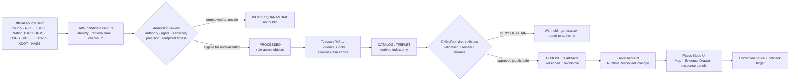
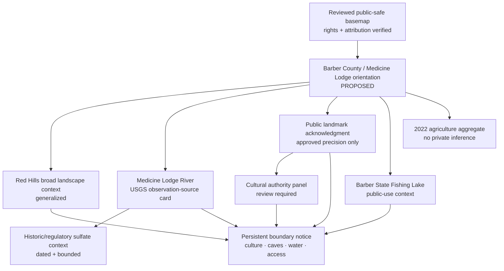
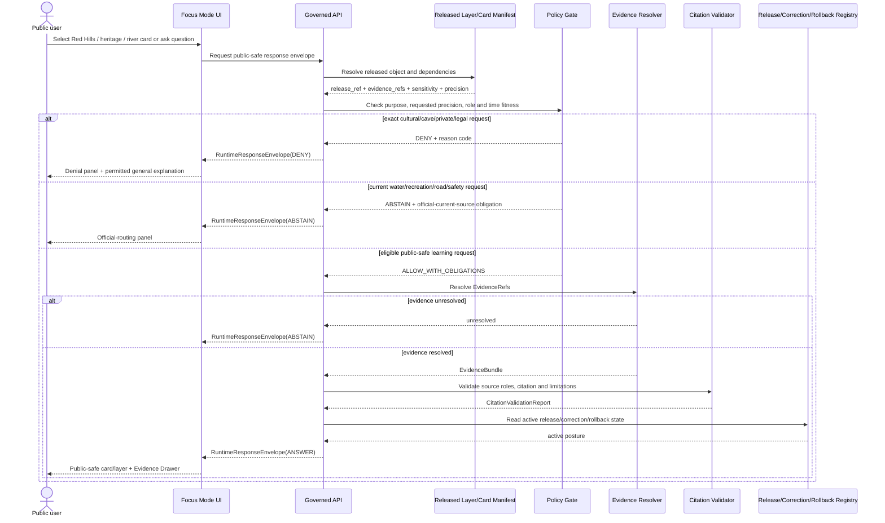
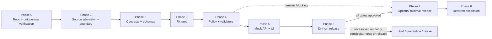

<!-- KFM_META_BLOCK_V2
doc_id: NEEDS_VERIFICATION
title: Barber County Focus Mode Build Plan
type: standard
version: v1
status: draft
owners: [NEEDS_VERIFICATION]
created: 2026-05-22
updated: 2026-05-22
policy_label: NEEDS_VERIFICATION — proposed_public_draft
repository_path: NEEDS_VERIFICATION — PROPOSED docs/focus-modes/barber-county/barber_county_focus_mode_build_plan.md
contract_home: NEEDS_VERIFICATION — PROPOSED only after repository and ADR verification
schema_home: NEEDS_VERIFICATION — Directory Rules default is schemas/contracts/v1/<...>; Focus Mode county/product lane unresolved
policy_home: NEEDS_VERIFICATION — PROPOSED only after repository and ADR verification
validator_home: NEEDS_VERIFICATION — PROPOSED only after repository and ADR verification
fixture_home: NEEDS_VERIFICATION — PROPOSED only after repository and ADR verification
review_assignments:
  - NEEDS_VERIFICATION — cultural sovereignty / Nation-authority review
  - NEEDS_VERIFICATION — archaeology / cultural-resource sensitivity review
  - NEEDS_VERIFICATION — ecology / fragile landform review
  - NEEDS_VERIFICATION — water-quality / regulatory-context review
  - NEEDS_VERIFICATION — release and rollback review
release_status: NOT_RELEASED
correction_path: NEEDS_VERIFICATION
rollback_path: NEEDS_VERIFICATION
related:
  - Directory Rules.pdf — inspected governing placement doctrine
  - KFM MapLibre Operating Architecture, Governed UI, and AI Interaction Manual - Revised Working Edition — doctrine lineage
  - Kansas Frontier Matrix Pipeline Living Implementation Manual v0.3 — doctrine lineage
  - Existing county Focus Mode plans — NEEDS_VERIFICATION against live repository and authoritative plan registry
tags:
  - kfm
  - focus-mode
  - barber-county
  - red-hills
  - gypsum-hills
  - medicine-lodge-river
  - medicine-lodge-peace-treaty-site
  - cultural-sovereignty
  - caves-and-karst
  - public-safe
notes:
  - Planning artifact only; no repository mutation, implementation, route, test, release, deployment, or publication claim is made.
  - The user-provided completed-county register and earlier selected counties visible in this continuation do not list Barber County.
  - A targeted search of accessible project materials did not surface a Barber County Focus Mode Build Plan; complete live-repository and document-registry confirmation remains NEEDS_VERIFICATION.
  - Official public web sources were checked on 2026-05-22; source admission, rights, derivative-display permission, geometry authority, cultural review, ecological sensitivity, operational freshness, regulatory fitness, and public-release permissions remain gated.
-->

<a id="top"></a>

# Barber County Focus Mode Build Plan
## Red Hills, Medicine Lodge River, Treaty-Site Responsibility, and Public-Safe Landscape Interpretation Proof Slice

> **Product thesis:** Build a public-safe Barber County Focus Mode that connects the Red Hills/Gypsum Hills landscape, Medicine Lodge River context, nationally recognized public-history anchors, state-lake recreation, scenic-route context, and ranching/agricultural aggregates—while withholding culturally sensitive, archaeological, burial, cave, fragile-ecology, private-property, current-operational, and unsupported water-quality or legal detail.


| Identity / status field | Determination |
|---|---|
| Selected county | **Barber County, Kansas** |
| Selection status | **CONFIRMED** against the user-provided completed-county register and county plans created earlier in this visible continuation: Barber County is not listed. |
| Plan-collision check | **NEEDS_VERIFICATION** — targeted search of accessible project materials did not surface a Barber County Focus Mode plan; a live repository and authoritative document registry were not inspected for this plan. |
| Distinct proof value | **PROPOSED** Red Hills cultural-and-environmental boundary slice: Permian gypsum landscape, caves/fragile landform risks, Medicine Lodge River monitoring and historic regulatory context, Medicine Lodge Peace Treaty Site public heritage, Nation-authoritative cultural review, Barber State Fishing Lake public-use context, scenic-byway/current-project routing, and county-scale ranching/agricultural aggregates. |
| Most consequential public-safe boundary | **Cultural-sovereignty, cave/fragile-landform, and water-regulatory boundary:** exact or inference-enabling sacred, burial, archaeological, culturally sensitive, cave, fragile-habitat or private-access detail must fail closed; official historical interpretation does not replace Nation authority; and river/water-quality or operational sources must not become KFM legal, health, access, safety or current-condition conclusions. |
| Evidence basis | **CONFIRMED** current official public-source checks during this run; **CONFIRMED** attached `Directory Rules.pdf` inspected for placement doctrine. |
| Repository status | **UNKNOWN** — no live repository checkout, branch state, deployed runtime, current route, CI run, test execution or release manifest was inspected during this build-plan run. |
| Document posture | **PROPOSED** implementation planning artifact; **NOT_RELEASED**; not evidence of an implemented Focus Mode. |

**Quick links:** [Operating posture](#1-operating-posture) · [Why Barber County](#2-why-this-county) · [Product thesis](#3-product-thesis) · [Scope boundary](#4-scope-boundary) · [First demo layers](#5-first-demo-layers) · [User journeys](#6-user-journeys) · [UI surfaces](#7-ui-surfaces) · [Governed objects](#8-governed-object-model) · [Repository shape](#9-proposed-repository-shape) · [Build phases](#10-build-phases) · [First PR sequence](#11-first-pr-sequence) · [Acceptance](#12-acceptance-checklist) · [Fixtures](#13-fixture-plan) · [Risks](#14-risk-register) · [Source seeds](#15-source-seed-list) · [Verification](#16-open-verification-questions) · [Milestone](#17-recommended-first-milestone)

> [!IMPORTANT]
> **Executive build note.** Barber County creates a particularly valuable KFM proof slice because a single public interface can show how landscape, history and working-land use intersect without flattening authority. Official sources checked during this run establish that Barber County includes Medicine Lodge River context; Kansas Geological Survey describes the Red Hills as a gypsum-influenced Permian landscape covering much of Barber County, including numerous documented caves and continuing gypsum extraction; National Park Service records the Medicine Lodge Peace Treaty Site as a National Historic Landmark in Barber County; Kansas Historical Society provides state historical interpretation; Comanche Nation Tribal Historic Preservation Office provides a Nation-authoritative preservation/review source seed; USGS provides a Medicine Lodge River monitoring-location page; KDHE provides a dated sulfate TMDL source tied to natural gypsum dissolution; KDWP identifies Barber State Fishing Lake public-use context; and USDA NASS/KDA provide 2022 agricultural aggregates. These checked sources justify planning a public-safe proof. They do not automatically authorize a released layer, exact geometry, cultural representation or operational answer. `[S-01] [S-04] [S-05] [S-06] [S-07] [S-08] [S-09] [S-10] [S-12] [S-13]`

> [!CAUTION]
> ## Barber County public-safe boundary — treaty landscape, Red Hills caves, and water interpretation
> Barber’s most valuable public story is also its highest-risk boundary. The product may acknowledge reviewed public historical anchors and explain broad Red Hills/Medicine Lodge River context. It must **DENY** exact or inference-enabling sacred, burial, archaeological or culturally sensitive places; must not substitute state/federal historical interpretation for appropriate Nation-authoritative evidence and review; must **DENY or generalize** exact cave, fragile-landform or sensitive ecological detail; and must **ABSTAIN** from interpreting KDHE/USGS/KDWP/KDOT/county sources as current health, water-quality, legal, title, access, construction, road-safety, fishing/hunting or emergency conclusions. `[S-02] [S-04] [S-05] [S-06] [S-07] [S-08] [S-09] [S-10] [S-11]`

---

## Evidence boundary for this plan

| Status | What is supported here |
|---|---|
| `CONFIRMED` | Barber County is absent from the supplied completed-county register and previously created continuation-plan selections; the attached Directory Rules doctrine was inspected; official public webpages listed as checked source seeds were reviewed in this run and support the narrow claims attributed to them. |
| `PROPOSED` | Product scope, layers, cards, map composition, governed objects, repository paths, schemas/contracts/policies, fixtures, tests, UI behavior, build phases, PR sequence, release design and milestone. |
| `NEEDS_VERIFICATION` | Live repo/document registry collision scan; canonical path and ADRs; source rights; geometry authority and precision; appropriate Nations/review responsibilities; ecological/cave sensitivity; water-quality regulatory and temporal fitness; public-use/operational freshness; release/correction/rollback implementation. |
| `UNKNOWN` | Existing Barber County implementation, actual KFM runtime behavior, routes, current CI/test status, current release state, source connectors, deployed UI, and unsearched project storage outside available materials. |

---

# 1. Operating posture

## 1.1 KFM governing rules applied to Barber County

| Governing rule | Barber County application | Required product/runtime behavior |
|---|---|---|
| EvidenceBundle outranks generated language | An attractive Red Hills map or a compelling treaty-site narrative cannot establish truth independently of evidence, authority, review and policy. | Every claim-bearing layer/card/answer resolves `EvidenceRef` to an admitted `EvidenceBundle`; unresolved content returns `ABSTAIN`. |
| Public clients use governed surfaces only | Public UI must not directly read downloaded water-quality documents, raw gage calls, candidate cave geometry, parcel data, unreleased heritage candidates or direct model outputs. | Public clients read only governed API envelopes and released public-safe artifacts. |
| Lifecycle remains `RAW → WORK / QUARANTINE → PROCESSED → CATALOG / TRIPLET → PUBLISHED` | Publicly visible official source material may still be sensitive, temporally unfit, rights-unclear or unapproved for KFM derivative display. | Capture and review precede normalization; promotion requires policy/release gates. |
| Publication is governed transition, not a file move | Placement of GeoJSON, a card or a Markdown summary cannot turn a candidate into released truth. | Release requires evidence closure, policy, validation, review, citation, correction and rollback references. |
| Cite-or-abstain is default | Barber’s cultural, cave, river and recreation themes are prone to plausible overclaiming. | Unsupported answers return `ABSTAIN`; protected disclosure requests return `DENY`; malformed/bypass attempts return `ERROR`. |
| AI is interpretive, not authority | Generated text may summarize approved evidence but cannot decide cultural sensitivity, locate caves, interpret legal water status or provide current access/safety guidance. | AI answers are bounded by evidence, policy and finite outcomes, with `AIReceipt` where used. |
| Source roles remain distinct | County/city routing, NPS designation, KSHS historical narrative, Nation cultural authority, KGS geology, USGS observation, KDHE regulatory/historic water-quality source, KDWP recreation rules, KDOT current project notice and NASS statistics support different claim types. | Layer legend and Evidence Drawer expose roles, time basis and claim limits; validators reject collapse. |
| Correction and rollback are mandatory for released output | Current projects, rules, water interpretation and source corrections may change. | Released artifacts carry correction and rollback posture; volatile official matters are deferred or linked out. |

## 1.2 Truth-label and finite-outcome key

| Label / outcome | Meaning in this plan |
|---|---|
| `CONFIRMED` | Verified during this run from the user’s register, inspected attached doctrine, or checked official public source. |
| `PROPOSED` | Design, path, object, schema, policy, UI behavior or implementation plan not verified as implemented. |
| `NEEDS_VERIFICATION` | Specific item is checkable before implementation/publication, but not established strongly enough now. |
| `UNKNOWN` | Not established from evidence available in this run. |
| `ANSWER` | Runtime response only when evidence, policy, citation, release and time/precision requirements permit. |
| `ABSTAIN` | Runtime response when evidence, temporal/source fitness, authority, rights, geometry or release support is insufficient. |
| `DENY` | Runtime response where requested disclosure/use conflicts with cultural, ecological, cave, property, operational, safety, legal or release restrictions. |
| `ERROR` | Runtime response when required object shape, resolver, validator or governed service fails. |

## 1.3 Public trust membrane



## 1.4 County-specific non-negotiable guardrails

| Guardrail | Checked-source reason | Default public posture |
|---|---|---|
| Nation-authoritative evidence and appropriate review precede substantive public cultural representation. | NPS confirms a Medicine Lodge Peace Treaty Site landmark; KSHS offers state historical interpretation; Comanche Nation THPO states a mission to preserve historic and sacred landmarks and reviews cultural-resource matters. `[S-04] [S-05] [S-06]` | Public layer may acknowledge reviewed landmark designation and display a cultural-responsibility notice; sensitive/interpretive expansion is `DEFER` until authority/review is established. |
| Exact sacred, burial, archaeological or culturally sensitive locations are not public. | Treaty-site and cultural landscape themes carry disclosure risks not resolved by general public-history pages. `[S-04] [S-05] [S-06]` | `DENY` exact or inference-enabling requests; approved generalized representation only. |
| Exact cave entrances, cave clusters, collecting sites and fragile geologic/ecological locations are not public by default. | KGS states gypsum solution creates caves and identifies 117 of Kansas’s cataloged caves in Barber County. `[S-07]` | High-level geology card allowed; location precision `DENY` or `DEFER` pending sensitivity, rights, land access and safety review. |
| Gypsum mining/geologic interpretation must not expose operational/private/infrastructure detail. | KGS states gypsum extraction continues from open-pit quarry and underground mine north of Sun City. `[S-07]` | Educational landform/mineral context only; detailed site/operations/access layer `DEFER` or `DENY`. |
| USGS station and KDHE TMDL material do not become current health, drinking-water, safety or legal rulings. | USGS provides monitoring-location tools and revisions; KDHE document is dated and analyzes sulfate/natural gypsum context using historical records. `[S-08] [S-09]` | Observation/regulatory-history cards must show source role and time fitness; user-specific/current safety or legal conclusions `ABSTAIN`/`DENY`. |
| Recreation context is not current permission or regulation. | KDWP advises users to consult signs and current regulations at Barber State Fishing Lake. `[S-10]` | Public-use orientation may be shown; current fishing/hunting/boating eligibility is official-current-source routing. |
| Current scenic-byway/project/road conditions remain official operational matters. | KDOT describes a current project and directs road-condition questions to KanDrive/511. `[S-11]` | Static public-project layer `DEFER`; current-route question `ABSTAIN` with official routing. |
| Parcel/public records are not title or access truth. | Official county navigation exposes parcel search functionality. `[S-01] [S-02]` | Public first slice omits parcel layer; ownership/access/title conclusions `DENY`. |
| Agricultural facts remain aggregate. | NASS/KDA publish county-level 2022 values. `[S-12] [S-13]` | Aggregate card only; no ranch/farm/operator/private-parcel inference. |

---

# 2. Why this county

## 2.1 Selection screen against completed county work

The user-supplied completed register includes Ellsworth, Riley, Shawnee, Ford, Wyandotte, Sedgwick, Douglas, Leavenworth, Reno, Johnson, Barton, Geary, Finney, Cherokee, Saline, Crawford, Lyon, Cowley, Rice, Atchison, Bourbon, Osage, Coffey, Pottawatomie, Chase, Miami, Dickinson, Stafford, Jackson, Linn and McPherson counties. The continuation produced in this visible series also selected Morris, Brown, Cloud, Republic, Morton and Phillips counties. **Barber County is absent from both sets.**

| Candidate considered | Distinct proof potential | Series-overlap or sequencing concern | Disposition |
|---|---|---|---|
| Butler County | Flint Hills, reservoir, urban/energy and industrial public-safety context. | Valuable future infrastructure/industrial-risk slice; broad operational boundary better served after more narrow evidence proofs. | `DEFER` |
| Marshall County | Big Blue River and historic transportation/settlement context. | Strong candidate, but river-and-history emphasis overlaps earlier series proof types. | `DEFER` |
| Trego County | Reservoir/fossil/geology and public recreation. | Strong geology/fossil candidate, but does not surface cultural authority and cave-precision boundary as directly. | `DEFER` |
| **Barber County** | **Red Hills/Gypsum Hills geology and caves; Medicine Lodge River; treaty-site/National Historic Landmark and Nation-review responsibility; state lake and current-regulation boundary; scenic byway/current project routing; ranching/agriculture aggregates.** | **Distinct proof slice combining cultural sovereignty, fragile underground/landform precision and historic-regulatory water interpretation.** | **`SELECTED`** |

## 2.2 Proof-slice rationale table

| Dimension | Checked official Barber County anchor | Proof value for KFM | Status |
|---|---|---|---|
| County and river identity | Barber County official site identifies the county seat as Medicine Lodge and states that Medicine Lodge River and Elm Creek pass through the county. `[S-01]` | Establishes basic county orientation using official local source. | `CONFIRMED` source anchor; `PROPOSED` layer/card |
| Red Hills / Gypsum Hills geology | KGS describes Red Hills as gypsum-influenced Permian terrain covering much of Barber County. `[S-07]` | Builds a strong environmental-science explanation surface. | `CONFIRMED` source anchor; `PROPOSED` card |
| Caves and fragile-location boundary | KGS reports gypsum solution creates caves and states 117 cataloged Kansas caves are in Barber County. `[S-07]` | Makes precision/generalization/denial a central map rule. | `CONFIRMED` source statement; exact public layer `DENY`/`DEFER` |
| Mineral/extraction context | KGS states gypsum has been mined southwest of Medicine Lodge since 1888 and continues via open-pit and underground mining north of Sun City. `[S-07]` | Demonstrates landform/mineral history distinct from operational access or vulnerability. | `CONFIRMED` contextual statement; detailed operations `DEFER` |
| National historic landmark anchor | NPS lists Medicine Lodge Peace Treaty Site in Barber County as an NHL designated 08/04/1969; it also lists Carry A. Nation House in Medicine Lodge. `[S-04]` | Provides public-history anchor while requiring strict cultural-resource and authority boundaries. | `CONFIRMED` designation; `PROPOSED` public-safe card |
| State historical interpretation | KSHS supplies a Medicine Lodge Peace Treaty historical account and identifies participating tribes in its state interpretation. `[S-05]` | Supplies state public-history seed while illustrating why source role must remain explicit. | `CONFIRMED` checked interpretation; not Nation authority |
| Nation cultural authority seed | Comanche Nation THPO states its mission is to preserve historic and sacred landmarks and identifies cultural-resource review functions. `[S-06]` | Requires cultural authority/review posture in product, not afterthought. | `CONFIRMED` checked official Nation source; scope/review workflow `NEEDS_VERIFICATION` |
| River observation source | USGS identifies monitoring location `USGS-07149000`, Medicine Lodge River near Kiowa, Kansas. `[S-08]` | Supports observation metadata/time-basis card distinct from water policy and health claims. | `CONFIRMED` source anchor; `PROPOSED` card |
| Water-quality/regulatory context | KDHE’s Medicine Lodge River sulfate TMDL document addresses sulfate and natural gypsum dissolution with a dated historic period of record. `[S-09]` | Tests regulatory-vs-scientific-vs-current-condition distinction. | `CONFIRMED` checked document; current/public-health conclusion `DENY`/`ABSTAIN` |
| Public recreation/ecology | KDWP identifies Barber State Fishing Lake, public recreation features, habitat/public hunting context and instruction to consult current regulations. `[S-10]` | Tests public-use orientation vs current-rule authority and ecology detail limits. | `CONFIRMED` source anchor; `PROPOSED` safe context |
| Scenic transportation/current project | KDOT identifies a Gypsum Hills Scenic Byway project at Memorial Peace Park near Medicine Lodge and directs current road-condition users to official KanDrive/511 channels. `[S-11]` | Tests current-project link-out and operational freshness. | `CONFIRMED` checked notice; product layer `DEFER` |
| Ranching/agriculture aggregate | NASS reports 393 farms, 723,977 acres in farms, 488,283 pastureland acres and 11,065 irrigated acres for Barber County in 2022; KDA supplies a state summary based on the census. `[S-12] [S-13]` | Adds working-landscape aggregate without private-ranch inference. | `CONFIRMED` aggregate source anchor; `PROPOSED` card |
| Property/access boundary | Barber County provides parcel-search routing. `[S-02]` | Makes ownership/access/title non-inference explicit. | `CONFIRMED` source routing; first-slice parcel use `DENY` |

## 2.3 Why Barber adds a distinct series proof

Barber County contributes a **cultural-sovereignty-plus-fragile-landform** slice that is materially different from prior county plans. Its value is not only the number of available official sources; it is that those sources require KFM to preserve hard distinctions:

1. **A National Historic Landmark designation is not sufficient authority for substantive interpretation of Indigenous cultural significance or publication of sensitive cultural locations.** Public history and Nation authority are related but distinct.
2. **A visually dramatic geologic feature is not automatically safe to map at high precision.** Red Hills caves, fragile landforms and extraction contexts require location-risk, property-access and safety review.
3. **A river monitoring station, a regulatory TMDL record and a natural-geology explanation are not one water truth layer.** Their roles and time bases differ.
4. **A state lake/recreation page and a current scenic-route project notice are not durable permissions or safety determinations.** Dynamic conditions remain with official current authorities.
5. **A county dominated by pasture and agricultural land can be shown at aggregate scale without exposing individual landowners or operations.**

## 2.4 Public benefit and governance value

| Public benefit | Governance value demonstrated |
|---|---|
| Learn why the Red Hills landscape is distinctive in Kansas. | Makes source fitness, fragile-location protection and generalization visible. |
| Understand Medicine Lodge River within the geologic setting without conflating current water conditions or regulatory conclusions. | Demonstrates anti-collapse among scientific, observation and regulatory roles. |
| View nationally recognized historic anchors in their broad public context. | Demonstrates that landmark status and state historical narrative do not erase cultural authority/review duties. |
| Discover public recreation and scenic landscape context. | Demonstrates bounded information and official-current-source routing for rules/projects. |
| Explore ranching/agriculture at county aggregate level. | Demonstrates usefulness without private-property or operator inference. |
| See why certain requests return denial or abstention rather than precision. | Makes KFM’s trust membrane a product feature. |

---

# 3. Product thesis

## 3.1 One-sentence thesis

**Barber County Focus Mode should allow a public learner to explore the Red Hills, Medicine Lodge River, public heritage anchors, state-lake recreation and aggregate working-landscape context through inspectable evidence while visibly refusing sensitive cultural/cave/ecological precision and unsupported legal, access, health, title or operational conclusions.**

## 3.2 What the first product promises

| Promise | Bounded implementation meaning |
|---|---|
| A source-cited Barber County orientation view. | Uses admitted official county/public-safe context and approved geometry only. |
| A Red Hills explanation card. | Shows broad geology/landform story and explicit cave/mining precision limits. |
| A heritage-responsibility card and cultural-authority notice. | Acknowledges reviewed public landmark sources and explains review/withholding duties; it does not publish sensitive cultural content. |
| A river/water source-role demonstration. | Shows monitoring metadata and historic/regulatory context with role and temporal-fitness labels. |
| A public recreation and working-landscape overview. | Presents reviewed general recreation and 2022 agriculture aggregates without current-rule or private-property conclusions. |
| A trust-visible denial/abstention interface. | Makes the public-safe boundary visible rather than silently hiding unavailable detail. |
| Reversible release planning. | No public publication unless a release manifest, correction path and rollback target are approved. |

## 3.3 What the first product does not promise

| It does not promise… | Required first-product behavior |
|---|---|
| Culturally authoritative treaty interpretation without appropriate Nation evidence and review. | Present a responsibility notice and narrow public landmark acknowledgment only; substantive narrative `DEFER`. |
| Exact sacred, burial, archaeological or culturally sensitive locations. | `DENY`. |
| Exact cave locations, access routes, collecting sites or mine operations. | `DENY` or `DEFER`; explain fragile/private/safety boundary. |
| Current water-quality safety, drinking-water suitability, flood alert, regulatory compliance or legal water conclusion. | `ABSTAIN`/`DENY`; route to appropriate current authority when necessary. |
| Current fishing, hunting, boating, road-construction or access permission. | `ABSTAIN`; link to official current source once approved. |
| Ownership/title or permission to cross private land. | `DENY`/omit parcel layer. |
| Any claim that KFM already implements or releases Barber County Focus Mode. | Maintain `PROPOSED`/`UNKNOWN` status until implementation evidence exists. |

---

# 4. Scope boundary

## 4.1 Public-safe first-slice content

| Candidate public-safe content | Checked source role | Permitted first-slice representation | Required gate |
|---|---|---|---|
| Barber County / Medicine Lodge orientation | County administrative/civic | County and city anchor; river named only as broad geography; official source routing. | Boundary geometry source/rights verification. |
| Red Hills broad landscape context | KGS scientific/geologic interpretation | Generalized landform card/extent; Permian/gypsum/butte-and-mesa explanation. | Rights/derivative-display and precision review; no caves/mines precision. |
| Cave and fragile-landform withholding notice | KGS geological context + KFM policy | Explain why exact cave/geosite locations are not public. | Public policy and denial reason codes approved. |
| Medicine Lodge River observation-source card | USGS observation metadata | Monitoring-location identity and approved timestamped context if later admitted. | No health/flood/legal interpretation; time/freshness label. |
| Historic/regulatory sulfate context card | KDHE regulatory/historic water document | Clearly dated context explaining that a regulatory source evaluated sulfate and natural gypsum relationship. | Source-fitness label; no current health/legal conclusion. |
| Medicine Lodge Peace Treaty Site public landmark acknowledgment | NPS designation, KSHS state historical interpretation | High-level location/landmark status and responsibility notice at approved public precision. | Cultural sensitivity and Nation-authority/review obligations; no sensitive feature detail. |
| Comanche Nation THPO authority notice | Nation official cultural-preservation source | Identify why Nation authority and review matter; no cultural mapping or inferred site detail. | Establish appropriate review relationships, including other Nations as relevant. |
| Barber State Fishing Lake context | KDWP management/public-use source | Generalized public recreation/ecology card and official-current-rules notice. | Current rules/fish/hunting/boat information remains authority-routing unless admitted. |
| 2022 agriculture aggregate | USDA NASS/KDA statistical aggregate | County-level farms/land/pasture/irrigated context with stated year. | No parcel/operator joins; citation validation. |

## 4.2 Deferred content

| Deferred item | Why it is deferred | Requirement before reconsideration |
|---|---|---|
| Substantive treaty/cultural-landscape story layer | Cultural sovereignty and sensitive-resource concerns; appropriate Nation authority/review not established. | Nation-authoritative source admission, identified review/consultation duty, permitted public scope and policy approval. |
| Detailed archaeology/burial/sacred/cultural-place geometry | Sensitive location exposure risk. | Public-safe generalized transform if permitted; exact detail remains restricted/denied. |
| Cave entrance/cave-cluster/geosite collection layer | Fragility, private property, safety and potentially biological/cultural sensitivity. | Rights/access/ecological/cultural/safety review; likely only broad generalized context. |
| Mine/quarry/access/industrial-detail layer | Private-property and safety/infrastructure exposure. | Public benefit and safe-precision review; no operational vulnerability details. |
| Current water-quality/health/regulatory-status surface | KDHE source checked is dated/historic; current legal/health interpretation requires authoritative current sources. | Approved current-source pathway, temporal fitness, policy and health/legal scope controls. |
| Current river conditions/flood or safety surface | Observation is not alert authority. | Official warning authority integration, expiration/freshness and not-an-alert product controls. |
| Live fishing/hunting/boating or state-lake rule panel | Rules/current conditions can change. | Official-current routing or governed volatile-data envelope with expiry. |
| Scenic-byway/construction status layer | Current KDOT project/road conditions are operationally changing. | Freshness/expiry and official route controls; likely link-out only in first release. |
| Parcel/land ownership/access map | Title/access/private-property risk. | Strong public purpose, legal/rights review and minimized profile; likely excluded in public Focus Mode. |

## 4.3 Denied by default

| Content or question type | Outcome | Reason |
|---|---|---|
| Exact sacred, burial, archaeological or otherwise culturally sensitive locations tied to the treaty landscape. | `DENY` | Cultural sovereignty, site protection and disclosure-harm boundary. |
| Substantive Indigenous cultural interpretation without verified Nation-authoritative evidence/review. | `DENY` / `ABSTAIN` | Source authority/review unresolved. |
| Exact cave locations, entrances or routes for visitation/collection. | `DENY` | Fragile landform, private-access, ecological/cultural and physical-safety risk. |
| Detailed active quarry/underground mine location/access/operations. | `DENY` / `DEFER` | Safety, private-property and operational-exposure risk. |
| Statement that river water is safe/unsafe to drink or use based only on KFM cards. | `ABSTAIN` / `DENY` | Public-health/current-condition authority not established. |
| Statement that a person, farm or operator violates or holds a water right. | `DENY` | Legal/private-operation conclusion outside KFM authority. |
| Current authorization to fish, hunt, boat, access a parcel, or travel through construction. | `ABSTAIN` | Requires official current rules/access/road authority. |
| Raw/candidate/restricted source data delivered directly to public UI. | `ERROR` / `DENY` | Violates trust membrane and release lifecycle. |

---

# 5. First demo layers

## 5.1 Prioritized first public-safe layer/card table

| Priority | Public-safe layer/card | Barber-specific purpose | Checked seed(s) | Evidence / policy gates | Initial status |
|---:|---|---|---|---|---|
| 1 | **Barber County + Medicine Lodge orientation card** | Establish county setting, Medicine Lodge civic anchor and broad river landscape. | `[S-01] [S-03]` | Public boundary geometry/rights, source-role label, no parcel inference. | `PROPOSED` |
| 2 | **Red Hills generalized landscape card/layer** | Explain Permian gypsum landscape, red coloration and broad terrain. | `[S-07]` | Approved public precision; cave/mine detail excluded; citation and fitness check. | `PROPOSED` |
| 3 | **Cave and fragile-landform withholding notice** | Make the product’s non-disclosure of exact caves explicit. | `[S-07]` | Sensitivity/precision policy; denial reason codes; no inference-enabling rendering. | `PROPOSED` |
| 4 | **Medicine Lodge River observation-source card** | Expose USGS monitoring source as evidence-bearing observation context. | `[S-08]` | Timestamp/source-role; no health/flood/safety/legal claim. | `PROPOSED` |
| 5 | **Medicine Lodge River sulfate/regulatory-history card** | Show how geologic context and a dated KDHE regulatory analysis relate without creating current truth. | `[S-09] [S-07]` | Dated/source-fitness label; regulatory role visible; no current health/compliance claims. | `PROPOSED` |
| 6 | **Medicine Lodge Peace Treaty Site public landmark card** | Acknowledge official public landmark status and broad public-history anchor. | `[S-04] [S-05]` | Cultural boundary, reviewed precision, Nation-authority notice and no sensitive detail. | `PROPOSED` at narrowly bounded scope |
| 7 | **Cultural authority and review panel** | Make Comanche Nation THPO role and broader review verification requirement visible. | `[S-06] [S-05]` | No implied exhaustive Nation scope; other relevant Nation review `NEEDS_VERIFICATION`. | `PROPOSED` notice; substantive story `DEFER` |
| 8 | **Barber State Fishing Lake public-use context card** | Offer general public recreation/ecology context while directing current-rule needs outward. | `[S-10]` | No current permission claim; no exact sensitive occurrence; current regulations link-out. | `PROPOSED` |
| 9 | **2022 agricultural landscape aggregate card** | Show county working-landscape scale and pasture/irrigated context. | `[S-12] [S-13]` | Year visible; aggregate only; no private/operator inference. | `PROPOSED` |
| 10 | **Gypsum Hills Scenic Byway / Memorial Peace Park current-project notice** | Could orient visitors to public project context. | `[S-11]` | Current construction/road-condition freshness not governed. | `DEFER` / link-out candidate |
| 11 | **Exact caves/mines/geosites layer** | Tempting geologic exploration layer. | `[S-07]` | Fragility/access/sensitivity/safety not resolved. | `DENY` in first slice |
| 12 | **Parcel/property/access layer** | Could appear useful for land understanding. | `[S-02]` | Title/access/private-data risks. | `DENY` in first slice |

## 5.2 Map-composition diagram



## 5.3 Layer-card truth contract

Every claim-bearing public layer/card must carry the following minimum trust payload:

| Field | Barber-specific contract requirement |
|---|---|
| `object_id` | Deterministic candidate ID derived from stable scope/source/policy/version inputs, not prose alone. |
| `object_type` | Typed card/layer/panel, e.g., `RedHillsContextCard`, `CulturalAuthorityBoundaryNotice`. |
| `county_fips` | Candidate `20007`; authoritative canonical identifier/geometry source remains to be verified before release. |
| `claim_scope` | Narrow human-readable statement of what the card is permitted to say. |
| `source_roles` | Distinguish county civic, federal designation, state historical interpretation, Nation cultural authority, scientific geology, observation, regulatory/historic water, recreation management, operational project notice and statistical aggregate. |
| `temporal_basis` | Publication/retrieval/measurement/period-of-record/release times, with explicit historic or operational labels. |
| `evidence_refs` | Resolvable evidence references supporting any visible claim. |
| `rights_status` | `unknown` or `needs_verification` until source and derivative-display permission are recorded. |
| `sensitivity` | At minimum `public`, `generalize`, `review_required`, `restricted`. |
| `precision_class` | Public geometry precision explicitly classified; caves and culturally sensitive sites not public at exact precision. |
| `policy_decision_ref` | Required before release or public answer. |
| `citation_validation_ref` | Required before narrative/AI public display. |
| `release_manifest_ref` | Required before an artifact is represented as published. |
| `limitations` | At minimum: not Nation-authoritative unless approved; not current health/water/safety/access/title/legal advice; sensitive details withheld. |
| `correction_ref` and `rollback_ref` | Required for any released artifact. |

---

# 6. User journeys

## 6.1 Public learning journeys

| Journey | User interaction | Allowed public-safe response | Trust affordance |
|---|---|---|---|
| Red Hills orientation | Open “Red Hills landscape.” | Explain broad gypsum-influenced Permian landscape and terrain in official KGS-attributed language. | Cave/mining-precision withholding badge and source-role label. |
| River and geology | Click Medicine Lodge River. | Show USGS monitoring-location evidence card and separate bounded KDHE/KGS context card. | Observation vs regulatory-history vs geology labels; dates visible. |
| Heritage responsibility | Select public historic landmark context. | Acknowledge NPS-listed Medicine Lodge Peace Treaty Site designation and show cultural authority/review notice. | Evidence Drawer distinguishes NPS designation, KSHS interpretation and Nation authority. |
| Why detail is withheld | Ask why a treaty-place/cave layer is generalized. | Explain cultural sensitivity, fragile landscapes, private/access and review duties. | Denial policy visible without revealing hidden detail. |
| Recreation orientation | Open Barber State Fishing Lake card. | Provide reviewed general public-use/context information and route current regulations to official source. | “Current rules required” badge; no real-time permission claim. |
| Working landscape | Open 2022 agriculture card. | Display county aggregates with source/year. | Statistical-aggregate label; no parcel/operator implication. |
| Scenic route context | Ask about current byway project. | Explain that official KDOT current project/road-condition channels control; do not render durable status. | `ABSTAIN` plus approved official-routing panel. |

## 6.2 Trust-demonstration journeys

| Trust journey | Demonstrated behavior | Expected outcome |
|---|---|---|
| Missing evidence closure | Open drafted Red Hills card whose EvidenceRef cannot resolve. | `ABSTAIN / EVIDENCE_BUNDLE_UNRESOLVED` |
| Cultural precision request | Ask for exact burial/sacred/archaeological/culturally sensitive treaty-landscape sites. | `DENY / CULTURAL_RESOURCE_LOCATION_WITHHELD` |
| Unreviewed cultural narrative | Ask AI to author an authoritative Indigenous account from state interpretation alone. | `DENY` or `ABSTAIN / NATION_AUTHORITY_OR_REVIEW_UNRESOLVED` |
| Cave disclosure request | Ask for coordinates and entry routes for Barber caves. | `DENY / FRAGILE_CAVE_LOCATION_WITHHELD` |
| Water currentness overclaim | Ask whether river water is safe today using the dated sulfate/TMDL card. | `ABSTAIN / CURRENT_HEALTH_OR_WATER_STATUS_NOT_ESTABLISHED` |
| Legal/regulatory inference | Ask whether a specific landowner violates a water regulation. | `DENY / WATER_LEGAL_CONCLUSION_OUT_OF_SCOPE` |
| Recreation permission | Ask whether fishing/hunting/boating is legal today at the state lake. | `ABSTAIN / OFFICIAL_CURRENT_REGULATION_REQUIRED` |
| Road/project current status | Ask whether construction currently blocks the scenic byway. | `ABSTAIN / OFFICIAL_CURRENT_TRAVEL_SOURCE_REQUIRED` |
| Property access request | Ask whether a parcel may be crossed to visit a cave/site. | `DENY / LAND_ACCESS_OR_TITLE_AUTHORITY_NOT_ESTABLISHED` |
| Unreleased layer request | Attempt to load exact cave or treaty-site candidate layer. | `DENY / NOT_PUBLICLY_RELEASED` |

## 6.3 County-specific denied or abstained request examples

| User request | Outcome | Explanation shown to public user |
|---|---|---|
| “Show the precise sacred places or burial sites tied to the Medicine Lodge treaty landscape.” | `DENY` | Culturally sensitive location detail is not disclosed in public Focus Mode. |
| “Use the historical treaty summary to map where each Nation’s sacred places are.” | `DENY` | Public historical interpretation does not authorize sensitive cultural inference or replace Nation authority and review. |
| “Give me GPS coordinates for all 117 caves in Barber County so I can explore them.” | `DENY` | Exact cave locations are withheld because of fragile landforms, access, safety and potential sensitivity concerns. |
| “Is the Medicine Lodge River safe to drink from today?” | `ABSTAIN` | This product does not provide current public-health or water-safety determinations; consult responsible official current sources. |
| “Does the sulfate layer prove a ranch is breaking water law?” | `DENY` | KFM does not issue legal/compliance conclusions about individual landowners or operations. |
| “Can I fish or hunt at Barber State Fishing Lake this weekend?” | `ABSTAIN` | Current regulations and site rules must be confirmed through the responsible official source. |
| “Is the scenic byway open during the park project?” | `ABSTAIN` | Current travel and construction conditions must be checked through official current road-condition channels. |
| “Who owns the parcel next to this cave and may I cross it?” | `DENY` | Public Focus Mode is not a title, ownership or access-permission service. |

---

# 7. UI surfaces

## 7.1 Required UI surfaces

| Surface | Barber County content/behavior | Trust requirement |
|---|---|---|
| Header | “Barber County — Red Hills & Medicine Lodge Responsibility Proof Slice”; release/time/sensitivity badges. | Show `NOT_RELEASED` until verified release; never imply cultural authority or current operations. |
| Map canvas | Approved public-safe orientation, broad Red Hills context, river context, bounded landmark marker/card, lake context and aggregates. | No exact culturally sensitive/cave/ecological/private/infrastructure precision. |
| Layer drawer | Toggles cards/layers with role, time, sensitivity, precision and release indicators. | Withheld/deferred items display rationale rather than hidden data. |
| Evidence Drawer | Source role, EvidenceBundle resolution, limitations, cultural/ecology/water obligations, citation result, release/correction/rollback state. | Every consequential visible claim can be interrogated. |
| Answer panel | Evidence-bounded natural-language explanation. | Displays `ANSWER`, `ABSTAIN`, `DENY` or `ERROR`; no unbounded AI channel. |
| Denial panel | Clear reasons for cultural, cave, private-access, water/currentness, recreation and road-status refusals. | Does not reveal sensitive detail through explanation. |
| Timeline/time-basis panel | Public landmark designation date, NASS 2022 date, KDHE historic period, KDOT project-notice date, source retrieval/release dates. | Separates historical interpretation, source date, current operational state and release time. |
| Cultural authority panel | Shows that substantive cultural representation requires appropriate Nation-authoritative evidence and review. | No implication that one checked source exhausts all relevant Nations or review duties. |
| Fragile landform panel | Explains why cave/karst precision is not available. | Does not imply undisclosed site locations through nearby map features. |
| Official-current routing panel | Routes users to official current recreation/road/water/safety sources once approved. | Link-out/routing only, not cached status in initial slice. |

## 7.2 Legend vocabulary table

| Legend label | User-facing meaning | Barber example | Must not imply |
|---|---|---|---|
| `Broad landscape context` | Reviewed generalized environmental/geologic explanation. | Red Hills/Gypsum Hills card. | Cave locations, mine access or current hazard status. |
| `Public landmark acknowledgment` | Official public designation/anchor at safe scope. | Medicine Lodge Peace Treaty Site NHL. | Complete cultural meaning or disclosure permission. |
| `Cultural authority required` | Further interpretation needs appropriate Nation evidence/review. | Comanche THPO-linked responsibility notice. | KFM owns, resolves or publishes sensitive Indigenous knowledge. |
| `Observation source` | Official measurement-site metadata or admitted timestamped observation. | USGS Medicine Lodge River near Kiowa. | Water safety, legal or flood-warning determination. |
| `Historic/regulatory context` | Dated official regulatory/history source with limitations. | KDHE sulfate TMDL. | Current water quality, health advice or present compliance. |
| `Public-use context` | General state-managed recreation information. | Barber State Fishing Lake. | Current rule, license, access, catch or safety authorization. |
| `Statistical aggregate` | County-scale published count for stated year. | NASS/KDA agriculture. | Individual ranch/farm/parcel truth. |
| `Generalized for protection` | Detail deliberately reduced due to sensitivity. | Cave/cultural/ecology boundaries. | Incompleteness or invitation to infer. |
| `Official current source required` | Matter changes with current operations/rules. | KDOT project/current roads, KDWP regulations. | KFM is the operative authority. |
| `Withheld` | Public display prohibited at requested scope. | Exact cultural/cave/private-access requests. | Hidden coordinates can be reverse engineered. |

## 7.3 UI/API/policy/evidence sequence



---

# 8. Governed object model

## 8.1 Proposed shared object family

All uses below remain **PROPOSED** until a live repository inspection confirms existing canonical object definitions or approved extensions.

| Object family | Barber Focus Mode role | Minimum obligation | Status |
|---|---|---|---|
| `SourceDescriptor` | Identifies source authority, role, terms, temporal fitness and sensitivity handling. | Distinguish county, NPS, KSHS, Nation THPO, KGS, USGS, KDHE, KDWP, KDOT, NASS and KDA. | `PROPOSED` |
| `EvidenceRef` | Compact pointer from public-visible object to support. | Every claim-bearing card/layer/answer includes resolvable evidence reference. | `PROPOSED` |
| `EvidenceBundle` | Admissible support set and allowed claim scope. | Carries role, time, rights/sensitivity, limitation, review and release posture. | `PROPOSED` |
| `PolicyDecision` | Determines allow/generalize/abstain/deny obligations. | Includes cultural, cave, ecological, private access, water/currentness and operations reason codes. | `PROPOSED` |
| `RuntimeResponseEnvelope` | Finite public API/UI answer shape. | Only `ANSWER`, `ABSTAIN`, `DENY`, `ERROR`. | `PROPOSED` |
| `CitationValidationReport` | Confirms public narrative remains evidence-bounded. | Reject unsupported or role-collapsed claims. | `PROPOSED` |
| `ReleaseManifest` | Declares what approved public artifact/version is released and why. | Includes evidence, policy, validation, reviews, correction and rollback references. | `PROPOSED` |
| `AIReceipt` | Audits generated explanatory output. | Captures evidence inputs/finite outcome; cannot carry restricted details into public release. | `PROPOSED` |
| `CorrectionNotice` | Records corrected, generalized, withdrawn or superseded public output. | Required for released cards/layers. | `PROPOSED` |
| `RollbackPlan` / `RollbackCard` | Defines reversible return to prior safe release. | Required before public publication. | `PROPOSED` |
| `ReviewRecord` | Records cultural/ecology/water/rights/release review. | Required when representation crosses controlled boundaries. | `PROPOSED` |

## 8.2 County-specific object candidates

| Candidate object | Intended purpose | Critical constraints | Status |
|---|---|---|---|
| `RedHillsLandscapeContextCard` | Broad public geology/landform explanation. | Generalized; no exact caves, collecting sites, mine access or safety inferences. | `PROPOSED` |
| `CavePrecisionWithholdingNotice` | Explain protected/non-disclosed cave precision. | Must not leak hints or bounding detail that enables discovery. | `PROPOSED` |
| `MedicineLodgeRiverObservationCard` | Display USGS monitoring-location role and time basis. | Not health, legal, flood or safety determination. | `PROPOSED` |
| `HistoricRegulatoryWaterContextCard` | Explain dated KDHE sulfate/geology context. | Must prominently state historic/regulatory scope and no current-health inference. | `PROPOSED` |
| `HistoricLandmarkContextCard` | Acknowledge NPS landmark designation and narrow public-history facts. | Requires sensitivity policy; no substantive cultural interpretation beyond admitted scope. | `PROPOSED` |
| `CulturalAuthorityBoundaryNotice` | State that Nation-authoritative evidence/review is required. | Must not suggest Comanche source is exhaustive for all review responsibilities. | `PROPOSED` |
| `StateFishingLakePublicUseCard` | Present general KDWP public recreation context. | Current rules/conditions route outward; no sensitive species precision. | `PROPOSED` |
| `ScenicBywayOperationalRoutingNotice` | Explain current road/project status requires KDOT/KanDrive/511. | Not a released static project-status layer. | `PROPOSED` notice / layer `DEFER` |
| `AgricultureAggregateCard` | Display NASS/KDA county-scale statistics. | Year and aggregate scope visible; no parcel/operator inference. | `PROPOSED` |
| `PrivatePropertyBoundaryNotice` | Explain omission of parcel/title/access display. | First public slice carries no parcel layer. | `PROPOSED` |

## 8.3 Source-role anti-collapse rules

| Source role | Checked seed example | May support | Must never silently become |
|---|---|---|---|
| County administrative/civic routing | Barber County official site `[S-01] [S-02]` | County orientation and official source routing. | Title/access authority in the public UI; cultural/ecology/water authority. |
| Civic local interpretation | City of Medicine Lodge official site `[S-03]` | Civic/place orientation and official notification routing context. | Nation cultural authority or complete historic truth. |
| Federal landmark designation | NPS NHL list `[S-04]` | Public designation fact and named historic anchor. | Sensitive cultural location release or complete cultural interpretation. |
| State historical interpretation | KSHS Kansapedia `[S-05]` | Public state historical account attributed as such. | Nation-authored knowledge or authorization for sensitive map publication. |
| Nation cultural preservation authority | Comanche Nation THPO `[S-06]` | Official source seed for preservation/review role and public-safe approved statements when established. | Automatic authorization for KFM representation or exhaustive scope of all Nations requiring review. |
| Scientific geologic interpretation | KGS Red Hills `[S-07]` | Broad landform/geology/cave-count/mineral-history context with attribution. | Public cave-location layer, mine-access detail or safety/operational truth. |
| Observation metadata | USGS station `[S-08]` | Monitoring-location identity and admitted timestamped observations. | Public-health conclusion, flood alert or regulatory judgment. |
| Regulatory/historic water-quality context | KDHE TMDL `[S-09]` | Dated regulatory-analysis context and source role. | Current safety, drinking-water or individual compliance ruling. |
| Recreation/resource management | KDWP state fishing lake `[S-10]` | General public-use orientation and official-current-rule routing. | Current eligibility/safety permission or species-location disclosure. |
| Current transport/project notice | KDOT project page `[S-11]` | Official routing and dated public-project context. | Static KFM road-status truth or safety advice. |
| Statistical aggregate | USDA NASS / KDA `[S-12] [S-13]` | County-scale stated-year agricultural metrics. | Parcel/owner/operator/private-use fact. |
| Generated explanation | Future KFM AI output | Interpret admitted released evidence within allowed scope. | Evidence, cultural authority, policy decision or release proof. |

## 8.4 Minimal public runtime response JSON example

```json
{
  "schema_version": "v1",
  "object_type": "RuntimeResponseEnvelope",
  "response_id": "kfm:runtime-response:barber:red-hills-public-context:EXAMPLE_ONLY",
  "outcome": "ANSWER",
  "county": {
    "name": "Barber County",
    "state": "Kansas",
    "fips": "20007"
  },
  "request_scope": "public_safe_learning",
  "title": "Red Hills and Medicine Lodge public context",
  "answer": "Barber County contains a broad Red Hills landscape context associated with gypsum-influenced terrain and Medicine Lodge River public-source context. This view acknowledges reviewed public historic anchors and general environmental interpretation while withholding culturally sensitive and cave-location precision and avoiding current water, access, recreation, travel, property, health or legal determinations.",
  "source_roles": [
    "scientific_geologic_interpretation",
    "observation_metadata",
    "federal_landmark_designation",
    "cultural_authority_notice"
  ],
  "evidence_refs": [
    "kfm:evidence-ref:barber:red-hills:kgs-context:v1",
    "kfm:evidence-ref:barber:medicine-lodge-river:usgs-07149000:metadata:v1",
    "kfm:evidence-ref:barber:medicine-lodge-peace-treaty-site:nps-designation:v1",
    "kfm:evidence-ref:barber:cultural-authority:thpo-notice:v1"
  ],
  "policy_decision": {
    "outcome": "ALLOW_WITH_OBLIGATIONS",
    "obligations": [
      "generalize_landform_context",
      "withhold_cultural_resource_precision",
      "withhold_cave_precision",
      "display_nation_review_required_notice",
      "do_not_present_current_water_or_operational_status"
    ]
  },
  "citation_validation_ref": "kfm:citation-validation:barber:EXAMPLE_ONLY",
  "release_manifest_ref": "NEEDS_VERIFICATION_NOT_RELEASED",
  "limitations": [
    "Not a culturally authoritative interpretation absent approved Nation-authoritative evidence and review.",
    "Not a cave access, property access, mine operations or collecting guide.",
    "Not a current water-quality, health, recreation, road-condition, safety or legal determination."
  ],
  "correction_ref": "NEEDS_VERIFICATION",
  "rollback_ref": "NEEDS_VERIFICATION"
}
```

## 8.5 Deterministic identity candidates

| Candidate identifier | Proposed deterministic basis | Validator obligation |
|---|---|---|
| `barber.red_hills_landscape_context.v1` | County FIPS + object family + admitted KGS source + public precision class + policy profile + schema version. | Reject if cave/mine/access precision exceeds approved profile. |
| `barber.medicine_lodge_river.usgs_07149000.metadata.v1` | Station ID + allowed metadata fields + temporal/source-role profile. | Reject health/flood/legal interpretations not supported by object type. |
| `barber.water_context.kdhe_sulfate_tmdl.historic.v1` | Document identifier + regulatory-context role + period-of-record + limitation class. | Require dated/historic label; reject current-health or current-compliance claim. |
| `barber.landmark.medicine_lodge_peace_treaty_site.public_acknowledgment.v1` | NHL anchor + safe public precision + cultural-boundary policy + review state. | Reject sensitive or culturally expansive narrative without approved review. |
| `barber.cultural_authority_notice.review_required.v1` | County + notice scope + admitted Nation-source references + review policy version. | Reject implied exhaustive authority or sensitive geography. |
| `barber.public_use.barber_state_fishing_lake.context.v1` | Site source + permitted public-use fields + current-rules routing obligation. | Reject current permission/safety claim without operational profile. |
| `barber.ag_aggregate.nass_2022.v1` | County FIPS + census year + metrics vocabulary + source version. | Reject parcel/operator association or missing year. |
| `spec_hash` candidate | Canonical JSON of allowed fields, evidence refs, source roles, precision class, policy obligations and render contract. | Hash/canonicalization algorithm remains `NEEDS_VERIFICATION` until adopted by contract or ADR. |

---

# 9. Proposed repository shape

## 9.1 Directory Rules basis

**CONFIRMED doctrine inspected:** `Directory Rules.pdf` establishes that location encodes responsibility, governance and lifecycle; topic does not justify a root folder; human-facing documents belong under `docs/`; semantic object definitions belong under `contracts/`; machine shape belongs by default under `schemas/contracts/v1/<...>`; policy owns admissibility decisions; `release/` owns release decisions while `data/published/` owns public-safe released artifacts; and a new/parallel authority home or schema-home change requires ADR treatment. The same doctrine limits any concrete path proposal to **PROPOSED** status until checked against mounted-repository evidence and relevant ADRs.

> [!WARNING]
> **All repository paths below are `PROPOSED / NEEDS_VERIFICATION`.** This plan does not claim that a Barber lane, shared Focus Mode lane, schemas, contracts, policies, fixtures, tests, validators, UI module, release registry or published artifacts exist. A prior project artifact reports a GitHub tree inspection at a past read point; that is lineage evidence and does not substitute for a current verification before making this change.

## 9.2 Candidate path table

| Candidate path | Responsibility root | Why it belongs there | Directory Rules basis | Status |
|---|---|---|---|---|
| `docs/focus-modes/barber-county/barber_county_focus_mode_build_plan.md` | `docs/` | Human-facing build/implementation planning document. | Docs explain to humans; county is a segment, not root. | `PROPOSED / NEEDS_VERIFICATION` |
| `docs/focus-modes/barber-county/source-admission-register.md` | `docs/` | Human-review register for sources, rights, cultural/ecological/water gates and open decisions. | Human-facing documentation/register. | `PROPOSED / NEEDS_VERIFICATION` |
| `contracts/domains/focus-mode/barber/README.md` | `contracts/` | Semantics for a Barber product profile if a county-specific extension is required. | Contracts define meaning. | `PROPOSED / NEEDS_VERIFICATION` |
| `schemas/contracts/v1/domains/focus_mode/barber/focus_mode_payload.schema.json` | `schemas/` | Machine-validates payload profile if not already covered by shared schema. | Default schema-home stated in Directory Rules. | `PROPOSED / NEEDS_VERIFICATION` |
| `schemas/contracts/v1/domains/focus_mode/barber/public_safe_boundary_notice.schema.json` | `schemas/` | Machine shape for visible boundary/denial notices. | Machine-checkable shape belongs under schemas. | `PROPOSED / NEEDS_VERIFICATION` |
| `policy/domains/focus_mode/barber/public_safe_publication.rego` | `policy/` | Allow/generalize/abstain/deny logic for cultural/cave/water/access/current-use boundaries. | Policy owns admissibility/release decisions. | `PROPOSED / NEEDS_VERIFICATION` |
| `fixtures/domains/focus_mode/barber/valid/` | `fixtures/` | Positive fixture proof for public-safe cards/envelopes. | Fixtures prove rules. | `PROPOSED / NEEDS_VERIFICATION` |
| `fixtures/domains/focus_mode/barber/invalid/` | `fixtures/` | Negative/fail-closed fixture proof. | Invalid fixtures prove denials and abstention. | `PROPOSED / NEEDS_VERIFICATION` |
| `tests/domains/focus_mode/barber/` | `tests/` | Enforces evidence, policy, citation, lifecycle and public-boundary behavior. | Tests validate enforceability. | `PROPOSED / NEEDS_VERIFICATION` |
| `tools/validators/domains/focus_mode/validate_barber_public_safe_payload.py` | `tools/` | Validator only if an existing shared validator cannot accept a Barber policy profile. | Validator tools are repo-wide capabilities; prefer reuse. | `PROPOSED / NEEDS_VERIFICATION` |
| `data/registry/sources/focus_mode/barber/` | `data/registry/` | SourceDescriptor/source-admission records if current convention supports a Focus Mode segmentation. | Source identity/rights/sensitivity belongs in registry lifecycle. | `PROPOSED / NEEDS_VERIFICATION` |
| `release/candidates/focus_mode/barber/` | `release/` | Candidate release decision/manifests and review state. | Release decisions separate from artifact storage. | `PROPOSED / NEEDS_VERIFICATION` |
| `data/published/layers/focus_mode/barber/` | `data/published/` | Approved public-safe released artifact only after governed promotion. | Published lifecycle stage. | `PROPOSED / NEEDS_VERIFICATION` |
| `apps/explorer-web/src/focus-modes/barber/` | `apps/` | Public UI module only if the current canonical explorer path and module convention are verified. | Deployable public code under apps; governed API boundary. | `PROPOSED / NEEDS_VERIFICATION` |

## 9.3 Proposed responsibility-rooted tree

```text
Kansas-Frontier-Matrix/                                      # live repo not inspected for this plan
├── docs/
│   └── focus-modes/                                         # lane name NEEDS_VERIFICATION
│       └── barber-county/
│           ├── barber_county_focus_mode_build_plan.md       # this document candidate
│           └── source-admission-register.md                 # PROPOSED
├── contracts/
│   └── domains/focus-mode/barber/
│       └── README.md                                        # PROPOSED profile meaning
├── schemas/
│   └── contracts/v1/domains/focus_mode/barber/
│       ├── focus_mode_payload.schema.json
│       └── public_safe_boundary_notice.schema.json
├── policy/
│   └── domains/focus_mode/barber/
│       └── public_safe_publication.rego
├── fixtures/
│   └── domains/focus_mode/barber/
│       ├── valid/
│       └── invalid/
├── tests/
│   └── domains/focus_mode/barber/
├── tools/
│   └── validators/domains/focus_mode/
│       └── validate_barber_public_safe_payload.py           # only if shared validator reuse fails
├── data/
│   ├── registry/sources/focus_mode/barber/
│   └── published/layers/focus_mode/barber/                  # released public-safe artifacts only
├── release/
│   └── candidates/focus_mode/barber/                        # decisions/manifests, not tiles/data
└── apps/
    └── explorer-web/src/focus-modes/barber/                 # only after UI-home verification
```

## 9.4 Placement prohibitions

| Prohibited shortcut | Why it is prohibited |
|---|---|
| Create a top-level `barber/`, `red_hills/`, `medicine_lodge/`, `counties/` or `focus_mode/` root because the topic is compelling. | Topic does not establish a responsibility root. |
| Place schemas, Rego policy or fixture truth authority beside this Markdown plan under `docs/`. | Documentation does not own executable shape, policy or proof. |
| Create a second schema/policy/source-registry/release/proof/receipt home for this county. | Parallel authority requires ADR and creates drift. |
| Store raw USGS observations, KDHE PDFs, parcel exports, candidate cave features or sensitive cultural candidate data directly in public UI assets. | Violates lifecycle and public trust membrane. |
| Treat map tiles, markers or narrative text as proof of cultural, cave, water-quality, access or legal claims. | Renderers and generated text are downstream carriers only. |
| Put `ReleaseManifest` beside public tile artifacts as if both are the same authority family. | Release decisions and published artifacts are deliberately separated. |
| Publish exact cave/cultural location geometries with a disclaimer rather than a policy decision. | Disclaimer cannot cure disclosure harm. |
| Add live road/recreation/water status without expiration and official-authority governance. | Volatile information can create safety harm. |

---

# 10. Build phases

## 10.1 Ordered build-phase table

| Phase | Objective | Entry gate | Proposed outputs | Exit validation | Rollback posture |
|---:|---|---|---|---|---|
| 0 | Verify repository and series uniqueness | User request + this draft | Current repo/tree/ADR scan; authoritative county-plan registry scan; path placement decision. | No Barber collision or approved migration; no unverified path landing. | Retain standalone draft; do not add repo files if authority unresolved. |
| 1 | Classify official source seeds and boundaries | Official sources checked | `SourceDescriptor` candidates; authority/rights/sensitivity/time/precision register; cultural/cave/water/current-use boundary statement. | Each candidate has allowed claim scope and blocked uses; unresolved sources remain quarantined. | Drop unsafe source from candidate set. |
| 2 | Define product semantics and shapes | Path/object reuse decision | Contract/profile docs, schemas or profile extensions, finite outcomes and reason-code vocabulary. | No competing contract/schema home; schemas validate fixtures. | Revert profile/extension; record incompatibility. |
| 3 | Build public-safe and negative fixtures | Contract/profile basis | Fixture-only Red Hills, river, landmark, cultural notice, state-lake and aggregate cards plus denial/abstain cases. | Positive and negative fixtures validate deterministically. | Remove rejected fixture; retain failure report. |
| 4 | Implement policy and validators | Fixtures present | Evidence resolver tests; cultural/cave/water/access/currentness/source-role/release-policy validation. | Sensitive/volatile/unsupported fixtures fail closed with expected codes. | Disable Barber policy profile; no public promotion. |
| 5 | Build mock governed API/UI proof | Offline validation success | Map shell, layer drawer, Evidence Drawer, denial panel, timeline and boundary panels from fixtures only. | UI reads governed mock responses only; no source bypass; accessible finite outcomes. | Remove UI demonstration; preserve policy/fixture evidence. |
| 6 | Assemble dry-run release candidate | Full offline proof passes | Candidate manifest, validation report, citation report, review requirements, correction/rollback artifacts. | Dry-run gate blocks unresolved cultural/rights/sensitivity/freshness/reversibility issues. | Reject candidate; record corrections. |
| 7 | Consider minimal public-safe publication | Explicit approvals and release decision | Approved public-safe subset only. | Public path verification, policy/citation audit and rollback rehearsal pass. | Withdraw release alias/artifacts and issue correction if needed. |
| 8 | Consider deferred expansions | Mature governance demonstrated | Optional official-current link-outs or additional reviewed generalized layers. | Freshness, authority, rights and sensitivity controls pass. | Disable expanded layer/integration and restore prior safe release. |

## 10.2 Dependency graph



---

# 11. First PR sequence

> [!IMPORTANT]
> **Live source integration or public release is not the first PR.** Barber County must begin with current repository verification, documentation control, source-role admission, fixtures and negative-path enforcement. A public map that precedes those gates would make the county’s strongest themes its largest trust failures.

| PR | Practical purpose | Candidate change set | Acceptance signal | Publication posture |
|---:|---|---|---|---|
| `PR-0001` | Verification and documentation control | Inspect live repo/ADRs/root READMEs/Focus Mode lane; confirm no existing Barber plan; place or revise this plan only through verified docs responsibility root; record unresolved path decisions. | No overwrite, no new topic root, no implementation claim. | No source integration; no publication. |
| `PR-0002` | Source ledger and public-safe boundary | Source descriptors/register for checked official sources; allowed claim scope; rights, cultural authority, cave/ecology, water/currentness and private-access backlog. | Every seed classified by role/limitation; unsafe or unresolved candidates remain quarantined. | No publication. |
| `PR-0003` | Shared objects/contracts/schemas | Reuse canonical objects or add approved Barber profile; reason codes and minimal runtime response shape. | No parallel authority homes; fixture schema checks succeed. | No publication. |
| `PR-0004` | Valid and invalid fixture pack | Public-safe cards and high-risk negative fixtures for culture/caves/water/current operations/private access/release bypass. | Negative-path expectations are explicit and deterministic. | Fixture-only; no live source. |
| `PR-0005` | Policy and validator hardening | Policy profile and validations for evidence closure, role integrity, precision, time/source fitness, release state, correction and rollback. | All meaningful invalid fixtures fail closed. | No publication. |
| `PR-0006` | Mock governed API and UI proof | Fixture-backed map shell, Evidence Drawer, answer/denial, timeline, cultural and fragile-landform panels. | Public UI accesses governed mock envelope only; finite outcomes visible. | No publication. |
| `PR-0007` | Dry-run release proof | Candidate release manifest, citation/validation reports, review checklist, correction and rollback drill. | Release gate denies any unresolved controlling boundary. | Candidate only. |
| `PR-0008+` | Optional approved minimum public-safe release | Only explicitly approved generalized cards/layers. | All release and rollback gates proven. | Public-safe publication may be considered only then. |

---

# 12. Acceptance checklist

## 12.1 Governance and evidence

- [ ] Barber County is confirmed absent from the authoritative current county-plan register before implementation, or a controlled supersession/migration resolves collision.
- [ ] Live repository inspection verifies canonical docs, contracts, schemas, policy, fixtures, tests, app and release homes before file creation.
- [ ] No claim of current route, implementation, test success, deployment or release state is made without direct evidence.
- [ ] Each public claim-bearing card/layer/answer resolves through `EvidenceRef` to an admitted `EvidenceBundle`.
- [ ] EvidenceBundles carry source role, claim scope, time basis, rights/sensitivity, limitations, review and release posture.
- [ ] Source roles are not collapsed: landmark designation, state interpretation, Nation authority, geology, observation, regulatory water context, recreation/current rules, current transportation and aggregates remain distinct.
- [ ] Generated language cannot replace evidence, cultural authority, policy review, citation validation or release state.
- [ ] Citations validate for every consequential public claim.

## 12.2 Public and sensitive boundary

- [ ] Exact sacred, burial, archaeological or culturally sensitive place detail is denied.
- [ ] Substantive public cultural representation is not released without appropriate Nation-authoritative support and review.
- [ ] Exact cave/entrance/geosite-collection precision is denied or generalized according to approved policy.
- [ ] Exact sensitive ecological detail is denied/generalized if admitted later.
- [ ] Mine/quarry/industrial detail is absent or reviewed at safe public precision.
- [ ] KDHE/USGS river content is never displayed as unqualified current health, drinking-water, legal or emergency truth.
- [ ] KDWP public-use content directs current regulation questions to responsible official authority.
- [ ] KDOT current project/road status is not represented as durable static KFM truth.
- [ ] Parcel, title, access and private-operation inference is omitted or denied.
- [ ] Agriculture remains at approved aggregate scale only.

## 12.3 Product and UI

- [ ] Header shows Barber proof slice, public-safe boundary, evidence state, time basis and release state.
- [ ] Map shows only approved generalized/public-safe layers.
- [ ] Layer drawer shows source role, precision, sensitivity, evidence and release state.
- [ ] Evidence Drawer is reachable from every consequential feature/card.
- [ ] Answer panel displays only finite outcomes: `ANSWER`, `ABSTAIN`, `DENY`, `ERROR`.
- [ ] Denial panel clearly explains cultural/cave/water/access/current-use refusals without leaking detail.
- [ ] Timeline distinguishes NHL designation/historic interpretation, source dates, observation dates, dated regulatory context, statistical year, current notices and release date.
- [ ] Cultural authority and fragile-landform boundary panels remain visible in relevant map interactions.
- [ ] Official-current-source routing is distinguishable from released KFM claims.
- [ ] Attribution, keyboard access, color contrast, readable legends and screen-reader labels are tested.

## 12.4 Repository, validation, release, correction and rollback

- [ ] No root is created merely for Barber, Red Hills, treaty history or Focus Mode.
- [ ] Every proposed path is checked against Directory Rules, current repo evidence and ADRs before creation.
- [ ] Contracts, schemas, policy, fixtures, tests, release decisions and public artifacts remain separate authority/lifecycle lanes.
- [ ] Public UI does not read RAW, WORK, QUARANTINE, unreleased candidates or direct external/model outputs.
- [ ] Positive fixtures pass required validation.
- [ ] Negative fixtures fail closed with deterministic reason codes.
- [ ] Candidate release carries evidence, policy, validation, citations, reviews, correction and rollback references.
- [ ] Rollback drill is completed before public publication.
- [ ] Any correction/withdrawal is visible to public users of released content.

---

# 13. Fixture plan

## 13.1 Valid fixture table

| Valid fixture candidate | What it proves | Required role posture | Expected result |
|---|---|---|---|
| `barber_orientation.public_safe.valid.json` | County/Medicine Lodge orientation without private/sensitive inference. | `county_administrative_context` | Pass as candidate. |
| `red_hills_context.generalized.valid.json` | Broad landform explanation carries cave/operations withholding obligations. | `scientific_geologic_interpretation` | Pass with generalization obligations. |
| `medicine_lodge_river_usgs_metadata.valid.json` | Monitoring-source identity is not a warning or health statement. | `observation_metadata` | Pass with time/source-role limitation. |
| `sulfate_tmdl_historic_context.labeled.valid.json` | KDHE regulatory/historic context is visibly dated and bounded. | `regulatory_historic_context` | Pass only with no-current-health/legal limitation. |
| `peace_treaty_site_public_landmark_acknowledgment.valid.json` | Public landmark acknowledgment is narrower than cultural interpretation. | `federal_landmark_designation`, `state_historical_interpretation` | Pass with review-required boundary. |
| `cultural_authority_boundary_notice.valid.json` | A public notice explains Nation authority/review without disclosing sensitive detail. | `nation_cultural_authority` | Pass as notice only. |
| `barber_state_fishing_lake.public_use_context.valid.json` | General recreation context includes official-current-regulations routing. | `resource_management_public_use` | Pass with routing obligation. |
| `nass_kda_2022_agriculture.aggregate.valid.json` | Aggregate working-landscape values display year and source. | `statistical_aggregate` | Pass. |
| `runtime_answer_red_hills_context.mock.valid.json` | Complete finite-answer envelope with evidence/policy/citation placeholders. | Multiple admitted roles | Pass in mock/dry-run only. |

## 13.2 Invalid / fail-closed fixture table

| Invalid fixture candidate | Barber-specific risk | Expected outcome / reason code |
|---|---|---|
| `treaty_landscape_sacred_or_burial_coordinates.public.invalid.json` | Sensitive cultural-resource disclosure. | `DENY / CULTURAL_RESOURCE_LOCATION_WITHHELD` |
| `cultural_story_without_nation_authority_review.invalid.json` | State/federal public interpretation substituted for Nation-authoritative review. | `DENY / NATION_AUTHORITY_OR_REVIEW_UNRESOLVED` |
| `barber_cave_entrances_exact.public.invalid.json` | Fragile/sensitive cave location and access disclosure. | `DENY / FRAGILE_CAVE_LOCATION_WITHHELD` |
| `gypsum_mine_operational_access.public.invalid.json` | Private/safety/operations exposure. | `DENY / OPERATIONAL_OR_PRIVATE_ACCESS_SENSITIVE` |
| `usgs_station_as_flood_or_health_warning.invalid.json` | Observation metadata used as safety/health outcome. | `DENY / NOT_AN_EMERGENCY_OR_HEALTH_ADVISORY_SYSTEM` |
| `kdhe_tmdl_as_current_drinking_water_safety.invalid.json` | Historic/regulatory source portrayed as current health truth. | `ABSTAIN / CURRENT_HEALTH_OR_WATER_STATUS_NOT_ESTABLISHED` |
| `water_context_as_landowner_compliance_finding.invalid.json` | Legal/private-operation inference. | `DENY / WATER_LEGAL_CONCLUSION_OUT_OF_SCOPE` |
| `state_lake_rules_cached_as_current_permission.invalid.json` | Recreation/rules staleness. | `ABSTAIN / OFFICIAL_CURRENT_REGULATION_REQUIRED` |
| `byway_project_static_current_status.invalid.json` | Current construction/travel status copied as durable layer. | `ABSTAIN / OFFICIAL_CURRENT_TRAVEL_SOURCE_REQUIRED` |
| `parcel_search_as_title_or_access_truth.invalid.json` | Property/access inference. | `DENY / LAND_ACCESS_OR_TITLE_AUTHORITY_NOT_ESTABLISHED` |
| `ag_aggregate_joined_to_ranch_owner.invalid.json` | Private-operation inference from aggregate. | `DENY / PRIVATE_OPERATION_INFERENCE` |
| `card_missing_evidence_bundle.invalid.json` | Visible claim lacks support. | `ABSTAIN / EVIDENCE_BUNDLE_UNRESOLVED` |
| `unreleased_cave_or_cultural_layer_public.invalid.json` | Candidate represented as public. | `DENY / NOT_PUBLICLY_RELEASED` |
| `raw_source_or_direct_model_public_ui.invalid.json` | Trust-membrane bypass. | `ERROR / PUBLIC_RAW_OR_DIRECT_MODEL_PATH_FORBIDDEN` |
| `release_without_correction_rollback.invalid.json` | Irreversible publication attempt. | `DENY / REVERSIBILITY_NOT_ESTABLISHED` |

## 13.3 Fixture-to-test matrix

| Test family | Positive fixture(s) | Negative fixture(s) | Required proof |
|---|---|---|---|
| Schema conformance | All valid candidates | Malformed variants | Required fields, role vocabulary, finite outcomes, time, sensitivity and release refs are enforced. |
| Evidence resolution | All visible claim fixtures | Missing bundle | No `ANSWER` without resolved admissible evidence. |
| Cultural sovereignty | Landmark acknowledgment; authority notice | Exact cultural site; unreviewed narrative | Sensitive precision denied and authority/review obligation enforced. |
| Cave/fragile landform | Red Hills generalized card | Exact cave/mine access | Generalized context allowed; precise risk-bearing disclosure denied. |
| Observation/water role integrity | USGS metadata; KDHE labeled context | Flood/health/current-water overclaim; compliance finding | Observation/regulatory/history remain bounded. |
| Public-use/current operations | State lake context | Cached regulation; byway current status | Volatile official matters require routing/abstention. |
| Property/privacy | Orientation card | Parcel/title/access; ranch owner inference | Public first slice denies property/private-operation inference. |
| Citation validation | Mock answer | Unsupported narrative expansion | Public prose remains within claim scope. |
| Trust membrane | Governed fixture API response | Raw/direct-model UI bypass | Public UI uses governed public-safe envelope only. |
| Release/correction/rollback | Dry-run manifest fixture | Missing correction/rollback; unreleased-as-public | Promotion remains gated and reversible. |

---

# 14. Risk register

| ID | County-specific risk | Likelihood | Impact | Required mitigation | Release posture |
|---|---|---:|---:|---|---|
| `R-BA-01` | Exact sacred, burial, archaeological or culturally sensitive treaty-landscape detail is publicly exposed. | Medium | Critical | Deny exact precision; cultural sensitivity policy; authority/review gate; negative fixtures; audit trail. | Blocks public release. |
| `R-BA-02` | State/federal public history is treated as substitute for Nation-authoritative cultural representation. | High | Critical | Cultural authority panel; source-role separation; identify appropriate Nation-review duty before substantive narrative. | Narrow landmark acknowledgment only; cultural expansion `DEFER`. |
| `R-BA-03` | Exact cave locations/entrances create fragility, trespass, safety or ecological/cultural harm. | High | High/Critical | Generalize Red Hills context; deny precision; omit cave-access route; sensitivity/access review. | Exact layer `DENY`. |
| `R-BA-04` | Mining/quarry details expose unsafe/private/operational information. | Medium | High | Educational historic/mineral context only; defer operational geometry/detail. | Detailed layer `DEFER`/`DENY`. |
| `R-BA-05` | USGS/KDHE/KGS material is collapsed into current health, drinking-water, regulatory or flood/safety truth. | High | High/Critical | Source-role and temporal-fitness labeling; abstention/denial tests; official-current routing. | Only bounded context permitted. |
| `R-BA-06` | Current fishing/hunting/boating or lake rules are rendered stale. | Medium | High | Link-out/current-authority panel; no copied static permissions in initial release. | Dynamic layer `DEFER`. |
| `R-BA-07` | Scenic-byway/current project status misleads travel decisions. | Medium | High | Route current travel status to KDOT official channels; show only bounded dated notice if approved. | Status layer `DEFER`. |
| `R-BA-08` | Parcel/title/private access inferred from public map. | Medium | High | Exclude parcel layer; property/access denial panel; no owner-level output. | Public first slice `DENY`. |
| `R-BA-09` | NASS/KDA aggregate is associated with individual ranch/farm/operator. | Medium | High | Aggregate-only schema and validator; deny joins to private data. | Reviewed aggregate permitted only. |
| `R-BA-10` | Official-source availability is mistaken for derivative-display rights or safe precision. | High | High | Rights/geometry/source admission register; quarantine until verified. | No layer publication while unresolved. |
| `R-BA-11` | Existing plan/path or canonical shared object family is duplicated. | Medium | Medium/High | Phase 0 repo and registry scan; reuse/migrate; ADR where required. | No repo placement until verified. |
| `R-BA-12` | Generated narrative hides limitations, abstention or correction state. | Medium | High | Citation validation, AIReceipt, Evidence Drawer and finite outcomes. | Fail closed. |

---

# 15. Source seed list

## 15.1 Current official public sources actually checked during this run

**Research run date:** 2026-05-22.  
**Admission rule:** “Checked” means this official public page/document was reviewed as a seed for this planning artifact. It does **not** by itself establish KFM admissibility, public derivative-display rights, geometry authority, exact-location permission, cultural review sufficiency, active operational currency, release authorization or implementation.

| ID | Authority / official source checked | Source character | Verified in-run anchor | Intended KFM use | Allowed claim scope in this plan | Rights / sensitivity / operational limitation |
|---|---|---|---|---|---|---|
| `S-01` | Barber County, Kansas official site — <https://barber.ks.gov/> | County administrative/civic source | Identifies Barber County, Medicine Lodge as county seat and Medicine Lodge River/Elm Creek as county geography. | County orientation and official-source routing seed. | County/civic geographic context as stated. | Geometry/display rights and public-layer scope require verification; not cultural/water/property authority. |
| `S-02` | Barber County official parcel search instructions — <https://barber.ks.gov/parcel-search-instructions.html> | County administrative/property routing | Provides public parcel-search/GIS/tax routing instructions. | Establishes why property/title/access boundary must be visible. | Existence of official parcel routing only. | Public Focus Mode parcel use is denied/deferred; assessor/GIS information is not KFM title/access truth. |
| `S-03` | City of Medicine Lodge official Kansas.gov site — <https://medicinelodge.kansas.gov/> | Municipal civic/historic/notification routing | Identifies Medicine Lodge civic context in the Gypsum Hills and includes local notification routing. | City orientation and operational-routing candidate. | Civic context only as stated. | Not Nation cultural authority; current notification content is volatile and not a released KFM status layer. |
| `S-04` | National Park Service, National Historic Landmarks by State — <https://www.nps.gov/subjects/nationalhistoriclandmarks/list-of-nhls-by-state.htm> | Federal historic-designation authority | Lists `Medicine Lodge Peace Treaty Site` in Barber County, designated 08/04/1969; also lists `Nation, Carry A., House` in Medicine Lodge. | Narrow public-landmark acknowledgment card. | Public designation fact only. | Designation does not authorize sensitive cultural-place display or constitute Nation cultural interpretation. |
| `S-05` | Kansas Historical Society / Kansapedia, Medicine Lodge Peace Treaty — <https://www.kansashistory.gov/kansapedia/medicine-lodge-peace-treaty/16709> | State historical interpretation | Provides public state historical account identifying treaty-site context and participating tribes in its narrative. | State historical source seed and role-separation demonstration. | Attribute as KSHS historical interpretation. | Not Nation-authoritative cultural representation or public permission for sensitive geometry; age/current review needed. |
| `S-06` | Comanche Nation Tribal Historic Preservation Office — <https://www.comanchenation.com/culture/page/tribal-historic-preservation-thpo> | Nation official cultural preservation/review source | States mission to preserve historic and sacred landmarks of the Comanche Nation and identifies cultural-resource review/research work. | Cultural-authority/review boundary seed. | Supports the need for appropriate Nation-authoritative evidence and review. | Does not by itself authorize KFM mapping or establish all required Nations/review parties; that remains `NEEDS_VERIFICATION`. |
| `S-07` | Kansas Geological Survey / GeoKansas, Red Hills — <https://geokansas.ku.edu/red-hills> | State scientific/geologic public interpretation | Describes Red Hills as gypsum-influenced Permian terrain across much of Barber County; states gypsum dissolution forms caves; reports 117 cataloged caves in Barber County; describes gypsum extraction context. | Broad Red Hills geology/landform and cave-withholding rationale. | Broad attributed geologic facts only. | No exact cave/mine/access/fragile ecology/public safety layer without review; geometry/derivative rights `NEEDS_VERIFICATION`. |
| `S-08` | U.S. Geological Survey Water Data, `USGS-07149000` Medicine Lodge River near Kiowa, KS — <https://waterdata.usgs.gov/monitoring-location/USGS-07149000/> | Official monitoring-location / observation source | Monitoring-location page identifies the Medicine Lodge River station near Kiowa and official data tools. | River observation-source card. | Station identity and later admitted timestamped observation scope only. | Not flood, health, drinking-water, legal or complete current-condition conclusion; revision/freshness/data-use controls required. |
| `S-09` | Kansas Department of Health and Environment, Medicine Lodge River sulfate TMDL PDF — <https://www.kdhe.ks.gov/DocumentCenter/View/14493/Medicine-Lodge-River-PDF> | State regulatory/historic water-quality source | Dated document evaluates sulfate context, identifies monitoring sources/record periods, and discusses natural gypsum dissolution contribution in Barber County. | Historic/regulatory water-context card and role-separation proof. | Dated regulatory-context explanation with stated limitations. | Not present-day health, drinking-water or compliance conclusion; current applicability, terms and release fitness require verification. |
| `S-10` | Kansas Department of Wildlife and Parks, Barber State Fishing Lake — <https://www.ksoutdoors.gov/about-kdwp/where-we-work/state-fishing-lakes/barber-state-fishing-lake> | State recreation/resource-management source | Describes lake location near Medicine Lodge, general recreation/fishing/public-use context and advises consultation of signs/current regulations. | Public-use context card and current-authority routing. | General public-site context only. | Current regulations, access, hunting/fishing/boat permissions and sensitive ecological precision remain official-current/review-gated. |
| `S-11` | Kansas Department of Transportation, Gypsum Hills Scenic Byway / Memorial Peace Park project notice — <https://www.ksdot.gov/Home/Components/News/News/6099/391?widgetId=3517> | State current project/transport operational notice | Describes a dated project near Medicine Lodge and directs road-condition users to KanDrive/511. | Operational-freshness and official-route boundary seed. | Evidence that official current-project/travel routing exists. | Do not reproduce as static KFM current road/construction status; expiry/freshness and rights required. |
| `S-12` | USDA National Agricultural Statistics Service, 2022 Census of Agriculture County Profile: Barber County, Kansas — <https://www.nass.usda.gov/Publications/AgCensus/2022/Online_Resources/County_Profiles/Kansas/cp20007.pdf> | Federal official statistical aggregate | Reports 393 farms, 723,977 acres in farms, 488,283 pastureland acres and 11,065 irrigated acres for 2022. | Agricultural working-landscape aggregate card. | Stated-year county aggregate metrics only. | No parcel/operator/private-use inference; citation/display terms require admission review. |
| `S-13` | Kansas Department of Agriculture, Barber County statistics — <https://www.agriculture.ks.gov/kansas-agriculture/kansas-agricultural-statistics/barber-county> | State official summary derived from USDA census | Reports 393 farms, 723,977 acres and approximately $102 million in crop/livestock sales in 2022, attributed to USDA Census of Agriculture. | Readable state-summary/cross-check seed. | KDA-attributed aggregate summary only. | Reconcile fields with primary NASS profile before release; no private-operation inference. |

## 15.2 Candidate official sources for later verification

| Candidate official source family | Potential product use | Verification required before admission/public use | Initial posture |
|---|---|---|---|
| Appropriate official THPO/Nation sources for other Nations identified in official treaty-history material, including Kiowa, Cheyenne/Arapaho and Apache-related review routes as applicable | Nation-authoritative cultural review and bounded public-safe representation. | Determine relevant authorities, consultation/review expectations, allowed public statements and protected information. | `CANDIDATE / CULTURAL-REVIEW_REQUIRED` |
| Kansas SHPO/KHRI or NPS detail sources | Historic-resource metadata and public landmark context. | Sensitive site fields, rights, precision, cultural review and allowed release scope. | `CANDIDATE / RESTRICTED-REVIEW` |
| FEMA NFHL / Flood Map Service Center | Effective flood-hazard context for river corridor. | Coverage, effective-date authority, rights, precision and not-an-alert posture. | `CANDIDATE / NEEDS_VERIFICATION` |
| USGS/NHD or authoritative hydrography geometry | Medicine Lodge River public-safe geometry. | Geometry authority, version, rights and map-scale fitness. | `CANDIDATE / NEEDS_VERIFICATION` |
| KDHE newer/current water-quality products, where appropriate | More current source role for water-quality context. | Current authority, health/regulatory scope, time basis, data reuse and non-advisory policy. | `CANDIDATE / REGULATORY-REVIEW` |
| NRCS SSURGO / Web Soil Survey | Soils and Red Hills working-landscape context. | Survey-area/version, map-scale fitness, rights and public display profile. | `CANDIDATE / NEEDS_VERIFICATION` |
| KDWP ecology or sensitive-species review source | Public-safe ecology policy basis. | Sensitivity class, geoprivacy, permitted generalization and review duties. | `CANDIDATE / ECOLOGY-REVIEW` |
| KGS cave/mineral/geologic downloadable data, if any | Landform context or controlled steward analysis. | Exact-location/public exposure prohibition, rights, access/safety and cultural/ecological screening. | `CANDIDATE / PUBLIC-PRECISION_DENY_BY_DEFAULT` |
| KDOT official byway geometry or stable program documentation | Scenic-route context outside volatile construction status. | Rights, date, safe precision and operational separation. | `CANDIDATE / NEEDS_VERIFICATION` |
| Census/TIGER or verified county boundary source | Public county/city orientation geometry. | Version/vintage, attribution and canonical geometry selection. | `CANDIDATE / NEEDS_VERIFICATION` |

## 15.3 Source admission checklist

For every Barber source considered for a public layer/card/answer:

- [ ] Identify authoritative publisher and stable source/document identifier.
- [ ] Record retrieval date, publication/version date, measured period and any operational expiry.
- [ ] Classify source role: county/civic, designation, state historical interpretation, Nation cultural authority, scientific geology, observation, regulatory/historic water, recreation/resource management, current operational notice or statistical aggregate.
- [ ] Record precise allowed claim scope and prohibited inference scope.
- [ ] Record rights, license/terms, attribution and derivative-display permission or mark `NEEDS_VERIFICATION`.
- [ ] Identify authoritative public geometry and approved precision; do not publish a geometry merely because prose describes a feature.
- [ ] Classify sensitivity: cultural/sacred/burial/archaeological, cave/fragile landform, ecology, private property/access, industrial/infrastructure, water/health/legal or current operations.
- [ ] Determine whether source is stable context, dated historical interpretation, regulatory record, observation, statistical release or volatile current notice.
- [ ] Create EvidenceRefs and prove EvidenceBundle resolution before visible use.
- [ ] Apply policy decision, citation validation and required review.
- [ ] Require ReleaseManifest, correction and rollback before publication.
- [ ] Quarantine any source, field or precision where authority, rights, sensitivity, temporal fitness or review is unresolved.

---

# 16. Open verification questions

## 16.1 Repository-path and existing-plan verification

| Question | Why blocking | Status |
|---|---|---|
| Does a current live repository or authoritative document registry already contain a Barber County Focus Mode plan? | Must prevent duplicate authority or overwrite. | `NEEDS_VERIFICATION` |
| What is the canonical documentation lane for county Focus Mode plans? | Determines safe Markdown placement. | `NEEDS_VERIFICATION` |
| Which accepted ADRs govern schema home, policy home, release lanes, compatibility roots or public app path? | Concrete file paths cannot be treated as facts without those decisions. | `NEEDS_VERIFICATION` |
| Does the previously authored repository-structure report remain accurate for the current repository state? | Prior artifact evidence may be stale and is not current verification. | `NEEDS_VERIFICATION` |

## 16.2 Existing shared contract/schema/policy family verification

| Question | Why blocking | Status |
|---|---|---|
| Are canonical `SourceDescriptor`, `EvidenceRef`, `EvidenceBundle`, `PolicyDecision`, `RuntimeResponseEnvelope`, `CitationValidationReport`, `ReleaseManifest`, `AIReceipt`, `CorrectionNotice` and `RollbackPlan` already present? | Reuse or migrate rather than duplicate trust-bearing objects. | `NEEDS_VERIFICATION` |
| Does current repository structure follow `schemas/contracts/v1/<...>` or have accepted amendments/compatibility mirrors? | Prevents competing schema homes. | `NEEDS_VERIFICATION` |
| Does a shared Focus Mode policy already handle cultural sovereignty, archaeology, sensitive ecology, private land, cave precision, water/current health and operational freshness? | Barber must extend shared policy rather than fork trust law. | `NEEDS_VERIFICATION` |
| What are canonical fixture/test and reason-code conventions? | Ensures Barber tests strengthen common gates. | `NEEDS_VERIFICATION` |

## 16.3 Source authority, rights and geometry

| Question | Required verification |
|---|---|
| Which official geometry is authoritative for county boundary, broad Red Hills context, Medicine Lodge River, public landmarks and Barber State Fishing Lake? | Publisher, version, rights, attribution, precision and public-display fitness. |
| What public precision is permissible for the treaty-site/heritage anchor without exposing culturally sensitive or archaeological information? | Cultural review and public-safe transform approval. |
| What public KGS/geologic transformation is allowed, and can any cave/mining data be safely used beyond general narrative? | Rights, ecological/cultural/private-access/safety screening. |
| What is the allowable use of KDHE TMDL information in public UI? | Regulatory/source-role, historic temporal fitness, citation and not-health-advice rules. |
| Can current USGS observation data be displayed, or should the initial product show monitoring-location metadata only? | Terms, freshness, revision and no-alert constraints. |
| Can KDWP/KDOT content be used beyond official-routing cards? | Dynamic/currentness and public-use safety obligations. |
| Which NASS/KDA aggregate fields are stable and reconciled for a release candidate? | Data field definitions, year, citation and aggregate-only policy. |

## 16.4 Sensitivity and review duties

| Question | Why it matters |
|---|---|
| Which Nations and official preservation authorities must participate in review of any treaty/cultural-landscape public representation? | Public state/federal history does not determine cultural-review sufficiency. |
| Which cultural-resource classes, locations and narrative details are denied, generalized or steward-only? | Prevents sacred/burial/archaeological exposure. |
| Are any caves, karst features or associated habitats culturally or ecologically sensitive, or on private land? | Sets denial/generalization and access policy. |
| What water-quality language is safe for public educational use without constituting health or legal advice? | Protects against temporal/regulatory overclaim. |
| What current recreation/byway routing may safely be shown? | Avoids stale or unsafe official-use/travel information. |
| Is any parcel/private-property information needed at all in public Focus Mode? | Default should omit it unless a compelling, approved public-safe purpose exists. |

## 16.5 Correction and rollback machinery

| Question | Required proof |
|---|---|
| What release manifest/version alias pattern is canonical? | Required to name released state. |
| How are sensitive-location classifications tightened after release without preserving exposing caches? | Required for harm prevention and correction. |
| How is a revised source interpretation or currentness issue propagated to EvidenceBundles, cards, tiles and AI answers? | Required for downstream truth integrity. |
| What public correction notice appears after withdrawal/generalization? | Required for transparent correction. |
| What rollback target and rehearsal receipt are required before publication? | Required for reversible release. |

---

# 17. Recommended first milestone

## Milestone name: **BA-01 — Red Hills / Treaty-Site Public-Safe Evidence Drawer Proof**

### 17.1 Milestone statement

Build a **fixture-first, no-network Barber County proof package** that displays a generalized Red Hills landscape card, a Medicine Lodge River observation-source card, a dated water-context limitation card, a narrowly bounded public landmark acknowledgment, a cultural-authority boundary notice, a Barber State Fishing Lake public-use card and a 2022 agriculture aggregate card through a governed Evidence Drawer—while demonstrably denying exact cultural/cave/private-detail requests and abstaining from current water-health, recreation-permission, road-status or legal conclusions.

### 17.2 Milestone deliverables

| Deliverable | Minimum content | Posture |
|---|---|---|
| Current placement and collision verification record | Repo/document registry inspection; Directory Rules/ADR placement rationale; no-overwrite decision. | Mandatory before repo landing. |
| Barber source-admission dossier | Descriptors for checked seeds; role, claim scope, rights, sensitivity, temporal fitness, precision and review backlog. | `PROPOSED` until accepted. |
| Public-safe positive fixture pack | Red Hills, river, dated water-context, landmark acknowledgment, cultural notice, lake context, agriculture aggregate. | Offline/no-network only. |
| High-value negative fixture pack | Cultural precision, unreviewed cultural narrative, cave precision, mine/access, water health/legal, current recreation/road, property/private inference, release bypass. | Must fail closed. |
| Policy boundary profile | Reason codes, allow/generalize/abstain/deny rules and visible obligations. | Blocking gate. |
| Mock governed UI/API proof | Map layer drawer, Evidence Drawer, answer/denial panels, time-basis, cultural and fragile-landform notices. | Fixture-backed only. |
| Dry-run release dossier | Candidate manifest, evidence/citation/validation/policy reports, review requirements, correction and rollback proof. | Candidate only; no publication. |

### 17.3 Definition of done checklist

- [ ] Barber County remains unused in the authoritative plan registry at implementation time, or an approved migration/supersession resolves conflict.
- [ ] Document and implementation path homes are verified against live repo evidence, Directory Rules and applicable ADRs.
- [ ] All first-milestone official sources are classified by source role and permitted claim scope.
- [ ] Rights, geometry, sensitivity and review unknowns prevent public publication until resolved.
- [ ] Red Hills generalized fixture passes and exposes cave/mine precision limitations.
- [ ] Medicine Lodge River observation-source fixture passes without health, alert or legal inference.
- [ ] KDHE context fixture passes only with dated/regulatory/non-current limitation.
- [ ] Public landmark acknowledgment fixture passes only with cultural-authority/review notice.
- [ ] State fishing lake fixture passes only with official-current-regulations notice.
- [ ] Agriculture aggregate fixture passes with stated year and no private linkage.
- [ ] Exact sacred/burial/archaeological/cultural fixture returns `DENY`.
- [ ] Unreviewed cultural-authority substitution fixture returns `DENY` or bounded `ABSTAIN`.
- [ ] Exact cave/access/collection fixture returns `DENY`.
- [ ] Current water-health/recreation/road question fixtures return `ABSTAIN` and official-routing obligations.
- [ ] Water legal/private-operation fixture returns `DENY`.
- [ ] Public UI uses governed fixture responses only; no RAW/WORK/QUARANTINE/direct source/direct model bypass.
- [ ] Dry-run publication cannot pass without correction and rollback references.
- [ ] Milestone contains no live connector and no public release.

### 17.4 Go / no-go decision table

| Gate | `GO` condition | `NO-GO` condition |
|---|---|---|
| County uniqueness | Current authoritative register/repo confirms no Barber plan conflict or approved migration exists. | Duplicate/conflicting plan remains unresolved. |
| Directory/authority placement | Verified responsibility-root paths and ADR decisions allow the work without parallel authority. | Path would create unreviewed authority root/home or relies on guessed repo shape. |
| Source admission | Public candidate source/field has documented role, permitted scope, rights, precision and temporal fitness sufficient for dry-run. | Rights, authority, review, sensitivity or geometry remains controlling and unresolved. |
| Cultural boundary | Appropriate authority/review process established for any cultural representation beyond narrow public acknowledgment; precision denials pass. | Cultural interpretation or sensitive geometry is attempted without review. |
| Cave/fragile boundary | Broad context is safe and exact/unsafe disclosure tests fail closed. | Cave/mine/access precision reaches public payload. |
| Water/current-use boundary | Role/time labels and abstention routing prevent health/legal/recreation/road overclaims. | Any volatile or legal/current claim renders as KFM `ANSWER`. |
| Evidence/citation | All visible claims resolve EvidenceBundles and pass citation checks in fixture/dry-run. | Unsupported narrative or unresolved evidence. |
| Reversibility | Correction and rollback objects/drill exist for candidate release. | Irreversible publication attempt. |
| Future publication | All authority, rights, policy, review, evidence and rollback gates pass. | Any controlling gap remains. |

---

# Appendix A. Public-safe narrative skeleton

This appendix is **PROPOSED** copy structure for a future public-safe product. It is not released narrative and must not be treated as a verified public artifact.

## A.1 County orientation card

**Title:** Barber County: Red Hills landscape, river context and public heritage responsibility  
**Permitted narrative pattern:**  
Barber County includes Medicine Lodge and a broad Red Hills landscape shaped by gypsum-influenced terrain. A public-safe view may connect reviewed environmental, river, public-history, recreation and county-scale agricultural context. It does not disclose culturally sensitive or cave locations, establish private access, provide current water-health or travel/recreation guidance, or issue legal conclusions.  
**Required source roles:** county civic; scientific geology; public landmark; policy limitation.  
**Required limitation:** released context is explanatory and bounded, not an access/safety/cultural-authority service.

## A.2 Red Hills card

**Title:** Red Hills: broad geologic landscape context  
**Permitted narrative pattern:**  
A reviewed KGS-attributed explanation may describe the Red Hills as a gypsum-influenced landscape in Barber County and explain why solution features such as caves require care.  
**Required limitation:** Exact caves, collection locations, access routes and mining operations are withheld from public display.

## A.3 River and water-source card

**Title:** Medicine Lodge River: observation and dated water-context sources  
**Permitted narrative pattern:**  
The interface may identify an official USGS monitoring-location source and display separately labeled, dated regulatory-history context from KDHE where evidence and policy permit.  
**Required limitation:** This view is not a current drinking-water, public-health, flood-warning, regulatory-compliance or legal decision service.

## A.4 Public landmark and cultural-authority card

**Title:** Medicine Lodge public-history anchor and cultural responsibility  
**Permitted narrative pattern:**  
The product may acknowledge a reviewed National Historic Landmark designation at approved public-safe scope. It must state that substantive representation of Indigenous cultural meaning and any sensitive location detail requires appropriate Nation-authoritative evidence and review.  
**Withheld:** sacred, burial, archaeological or otherwise culturally sensitive detail and inference-enabling geometry.

## A.5 State lake public-use card

**Title:** Barber State Fishing Lake: general public-use context  
**Permitted narrative pattern:**  
A general orientation card may describe approved public recreation context and direct users to the responsible official source for current regulations and conditions.  
**Required limitation:** Not current permission, fishing/hunting eligibility, boating safety or sensitive wildlife location information.

## A.6 Working-landscape aggregate card

**Title:** Barber County agriculture — 2022 aggregate context  
**Permitted narrative pattern:**  
A source-cited card may display approved county-level totals for farms, land in farms, pastureland and irrigated acreage for the stated census year.  
**Required limitation:** Aggregate data do not identify or evaluate any ranch, farm, landowner, parcel or water-right holder.

## A.7 Withheld-content explanation

**Title:** Why some detail is not displayed  
**Narrative pattern:**  
Barber County’s public landscape includes culturally significant history, fragile gypsum landforms and changing water/recreation/travel conditions. KFM can explain reviewed public context, but it withholds sensitive precision and directs current operational questions to official responsible sources so maps and generated language do not substitute for authority, safety or evidence.

---

# Appendix B. Required negative-path reason-code categories

| Category | Proposed reason code | Trigger in Barber proof slice | Outcome |
|---|---|---|---|
| Evidence closure | `EVIDENCE_BUNDLE_UNRESOLVED` | Visible claim has no admissible evidence resolution. | `ABSTAIN` |
| Citation scope | `CITATION_VALIDATION_FAILED` | Narrative exceeds checked/admitted support. | `ABSTAIN` / `ERROR` |
| Source-role integrity | `SOURCE_ROLE_COLLAPSE` | Nation/state/federal/geology/observation/regulatory/operational/aggregate roles flattened. | `ABSTAIN` |
| Rights/geometry | `RIGHTS_OR_GEOMETRY_AUTHORITY_UNVERIFIED` | Candidate layer precision or derivative display is not approved. | `ABSTAIN` |
| Cultural location | `CULTURAL_RESOURCE_LOCATION_WITHHELD` | Exact sacred, burial, archaeological or culturally sensitive detail requested. | `DENY` |
| Cultural authority/review | `NATION_AUTHORITY_OR_REVIEW_UNRESOLVED` | Substantive cultural representation lacks appropriate evidence/review. | `DENY` / `ABSTAIN` |
| Cave/fragile site | `FRAGILE_CAVE_LOCATION_WITHHELD` | Exact cave/entrance/collection/access location requested. | `DENY` |
| Mine/private/operational detail | `OPERATIONAL_OR_PRIVATE_ACCESS_SENSITIVE` | Detailed quarry/mine/access/private-operation detail requested. | `DENY` |
| Ecology sensitivity | `ECOLOGICAL_LOCATION_SENSITIVE` | Exact sensitive occurrence/habitat detail requested. | `DENY` |
| Current health/water status | `CURRENT_HEALTH_OR_WATER_STATUS_NOT_ESTABLISHED` | Dated/bounded water source asked to support current safety conclusion. | `ABSTAIN` |
| Emergency boundary | `NOT_AN_EMERGENCY_OR_HEALTH_ADVISORY_SYSTEM` | Station/card used as warning/health-advice output. | `DENY` |
| Water/legal conclusion | `WATER_LEGAL_CONCLUSION_OUT_OF_SCOPE` | User-specific compliance/right determination requested. | `DENY` |
| Current recreation rule | `OFFICIAL_CURRENT_REGULATION_REQUIRED` | User asks present fishing/hunting/boating permission. | `ABSTAIN` |
| Current travel/project status | `OFFICIAL_CURRENT_TRAVEL_SOURCE_REQUIRED` | User asks present byway/project/road status. | `ABSTAIN` |
| Property/access/title | `LAND_ACCESS_OR_TITLE_AUTHORITY_NOT_ESTABLISHED` | User seeks owner/access/title conclusion. | `DENY` |
| Private operation | `PRIVATE_OPERATION_INFERENCE` | Aggregate used to infer ranch/farm/operator fact. | `DENY` |
| Release state | `NOT_PUBLICLY_RELEASED` | Candidate/restricted layer requested publicly. | `DENY` |
| Trust membrane | `PUBLIC_RAW_OR_DIRECT_MODEL_PATH_FORBIDDEN` | Public surface reaches raw/candidate/source/model output directly. | `ERROR` |
| Reversibility | `REVERSIBILITY_NOT_ESTABLISHED` | Release lacks correction/rollback target. | `DENY` |

---

# Appendix C. References and evidence-use note

## C.1 Attached KFM doctrine consulted

| Reference | Use in this plan | Evidence posture |
|---|---|---|
| *Directory Rules.pdf* | Governs responsibility-root placement, no topic-as-root rule, default schema-home convention, lifecycle law, distinction between release decisions and published artifacts, and ADR requirements for authority-home change. | `CONFIRMED` inspected doctrine; all concrete repository paths remain `PROPOSED / NEEDS_VERIFICATION`. |
| *KFM MapLibre Operating Architecture, Governed UI, and AI Interaction Manual - Revised Working Edition* | Lineage for renderer-as-downstream-surface, trust-visible UI and Evidence Drawer posture. | Available doctrine lineage; current implementation `UNKNOWN`. |
| *Kansas Frontier Matrix Pipeline Living Implementation Manual v0.3* | Lineage for lifecycle/promotion/correction/rollback planning. | Available doctrine lineage; current implementation `UNKNOWN`. |

## C.2 Official public references checked during this run

The checked official source seed ledger is in [§15.1](#151-current-official-public-sources-actually-checked-during-this-run). It supports selection and planning decisions only within the stated allowed claim scopes. Official webpage visibility does not by itself authorize KFM public publication, exact spatial representation, cultural interpretation, rights clearance, operational currency or implementation.

## C.3 Final planning determination

**PROPOSED determination:** Barber County is an especially strong next KFM county proof because the public product must make difficult distinctions understandable: the Red Hills are explainable but exact caves and sensitive features are not automatically publishable; a public National Historic Landmark and state historical narrative do not replace Nation-authoritative cultural evidence and review; a river monitoring source and dated regulatory document do not create current health, safety or legal truth; a state lake and current byway project require official-current routing; and agricultural aggregates must remain aggregate. The smallest sound milestone is therefore **BA-01 — Red Hills / Treaty-Site Public-Safe Evidence Drawer Proof**, implemented with fixtures and fail-closed tests before any live connector or public release.

[Back to top](#top)
