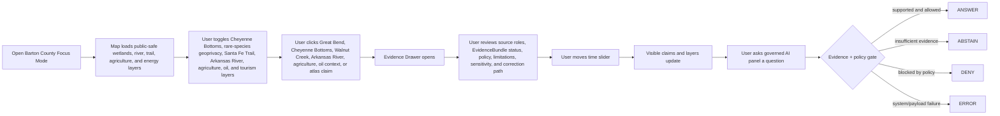
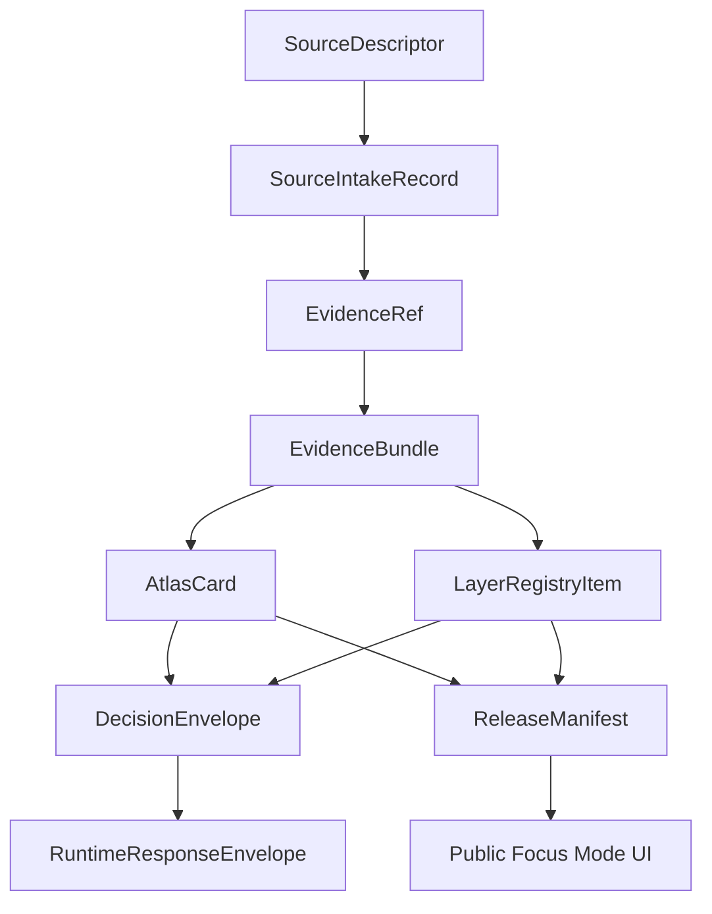

<!--
doc_id: NEEDS_VERIFICATION
title: Barton County Focus Mode Build Plan
type: standard
version: v1
status: draft
owners: [NEEDS_VERIFICATION]
created: 2026-05-21
updated: 2026-05-21
policy_label: public_draft
related:
  - docs/focus-modes/ellsworth-county/build-plan.md
  - docs/focus-modes/riley-county/build-plan.md
  - docs/focus-modes/shawnee-county/build-plan.md
  - docs/focus-modes/ford-county/build-plan.md
  - docs/focus-modes/wyandotte-county/build-plan.md
  - docs/focus-modes/sedgwick-county/build-plan.md
  - docs/focus-modes/douglas-county/build-plan.md
  - docs/focus-modes/leavenworth-county/build-plan.md
  - docs/focus-modes/reno-county/build-plan.md
  - docs/focus-modes/johnson-county/build-plan.md
  - docs/focus-modes/barton-county/README.md
  - docs/focus-modes/barton-county/layer-registry.md
  - docs/focus-modes/barton-county/acceptance-checklist.md
tags: [kfm, focus-mode, barton-county, great-bend, cheyenne-bottoms, arkansas-river, santa-fe-trail, wetlands, central-flyway]
notes:
  - Draft plan prepared without mounted repository inspection.
  - Paths, owners, doc IDs, schema homes, and validator names require repository verification before merge.
  - Wetlands, migratory birds, rare species, Santa Fe Trail, Arkansas River, oil/gas, agriculture, groundwater, tourism, and public-safety claims require source intake and evidence review before publication.
-->

<a id="top"></a>

# Barton County Focus Mode Build Plan

> **Purpose:** establish an eleventh Kansas Frontier Matrix county proof slice after Ellsworth, Riley, Shawnee, Ford, Wyandotte, Sedgwick, Douglas, Leavenworth, Reno, and Johnson counties, with a distinct central Kansas profile: **Great Bend, Cheyenne Bottoms, Central Flyway bird migration, Arkansas River bend geography, Santa Fe Trail crossings, Walnut Creek, oil and wheat production, groundwater/agriculture, wetland management, rare-species geoprivacy, and public-safe tourism interpretation.**


---

## Quick links

- [1. Why Barton County](#1-why-barton-county)
- [2. Product thesis](#2-product-thesis)
- [3. Scope boundary](#3-scope-boundary)
- [4. First demo layers](#4-first-demo-layers)
- [5. User journeys](#5-user-journeys)
- [6. UI surfaces](#6-ui-surfaces)
- [7. Governed object model](#7-governed-object-model)
- [8. Proposed repository shape](#8-proposed-repository-shape)
- [9. Build phases](#9-build-phases)
- [10. First PR sequence](#10-first-pr-sequence)
- [11. Acceptance checklist](#11-acceptance-checklist)
- [12. Risk register](#12-risk-register)
- [13. Source seed list](#13-source-seed-list)
- [14. Open verification questions](#14-open-verification-questions)
- [15. Recommended first milestone](#15-recommended-first-milestone)

---

## Operating posture

> [!IMPORTANT]
> Barton County Focus Mode is a **governed wetlands / river / trail / agriculture / oil proof slice**, not a birding map with historical trivia. It must preserve KFM’s core invariants:
>
> - EvidenceBundle outranks generated language.
> - Public clients use governed APIs, released artifacts, catalog records, tile services, and policy-safe runtime envelopes.
> - Public UI must not read directly from `RAW`, `WORK`, `QUARANTINE`, unpublished candidate data, canonical/internal stores, or direct model runtime outputs.
> - Publication is a governed state transition, not a file move.
> - AI outputs are downstream carriers, not sovereign truth.
> - Rare species, nesting sites, wetlands management, water infrastructure, wells, oil/gas infrastructure, private farms, cemetery/burial sites, and Santa Fe Trail interpretive claims must remain source-bound, generalized where needed, and correction-friendly.

---

# 1. Why Barton County

Barton County is the right eleventh Focus Mode because it gives KFM a **major wetlands, Central Flyway, Arkansas River, Santa Fe Trail, oil/wheat/agriculture, and geoprivacy proof slice**.

Ellsworth County tests frontier county history, Fort Harker / Kanopolis, settlement, and environmental baseline.

Riley County tests Flint Hills ecology, Fort Riley, Konza Prairie, research-site sensitivity, and river landscapes.

Shawnee County tests state government, civil-rights history, Topeka urban geography, public institutions, and archive-heavy civic memory.

Ford County tests Dodge City, Santa Fe Trail, Fort Dodge, cattle-town public history, Arkansas River water, and High Plains agriculture.

Wyandotte County tests dense urban governance, river confluence, tribal/burial sensitivity, environmental justice, rail/industry, and immigration/labor history.

Sedgwick County tests Wichita metro, aviation, Chisholm Trail, severe weather, public health, and infrastructure sensitivity.

Douglas County tests Free-State / Bleeding Kansas history, KU, Haskell, rivers, archives, and traumatic public memory.

Leavenworth County tests Fort Leavenworth, Missouri River, territorial politics, military education, corrections, and public-safety filtering.

Reno County tests salt mining, the Cosmosphere, wetlands, the Arkansas River, State Fair public-event governance, and subsurface hazard handling.

Johnson County tests suburban growth, streamway parks, Shawnee Mission, property/privacy governance, corporate corridors, and environmental remediation.

Barton County adds:

| KFM capability | Barton County proof value |
|---|---|
| Cheyenne Bottoms | major wetland system, Central Flyway, bird migration, water management, rare-species sensitivity |
| Geoprivacy for wildlife | public-safe wetland layers without exact nest/rare occurrence exposure |
| Arkansas River bend geography | Great Bend naming, river lowlands, trail route logic, hydrology/agriculture relationship |
| Santa Fe Trail crossings | Walnut Creek Crossing, Big Bend context, cemeteries/burials, camps, trail uncertainty |
| Wheat and oil history | agriculture/oil production source-role handling; surface/subsurface claims |
| Wetlands tourism | Kansas Wetlands Education Center, scenic byway, birding; public interpretation vs. evidence |
| Water and groundwater governance | irrigation, canals, wetlands water supply, flood/drought, source-role caution |
| Central Kansas county template | county seat, smaller communities, agriculture, river, wetlands, trail, energy economy |

> [!NOTE]
> Barton County is ideal for proving that KFM can show spectacular ecological value without exposing exact sensitive wildlife locations or confusing recreational birding content with evidence-grade ecology.

---

# 2. Product thesis

## User-facing thesis

> **Barton County Focus Mode lets a user explore how Great Bend, Cheyenne Bottoms, the Arkansas River, Walnut Creek, the Santa Fe Trail, wetlands, bird migration, wheat, oil, and agriculture shaped central Kansas — while keeping rare-species locations, wetland management details, private farms/wells, and trail/burial-site claims public-safe and evidence-backed.**

## Internal KFM thesis

Barton County should prove that Focus Mode can handle:

```text
wetlands + Central Flyway + rare-species geoprivacy + Arkansas River bend + Santa Fe Trail crossings + agriculture/oil + groundwater/wetland management
```

without leaking exact sensitive ecological locations or flattening uncertain trail history into false precision.

The system must preserve distinctions between:

- wetland boundary vs. habitat suitability vs. exact species observation
- public wildlife area vs. restricted pool/management detail
- birding/tourism narrative vs. formal ecological observation
- Arkansas River observation vs. regulatory/hydrologic interpretation
- Santa Fe Trail corridor vs. exact route claim vs. burial/cemetery sensitivity
- wheat/oil context vs. private farm or infrastructure detail
- official wildlife/water source vs. generated explanation
- source-backed claim vs. public-history interpretation

---

# 3. Scope boundary

## 3.1 Geography

Initial scope:

```text
Barton County, Kansas
```

Priority spatial anchors:

- Barton County boundary
- Great Bend
- Arkansas River corridor / “great bend” context
- Cheyenne Bottoms public-safe wetland context
- Kansas Wetlands Education Center context
- Walnut Creek Crossing / Santa Fe Trail public-history context
- Ellinwood / trail and river context
- Hoisington / Cheyenne Bottoms access and community context
- Claflin, Albert, Beaver, Galatia, Olmitz, Pawnee Rock, Susank, and other communities where source-supported
- agriculture / wheat / land-cover context
- oil/gas public economic context, generalized
- water and groundwater context, public-safe
- wetlands scenic byway / tourism context
- cemetery/burial/trail-death context, generalized and sensitivity-reviewed

## 3.2 Time range

Initial buckets:

| Bucket | Role in demo |
|---|---|
| Before 1800 | Indigenous, wetland, river, prairie, buffalo, and pre-territorial context; public-safe and culturally cautious |
| 1800–1821 | exploration, river geography, pre-Santa Fe Trail context |
| 1821–1854 | Santa Fe Trail traffic, Walnut Creek/Arkansas River crossings, trail camps, public-history context |
| 1854–1867 | territorial Kansas, pre-county organization, trail/water/military movement context |
| 1867–1872 | Barton County creation, Great Bend townsite, early settlement |
| 1873–1925 | wheat/oil/agriculture growth, wetland-drainage ideas, rail/town development |
| 1926–1957 | Cheyenne Bottoms management era, dikes/canals/habitat development, conservation context |
| 1958–present | modern wetlands management, bird migration, agriculture/oil, tourism, water governance |

> [!CAUTION]
> Time buckets are planning scaffolds. They are not publication claims until evidence-reviewed.

## 3.3 Not in MVP

Do **not** include in the first Barton County MVP:

- exact nesting, roosting, or rare-species occurrence locations
- restricted wildlife management operations
- private farm household-level data
- private well details where restricted or sensitive
- oil/gas infrastructure vulnerabilities
- exact sensitive cemetery, burial, sacred, or archaeological locations
- active emergency operations or live flood/fire/weather alerts
- water-rights legal conclusions from map layers
- parcel ownership treated as title truth
- public direct model endpoint

---

# 4. First demo layers

## 4.1 MVP layer registry

| Layer ID | Layer | Domain | Purpose | Initial posture |
|---|---|---:|---|---|
| `kfm.layer.barton.county_boundary.v1` | Barton County boundary | civic | establish spatial frame | public draft |
| `kfm.layer.barton.great_bend_context.v1` | Great Bend / Arkansas River bend context | civic/history/hydrology | county seat and river-name anchor | public draft, evidence-required |
| `kfm.layer.barton.cheyenne_bottoms_context.v1` | Cheyenne Bottoms wetland context | ecology/wetlands | Central Flyway and wetland anchor | public-safe generalized |
| `kfm.layer.barton.rare_species_geoprivacy.v1` | Rare species / geoprivacy policy context | ecology/policy | demonstrate exact-location suppression | restricted/public-safe derived |
| `kfm.layer.barton.santa_fe_trail_context.v1` | Santa Fe Trail / Walnut Creek context | history/transportation | trail crossings, camps, route uncertainty | public draft, evidence-required |
| `kfm.layer.barton.arkansas_river_corridor.v1` | Arkansas River corridor | hydrology/agriculture | river, floodplain, irrigation, trail logic | public draft |
| `kfm.layer.barton.agriculture_land_cover.v1` | Agriculture / wheat / land-cover baseline | agriculture/environment | crop, rangeland, irrigation, soil context | derived, public-safe |
| `kfm.layer.barton.oil_gas_context.v1` | Oil and gas public economic context | energy/history | oil production and county economy | public-safe generalized |
| `kfm.layer.barton.wetlands_tourism_education.v1` | Wetlands education / scenic byway context | public education/tourism | KWEC, birding, scenic byway interpretation | public draft |
| `kfm.layer.barton.timeline_events.v1` | Timeline events | cross-domain | temporal navigation | public draft |
| `kfm.layer.barton.atlas_claims.v1` | Atlas claim points / corridors | cross-domain | clickable evidence-backed claims | requires EvidenceRef |

## 4.2 Layer contract

Each layer must have:

```yaml
layer_id: kfm.layer.barton.<name>.v1
title: NEEDS_VERIFICATION
domain: NEEDS_VERIFICATION
layer_type: observed | derived | interpreted | modeled | administrative
geometry_type: point | line | polygon | raster | tile | mixed
source_refs: []
evidence_refs: []
policy_label: public_draft | restricted | internal | public
review_state: draft | review | published | deprecated
rights_status: unknown | public | open | controlled | restricted
sensitivity: public | generalized | restricted | review_required
temporal_scope:
  start: NEEDS_VERIFICATION
  end: NEEDS_VERIFICATION
limitations: []
correction_path: NEEDS_VERIFICATION
```

---

# 5. User journeys

## 5.1 Primary public journey



## 5.2 Example public questions

Supported after evidence review:

- “Why is Cheyenne Bottoms important to bird migration?”
- “How did the Arkansas River shape Great Bend?”
- “What evidence supports this Walnut Creek Crossing claim?”
- “Which bird or wetland layers are generalized and why?”
- “How did wheat and oil shape Barton County?”
- “Which layers are observations, models, derived indicators, or public-history interpretation?”
- “Why does KFM deny exact rare-species locations?”

Should abstain or deny unless governed release permits them:

- “Show exact whooping crane location.”
- “Show exact nesting or roosting areas.”
- “Show restricted wetland management operations.”
- “Show private well or farm household details.”
- “Show exact sensitive burial/cemetery trail locations.”
- “Treat birding tourism text as scientific proof.”
- “Treat generated text as evidence.”
- “Publish a claim with no EvidenceBundle.”

---

# 6. UI surfaces

## 6.1 Map canvas

Required:

- MapLibre GL JS map
- placeholder basemap
- Barton County boundary
- Great Bend / Cheyenne Bottoms / Arkansas River / Walnut Creek anchors
- clickable mock features
- selected feature highlight
- layer toggles
- scale bar
- attribution
- zoom controls
- compass / orientation affordance
- public-safe layer legend

## 6.2 Layer registry panel

Show for every layer:

| Field | Meaning |
|---|---|
| Layer name | human-readable layer title |
| Domain | wetlands, ecology, hydrology, trail history, agriculture, energy, tourism |
| Layer type | observed, derived, interpreted, modeled, administrative |
| Evidence state | resolved, unresolved, not required, pending |
| Policy label | public, public_draft, restricted, internal |
| Review state | draft, review, published, deprecated |
| Sensitivity | public, generalized, restricted, review_required |
| Time coverage | start/end or bucketed range |
| Limitations | short public-facing warning |
| Source-role warning | observation, model, regulatory, tourism context, public-history interpretation, derived indicator |

## 6.3 Timeline panel

Initial buckets:

```text
Before 1800
1800–1821
1821–1854
1854–1867
1867–1872
1873–1925
1926–1957
1958–present
```

Timeline should control:

- visible atlas claims
- Cheyenne Bottoms ecology/wetlands cards
- Santa Fe Trail / Walnut Creek cards
- Arkansas River and agriculture layers
- oil/gas economic context cards
- tourism/education cards
- feature styling by temporal relevance

## 6.4 Evidence Drawer

When a user clicks a layer feature or atlas claim, show:

```yaml
title: NEEDS_VERIFICATION
claim_text: NEEDS_VERIFICATION
object_type: AtlasCard | LayerFeature | TimelineEvent | EvidenceBundle
spatial_scope: NEEDS_VERIFICATION
temporal_scope: NEEDS_VERIFICATION
evidence_refs: []
evidence_bundle_status: unresolved | resolved | restricted | missing
source_roles: []
interpretation_status: fact_claim | interpretation | public_history | tourism_context | ecology_observation | geoprivacy_transform | derived_indicator | regulatory_context
policy_label: public_draft
rights_status: unknown
sensitivity: review_required
review_state: draft
limitations: []
correction_path: NEEDS_VERIFICATION
```

## 6.5 Atlas Card panel

Minimum atlas card types:

| Card type | Example |
|---|---|
| `wetlands_central_flyway_context` | Cheyenne Bottoms |
| `geoprivacy_policy_context` | rare species exact-location suppression |
| `river_bend_context` | Great Bend / Arkansas River |
| `trail_crossing_context` | Walnut Creek Crossing |
| `agriculture_land_cover_context` | wheat / crop / irrigation baseline |
| `energy_history_context` | oil and gas public economic context |
| `wetlands_education_tourism_context` | Kansas Wetlands Education Center / scenic byway |
| `community_context` | Great Bend, Hoisington, Ellinwood |
| `derived_layer_context` | wetland buffer, land cover, floodplain, or habitat-suitability baseline |

## 6.6 Governed AI panel

The AI panel must only emit finite runtime outcomes:

```text
ANSWER
ABSTAIN
DENY
ERROR
```

Example response envelope:

```json
{
  "object_type": "RuntimeResponseEnvelope",
  "schema_version": "v1",
  "question": "Why is Cheyenne Bottoms important to bird migration?",
  "outcome": "ABSTAIN",
  "answer": null,
  "reason": "Evidence bundle is not yet resolved for publication-grade response.",
  "evidence_refs": [
    "kfm://evidence-ref/barton/cheyenne-bottoms-context/v1"
  ],
  "policy_label": "public_draft",
  "limitations": [
    "This draft object requires source intake, rights review, and ecology/geoprivacy review before publication."
  ]
}
```

---

# 7. Governed object model

## 7.1 Object flow



## 7.2 SourceDescriptor draft

```yaml
id: kfm.source.barton.cheyenne_bottoms.placeholder
title: Cheyenne Bottoms wetland and Central Flyway source placeholder
domain: wetlands_ecology
source_type: official_wildlife_or_geoscience_reference
role: context_NEEDS_VERIFICATION
rights_status: unknown
spatial_coverage: Cheyenne Bottoms, Barton County, Kansas
temporal_coverage: NEEDS_VERIFICATION
status: proposed
limitations:
  - Requires source intake and review before claims are published.
  - Must separate public wetland context from exact sensitive species occurrences, management operations, and derived habitat interpretation.
```

## 7.3 EvidenceRef draft

```yaml
id: kfm.evidence_ref.barton.cheyenne_bottoms_context.v1
bundle_id: kfm.evidence_bundle.barton.cheyenne_bottoms_context.v1
claim_scope: Public-safe Cheyenne Bottoms wetland and Central Flyway context within Barton County Focus Mode
resolution_required: true
```

## 7.4 EvidenceBundle draft

```yaml
id: kfm.evidence_bundle.barton.cheyenne_bottoms_context.v1
resolved: false
source_refs:
  - kfm.source.barton.cheyenne_bottoms.placeholder
policy_label: public_draft
rights_status: unknown
sensitivity: review_required
review_state: draft
limitations:
  - Draft bundle. Do not publish final ecology/wetland claims until source-reviewed.
  - Do not include exact rare-species, nest, roost, or sensitive occurrence locations.
```

## 7.5 AtlasCard draft

```yaml
id: kfm.atlas_card.barton.cheyenne_bottoms.v1
title: Cheyenne Bottoms / Central Flyway Context
card_type: wetlands_central_flyway_context
spatial_scope: Barton County, Kansas NEEDS_VERIFICATION
temporal_scope: NEEDS_VERIFICATION
evidence_refs:
  - kfm.evidence_ref.barton.cheyenne_bottoms_context.v1
policy_label: public_draft
review_state: draft
limitations:
  - Draft card. Not a final ecological, regulatory, hunting, water-rights, or land-management authority statement.
```

## 7.6 DecisionEnvelope draft

```yaml
id: kfm.decision.barton.question.cheyenne_bottoms_context.v1
question: Why is Cheyenne Bottoms important to bird migration?
outcome: ABSTAIN
reason: Evidence bundle unresolved.
evidence_refs:
  - kfm.evidence_ref.barton.cheyenne_bottoms_context.v1
policy_label: public_draft
```

## 7.7 ReleaseManifest draft

```yaml
id: kfm.release.barton.focus_mode.v0_1
release_state: draft
included_layers:
  - kfm.layer.barton.county_boundary.v1
  - kfm.layer.barton.great_bend_context.v1
  - kfm.layer.barton.cheyenne_bottoms_context.v1
  - kfm.layer.barton.santa_fe_trail_context.v1
  - kfm.layer.barton.arkansas_river_corridor.v1
validation_state: pending
rollback_plan: required_before_publication
correction_path: required_before_publication
```

---

# 8. Proposed repository shape

> [!WARNING]
> Repository access is **not confirmed** in this planning session. Treat all paths as proposed until checked against the live branch and KFM Directory Rules.

```text
docs/
  focus-modes/
    barton-county/
      README.md
      build-plan.md
      layer-registry.md
      evidence-model.md
      acceptance-checklist.md
      source-seed-list.md
      public-safety-notes.md
      wetlands-and-geoprivacy-notes.md
      santa-fe-trail-and-burial-sensitivity-notes.md
      agriculture-water-and-groundwater-notes.md
      oil-gas-and-infrastructure-notes.md
      tourism-and-public-history-notes.md

data/
  catalog/
    sources/
      barton/
        source_descriptors.yaml
    stac/
      barton/
        README.md

contracts/
  focus_mode/
    focus_mode_payload.schema.json
  atlas/
    atlas_card.schema.json
  evidence/
    evidence_ref.schema.json
    evidence_bundle.schema.json
  release/
    release_manifest.schema.json

fixtures/
  focus_modes/
    barton/
      valid/
        focus_mode_payload.valid.json
        layer_registry.valid.json
        atlas_card.cheyenne_bottoms.valid.json
        atlas_card.great_bend.valid.json
        atlas_card.walnut_creek.valid.json
        evidence_bundle.cheyenne_bottoms.valid.json
        evidence_bundle.walnut_creek.valid.json
      invalid/
        unresolved_evidence_ref.invalid.json
        exact_sensitive_species_location.invalid.json
        nest_or_roost_location_public.invalid.json
        restricted_wetland_management_operation.invalid.json
        private_well_or_farm_household_detail.invalid.json
        oil_gas_infrastructure_vulnerability.invalid.json
        exact_sensitive_burial_site.invalid.json
        tourism_text_as_scientific_proof.invalid.json
        water_rights_legal_conclusion.invalid.json
        parcel_as_title_truth.invalid.json
        missing_policy_label.invalid.json
        model_output_as_evidence.invalid.json
        public_raw_access.invalid.json

apps/
  web/
    src/
      focus-modes/
        barton/
          index.js
          layers.js
          mock-api.js
          mock-data.js
          evidence-drawer.js
          timeline.js
          ai-panel.js
          styles.css

tools/
  validators/
    validate_focus_mode_payload.py
    validate_atlas_card.py
    validate_evidence_bundle.py
    validate_layer_registry.py
```

---

# 9. Build phases

## Phase 1 — Control plane

Goal: establish Barton County Focus Mode as a governed wetlands/geoprivacy/trail/river/agriculture/energy template.

Deliverables:

- `docs/focus-modes/barton-county/README.md`
- `build-plan.md`
- `layer-registry.md`
- `source-seed-list.md`
- `public-safety-notes.md`
- `wetlands-and-geoprivacy-notes.md`
- `santa-fe-trail-and-burial-sensitivity-notes.md`
- `agriculture-water-and-groundwater-notes.md`
- `oil-gas-and-infrastructure-notes.md`
- `tourism-and-public-history-notes.md`
- first schema references
- valid and invalid fixture plan

Definition of done:

```text
[ ] scope is explicit
[ ] wetland/ecology layers generalize exact sensitive wildlife locations
[ ] rare species geoprivacy rules are explicit
[ ] trail/burial/cemetery layers use public-safe generalized handling
[ ] agriculture/water/groundwater layers distinguish observed/model/regulatory/derived roles
[ ] oil/gas layers exclude infrastructure vulnerabilities
[ ] tourism/public-history text cannot become scientific or historical proof
[ ] all layers have policy labels
[ ] all claim-bearing objects require EvidenceRef
[ ] placeholders are clearly marked
```

## Phase 2 — Mock governed API

Goal: make Barton Focus Mode run without live pipelines.

Mock endpoints:

```text
GET /api/focus-modes/barton
GET /api/layers/barton
GET /api/evidence/{bundle_id}
GET /api/atlas-cards/{card_id}
POST /api/ai/answer
GET /api/releases/barton-focus-mode
```

Definition of done:

```text
[ ] mock payloads validate
[ ] unresolved evidence produces ABSTAIN
[ ] exact sensitive species requests produce DENY
[ ] wetland management operation requests produce DENY
[ ] private well/farm household requests produce DENY
[ ] tourism-text-as-proof payloads fail validation
[ ] invalid payloads fail closed
[ ] public layer payloads do not reference RAW / WORK / QUARANTINE
```

## Phase 3 — UI prototype

Goal: show the full Barton Focus Mode surface in a browser.

Deliverables:

- MapLibre map
- layer registry
- clickable mock Great Bend, Cheyenne Bottoms, Arkansas River, Walnut Creek, agriculture, oil/gas, and wetlands education features
- evidence drawer
- timeline
- atlas card panel
- governed AI answer panel

Definition of done:

```text
[ ] user can click Cheyenne Bottoms context and see geoprivacy limitations
[ ] user can click Great Bend context and see Arkansas River/evidence status
[ ] user can click Walnut Creek/Santa Fe Trail context and see route/burial sensitivity limits
[ ] user can click agriculture/water context and see source-role warnings
[ ] user can click oil/gas context and see infrastructure limitations
[ ] user can toggle wetland / rare-species / river / trail / agriculture / oil / tourism layers
[ ] timeline changes visible claim set
[ ] AI panel returns all four finite outcomes through examples
```

## Phase 4 — Validators and negative fixtures

Goal: prove failure modes before publication.

Required invalid fixtures:

| Fixture | Expected failure |
|---|---|
| `unresolved_evidence_ref.invalid.json` | publication attempted with unresolved evidence |
| `exact_sensitive_species_location.invalid.json` | exact rare/sensitive wildlife occurrence exposed |
| `nest_or_roost_location_public.invalid.json` | exact nesting/roosting location exposed |
| `restricted_wetland_management_operation.invalid.json` | restricted management/operations exposed |
| `private_well_or_farm_household_detail.invalid.json` | private well/farm/household detail exposed |
| `oil_gas_infrastructure_vulnerability.invalid.json` | energy/infrastructure vulnerability exposed |
| `exact_sensitive_burial_site.invalid.json` | exact sensitive trail burial/cemetery location exposed |
| `tourism_text_as_scientific_proof.invalid.json` | tourism/birding text treated as scientific proof |
| `water_rights_legal_conclusion.invalid.json` | map layer treated as water-rights legal conclusion |
| `parcel_as_title_truth.invalid.json` | property/assessor record treated as title truth |
| `missing_policy_label.invalid.json` | public object lacks policy posture |
| `model_output_as_evidence.invalid.json` | AI output treated as proof |
| `public_raw_access.invalid.json` | public client references RAW/WORK/QUARANTINE |

## Phase 5 — Source intake upgrade

Goal: replace placeholders with inspected sources.

Deliverables:

- source descriptors
- intake records
- rights review notes
- sensitivity review notes
- evidence bundle drafts
- reviewed atlas cards
- limitations notes

Minimum real-evidence targets:

```text
[ ] one Barton County creation/name/official-history claim
[ ] one Great Bend / Arkansas River bend claim
[ ] one Cheyenne Bottoms wetland / Central Flyway claim
[ ] one rare-species geoprivacy / public-safe ecology claim
[ ] one Walnut Creek Crossing / Santa Fe Trail claim
[ ] one agriculture / wheat / land-cover claim
[ ] one oil/gas public economic context claim
[ ] one wetlands education / tourism/public-history claim
```

## Phase 6 — Release candidate

Goal: prepare `v0.1` public-safe release.

Deliverables:

- `ReleaseManifest`
- validation report
- correction path
- rollback plan
- public-safe layer manifest
- known limitations
- release notes

Definition of done:

```text
[ ] public layers have policy labels and review states
[ ] rights status is resolved or blocked
[ ] exact sensitive species/nesting/roosting locations are excluded or generalized
[ ] restricted wetland management details are excluded
[ ] exact sensitive burial/cemetery/trail-death details are excluded or generalized
[ ] private farm/well details are excluded
[ ] oil/gas infrastructure vulnerabilities are excluded
[ ] river/water/agriculture claims preserve source role and uncertainty
[ ] release can be rolled back
[ ] public UI only consumes governed surfaces
```

---

# 10. First PR sequence

## PR-0001 — Barton County Focus Mode Control Plane

Files:

```text
docs/focus-modes/barton-county/README.md
docs/focus-modes/barton-county/build-plan.md
docs/focus-modes/barton-county/layer-registry.md
docs/focus-modes/barton-county/source-seed-list.md
docs/focus-modes/barton-county/public-safety-notes.md
docs/focus-modes/barton-county/wetlands-and-geoprivacy-notes.md
docs/focus-modes/barton-county/santa-fe-trail-and-burial-sensitivity-notes.md
docs/focus-modes/barton-county/agriculture-water-and-groundwater-notes.md
docs/focus-modes/barton-county/oil-gas-and-infrastructure-notes.md
docs/focus-modes/barton-county/tourism-and-public-history-notes.md
docs/focus-modes/barton-county/acceptance-checklist.md
```

Acceptance:

```text
[ ] Focus Mode scope is clear.
[ ] Barton County is justified as a complementary proof slice.
[ ] Every planned layer has a policy posture.
[ ] Wetlands/geoprivacy rules are explicit.
[ ] Trail/burial sensitivity boundaries are explicit.
[ ] Agriculture/water/groundwater source-role boundaries are explicit.
[ ] Oil/gas infrastructure boundaries are explicit.
[ ] Tourism/public-history source-role boundaries are explicit.
[ ] No publication claims are made from placeholders.
```

## PR-0002 — Barton Contracts and Fixtures

Files:

```text
fixtures/focus_modes/barton/valid/focus_mode_payload.valid.json
fixtures/focus_modes/barton/valid/layer_registry.valid.json
fixtures/focus_modes/barton/valid/atlas_card.cheyenne_bottoms.valid.json
fixtures/focus_modes/barton/valid/atlas_card.walnut_creek.valid.json
fixtures/focus_modes/barton/invalid/exact_sensitive_species_location.invalid.json
fixtures/focus_modes/barton/invalid/tourism_text_as_scientific_proof.invalid.json
fixtures/focus_modes/barton/invalid/private_well_or_farm_household_detail.invalid.json
fixtures/focus_modes/barton/invalid/missing_policy_label.invalid.json
```

Acceptance:

```text
[ ] Valid fixtures include required governed fields.
[ ] Invalid fixtures represent real failure modes.
[ ] EvidenceRef / EvidenceBundle relationship is explicit.
[ ] Mock cards remain draft until evidence intake.
```

## PR-0003 — Barton Mock API

Files:

```text
apps/web/src/focus-modes/barton/mock-api.js
apps/web/src/focus-modes/barton/layers.js
apps/web/src/focus-modes/barton/mock-data.js
```

Acceptance:

```text
[ ] Mock API returns finite runtime outcomes.
[ ] Layer registry is API-shaped, not UI-only.
[ ] Public-safe data is separated from restricted mock examples.
[ ] Sensitivity/source-role status is included for wetlands, geoprivacy, trail, water, agriculture, and oil/gas objects.
```

## PR-0004 — Barton UI Shell

Files:

```text
apps/web/src/focus-modes/barton/index.js
apps/web/src/focus-modes/barton/evidence-drawer.js
apps/web/src/focus-modes/barton/timeline.js
apps/web/src/focus-modes/barton/ai-panel.js
apps/web/src/focus-modes/barton/styles.css
```

Acceptance:

```text
[ ] Map renders.
[ ] Layer panel renders.
[ ] Evidence Drawer renders.
[ ] Atlas Card panel renders.
[ ] Timeline filters mock claims.
[ ] AI panel demonstrates ANSWER / ABSTAIN / DENY / ERROR.
```

## PR-0005 — Validator Hardening

Files:

```text
tools/validators/validate_focus_mode_payload.py
tools/validators/validate_atlas_card.py
tools/validators/validate_evidence_bundle.py
tools/validators/validate_layer_registry.py
```

Acceptance:

```text
[ ] Public RAW / WORK / QUARANTINE references fail.
[ ] Missing EvidenceRef fails for claim-bearing objects.
[ ] Missing policy label fails.
[ ] Exact sensitive species/nest/roost locations fail public release.
[ ] Restricted wetland management details fail public release.
[ ] Tourism text as scientific proof fails.
[ ] Oil/gas infrastructure vulnerability exposure fails.
[ ] Model output as proof fails.
```

---

# 11. Acceptance checklist

```text
[ ] Barton County map loads.
[ ] User can toggle at least 5 public-safe layers.
[ ] User can click Great Bend context and open Evidence Drawer.
[ ] User can click Cheyenne Bottoms context and open Evidence Drawer.
[ ] User can click Walnut Creek / Santa Fe Trail context and open Evidence Drawer.
[ ] User can click Arkansas River context and open Evidence Drawer.
[ ] User can click rare-species geoprivacy layer and see DENY/generalization behavior.
[ ] User can inspect at least 3 Atlas Cards.
[ ] Timeline control changes visible claims/layers.
[ ] Governed AI panel returns ANSWER for supported claims.
[ ] Governed AI panel returns ABSTAIN for unresolved evidence.
[ ] Governed AI panel returns DENY for restricted/sensitive requests.
[ ] Governed AI panel returns ERROR for invalid payload/system failure.
[ ] Every visible claim has EvidenceRef.
[ ] Every EvidenceRef points to an EvidenceBundle.
[ ] Every layer has policy_label.
[ ] Every layer has review_state.
[ ] Every public object has correction path.
[ ] No public UI path reads RAW, WORK, or QUARANTINE.
[ ] Exact sensitive species/nest/roost locations are excluded or generalized.
[ ] Restricted wetland management details are excluded.
[ ] Private well/farm household details are excluded.
[ ] Tourism/birding narrative is not treated as scientific proof.
[ ] ReleaseManifest exists before anything is called published.
```

---

# 12. Risk register

| Risk | Why it matters | Control |
|---|---|---|
| Exact rare species or nesting locations leak | ecology and species-protection risk | deny/generalize by default |
| Birding/tourism content treated as ecological proof | evidence failure | source-role labels and EvidenceBundle required |
| Wetland management detail exposes operations | public-safety and resource-management risk | public context only; deny restricted operations |
| Trail/burial claims expose sensitive locations | cultural and historical sensitivity risk | generalized location; review required |
| Water/groundwater layer treated as legal water-rights advice | legal/regulatory misuse risk | source-role labels and limitations |
| Oil/gas layer exposes infrastructure vulnerabilities | security risk | generalized public economic context only |
| Agriculture layer exposes private farm/household details | privacy risk | aggregate/generalize; deny private detail |
| Generated narrative treated as source | evidence failure | model output cannot be proof |
| Mock placeholders become doctrine | demo pollution | all placeholders marked draft/unresolved |
| Cheyenne Bottoms dominates county view | county-scale imbalance | include Great Bend, Arkansas River, trail, agriculture, oil, smaller communities where evidence-supported |

---

# 13. Source seed list

> [!NOTE]
> These are **candidate source seeds**, not yet KFM-ingested sources. Each requires `SourceDescriptor`, rights review, sensitivity review, checksum/citation handling, and EvidenceBundle resolution before publication-grade use.

| Seed | Use | Starting URL |
|---|---|---|
| Barton County official tourism page | current county tourism/source routing, Cheyenne Bottoms links | https://www.bartoncounty.org/vnews/display.v/SEC/Living%20In%20Barton%20County%7CTourism |
| Barton County official site | current county civic source routing | https://www.bartoncounty.org/ |
| GeoKansas — Cheyenne Bottoms | wetland / Central Flyway / geoscience public context | https://geokansas.ku.edu/cheyenne-bottoms |
| Kansas Wetlands Education Center | Cheyenne Bottoms education / public interpretation / birding context | https://wetlandscenter.fhsu.edu/ |
| Kansas Wetlands & Wildlife National Scenic Byway | wetland tourism and regional ecology context | https://nsbfoundation.com/nb/wetlands-wildlife-national-scenic-byway/ |
| Kansas Department of Wildlife and Parks — Cheyenne Bottoms | official wildlife area source routing | https://ksoutdoors.com/KDWP-Info/Locations/Wildlife-Areas/Southwest/Cheyenne-Bottoms |
| The Nature Conservancy — Cheyenne Bottoms Preserve | conservation ownership / management context | https://www.nature.org/en-us/get-involved/how-to-help/places-we-protect/cheyenne-bottoms-preserve/ |
| NPS — Walnut Creek Crossing | Santa Fe Trail crossing source routing | https://www.nps.gov/places/walnut-creek-crossing.htm |
| National Park Service — Santa Fe National Historic Trail | trail source routing | https://www.nps.gov/safe/index.htm |
| Fort Hays State University Kansas Heritage — Barton County | local history source routing | https://fhsuguides.fhsu.edu/kansasheritage/bartoncounty |
| Kansas Historical Society markers | public marker source routing | https://www.kansashistory.gov/p/kansas-historical-markers/14999 |
| Kansas Geological Survey county geology index | geology/hydrology source routing | https://www.kgs.ku.edu/General/Geology/County/ |
| USGS National Hydrography | river and stream source routing | https://www.usgs.gov/national-hydrography |
| FEMA Flood Map Service Center | regulatory floodplain source routing | https://msc.fema.gov/portal/home |
| USDA Cropland Data Layer | agriculture / crop / land-cover source routing | https://www.nass.usda.gov/Research_and_Science/Cropland/SARS1a.php |

---

# 14. Open verification questions

```text
[ ] What is the canonical repo path for Focus Mode documents?
[ ] Does KFM already have a focus_mode_payload schema?
[ ] Does KFM already define AtlasCard fields differently?
[ ] Does KFM already define ecology geoprivacy fields?
[ ] Does KFM already define rare-species/nesting/roosting sensitivity fields?
[ ] Does KFM already define trail/burial sensitivity fields?
[ ] Does KFM already define water-rights/legal-conclusion guards?
[ ] Does KFM already define oil/gas infrastructure sensitivity fields?
[ ] Which validators already exist?
[ ] Should Barton County share contracts with other Focus Modes or define county-specific extensions?
[ ] What public-safe geometry source should be used for county boundary?
[ ] What source authority should define Great Bend / Arkansas River bend claims?
[ ] What source authority should define Cheyenne Bottoms claims?
[ ] What source authority should define Walnut Creek Crossing / Santa Fe Trail claims?
[ ] What source authority should define agriculture/wheat/oil claims?
[ ] What exact policy rule controls exact rare-species and nest/roost locations?
[ ] What exact policy rule controls wetland management operations?
[ ] What exact policy rule controls exact burial/cemetery trail locations?
[ ] What release manifest naming convention should be used?
[ ] What rollback/correction path should a county Focus Mode use?
```

---

# 15. Recommended first milestone

## Milestone 1: Barton County Focus Mode Control Plane

Build the documentation, layer registry, source seed list, public-safety notes, wetlands/geoprivacy notes, Santa Fe Trail/burial-sensitivity notes, agriculture/water/groundwater notes, oil/gas/infrastructure notes, tourism/public-history notes, and fixtures before the UI.

This keeps the Barton proof slice from becoming a birding and trail map that accidentally exposes rare-species locations, wetland operations, private farms/wells, or sensitive trail/burial details.

The first concrete deliverable should be:

```text
docs/focus-modes/barton-county/build-plan.md
```

Once this is stable, use it to generate the mock API and single-file UI prototype.

---

[Back to top](#top)
