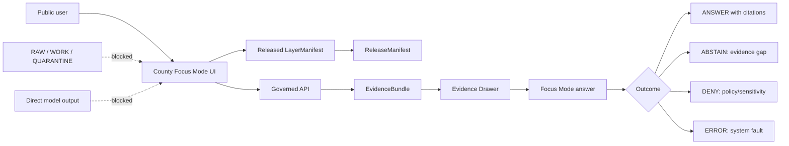
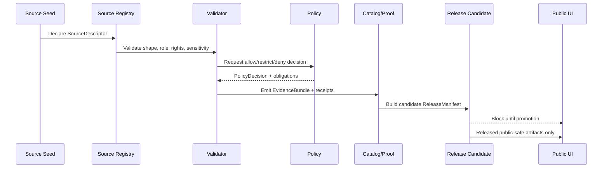

<!--
doc_id: NEEDS_VERIFICATION
title: Bourbon County Focus Mode Build Plan
type: standard
version: v1
status: draft
owners:
  - NEEDS_VERIFICATION
created: 2026-05-21
updated: 2026-05-21
policy_label: public
related:
  - docs/doctrine/directory-rules.md # NEEDS_VERIFICATION
  - docs/doctrine/truth-posture.md # NEEDS_VERIFICATION
  - docs/doctrine/trust-membrane.md # NEEDS_VERIFICATION
  - docs/doctrine/lifecycle-law.md # NEEDS_VERIFICATION
  - docs/focus-modes/counties/README.md # PROPOSED / NEEDS_VERIFICATION
  - docs/focus-modes/counties/bourbon/README.md # PROPOSED / NEEDS_VERIFICATION
tags:
  - kfm
  - focus-mode
  - kansas
  - bourbon-county
  - fort-scott
  - marmaton-river
  - floodplain
  - agriculture
  - coal
  - geology
  - transportation
  - cultural-heritage
notes:
  - "Repo paths in this document are PROPOSED until verified against a mounted Kansas Frontier Matrix repository."
  - "County facts and source seeds require source-rights, freshness, and authority verification before publication."
  - "Public surfaces must use governed APIs, released artifacts, catalog/triplet/graph records, tile services, EvidenceBundle resolution, and policy-safe runtime envelopes."
  - "Sensitive cultural, cemetery, living-person, private property, infrastructure, exact vulnerability, and restricted operational details fail closed or are generalized."
-->

<a id="top"></a>

# Bourbon County Focus Mode Build Plan

> **Status:** PROPOSED county proof-slice plan  
> **County:** Bourbon County, Kansas  
> **Focus Mode theme:** Fort Scott · Marmaton River · U.S. 69 corridor · agriculture · coal/geology · public-safe frontier history  
> **Truth posture:** cite-or-abstain · fail-closed · evidence-first · map-first · time-aware · auditable · reversible  
> **Repository posture:** NO_LOCAL_REPO_EVIDENCE for this generated plan. All paths are PROPOSED and NEEDS_VERIFICATION before landing.

<p align="center">
  
  
  
  
  
</p>

<p align="center">
  <a href="#operating-posture">Operating posture</a> ·
  <a href="#why-this-county">Why this county</a> ·
  <a href="#first-demo-layers">Demo layers</a> ·
  <a href="#governed-object-model">Object model</a> ·
  <a href="#proposed-repository-shape">Repo shape</a> ·
  <a href="#source-seed-list">Sources</a> ·
  <a href="#recommended-first-milestone">Milestone</a>
</p>

---

## Executive determination

**Bourbon County is a strong next KFM county Focus Mode proof slice** because it joins several KFM governance challenges in one compact southeast Kansas county: official county GIS, public parcel and KSCAMA access boundaries, Marmaton River flood context, U.S. 69 / U.S. 54 transportation relevance, 2022 agriculture statistics, Fort Scott National Historic Site, Pennsylvanian geology, historic coal production, mined-land interpretation, and sensitive frontier / Indigenous / military / cemetery context.

This plan is **not** a publication approval and does not assert that any repo file, schema, endpoint, route, validator, CI workflow, release manifest, or runtime behavior currently exists. It is a fixture-first implementation plan for a future governed slice.

> [!IMPORTANT]
> Bourbon County Focus Mode must not expose RAW, WORK, QUARANTINE, unpublished candidates, direct canonical/internal stores, exact sensitive cultural-resource locations, cemetery/burial detail beyond public-safe context, living-person details, parcel-owner claims as title truth, utility/security vulnerability detail, bridge/road work-zone operational vulnerabilities, or direct model output as public truth.

---

<a id="operating-posture"></a>

## Operating posture

| Rule | Bourbon County application |
|---|---|
| EvidenceBundle outranks generated language | Every public claim about floodplain, agriculture, geology, road corridors, Fort Scott history, or coal/mined-land context resolves to an EvidenceBundle or the UI abstains. |
| Public clients use governed interfaces | The public viewer reads governed API payloads, released PMTiles / GeoParquet / COG artifacts, catalog records, graph/triplet summaries, and policy-safe RuntimeResponseEnvelopes only. |
| RAW / WORK / QUARANTINE are not public | County GIS extracts, KSCAMA-derived joins, floodplain snapshots, KGS geologic transforms, CDL histograms, and Fort Scott story drafts remain hidden until validation, review, policy, and release gates complete. |
| Publication is a governed transition | A layer moving from candidate to public requires PromotionDecision, ReleaseManifest, receipts, rollback target, and correction path. |
| AI is interpretive only | Focus Mode can explain cited layers and EvidenceBundles; it cannot invent county facts, decide release, or turn uncited text into truth. |
| Sensitive detail fails closed | Cultural sites, burials, living people, private parcels, registered-user data, infrastructure, and exact vulnerability surfaces are denied, redacted, or generalized. |
| Map is not the sovereign record | Tiles, popups, screenshots, Story Nodes, and AI summaries are downstream carriers. Catalog/proof/evidence/policy/release records carry authority. |

**Default runtime outcomes:** `ANSWER`, `ABSTAIN`, `DENY`, `ERROR`.

---

<a id="why-this-county"></a>

## Why this county

Bourbon County is a high-value KFM county slice because it sits at the intersection of **frontier history, river/flood context, southeast Kansas coal geology, modern transportation corridors, and county GIS source governance**. It is rich enough to exercise multiple KFM domains but small enough to keep the first Focus Mode milestone concrete.

### County-specific proof pressure

| Pressure | Why it matters for KFM | Public-safe posture |
|---|---|---|
| Official county GIS and ORKA map seed | Bourbon County publishes an official GIS page and links to an online county map. That creates a strong source seed but also raises source-role and rights questions. | Treat as a SourceDescriptor and source index first. Do not scrape, republish, or merge attributes until rights and sensitivity are reviewed. |
| Parcel / KSCAMA boundary | Bourbon County exposes public and registered KSCAMA search surfaces. This creates a living-person and property-claim boundary. | Parcel context can be indexed as public record context, but property ownership is not title truth and registered-only surfaces are not public-source inputs. |
| Marmaton River flood context | Fort Scott and Bourbon County flood stories require hydrology, floodplain, and gauge context. | Show regulatory/historical context only. Do not become an emergency alert system or provide property-specific safety claims. |
| U.S. 69 / U.S. 54 corridor | Southeast Kansas connectivity and KDOT project information make transportation context meaningful. | Use generalized corridors and official source links; no work-zone operations, vulnerability details, or routing advice. |
| Agriculture | USDA 2022 agriculture data supports an aggregate county farm economy panel. | Use aggregate statistics and CDL-derived histograms; no farm-specific inference in the first release. |
| Pennsylvanian geology + coal | KGS revised map materials emphasize limestone, coal resources, coal-mined areas, and strip mining history. | Show public geologic context; use generalized mined-land interpretation unless exact mine/feature exposure is reviewed. |
| Fort Scott National Historic Site | NPS provides a federally authoritative historic anchor for the county Focus Mode. | Use NPS as a cited public context source; do not collapse public interpretation into archaeology/site-location authority. |
| Sensitive frontier, Indigenous, cemetery, and conflict history | The county’s public history intersects U.S. expansion, military activity, race, settlement, and cultural memory. | Story Nodes must be evidence-bound, carefully worded, and culturally reviewed where needed; exact sensitive locations fail closed. |

---

<a id="product-thesis"></a>

## Product thesis

**Bourbon County Focus Mode** should help a public user ask:

> “How do Fort Scott, the Marmaton River, agriculture, U.S. 69, Pennsylvanian geology, coal history, and public records fit together in Bourbon County — and what evidence supports each map claim?”

The first version should feel like a county evidence cockpit, not a chatbot. It should show what KFM knows, what it can cite, what it refuses to expose, what is stale, and what requires review.

### What this Focus Mode is

- A **public-safe Bourbon County context lens**.
- A **source-ledger-backed demo slice** for county Focus Mode patterns.
- A **MapLibre-facing UI plan** using released artifacts and governed API payloads.
- A **governance stress test** for GIS, KSCAMA, floodplain, transportation, geology/coal, public heritage, and sensitive-location boundaries.
- A **fixture-first implementation plan** before live ingestion or publication.

### What this Focus Mode is not

- Not an emergency flood warning system.
- Not a property title, appraisal, survey, or legal boundary authority.
- Not a live construction routing product.
- Not a cultural-site locator.
- Not a cemetery/burial disclosure tool.
- Not an infrastructure vulnerability map.
- Not a direct AI chat over raw county or source records.

---

<a id="scope-boundary"></a>

## Scope boundary

### Included in the first governed slice

| Area | Included public-safe output |
|---|---|
| County orientation | Boundary, county seat context, incorporated-place labels, and public-source orientation. |
| Official GIS context | Source descriptor and source index for Bourbon County GIS / ORKA map link. |
| Parcel context | Public explanation of property-data limits; no title claims; no registered-only data. |
| Floodplain context | Kansas Current Effective Floodplain Viewer / FEMA context and Marmaton River gauge source links. |
| Hydrology | Marmaton River and generalized named-water context; no real-time emergency decisions. |
| Agriculture | USDA 2022 county profile facts and aggregate land-use panel. |
| CDL / land cover | County-level Cropland Data Layer histogram plan and material-change watcher fixture. |
| Geology | KGS geologic map and coal/mined-land context as source-backed public geology. |
| Transportation | U.S. 69 / U.S. 54 / KDOT project source index and generalized corridor context. |
| Heritage | Fort Scott National Historic Site Story Node using NPS as the primary source seed. |
| Evidence UI | Evidence Drawer, source confidence, source role, last checked, policy label, release state, and limitations. |

### Excluded from public release by default

| Exclusion | Reason |
|---|---|
| RAW county GIS exports | Unreviewed source terms, freshness, and sensitivity. |
| Registered-user KSCAMA data | Access-level and privacy boundary. |
| Parcel-owner claims as title truth | Appraisal/cadastral data is not title proof. |
| Exact cemetery/burial/cultural-resource coordinates | Cultural sensitivity, family privacy, and site-protection posture. |
| Exact mine hazard or infrastructure vulnerability | Public-safety and operational exposure risk. |
| Emergency flood advice | KFM is not an alerting authority. Link to official sources instead. |
| Direct AI-generated county facts | AI can summarize resolved EvidenceBundles only. |

---

<a id="first-demo-layers"></a>

## First demo layers

> [!NOTE]
> Layer names below are PROPOSED. They are not claims that PMTiles, schemas, or manifests exist.

| Layer ID | Display name | Source seed | Public-safe transform | Evidence requirement | Initial policy |
|---|---|---|---|---|---|
| `ks_bbn_county_boundary_v1` | Bourbon County boundary | TIGER/Line or Kansas GIS boundary source | County polygon only | SourceDescriptor + boundary EvidenceBundle | `public` |
| `ks_bbn_fort_scott_context_v1` | Fort Scott civic context | Census / local / state GIS | Generalized municipal context | EvidenceBundle with geography vintage | `public` |
| `ks_bbn_official_gis_index_v1` | Official GIS source index | Bourbon County GIS page / ORKA link | Link/index only; no bulk attribute publication | SourceDescriptor + rights review | `public_context` |
| `ks_bbn_parcel_limits_note_v1` | Parcel and property-data limits | County parcel/KSCAMA page | Trust note / source boundary, not a parcel layer | EvidenceBundle + policy note | `public_context` |
| `ks_bbn_marmaton_hydro_v1` | Marmaton River context | NOAA/NWPS, NHD, FEMA/KDA | River corridor + gauge link; no emergency guidance | Hydrology EvidenceBundle | `public_context` |
| `ks_bbn_floodplain_context_v1` | Effective floodplain context | Kansas Floodplain Viewer + FEMA MSC | Released flood zones only; no property-specific advice | FIS/FEMA/KDA EvidenceBundle | `public_context` |
| `ks_bbn_ag_2022_summary_v1` | Agriculture 2022 summary | USDA NASS county profile / KDA | Aggregate county statistics | USDA/KDA EvidenceBundle | `public` |
| `ks_bbn_cdl_histogram_v1` | Crop/land-cover histogram | USDA CDL | County aggregate histogram; no farm inference | CDL SourceDescriptor + run receipt | `public_context` |
| `ks_bbn_geology_coal_context_v1` | Geology and coal context | KGS geologic map | Generalized geology/coal context | KGS EvidenceBundle | `public_context` |
| `ks_bbn_transport_corridors_v1` | U.S. 69 / U.S. 54 corridors | KDOT / KanPlan | Generalized transportation corridors | KDOT EvidenceBundle | `public_context` |
| `ks_bbn_fort_scott_story_v1` | Fort Scott Story Node | NPS Fort Scott National Historic Site | Cited interpretive Story Node | NPS EvidenceBundle + rights review | `public_context` |
| `ks_bbn_sensitive_suppression_mask_v1` | Sensitive-location suppression mask | Policy-derived, not source-public | Internal only; never rendered as public layer | PolicyDecision + RedactionReceipt | `restricted_internal` |

---

<a id="user-journeys"></a>

## User journeys

### 1. Public explorer: “What shaped Bourbon County?”

1. User opens Bourbon County Focus Mode.
2. Map centers on Bourbon County and Fort Scott.
3. User toggles “River + floodplain context.”
4. UI shows Marmaton River corridor and public floodplain context.
5. Evidence Drawer lists KDA/FEMA/NOAA/NHD source roles and limitations.
6. Focus Mode answers only from resolved EvidenceBundles.
7. If asked for emergency advice or property-level danger, Focus Mode returns `DENY` or `ABSTAIN` with official-source links.

### 2. Land and agriculture viewer: “What does the county agriculture profile show?”

1. User toggles “Agriculture 2022 summary.”
2. UI displays county-level farms, land-in-farms, market-value, cropland, pastureland, woodland, and sales split.
3. User opens Evidence Drawer and sees USDA NASS county profile as source seed.
4. User asks “Which farms are cattle farms?”
5. System denies farm-specific inference unless a public, cited, policy-approved data source supports it.

### 3. Geology and coal learner: “Where does coal history fit?”

1. User toggles “Geology and coal context.”
2. UI displays generalized geology/coal narrative and optional low-detail contextual overlay.
3. Evidence Drawer links to KGS geologic map source.
4. Exact mine hazard/vulnerability requests are generalized or denied until policy review.

### 4. Heritage explorer: “What is the Fort Scott story?”

1. User clicks the Fort Scott Story Node.
2. Drawer shows NPS source, history scope, and limitations.
3. Focus Mode answers public historical questions using NPS evidence.
4. Requests for uncited cultural-site locations, burials, or private-property access are denied.

### 5. Steward reviewer: “Is this layer promotable?”

1. Reviewer opens county release candidate.
2. UI shows layer manifest, source descriptors, policy decisions, receipts, proof pack, and rollback target.
3. Reviewer validates EvidenceRef closure and sensitivity flags.
4. Candidate either promotes to released public artifact or returns to WORK/QUARANTINE.

---

<a id="ui-surfaces"></a>

## UI surfaces

| Surface | Purpose | Bourbon County behavior |
|---|---|---|
| County Focus Header | County identity and status | Shows Bourbon County, draft status, last source check, and runtime outcome legend. |
| Layer Stack | Public-safe toggles | River/floodplain, agriculture, geology/coal, transport, Fort Scott story, source index. |
| Evidence Drawer | Trust membrane | Shows EvidenceBundle, SourceDescriptor, source role, rights, sensitivity, lineage, limitations, and review state. |
| Policy Banner | Fail-closed clarity | Warns when exact locations, parcel-specific claims, emergency advice, or infrastructure details are denied. |
| Time Control | Temporal discipline | Shows geography vintage, source publication date, release date, and effective/observed time. |
| Story Node Panel | Human-readable narrative | Fort Scott and county context, with citations and abstention when evidence is missing. |
| Reviewer Mode | Steward workflow | Shows candidate status, validators, receipts, and promotion blockers. |
| Correction Drawer | Reversibility | Allows issue filing against claim/layer/source/version; links rollback target. |



---

<a id="governed-object-model"></a>

## Governed object model

| Object family | Role in Bourbon slice | Minimum fields / notes |
|---|---|---|
| `SourceDescriptor` | Declares source identity, role, rights, sensitivity, cadence, and limitations. | `source_id`, `name`, `url`, `role`, `rights_status`, `sensitivity`, `access_level`, `last_checked`, `limitations`. |
| `CountyFocusModePlan` | Human build-plan artifact for the slice. | This Markdown file; not a release artifact. |
| `LayerManifest` | Binds a released map layer to source, evidence, policy, and release state. | `layer_id`, `county_fips`, `source_refs`, `evidence_bundle_ref`, `policy_label`, `release_ref`. |
| `EvidenceRef` | Lightweight pointer from UI/claim/layer to evidence. | Must resolve or public answer abstains. |
| `EvidenceBundle` | Evidence container outranking generated language. | Source refs, extracted facts, transform receipts, limitations, spatial/temporal scope. |
| `DecisionEnvelope` | Runtime decision wrapper for Focus Mode response. | `ANSWER`, `ABSTAIN`, `DENY`, `ERROR`; includes reason codes. |
| `PolicyDecision` | Allow/restrict/deny decision with obligations. | Required for floodplain, parcel, geology/coal, Fort Scott, and sensitive overlays. |
| `RunReceipt` | Captures transform/validator run details. | Tool version, source hash, output hash, run time, operator/actor. |
| `RedactionReceipt` | Records suppression/generalization transforms. | Required for sensitive sites, exact vulnerabilities, parcel-person fields. |
| `PromotionDecision` | Decides candidate-to-release transition. | Must not be a file move. |
| `ReleaseManifest` | Names released artifacts and rollback target. | Required before public UI load. |
| `CorrectionNotice` | Records post-release fix path. | Claim/layer/source/version references. |
| `RollbackPlan` | Reversibility for broken release. | Prior release refs and withdrawal reason. |

### Candidate DTO sketch

```json
{
  "schema_version": "v1",
  "object_type": "CountyFocusModePayload",
  "county_fips": "20011",
  "county_name": "Bourbon County",
  "state": "KS",
  "release_state": "candidate",
  "policy_label": "public_context",
  "layers": [
    {
      "layer_id": "ks_bbn_marmaton_hydro_v1",
      "title": "Marmaton River context",
      "evidence_bundle_ref": "kfm://evidence-bundle/NEEDS_VERIFICATION",
      "policy_decision_ref": "kfm://policy-decision/NEEDS_VERIFICATION",
      "release_manifest_ref": null
    }
  ],
  "runtime_outcomes": ["ANSWER", "ABSTAIN", "DENY", "ERROR"]
}
```

---

<a id="proposed-repository-shape"></a>

## Proposed repository shape

> [!CAUTION]
> Directory placement is a governance boundary. The paths below are PROPOSED. They must be checked against the live repository, accepted ADRs, per-root READMEs, and Directory Rules before any PR lands.

### Directory Rules basis

| Proposed responsibility | Owning root basis | Proposed location pattern |
|---|---|---|
| Human-facing county plan | `docs/` explains something to humans | `docs/focus-modes/counties/bourbon/README.md` |
| Source descriptors / source registry | `data/registry/` or `control_plane/` depending machine registry convention | `data/registry/sources/counties/bourbon/*.source.json` |
| Machine shape | `schemas/contracts/v1/...` | `schemas/contracts/v1/focus_modes/county_focus_mode_payload.schema.json` |
| Semantic meaning | `contracts/` | `contracts/focus_modes/county_focus_mode_payload.md` |
| Policy decisions | `policy/` | `policy/domains/focus_modes/county_publication.rego` |
| Validators | `tools/validators/` | `tools/validators/focus_modes/validate_county_focus_mode.py` |
| Test fixtures | `fixtures/` | `fixtures/focus_modes/counties/bourbon/valid/*.json` and `invalid/*.json` |
| Tests | `tests/` | `tests/focus_modes/counties/test_bourbon_focus_mode.py` |
| Lifecycle data | `data/<phase>/...` | `data/processed/focus_modes/counties/bourbon/` |
| Released artifacts | `data/published/...` + `release/` | `data/published/layers/focus_modes/counties/bourbon/` and `release/candidates/focus_modes/bourbon/` |
| UI component wiring | `apps/` / `packages/` after repo inspection | `apps/explorer-web/...` or `packages/ui/...` NEEDS_VERIFICATION |

### Proposed files

```text
docs/
  focus-modes/
    counties/
      bourbon/
        README.md                                  # PROPOSED: human plan / county landing doc
        SOURCES.md                                 # PROPOSED: source-seed notes, rights review backlog
        ACCEPTANCE.md                              # PROPOSED: county-specific gates

schemas/
  contracts/
    v1/
      focus_modes/
        county_focus_mode_payload.schema.json      # PROPOSED
        county_layer_manifest.schema.json          # PROPOSED
        county_story_node.schema.json              # PROPOSED

contracts/
  focus_modes/
    county_focus_mode_payload.md                   # PROPOSED
    county_layer_manifest.md                       # PROPOSED
    county_story_node.md                           # PROPOSED

policy/
  domains/
    focus_modes/
      county_publication.rego                      # PROPOSED
      sensitive_location_publication.rego          # PROPOSED
      parcel_property_claims.rego                  # PROPOSED

fixtures/
  focus_modes/
    counties/
      bourbon/
        valid/
          bourbon_county_focus_payload.public_context.json
          bourbon_ag_2022_summary.evidence_bundle.json
          bourbon_fort_scott_story_node.public_context.json
        invalid/
          raw_gis_layer_public.json
          kscama_registered_data_public.json
          exact_cemetery_location_public.json
          emergency_flood_instruction_answer.json
          parcel_owner_as_title_truth.json
          coal_mine_hazard_exact_public.json
          direct_model_output_no_evidence.json

tools/
  validators/
    focus_modes/
      validate_county_focus_mode.py                # PROPOSED
      validate_county_layer_manifest.py            # PROPOSED
      validate_focus_mode_policy_outcomes.py       # PROPOSED

tests/
  focus_modes/
    counties/
      test_bourbon_focus_mode_contract.py          # PROPOSED
      test_bourbon_publication_policy.py           # PROPOSED
      test_bourbon_invalid_fixtures_fail_closed.py # PROPOSED

release/
  candidates/
    focus_modes/
      bourbon/
        release_manifest.candidate.json            # PROPOSED
        promotion_decision.candidate.json          # PROPOSED
        rollback_plan.candidate.json               # PROPOSED
```

---

<a id="build-phases"></a>

## Build phases

| Phase | Goal | Output | Exit gate |
|---|---|---|---|
| 0. Repo and doctrine verification | Inspect mounted repo, accepted ADRs, root READMEs, existing focus-mode conventions. | Verification note + path decision. | No paths promoted from PROPOSED until checked. |
| 1. Source seed ledger | Record first-wave source descriptors and rights/sensitivity questions. | SourceDescriptor fixtures and source-seed Markdown. | Every source has role, access, rights_status, sensitivity, limitations. |
| 2. Contract and schema stub | Define Focus Mode payload, LayerManifest, StoryNode, EvidenceBundle references. | Schemas/contracts + valid/invalid fixtures. | Valid fixtures pass; invalid fixtures fail. |
| 3. Policy gate stub | Encode deny/generalize/abstain rules for parcel, emergency, sensitive location, infrastructure, and raw data. | Policy stubs + tests. | Negative-path suite passes fail-closed. |
| 4. Synthetic layer manifests | Build no-network layer manifests using small fixture geometries and aggregate facts. | Candidate LayerManifest set. | No live fetch; EvidenceRef closure simulated. |
| 5. Evidence Drawer payload | Build public-safe UI payload examples. | Focus Mode mock payload + Evidence Drawer fixture. | UI can show trust state and limitations. |
| 6. Release dry run | Produce release candidate, proof pack, rollback plan, correction notice stub. | Candidate release bundle. | Promotion remains candidate only. |
| 7. Optional live-source adapter planning | After rights and source terms are reviewed, plan live source watchers. | Adapter plan; no public ingestion. | Source-rights review complete. |



---

<a id="first-pr-sequence"></a>

## First PR sequence

### PR-1 — Bourbon Focus Mode documentation and source ledger

- [ ] Add `docs/focus-modes/counties/bourbon/README.md` after path verification.
- [ ] Add `SOURCES.md` with first-wave source seeds.
- [ ] Add `ACCEPTANCE.md` with county-specific gates.
- [ ] Record all source authority, rights, sensitivity, and freshness as `NEEDS_VERIFICATION` until checked.
- [ ] No live data download, no publication, no map layer release.

### PR-2 — Contracts, schemas, and fixtures

- [ ] Add schema stubs for county Focus Mode payload, county layer manifest, and Story Node.
- [ ] Add Bourbon valid fixtures.
- [ ] Add Bourbon invalid fixtures.
- [ ] Add JSON Schema validation tests.
- [ ] Confirm schema home against Directory Rules and ADRs.

### PR-3 — Policy and negative-path tests

- [ ] Add policy stubs for raw-data public access, parcel/title claims, sensitive locations, emergency advice, and exact mine/infrastructure vulnerability.
- [ ] Add tests proving invalid fixtures fail closed.
- [ ] Emit policy decisions with `ANSWER`, `ABSTAIN`, `DENY`, `ERROR` outcomes.

### PR-4 — Mock governed API and UI payload

- [ ] Add mock Focus Mode payload behind governed API boundary.
- [ ] Add Evidence Drawer fixture.
- [ ] Prove public UI reads released/mock public-safe payloads only.
- [ ] Add no-direct-model-client check if repo has UI/runtime test surface.

### PR-5 — Release dry run

- [ ] Build candidate ReleaseManifest.
- [ ] Add RunReceipt, RedactionReceipt, PromotionDecision candidate, RollbackPlan, and CorrectionNotice stub.
- [ ] Keep release state as candidate until reviewer approval.

---

<a id="acceptance-checklist"></a>

## Acceptance checklist

### Evidence and source gates

- [ ] Every public claim resolves to an EvidenceBundle.
- [ ] Every EvidenceRef resolves or the UI returns `ABSTAIN`.
- [ ] Every source has `rights_status`, `sensitivity`, `source_role`, `access_level`, and `last_checked`.
- [ ] Source terms for Bourbon County GIS / ORKA / KSCAMA are reviewed before derived publication.
- [ ] USDA / KDA / KGS / KDOT / NPS source roles are explicit and not collapsed.

### Public-safety and sensitivity gates

- [ ] RAW / WORK / QUARANTINE data cannot be requested by public client.
- [ ] Registered-user KSCAMA data cannot be converted into public layer fixtures.
- [ ] Parcel-owner assertions are not title truth.
- [ ] Exact cemetery/burial/cultural-resource locations are absent from public payloads.
- [ ] Exact mine hazard, utility, bridge, or road vulnerability locations are absent or generalized.
- [ ] Floodplain content does not provide emergency instructions.

### Map and UI gates

- [ ] Public MapLibre layer manifests reference released artifacts only.
- [ ] Every layer has a policy label and release state.
- [ ] Evidence Drawer displays source role, limitations, sensitivity, and last-checked date.
- [ ] Focus Mode finite outcomes are visible and testable.
- [ ] Story Node exports preserve citations and release metadata.

### Release and rollback gates

- [ ] Candidate release has ReleaseManifest.
- [ ] PromotionDecision exists and is not a file move.
- [ ] RollbackPlan identifies prior safe state.
- [ ] CorrectionNotice template exists.
- [ ] Negative-path fixtures fail closed in CI.

---

<a id="fixture-plan"></a>

## Fixture plan

### Valid fixtures

| Fixture | Purpose |
|---|---|
| `bourbon_county_focus_payload.public_context.json` | Minimal public-safe Focus Mode payload. |
| `bourbon_ag_2022_summary.evidence_bundle.json` | Aggregate agriculture facts with USDA evidence refs. |
| `bourbon_geology_coal_context.evidence_bundle.json` | KGS geology/coal source explanation. |
| `bourbon_fort_scott_story_node.public_context.json` | NPS-backed public Story Node. |
| `bourbon_marmaton_hydro_context.evidence_bundle.json` | Marmaton River/gauge/floodplain source context. |

### Invalid fixtures

| Fixture | Must fail because |
|---|---|
| `raw_gis_layer_public.json` | Public payload points at RAW or unpublished candidate source. |
| `kscama_registered_data_public.json` | Registered-user source is treated as public. |
| `exact_cemetery_location_public.json` | Exact cemetery/burial/sensitive location is exposed. |
| `emergency_flood_instruction_answer.json` | Focus Mode acts like an emergency alert system. |
| `parcel_owner_as_title_truth.json` | Appraisal/parcel data is asserted as legal title truth. |
| `coal_mine_hazard_exact_public.json` | Exact hazard/vulnerability geometry is public without review. |
| `direct_model_output_no_evidence.json` | AI text appears without EvidenceBundle closure. |
| `unreleased_pmtiles_loaded.json` | Public UI references an unreleased tile artifact. |

---

<a id="risk-register"></a>

## Risk register

| Risk | Severity | Failure mode | Control |
|---|---:|---|---|
| County GIS rights unclear | High | Derived map layer published from source without terms review. | SourceDescriptor rights gate; keep as source index until approved. |
| KSCAMA / parcel privacy | High | Public UI implies ownership/title certainty or exposes registered-user data. | Parcel policy; title-disclaimer; registered data deny fixture. |
| Flood emergency confusion | High | Focus Mode gives real-time flood safety instructions. | Hydrology policy; official-source links; `DENY` emergency fixture. |
| Sensitive heritage / burial exposure | High | Story map reveals exact cultural, cemetery, or burial details. | RedactionReceipt; generalized Story Nodes; steward review. |
| Mine hazard / coal context overexposure | Medium/High | Exact hazardous features or private-property implications are public. | Generalization; policy review; KGS source-role notes. |
| Infrastructure vulnerability | Medium/High | Road/bridge/utility operational weaknesses are exposed. | Public-safe transport context; no vulnerability layer. |
| Stale source facts | Medium | Old project/flood/gauge context appears current. | `last_checked`, source freshness tests, stale-state banners. |
| Source-role collapse | Medium | NPS story, KGS map, KDA floodplain, and county GIS treated as equivalent truth. | Source role taxonomy; EvidenceBundle limitations. |
| Repo path drift | Medium | County files land in convenience roots or parallel authority homes. | Directory Rules gate; drift register; PR path checklist. |
| AI overclaiming | Medium | Focus Mode narrates unsupported county facts. | Citation validator; finite outcomes; no direct model client. |

---

<a id="source-seed-list"></a>

## Source seed list

> [!WARNING]
> Source seeds are not publication approval. Every seed needs rights, cadence, source-role, sensitivity, and freshness review before live ingestion or public release.

| Source seed | URL | Candidate role | Use | Status |
|---|---|---|---|---|
| Bourbon County GIS | `https://www.bourboncountyks.org/gis/` | Official local GIS source seed | County GIS program, ORKA map link, source index | NEEDS_VERIFICATION |
| Bourbon County Parcel Search | `https://www.bourboncountyks.org/parcel-search/` | Local public/registered property-data boundary | Parcel/KSCAMA source policy boundary | NEEDS_VERIFICATION |
| Kansas GIS ORKA Bourbon map | `https://www.kansasgis.org/orka/intro.cfm?countyName=Bourbon` | Public map access seed | Map access reference only; no bulk publication without review | NEEDS_VERIFICATION |
| USDA NASS 2022 Census county profile | `https://www.nass.usda.gov/Publications/AgCensus/2022/Online_Resources/County_Profiles/Kansas/cp20011.pdf` | Federal agriculture statistics | Farms, acres, sales, land-use aggregates | NEEDS_VERIFICATION |
| Kansas Department of Agriculture — Bourbon County | `https://www.agriculture.ks.gov/kansas-agriculture/kansas-agricultural-statistics/bourbon-county` | State agriculture profile | Local agriculture summary / cross-check | NEEDS_VERIFICATION |
| Kansas Current Effective Floodplain Viewer | `https://gis2.kda.ks.gov/gis/ksfloodplain/` | State floodplain viewer | Effective floodplain context and FEMA MSC link | NEEDS_VERIFICATION |
| NOAA/NWPS Marmaton River at Fort Scott | `https://water.noaa.gov/gauges/fskk1` | Federal hydrology/gauge source seed | Gauge reference and flood-stage context, not KFM alerting | NEEDS_VERIFICATION |
| KGS Bourbon County geologic map news | `https://www.kgs.ku.edu/General/News/2020/bourbon_map.html` | State geologic authority | Geology, coal resources, coal-mined area context | NEEDS_VERIFICATION |
| KGS Geologic Map of Bourbon County | `https://www.kgs.ku.edu/General/Geology/County/abc/bourbon.html` | State geologic map | Map source and stratigraphic context | NEEDS_VERIFICATION |
| KDOT District 4 U.S. 69 project | `https://www.ksdot.gov/Home/Components/News/News/4905/390?arch=1-3511&widgetId=3511` | State transport project source | Public corridor/project context | NEEDS_VERIFICATION |
| KDOT Kansas Maps and GIS Resources | `https://www.ksdot.gov/about/our-organization/divisions/planning-and-development/kansas-maps-and-gis-resources` | State transportation map source | County/city maps, KanPlan source seed | NEEDS_VERIFICATION |
| Fort Scott National Historic Site — NPS | `https://www.nps.gov/fosc/` | Federal public heritage source | Fort Scott Story Node source seed | NEEDS_VERIFICATION |
| USDA Cropland Data Layer | `https://www.nass.usda.gov/Research_and_Science/Cropland/` | Federal land-cover source | County land-cover histogram / watcher | NEEDS_VERIFICATION |
| NRCS Web Soil Survey / SSURGO | `https://websoilsurvey.nrcs.usda.gov/` | Federal soils source | Soil context layer and limitations | NEEDS_VERIFICATION |
| U.S. Census TIGER/Line | `https://www.census.gov/geographies/mapping-files/time-series/geo/tiger-line-file.html` | Federal boundary source | County/city geometry fixture source | NEEDS_VERIFICATION |

---

<a id="open-verification-questions"></a>

## Open verification questions

1. What is the accepted repo home for county Focus Mode Markdown files after current repo inspection?
2. Does the repo already have `docs/focus-modes/counties/` or an equivalent county lane?
3. Which ADR governs schema home and contract/schema split in the current repo?
4. Are county Focus Mode schemas already present under another name?
5. What source terms govern Bourbon County GIS, ORKA, and KSCAMA public/registered access?
6. Which Bourbon County GIS layers can be source-indexed, transformed, or published?
7. How should KFM represent public parcel context without making title or living-person claims?
8. Which floodplain source is authoritative for public display: KDA viewer, FEMA MSC, local FIS, or a released crosswalk?
9. What is the safe freshness policy for NOAA/NWPS gauge links in a non-alerting UI?
10. Which KGS Bourbon geologic map version should be treated as current for first release?
11. Are coal-mined areas safe to show as exact public geometry, or should they be generalized in county Focus Mode?
12. Which Fort Scott / Bourbon heritage facts need NPS, KSHS, local, or tribal/steward review?
13. What redaction rule should apply to cemetery and burial context?
14. Does the current UI shell support Evidence Drawer and finite runtime outcomes already?
15. What CI runner validates JSON Schema, Rego policy, and invalid fixtures in the current repo?
16. Where should release candidates, proof packs, receipts, and rollback plans land in the verified repo tree?
17. What correction workflow should a public user see when a county claim is stale or wrong?

---

<a id="recommended-first-milestone"></a>

## Recommended first milestone

### Milestone: Bourbon County public-safe source-index and evidence payload dry run

**Goal:** Build a no-network, fixture-only Bourbon County Focus Mode candidate that proves the trust membrane before any live ingestion or public publication.

**Milestone outputs:**

- [ ] `docs/focus-modes/counties/bourbon/README.md` created in the verified docs home.
- [ ] Source seed list converted into SourceDescriptor fixtures.
- [ ] Valid Focus Mode payload fixture created.
- [ ] Invalid fixtures prove fail-closed behavior for RAW, registered KSCAMA, emergency flood advice, exact sensitive location, parcel-title claim, exact coal/mine hazard, and uncited AI output.
- [ ] Evidence Drawer fixture resolves at least three EvidenceBundles:
  - Bourbon agriculture 2022 aggregate profile.
  - KGS geology/coal context.
  - Fort Scott National Historic Site Story Node.
- [ ] ReleaseManifest remains `candidate`; no public tiles are published.
- [ ] RollbackPlan and CorrectionNotice template are present.

**Definition of done:** A reviewer can run the fixture suite, inspect the proposed LayerManifest and EvidenceBundles, verify that public UI payloads contain only public-safe context, and see every denied or abstained claim explained by policy and evidence reason codes.

---

## Final build note

Bourbon County should be built as a **small, reversible, evidence-bound county proof slice**. The winning first demo is not a flashy map. It is a trust-visible map where every visible county fact knows its source, every sensitive request fails closed, and every release can be corrected or rolled back.

[Back to top](#top)
