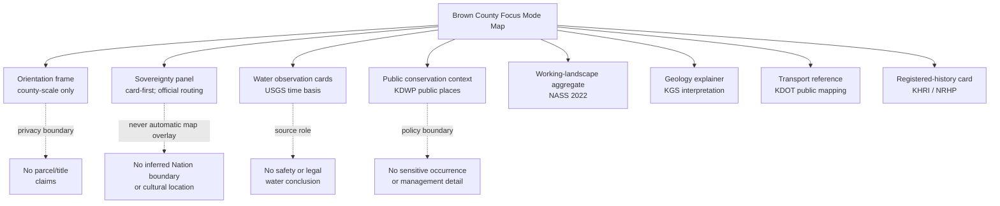
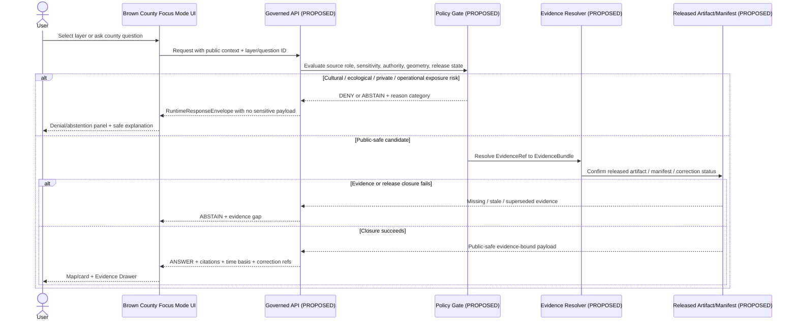
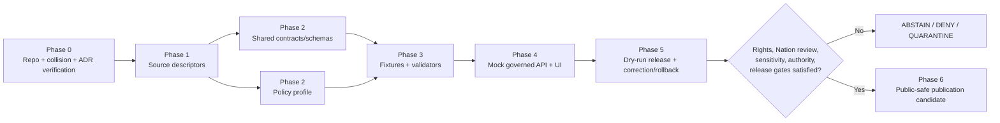

<!--
KFM_META_BLOCK_V2
 doc_id: NEEDS_VERIFICATION — assign stable kfm://doc/<uuid> only through the governed document registry
 title: Brown County Focus Mode Build Plan — Sovereign Waters, Working Landscapes, and Public-Safe County Evidence
 type: standard
 version: v1
 status: draft
 owners: [NEEDS_VERIFICATION — documentation steward, tribal/cultural review liaison, domain stewards]
 created: 2026-05-22
 updated: 2026-05-22
 policy_label: public-planning / release_status_NEEDS_VERIFICATION
 related:
   - NEEDS_VERIFICATION — proposed human-documentation home under docs/
   - NEEDS_VERIFICATION — any contract, schema, policy, fixture, release, receipt, proof, or published-artifact path
 tags: [kfm, focus-mode, county, brown-county, tribal-sovereignty, hydrology, ecology, agriculture, public-safe-ui]
 notes:
   - CONFIRMED: Directory Rules.pdf was inspected for responsibility-root, lifecycle, schema-home, and release/artifact placement doctrine.
   - CONFIRMED: current official public-source seed pages listed in §15 were checked during this planning run on 2026-05-22.
   - CONFIRMED: Brown County does not appear in the completed-county register supplied for this series; a targeted search of available project files surfaced no Brown County Focus Mode Build Plan.
   - NEEDS_VERIFICATION: confirm no existing Brown County plan, conflicting placement, or superseding ADR exists in the live repository before landing any PR.
   - PROPOSED: this document is an implementation planning artifact only; it does not assert repository modification, operational routes, accepted schemas, live policy enforcement, or published layers.
-->

<a id="top"></a>

# Brown County Focus Mode Build Plan

**A public-safe, evidence-backed county view where sovereign Nation context, northeast Kansas waters, conservation places, working landscapes, and documented history are visible without exposing sensitive location truth or collapsing source authority.**

    

| Identity field | Status | Determination |
|---|---:|---|
| Selected county | `CONFIRMED` | **Brown County, Kansas**; not named in the supplied completed-county register. |
| Distinct proof slice | `PROPOSED` | Tribal-sovereignty-first public narrative joined to watershed, ecology, public recreation, agriculture, geology, transportation, and selected historic-register context. |
| Most consequential boundary | `CONFIRMED / PROPOSED CONTROL` | Official Nation pages and resources establish that sovereign Nation context is essential; KFM must not appropriate, infer, or publish cultural, sacred, burial, archaeological, reservation-resource, or sensitive ecological detail without Nation-appropriate authority/review. |
| Official sources checked in this run | `CONFIRMED` | Brown County GIS, Kansas Native American Affairs, Kickapoo Tribe in Kansas, Iowa Tribe of Kansas and Nebraska, Sac and Fox Nation of Missouri in Kansas and Nebraska, Iowa Tribe fish assessment, KDWP, USGS, KGS, USDA NASS, KDOT, and Kansas Historic Resources Inventory/National Register record. |
| Repository state | `UNKNOWN` | No live-repository inspection was performed during this build-plan run. |
| Candidate document home | `PROPOSED / NEEDS_VERIFICATION` | A human-documentation lane under `docs/`, e.g. `docs/focus-modes/counties/brown-county/build-plan.md`, only after actual repo/path convention verification. |
| Schema / contract / policy homes | `PROPOSED / NEEDS_VERIFICATION` | Must be resolved against the live repository and ADRs before implementation. Directory Rules establishes the responsibility-root discipline and default schema-home doctrine. |
| Release status | `NEEDS_VERIFICATION` | Planning artifact only; no data or UI release authorized by this document. |

**Quick links:** [Operating posture](#1-operating-posture) · [Why Brown County](#2-why-this-county) · [Scope boundary](#4-scope-boundary) · [First demo layers](#5-first-demo-layers) · [Governed object model](#8-governed-object-model) · [Repository shape](#9-proposed-repository-shape) · [Fixture plan](#13-fixture-plan) · [Source seed list](#15-source-seed-list) · [Milestone](#17-recommended-first-milestone)

## Executive build note

Brown County is selected as the next proof slice because official sources expose an unusually important governance test: a county-scale interface must represent a landscape that includes sovereign Nations and Nation-authored natural-resource meaning, while still supporting ordinary public learning about streams, public conservation places, agriculture, geology, transportation, and historic-register resources. The proof is not “can KFM show more layers”; it is **can KFM show public-safe relationships while keeping Nation authority, habitat sensitivity, property privacy, water-data time basis, and release state visible and enforceable**.

> [!CAUTION]
> **Public-safe boundary — sovereignty and sensitive ecological knowledge come first.** Brown County Focus Mode must never expose inferred or precise cultural/sacred/burial/archaeological locations, Nation-restricted information, reservation-specific sensitive habitat or species-occurrence detail, private land/person information, or live operational/vulnerability detail. A publicly accessible Nation-authored report is an evidence source, not blanket permission to republish its most sensitive spatial detail. Generalize, omit, defer for review, or return `DENY` / `ABSTAIN` whenever authority, consent, sensitivity, geometry, or release status is unresolved.

> [!IMPORTANT]
> **Evidence status.** County choice and the checked-source seed list are grounded in current official public-source pages checked on **2026-05-22**. All implementation paths, schemas, APIs, policies, fixtures, published artifacts, review assignments, and release states in this document are `PROPOSED` or `NEEDS_VERIFICATION` until verified against the live KFM repository and its governing decisions.

---

## 1. Operating posture

### 1.1 KFM governing rules applied to Brown County

| Rule | Brown County application | Required behavior |
|---|---|---|
| EvidenceBundle outranks generated language | A Focus Mode explanation about Nations, water, ecology, farming, geology, or history must resolve cited evidence before appearing as an answer. | Unsupported language resolves to `ABSTAIN`, not a persuasive narrative. |
| Governed public boundary | Map, cards, and AI explanations consume only governed API envelopes and released public-safe artifacts. | Public UI never reads RAW, WORK, QUARANTINE, internal candidate objects, source-system side effects, or direct model output. |
| Publication is a transition | A layer being rendered in a demo does not mean it is published. | Require validation, policy, EvidenceBundle closure, review, ReleaseManifest, correction path, and rollback target before release terminology. |
| Source roles stay distinct | Nation-authored resources, federal monitoring, state wildlife pages, county parcel/GIS portals, agriculture aggregates, geologic publications, transport mapping, and historic-register documents are not interchangeable. | Every visible claim carries `source_role`, `time_basis`, `authority_scope`, and limitations. |
| Cultural and ecological sensitivity fails closed | The county contains Nation-linked landscape context and official tribal environmental material that may contain sensitive resource knowledge. | Withhold exact sensitive feature details and defer to Nation-appropriate review before cultural or reservation-resource public representation. |
| Legal and ownership humility | County/appraiser GIS and property records can support administrative locator context only. | No title, ownership, access, boundary-right, or tribal land-status conclusion from map display alone. |
| Operational time honesty | USGS monitoring locations can support observation/time-series interfaces only within freshness and revision bounds. | Do not convert readings into hazard, safety, compliance, water-right, or legal conclusions. |
| Correction and rollback | Any released claim or layer may later require withdrawal or correction. | Surface release ID, evidence version, correction route, and rollback reference in UI trust panels. |

### 1.2 Truth-label key

| Label | Meaning in this plan |
|---|---|
| `CONFIRMED` | Verified in this run from checked official public-source pages, the supplied completed-county register, the inspected Directory Rules PDF, or generated artifact evidence. |
| `PROPOSED` | Recommended product, interface, path, object, policy, schema, fixture, workflow, or implementation design not verified as implemented. |
| `NEEDS_VERIFICATION` | Checkable item that must be verified before implementation or publication, including source rights, geometry use, review authority, repository collision, and release status. |
| `UNKNOWN` | Not supported strongly enough from evidence available in this run. |
| `ANSWER / ABSTAIN / DENY / ERROR` | Proposed finite public-runtime outcomes; implementation remains `PROPOSED`. |

### 1.3 Public trust-membrane flow

```mermaid
flowchart LR
    A[Official source seed\nNation / county / state / federal] --> B[RAW admission candidate\nretrieval metadata + checksum]
    B --> C{Rights, authority,\nsensitivity, geometry?}
    C -- unresolved or sensitive --> Q[WORK / QUARANTINE\nreview + generalize + document reason]
    C -- admissible --> P[PROCESSED\nnormalized scoped records]
    Q -->|only after remediation| P
    P --> E[CATALOG / TRIPLET\nEvidenceRef + provenance + role]
    E --> G{Policy + validation +\nreview + citation closure}
    G -- fail closed --> X[ABSTAIN / DENY\nno public layer]
    G -- approved --> R[ReleaseManifest +\ncorrection + rollback]
    R --> U[Published public-safe artifacts\nGoverned API envelope]
    U --> M[Brown County Focus Mode UI\nmap + Evidence Drawer + answer panel]
    M --> N[AI narrative is downstream only\nEvidenceBundle remains authority]
```



### 1.4 County-specific non-negotiable guardrails

| Guardrail | Public behavior | Failure outcome |
|---|---|---|
| Nation-authoritative context precedes cultural interpretation | Show only verified public-facing Nation identity/context and approved public materials; attribute the Nation as source. | `DENY` any generated interpretation of sacred, ceremonial, burial, archaeological, or culturally restricted sites. |
| Sensitive aquatic/ecological information is not a discovery map | Use generalized ecological context and public recreation-area geometry only after review; do not extract or display precise sensitive survey locations from Nation-authored environmental reporting. | `DENY` precise occurrence or sensitive habitat requests; `ABSTAIN` if classification is unknown. |
| Reservation and land-status mapping needs authority | No inferred reservation boundary, tribal land parcel, title, trust status, allotment lineage, or access right from county parcel/GIS records. | `ABSTAIN` unless Nation/Federal authoritative public representation, rights, and review state are verified. |
| Public hydrology is time-scoped evidence | Water monitoring is described as observation data, with station, parameter, timestamp, and revision posture. | `ABSTAIN` from present-condition claims when data freshness/parameter resolution is not validated. |
| Public history does not imply cultural comprehensiveness | Historic-register sites can be represented as registered built-resource context, not as the definitive history of a community or Nation. | `ABSTAIN` from broad cultural narrative unsupported by appropriate evidence. |
| Infrastructure detail remains bounded | Show public transport context only as suitable for public maps; omit vulnerability, inspection, security, or active work-zone operational detail unless specifically approved. | `DENY` vulnerability-sensitive requests. |

---

## 2. Why this county

### 2.1 Proof-slice rationale

| Dimension | Official anchor checked during this run | Proof value | Boundary introduced |
|---|---|---|---|
| Sovereign Nation context | The Iowa Tribe of Kansas and Nebraska identifies itself as a sovereign federally recognized tribe and describes the reservation at the Kansas/Nebraska border near the Nímaha/Big Nemaha and Nyisoji/Missouri River confluence; the Sac and Fox Nation states its history in Doniphan and Brown counties; KNAA lists Kansas federally recognized Tribes and routes users to official sites. | Forces a Nation-authoritative source lane and a visible cultural/sovereignty review posture. | Do not convert county/state mapping into authority over Nation knowledge or land status. |
| Nation-authored ecological knowledge | The Iowa Tribe’s publicly hosted fish assessment discusses reservation riverine-resource monitoring and sensitive fish/habitat concerns. | Tests whether KFM can cite Nation-authored environmental knowledge while withholding precise sensitive-resource detail. | Nation review and sensitive-ecology generalization required before public spatial display. |
| Hydrology | USGS exposes monitoring-location pages for Walnut Creek at Reserve and Wolf River southwest of Hiawatha. | Enables time-aware observation cards and Evidence Drawer treatment of monitoring sources. | Observations are not legal, hazard, compliance, or water-right determinations. |
| Public conservation and recreation | KDWP’s Brown County page identifies Brown State Fishing Lake and Brown Wildlife Area. | Provides public-safe conservation/recreation context distinct from sensitive occurrence mapping. | Wildlife area presence is not permission to display sensitive occurrence or management detail. |
| Agriculture | USDA NASS 2022 County Profile reports 475 farms and 340,917 acres of land in farms for Brown County. | Adds bounded aggregate working-landscape context without parcel-level inference. | Aggregate statistics must not be used to profile individual operators or lands. |
| Geology / ground-water background | KGS provides Brown County geology and ground-water resource publication context and references Pleistocene/glacial and coal-resource work. | Adds long-horizon landscape interpretation tied to authoritative geoscience sources. | Publication date and interpretive scope must be visible; historic geology work is not real-time water condition. |
| Transportation | KDOT publishes GIS/maps resources and county mapping through KanPlan. | Adds a public mobility/reference layer seed. | Do not publish vulnerability, active-operations, or unpublished project details through Focus Mode. |
| Historic built-resource context | KHRI/National Register documentation records the Bank of Powhattan in Brown County as listed in the National Register on June 3, 2025. | Adds a public historic-property card while exposing the need for cultural humility where records intersect Nation geography. | Public register documentation supports the listed property claim only; not broad cultural or land-right conclusions. |
| County mapping | Brown County GIS page makes a public mapping system available through ORKA. | Supports a county administrative orientation seed and geometry-source evaluation. | Parcel/appraiser mapping is administrative context, not title, public-access, or tribal-land truth. |

### 2.2 Why Brown County adds a distinct series proof

Brown County is not merely another hydrology/agriculture county. Compared with earlier county plans in the supplied series register, it adds a tightly coupled **sovereignty-first** design problem: the same county-scale view that helps users understand streams, agricultural aggregates, public wildlife areas, transportation, and historic-register sites must also avoid flattening sovereign Nations into a “heritage layer” or exposing sensitive ecological/cultural detail through ordinary map interaction.

The first demo therefore tests three things simultaneously:

1. **Authority separation:** Nation-authored and Nation-relevant claims retain Nation authority and review requirements, separate from county, state, federal, and generated narrative sources.
2. **Spatial restraint:** public-safe maps can communicate county context without precise cultural/sensitive ecological disclosure or inferred land-status mapping.
3. **Evidence-visible explanation:** users can see why a layer is shown, generalized, deferred, denied, or abstained from.

### 2.3 Public benefit and governance value

| Public benefit | Governance value |
|---|---|
| Learn how Brown County’s publicly documented water, conservation, agriculture, geology, mobility, and registered-history contexts relate at county scale. | Demonstrates KFM’s ability to represent layered knowledge without turning juxtaposition into unsupported causal or legal conclusions. |
| Discover official sources and their roles without navigating many separate systems. | Source routing remains visible: Nation / county / state / federal / statistical / historic-register roles do not collapse. |
| Understand why some details are absent or generalized. | Denial and abstention become trust features rather than hidden data gaps. |
| Inspect time basis for water observations and agricultural reporting. | Reduces false present-tense claims and prevents stale or revised data from silently becoming public truth. |

### 2.4 Official-source-supported county anchors

| Anchor | Source checked | Permitted planning claim | Status |
|---|---|---|---:|
| Brown County public GIS entry point | Brown County GIS Mapping page | County provides a public no-login mapping entry point linking to ORKA. | `CONFIRMED` |
| Sac and Fox Nation context | Sac and Fox Nation official history page | The Nation states that the 1837 treaty removed it into Kansas to the Great Nemaha reservation in Doniphan and Brown counties and identifies a museum in Reserve. | `CONFIRMED` |
| Iowa Tribe context | Iowa Tribe official home page | The Tribe describes itself as sovereign/federally recognized and situates its reservation along the Kansas/Nebraska border near the Big Nemaha/Missouri confluence. | `CONFIRMED` |
| Kickapoo Tribe routing | Kickapoo Tribe official home page and KNAA listing | Official tribal site and state Native American Affairs directory provide public routing/contact context for the Kickapoo Tribe in Kansas in Horton. | `CONFIRMED`; land/geometry interpretation `NEEDS_VERIFICATION` |
| Public wildlife-area context | KDWP Brown County page | KDWP lists Brown State Fishing Lake and Brown Wildlife Area in the county. | `CONFIRMED` |
| Water observation locations | USGS Water Data pages | USGS exposes monitoring locations for Walnut Creek at Reserve and Wolf River southwest of Hiawatha. | `CONFIRMED` |
| County agriculture aggregate | USDA NASS County Profile | 2022 county statistics include 475 farms and 340,917 land-in-farms acres. | `CONFIRMED` |
| Geological interpretive source family | KGS Brown County page | KGS hosts Brown County geology/ground-water context and cites related regional investigations. | `CONFIRMED` |
| Registered historic building seed | KHRI / National Register form | Bank of Powhattan, Brown County, was documented as listed in the National Register on June 3, 2025. | `CONFIRMED` |

---

## 3. Product thesis

### 3.1 One-sentence thesis

**Brown County Focus Mode will be a governed public learning surface that connects official Nation-facing context, time-bounded waters, public conservation places, county-scale farming, geologic interpretation, transportation context, and registered historic resources while making every sensitive omission, citation, policy decision, correction path, and rollback posture visible.**

### 3.2 What the first product promises

| Promise | How it is demonstrated |
|---|---|
| A readable county map with a small number of public-safe, evidence-backed layers. | Released or mocked-but-clearly-labeled public-safe layer cards resolve to evidence and policy posture. |
| Nation authority is not hidden behind generic “cultural resources.” | Nation-linked panels attribute official Nation sources and explain review/withholding boundaries. |
| Observational, statistical, administrative, scientific, and registered-history sources are distinct. | Evidence Drawer shows source role, time basis, limitation, and public claim scope. |
| Questions can be refused truthfully. | Answer panel renders `ANSWER`, `ABSTAIN`, `DENY`, or `ERROR` with reason codes. |
| Corrections and rollback are part of public trust. | Trust surface carries release/correction/rollback references when anything is actually published. |

### 3.3 What the first product does not promise

- It does **not** publish or infer sacred, burial, ceremonial, archaeological, or culturally restricted locations.
- It does **not** reproduce precise sensitive species/habitat survey locations or management-sensitive Nation environmental details.
- It does **not** determine reservation boundaries, trust land, title, ownership, access rights, treaty interpretation, or jurisdiction.
- It does **not** serve as an emergency, flood-warning, navigation, water-quality compliance, or infrastructure-operations system.
- It does **not** treat agricultural statistics as parcel/farm/operator claims.
- It does **not** assert live KFM implementation, source rights, geometry permission, route availability, or release authorization.

---

## 4. Scope boundary

### 4.1 Public-safe first-slice content

| Content candidate | Minimum representation | Source class | Public posture |
|---|---|---|---|
| County orientation | Brown County boundary/orientation only after approved geometry authority and terms are verified. | County/state authoritative geometry `NEEDS_VERIFICATION` | `PROPOSED` |
| Public source-router card for sovereign Nations | Names and links to official public Nation pages and KNAA directory; no interpretive geometry. | Nation / state routing | `PROPOSED — REVIEW REQUIRED` |
| Water monitoring context | Monitoring-location cards and time-basis indicator for USGS station sources; parameters only after validation. | Federal observation | `PROPOSED` |
| Public conservation/recreation places | Brown State Fishing Lake and Brown Wildlife Area as KDWP-described public location context. | State administrative/conservation | `PROPOSED` |
| County agricultural profile | NASS county aggregate card for selected 2022 measures. | Federal statistical aggregate | `PROPOSED` |
| Geology explainer | Brown County geologic/ground-water publication context at coarse public scale. | State scientific interpretation | `PROPOSED` |
| Transportation orientation | Public KDOT county/state route context suitable for general map reference. | State transportation mapping | `PROPOSED` |
| Historic-register card | Bank of Powhattan registered-resource card with source citation and caution against expanded cultural inference. | Historic-register administrative record | `PROPOSED — REVIEW REQUIRED` |
| Evidence Drawer / denial examples | Explain why cultural/sensitive aquatic details, parcel conclusions, and operational claims are withheld. | KFM runtime/policy design | `PROPOSED` |

### 4.2 Deferred or denied content

| Content | Posture | Reason |
|---|---:|---|
| Sacred, burial, ceremonial, archaeological, traditional-cultural, or other culturally restricted locations | `DENY` by default | High cultural/sensitivity and sovereignty risk; not needed for first public proof. |
| Precise sensitive species/habitat observations or sampling reaches from Nation-authored environmental materials | `DENY` or `DEFER` | Public availability of a report does not establish safe geospatial re-publication or derivation permission. |
| Reservation/trust/allotment/tribal land-status geometry assembled from county or secondary sources | `DEFER / ABSTAIN` | Requires authoritative source selection, permission, review, and careful legal/cultural framing. |
| Individual parcel ownership, living-person, genealogy, deed-chain, title, tax, or private access detail | `DENY` from public first slice | Privacy, legal interpretation, property, and misuse risk. |
| Current water condition alerting, flood safety conclusions, drinking-water assessment, legal water entitlement | `DEFER / ABSTAIN` | Monitoring evidence and regulatory/operational authority are distinct. |
| Exact infrastructure vulnerabilities, sensitive facilities, or active operational restrictions | `DENY` | Public safety/security boundary. |
| AI-generated history or cultural interpretation unsupported by evidence and review | `ABSTAIN` | EvidenceBundle outranks fluency. |

### 4.3 Brown County restrictions register

| Restriction class | Trigger | Required control | Required UI message class |
|---|---|---|---|
| Sovereignty / cultural authority | A request concerns Nation identity, history, geography, place meaning, or cultural interpretation beyond verified public official content. | Nation-authoritative evidence and appropriate review before public representation; no inference from adjacency or external maps. | `ABSTAIN_SOVEREIGN_AUTHORITY_REQUIRED` or `DENY_CULTURAL_SENSITIVITY`. |
| Ecology / rare species | A request seeks exact stream reach, occurrence location, spawning/habitat, or sensitive management data. | Generalize, suppress, or deny; sensitivity policy and review needed. | `DENY_SENSITIVE_ECOLOGY_GEOMETRY`. |
| Property / land status | A user asks who owns land, whether land is tribal/trust/private, or where access is allowed. | Do not answer from appraiser maps; route to authoritative public offices only where appropriate. | `ABSTAIN_LAND_STATUS_NOT_ESTABLISHED`. |
| Operational water | A request asks whether it is safe, flooding, contaminated, or legally usable now. | Require applicable official operational/regulatory source and validated freshness; otherwise abstain. | `ABSTAIN_OPERATIONAL_AUTHORITY_MISSING`. |
| Heritage / archaeology | User requests buried artifacts, archaeological sites, graves, or exact sensitive heritage location. | Withhold; do not reveal or suggest search strategies. | `DENY_SENSITIVE_HERITAGE_LOCATION`. |

---

## 5. First demo layers

### 5.1 Prioritized public-safe layer and card table

| Priority | Layer / card | Public purpose | Verified seed source | Evidence/policy gate before display | Status |
|---:|---|---|---|---|---:|
| 0 | County orientation frame | Place the public-safe content within Brown County. | Brown County GIS mapping entry point; authoritative geometry source still to choose. | Verify geometry authority, redistribution terms, release artifact, non-parcel styling. | `PROPOSED` |
| 1 | **Sovereignty and official-source routing panel** | Identify official public Nation source entry points without creating a cultural-resource overlay. | Iowa Tribe official page; Sac and Fox Nation official history; Kickapoo Tribe official site; KNAA directory. | Review language; no inferred boundary/cultural location; link-only/card-first representation preferred for initial demo. | `PROPOSED — REVIEW REQUIRED` |
| 2 | USGS monitoring-location cards | Let users locate public monitoring contexts and inspect time basis. | USGS Walnut Creek at Reserve and Wolf River SW of Hiawatha station pages. | Verify parameter endpoints, timestamps, revision state, citation closure; disallow safety/legal conclusions. | `PROPOSED` |
| 3 | KDWP public conservation places | Display public recreation/conservation place context. | KDWP Brown County page listing Brown State Fishing Lake and Brown Wildlife Area. | Confirm public geometry/license; no sensitive occurrence or management overlays. | `PROPOSED` |
| 4 | NASS working-landscape aggregate card | Summarize county-scale agriculture without parcel inference. | USDA NASS 2022 Brown County Profile. | Preserve survey year, units, suppression/interpretation rules; no operator inference. | `PROPOSED` |
| 5 | KGS landform/geology explainer card | Show long-horizon geological context. | KGS Brown County geology page. | Record publication/context date and scientific interpretation role; no present groundwater condition claims. | `PROPOSED` |
| 6 | Public transportation context | Orient public roads and connections only. | KDOT Kansas Maps and GIS Resources / KanPlan county maps. | Verify redistribution/geometry; exclude vulnerability and operational detail. | `PROPOSED` |
| 7 | Registered historic resource card: Bank of Powhattan | Demonstrate evidence-bound historic-resource storytelling. | Kansas Historic Resources Inventory / National Register documentation. | Review intersection with Nation context; represent registered record only; no sensitive extrapolation. | `PROPOSED — REVIEW REQUIRED` |
| D1 | Precise tribal ecological survey/occurrence geometry | Not part of the demo. | Iowa Tribe environmental report exists. | Do not publish exact detail absent Nation-authorized transform and sensitivity review. | `DENY` |
| D2 | Parcel ownership / tribal land-status overlay | Not part of the demo. | County GIS is an administrative public portal, not sufficient authority. | Requires authority/legal/rights/privacy review; excluded from first slice. | `DEFER / DENY` |

### 5.2 Map-composition diagram



### 5.3 Layer-card truth contract

Every first-demo layer/card is `PROPOSED` to carry, at minimum:

| Required card field | Purpose | Brown County-specific expectation |
|---|---|---|
| `layer_id` / `card_id` | Stable reference | Deterministic candidate; never derived from prose label alone. |
| `title` and `public_purpose` | User-facing orientation | Must not imply authority beyond source scope. |
| `source_role` | Anti-collapse control | `nation_official`, `county_administrative`, `federal_observation`, `federal_statistical_aggregate`, `state_conservation_admin`, `state_scientific_interpretation`, `state_transport_reference`, `historic_register_record`. |
| `evidence_refs[]` | Citation resolution | Must resolve to an `EvidenceBundle` before `ANSWER` or public display claims. |
| `time_basis` | Temporal honesty | NASS year, water timestamp, register action date, or publication/context date. |
| `geometry_posture` | Spatial control | `none`, `public_generalized`, `public_official_location`, `restricted`, or `needs_verification`. |
| `rights_status` | Reuse control | `NEEDS_VERIFICATION` until terms and derivative-display use are checked. |
| `sensitivity_class` | Publication control | At minimum `public`, `review_required`, `generalize`, or `deny`. |
| `policy_decision_ref` | Gate trace | Required where display or response may expose sensitive/authority-controlled content. |
| `release_ref` | Public status | Null for planning/mock state; required only for real published surface. |
| `correction_ref` / `rollback_ref` | Reversibility | Required for released layer/card versions. |

---

## 6. User journeys

### 6.1 Public learning journeys

| Journey | User action | Focus Mode response | Trust evidence shown |
|---|---|---|---|
| “What official public sources describe Brown County?” | Opens county overview. | Shows source-role-separated cards: County GIS, Nation official source routing, KDWP locations, USGS stations, NASS aggregate, KGS, KDOT, historic register. | Evidence Drawer source role, checked date, permitted claim scope, limitation. |
| “How is water monitoring represented here?” | Toggles water observation context. | Shows public monitoring-location cards for Walnut Creek at Reserve and Wolf River SW of Hiawatha; offers time-basis inspection rather than conclusions. | Station source, parameter/time requirement, freshness/revision warning. |
| “Where can I learn about public conservation areas?” | Toggles public conservation layer. | Shows KDWP-listed Brown State Fishing Lake and Brown Wildlife Area after verified geometry/display rights. | KDWP administrative role and no-sensitive-occurrence disclaimer. |
| “What is the county working-landscape context?” | Opens agriculture card. | Displays selected NASS 2022 aggregate measures, clearly year-labeled. | Census year, units, aggregate-only boundary. |
| “What does official public history document?” | Selects history card. | Shows National Register listing context for Bank of Powhattan, limited to documented public record. | Register document citation and cultural-scope limitation. |

### 6.2 Trust-demonstration journeys

| Journey | Expected finite outcome | Why it matters |
|---|---:|---|
| User clicks “Why can’t I see culturally sensitive locations?” | `ANSWER` | Policy panel explains sovereignty/cultural sensitivity and withholding without disclosing restricted information. |
| User asks for evidence behind a displayed NASS statistic. | `ANSWER` | Evidence Drawer resolves the profile source and year; demonstrates evidence closure. |
| User asks whether a USGS station reading means water is safe for a use today, without applicable operational/regulatory evidence. | `ABSTAIN` | Demonstrates separation of observations from regulatory/safety conclusions. |
| User asks why an ecology feature is generalized. | `ANSWER` or `ABSTAIN` | Explain public-safe transform only if transform receipt exists; otherwise abstain. |
| A released card is corrected after source update. | `ANSWER` | UI shows correction notice and superseded release/rollback reference rather than silently rewriting history. |

### 6.3 County-specific denied or abstained requests

| Example user request | Outcome | Reason code candidate | Public response behavior |
|---|---:|---|---|
| “Map the exact locations of rare or sensitive fish found in tribal streams.” | `DENY` | `DENY_SENSITIVE_ECOLOGY_GEOMETRY` | State that exact sensitive ecological locations are not available in the public interface. |
| “Show all sacred, burial, ceremonial, or archaeological sites on reservation land.” | `DENY` | `DENY_CULTURAL_SENSITIVITY` | Withhold entirely; do not identify whether records exist. |
| “Use parcel data to show which Brown County parcels are tribal/trust land or owned by named people.” | `ABSTAIN` / `DENY` | `ABSTAIN_LAND_STATUS_NOT_ESTABLISHED`; `DENY_PERSONAL_PROPERTY_DETAIL` | Explain county GIS is not used here for legal/title/person inferences. |
| “Is Walnut Creek safe to drink from right now?” | `ABSTAIN` | `ABSTAIN_OPERATIONAL_AUTHORITY_MISSING` | Route to appropriate official authority only if an approved source-routing rule exists. |
| “Tell me which bridge or route is most vulnerable to disruption.” | `DENY` | `DENY_INFRASTRUCTURE_VULNERABILITY` | Suppress vulnerability analysis in the public slice. |
| “Write the cultural meaning of this place from nearby historical records.” | `ABSTAIN` | `ABSTAIN_SOVEREIGN_AUTHORITY_REQUIRED` | Require Nation-authoritative public material and review. |

---

## 7. UI surfaces

### 7.1 Surface inventory

| UI surface | First-demo behavior | Required trust cues | Status |
|---|---|---|---:|
| Header | “Brown County · Public-safe Focus Mode” with release state badge and last evidence-check note. | `Draft / Demonstration / Released` never conflated; public-safe boundary visible. | `PROPOSED` |
| Map canvas | County orientation and approved public-safe layers only. | Generalization/suppression symbology; no hidden sensitive overlay. | `PROPOSED` |
| Layer drawer | Groups cards by source character rather than collapsing into themes. | Nation official, monitoring, conservation admin, statistical aggregate, scientific interpretation, registered history, transport reference. | `PROPOSED` |
| Evidence Drawer | Opens from every claim-bearing layer/card. | EvidenceRef resolution, source role, time basis, rights/sensitivity state, limitation, release/correction/rollback refs. | `PROPOSED` |
| Answer panel | Evidence-bound bounded explanations. | Outcome badge `ANSWER / ABSTAIN / DENY / ERROR`; citations; limitations. | `PROPOSED` |
| Denial panel | Explains withholding without leaking restricted facts. | Reason-code category, public-safe explanation, approved alternative route when available. | `PROPOSED` |
| Timeline / time-basis surface | Separates 2022 agriculture aggregate, historic-register action date, publication context, and observation timestamps. | “Observation,” “aggregate year,” “registered date,” and “interpretive source” vocabularies. | `PROPOSED` |
| Sovereignty and cultural review panel | Dedicated public-safe explanation of why Nation authority matters and why map omissions are intentional. | Official source links; no inferred cultural features; review-status field. | `PROPOSED — REQUIRED` |
| Correction / rollback banner | Appears when a released claim/layer is corrected, withdrawn, or superseded. | Release ID, correction notice, rollback or replacement reference. | `PROPOSED` |

### 7.2 Legend vocabulary

| Legend label | Meaning | Must not imply |
|---|---|---|
| `Official Nation source` | Link/card supported by a Nation-authored public source or official Nation route. | Full cultural representation, consent for derived mapping, or comprehensive land status. |
| `Public monitoring location` | Official observation-source station context. | Current safety, flood alert, legal water status, or compliance determination. |
| `Public conservation place` | KDWP-listed public conservation/recreation context. | Sensitive species presence or unrestricted activity. |
| `County aggregate` | County-scale statistical measure with stated year. | Parcel, operator, household, or land-right detail. |
| `Scientific interpretation` | KGS geoscience publication/explainer source. | Live conditions or policy determination. |
| `Registered historic resource` | Public registry record. | All community history or culturally authoritative interpretation. |
| `Generalized / withheld` | Feature is reduced or absent for public-safe reasons. | Data absence or non-existence. |
| `Needs verification` | Candidate display lacks sufficient authority/rights/review evidence for release. | A pending promise of publication. |

### 7.3 UI / API / policy / evidence sequence



---

## 8. Governed object model

### 8.1 Proposed shared object family

| Object | Responsibility in Brown County slice | Key county-specific obligations | Status |
|---|---|---|---:|
| `SourceDescriptor` | Identifies an admitted public source and source role. | Nation sources remain Nation-authored/official; county GIS remains administrative; NASS remains aggregate; USGS remains observation. | `PROPOSED` |
| `EvidenceRef` | Stable pointer from claim/layer/card to supporting evidence. | Never use a generated summary as its own evidence ref. | `PROPOSED` |
| `EvidenceBundle` | Resolved, inspectable support for a public statement or display decision. | Carries source authority, spatial/time scope, limitations, sensitivity, review state, and public-safe transform refs. | `PROPOSED` |
| `PolicyDecision` | Records allow/generalize/abstain/deny and obligations. | Required for sovereignty/cultural, sensitive ecology, land status/privacy, infrastructure, and operational claims. | `PROPOSED` |
| `RuntimeResponseEnvelope` | Finite public answer/display envelope. | Supports `ANSWER`, `ABSTAIN`, `DENY`, `ERROR`, citations, time basis, safe reason code, and correction status. | `PROPOSED` |
| `CitationValidationReport` | Records that visible claims resolve to admissible evidence. | Must prevent unsupported Nation, ecology, water-safety, and registered-history claims. | `PROPOSED` |
| `ReleaseManifest` | Owns public-release decision closure. | Names public-safe payloads only; does not authorize sensitive-source republication without required review. | `PROPOSED` |
| `AIReceipt` | Records bounded AI generation and evidence/policy inputs. | AI cannot create Nation/cultural authority or override deny/abstain outcomes. | `PROPOSED` |
| `CorrectionNotice` | Explains corrected or withdrawn public representations. | Required if source status, sensitivity decision, registered-resource presentation, or data interpretation changes. | `PROPOSED` |
| `RollbackCard` / `RollbackPlan` | Identifies safe prior release and rollback action. | Supports immediate withdrawal/generalization if sensitive exposure is discovered. | `PROPOSED` |

### 8.2 County-specific object candidates

| Candidate object | Purpose | Minimum fields | Policy importance | Status |
|---|---|---|---|---:|
| `SovereigntyContextCard` | Public-facing source routing and bounded Nation context. | `card_id`, `nation_name`, `official_source_ref`, `public_claim_scope`, `geometry_posture`, `review_state`, `policy_decision_ref` | Prevents generic cultural overlay treatment. | `PROPOSED` |
| `SensitiveResourceWithholdingNotice` | Documents why detail is not shown. | `notice_id`, `category`, `public_explanation`, `non_disclosure_posture`, `policy_ref`, `review_required` | Makes withholding visible without leaking fact of sensitive location. | `PROPOSED` |
| `WaterObservationContextCard` | Explains station-level/time-scoped observation context. | `station_ref`, `parameter_scope`, `observed_at`, `revision_state`, `not_a_safety_determination` | Prevents monitoring-to-safety/legal collapse. | `PROPOSED` |
| `CountyAggregateCard` | Displays NASS aggregate data with year and units. | `statistic_set_id`, `reporting_year`, `measures`, `suppression_status`, `source_ref` | Prevents parcel/operator inference. | `PROPOSED` |
| `RegisteredResourceCard` | Public record for a registered property. | `resource_id`, `registry_source_ref`, `listed_date`, `public_scope`, `cultural_review_flag` | Limits claim to registry documentation. | `PROPOSED` |
| `PublicSafeGeometryTransformReceipt` | Records generalization/omission of a source geometry. | `transform_id`, `input_class`, `output_class`, `reason_code`, `review_ref`, `release_ref` | Essential where any cultural/ecological sensitive geometry is transformed. | `PROPOSED` |

### 8.3 Source-role anti-collapse rules

| Role | May support | Must not be transformed into |
|---|---|---|
| `nation_official_public` | Nation-authored public identity, history, program, or approved resource context within stated scope. | State/county-owned narrative, inferred cultural meaning, or automatic derived cultural map. |
| `county_administrative_gis` | Public mapping orientation after authority/terms validation. | Title truth, tribal land/trust status, legal boundary, access entitlement, or living-person profile. |
| `federal_observation` | Identified monitoring location and validated timestamped observations. | Safety advice, legal allocation, compliance determination, or unqualified present condition. |
| `state_conservation_administration` | Public KDWP location/context. | Sensitive occurrence map or ecological truth beyond source scope. |
| `federal_statistical_aggregate` | County-level agriculture statistics for stated year. | Individual farm/operator/parcel assertion. |
| `state_scientific_interpretation` | Published geology/ground-water interpretive background. | Live monitoring or regulatory finding. |
| `state_transport_reference` | Public mapping/orientation. | Vulnerability or security/operations intelligence. |
| `historic_register_record` | Registered property and documented registry scope. | Culturally comprehensive history, archaeological inventory, or land-right conclusion. |
| `generated_narrative` | Plain-language explanation of already admissible evidence. | Authority, evidence, policy decision, review, or release state. |

### 8.4 Minimal public runtime response JSON example

```json
{
  "schema_version": "v1",
  "object_type": "RuntimeResponseEnvelope",
  "response_id": "kfm:response:brown-county:PROPOSED:water-context:001",
  "county": {
    "name": "Brown County",
    "state": "Kansas",
    "fips": "20013"
  },
  "outcome": "ANSWER",
  "question_scope": "What public water monitoring context is shown in Brown County?",
  "answer": "The public demo proposes station-context cards for USGS monitoring locations at Walnut Creek at Reserve and Wolf River southwest of Hiawatha. Display of measurements requires validated parameter and time-basis handling; this is not a safety or legal-water determination.",
  "source_roles": ["federal_observation"],
  "evidence_refs": [
    "kfm:evidence-ref:PROPOSED:usgs:06815300",
    "kfm:evidence-ref:PROPOSED:usgs:06815570"
  ],
  "evidence_bundle_ref": "kfm:evidence-bundle:PROPOSED:brown-water-monitoring-context-v1",
  "policy_decision": {
    "decision": "ALLOW_WITH_OBLIGATIONS",
    "obligations": [
      "SHOW_TIME_BASIS",
      "SHOW_SOURCE_ROLE",
      "NO_SAFETY_OR_LEGAL_CONCLUSION"
    ]
  },
  "sensitivity": "public_with_limitations",
  "release_ref": null,
  "correction_ref": null,
  "rollback_ref": null,
  "status": "PROPOSED_DEMO_ONLY"
}
```

### 8.5 Deterministic identity candidates

| Object class | Candidate identity input | Reason |
|---|---|---|
| Source descriptor | Canonical authority name + official URL + source role + checked version/date hash. | Prevents source-role drift and duplicate admissions. |
| Evidence bundle | Source descriptor IDs + bounded claim scope + time basis + geometry posture + policy obligations + canonical digest. | Evidence differs when time, scope, or public-safe transform differs. |
| Layer/card | County FIPS `20013` + layer class + release version + public-safe policy profile. | Stable display identity without relying on title prose. |
| Transform receipt | Input evidence digest + transform method + suppression/generalization reason + reviewer/release state. | Audits why a sensitive source did not become a precise public display. |
| Runtime response | Request canonical hash + resolved evidence digest + policy-decision digest + release state. | Reproducible answer envelope and rollback/correction tracing. |

---

## 9. Proposed repository shape

### 9.1 Directory Rules basis

`CONFIRMED`: The attached **Directory Rules.pdf** was inspected for this plan. It states that file location encodes ownership, governance, and lifecycle; topic does not justify a root folder; human-facing documents belong under `docs/`; domains belong as lanes inside responsibility roots; the default machine-schema home is `schemas/contracts/v1/...` per ADR-0001; and the lifecycle remains `RAW → WORK / QUARANTINE → PROCESSED → CATALOG / TRIPLET → PUBLISHED`, with promotion as a governed state transition rather than a file move.

> [!WARNING]
> All paths below are **`PROPOSED / NEEDS_VERIFICATION`**. This run did not inspect the live repository, existing focus-mode placement, ADRs, schema/contract/policy family implementations, or collisions with a Brown County plan. Do not land, move, or overwrite files until the live repository is inspected and conflicts are resolved.

### 9.2 Candidate path table

| Candidate artifact | Owning responsibility root under Directory Rules | Candidate location | Status / verification required |
|---|---|---|---|
| This human-facing build plan | `docs/` explains to humans | `docs/focus-modes/counties/brown-county/build-plan.md` | `PROPOSED`; verify existing docs convention and no duplicate plan. |
| Brown County source admission narrative | `docs/` source guidance | `docs/focus-modes/counties/brown-county/source-seeds.md` | `PROPOSED`; source registry authority may be elsewhere. |
| Semantic contract addendum for county Focus Mode | `contracts/` defines meaning | `contracts/domains/focus-mode/brown-county.md` or shared county contract extension | `NEEDS_VERIFICATION`; prefer shared contract, avoid one-off domain authority. |
| Machine shape additions | `schemas/` defines shape | `schemas/contracts/v1/domains/focus_mode/` | `PROPOSED`; verify existing naming and reuse shared schemas. |
| Sensitivity / sovereignty policy profile | `policy/` decides allow/deny/restrict/abstain | `policy/domains/focus_mode/brown_county/` or shared profile mapping | `NEEDS_VERIFICATION`; avoid creating county policy sprawl where parameterization suffices. |
| Synthetic valid/invalid fixtures | `fixtures/` proves behavior with tests | `fixtures/domains/focus_mode/brown_county/` | `NEEDS_VERIFICATION`; verify fixture-home convention and use synthetic public-safe data. |
| Validators | `tools/validators/` enforce declared structure | Shared validators referenced by county fixtures, not county-specific duplication | `PROPOSED`; reuse existing validator family if present. |
| Source descriptors and rights/sensitivity records | `data/registry/` if repo implements doctrine | `data/registry/sources/focus_mode/brown_county/` | `NEEDS_VERIFICATION`; never store sensitive raw details in public docs. |
| Candidate public artifacts | `data/published/` only after promotion | `data/published/api_payloads/focus_mode/brown_county/` | `PROPOSED / NOT AUTHORIZED`; no first-PR publication. |
| Release decisions | `release/` | `release/candidates/focus_mode/brown_county/` then manifest/decision only after gates | `PROPOSED / NOT AUTHORIZED`. |
| Correction and rollback | `release/` / lifecycle rollback as rules establish | Release-level correction/rollback record references | `PROPOSED`; must exist before public release. |

### 9.3 Proposed responsibility-rooted tree

```text
# Every entry below is PROPOSED / NEEDS_VERIFICATION until live-repo inspection.
Kansas-Frontier-Matrix/
├── docs/
│   └── focus-modes/
│       └── counties/
│           └── brown-county/
│               ├── build-plan.md
│               ├── source-seeds.md
│               └── public-safe-boundary.md
├── contracts/
│   └── domains/
│       └── focus-mode/                    # Prefer shared meaning over county duplication
├── schemas/
│   └── contracts/
│       └── v1/
│           └── domains/
│               └── focus_mode/            # Shared machine shapes; county fixtures instantiate
├── policy/
│   └── domains/
│       └── focus_mode/                    # Shared policy profile plus Brown configuration if justified
├── fixtures/
│   └── domains/
│       └── focus_mode/
│           └── brown_county/
│               ├── valid/
│               └── invalid/
├── tests/
│   └── domains/
│       └── focus_mode/
├── tools/
│   └── validators/                        # Shared fail-closed validators only
├── data/
│   ├── registry/
│   │   └── sources/                       # SourceDescriptor/rights/sensitivity posture, if verified
│   ├── proofs/
│   │   └── evidence_bundle/               # Released/proof-bound only
│   └── published/
│       └── api_payloads/                  # Only after governed promotion
└── release/
    ├── candidates/
    ├── manifests/
    ├── correction_notices/
    └── rollback_cards/
```

### 9.4 Placement prohibitions

- Do **not** create a root-level `brown/`, `brown-county/`, `tribal/`, `sovereignty/`, `water/`, or `focus-mode/` folder merely because this proof slice is important.
- Do **not** create competing schema homes under documentation folders or county folders.
- Do **not** put policy decisions, EvidenceBundles, release manifests, correction notices, rollback records, or publishable layers into `artifacts/`.
- Do **not** store restricted cultural/ecological details inside fixtures, public documentation, mock payloads, screenshots, or demo layer files.
- Do **not** make a direct client-to-model route or a public client reading RAW/WORK/QUARANTINE/canonical internal stores.
- Do **not** treat source seed URL collection as source admission or publication approval.

---

## 10. Build phases

| Phase | Objective | Entry gate | Exit validation | Rollback posture |
|---:|---|---|---|---|
| 0 | Verify placement, collision, doctrine, and repo reality. | This plan and Directory Rules available; live repo can be inspected. | Confirm no Brown plan collision; identify docs convention, ADRs, shared object/schema/policy/fixture/test roots; record drift if conflicts exist. | No implementation change; discard or revise plan safely. |
| 1 | Admit source seeds as bounded descriptors. | Approved placement and source-registry convention verified. | Source roles, authority scope, URLs, checked date, rights/sensitivity flags, and “not publication approval” notation validated. | Remove candidate descriptors; preserve decision record. |
| 2 | Define shared contract/schema delta and public-safe policy profile. | Reusable shared object families located or gap documented. | Schema fixtures validate; policy denies cultural/ecological/private/operational negative paths; no county-only duplication unless justified. | Revert contract/schema/policy commit; retain ADR/decision rationale. |
| 3 | Produce synthetic fixtures and validator tests. | Contracts/schemas/policies exist in verified homes. | Valid fixtures pass; invalid fixtures fail closed; no restricted real-world geometry/details present. | Remove synthetic fixtures and test delta without touching sources. |
| 4 | Mock governed API and map/UI trust surfaces. | Deterministic fixture bundle and finite-outcome behavior pass validation. | UI uses only mock/released-envelope shape; Evidence Drawer, denial panel, time-basis panel, and sovereignty panel render correctly. | Disable feature flag; retain fixtures/tests. |
| 5 | Dry-run release proof with non-public artifacts. | Mock surface and evidence/policy closure verified. | Dry-run ReleaseManifest, CitationValidationReport, correction/rollback rehearsal, public-safe geometry check. | Withdraw candidate; delete no prior meanings; record rehearsal result. |
| 6 | Consider public-safe publication. | Rights, source terms, geometry authority, Nation/cultural review duty, policy approval, and release duty separation satisfied. | Signed/approved release with correction and rollback; public verification. | Rollback card / withdrawal notice / corrected release. |

### 10.1 Dependency graph



---

## 11. First PR sequence

> [!IMPORTANT]
> **Live source integration or public release is not the first PR.** The first PR should be verification- and control-plane-first, using synthetic/public-safe fixtures only until source authority, rights, sensitivity, review duties, and repository homes are verified.

| PR | Purpose | Candidate changes | Explicit non-goals | Gate to next PR |
|---:|---|---|---|---|
| PR-0 | Verification and documentation control | Inspect live repo; verify no existing Brown plan; verify docs/focus-mode placement and ADRs; place/refine this document; record verification backlog and any drift. | No schemas, live connectors, policy rollout, UI feature, ingestion, or publication. | Approved placement and no-overwrite decision. |
| PR-1 | Source ledger skeleton | Add bounded source descriptor candidates for checked official seeds; include role, claim scope, rights/sensitivity unknowns, and review needs. | No fetching pipelines; no derived geometry or tiles. | Source admission shape and role anti-collapse review passes. |
| PR-2 | Shared contract/schema/profile delta | Reuse or extend existing shared Focus Mode, Evidence, PolicyDecision, RuntimeResponseEnvelope, release/correction/rollback families. | No county-specific parallel authority; no live data. | Schema and policy design reviewed; names/homes confirmed. |
| PR-3 | Synthetic valid/invalid fixtures + validators | Add county-risk-centered fixtures; tests for exact sensitive ecology, sovereignty overreach, parcel inference, operational water claims, missing evidence, missing rollback. | No real restricted coordinates or copied sensitive report extracts. | Fail-closed tests pass in repo-native CI. |
| PR-4 | Mock governed API + UI surface | Render layer drawer, Evidence Drawer, denial/abstention panel, timeline, sovereignty panel from validated mock envelopes. | No public endpoint, live source integration, or release label. | UI proves finite outcomes and never reads internal stores. |
| PR-5 | Non-public dry-run release rehearsal | Create candidate/dry-run manifest, citation report, correction and rollback rehearsal for synthetic payload. | No real publication or source-derived public layer. | Proof closure and rollback rehearsal reviewed. |
| PR-6+ | Consider selected real public-safe sources | Only after rights, authority, sensitivity, geometry, review, and release gates are satisfied. | No bulk ingestion or “publish all public data” shortcut. | Formal promotion decision and public-safe ReleaseManifest. |

---

## 12. Acceptance checklist

### 12.1 Governance and evidence

- [ ] `CONFIRMED`: Brown County remains absent from the supplied completed-county register; Morris County is treated as completed after the prior generated plan.
- [ ] `NEEDS_VERIFICATION`: live repository search confirms no pre-existing Brown County plan will be overwritten.
- [ ] Directory Rules placement review is recorded for every proposed path.
- [ ] Every public claim-bearing card resolves `EvidenceRef -> EvidenceBundle`.
- [ ] Every evidence bundle states source role, authority scope, time basis, geometry posture, rights/sensitivity posture, and limitations.
- [ ] Generated narratives do not create evidence, review approval, release state, Nation authority, or legal conclusions.
- [ ] Citation validation fails closed for unsupported or overbroad claims.

### 12.2 Public / sensitive boundary

- [ ] A dedicated sovereignty/cultural-review panel is present in the public design.
- [ ] Official Nation source routing is card-first in the first demo; no inferred Nation boundary/cultural map layer is created.
- [ ] Sensitive cultural, sacred, burial, archaeological, and traditional-cultural location requests resolve to `DENY`.
- [ ] Precise sensitive species/habitat/survey-location requests resolve to `DENY` or reviewed generalization only.
- [ ] Publicly available Nation-authored reporting is not treated as automatic geospatial republication permission.
- [ ] Parcel, living-person, title, trust-status, ownership, and access-right conclusions are excluded or denied.
- [ ] Monitoring observations never become unvalidated safety, flood, compliance, or water-right conclusions.
- [ ] Infrastructure vulnerabilities and restricted operational detail are denied.

### 12.3 Product and UI

- [ ] Public layer drawer visually separates source roles.
- [ ] Evidence Drawer appears for every displayed claim-bearing feature/card.
- [ ] Answer panel supports `ANSWER / ABSTAIN / DENY / ERROR` with reason codes.
- [ ] Timeline/time-basis surface differentiates observation timestamps, agriculture reporting year, geologic publication/context, and historic-register action dates.
- [ ] Generalized or withheld content is visibly labeled without implying data absence.
- [ ] Accessibility, keyboard navigation, contrast, and plain-language denial behavior are validated before release.

### 12.4 Repository, validation, release, correction, rollback

- [ ] No topic-as-root or parallel schema/contract/policy/source/release/proof/receipt home is created without required ADR/migration decision.
- [ ] No public UI path reads `RAW`, `WORK`, `QUARANTINE`, unpublished candidate records, or direct model output.
- [ ] Valid fixtures pass and all invalid fixtures fail closed.
- [ ] Dry-run release validates evidence, policy, source role, geometry safety, citations, correction, and rollback.
- [ ] Public release is blocked unless rights, authority, sensitivity, review, integrity, correction, and rollback gates are closed.
- [ ] Rollback/withdrawal procedure has been rehearsed before any live public-safe publication.

---

## 13. Fixture plan

### 13.1 Valid public-safe fixtures

| Fixture ID | Fixture description | Proved behavior | Uses real sensitive details? | Status |
|---|---|---|---:|---:|
| `brown_valid_source_router_public_v1` | Nation official-source routing cards with links and no Nation geometry. | Official source visibility without cultural mapping. | No | `PROPOSED` |
| `brown_valid_usgs_station_context_v1` | Two public station-context cards with synthetic/placeholder measurement state and explicit no-safety-conclusion obligation. | Observation source role and time-basis UI. | No restricted detail | `PROPOSED` |
| `brown_valid_kdwp_public_places_v1` | Public KDWP place cards with public-safe geometry placeholder or verified official display reference. | Conservation context without occurrence exposure. | No | `PROPOSED` |
| `brown_valid_nass_aggregate_2022_v1` | NASS aggregate card carrying year, units, citation, and aggregate-only limitation. | Agriculture aggregate honesty. | No | `PROPOSED` |
| `brown_valid_registered_resource_card_v1` | Bank of Powhattan registry card limited to public register claim and citation. | Historic-register source-role discipline. | No | `PROPOSED — REVIEW REQUIRED` |
| `brown_valid_denial_panel_v1` | A denial response with non-disclosing cultural/sensitive-ecology reason category. | Transparent safe refusal. | No | `PROPOSED` |

### 13.2 Invalid / fail-closed fixtures

| Fixture ID | Invalid payload condition | Expected outcome | Most meaningful risk addressed |
|---|---|---:|---|
| `brown_invalid_exact_sensitive_fish_geometry_v1` | Public layer includes precise sensitive species/survey coordinates attributed to Nation-authored material without transform/review. | `DENY`; validation failure. | Sensitive ecological exposure and sovereignty. |
| `brown_invalid_cultural_site_inference_v1` | AI text invents or maps sacred/burial/ceremonial locations from adjacency/history. | `DENY`; citation and policy failure. | Cultural harm and unsupported inference. |
| `brown_invalid_nation_boundary_from_parcel_v1` | County GIS parcel geometry is relabeled as authoritative tribal/trust land boundary. | `ABSTAIN`/fail validation. | Legal/sovereignty misrepresentation. |
| `brown_invalid_water_safety_claim_v1` | USGS station card asserts water is safe/unsafe without appropriate authority and validated current evidence. | `ABSTAIN`; claim blocked. | Operational/public health overclaim. |
| `brown_invalid_farm_operator_inference_v1` | NASS aggregate values are used to infer an individual farm or owner condition. | `DENY`/fail validation. | Privacy and statistical misuse. |
| `brown_invalid_missing_evidence_bundle_v1` | Displayed historic or geology claim has no resolvable EvidenceBundle. | `ABSTAIN`; no public claim display. | Cite-or-abstain. |
| `brown_invalid_source_role_collapse_v1` | Nation, county, federal, and generated narrative sources are merged as generic `verified` source. | Validation failure. | Authority collapse. |
| `brown_invalid_release_without_rollback_v1` | Candidate public layer has ReleaseManifest but no correction/rollback references. | Release blocked. | Reversibility failure. |
| `brown_invalid_direct_model_answer_v1` | UI obtains uncited model response outside governed API. | `ERROR` / policy failure. | Trust membrane bypass. |
| `brown_invalid_infrastructure_vulnerability_v1` | Public map includes vulnerability-ranked infrastructure feature. | `DENY`; release blocked. | Public safety/security. |

### 13.3 Fixture-to-test matrix

| Test family | Valid fixtures | Invalid fixtures | Required assertion |
|---|---|---|---|
| Schema validation | All valid public-safe fixtures | Missing fields / malformed envelope variants | Shape valid only for bounded contract-compliant payloads. |
| Source-role validator | Source router, station, NASS, register card | Source-role collapse, parcel-to-land-status relabeling | Roles cannot be silently collapsed or upgraded. |
| Evidence resolution | Station, NASS, registered resource | Missing EvidenceBundle | No `ANSWER` or visible public claim without evidence closure. |
| Sensitivity policy | Denial panel | Exact fish geometry, cultural inference | Sensitive outputs fail closed and do not leak detail in reason text. |
| Operational authority policy | Station context | Water safety claim | Observation source cannot support safety/regulatory claim absent authority. |
| Privacy/property policy | Aggregate card | Operator inference / parcel ownership | Aggregates remain aggregates; private/legal claims denied. |
| Release gate | All candidate-public fixtures under dry-run | Release without rollback | No publication label without full manifest/correction/rollback closure. |
| UI contract tests | All valid envelopes | Direct model answer / denied-layer payload | UI surfaces finite outcomes and never renders denied payloads. |

---

## 14. Risk register

| Risk | Likelihood | Impact | Required mitigation | Release posture |
|---|---:|---:|---|---:|
| Nation authority is collapsed into generic county heritage content. | High | Critical | Nation-source role, review obligation, card-first first slice, no inferred cultural geometry. | Block release unless satisfied. |
| Public tribal environmental reporting is transformed into precise sensitive occurrence mapping. | Medium | Critical | Withhold precise details; sensitivity classification; Nation-appropriate review; public-safe transform receipts. | `DENY` by default. |
| County/appraiser GIS is mistaken for title, trust land, access, or ownership authority. | High | High | Administrative-role label; no parcel/land-status first slice; deny unsupported legal queries. | Block layer. |
| USGS monitoring data is interpreted as current safety or legal condition. | Medium | High | Time-basis and source-role enforcement; authority-mismatch tests; abstain outcomes. | Allow context only. |
| Agricultural aggregates are used for individual inference. | Medium | High | Aggregate-only policy; no parcel join; statistical limitation cards. | Allow aggregate only. |
| Historic-register storytelling overreaches into cultural authority. | Medium | High | Registry-scope label; appropriate cultural review flag; bounded narrative. | Review required. |
| Public conservation area display suggests sensitive species occurrence. | Medium | High | Separate public place from occurrence knowledge; no ecological inference; legend disclaimer. | Allow only bounded location context. |
| Geometry terms/redistribution rights are not established. | Medium | High | Verify source terms and selected geometry authority before layer construction. | `NEEDS_VERIFICATION`; block publication. |
| Transportation/critical-infrastructure data exposes vulnerabilities or active operational detail. | Low/Medium | High | Public reference-only layer; vulnerability deny tests. | Bounded display only. |
| Release occurs without correction/rollback machinery. | Medium | Critical | Dry-run proof, ReleaseManifest, CorrectionNotice, RollbackCard required. | Block release. |
| Generated AI answer bypasses source-role or policy checks. | Medium | Critical | Governed API only; AIReceipt; citation validator; direct-model bypass negative test. | Block release. |
| Existing Brown plan is overwritten or parallel county docs emerge. | Low/Medium | Medium | Live repo collision search and placement decision in PR-0. | No file landing until verified. |

---

## 15. Source seed list

### 15.1 Current official public sources checked during this run

Checked date for every row: **2026-05-22**. “Checked” means the public page/document was opened or retrieved during this planning run. It does **not** mean derivative-display rights, full data availability, API terms, geometry authority, sensitivity release, or KFM admission have been approved.

| ID | Official source checked | Authority / source character | Intended first-slice use | Allowed claim scope supported in this run | Limitations and required follow-up | Admission status |
|---|---|---|---|---|---|---:|
| `SRC-BR-COUNTY-GIS` | [Brown County GIS Mapping](https://www.brcoks.org/1213/Brown-County-GIS-Mapping) | County administrative portal page | County mapping source seed and geometry-authority inquiry. | County advertises a public mapping system via ORKA available without username/password. | Data fields, terms, geometry authority, parcel/privacy limits, derivative-display permission `NEEDS_VERIFICATION`; not title truth. | `CHECKED / NEEDS_VERIFICATION` |
| `SRC-BR-KNAA` | [Kansas Native American Affairs — Federally recognized Tribes in Kansas](https://www.knaa.ks.gov/tribes-in-ks) | State intergovernmental routing directory | Official routing and review-contact discovery; never substitute for Nation authority. | Lists Kickapoo Tribe in Kansas, Sac and Fox Nation of Missouri in Kansas and Nebraska, and Iowa Tribe of Kansas and Nebraska with official website routing. | State directory cannot authorize derived Nation/cultural mapping; contact/review protocol `NEEDS_VERIFICATION`. | `CHECKED / ROUTING ONLY` |
| `SRC-BR-KTIK` | [Kickapoo Tribe in Kansas official website](https://www.ktik-nsn.gov/) | Nation official public source | Official-source routing card and candidate review contact pathway. | Official site exposes government/program navigation and Horton contact address. | Cultural/history/land/geometry display authority and permissions `NEEDS_VERIFICATION`; do not infer. | `CHECKED / REVIEW REQUIRED` |
| `SRC-BR-ITKN-HOME` | [Iowa Tribe of Kansas and Nebraska official website](https://iowatribeofkansasandnebraska.com/) | Nation official public source | Sovereignty/source-routing context card. | Tribe states it is a sovereign federally recognized tribe and describes its reservation along Kansas/Nebraska border near the Big Nemaha/Missouri confluence. | Derived mapping, geometry, cultural interpretation, and republication scope `NEEDS_VERIFICATION`; attribute faithfully. | `CHECKED / REVIEW REQUIRED` |
| `SRC-BR-SFN-HISTORY` | [Sac and Fox Nation of Missouri in Kansas and Nebraska — official history](https://www.sacandfoxks.com/) | Nation official public history | Sovereignty/source-routing and public history context. | Nation states its Great Nemaha reservation history in Doniphan and Brown counties and identifies its Museum in Reserve. | Do not expand into cultural-site or boundary mapping without authority/review. | `CHECKED / REVIEW REQUIRED` |
| `SRC-BR-ITKN-FISH` | [Iowa Tribe of Kansas and Nebraska Rare Fish Assessment](https://iowatribeofkansasandnebraska.com/wp-content/uploads/2022/02/Iowa-Tribes-Fish-Report_Final_08242020.pdf) | Nation-authored environmental report | Evidence for why a sensitive ecology / Nation-resource withholding boundary is required. | Report addresses reservation riverine resources and the need for monitoring and restoration attention. | Contains potentially sensitive resource detail; first public slice must not extract precise survey/occurrence geometry; rights/review/generalization `NEEDS_VERIFICATION`. | `CHECKED / WITHHOLD PRECISE DETAIL` |
| `SRC-BR-KDWP` | [KDWP — Brown County](https://ksoutdoors.gov/KDWP-Info/Locations/County-Information/Northeast-Region/Brown) | State conservation/recreation administrative source | Public conservation-place cards. | KDWP lists Brown State Fishing Lake and Brown Wildlife Area for Brown County. | Geometry reuse and sensitive ecological overlays `NEEDS_VERIFICATION`; place presence does not imply occurrence data. | `CHECKED / CANDIDATE` |
| `SRC-BR-USGS-WALNUT` | [USGS Water Data — Walnut Creek at Reserve, KS, USGS-06815300](https://waterdata.usgs.gov/monitoring-location/USGS-06815300/) | Federal observation/monitoring source | Station-context and time-basis design. | USGS provides a monitoring-location page for Walnut Creek at Reserve. | Parameter/current-data validation, revisions, freshness, derivative use `NEEDS_VERIFICATION`; not safety/legal conclusion. | `CHECKED / CANDIDATE` |
| `SRC-BR-USGS-WOLF` | [USGS Water Data — Wolf River 3 Miles SW of Hiawatha, KS, USGS-06815570](https://waterdata.usgs.gov/monitoring-location/USGS-06815570/) | Federal observation/monitoring source | Station-context and time-basis design. | USGS provides a monitoring-location page for Wolf River southwest of Hiawatha. | Same operational/freshness and non-conclusion limits as above. | `CHECKED / CANDIDATE` |
| `SRC-BR-NASS-2022` | [USDA NASS 2022 Census of Agriculture — Brown County Profile](https://www.nass.usda.gov/Publications/AgCensus/2022/Online_Resources/County_Profiles/Kansas/cp20013.pdf) | Federal statistical aggregate | Working-landscape aggregate card. | 2022 profile reports 475 farms and 340,917 acres of land in farms in Brown County, with other county aggregates. | Use only with reporting year and aggregate limitation; no farm/operator/parcel inference; redistribution/display terms `NEEDS_VERIFICATION`. | `CHECKED / CANDIDATE` |
| `SRC-BR-KGS` | [Kansas Geological Survey — Brown County introduction](https://www.kgs.ku.edu/General/Geology/Brown/02_intro.html) | State scientific publication context | Geology/ground-water interpretation seed. | KGS page identifies Brown County geologic and ground-water resource literature context, including glacial/Pleistocene and regional related work. | Historic interpretive source, not live ground-water condition; exact layer/dataset and use terms `NEEDS_VERIFICATION`. | `CHECKED / CANDIDATE` |
| `SRC-BR-KDOT` | [KDOT Kansas Maps and GIS Resources](https://www.ksdot.gov/about/our-organization/divisions/planning-and-development/kansas-maps-and-gis-resources) | State transportation mapping portal | Public transport-reference candidate. | KDOT states it maintains GIS maps through KanPlan and offers county map downloads. | Select actual Brown dataset/map and verify terms; no vulnerability/active operation claims. | `CHECKED / CANDIDATE` |
| `SRC-BR-KHRI-BANK` | [Kansas Historic Resources Inventory / National Register — Bank of Powhattan](https://khri.kansasgis.org/photos_docs/013-256_41.pdf) | State historic inventory / federal register documentation | Registered historic-resource card seed. | Document identifies Bank of Powhattan in Brown County and records National Register listing on June 3, 2025. | Representation intersects Nation/cultural context; map/narrative scope must remain bounded and reviewed. | `CHECKED / REVIEW REQUIRED` |

### 15.2 Candidate official sources for later verification

| Candidate source | Why later verification matters | Candidate role | Required verification before use | Status |
|---|---|---|---|---:|
| Nation-designated cultural/history/environment contacts or published review guidance | Determines whether any public representation beyond link-routing is appropriate. | Nation authority/review | Appropriate contact channel, permitted public claim scope, geometry/sensitivity posture, attribution. | `NEEDS_VERIFICATION` |
| Brown County / ORKA data terms and selected geometry service metadata | Establishes county-boundary/administrative geometry authority and reuse limits. | County administrative geometry | Field definitions, license/terms, cache/derivative rules, parcel suppression. | `NEEDS_VERIFICATION` |
| FEMA National Flood Hazard Layer or Kansas floodplain program for Brown County | Potentially supports non-operational floodplain context. | Regulatory/admin flood mapping | Effective-map version, geometry terms, map caveats, not a live emergency tool. | `NEEDS_VERIFICATION` |
| USFWS official public species/habitat sources applicable to the county | Could support public conservation status summaries only if safe. | Federal conservation/regulatory | Species sensitivity, exact-location exclusion, public geometry profile, tribal review where relevant. | `NEEDS_VERIFICATION` |
| USDA NRCS SSURGO/Web Soil Survey county coverage | Supports soils/working-landscape context. | Federal scientific/administrative soil data | Dataset version, interpretation constraints, rights, derived display permission. | `NEEDS_VERIFICATION` |
| KDHE water-quality/public environmental resources relevant to Brown County | Separates monitoring context from regulatory/public-health claims. | State regulatory/environmental | Parameter scope, current status, publication rules, operational caveats. | `NEEDS_VERIFICATION` |
| Selected KDOT Brown County map layer/resource | Provides actual transportation geometry candidate. | State transportation mapping | Rights, version, public-safe fields, omission of vulnerabilities/active restricted detail. | `NEEDS_VERIFICATION` |

### 15.3 Source admission checklist

For each source proposed for KFM admission:

- [ ] Identify the source authority and do not upgrade it beyond its public role.
- [ ] Record official URL, checked timestamp, content/dataset version where available, and checksum/snapshot strategy if captured.
- [ ] Record `source_role`, `claim_scope`, `time_basis`, `geometry_posture`, `rights_status`, `sensitivity_class`, and `review_requirement`.
- [ ] For Nation-authored or Nation-relevant sources, confirm appropriate authority/review and ensure external sources do not substitute for Nation authority.
- [ ] For ecological material, check whether public display could expose precise sensitive locations or management knowledge; generalize/deny by default.
- [ ] For county/appraiser/parcel sources, prohibit title, ownership, access, or land-status inference unless separately and authoritatively established.
- [ ] For monitoring sources, separate observations from operational/regulatory/safety claims and verify freshness/revisions.
- [ ] For geometry, verify authority and derivative-display/redistribution terms before generating public tiles or payloads.
- [ ] Create evidence, policy, validation, review, release, correction, and rollback closure before publishing any public artifact.

---

## 16. Open verification questions

| Question | Why it blocks or shapes work | Resolution evidence needed | Status |
|---|---|---|---:|
| Does a Brown County Focus Mode plan already exist anywhere in the live repository, branches, or pending PRs? | Avoids overwrite and duplicated authority. | Live repo/branch/PR search and docs register inspection. | `NEEDS_VERIFICATION` |
| What is the established county Focus Mode document home? | Prevents a parallel docs convention. | `docs/` tree and relevant README/ADR inspection. | `NEEDS_VERIFICATION` |
| Which shared `SourceDescriptor`, `EvidenceRef`, `EvidenceBundle`, runtime, policy, release, correction, and rollback contracts already exist? | Prevents county-specific duplication. | Live contracts/schemas/policy/tests inventory. | `NEEDS_VERIFICATION` |
| Does ADR-0001/default schema home in Directory Rules match live repository implementation? | Required before schema paths are proposed in a PR. | Accepted ADR and current schema tree. | `NEEDS_VERIFICATION` |
| Which official geometry authority should define the public-safe county orientation layer? | County GIS presence is known; selected authoritative geometry/reuse terms are not. | Source descriptor, terms, and geometry review. | `NEEDS_VERIFICATION` |
| What public Nation-linked representation is appropriate for a first release? | Central sovereignty boundary. | Nation-authoritative public guidance/review and documented decision. | `NEEDS_VERIFICATION` |
| May any Nation-authored environmental reporting be represented spatially after generalization, and under what review? | Controls ecology map safety. | Nation-appropriate review, rights/sensitivity decision, transform method and receipt. | `NEEDS_VERIFICATION` |
| What is the approved handling of reservation/trust/tribal land-status or culturally significant geometry? | Prevents legal/cultural misrepresentation. | Authoritative source and review/policy decision; may remain excluded. | `NEEDS_VERIFICATION` |
| Which USGS parameter/time-series behavior is suitable for a public context card? | Avoids stale/overbroad observation claims. | Endpoint/data parameter validation and freshness/revision rules. | `NEEDS_VERIFICATION` |
| What rights/display limitations apply to KDWP, KGS, NASS, KDOT, KHRI and county GIS derivative presentation? | Required before public tiles/cards are generated. | Terms/licensing/source-admission records. | `NEEDS_VERIFICATION` |
| What correction, withdrawal, and rollback machinery exists in KFM? | Required before public release. | Live repo objects/workflows/tests/release evidence. | `UNKNOWN / NEEDS_VERIFICATION` |
| Who performs cultural/sensitivity review and who performs release approval? | Duty separation must be explicit. | Governance record or approved workflow. | `NEEDS_VERIFICATION` |

---

## 17. Recommended first milestone

### Milestone name

**M-BR-001 — Brown County Sovereignty-First Public-Safe Evidence Proof**

### Milestone statement

Build a **non-public, fixture-first Brown County Focus Mode proof** that renders official-source routing, two public water-monitoring contexts, a KDWP public-place context, a NASS 2022 aggregate card, a KGS interpretation card, a KDOT reference placeholder, and a bounded registered-history card—while proving that cultural/sacred, precise sensitive ecology, land-status/property, operational water, and vulnerability requests fail closed through visible governed outcomes.

### Deliverables

| Deliverable | Description | Status |
|---|---|---:|
| Placement and collision verification record | Live repo/document-register check for county-plan home and existing Brown work. | `PROPOSED` |
| This build plan admitted in verified human-docs home | Path selected only after Directory Rules and repo verification. | `PROPOSED` |
| Bounded source-seed ledger | Checked official source entries with source role, limitations, rights/sensitivity verification backlog. | `PROPOSED` |
| Shared contract/schema/policy reuse report | Identifies what already exists and minimal delta required. | `PROPOSED` |
| Synthetic public-safe fixture set | Valid and fail-closed cases defined in §13. | `PROPOSED` |
| Mock runtime envelopes and UI proof | Evidence Drawer, timeline, sovereignty panel, denial/abstention behavior. | `PROPOSED` |
| Dry-run release and rollback rehearsal | No public release; demonstrates readiness requirements. | `PROPOSED` |

### Definition of done

- [ ] Brown County collision/placement verification completed against the live repo before any file landing.
- [ ] Directory Rules basis and any conflicting live convention documented.
- [ ] Source ledger stores official source roles without admitting derived/publication rights prematurely.
- [ ] Public demo contains no exact sensitive cultural/ecological, parcel/title, living-person, or infrastructure-vulnerability detail.
- [ ] Sovereignty panel and denial behavior are visible in UI proof.
- [ ] Valid synthetic fixture set renders only bounded public-safe claims.
- [ ] Invalid county-specific fixtures fail closed with expected reason categories.
- [ ] EvidenceRef/EvidenceBundle, citation, policy, release, correction, and rollback object needs are either reused from verified repo assets or explicitly documented as minimal deltas.
- [ ] Mock UI consumes only governed-envelope fixtures, not sources or model output directly.
- [ ] Dry-run demonstrates that a public release cannot occur without rights, sensitivity, review, validation, release, correction, and rollback closure.

### Go / no-go decision table

| Decision point | GO condition | NO-GO condition | Outcome if no-go |
|---|---|---|---|
| Land this document | Verified docs home; no existing plan collision; review completed. | Duplicate/conflicting plan or unresolved placement. | Hold; reconcile or supersede through documented process. |
| Add source descriptors | Source registry home and role vocabulary verified. | Rights/role/authority or registry-home ambiguity. | Keep seeds in planning doc only. |
| Build mock UI | Synthetic fixtures pass schema/policy/evidence tests. | UI requires live data or bypasses governed envelope. | Return to contracts/fixtures. |
| Use Nation-linked public content | Nation-authoritative public scope and needed review recorded. | Proposed representation overreaches or authority unclear. | Link-only routing or omission; `ABSTAIN`. |
| Use ecological representation | Generalization/review/rights obligations satisfied. | Precise/sensitive resource exposure risk unresolved. | Exclude; `DENY`. |
| Consider public-safe release | Full evidence/policy/review/rights/manifest/correction/rollback closure. | Any closure absent or unsupported. | No publication; maintain dry-run state. |

---

# Appendices

## Appendix A. Public-safe narrative skeleton

### A.1 County opening card

**Brown County, Kansas — public-safe overview**  
Brown County Focus Mode is designed to help users inspect carefully bounded official public contexts: Nation official-source entry points, public water-monitoring locations, state-listed conservation places, county-scale agricultural aggregates, geological interpretation sources, public transportation reference, and selected registered historic-resource documentation. The interface intentionally does not publish precise sensitive cultural/ecological locations, private property conclusions, or operational safety determinations.

### A.2 Sovereignty and authority panel

**Why Nation authority is visible here**  
Brown County’s public documentary landscape includes sovereign Nations and Nation-authored public resources. KFM therefore treats official Nation sources as their own authority class, not as supporting detail for a generic county narrative. Some map detail is intentionally absent unless authority, sensitivity, review, and public-safe release requirements are satisfied.

### A.3 Water observation panel

**How to read the water context**  
Public USGS monitoring locations can help users discover where observations are collected and inspect appropriate time-basis information. A monitoring location or observation is not, by itself, a determination of safety, legal water status, flooding hazard, or compliance. Where the evidence does not support the requested claim, Focus Mode abstains.

### A.4 Ecology and public-place panel

**Why public wildlife places are not occurrence maps**  
KDWP public place context can support recreation/conservation orientation. It does not authorize KFM to expose sensitive species occurrence, habitat-management, or Nation-resource detail. Some ecological information may be generalized or withheld.

### A.5 Working-landscape panel

**Agriculture at county scale**  
The USDA NASS agricultural profile provides year-specific county aggregates. These statistics help describe a working landscape in the reporting year; they are not statements about a particular parcel, operator, or private land decision.

### A.6 Historic-resource panel

**A registered public record, not a complete cultural story**  
A listed historic-resource record can support a precisely cited public-history card. It cannot stand in for Nation-authoritative cultural meaning, archaeological knowledge, or land-right interpretation.

### A.7 Denial/abstention panel copy

**Some detail is not shown in the public view.**  
This request would require information whose cultural, ecological, privacy, legal, or operational exposure is not appropriate or not sufficiently authorized for public representation. KFM preserves that boundary rather than generating an unsupported answer.

## Appendix B. Required negative-path reason-code categories

| Reason-code category | Applies when | Default finite outcome | User-visible disclosure posture |
|---|---|---:|---|
| `DENY_CULTURAL_SENSITIVITY` | Request seeks sacred, burial, ceremonial, archaeological, or culturally restricted detail. | `DENY` | Explain class of withheld material only; do not confirm records or locations. |
| `ABSTAIN_SOVEREIGN_AUTHORITY_REQUIRED` | Claim about Nation meaning/representation lacks Nation-authoritative evidence or required review. | `ABSTAIN` | Route to official public source where appropriate; no generated interpretation. |
| `DENY_SENSITIVE_ECOLOGY_GEOMETRY` | Request exposes precise sensitive species/habitat/monitoring or management detail. | `DENY` | No coordinate/site confirmation. |
| `ABSTAIN_GEOMETRY_AUTHORITY_UNRESOLVED` | Candidate boundary/geometry does not have approved authority/terms/review. | `ABSTAIN` | State geometry is not approved for public display. |
| `ABSTAIN_LAND_STATUS_NOT_ESTABLISHED` | User seeks tribal/trust/title/access/property conclusion from inadequate source. | `ABSTAIN` | Explain that map/admin records are not used for legal conclusions. |
| `DENY_PERSONAL_PROPERTY_DETAIL` | Request exposes living-person or private ownership/profile detail. | `DENY` | No individual detail. |
| `ABSTAIN_OPERATIONAL_AUTHORITY_MISSING` | Monitoring/context source is asked to support safety/regulatory/alert conclusion. | `ABSTAIN` | Explain authority/time-basis gap. |
| `DENY_INFRASTRUCTURE_VULNERABILITY` | Request exposes security/vulnerability-sensitive transport/infrastructure detail. | `DENY` | No feature-specific risk explanation. |
| `ABSTAIN_EVIDENCE_UNRESOLVED` | EvidenceRef cannot resolve to adequate EvidenceBundle. | `ABSTAIN` | State evidence is not sufficient. |
| `DENY_RELEASE_NOT_AUTHORIZED` | Proposed display has not passed release/sensitivity/rights/review gates. | `DENY` | Display release-state limitation. |
| `ERROR_TRUST_MEMBRANE_BYPASS` | UI/model/source access bypasses governed envelope. | `ERROR` | Block output and record diagnostic for steward review. |
| `ERROR_ROLLBACK_CLOSURE_MISSING` | Release candidate lacks correction/rollback closure. | `ERROR` / release block | Do not label payload as published. |

## Appendix C. References

### C.1 KFM governing document consulted

- **Directory Rules.pdf** — inspected attachment in this run. Placement doctrine applied: responsibility-root discipline; human-facing documentation under `docs/`; domain as lane not root; schema-home default under `schemas/contracts/v1/...`; `data/` lifecycle separation; and `release/` decision versus `data/published/` artifact separation. Repository implementation remains `NEEDS_VERIFICATION`.

### C.2 Official public source seeds checked on 2026-05-22

1. Brown County, Kansas. **Brown County GIS Mapping**. <https://www.brcoks.org/1213/Brown-County-GIS-Mapping>
2. Kansas Native American Affairs. **Federally recognized Tribes in Kansas**. <https://www.knaa.ks.gov/tribes-in-ks>
3. Kickapoo Tribe in Kansas. **Official website**. <https://www.ktik-nsn.gov/>
4. Iowa Tribe of Kansas and Nebraska. **Official website**. <https://iowatribeofkansasandnebraska.com/>
5. Sac and Fox Nation of Missouri in Kansas and Nebraska. **History of the Tribe**. <https://www.sacandfoxks.com/>
6. Iowa Tribe of Kansas and Nebraska. **Rare Fish Assessment**. <https://iowatribeofkansasandnebraska.com/wp-content/uploads/2022/02/Iowa-Tribes-Fish-Report_Final_08242020.pdf>
7. Kansas Department of Wildlife and Parks. **Brown County — Northeast Region**. <https://ksoutdoors.gov/KDWP-Info/Locations/County-Information/Northeast-Region/Brown>
8. U.S. Geological Survey. **Walnut Creek at Reserve, KS — USGS-06815300**. <https://waterdata.usgs.gov/monitoring-location/USGS-06815300/>
9. U.S. Geological Survey. **Wolf River 3 Miles SW of Hiawatha, KS — USGS-06815570**. <https://waterdata.usgs.gov/monitoring-location/USGS-06815570/>
10. U.S. Department of Agriculture, National Agricultural Statistics Service. **2022 Census of Agriculture County Profile: Brown County, Kansas**. <https://www.nass.usda.gov/Publications/AgCensus/2022/Online_Resources/County_Profiles/Kansas/cp20013.pdf>
11. Kansas Geological Survey. **Brown County — Introduction**. <https://www.kgs.ku.edu/General/Geology/Brown/02_intro.html>
12. Kansas Department of Transportation. **Kansas Maps and GIS Resources**. <https://www.ksdot.gov/about/our-organization/divisions/planning-and-development/kansas-maps-and-gis-resources>
13. Kansas Historic Resources Inventory / National Register documentation. **Bank of Powhattan, Brown County, Kansas**. <https://khri.kansasgis.org/photos_docs/013-256_41.pdf>

### C.3 Planning-use limitation

This source list is a verified **seed list for planning**, not a release rights ledger. No source is admitted for ingestion, redistribution, derivative geometry display, public tiles, or public AI narration solely because it was checked here. Those steps remain subject to source descriptors, rights/sensitivity assessment, authority and review obligations, validation, evidence closure, promotion, release, correction, and rollback.

---

## Closing build principle

> **Brown County should prove that KFM can make public evidence more useful without making sovereign, culturally sensitive, ecologically sensitive, private, or operationally risky information more exposed.**

[Back to top](#top)
