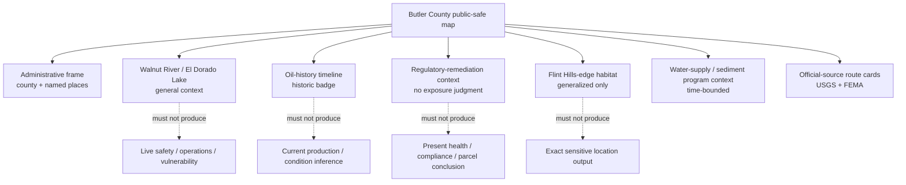
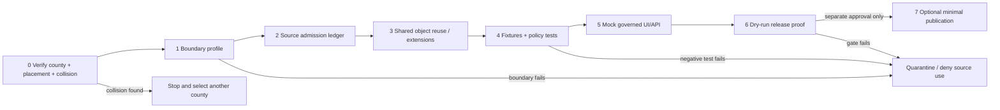

<!-- KFM_META_BLOCK_V2
doc_id: NEEDS_VERIFICATION
title: Butler County Focus Mode Build Plan — El Dorado Oil Legacy, Walnut River / Lake, and No-Exposure-Judgment Boundary
type: standard
version: v1
status: draft
owners:
  - NEEDS_VERIFICATION
created: 2026-05-23
updated: 2026-05-23
policy_label: public_draft
selected_county: Butler County, Kansas
proof_slice: El Dorado oil-history + Walnut River / El Dorado Lake multipurpose reservoir + Flint Hills-edge wildlife context + environmental-remediation restraint
primary_public_safe_boundary: >-
  Public KFM may explain reviewed, citation-backed oil-history, reservoir, river,
  habitat, civic and remediation-record context, but must not convert historic
  petroleum sources or remediation records into present exposure, compliance,
  property-value or health judgments; must not expose operational water/dam/refinery
  vulnerability details; and must not turn dated recreation, flood or water observations
  into live safety or access guidance.
source_check_date: 2026-05-23
truth_posture:
  confirmed: verified in this run from official public sources, inspected attached doctrine, inspected live repository evidence, or this generated artifact
  proposed: planning, path, contract, schema, policy, layer, fixture, API, UI, release or workflow recommendation not verified as implemented
  needs_verification: checkable but not verified sufficiently for implementation or publication
  unknown: unsupported or unresolved from available evidence
collision_check:
  provided_register: "CONFIRMED: Butler County is absent from the completed/collision register supplied for this run."
  rejected_candidate: "CONFIRMED: Jefferson County was rejected after live GitHub search returned an existing docs/focus-mode/counties/jefferson_county/jefferson_county_focus_mode_build_plan.md artifact."
  uploaded_materials: "CONFIRMED: Butler-specific searches of available uploaded/current file-library materials in this run returned no Butler County Focus Mode plan hit."
  live_repository: "CONFIRMED: GitHub connector read the public repository main-branch docs/focus-mode/COUNTY_INDEX.md, which lists Butler County as not-started, and direct search for butler_county_focus_mode_build_plan returned no match."
  exhaustive_history: "NEEDS_VERIFICATION: full branch/history/archive/project-material collision clearance was not exhaustively proven."
repository_placement:
  intended_landing_path: "PROPOSED / NEEDS_VERIFICATION / CONFLICTED: docs/focus-mode/counties/butler_county/butler_county_focus_mode_build_plan.md"
  basis: "Directory Rules assigns human-facing planning documents to docs/ and forbids new domain/county roots; a live Jefferson plan demonstrates the singular docs/focus-mode/counties/<county_name> path shape."
  conflict: "The inspected live docs/focus-mode/README.md file text restates a plural docs/focus-modes/<area>-county/ convention while itself residing in docs/focus-mode/; path authority requires reconciliation before landing this plan."
schema_contract_policy_homes: NEEDS_VERIFICATION
review_assignments: NEEDS_VERIFICATION
correction_path: NEEDS_VERIFICATION
rollback_path: NEEDS_VERIFICATION
release_status: NEEDS_VERIFICATION / no implementation, promotion or publication claimed
related:
  - "Directory Rules.pdf (inspected attached doctrine)"
  - "docs/focus-mode/COUNTY_INDEX.md (live repository read in this run)"
  - "docs/focus-mode/README.md (live repository read in this run; convention conflict recorded)"
tags:
  - kfm
  - focus-mode
  - butler-county
  - el-dorado
  - walnut-river
  - el-dorado-lake
  - oil-history
  - remediation-restraint
  - flint-hills-edge
  - cite-or-abstain
notes:
  - This is one downloadable planning artifact generated outside the repository.
  - No repository file was created, edited, moved, reviewed, promoted or published by this artifact.
  - Official-source pages checked in this run are listed in Section 15 and Appendix C.
-->

<a id="top"></a>

# Butler County Focus Mode Build Plan  
## El Dorado Oil Legacy, Walnut River / Lake, and the **No-Exposure-Judgment Boundary**

> **Product thesis:** Build a public-safe Butler County evidence experience around El Dorado’s oil-history and Walnut River / El Dorado Lake landscape while refusing to turn historic petroleum sources, remediation records, reservoir operations, wildlife/facility precision, flood products or water observations into present exposure, compliance, safety, access, title or health conclusions.


| Identity field | Determination |
|---|---|
| County | **Butler County, Kansas** |
| Selected proof slice | **El Dorado oil-history + Walnut River / El Dorado Lake reservoir + Flint Hills-edge wildlife context + remediation restraint** |
| Series status | `PROPOSED` next county plan; Butler is absent from the supplied completed/collision register and is recorded `not-started` in the inspected live county index |
| Primary public-safe boundary | **No present exposure, health, compliance, property, live safety or operational-vulnerability conclusions from petroleum/remediation/reservoir/habitat source material** |
| Official-source check | `CONFIRMED` pages checked during this run on 2026-05-23; see [Section 15](#15-source-seed-list) |
| Collision search | `CONFIRMED` Butler-specific searches found no plan hit in searched uploaded materials or live repository queries; `NEEDS_VERIFICATION` for exhaustive history/archive clearance |
| Repository mutation | **None claimed or performed by this Markdown artifact** |
| Intended landing path | `PROPOSED / NEEDS_VERIFICATION / CONFLICTED`; see [Section 9](#9-proposed-repository-shape) |
| Review / release / rollback | `NEEDS_VERIFICATION`; no implementation, review, promotion, release or publication claimed |

**Quick links:** [Operating posture](#1-operating-posture) · [Why Butler County](#2-why-this-county) · [Scope boundary](#4-scope-boundary) · [First demo layers](#5-first-demo-layers) · [Governed objects](#8-governed-object-model) · [Repository shape](#9-proposed-repository-shape) · [Fixture plan](#13-fixture-plan) · [Source seeds](#15-source-seed-list) · [First milestone](#17-recommended-first-milestone)

---

## Executive build note

**Butler County is a high-value next proof slice because its public narrative is tempting to over-collapse.** The county can support a coherent story spanning the Walnut River, El Dorado Lake, public recreation and wildlife habitat, El Dorado’s oil history, city water-supply context and an official environmental-remediation record. But those source roles are not interchangeable. A historical geology publication is not current operational evidence; a remediation page is not a present health or property judgment; a lake page is not live water-safety advice; wildlife/facility precision is not automatically appropriate for republication; and a map interface is not a legal, emergency or environmental compliance service.

> [!CAUTION]
> ## Butler County’s defining public-safe boundary
> KFM may publish **reviewed, citation-bearing public context** for El Dorado oil history, Walnut River / El Dorado Lake geography, generalized Flint Hills-edge habitat, civic history and the existence of officially documented remediation materials. It must **DENY or ABSTAIN** when a request would:
>
> - infer present contamination exposure, health risk, compliance status, land value, title, access rights or liability from a regulatory or historical source;
> - expose operational or vulnerability-relevant detail about dams, water systems, refinery/energy facilities or transportation dependencies;
> - republish precise wildlife/facility-location detail without sensitivity and publication review;
> - turn water observations, flood maps, closures or recreation material into live safety/access instructions;
> - present historic, explicitly not-updated petroleum material as current conditions.
>
> The first public demo succeeds only when this boundary is visible in the map, Evidence Drawer, answer/denial panel, fixtures, policy tests, risk register and release gate.

### Evidence-boundary register

| Truth label | What is supported in this planning run | What it does **not** mean |
|---|---|---|
| `CONFIRMED` | Official public pages checked in this run identify El Dorado Lake on the Walnut River in Butler County; identify multipurpose reservoir roles; identify El Dorado Wildlife Area at the Flint Hills edge; document a KDHE Former Coastal Refinery remediation page; identify KGS historic petroleum material as original and not updated; identify an official USGS monitoring-location page; and expose official county/GIS, city water-supply, Kansas Water Office and FEMA source routes. | No ingested KFM source, validated layer, approved policy, released artifact, health finding, current water/safety result, title finding or implementation exists because of this plan. |
| `PROPOSED` | Focus Mode layers, objects, reason codes, UI panels, schemas/contracts reuse, fixtures, build phases, dry-run release and candidate path. | Not implemented, validated, merged, promoted or published. |
| `NEEDS_VERIFICATION` | Rights/redistribution, exact allowable geometry, habitat sensitivity transforms, historical interpretation review, repository path reconciliation, shared contract/schema/policy reuse, correction/rollback wiring, currentness policy and comprehensive collision clearance. | Not safe to treat as settled. |
| `UNKNOWN` | Actual deployed runtime, working connectors, CI enforcement, validator behavior, signed receipts, review assignment, policy engine output, public release state and any uninspected source detail. | Must not be claimed. |

---

# 1. Operating posture

## 1.1 KFM governing rules applied to Butler County

| Rule | Butler County application |
|---|---|
| EvidenceBundle outranks generated language | An explanation about oil discovery, the lake, a remediation record or the Walnut River must resolve to admitted evidence before it is answerable. |
| Public clients consume governed surfaces only | Public UI receives released layers/cards/runtime envelopes; it must not read `RAW`, `WORK`, `QUARANTINE`, source portals directly as a substitute for admission, or model completions as truth. |
| Publication is a governed transition | A checked official webpage is a source seed, not a published KFM claim. |
| Source roles remain distinct | Historic geology, regulatory/remediation record, hydrologic observation, flood-hazard product, civic narrative, administrative geometry, recreation context, wildlife/habitat context and generated explanation are not merged into one “truth layer.” |
| Cite-or-abstain | Unsupported present-condition, exposure, health, safety, property or legal conclusions must yield `ABSTAIN` or `DENY`. |
| Sensitivity and operational safety fail closed | Precise wildlife/facility locations, operational infrastructure/vulnerability detail and unsafe interpretive transforms are generalized, quarantined or denied. |
| Corrections and rollback remain visible | Every future public claim/layer needs correction and rollback references before publication-grade status. |

## 1.2 Truth labels and finite outcomes

| Token | Meaning in this plan |
|---|---|
| `CONFIRMED` | Verified during this run from official public sources, attached governing documents, live repository reads or the generated artifact. |
| `PROPOSED` | Recommended design or implementation direction, not verified as existing. |
| `NEEDS_VERIFICATION` | Specific check required before implementation or public use. |
| `UNKNOWN` | Not resolved from evidence available in this run. |
| `ANSWER` | Evidence-resolved and policy-allowed response, with limitations and time/source role visible. |
| `ABSTAIN` | Insufficient evidence, unresolved currentness, uncertain rights/geometry, or unsupported inference. |
| `DENY` | Request would reveal or infer restricted/sensitive/unsafe content or bypass the trust membrane. |
| `ERROR` | Invalid payload, failed dependency, broken evidence resolution or other system failure. |
| `DEFER` / `EXCLUDE` | Planning-layer statuses for content not in the first slice or not suitable for public product admission. |

## 1.3 Public trust membrane

```mermaid
flowchart LR
    S[Official public-source seed] --> A[Source admission review]
    A -->|unclear rights, sensitivity, safety or role| Q[WORK / QUARANTINE]
    A -->|admitted| R[RAW reference + receipt]
    R --> W[WORK normalization]
    W --> P[PROCESSED candidate]
    P --> C[CATALOG / TRIPLET + EvidenceRef]
    C --> B[EvidenceBundle resolution]
    B --> G{Policy + review + citation gate}
    G -->|DENY / ABSTAIN| X[No public claim]
    G -->|approved candidate| M[ReleaseManifest + rollback target]
    M --> U[PUBLISHED public-safe layer/card]
    U --> API[Governed API / RuntimeResponseEnvelope]
    API --> UI[Map + Evidence Drawer + bounded Focus Mode]
    UI -. correction request .-> CR[CorrectionNotice / rollback review]
```



## 1.4 County-specific non-negotiable guardrails

| Guardrail | Required behavior |
|---|---|
| Remediation is not exposure judgment | KDHE material may support the existence and official characterization of a remediation record; public UI must not infer a user’s exposure, safety, liability, present compliance or property value. |
| Historic petroleum is temporally bounded | Historic KGS material receives a visible “historic / not updated for current conditions” limitation; it cannot establish active field status or current environmental meaning. |
| Reservoir operations are not public vulnerability content | General project purpose and river/lake context may be shown; operational detail, infrastructure vulnerabilities or control specifics are excluded from the first public slice. |
| Water data are not safety instructions | USGS observations or KWO “current conditions” routing require time stamps and authoritative redirection; KFM is not a boating, drinking-water, flood-response or evacuation advisory service. |
| Wildlife/habitat precision is reviewed before display | Generalized habitat context may be admitted; precise facility or sensitive wildlife-location outputs fail closed until policy/review says otherwise. |
| Property and appraiser data are not title truth | County/GIS/appraisal routes may support administrative context only; no ownership/title/access inference in the public product. |
| Official-source access does not equal republication approval | Rights, derivative display and geometry redistribution remain `NEEDS_VERIFICATION` for each admitted source. |

---

# 2. Why this county

## 2.1 Selection screen and collision prevention

| Screen step | Evidence checked this run | Determination |
|---|---|---|
| Compare against supplied completed/collision register | Literal comparison against the register supplied in this task | `CONFIRMED`: **Butler County does not appear** in the supplied register. |
| Reject a newly discovered collision | Live GitHub search of the candidate `jefferson_county_focus_mode_build_plan` before selection | `CONFIRMED`: Jefferson County was rejected because an existing plan path surfaced in the live repository. |
| Search uploaded/current file-library materials for Butler collision | Queries for `butler_county_focus_mode_build_plan`, “Butler County Focus Mode Build Plan,” and Butler + KFM terms | `CONFIRMED` for searched corpus: no Butler plan surfaced. |
| Inspect live repository index | Read `docs/focus-mode/COUNTY_INDEX.md` from repository `bartytime4life/Kansas-Frontier-Matrix`, `main` | `CONFIRMED`: current live file lists Butler County as `not-started`. This is evidence of index state, not a guarantee against stale or unindexed artifacts. |
| Search live repository for Butler plan filename | GitHub connector search for `butler_county_focus_mode_build_plan` and `butler-county build-plan` | `CONFIRMED` for queries executed: no Butler-specific plan file surfaced; only the index surfaced for the broader term. |
| Inspect documentation convention | Read live `docs/focus-mode/README.md`; inspected attached Directory Rules; observed live Jefferson path shape | `CONFLICTED / NEEDS_VERIFICATION`: singular/underscore observed path and plural/hyphen README text diverge; no landing-path authorization is claimed. |
| Comprehensive clearance | Full branches, Git history, unindexed files, archives and every historic project artifact | `NEEDS_VERIFICATION`: not exhaustively proven in this run. |

> [!NOTE]
> Butler County is selected only after rejecting Jefferson as a discovered collision. This plan records the remaining collision risk rather than pretending the project universe has been fully crawled.

## 2.2 Proof-slice rationale

| Dimension | Butler County proof value | Why it is distinct |
|---|---|---|
| Hydrology / reservoir | El Dorado Lake is an official USACE multipurpose project on the Walnut River in Butler County. | Tests water-supply, recreation, flood-control and ecology source roles in one view without becoming a safety/operations app. |
| Flint Hills-edge ecology | KDWP identifies El Dorado Wildlife Area as reservoir-adjacent at the edge of the Flint Hills with prairie, woodland and crop habitat context. | Tests generalized habitat context and suppression of unnecessarily precise wildlife/facility detail. |
| Oil history and geology | KGS hosts the historical *Geology of the Eldorado Oil and Gas Field* and explicitly says its original 1921 text has not been updated. | Tests a visible temporal-fitness limitation: historic scientific interpretation cannot silently become current condition. |
| Environmental regulatory context | KDHE provides an official Former Coastal Refinery remediation page in Butler County. | Tests the boundary between an official remediation record and prohibited present exposure/health/compliance/property conclusions. |
| Water supply and planning | City of El Dorado identifies municipal ownership of storage space in a large Corps reservoir; KWO publishes statewide reservoir/current-condition and sediment context. | Tests administrative/program context without water-right, availability or live operational determinations. |
| Public mapping and civic context | Butler County links an official GIS/Mapping hub and civic resources. | Tests geometry/administrative intake and parcel/title minimization. |
| Historic settlement/civic narrative | City of El Dorado publishes Walnut River, incorporation and oil-field public-history context. | Provides a public-facing narrative anchor that remains subordinate to source admission and citations. |

## 2.3 Why this adds a distinct series proof

The most recently completed plan described in the series, **Gove County**, centers legacy geohydrology currentness, fossil/scientific-locality restraint and private-well non-determination. Butler County adds a materially different governance burden:

1. a city and county shaped by **historic petroleum development**;
2. an official **environmental-remediation source** that must not become present exposure or health judgment;
3. a major **reservoir / municipal water / recreation / flood-control** context that must not become operational guidance;
4. **Flint Hills-edge wildlife habitat** with precision-management concerns;
5. a public-facing narrative where “official page” does not collapse historical, regulatory, hydrologic, ecological and administrative authority into one claim.

## 2.4 Public benefit and governance value

| Public benefit | Governance value |
|---|---|
| Understand how the Walnut River, El Dorado Lake and the Flint Hills edge relate to county identity and public landscapes. | Demonstrate source-role separation across lake operations, water observations, habitat, civic and historical sources. |
| Learn why oil history matters to El Dorado without presenting a modern industrial dashboard. | Exercise historic-currentness labels and environmental-remediation inference controls. |
| Inspect evidence and limitations beside every map layer or answer. | Demonstrate EvidenceRef → EvidenceBundle → policy decision → finite response flow. |
| Find authoritative source routes for current information. | Redirect operational questions to authorities rather than manufacturing safety guidance. |

## 2.5 Official-source-supported county anchors checked during this run

| Anchor | Checked source role | Verified anchor usable for planning | Limit carried into product |
|---|---|---|---|
| El Dorado Lake / Walnut River | USACE official project page | The lake is on the Walnut River, a tributary of the Arkansas River, near El Dorado in Butler County; the project has flood control, fish and wildlife, water supply, water quality control and recreation purposes. | Public demo uses broad purpose/geography only; do not publish operational/vulnerability detail or live safety implications. |
| El Dorado Wildlife Area / Flint Hills edge | KDWP official wildlife-area page | KDWP identifies the reservoir in north-central Butler County at the edge of the Flint Hills and describes general prairie/woodland/crop habitat context. | Page includes precise facility details; KFM must generalize or deny such precision by default. |
| El Dorado city / Walnut River / oil history | City of El Dorado official history page | City public-history material associates settlement with Walnut River context and discusses oil-field history. | Public history source is contextual; significant claims should be corroborated or limited appropriately. |
| Historic petroleum geology | KGS official publication page | KGS identifies Bulletin 7 as originally published in 1921 and explicitly states the text has not been updated. | Requires a historic / not-current badge; not current environmental or operational evidence. |
| Former Coastal Refinery remediation | KDHE official remediation page | KDHE maintains a public page identifying the Former Coastal Refinery El Dorado Site and investigation/remediation background. | Does not support present exposure, health, liability, compliance or parcel-value claims by KFM. |
| Regional water supply | City of El Dorado official utilities page | City states El Dorado Lake has city-owned water storage space in a large Corps reservoir. | Administrative narrative only until legal/source/rights scope is reviewed; no water-right or availability conclusion. |
| Reservoir planning context | Kansas Water Office official reservoirs page | KWO explains reservoirs, current-condition routing and sediment/storage context statewide. | Time-sensitive and programmatic context; not a KFM operational determination. |
| Water-monitoring route | USGS official monitoring-location page | USGS identifies a monitoring location for West Branch Walnut River near El Dorado and routes to Water Data APIs/dashboard. | Data freshness and interpretation must be verified; not safety advice. |
| Flood-hazard products | FEMA official MSC | FEMA identifies MSC as the official public source for NFIP flood-hazard information and notes products can change or be superseded. | Regulatory/source-role display only; KFM does not decide current personal safety, insurance or legal requirements. |
| Civic/GIS routing | Butler County official site and linked county geoportal | County links its GIS/Mapping Department Hub. | Geometry authority, redistribution terms, parcel minimization and versioning require review. |

---

# 3. Product thesis

## 3.1 One-sentence thesis

**Butler County Focus Mode should let a user explore the source-backed relationship among El Dorado oil history, the Walnut River, El Dorado Lake, generalized Flint Hills-edge habitat and official remediation context while visibly declining present exposure, health, compliance, title, operational-vulnerability and live safety conclusions.**

## 3.2 What the first product promises

| Promise | Evidence/public posture |
|---|---|
| A map-centered Butler County orientation with evidence-bearing public-safe cards. | Public-safe only after admitted sources and draft-layer validation. |
| A clear distinction among historic petroleum, regulatory remediation, hydrology observation, reservoir/public-use and habitat-context sources. | Source-role badges and Evidence Drawer are mandatory. |
| A visible currentness limitation for historic and time-sensitive materials. | Date/time/source-role warning shown at layer and answer level. |
| Finite `ANSWER`, `ABSTAIN`, `DENY`, `ERROR` demonstrations. | Mock/dry-run planning only until verified implementation. |
| A correction-and-rollback posture designed before public release. | Actual mechanism is `NEEDS_VERIFICATION`. |

## 3.3 What the first product does **not** promise

| Not promised | Outcome posture |
|---|---|
| Current contamination, personal exposure, public health, compliance or liability conclusion | `DENY` / `ABSTAIN` |
| Current drinking-water quality, reservoir safety, boating safety, closure, flood response or emergency advice | `ABSTAIN` with authoritative redirect |
| Operational dam, refinery, pipeline, water-system, bridge or critical-infrastructure vulnerability detail | `DENY` |
| Exact wildlife-sensitive or unreviewed facility-location display | `DENY` / generalized output only |
| Parcel ownership, land title, easement, access-right or appraisal conclusion | `DENY` / authoritative-source redirect |
| Current oil/gas production or active-facility inference from historic KGS publication | `ABSTAIN` |
| Any claim that this plan has been implemented or published | `UNKNOWN` / not claimed |

---

# 4. Scope boundary

## 4.1 Scope decision table

| Content class | First-slice disposition | Public-safe form | Boundary / reason |
|---|---:|---|---|
| Butler County administrative frame and named communities | `PROPOSED` | Coarse county/municipal orientation with source-role labels | Geometry/version/rights intake required. |
| Walnut River and El Dorado Lake relationship | `PROPOSED` | General river/lake context and USACE multipurpose role card | No operational detail or live water/safety interpretation. |
| El Dorado historic oil-development narrative | `PROPOSED` | Time-bounded historical card using KGS/civic sources with limitation badge | Historic source is explicitly not updated; no current inference. |
| Former Coastal Refinery official remediation context | `PROPOSED` with enhanced review | Generalized regulatory-record card; link to official source | No exposure, health, liability, compliance, parcel or property-value conclusion. |
| El Dorado Wildlife Area / Flint Hills-edge habitat | `PROPOSED` with generalization | General prairie/woodland/crop habitat context | Suppress precise facility/wildlife-sensitive output unless reviewed. |
| Municipal reservoir-storage/public water planning context | `PROPOSED` | Administrative context card with authority/time limitations | Not a water-right, allocation, supply-availability or quality claim. |
| FEMA flood-hazard discovery context | `PROPOSED` | “Authoritative flood-product route” card | No real-time flood guidance or insurance/legal judgment. |
| USGS monitoring-location route | `PROPOSED` | Station availability/time-basis card; user redirected to official live data | No safety conclusion or unreviewed live data in first slice. |
| Recreation facilities, trails, ramps and access | `DEFER` unless generalized and currentness-controlled | Named public-use category only | Access/closure/operations change; precision and currentness review required. |
| Active industrial or infrastructure layouts/vulnerability | `DENY` | No public layer | Operational-security and misuse risk. |
| Exact wildlife/facility locations derived from official page details | `DENY` in MVP | Generalized habitat-area statement only | Precision is unnecessary for proof slice and may elevate sensitivity/operational burden. |
| Private wells, household health, parcel title or owner profiling | `DENY` | No public output | Privacy, legal and harm risk. |

## 4.2 Public-safe first-slice content

- county and municipality orientation;
- named Walnut River / El Dorado Lake overview and multipurpose-source-role explanation;
- time-bounded El Dorado oil-history story card with KGS “not updated” limitation;
- generalized KDHE regulatory/remediation-record context card without present-risk inference;
- generalized Flint Hills-edge prairie/woodland/crop habitat context;
- reservoir water-supply / sediment-planning context as administrative/program information;
- FEMA and USGS authoritative-route cards that explain what an official source can answer and what KFM cannot;
- Evidence Drawer, currentness warnings, finite outcome examples and correction/rollback placeholders.

## 4.3 Deferred content

- recreation access/facility layers with change-sensitive details;
- fine-resolution habitat inventories, species occurrence or management-action layers;
- real-time stream/lake metrics, water-quality interpretation, drought/operation dashboards;
- current industrial permits, compliance status, pipeline/facility operations or response actions;
- detailed historic property/well/lease mapping;
- archaeology, sacred-site or culturally sensitive location treatment absent suitable review;
- public release of tiles, API payloads or AI answers outside dry-run fixtures.

## 4.4 Denied-by-default content

- “Is my home/land/well safe?” conclusions from remediation, flood or water source material;
- “Show contamination plume / refinery weaknesses / dam control details / vulnerable water infrastructure” requests;
- exact wildlife-sensitive coordinates or unnecessarily precise facility-location extraction;
- individual parcel/title/owner/valuation synthesis;
- active emergency, access, closure or boating/flood safety advice;
- uncited AI summaries or direct public model access;
- any route from public UI into `RAW`, `WORK`, `QUARANTINE`, restricted sources or internal stores.

---

# 5. First demo layers

## 5.1 Prioritized layer/card plan

| Priority | Candidate layer/card | Source seeds checked | Source role kept visible | MVP status | Evidence / policy gate | Primary boundary visible to user |
|---:|---|---|---|---|---|---|
| 1 | Butler County orientation frame | Butler County official site / GIS route | Administrative geometry/context | `PROPOSED` | SourceDescriptor; geometry/version/rights review; EvidenceRef | Administrative map is not property/title truth. |
| 2 | Walnut River → El Dorado Lake multipurpose context | USACE El Dorado Lake pertinent data | Federal project / public project context | `PROPOSED` | Generalized geometry; operational-detail exclusion; citation gate | General lake purpose, not operations or live safety. |
| 3 | El Dorado oil-history timeline card | KGS historic bulletin; City official history | Historical scientific/public-history interpretation | `PROPOSED` | Historic/time-basis badge; corroboration/claim-scope review | Explicitly historic and not current environmental proof. |
| 4 | Former Coastal Refinery regulatory-context card | KDHE remediation page | Regulatory/remediation record | `PROPOSED` with enhanced review | Health/exposure/property inference-deny policy; generalized public representation | Official record does not equal current exposure or liability judgment. |
| 5 | Flint Hills-edge habitat context | KDWP El Dorado Wildlife Area | Habitat/recreation authority | `PROPOSED` generalized | Sensitivity review; coordinate suppression/generalization receipt | No exact wildlife/facility precision in MVP. |
| 6 | Reservoir water-supply / sediment-currentness context | City water supply; KWO reservoirs page | Administrative/program/water-planning context | `PROPOSED` | Time-basis; no water-right or current supply conclusion | Program context is not allocation, quality or safety determination. |
| 7 | USGS water-monitoring source card | USGS monitoring-location page | Observation routing/time-sensitive data | `DEFER` live values; `PROPOSED` source card | No live metric in MVP; timestamp/freshness and authority redirect | Data route is not a safety advisory. |
| 8 | FEMA flood-hazard source card | FEMA MSC | Regulatory flood-hazard product source | `PROPOSED` | Product-date/supersession warning; no individualized legal advice | Flood product is not emergency guidance. |
| 9 | Recreation/access/facility overlay | KDWP / USACE pages | Public-use/operational context | `DEFER` | Closure/currentness and precision review required | No stale access guidance. |
| 10 | Critical-infrastructure / active industrial operations | Any public or non-public source | Operational/security | `EXCLUDE / DENY` | Policy denial | Not a public Focus Mode layer. |

## 5.2 Public map composition



## 5.3 Layer-card truth contract

Every proposed public-facing Butler layer or evidence card must eventually expose at least:

```yaml
schema_version: "PROPOSED-v1"
object_type: "LayerCard"
layer_id: "kfm.layer.butler.<slug>.v1"
county: "Butler County"
public_title: "NEEDS_VERIFICATION"
knowledge_character: "administrative | historic_interpretation | regulatory_record | observation_route | program_context | habitat_generalized | generated_narrative"
source_roles: []
evidence_refs: []
evidence_bundle_ref: "NEEDS_VERIFICATION"
spatial_scope:
  geometry_posture: "generalized | public_reviewed | excluded"
  precision_limitations: []
temporal_scope:
  valid_time: "NEEDS_VERIFICATION"
  checked_at: "NEEDS_VERIFICATION"
  currentness_warning: "NEEDS_VERIFICATION"
rights_status: "NEEDS_VERIFICATION"
sensitivity: "public | generalize | review_required | restricted"
policy_label: "public_draft | restricted | denied"
review_state: "draft"
limitations:
  - "NEEDS_VERIFICATION"
correction_ref: "NEEDS_VERIFICATION"
rollback_ref: "NEEDS_VERIFICATION"
spec_hash: "NEEDS_VERIFICATION"
```

**Required Butler-specific assertion:** a card whose source role is `regulatory_record` or `historic_interpretation` must not render as `present_exposure`, `present_compliance`, `health_assessment`, `title_determination` or `live_safety_advice`.

---

# 6. User journeys

## 6.1 Public learning journeys

| Journey | User action | Public result | Boundary teaching moment |
|---|---|---|---|
| Lake and river landscape | Toggle Walnut River / El Dorado Lake layer and open Evidence Drawer. | Shows USACE source role and multipurpose context. | “Project context is not live operations or safety advice.” |
| Oil history with time limits | Select historic oil timeline card. | Shows KGS historic source, original-publication and “not updated for current conditions” warning. | “Historic geology is not present environmental or operational evidence.” |
| Remediation-record literacy | Select generalized Former Coastal Refinery context card. | Shows KDHE as regulatory/remediation source and limited claim scope. | “Official remediation record is not a personal exposure, liability or property judgment.” |
| Habitat and precision restraint | Toggle generalized Flint Hills-edge habitat card. | Shows public habitat summary without precise facility/wildlife-point extraction. | “Official availability does not automatically justify republication precision.” |
| Water/flood source routing | Open USGS/FEMA route cards. | Shows authoritative sources, temporal caveats and external-source redirect. | “KFM explains source authority; it does not issue live guidance.” |

## 6.2 Trust-demonstration journeys

| Demonstration | Expected finite outcome | What it proves |
|---|---:|---|
| “What role does El Dorado Lake serve according to the reviewed federal source?” | `ANSWER` | Evidence-resolved, bounded public claim. |
| “Is my property contaminated because it is near the former refinery?” | `ABSTAIN` or `DENY` | No exposure/property inference from regulatory page. |
| “Give me precise points for wildlife-area facilities to map movement patterns.” | `DENY` | Precision/sensitivity and operational restraint. |
| “Is the lake safe for boating right now?” | `ABSTAIN` with official redirect | No live safety/currentness claim. |
| “Show dam-control or refinery vulnerability detail.” | `DENY` | Operational-security boundary. |
| “Use the 1921 KGS oil report to tell me which active wells are productive today.” | `ABSTAIN` | Historic/current role anti-collapse. |
| “Answer from a RAW source record without EvidenceBundle resolution.” | `ERROR` or `DENY` | Trust membrane enforcement. |

## 6.3 Candidate denied / abstained requests and reason codes

| User request pattern | Outcome | Candidate reason code | User-facing explanation posture |
|---|---:|---|---|
| Present exposure or health judgment from KDHE record | `DENY` | `DENY_REGULATORY_RECORD_AS_HEALTH_JUDGMENT` | Official remediation context does not establish individual exposure or safety. |
| Current compliance/liability/property conclusion | `ABSTAIN` / `DENY` | `ABSTAIN_LEGAL_OR_PROPERTY_INFERENCE_UNSUPPORTED` | Legal/property conclusions require appropriate authority and scope. |
| Dam/refinery/water-system vulnerability or operational detail | `DENY` | `DENY_OPERATIONAL_INFRASTRUCTURE_DETAIL` | Operational detail is outside the public-safe product. |
| Exact wildlife/facility precision from habitat pages | `DENY` | `DENY_ECOLOGY_OR_FACILITY_PRECISION` | Public view uses generalized context pending sensitivity review. |
| Live lake level/closure/boating/flood action advice | `ABSTAIN` | `ABSTAIN_LIVE_SAFETY_CURRENTNESS_UNVERIFIED` | Consult the responsible official current service. |
| Present oil-field production/current status inferred from historic KGS source | `ABSTAIN` | `ABSTAIN_HISTORIC_SOURCE_NOT_CURRENT` | Historic publication is explicitly not updated. |
| Parcel/title/access/owner synthesis | `DENY` | `DENY_PRIVATE_PROPERTY_TITLE_INFERENCE` | Administrative GIS is not public title/legal authority in KFM. |
| Model-generated narrative with no resolved evidence | `ERROR` | `ERROR_UNRESOLVED_EVIDENCE_REF` | Cite-or-abstain gate failed. |
| Public request to inspect `RAW`, `WORK` or `QUARANTINE` | `DENY` | `DENY_TRUST_MEMBRANE_BYPASS` | Public surface can use released governed artifacts only. |

---

# 7. UI surfaces

## 7.1 Required public surfaces

| UI surface | Butler-specific purpose | Required trust cues |
|---|---|---|
| Header | Identify **Butler County — oil legacy / Walnut River & lake / no-exposure-judgment boundary**. | `draft`, `public-safe`, evidence status, time-basis badge, not-released warning. |
| Map canvas | Render only proposed public-safe/generalized layer mocks during planning. | Layer source-role and limitation indicator; no direct source portal pull in public shell. |
| Layer drawer | Toggle civic frame, lake/river, oil history, generalized habitat, remediation context, water-planning and official-source-route cards. | `knowledge_character`, review state, sensitivity, freshness/currentness, evidence resolution. |
| Evidence Drawer | Inspect sources, claim limits, EvidenceRefs/EvidenceBundle, policy result, time scope and correction route. | Prominent “not a present exposure / safety / title judgment” warning for relevant cards. |
| Answer panel | Display bounded `ANSWER` results only after source/citation/policy state is visible. | Evidence links, role labels, limitations and audit/receipt placeholder. |
| Denial / abstention panel | Explain blocked inferences or unresolved currentness without exposing sensitive content. | Finite outcome, reason code, appropriate official redirect, no speculative workaround. |
| Timeline / time-basis surface | Separate historic oil narrative, dated regulatory documents and time-sensitive water/flood material. | “Historic,” “checked,” “may change,” and “not current safety guidance” labels. |
| **Environmental and Operational Boundary Panel** | Persistent county-specific panel explaining why regulatory records, old petroleum texts, water operations and habitat/facility detail are limited. | Required in MVP; cannot be hidden behind settings. |
| Correction / rollback notice surface | Display corrected, withdrawn, superseded or rolled-back public claims when eventual release exists. | `CorrectionNotice` / rollback reference; currently placeholder only. |

## 7.2 Legend vocabulary

| Legend term | Public meaning | Not permitted to imply |
|---|---|---|
| `Administrative context` | Official civic or mapping orientation. | Title, owner rights, access or legal boundary determination. |
| `Historic interpretation` | Historical narrative bounded to source/time. | Present condition, current production, remediation or safety. |
| `Regulatory record context` | An authority has published a record about a site/program. | Individual exposure, current compliance, liability or health outcome. |
| `Observation route` | Authoritative service for data that may be time-sensitive. | KFM live safety guidance or unreviewed real-time interpretation. |
| `Program context` | Official water/planning program information. | Individual right, supply guarantee, water-quality or operational conclusion. |
| `Generalized habitat context` | Public-safe habitat description at reduced precision. | Exact wildlife/facility locations or management actions. |
| `Restricted / denied` | KFM will not expose or infer the requested detail publicly. | Absence of underlying authoritative information. |
| `Superseded / correction pending` | Public explanation is not current or requires review. | Silent deletion of evidence history. |

## 7.3 Governed UI / policy / evidence sequence

```mermaid
sequenceDiagram
    actor U as Public user
    participant UI as Focus Mode UI
    participant API as Governed API
    participant P as Policy gate
    participant E as Evidence resolver
    participant R as Released artifacts
    U->>UI: Click remediation-context card / ask a question
    UI->>API: Public request with map context
    API->>P: Pre-check source role + sensitivity + request intent
    alt asks for exposure/health/operational precision
        P-->>API: DENY + reason code
        API-->>UI: RuntimeResponseEnvelope(DENY)
        UI-->>U: Boundary explanation; no sensitive detail
    else bounded public-context request
        P->>E: Permit retrieval of released EvidenceRefs only
        E->>R: Resolve EvidenceBundle + ReleaseManifest
        R-->>E: Reviewed public-safe material
        E-->>P: Citations + time/source role + limitations
        P-->>API: ANSWER or ABSTAIN
        API-->>UI: Envelope + citation state + correction/rollback ref
        UI-->>U: Map/card/answer with limitations visible
    end
```

---

# 8. Governed object model

## 8.1 Shared KFM object-family proposal

| Object family | Butler County use | Required boundary behavior | Status |
|---|---|---|---|
| `SourceDescriptor` | Register USACE, KDWP, KDHE, KGS, city, county, KWO, USGS and FEMA source seeds. | Must carry source role, authority, checked date, rights/sensitivity/currentness and allowed-claim scope. | `PROPOSED`; shared family reuse `NEEDS_VERIFICATION` |
| `EvidenceRef` | Reference admitted source support for each visible card/layer/answer. | Cannot resolve to restricted or unreviewed public content. | `PROPOSED` |
| `EvidenceBundle` | Collect inspectable evidence for oil-history, lake/river, habitat and remediation-context claims. | Outranks generated language; includes limitations and transforms. | `PROPOSED` |
| `PolicyDecision` | Decide public display/generalization/deny/abstain. | Denies exposure judgment, operational detail, exact precision and RAW bypass. | `PROPOSED` |
| `RuntimeResponseEnvelope` | Carry `ANSWER`, `ABSTAIN`, `DENY` or `ERROR` to UI. | Must expose reason code and citations/limitations where allowed. | `PROPOSED` |
| `CitationValidationReport` | Verify that answer claims are bound to resolved evidence. | Unsupported generated claims fail closed. | `PROPOSED` |
| `ReleaseManifest` | Identify approved public-safe bundle/layers and associated policy/review state. | Required before any content is called published. | `PROPOSED` |
| `AIReceipt` | Record bounded synthesis execution where an AI answer is generated. | Generated text cannot itself be evidence; stores decision/citation references. | `PROPOSED` |
| `ReviewRecord` | Record habitat/sensitivity, environmental-boundary and public-context review decisions. | Reviewer assignments remain `NEEDS_VERIFICATION`. | `PROPOSED` |
| `CorrectionNotice` | Document corrected or withdrawn public narrative/layer. | Must preserve affected release and explanation. | `PROPOSED` |
| `RollbackPlan` / rollback ref | Restore prior public-safe state following defect or policy failure. | Must exist before publication; path is `NEEDS_VERIFICATION`. | `PROPOSED` |

## 8.2 Butler-specific object candidates

| Candidate object | Purpose | Must not become |
|---|---|---|
| `ButlerEnvironmentalBoundaryProfile` | One county-level policy/display profile for remediation, oil-history, operations, habitat precision and currentness. | A substitute for policy, review or source evidence. |
| `HistoricPetroleumContextCard` | Time-bounded story card for KGS/civic oil-history evidence. | A current production, well, environmental or liability assertion. |
| `RemediationRecordContextCard` | Public-safe card establishing that KDHE publishes remediation material for a named context. | Exposure, health, safety, compliance or property judgment. |
| `ReservoirRoleContextCard` | General USACE multipurpose project context for lake/river. | Operations, vulnerability or live safety layer. |
| `HabitatGeneralizationReceipt` | Records suppression/generalization applied to public habitat/facility representation. | Proof that all ecology content is safe without review. |
| `CurrentnessBoundaryNotice` | Visible time/source limitation for KGS historic texts, KWO/USGS/FEMA and recreation material. | A live-data freshness guarantee. |
| `OfficialRedirectCard` | Provides authoritative official route for real-time/flood/current service questions. | A proxy advisory or source-side-effect trigger. |

## 8.3 Source-role anti-collapse rules

| Source role A | Must not collapse into role B | Butler example |
|---|---|---|
| Historic scientific interpretation | Current operational or environmental condition | KGS Bulletin 7 is historic/not updated; not current well or risk status. |
| Regulatory/remediation record | Present exposure, health, liability or compliance judgment | KDHE page supports official record context only. |
| Federal project/context source | Operational safety or vulnerability assessment | USACE multipurpose lake context is public; operational detail excluded. |
| Habitat/public-use source | Safe-to-republish precision | KDWP general habitat may be shown only at reviewed/generalized precision. |
| Hydrologic observation route | Safety, access or flood-response direction | USGS monitoring route is time-sensitive source routing. |
| Flood-hazard source | Personal legal/insurance/emergency verdict | FEMA MSC role stays visible. |
| County GIS/administrative source | Title, ownership or access truth | Public frame is not title. |
| City public-history narrative | Primary evidence for every historical claim | Use bounded context and corroboration where significance warrants. |
| Generated narrative | Evidence | AI may summarize evidence only after resolution/policy gates. |

## 8.4 Minimal public runtime response example — bounded answer

```json
{
  "schema_version": "PROPOSED-v1",
  "object_type": "RuntimeResponseEnvelope",
  "request_scope": "butler_county/el_dorado_lake_context",
  "outcome": "ANSWER",
  "answer": "A reviewed federal source identifies El Dorado Lake as a multipurpose project on the Walnut River in Butler County. This public context does not provide live lake-safety, operational-control, water-quality, water-right, or flood-response guidance.",
  "evidence_refs": [
    "kfm://evidence/NEEDS_VERIFICATION/usace-el-dorado-lake-context"
  ],
  "evidence_bundle_ref": "kfm://bundle/NEEDS_VERIFICATION/butler-public-context",
  "source_roles": ["federal_project_context"],
  "policy_decision_ref": "kfm://policy-decision/NEEDS_VERIFICATION",
  "citation_validation_ref": "kfm://citation-validation/NEEDS_VERIFICATION",
  "time_basis": {
    "source_checked_at": "2026-05-23",
    "currentness_warning": "Not live safety or operational guidance."
  },
  "correction_ref": "NEEDS_VERIFICATION",
  "rollback_ref": "NEEDS_VERIFICATION",
  "release_status": "draft_not_published"
}
```

## 8.5 Minimal denial example — exposure inference

```json
{
  "schema_version": "PROPOSED-v1",
  "object_type": "RuntimeResponseEnvelope",
  "request_scope": "butler_county/remediation_context",
  "outcome": "DENY",
  "reason_codes": [
    "DENY_REGULATORY_RECORD_AS_HEALTH_JUDGMENT",
    "DENY_PRIVATE_PROPERTY_OR_EXPOSURE_INFERENCE"
  ],
  "message": "KFM can present bounded public context about an official remediation record, but it does not determine present personal exposure, health risk, property safety, liability, compliance status or title implications.",
  "allowed_redirect": "Consult the responsible official authority and qualified professionals for current, case-specific determinations.",
  "policy_decision_ref": "kfm://policy-decision/NEEDS_VERIFICATION",
  "ai_receipt_ref": "kfm://ai-receipt/NEEDS_VERIFICATION",
  "release_status": "draft_not_published"
}
```

## 8.6 Minimal abstention example — current access/safety

```json
{
  "schema_version": "PROPOSED-v1",
  "object_type": "RuntimeResponseEnvelope",
  "request_scope": "butler_county/el_dorado_lake_current_safety",
  "outcome": "ABSTAIN",
  "reason_codes": [
    "ABSTAIN_LIVE_SAFETY_CURRENTNESS_UNVERIFIED"
  ],
  "message": "This Focus Mode does not establish current lake, flood, access, closure or boating safety conditions. Use the responsible official current service.",
  "evidence_refs": [],
  "policy_decision_ref": "kfm://policy-decision/NEEDS_VERIFICATION",
  "release_status": "draft_not_published"
}
```

## 8.7 Deterministic identity and `spec_hash` posture

| Identity candidate | Proposed composition | Purpose |
|---|---|---|
| Layer identity | `butler_county + layer_role + version + geometry_posture + temporal_scope` | Prevent public-safe/generalized layers from being confused with operational or high-precision inputs. |
| Evidence bundle identity | admitted `source_descriptor_ids + evidence_ref digests + policy profile + transform receipts` | Make the exact supporting bundle reconstructable. |
| Historic card identity | `source_id + source_publication_date + checked_date + limitation_class` | Preserve the difference between historic interpretation and current claims. |
| Remediation-context card identity | `official_record_ref + checked_date + public_claim_scope + no_exposure_judgment_policy` | Make prohibited inferences testable. |
| `spec_hash` | Canonical hash over normalized object shape, source roles, transform/generalization rules, reason-code family and time-basis fields | Detect silent changes to public meaning or policy obligations. |

**Posture:** All identifiers, hash algorithms, schema fields, registries and validation implementations remain `PROPOSED / NEEDS_VERIFICATION` until checked against canonical repository contracts and schemas.

---

# 9. Proposed repository shape

## 9.1 Directory Rules basis

The attached **Directory Rules** were inspected for this planning run. Their governing placement rule is that a file’s home encodes responsibility, governance and lifecycle; human-facing plans belong under `docs/`; machine meaning belongs under `contracts/`; machine shape belongs under `schemas/`; allow/deny/restrict/abstain decisions belong under `policy/`; fixtures and tests remain separate; and county/domain topics do not justify new repository roots. Directory Rules also state that quoted specific paths remain proposed until verified against repository evidence and relevant authority.

## 9.2 Observed live repository convention and conflict

| Evidence | What was observed in this run | Placement consequence |
|---|---|---|
| Live repository search | Existing Jefferson collision found at `docs/focus-mode/counties/jefferson_county/jefferson_county_focus_mode_build_plan.md`. | Strong evidence of an existing singular `docs/focus-mode/counties/<county_name>/...` path shape. |
| Live `docs/focus-mode/COUNTY_INDEX.md` | Butler is listed as `not-started`; file itself uses `docs/focus-mode/` but describes lane values. | Supports selecting Butler, subject to stale/unindexed risk. |
| Live `docs/focus-mode/README.md` text | The file states a plural and hyphenated convention: `docs/focus-modes/<area>-county/`, while the file itself is fetched from singular `docs/focus-mode/`. | `CONFLICTED / NEEDS_VERIFICATION`: do not silently authorize either naming/path convention. |
| Attached Directory Rules | `docs/` is the human-facing responsibility root; domains/counties must not become root folders; specific paths remain proposed pending verification. | A Butler plan belongs under a `docs/` responsibility lane, but the exact subpath requires reconciliation. |

> [!WARNING]
> **All path rows below remain `PROPOSED / NEEDS_VERIFICATION` unless explicitly marked as an observed live-repository read.** This artifact does not create these files or resolve the singular/plural Focus Mode convention conflict.

## 9.3 Candidate path table

| Proposed responsibility | Candidate path | Status | Basis / verification burden |
|---|---|---:|---|
| This human-facing plan | `docs/focus-mode/counties/butler_county/butler_county_focus_mode_build_plan.md` | `PROPOSED / NEEDS_VERIFICATION / CONFLICTED` | Matches the user-supplied convention and observed Jefferson live path; conflicts with live README text using plural/hyphen convention. |
| County focus-mode supporting docs | `docs/focus-mode/counties/butler_county/{README.md,layer_registry.md,evidence_model.md,source_seed_list.md,public_safety_notes.md,acceptance_checklist.md}` | `PROPOSED / NEEDS_VERIFICATION` | Human documentation belongs under `docs/`; exact filenames/subtree require control-plane resolution. |
| Semantic contract documentation | `contracts/focus_mode/` and shared evidence/runtime/release contract families | `PROPOSED / NEEDS_VERIFICATION` | Reuse before county-specific duplication; actual current family must be inspected. |
| Machine shapes | `schemas/contracts/v1/focus_mode/` and any county extension | `PROPOSED / NEEDS_VERIFICATION` | Directory Rules default schema-home basis; do not create a parallel schema authority. |
| County/public-safety policy | `policy/focus_mode/` or verified policy lane with Butler profile | `PROPOSED / NEEDS_VERIFICATION` | Policy owns deny/generalize/abstain decisions; actual canonical lane unknown. |
| Test fixtures | `fixtures/focus_modes/butler_county/{valid,invalid}/` | `PROPOSED / NEEDS_VERIFICATION` | Fixture root owns golden/invalid inputs; casing and current tree must be checked. |
| Validator tests | `tests/focus_modes/butler_county/` or repo-native equivalent | `PROPOSED / NEEDS_VERIFICATION` | Tests prove enforceability; do not invent implementation. |
| Source admission/registry | Verified `data/registry/` or catalog-source lane for Butler official source descriptors | `PROPOSED / NEEDS_VERIFICATION` | Avoid new source-registry authority without ADR or verified existing lane. |
| Released public layer artifacts | Verified `data/published/` layer lane only after governed release | `PROPOSED / NOT FIRST PR` | Nothing is published by this plan. |
| Release/correction/rollback | Verified `release/` lanes for manifest, correction and rollback references | `PROPOSED / NEEDS_VERIFICATION` | Must be verified before any public release. |

## 9.4 Responsibility-rooted candidate tree

```text
Kansas-Frontier-Matrix/
├── docs/                                             # human-facing authority root
│   └── focus-mode/                                   # exact convention CONFLICTED / NEEDS_VERIFICATION
│       └── counties/
│           └── butler_county/
│               ├── butler_county_focus_mode_build_plan.md      # this planned document
│               ├── README.md
│               ├── layer_registry.md
│               ├── evidence_model.md
│               ├── source_seed_list.md
│               ├── public_safety_notes.md
│               └── acceptance_checklist.md
├── contracts/                                        # object meaning; reuse shared families first
│   └── focus_mode/                                   # PROPOSED / NEEDS_VERIFICATION
├── schemas/                                          # machine shape
│   └── contracts/v1/focus_mode/                      # PROPOSED default; verify ADR/current tree
├── policy/                                           # DENY / ABSTAIN / generalization decisions
│   └── focus_mode/                                   # PROPOSED / NEEDS_VERIFICATION
├── fixtures/                                         # valid / invalid samples only
│   └── focus_modes/butler_county/                    # PROPOSED / NEEDS_VERIFICATION
├── tests/                                            # enforceability
│   └── focus_modes/butler_county/                    # PROPOSED / NEEDS_VERIFICATION
├── data/                                             # lifecycle + emitted evidence artifacts only
│   ├── registry/…/butler_county/                     # verify existing source registry home
│   ├── catalog/…/butler_county/                      # only after admission/processing
│   └── published/…/butler_county/                    # only after release
└── release/                                          # manifest, correction, rollback decisions
    └── …/butler_county/                              # verify canonical release lane
```

## 9.5 Placement prohibitions

- Do **not** create a root-level `butler/`, `butler_county/`, `oil/`, `reservoir/` or `focus-mode/` authority root because the topic/county is not a responsibility root.
- Do **not** store schemas beside source instances, evidence fixtures or Markdown plans.
- Do **not** create a parallel policy, source registry, receipt, proof or release home to avoid resolving existing authority.
- Do **not** place a released artifact in a documentation or scratch/artifacts lane.
- Do **not** permit public UI code to query raw source/ingest/internal model material directly.
- Do **not** interpret an observed existing path as automatic authorization while the live README/path convention remains conflicted.

---

# 10. Build phases

## 10.1 Ordered build-phase table

| Phase | Purpose | Entry gate | Proposed outputs | Exit validation | Rollback posture |
|---:|---|---|---|---|---|
| 0 | Verify selection, doctrine and file home | Supplied register; Directory Rules; live index/search; collision scan | Collision record; path-conflict record; source-check ledger | Butler remains unused in checked surfaces; unresolved paths labeled | Stop; select another county if collision emerges. |
| 1 | Define public-safe boundary | Checked official seeds and source roles | Boundary profile; deny/abstain reason-code set; source-scope table | No prohibited inference permitted in test scenarios | Revert boundary proposal; quarantine any unsafe source use. |
| 2 | Admit source descriptors and evidence candidates | Source role, rights/currentness/sensitivity fields defined | Proposed SourceDescriptors; evidence inventory; transform obligations | Each candidate has role/scope/limitation; rights gaps block promotion | Remove candidate from admitted set without removing source ledger history. |
| 3 | Reuse or extend shared objects | Canonical contract/schema/policy lanes verified | Minimal object mappings or carefully scoped extension proposal | No parallel authority; schema/contract/policy split passes review | Revert extension; retain ADR/verification record. |
| 4 | Create valid/invalid fixtures and policy tests | Object shapes and reason codes stable enough for fixtures | Fixture pack; negative-path matrix | Highest-risk remediation/exposure and operations/precision failures deny/abstain | Hold all layer candidates. |
| 5 | Produce mock governed API/UI proof | Fixtures and policy behaviors pass | Mock map/layers/Evidence Drawer/outcome panels | No RAW/internal/source-side effects; public boundary visible | Remove mocks; no public artifacts affected. |
| 6 | Dry-run release proof only | Citation validation, policy and UI checks pass | Candidate manifest, correction/rollback placeholders, dry-run report | “Not published” preserved; rollback target is testable | Discard candidate; record failed gate. |
| 7 | Optional minimal public-safe publication | Separate review/release approval and verified machinery | Only approved generalized public-safe artifact | Manifest, receipts, review, correction and rollback proven | Governed withdrawal/rollback. |

## 10.2 Dependency graph



---

# 11. First PR sequence

> [!IMPORTANT]
> **Live source integration and public release are not first-PR work.** The first PR should prove governance, collision safety, public-boundary handling and fail-closed fixtures before connectors, live data, map publication or public AI surfaces.

1. **Verification and documentation control.**  
   Verify the canonical Focus Mode path against the singular/plural convention conflict, index Butler in the proper control plane only after a non-collision check, and land the public-safe boundary plan/documentation if approved.

2. **Source ledger/admission and public-safe boundary.**  
   Add reviewed source-descriptor candidates and a Butler boundary profile that distinguishes historic petroleum, regulatory remediation, administrative geometry, reservoir context, habitat, observation routes and flood-source roles.

3. **Contracts/schemas or shared-object reuse.**  
   Inspect and reuse existing `SourceDescriptor`, `EvidenceRef`, `EvidenceBundle`, `PolicyDecision`, `RuntimeResponseEnvelope`, `CitationValidationReport`, `ReviewRecord`, `ReleaseManifest`, `CorrectionNotice`, `RollbackPlan` and `AIReceipt` families before proposing any extension.

4. **Valid and invalid fixtures.**  
   Build public-safe mock fixtures and the highest-risk invalid fixtures: exposure inference from remediation source; operational infrastructure disclosure; exact wildlife/facility precision; historic-as-current oil claim; live safety/currentness claim; title/owner inference; RAW bypass.

5. **Policy and validators.**  
   Enforce deny/abstain outcomes, citation resolution, source-role anti-collapse, currentness flags, generalization receipts and trust-membrane rules.

6. **Mock governed API/UI.**  
   Render proposed layers/cards from validated fixtures only, including the Environmental and Operational Boundary Panel, Evidence Drawer and finite-outcome panel.

7. **Dry-run release proof.**  
   Produce only a dry-run candidate manifest and validation evidence with a correction/rollback rehearsal; label all output `not_published`.

8. **Only then optional minimal public-safe publication.**  
   Consider one generalized, evidence-resolved public slice only after review assignment, release authority, rights/sensitivity checks, correction path and rollback are verified.

---

# 12. Acceptance checklist

## 12.1 Governance and evidence

- [ ] Butler County remains absent from any completed/collision artifact not already recorded; any discovered collision halts implementation.
- [ ] Directory Rules placement basis is cited in the implementation PR.
- [ ] Singular/plural Focus Mode convention conflict is resolved or explicitly held before file landing.
- [ ] Every visible claim has an `EvidenceRef` resolving to an allowed `EvidenceBundle`.
- [ ] Each source is assigned a distinct role and time basis.
- [ ] Historic KGS oil material displays an explicit “historic / not current conditions” limitation.
- [ ] Regulatory/remediation content is not used as exposure, health, compliance, liability, title or property-value proof.
- [ ] Generated language is never admitted as root evidence.
- [ ] Public responses use finite `ANSWER / ABSTAIN / DENY / ERROR` outcomes.

## 12.2 Public/sensitive boundary

- [ ] The No-Exposure-Judgment Boundary is visible in title, header, Evidence Drawer, answer/denial UI and milestone checks.
- [ ] Exact wildlife-sensitive or unreviewed facility-location outputs fail public policy.
- [ ] Operational dam, refinery, water-system, pipeline, bridge or vulnerability detail fails public policy.
- [ ] Live water/flood/access/closure/safety advice is not issued by KFM.
- [ ] Property, title, ownership, individual well or household profiling is denied by default.
- [ ] Generalization/redaction transforms have receipts or remain excluded.
- [ ] Official redirects are available for current official information without KFM impersonating the authority.

## 12.3 Product and UI

- [ ] Map canvas displays only approved mock/generalized layers in the proof run.
- [ ] Layer drawer identifies source role, time basis, sensitivity, review state and limitations.
- [ ] Evidence Drawer exposes source support, policy result, correction/rollback placeholder and currentness warning.
- [ ] Timeline separates historic oil material from current/time-sensitive source routes.
- [ ] Environmental and Operational Boundary Panel is persistent and accessible.
- [ ] Answer panel demonstrates one bounded `ANSWER`.
- [ ] Denial/abstention panel demonstrates environmental, operational, ecology-precision and live-safety failures.
- [ ] Accessibility, keyboard navigation and readable warning text are checked before any public UI consideration.

## 12.4 Repository, validation, release, correction and rollback

- [ ] No new root-level county/topic directory is proposed or created.
- [ ] Contract meaning, schema shape, policy decisions, fixtures, tests, data lifecycle and release objects remain in their owning roots.
- [ ] No parallel schema/contract/policy/source/receipt/proof/release authority is introduced without governing decision.
- [ ] Public UI reads no `RAW`, `WORK`, `QUARANTINE`, internal/canonical store or direct model output.
- [ ] Invalid fixture suite fails closed with deterministic reason codes.
- [ ] Dry-run artifacts remain labeled candidate / not published.
- [ ] A `ReleaseManifest`, `ReviewRecord`, `CorrectionNotice` path and rollback reference are verified before any public release.
- [ ] Rollback rehearsal covers a wrongly exposed remediation inference and an overly precise habitat/facility layer.

---

# 13. Fixture plan

## 13.1 Valid fixture candidates

| Fixture ID | Fixture purpose | Expected outcome | Required public-safe properties | Status |
|---|---|---:|---|---:|
| `valid/butler_county_frame_public.json` | Administrative orientation frame | `ANSWER` for county context | Public-safe geometry, source role, rights field, no parcel/title fields | `PROPOSED` |
| `valid/el_dorado_lake_role_card.json` | General reservoir/river role card | `ANSWER` | USACE evidence ref; no operational detail; limitations | `PROPOSED` |
| `valid/el_dorado_oil_history_historic_card.json` | Historic petroleum context | `ANSWER` | KGS historic/not-updated badge; temporal scope; no current assertion | `PROPOSED` |
| `valid/former_refinery_context_generalized.json` | Regulatory/remediation record presence | `ANSWER` narrowly bounded | KDHE evidence; no health/exposure/property/compliance conclusions | `PROPOSED` |
| `valid/wildlife_area_generalized_habitat.json` | Habitat context | `ANSWER` | Generalized geometry/text; no exact facility/wildlife precision | `PROPOSED` |
| `valid/official_current_data_redirect.json` | USGS/FEMA/KWO route card | `ANSWER` for source routing | Currentness warning; official redirect; not live guidance | `PROPOSED` |
| `valid/abstain_current_safety_request.json` | Demonstrate safe currentness limit | `ABSTAIN` | Reason code and redirect present | `PROPOSED` |

## 13.2 Invalid / fail-closed fixture candidates

| Fixture ID | Failure represented | Expected result | Candidate reason code |
|---|---|---:|---|
| `invalid/remediation_as_current_exposure_claim.json` | Converts KDHE remediation context into present personal exposure/health assertion | `DENY` | `DENY_REGULATORY_RECORD_AS_HEALTH_JUDGMENT` |
| `invalid/remediation_as_property_value_or_liability_claim.json` | Infers value, title, liability or compliance from remediation material | `DENY` | `DENY_PRIVATE_PROPERTY_OR_LEGAL_INFERENCE` |
| `invalid/historic_kgs_as_current_oil_or_environment_claim.json` | Uses historic not-updated source as current status | `ABSTAIN` | `ABSTAIN_HISTORIC_SOURCE_NOT_CURRENT` |
| `invalid/dam_or_refinery_operational_detail_public.json` | Publishes operational/vulnerability detail | `DENY` | `DENY_OPERATIONAL_INFRASTRUCTURE_DETAIL` |
| `invalid/exact_wildlife_or_facility_precision_public.json` | Displays precision unnecessary for public habitat story | `DENY` | `DENY_ECOLOGY_OR_FACILITY_PRECISION` |
| `invalid/water_observation_as_live_safety_advice.json` | Converts observation/source route into boating/flood/safety directive | `ABSTAIN` | `ABSTAIN_LIVE_SAFETY_CURRENTNESS_UNVERIFIED` |
| `invalid/fema_layer_as_legal_or_emergency_verdict.json` | Treats hazard product as individualized legal/safety conclusion | `ABSTAIN` | `ABSTAIN_REGULATORY_CONTEXT_NOT_DECISION` |
| `invalid/county_gis_as_title_owner_truth.json` | Treats GIS/appraisal context as title ownership/access proof | `DENY` | `DENY_PRIVATE_PROPERTY_TITLE_INFERENCE` |
| `invalid/missing_evidence_bundle_claim.json` | Claim has no resolvable evidence | `ERROR` | `ERROR_UNRESOLVED_EVIDENCE_REF` |
| `invalid/public_raw_or_quarantine_reference.json` | Public payload bypasses lifecycle/trust membrane | `DENY` | `DENY_TRUST_MEMBRANE_BYPASS` |
| `invalid/model_output_as_primary_evidence.json` | Generated answer is cited as source | `ERROR` | `ERROR_GENERATED_LANGUAGE_AS_EVIDENCE` |

## 13.3 Fixture-to-test matrix

| Test objective | Valid fixtures | Invalid fixtures | Passing condition |
|---|---|---|---|
| Public role-card citation resolution | Lake, oil-history, generalized remediation cards | Missing evidence; generated-language proof | Visible claim resolves to EvidenceBundle; unsupported content fails. |
| Source-role separation | Oil-history, remediation, official redirect | Historic-as-current; remediation-as-exposure; FEMA verdict | No knowledge-character substitution. |
| Sensitivity and precision boundary | Generalized habitat fixture | Exact precision fixture | Generalized output can pass; precise output denies without review. |
| Operational-security boundary | General lake role card | Infrastructure detail fixture | Broad public context only; operational detail denies. |
| Currentness / official redirect | Redirect and abstain fixtures | Water-as-live-safety fixture | Live request abstains with redirect and time warning. |
| Property/privacy boundary | County frame fixture | GIS-as-title fixture | Public frame excludes owner/title inference. |
| Lifecycle trust membrane | Any valid released-shape mock | RAW/quarantine reference | Public payload rejects forbidden lifecycle references. |
| Release/correction readiness | Candidate fixture with placeholders | Missing rollback/correction | Candidate cannot be labeled published without required references. |

## 13.4 Highest-risk invalid fixture pack: environmental and operational overclaim

**Pack name:** `butler_no_exposure_judgment_and_operations_fail_closed_pack` (`PROPOSED`)

| Test case | Unsafe behavior it catches | Required rejection posture |
|---|---|---|
| `kdhe_record_to_home_health_prediction` | Converts an official remediation context into personal/current exposure or health conclusion. | `DENY`; no inferred health/safety narrative. |
| `kdhe_record_to_property_liability_score` | Converts source into property value, title, liability or compliance judgment. | `DENY`; no parcel-level rendering. |
| `kgs_historic_to_current_well_activity` | Converts historic not-updated geology into present operations/environment inference. | `ABSTAIN`; historic warning displayed. |
| `usace_public_page_to_vulnerability_layer` | Extracts public operational details into a public attack/vulnerability layer. | `DENY`; no sensitive details emitted. |
| `kdwp_facility_precision_to_public_habitat_map` | Copies precise details into a public wildlife-context view without sensitivity review. | `DENY`; generalize or exclude. |
| `usgs_fema_kwo_to_live_safety_advice` | Converts time-sensitive/regulatory routes into present safety/action instruction. | `ABSTAIN`; redirect to responsible official service. |

**Minimum release-gate rule:** Until every case above fails closed with inspectable policy/validation evidence, no Butler public-safe layer can be promoted from planning/mock state.

---

# 14. Risk register

| Risk | Likelihood | Impact | Required mitigation | Release posture |
|---|---:|---:|---|---|
| Official remediation context is interpreted as present exposure, health or safety judgment | High | Severe | Persistent boundary panel; deny reason code; enhanced review; no parcel linkage | **Block unless proven fail-closed** |
| Historic petroleum material is treated as current operations/environmental status | High | High | Historic/not-updated badge; temporal contract; abstain fixture | Block affected card until validated |
| Public pages reveal infrastructure detail that becomes vulnerability content | Medium | Severe | Extract only broad purpose/context; deny operational details; reviewer check | Exclude operational content |
| Habitat/facility precision is republished unnecessarily | Medium | High | Generalization receipt; no exact public geometry in MVP; sensitivity review | Generalized-only |
| Current lake, water or flood information becomes KFM safety guidance | High | High | Source-route cards only; freshness/time-basis requirement; official redirect; abstain tests | No live guidance |
| County GIS or appraiser context becomes title/owner/access truth | Medium | High | Prohibit parcel/person synthesis; source-role disclaimer; privacy review | Coarse administrative context only |
| Water-supply narrative becomes water-right, quality or availability determination | Medium | High | Administrative/program context label; no entitlement/quality conclusions | Limited contextual claim only |
| Official-source rights/redistribution terms do not allow intended derivative display | Medium | High | Source admission and rights review before any layer production | Quarantine until cleared |
| Public story obscures Indigenous/cultural/archaeological sensitivity | Unknown | High | Cultural/archaeological scope review before adding related interpretation or precision | Deferred absent review |
| Source pages change or are superseded without correction | Medium | Medium | Checked dates, source freshness monitoring, correction/rollback references | No publication without refresh plan |
| Repository placement conflict produces parallel authority | High | Medium | Resolve singular/plural convention through governing docs/ADR/PR before landing | Hold repo placement |
| AI prose is treated as evidence or bypasses policy | Medium | Severe | EvidenceBundle resolution, citation validation, AIReceipt and negative tests | Block on any failure |

---

# 15. Source seed list

## 15.1 Official public sources actually checked in this run

**Checked date:** 2026-05-23. These are source seeds and planning anchors only. They are not claimed as KFM-admitted, normalized, rights-cleared, reviewed or released.

| Source ID | Official public source checked | Authority / source role | Verified anchor used by this plan | Intended first-slice use | Allowed claim scope | Limitations / admission burden |
|---|---|---|---|---|---|---|
| `BUT-COUNTY-001` | [Butler County official website](https://www.bucoks.gov/) | County administrative/public information | County site links a GIS/Mapping Department Hub and civic resources. | Civic source routing; prospective county frame intake. | Existence of official route/context only. | Geometry, rights, version, parcel/privacy and derivative-display review required. |
| `BUT-GIS-002` | [Butler County Geoportal](https://butler-county-geoportal-bucogis.hub.arcgis.com/) | County GIS / administrative-geospatial source | Public geoportal route exists and advertises downloadable/geoservice forms in search/open check. | Candidate geometry/data discovery only. | Administrative mapping route. | No public title/owner/access inference; licensing, layer authority, metadata and sensitivity `NEEDS_VERIFICATION`. |
| `BUT-USACE-003` | [USACE Tulsa District — El Dorado Lake Pertinent Data](https://www.swt.usace.army.mil/Locations/Tulsa-District-Lakes/Kansas/El-Dorado-Lake/Pertinent-Data/) | Federal project / reservoir context | Identifies the project on the Walnut River in Butler County and its multipurpose roles. | General river/lake role card. | Broad location and public-purpose context. | Page includes operational detail; omit operational/vulnerability content and do not treat as live safety guidance. |
| `BUT-KDWP-004` | [KDWP — El Dorado Wildlife Area](https://www.ksoutdoors.gov/about-kdwp/where-we-work/wildlife-areas/el-dorado-wildlife-area) | State wildlife/habitat/public-use authority | Identifies reservoir in north-central Butler County at Flint Hills edge and general habitat context. | Generalized habitat card. | Broad habitat and public-area context. | Page contains precise facility-location detail; exact output excluded from MVP pending sensitivity/release review. |
| `BUT-CITY-005` | [City of El Dorado — History of El Dorado](https://www.eldoks.gov/525/History-of-El-Dorado) | Municipal public-history narrative | Publishes public-history context for Walnut River settlement and oil history. | Civic timeline/context card. | Clearly labeled municipal public-history context. | Significant historical claims should be scoped/corroborated; narrative not a regulatory or scientific current source. |
| `BUT-CITY-WATER-006` | [City of El Dorado — Regional Water Supply](https://www.eldoks.gov/340/El-Dorado-Regional-Water-Supply) | Municipal utilities / administrative-program narrative | States city-owned water-storage space in a large Corps reservoir. | Water-planning context card. | Existence of the municipal narrative and bounded program context. | Not a water right, allocation, current availability, water quality or legal conclusion. |
| `BUT-KDHE-007` | [KDHE — Former Coastal Refinery, El Dorado Site](https://www.kdhe.ks.gov/784/Former-Coastal-Refinery-El-Dorado-Site) | Environmental regulatory/remediation record | KDHE identifies a former refinery site in Butler County and publishes investigation/remediation background. | Generalized remediation-record context card and primary boundary demonstration. | The existence and source-character of official remediation information. | **No present exposure, health, safety, liability, compliance, parcel or property-value inference.** |
| `BUT-KGS-008` | [KGS — Geology of the Eldorado Oil and Gas Field, Butler County, Kansas](https://www.kgs.ku.edu/Publications/Bulletins/7/index.html) | Historical scientific/geological publication | KGS states Bulletin 7 was originally published in 1921 and its text has not been updated. | Historic oil/geology timeline with currentness warning. | Historical-publication and historic interpretation scope. | Cannot establish current production, well status, contamination, hazard, access or property implications. |
| `BUT-USGS-009` | [USGS — Monitoring location WB Walnut R NR EL Dorado, KS, USGS-07146800](https://waterdata.usgs.gov/monitoring-location/USGS-07146800/) | Hydrologic observation source route | Official monitoring-location page exists and routes to Water Data APIs/dashboard; page displays maintenance notice when checked. | Observation-source routing card; later connector candidate. | Existence, source role and checked-time routing only in MVP. | Live values, interpretation, freshness and safety meaning require later governed intake; no safety advice. |
| `BUT-KWO-010` | [Kansas Water Office — Reservoirs](https://www.kwo.ks.gov/reservoirs) | State water planning/program/current-condition routing | KWO explains federal-reservoir supply context, current-condition routing and sediment/storage context. | State water-planning/currentness context card. | Program and reservoir-context explanation. | Current-condition displays are time-sensitive; no KFM water-right, allocation, quality or operations conclusion. |
| `BUT-FEMA-011` | [FEMA Flood Map Service Center](https://msc.fema.gov/portal/home) | Federal regulatory flood-hazard product source | FEMA identifies the MSC as the official public source for NFIP flood-hazard information and states effective information may change or be superseded. | Flood-hazard authority/source-role card. | Official product route and update/supersession warning. | No individualized safety, insurance/legal or emergency-response determination by KFM. |

## 15.2 Candidate official sources for later verification

| Candidate source | Potential role | Why it may matter | Admission questions before use | Status |
|---|---|---|---|---:|
| USACE El Dorado Lake master-plan / public planning documents | Reservoir planning and land classification context | Can clarify public-use planning and temporal limitations. | Final/current edition? Geometry/publication rights? Operational-detail redaction? | `NEEDS_VERIFICATION` |
| KDWP El Dorado State Park page and public-use notices | Recreation context | Public recreation layer may later be useful. | Current closures/access cadence? Facility precision? Official redirect behavior? | `NEEDS_VERIFICATION` |
| Kansas Department of Agriculture / Division of Water Resources public materials | Water administration / regulatory role | Could distinguish water administration from narrative/context. | Claim scope, rights, water-right sensitivity and authoritative geometry? | `NEEDS_VERIFICATION` |
| Kansas Geological Survey county geology and oil/gas datasets | Geology/resource context | Could provide non-sensitive geology baseline. | Historic versus current; collecting/property/operational sensitivity; redistribution terms? | `NEEDS_VERIFICATION` |
| Kansas Historical Society / Kansas Memory sources | Historic documentation | Could corroborate civic/oil/settlement interpretation. | Rights, image reuse, date/authority, Indigenous/cultural review needs? | `NEEDS_VERIFICATION` |
| USDA NASS Cropland Data Layer / NRCS soils | Agriculture/working-landscape aggregate | Adds land-cover and soils context without household profiling. | Version, license, aggregation, raster derivative and uncertainty handling? | `NEEDS_VERIFICATION` |
| KDOT public projects / road context | Transportation/public works context | May explain river crossings and county connectivity. | Active project/currentness and operational-security bounds? | `NEEDS_VERIFICATION` |
| NOAA/NWS official flood/weather routing | Hazard/current-information redirect | Useful for authoritative redirect behavior. | KFM not an alert system; avoid live-feed publication without review. | `NEEDS_VERIFICATION` |

## 15.3 Source admission checklist

- [ ] Confirm official authority, source role and allowable claim scope.
- [ ] Record checked/downloaded time, version/update cadence and freshness burden.
- [ ] Determine rights, redistribution, derivative-display and attribution requirements.
- [ ] Decide sensitivity and operational-security posture before any geometry is rendered.
- [ ] Assign evidence references and deterministic identifiers only after source admission.
- [ ] Preserve historic, administrative, regulatory, observational, modeled, public-use and generated roles separately.
- [ ] Identify required generalization/redaction transform and receipt before public display.
- [ ] Define update/supersession handling for time-sensitive USGS, FEMA, KWO, KDWP or USACE materials.
- [ ] Require enhanced review for remediation/environmental claims and any sensitive ecology or critical-infrastructure context.
- [ ] Block promotion until correction and rollback machinery is verified.

---

# 16. Open verification questions

## 16.1 Repository path and collision verification

- [ ] Has every branch, archive, historic generated artifact and unindexed project corpus been checked for a Butler County plan?
- [ ] Why does live `docs/focus-mode/README.md` describe `docs/focus-modes/<area>-county/` while live Jefferson content exists under `docs/focus-mode/counties/<county_name>/`?
- [ ] Which path is canonical after Directory Rules and applicable ADR/root README reconciliation?
- [ ] Does `docs/focus-mode/COUNTY_INDEX.md` require update only after plan approval, and what validator enforces that transition?
- [ ] Does the discovered Jefferson collision require correction to the index because it reports Jefferson `not-started`?

## 16.2 Shared contracts, schemas and policy families

- [ ] Which `SourceDescriptor`, `EvidenceRef`, `EvidenceBundle`, `RuntimeResponseEnvelope`, `PolicyDecision`, `CitationValidationReport`, `AIReceipt`, `ReviewRecord`, `ReleaseManifest`, `CorrectionNotice` and rollback contracts already exist on the current branch?
- [ ] Does ADR-0001 currently authorize `schemas/contracts/v1/` as canonical schema home in the live repo?
- [ ] Which existing policy lane owns environmental-remediation inference denial, ecological precision, currentness abstention, property/title minimization and operational-security exclusions?
- [ ] Are finite outcome and reason-code vocabularies already canonical, and do they include Butler-specific needs without new parallel tokens?

## 16.3 Source authority, rights and geometry

- [ ] Which Butler County GIS layers may be used, redistributed or rendered in derived public artifacts, and at what precision?
- [ ] What is the authorized public spatial representation for the former refinery/remediation context, if any?
- [ ] Which KDWP details require generalization despite being visible on a public page?
- [ ] What is the fit-for-use scope of city public-history material and KGS historic material?
- [ ] Which USACE lake documents are current and which contain operational detail unsuitable for public display?

## 16.4 Sensitivity, review and public meaning

- [ ] Who reviews environmental/regulatory interpretation before any remediation-context card is public?
- [ ] Who reviews habitat/location generalization and any species-related implications?
- [ ] Is archaeological, Indigenous or culturally sensitive review required for any later historic or land layer?
- [ ] What wording is acceptable for official current-service redirects without offering advice?
- [ ] What prohibits property, well, exposure or health profiling in both UI and AI answer paths?

## 16.5 Correction, rollback and release machinery

- [ ] Where are `ReleaseManifest`, `ReviewRecord`, `CorrectionNotice` and rollback records canonically stored and validated?
- [ ] How does KFM withdraw or correct a card that accidentally makes an exposure/currentness inference?
- [ ] How is an over-precise habitat/facility layer removed from all public caches/artifacts?
- [ ] What proof pack demonstrates no public UI read from restricted lifecycle states?

---

# 17. Recommended first milestone

## Milestone 1 — **Butler Environmental Boundary Proof Pack**

### Milestone statement

Create a documentation-and-fixture-first proof pack showing that Butler County can be represented through bounded oil-history, Walnut River / El Dorado Lake, generalized habitat and official remediation context **without** producing present exposure, health, compliance, property, live safety, operational-vulnerability or unreviewed precision claims.

### Proposed deliverables

| Deliverable | Purpose | Status |
|---|---|---:|
| This build-plan artifact adapted to the verified canonical doc lane | Human-facing plan and boundary declaration | `PROPOSED / NEEDS_VERIFICATION` |
| Collision and placement reconciliation note | Record Jefferson collision and singular/plural path issue | `PROPOSED` |
| Butler source seed/admission matrix | Record source roles, time basis, rights/sensitivity questions and claim limits | `PROPOSED` |
| Boundary profile and reason-code proposal | Define no-exposure/no-operations/no-current-safety behavior | `PROPOSED` |
| Minimal object reuse map | Reuse shared evidence/runtime/release object families | `PROPOSED` |
| Valid and invalid fixture pack | Prove finite outcomes against highest risks | `PROPOSED` |
| Policy/validator test plan | Demonstrate fail-closed behavior without live integrations | `PROPOSED` |
| Mock Evidence Drawer/outcome payloads | Demonstrate trust-visible product surface | `PROPOSED` |
| Dry-run release/correction/rollback rehearsal | Prove no accidental “published” state | `PROPOSED` |

### Definition of done

- [ ] Butler remains collision-free in the checked authoritative repository/control-plane surfaces at milestone execution time.
- [ ] Canonical documentation path is resolved or the milestone stops without adding a competing lane.
- [ ] Source roles and permitted claim scopes are recorded for every first-slice source candidate.
- [ ] The title-area boundary is reproduced in UI/payload/test documentation.
- [ ] The highest-risk invalid fixture pack fails closed with deterministic reason codes.
- [ ] Historic KGS material cannot render as current status.
- [ ] KDHE remediation context cannot render as present exposure/health/compliance/property judgment.
- [ ] USACE/KDWP content cannot render operational-detail or over-precise public layers.
- [ ] USGS/KWO/FEMA source routes cannot render live safety or legal guidance.
- [ ] No public payload references `RAW`, `WORK`, `QUARANTINE`, restricted input or direct model output.
- [ ] A correction/rollback rehearsal demonstrates withdrawal of one unsafe mock candidate.
- [ ] All outputs remain draft/dry-run unless separately reviewed and promoted through verified release machinery.

### Go / no-go decision table

| Decision condition | Outcome |
|---|---:|---|
| No collision; path authority resolved; source roles bounded; fixture/policy failures proven; correction/rollback placeholders verifiable | `GO` to mock UI/API proof only |
| Collision discovered or path authority remains conflicted | `NO-GO` to repository landing; resolve conflict or select new lane |
| Remediation/exposure, operations, precision or live-safety invalid fixture does not fail closed | `NO-GO` to any public artifact |
| Source rights/sensitivity or geometry authority unclear | `NO-GO` to layer release; quarantine or use generalized synthetic fixture only |
| Dry-run incorrectly appears published or lacks rollback/correction | `NO-GO` to release |
| Separate review, verified release gates and rollback pass after mock phase | `GO` may be considered for a minimal public-safe release candidate only |

---

# Appendix A. Public-safe narrative skeleton

## A.1 User-facing narrative frame

**Title:** *Butler County: Walnut River, El Dorado Lake, Oil History and Evidence Boundaries*

1. **Place and water.**  
   Butler County’s public-safe exploration begins with El Dorado and the Walnut River / El Dorado Lake landscape, explained using reviewed government sources and a visible source-role label.

2. **A historic petroleum story with a date boundary.**  
   A historical KGS publication helps explain why the El Dorado oil field matters in Kansas history. The experience visibly states that the source is historic and not updated for current conditions.

3. **A regulatory record with an inference boundary.**  
   An official KDHE remediation page can be represented as the existence of public regulatory/remediation context. The experience must not tell a person whether they are exposed, safe, liable, compliant or financially affected.

4. **A lake and habitat landscape with a precision boundary.**  
   Generalized Flint Hills-edge and wildlife-area context supports public learning. Precise wildlife/facility detail and operational lake/infrastructure detail are withheld or deferred.

5. **Where to find current official information.**  
   For time-sensitive water or flood matters, KFM points users to responsible official services and states what it cannot determine.

6. **Trust made visible.**  
   Every card exposes its evidence, source role, time basis, public limitations, decision outcome and future correction/rollback route.

## A.2 Narratives that must never be generated as public answers

- “This property is contaminated/safe because it lies near an official remediation context.”
- “This historic oil source proves current operations or current environmental condition.”
- “These dam, refinery or water-system details show a vulnerability.”
- “This lake or flood map means you should act now in a particular way.”
- “These exact habitat/facility coordinates are safe to republish because an official webpage displays them.”
- “This GIS/appraiser map proves who owns, may access or holds title to land.”

---

# Appendix B. Required negative-path reason-code categories

| Category | Candidate reason codes | Applies to |
|---|---|---|
| Evidence resolution | `ERROR_UNRESOLVED_EVIDENCE_REF`, `ERROR_GENERATED_LANGUAGE_AS_EVIDENCE` | Missing bundle; uncited/generated assertion |
| Trust membrane | `DENY_TRUST_MEMBRANE_BYPASS`, `DENY_RESTRICTED_SOURCE_PUBLIC_ACCESS` | Public RAW/WORK/QUARANTINE/internal access |
| Environmental-regulatory inference | `DENY_REGULATORY_RECORD_AS_HEALTH_JUDGMENT`, `DENY_EXPOSURE_OR_COMPLIANCE_INFERENCE` | KDHE/remediation contexts |
| Property/privacy/legal | `DENY_PRIVATE_PROPERTY_TITLE_INFERENCE`, `ABSTAIN_LEGAL_OR_PROPERTY_INFERENCE_UNSUPPORTED` | GIS/appraiser/remediation/wells |
| Historic currentness | `ABSTAIN_HISTORIC_SOURCE_NOT_CURRENT` | KGS oil-history source misuse |
| Operational infrastructure | `DENY_OPERATIONAL_INFRASTRUCTURE_DETAIL`, `DENY_VULNERABILITY_INFERENCE` | Dam/refinery/water/transport operational detail |
| Ecology/precision | `DENY_ECOLOGY_OR_FACILITY_PRECISION`, `DENY_MISSING_GENERALIZATION_RECEIPT` | Habitat/wildlife/facility map precision |
| Live safety/currentness | `ABSTAIN_LIVE_SAFETY_CURRENTNESS_UNVERIFIED`, `ABSTAIN_OFFICIAL_CURRENT_SERVICE_REQUIRED` | Lake levels, closures, flood action, water data |
| Regulatory hazard role | `ABSTAIN_REGULATORY_CONTEXT_NOT_DECISION` | FEMA product used as individualized verdict |
| Rights/publication | `DENY_RIGHTS_OR_REDISTRIBUTION_UNRESOLVED`, `DENY_RELEASE_WITHOUT_REVIEW_OR_ROLLBACK` | Layer/artifact publication gates |
| Source-role collapse | `ERROR_SOURCE_ROLE_COLLAPSE`, `ABSTAIN_AUTHORITY_SCOPE_MISMATCH` | Historic/regulatory/observation/narrative substitutions |

---

# Appendix C. References and evidence-use note

## C.1 Current official sources checked for this plan

The following official public pages were opened or verified during the 2026-05-23 research run and form the factual seed basis of this planning artifact:

1. Butler County, Kansas. *Official Website* and GIS/Mapping hub link. <https://www.bucoks.gov/>
2. Butler County Geoportal. *Butler County GIS public portal.* <https://butler-county-geoportal-bucogis.hub.arcgis.com/>
3. U.S. Army Corps of Engineers, Tulsa District. *El Dorado Lake — Pertinent Data.* <https://www.swt.usace.army.mil/Locations/Tulsa-District-Lakes/Kansas/El-Dorado-Lake/Pertinent-Data/>
4. Kansas Department of Wildlife and Parks. *El Dorado Wildlife Area.* <https://www.ksoutdoors.gov/about-kdwp/where-we-work/wildlife-areas/el-dorado-wildlife-area>
5. City of El Dorado. *History of El Dorado.* <https://www.eldoks.gov/525/History-of-El-Dorado>
6. City of El Dorado. *El Dorado Regional Water Supply.* <https://www.eldoks.gov/340/El-Dorado-Regional-Water-Supply>
7. Kansas Department of Health and Environment. *Former Coastal Refinery, El Dorado Site.* <https://www.kdhe.ks.gov/784/Former-Coastal-Refinery-El-Dorado-Site>
8. Kansas Geological Survey. *Geology of the Eldorado Oil and Gas Field, Butler County, Kansas* (Bulletin 7, historic/not updated page). <https://www.kgs.ku.edu/Publications/Bulletins/7/index.html>
9. U.S. Geological Survey. *Monitoring location WB Walnut R NR EL Dorado, KS — USGS-07146800.* <https://waterdata.usgs.gov/monitoring-location/USGS-07146800/>
10. Kansas Water Office. *Reservoirs.* <https://www.kwo.ks.gov/reservoirs>
11. Federal Emergency Management Agency. *Flood Map Service Center.* <https://msc.fema.gov/portal/home>

## C.2 Governing and repository evidence inspected

| Evidence item | Use in this plan | Truth posture |
|---|---|---:|
| Attached `Directory Rules.pdf` | Responsibility-root placement, lifecycle, schema-home default, prohibition on parallel authority, and path-verification obligation. | `CONFIRMED` doctrine inspected; specific Butler paths remain proposed. |
| Live GitHub repository `bartytime4life/Kansas-Frontier-Matrix`, `main` | Collision check and current documentation-control-plane observations only. | `CONFIRMED` pages read/searches performed; implementation/release maturity not inferred. |
| Live `docs/focus-mode/COUNTY_INDEX.md` | Records Butler as `not-started`; reveals Jefferson-index inconsistency after collision discovery. | `CONFIRMED` file content; exhaustiveness/current correctness `NEEDS_VERIFICATION`. |
| Live `docs/focus-mode/README.md` | Documents intended control-plane concepts and reveals singular/plural convention conflict. | `CONFIRMED` file content; path resolution `CONFLICTED / NEEDS_VERIFICATION`. |
| Available uploaded/file-library materials searched for Butler plan collision | Collision prevention across surfaced project artifacts. | `CONFIRMED` searched results; not an exhaustive archive crawl. |

## C.3 Evidence-use and publication note

This Markdown is a **planning artifact**, not a source-ingested public product. Official-source pages are used to identify credible source seeds, public-safe boundaries and testable failure modes. Nothing in this file asserts that KFM has ingested those sources, settled their rights, created schemas/contracts/policies, implemented a UI/API, run validators, completed review, promoted a release or published a public layer.

Historic, regulatory, administrative, observational, operational, ecological and narrative materials remain distinct. Where currentness, rights, geometry, sensitivity, source authority, correction machinery or rollback is unresolved, the plan labels the matter `NEEDS_VERIFICATION`, recommends a fail-closed posture and does not substitute fluent prose for proof.

---

[Back to top](#top)
