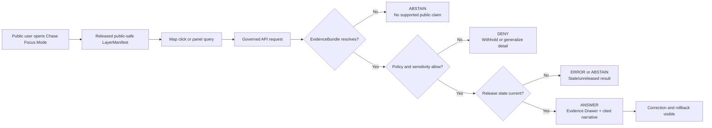
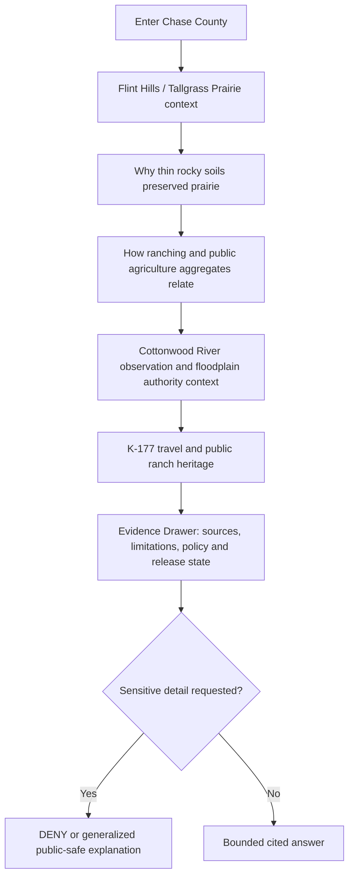
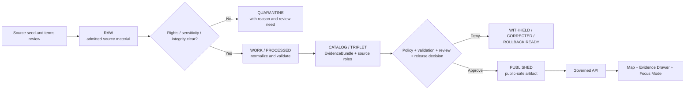
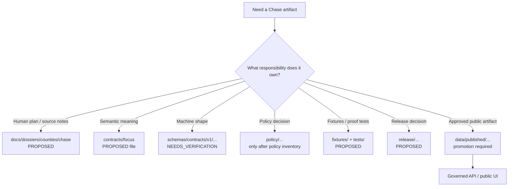
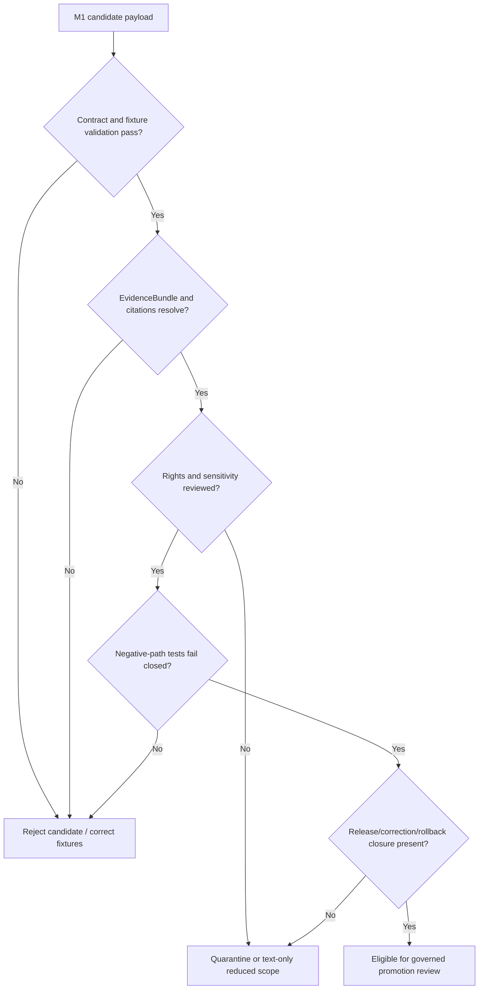

<!--
KFM_META_BLOCK_V2

doc_id: NEEDS_VERIFICATION

title: Chase County Focus Mode Build Plan

type: standard

version: v0.1

status: draft

owners: [NEEDS_VERIFICATION]

created: 2026-05-21

updated: 2026-05-21

policy_label: public-draft

related:
  - NEEDS_VERIFICATION: docs/doctrine/directory-rules.md
  - PROPOSED: docs/dossiers/counties/chase/chase_county_focus_mode_build_plan.md
  - CONFIRMED_PUBLIC_TREE / AUTHORITY_NEEDS_VERIFICATION: contracts/focus/
  - CONFIRMED_PUBLIC_TREE / AUTHORITY_NEEDS_VERIFICATION: schemas/contracts/v1/
  - PROPOSED: release/candidates/focus/counties/chase/

tags: [kfm, focus-mode, county, chase-county, flint-hills, tallgrass-prairie, hydrology, agriculture, geology, heritage, public-safe]

notes:
  - This downloadable Markdown is a PROPOSED county Focus Mode build plan, not a committed repository file or a released public artifact.
  - Public GitHub tree surfaces were inspected for responsibility-root alignment; no local checkout, test execution, CI result, runtime trace, or release proof was inspected.
  - Source authority, rights, API terms, schema placement, validator availability, release state, and owner assignments remain NEEDS_VERIFICATION before implementation or publication.
  - Sensitive ecology, exact cultural/archaeological or burial locations, private-property assertions, living-person data, live prescribed-fire operations, and exact infrastructure vulnerabilities fail closed or require reviewed generalization.
-->

<a id="top"></a>

# Chase County Focus Mode Build Plan

> **A Flint Hills proof slice for explaining tallgrass prairie, ranching, geology, river context, public heritage, and movement corridors without turning a map, AI answer, or generalized view into sovereign truth.**


| Field | Determination |
|---|---|
| Selected county | **Chase County, Kansas** |
| County FIPS | **NEEDS_VERIFICATION** before machine-readable fixture creation |
| Build type | County Focus Mode public-safe proof slice |
| Implementation state | **PROPOSED** — plan and fixture design only |
| Repository evidence state | **CONFIRMED:** selected public GitHub tree surfaces were browsed; **UNKNOWN:** local branch state, current tests, workflow enforcement, runtime behavior, release objects, and accepted ADR implementation state |
| Proposed document home | `docs/dossiers/counties/chase/chase_county_focus_mode_build_plan.md` — **PROPOSED / NEEDS_VERIFICATION** against the existing county-plan convention before PR |
| Intended first milestone | **Chase Prairie–River Evidence Drawer Slice** |

**Quick links** — [Operating posture](#1-operating-posture) · [Why this county](#2-why-chase-county) · [First demo layers](#5-first-demo-layers) · [UI surfaces](#7-ui-surfaces) · [Governed object model](#8-governed-object-model) · [Repository shape](#9-proposed-repository-shape) · [First PR sequence](#11-first-pr-sequence) · [Fixtures](#13-fixture-plan) · [Sources](#15-source-seed-list) · [Milestone](#17-recommended-first-milestone)

---

## Executive build note

**PROPOSED county choice.** Chase County is an unusually strong next proof slice because a single public-safe Focus Mode can relate the Flint Hills and Tallgrass Prairie National Preserve, an agriculture-and-ranching economy, Cottonwood River observation context, floodplain navigation, Flint Hills geology, K-177/U.S. 50 mobility context, and publicly interpreted ranch heritage. The county also forces KFM to get its boundaries right: prairie ecology and fire/grazing context must not become live operational fire intelligence; ecological interpretation must not publish sensitive occurrences; historic places must not become a discovery tool for undocumented cultural sites; and a parcel or flood layer must not become a property-title or regulatory determination.

**Current public-source seed signals, verified for planning on 2026-05-21:**

- The Kansas Department of Agriculture reports **252 farms**, **491,365 acres**, and **$135 million in 2022 crop and livestock sales** for Chase County, based on the USDA 2022 Census of Agriculture.[^kda-ag]
- The National Park Service states that Tallgrass Prairie National Preserve protects a nationally significant Flint Hills remnant of tallgrass prairie, with **nearly 11,000 acres** available to explore, in a prairie type for which less than 4% remains intact.[^nps-preserve]
- USGS exposes a monitoring location for **Cottonwood River at Cottonwood Falls, Kansas — USGS-07182000**, suitable as a source seed for timestamped hydrologic context rather than emergency guidance.[^usgs-cottonwood]
- A KDOT archive describes a **2022** K-177 temporary closure in Chase County for railroad bridge work; its value to this plan is precisely as an archived transport record that must not be rendered as a current road condition.[^kdot-archive]

> [!IMPORTANT]
> **Chase County is a proof slice for evidence-linked public explanation, not for ecological surveillance, burn-operation monitoring, property adjudication, floodplain permitting advice, transportation alerts, or unreviewed heritage discovery.**

---

## 1. Operating posture

### 1.1 Governing rules for this plan

| Rule | Focus Mode consequence |
|---|---|
| EvidenceBundle outranks generated language. | Every consequential card, narrative, comparison, or AI response resolves to evidence or returns `ABSTAIN`, `DENY`, or `ERROR`. |
| Public clients use governed interfaces only. | The public map and panels consume released public-safe layers and governed API envelopes; they never read RAW, WORK, QUARANTINE, canonical/internal stores, or direct model responses. |
| Publication is a governed state transition. | A promoted public Chase layer requires a release decision, validation support, policy outcome, evidence closure, correction path, and rollback target. |
| Maps and AI are downstream carriers. | Tiles, popups, summaries, render states, exports, and generated prose never establish truth independently. |
| Cite-or-abstain is the default. | Unsupported feature text, inferred claims, stale temporal context, and missing source authority must not appear as confident public statements. |
| Precision is policy-controlled. | Sensitive ecology, cultural heritage, private-property implications, operational fire or infrastructure detail, and living-person information must be suppressed, generalized, delayed, restricted, or denied. |

### 1.2 Truth-label key

| Label | Meaning in this plan |
|---|---|
| **CONFIRMED** | Verified during this planning run from cited official public sources, consulted KFM doctrine, or public repository-tree evidence. |
| **PROPOSED** | A product design, path, schema/contract shape, fixture, layer, policy rule, or implementation step not verified as implemented. |
| **NEEDS_VERIFICATION** | Checkable before activation, publication, or PR landing, but not checked strongly enough to act as fact. |
| **UNKNOWN** | Not evidenced sufficiently in this run. |
| **ANSWER / ABSTAIN / DENY / ERROR** | Finite runtime outcomes for public-facing governed responses, not rhetorical labels. |

### 1.3 Public-safe decision flow



### 1.4 County-specific non-negotiable guardrails

> [!CAUTION]
> **Prairie and fire:** Public interpretation may explain fire and grazing as documented ecological processes. It must not expose unreviewed prescribed-fire plans, live operational perimeters, responder positioning, private burn contacts, or inferred public-safety instructions.

> [!WARNING]
> **Ecology and cultural heritage:** Tallgrass habitat context may be shown at safe generality. Exact rare-species observations, nesting/lek sites, unpublished biological monitoring, archaeology, burials, sacred/culturally sensitive places, or discovery-enabling coordinates are `DENY` by default unless explicitly reviewed for public release.

> [!NOTE]
> **Parcels, floodplains, and roads:** Public map context is informational. A parcel layer is not title proof; a floodplain view is not a permit/insurance determination; an archived KDOT notice is not a current closure or routing instruction.

---

## 2. Why Chase County

### 2.1 Proof-slice rationale

Chase County tests KFM across interdependent public-story and trust-boundary surfaces without requiring a sprawling metropolitan build. It brings together conservation, ranching, water, terrain, roads, history, and sensitive-location discipline in a county whose public identity is strongly tied to landscape.

| County signal | Public value for KFM | Governance pressure it creates |
|---|---|---|
| Tallgrass Prairie National Preserve / Flint Hills | Explain prairie landscape, protected context, and public visitation setting. | Avoid exposing sensitive ecology or implying preserve datasets establish all county habitat truth. |
| Ranching and agriculture | Relate public county-level agricultural aggregates to landscape context. | Keep aggregates separate from private operations, ownership, and producer-level inference. |
| Cottonwood River / Cottonwood Falls USGS station | Demonstrate timestamped hydrology evidence and river narrative. | Show provisional/revisable observations honestly; do not act as emergency or regulatory guidance. |
| Floodplain governance surfaces | Route users to authoritative effective-floodplain context. | Avoid parcel-specific regulatory conclusions; preserve effective-versus-project-state distinction. |
| Flint Hills geology | Explain limestone/shale, thin soils, chert, terraced hills, and ranching landscape relationships. | Educational geology is not a subsurface-property, mineral-rights, or hazard determination. |
| K-177 / U.S. 50 travel context | Create mobility-and-landscape interpretation around the county. | Prevent stale archived project notices from displaying as current route conditions. |
| Spring Hill Farm and Stock Ranch public history | Tie public heritage to ranching and built landscape. | Publicly interpreted assets do not authorize broader archaeological or private-site exposure. |
| Prairie fire and grazing interpretation | Explain ecological management as a landscape process. | Strictly separate documented educational context from live operational/public-safety data. |

### 2.2 Proof-slice questions KFM should be able to answer

| Public question | Allowed answer shape | Required limitation |
|---|---|---|
| “Why does this landscape look different from surrounding Kansas?” | Evidence-linked geology + prairie + ranching context card. | Do not overstate county-wide causal certainty from one interpretive source. |
| “What is the preserve and how does it relate to Chase County?” | NPS-backed public preserve narrative and boundary/context layer once rights/geometry are verified. | Do not expose non-public monitoring or sensitive species detail. |
| “What public water context is available near Cottonwood Falls?” | Timestamped USGS monitoring-location context and source link. | Not a flood alert, evacuation tool, permit decision, or property-risk determination. |
| “How does agriculture fit the county landscape?” | KDA aggregate statistic card paired with landscape interpretation. | No farm-level or private-land inference. |
| “Is K-177 closed?” | `ABSTAIN` from archived context and direct the user to current authoritative travel information. | Never present a 2022 archive notice as current. |
| “Show me rare wildlife or undisclosed heritage sites.” | `DENY` or generalized public-safe explanation. | No exact coordinates or discovery-enabling map detail. |

---

## 3. Product thesis

### 3.1 One-sentence thesis

**Chase County Focus Mode should let a public user understand how Flint Hills geology, tallgrass prairie preservation, ranching agriculture, Cottonwood River context, public heritage, and transportation access intersect—through released, cited, policy-safe evidence surfaces with visible limitations and correction paths.**

### 3.2 What the first product promises

| Promise | Product expression |
|---|---|
| Landscape literacy | A curated public-safe map narrative relating prairie, geology, river, ranching, and public historic interpretation. |
| Inspectable evidence | Every public claim offers an Evidence Drawer view with source, date/time basis, source role, limitations, policy posture, and release state. |
| Temporal honesty | Current observations, historical records, and general interpretive content are visibly distinguished. |
| Safe precision | Sensitive ecology, private property, cultural sites, fire operations, and infrastructure risk details fail closed. |
| Reversibility | Candidate layers can be withheld, corrected, withdrawn, or rolled back without rewriting public history. |

### 3.3 What the first product does not promise

| Not promised | Reason |
|---|---|
| A complete Chase County digital twin | Visual completeness would outrun evidence, policy, and release control. |
| Real-time emergency or fire intelligence | Focus Mode is not a public-safety alert or command system. |
| Property-title, zoning, or floodplain adjudication | Public map context cannot replace governing records or official determinations. |
| Exact ecological or archaeological discovery tools | Public precision could create harm and violate governance posture. |
| Open-ended AI fact production | AI remains bounded behind EvidenceBundle resolution and finite outcomes. |

---

## 4. Scope boundary

### 4.1 Included public context for the first slice

| Included scope | First-slice use | Public display posture |
|---|---|---|
| Chase County identity and generalized county extent | Map framing, jurisdiction context, feature selection. | Public-safe after boundary source validation. |
| Tallgrass Prairie National Preserve public context | Preserve card, educational story, publicly appropriate boundary/reference layer. | Public-facing from reviewed authoritative source only. |
| Public Flint Hills geology interpretation | Geology explanation card and generalized geologic context. | Educational; cite source and limitations. |
| County-level agriculture summary | Aggregate farming/ranching context card. | Public aggregate only; no producer-level disaggregation. |
| Cottonwood River public monitoring-location context | Timestamped observation-source card and hydrology narrative. | Must label provisional/revisable observations where applicable. |
| Authoritative floodplain routing | Link-out and interpretive layer-state explanation. | Avoid individualized regulatory conclusions. |
| K-177 / public corridor and scenic-context narrative | Transportation-and-landscape story; archived history when labeled. | Current status only from current transport authority feed after verification. |
| Publicly interpreted ranch heritage | Spring Hill Farm and Stock Ranch / historic barn public narrative. | Public interpreted asset only; do not infer other sites. |
| Fire and grazing educational context | Explanatory content linked to public NPS information. | Never operational. |

### 4.2 Explicit exclusions and denial conditions

| Sensitive or out-of-scope detail | Required public outcome | Reason |
|---|---|---|
| Exact rare, threatened, vulnerable, nesting, roosting, lek, or sensitive biological occurrences | `DENY` or reviewed coarse generalization | Ecological harm and geoprivacy risk. |
| Unpublished biological survey locations or monitoring plots | `DENY` | Source authority and sensitivity unresolved. |
| Archaeological sites, burials, sacred places, collection locations, or inferred site-potential maps | `DENY` absent qualified review and reviewed safe transform | Cultural sensitivity, sovereignty, and looting risk. |
| Parcel ownership assertions, living-person details, private access routes, farm-level inference | `DENY` or omit | Public GIS context is not title truth and private-person exposure is not necessary. |
| Live prescribed-fire plans, burn perimeter operations, tactical response details, or emergency instructions | `DENY` / route to authoritative safety information | Public safety and operational sensitivity. |
| Exact infrastructure vulnerability, bridge risk assessment, security posture, or non-public utility geometry | `DENY` or generalize | Security and resilience sensitivity. |
| Archived road-work record rendered as active closure | `ERROR` / correction required | Temporal misrepresentation. |
| RAW, WORK, QUARANTINE, unpublished candidate, internal store, or direct model output | `DENY` | Trust-membrane violation. |

---

## 5. First demo layers

### 5.1 Public-safe layer set

| Priority | Layer / card | County-specific purpose | Initial source seed | Evidence / policy gate | Status |
|---:|---|---|---|---|---|
| 0 | County frame and named-place context | Establish Chase County navigation and focus-mode extent. | Official/public boundary source **NEEDS_VERIFICATION** | Geometry authority, rights, version, release manifest. | **PROPOSED** |
| 1 | Tallgrass Prairie National Preserve context | Anchor the county’s public prairie/conservation story. | NPS preserve pages; authoritative downloadable geometry **NEEDS_VERIFICATION** | Public-use geometry/terms, source role, no sensitive overlays. | **PROPOSED** |
| 1 | Flint Hills geology explainer | Relate thin soils, limestone/shale, chert, terraced landforms, and ranching landscape. | NPS geology page citing KGS context. | Educational-source label; do not overgeneralize or claim resource rights. | **PROPOSED** |
| 1 | County agriculture aggregate card | Show public agricultural scale and ranching relationship. | KDA Chase County page / USDA 2022 Census of Agriculture. | Aggregate-only; source date and limits shown. | **PROPOSED** |
| 1 | Cottonwood River monitoring-location card | Explain available hydrologic evidence around Cottonwood Falls. | USGS-07182000. | Timestamp, provisional/revision posture, no emergency or flood-risk assertion. | **PROPOSED** |
| 2 | Effective floodplain authority router | Guide users to current effective floodplain source without overclaiming. | KDA Kansas Current Effective Floodplain Viewer / FEMA references. | Distinguish effective data from mapping projects and local determinations. | **PROPOSED** |
| 2 | K-177 / U.S. 50 public mobility narrative | Explain public movement through Flint Hills and archival transport events. | KDOT archive; Kansas Tourism byway context. | Historical/current state split; no stale closure display. | **PROPOSED** |
| 2 | Public ranch-heritage story node | Connect prairie, limestone construction, ranching history, and public interpretation. | NPS Historic Barn Information. | Public interpreted feature only; no undisclosed cultural sites. | **PROPOSED** |
| 3 | Fire-and-grazing education card | Explain documented ecological process and ranching relation. | NPS fire-and-grazing education page; additional Kansas guidance **NEEDS_VERIFICATION**. | Educational-only; deny operational burn details. | **PROPOSED / WITHHELD UNTIL POLICY TESTED** |
| 3 | County GIS contextual reference | Potential general parcel/road/reference context for steward review. | Chase County gWorks viewer. | Terms, fields, title/privacy implications, and authority need review. | **NEEDS_VERIFICATION / NOT PUBLIC-BY-DEFAULT** |

### 5.2 Layer-classification rules

| Layer class | Allowed public behavior | Not allowed |
|---|---|---|
| Educational interpretation | Explain supported public relationships with citations and limitations. | Presenting interpretation as exhaustive or cadastral/scientific proof. |
| Observation snapshot | Display source, observed time, retrieval time, variable/units, revision posture. | Converting observation into hazard alert or unverified causal conclusion. |
| Regulatory-context router | Point users to effective official source and explain the layer status. | Deciding permits, insurance, legal boundaries, or individual risk. |
| Historic/public culture | Render publicly interpreted assets with source attribution. | Inferring or revealing additional protected or private sites. |
| Transportation archive | Present as dated history and link to current authority. | Displaying as present route status. |
| Sensitive candidate | Hide from normal UI and require reviewed safe transform or deny. | Style-only hiding, tooltip leakage, downloadable exact coordinates. |

### 5.3 Candidate opening narrative sequence



---

## 6. User journeys

### Journey A — Prairie visitor: “What am I looking at?”

| Step | User action | Focus Mode behavior | Evidence / safety requirement |
|---:|---|---|---|
| 1 | Opens Chase County | Lands on a county overview with preserve, landscape, river, and corridor toggles. | Only released layer manifests load. |
| 2 | Selects Tallgrass Prairie preserve context | Receives NPS-backed public narrative and safe map context. | No sensitive ecological monitoring is exposed. |
| 3 | Opens “Why prairie here?” | Shows geology card relating limestone/shale, thin rocky soils, and grassland/ranching context. | Explanation marked interpretive and source-cited. |
| 4 | Clicks Evidence Drawer | Sees public sources, date basis, limitations, and release state. | EvidenceBundle closure required. |

### Journey B — Ranching/agriculture context: “How does agriculture relate to the landscape?”

| Step | User action | Focus Mode behavior | Evidence / safety requirement |
|---:|---|---|---|
| 1 | Selects agriculture card | Displays KDA county-level totals and reported 2022 basis. | Aggregate only; no individual properties or producers. |
| 2 | Opens geology/prairie compare | Explains supported relationship between rocky terrain, grassland persistence, and ranching culture. | Does not claim causality beyond evidence. |
| 3 | Requests farm-specific detail | Returns `DENY` or provides aggregate guidance. | No private-property or living-person inference. |

### Journey C — River and floodplain user: “What water context is available?”

| Step | User action | Focus Mode behavior | Evidence / safety requirement |
|---:|---|---|---|
| 1 | Clicks Cottonwood River / monitoring card | Shows USGS station identity and timestamped public observation context when released. | Units, timestamps, provisional/revision posture displayed. |
| 2 | Selects floodplain context | Directs user to authoritative effective floodplain viewer and explains status class. | Do not issue parcel-level determinations. |
| 3 | Requests safety action during a flood | Returns bounded limitation and routes to official emergency sources. | Not an emergency-alert system. |

### Journey D — Cultural landscape learner: “How did ranch history shape this place?”

| Step | User action | Focus Mode behavior | Evidence / safety requirement |
|---:|---|---|---|
| 1 | Opens public heritage story | Presents NPS-backed Spring Hill ranch / historic barn narrative. | Publicly interpreted site only. |
| 2 | Requests “hidden historical sites nearby” | Returns `DENY` or a generalized statement on heritage sensitivity. | No archaeology or discovery-enabling inference. |

### Journey E — Steward/reviewer: “Is this safe to publish?”

| Step | Review action | Required result |
|---:|---|---|
| 1 | Review source descriptors and rights | Each active seed has source role, authority, terms/rights status, temporal basis, and sensitivity posture. |
| 2 | Run invalid fixtures | Exact sensitive ecology, stale road closures, live fire operations, property claims, and missing EvidenceBundles fail closed. |
| 3 | Review map payload | No public layer can load absent manifest, policy decision, evidence closure, release state, and rollback target. |
| 4 | Promote or reject | Promotion is recorded as a governed decision; rejected candidates remain unpublished. |

---

## 7. UI surfaces

### 7.1 County Focus Mode panel set

| Surface | User-facing purpose | Mandatory trust fields | Status |
|---|---|---|---|
| County overview header | Set location, purpose, public-safe posture, and “not an alert/adjudication tool” notice. | county identity source, release state, last reviewed. | **PROPOSED** |
| Layer library | Toggle public-safe preserve, agriculture, river, floodplain router, geology, transport, heritage cards. | `layer_id`, source role, sensitivity, release status, evidence reference. | **PROPOSED** |
| Timeline/status ribbon | Separate static interpretation, historical record, current observation, and regulatory source routing. | observed/published/effective/retrieved dates; stale-state marker. | **PROPOSED** |
| Map canvas | Provide disciplined downstream representation. | released `LayerManifest`; public-safe style; no hidden sensitive geometry. | **PROPOSED** |
| Evidence Drawer | Make claim support inspectable. | EvidenceBundle, sources, limitations, policy decision, review/release/correction/rollback refs. | **PROPOSED** |
| Focus Mode narrative | Provide bounded question-answer experience. | finite outcome, citations, EvidenceBundle refs, AIReceipt where generated. | **PROPOSED** |
| Correction/withdrawal banner | Warn when an artifact is corrected, withdrawn, stale, or replaced. | correction ref, replacement/rollback target, effective time. | **PROPOSED** |

### 7.2 Trust-visible layer card example

```json
{
  "object_type": "CountyFocusLayerCard",
  "schema_version": "v1",
  "county_id": "NEEDS_VERIFICATION: chase-county-fips",
  "layer_id": "chase.tallgrass_prairie.public_context.v1",
  "title": "Tallgrass Prairie National Preserve Context",
  "knowledge_character": "public_interpretive_context",
  "outcome": "ANSWER",
  "public_safe": true,
  "source_refs": ["SEED-002-NPS-TAPR"],
  "evidence_bundle_ref": "NEEDS_VERIFICATION",
  "policy_decision_ref": "NEEDS_VERIFICATION",
  "release_manifest_ref": "NEEDS_VERIFICATION",
  "limitations": [
    "Public interpretive context only.",
    "Sensitive species, monitoring, and cultural locations are not exposed."
  ],
  "correction_ref": null,
  "rollback_ref": "NEEDS_VERIFICATION"
}
```

### 7.3 Denial envelope example

```json
{
  "object_type": "RuntimeResponseEnvelope",
  "schema_version": "v1",
  "county_id": "NEEDS_VERIFICATION: chase-county-fips",
  "outcome": "DENY",
  "reason_code": "SENSITIVE_ECOLOGY_EXACT_LOCATION",
  "public_message": "Exact locations for sensitive ecological observations are not available in the public view.",
  "policy_decision_ref": "NEEDS_VERIFICATION",
  "evidence_bundle_refs": [],
  "release_state": "withheld"
}
```

### 7.4 UI accessibility and usability minimums

- [ ] Keyboard-accessible layer toggles, drawer opening, status filters, and close controls.
- [ ] Screen-reader-accessible status wording for `ANSWER`, `ABSTAIN`, `DENY`, `ERROR`, stale, corrected, and withdrawn states.
- [ ] No reliance on color alone for sensitive, historic, current, or regulatory status.
- [ ] Plain-language limitation banner for water, property, transport, fire, and heritage surfaces.
- [ ] Citation and source link access from every consequential card.
- [ ] Mobile behavior reviewed before any public release claim.

---

## 8. Governed object model

### 8.1 Object-family map

| Object family | Role in Chase County slice | Minimum content expectation | Path posture |
|---|---|---|---|
| `CountyFocusModeManifest` | Binds approved Chase layer cards, UI surfaces, outcomes, and safe-view defaults. | county identity, layer refs, evidence refs, policy/release refs, temporal state, correction/rollback refs. | **PROPOSED / schema home NEEDS_VERIFICATION** |
| `SourceDescriptor` | Declares official source seed role and constraints. | authority, source role, rights/terms, access, cadence, precision, sensitivity, citation rule. | Extend existing family where present; do not duplicate. |
| `LayerManifest` | Controls public map layer admission. | source/evidence refs, public-safe flag, style/artifact refs, release state, policy decision. | **PROPOSED** |
| `EvidenceBundle` | Supports public claims and drawer content. | source support, spatial/temporal scope, limitations, integrity and resolution state. | Reuse KFM evidence spine. |
| `PolicyDecision` | Records allow/generalize/deny/abstain obligations. | decision, reasons, obligations, sensitivity/rights checks, review need. | Reuse policy family. |
| `ObservationSnapshot` | Captures USGS or other time-bound observation context. | station/source ID, variable, units, observed time, retrieval time, provisional/revision status. | **PROPOSED** |
| `HistoricalContextRecord` | Represents dated transport or public heritage history. | source, historic date, applicability boundary, current-status prohibition where applicable. | **PROPOSED** |
| `GeneralizationReceipt` / `RedactionReceipt` | Records transformation before a public-sensitive display. | reason, source precision, output precision, reviewer/policy reference. | **PROPOSED / family authority NEEDS_VERIFICATION** |
| `CitationValidationReport` | Confirms claims are supportable or require abstention. | claim refs, source refs, pass/fail, blocked claims. | Reuse governed-AI/public-output validator family. |
| `RuntimeResponseEnvelope` | Carries finite UI/Focus Mode outcomes. | outcome, reason code, evidence refs, policy refs, release state, citations. | Reuse runtime family. |
| `ReleaseManifest` | Records approved public publication state. | artifacts, evidence/policy/proof closure, approval, correction and rollback targets. | Reuse release family. |
| `AIReceipt` | Captures generated summary behavior when used. | context/evidence refs, model/procedure ref, outcome, citation-validation ref. | Reuse AI/governance family; no direct public model output. |

### 8.2 Source-role anti-collapse rules

| Evidence character | Must remain distinct from | Why |
|---|---|---|
| NPS public interpretive preserve information | Sensitive ecological monitoring or county-wide habitat truth | Public education does not authorize full-resolution ecological inference. |
| NPS/KGS geology explanation | Property-level geotechnical/mineral/hazard conclusion | Geological interpretation is not parcel adjudication. |
| KDA/USDA county aggregate agriculture statistics | Individual ranch/farm ownership or production claims | Aggregate public statistics do not establish private facts. |
| USGS station observation | Flood warning, evacuation advice, or parcel-specific flood risk | Observation evidence is time-bound and not a public-safety decision. |
| KDA effective floodplain viewer routing | Local permit/insurance/title decision | Map access does not replace official determination processes. |
| KDOT archived project notice | Current closure or routing state | The archive is historically valid but temporally stale for current travel. |
| NPS historic barn/public ranch account | Archaeological, burial, sacred, or private heritage locations | Public interpretation cannot justify discovery-enabling expansion. |
| NPS fire-and-grazing education | Live prescribed-fire or incident operations | Educational context must not become operational intelligence. |

### 8.3 Lifecycle and public trust path



---

## 9. Proposed repository shape

### 9.1 Evidence boundary for file placement

**CONFIRMED in this planning run:** Public repository browsing exposed responsibility roots including `docs/`, `docs/dossiers/`, `docs/domains/`, `contracts/`, `contracts/focus/`, `schemas/`, `schemas/contracts/v1/`, `policy/`, `fixtures/`, `tests/`, `tools/`, `release/`, and `data/`.

**UNKNOWN:** No local checkout was mounted or tested here; current branch protections, complete subtree conventions, accepted placement ADR implementation, schema authority finality, validators, fixtures, workflows, runtime behavior, and release maturity were not proven.

**Directory Rules basis:** location must encode responsibility and lifecycle, not just the Chase County topic. This plan therefore places human planning in a documentation responsibility root, semantic contracts in `contracts/`, machine shape in the schema responsibility root only after authority verification, tests/fixtures with proof obligations, policy decisions under policy responsibility, release decisions in `release/`, and only promoted public artifacts in the published lifecycle lane.

### 9.2 Proposed path map

| Proposed path | Responsibility root | Purpose | Status / placement gate |
|---|---|---|---|
| `docs/dossiers/counties/chase/chase_county_focus_mode_build_plan.md` | `docs/` | Human-facing, cross-domain county build plan. | **PROPOSED / NEEDS_VERIFICATION** against existing county-plan convention; avoids pretending one domain owns a cross-lane county product. |
| `docs/dossiers/counties/chase/source-seeds.md` | `docs/` | Public source routing ledger and rights/sensitivity review checklist. | **PROPOSED**; must not contain restricted coordinates or secrets. |
| `contracts/focus/county_focus_mode.md` | `contracts/` | Semantic meaning of a county Focus Mode manifest and finite UI outcome behavior. | `contracts/focus/` visible in public tree; file is **PROPOSED**. |
| `schemas/contracts/v1/runtime/county_focus_mode_manifest.schema.json` | `schemas/` | Machine-checkable shape for the manifest if runtime family is confirmed as owner. | **PROPOSED / NEEDS_VERIFICATION**; schema-home and family placement must be confirmed before creation. |
| `schemas/contracts/v1/runtime/county_focus_layer_card.schema.json` | `schemas/` | Machine shape for trust-visible layer cards. | **PROPOSED / NEEDS_VERIFICATION**; do not create if a reusable existing envelope already covers it. |
| `fixtures/focus/counties/chase/valid/` | `fixtures/` | Synthetic/public-safe valid fixture cases. | **PROPOSED** after contract/schema placement review. |
| `fixtures/focus/counties/chase/invalid/` | `fixtures/` | Negative-path denial and abstention fixtures. | **PROPOSED**; highest-priority addition for safety. |
| `policy/focus/counties/chase/` | `policy/` | Only county-specific policy overlays not expressible in reusable rules. | **PROPOSED / DEFER** until generic policy inventory proves need; avoid parallel policy authority. |
| `tools/validators/focus/` | `tools/` | Reusable manifest/evidence/citation/sensitivity validation tooling only if absent. | **PROPOSED / NEEDS_VERIFICATION** after validator inventory. |
| `tests/focus/counties/test_chase_county_focus_mode.*` | `tests/` | Negative/positive fixture enforcement and no-public-leak tests. | **PROPOSED**; adopt repo-native test language after inspection. |
| `release/candidates/focus/counties/chase/` | `release/` | Promotion candidate decisions/manifests; not public artifacts. | **PROPOSED** after release convention verification. |
| `data/published/focus/counties/chase/` | `data/` | Promoted public-safe data/artifacts only. | **PROPOSED / NOT CREATED BY THIS PLAN**; publication requires governed promotion. |

### 9.3 Prefer extension over parallel authority

| Required object/behavior | Preferred posture |
|---|---|
| Source descriptors, EvidenceBundles, runtime envelopes, policy decisions, release manifests, correction and rollback objects | Reuse or extend existing shared KFM families after repo inspection; do not create Chase-specific substitutes. |
| Schema placement | Verify current authority and ADRs before adding `county_focus_*` files; map to existing family if one already governs Focus Mode. |
| Public layer delivery | Reuse governed layer/release mechanisms; do not place county tiles or JSON directly under a UI folder. |
| Sensitivity controls | Prefer reusable ecology/heritage/fire/private-property rules with county fixtures; county overlays only for genuinely county-specific obligation. |

### 9.4 Placement guardrail diagram



### 9.5 Path anti-patterns to reject

- [ ] Do **not** create a root-level `chase/`, `counties/`, `focus_mode/`, `prairie/`, or `tallgrass/` authority bucket.
- [ ] Do **not** publish candidate JSON, PMTiles, or feature collections by dropping them into a web/static/UI folder.
- [ ] Do **not** create Chase-specific copies of shared `EvidenceBundle`, `PolicyDecision`, or `ReleaseManifest` semantics.
- [ ] Do **not** hide sensitive geometry by styling alone; public artifacts must already be safe.
- [ ] Do **not** treat a planning Markdown as proof that any route, schema, policy, or validator exists.

---

## 10. Build phases

| Phase | Goal | Deliverables | Required gate | Rollback / stop condition |
|---:|---|---|---|---|
| 0 | Verify repository and placement convention | Confirm actual county-plan home, Focus contract family, schema authority/ADRs, policy/fixture/test conventions, public API/UI boundary. | Repository tree and ADR review recorded. | Stop if creating a new parallel authority root would be required without ADR. |
| 1 | Create source-seed and sensitivity inventory | Source descriptors/draft ledger for NPS, KDA/USDA, USGS, KDA floodplain, KGS, KDOT, tourism/county GIS candidates; rights/terms and temporal posture backlog. | No source activated without authority/rights/sensitivity assessment. | Quarantine source with unclear terms or precision risk. |
| 2 | Define county Focus Mode contract slice | Semantic manifest contract, runtime outcome behavior, Evidence Drawer fields, correction/rollback obligations; minimal schemas only after placement check. | Contract/schema parity and fixture strategy approved. | Remove candidate schema/files if a canonical existing family is discovered. |
| 3 | Prove safe narrative core | Fixtures and mock cards for preserve context, geology, agriculture aggregate, Cottonwood River monitoring-location context. | Evidence closure + citations + public-safe policy pass. | Withdraw any layer lacking public-safe source role or citation closure. |
| 4 | Add authority routers and temporal controls | Effective-floodplain router; historical-versus-current KDOT status behavior; timestamp/stale-state labels. | Invalid stale/regulatory-overclaim fixtures fail closed. | Disable card if temporal or official-source state cannot be shown reliably. |
| 5 | Add public heritage and educational fire context | NPS public ranch heritage; optional educational fire/grazing card after sensitivity review. | Heritage and operational-fire denial tests. | Defer fire or heritage expansion if it risks sensitive/operational exposure. |
| 6 | Bind to UI mock/governed payload | Map layer registry stub, Evidence Drawer payload, finite Focus Mode responses, accessibility checks. | No direct model/client/raw-store paths; only release-safe mocked/released payloads. | Remove UI binding if contract and policy gates are bypassed. |
| 7 | Run promotion dry run | Candidate ReleaseManifest, validation report, policy result, correction and rollback rehearsal. | Steward review + all negative-path tests + release closure. | No public publication; retain as candidate or reject with reasons. |

---

## 11. First PR sequence

| PR | Proposed title | Smallest reversible content | Must not do | Exit evidence |
|---:|---|---|---|---|
| PR-00 | **Verify Chase Focus placement and authority boundaries** | Inventory existing county plan convention, ADR/schema authority, focus contract/UI/policy/test homes; record placement decision or ADR need. | No source activation, no public data, no new authority root. | Review note resolving or explicitly deferring path ambiguity. |
| PR-01 | **Add Chase County public-source planning dossier** | This Markdown adapted into confirmed home; source-seed checklist; sensitivity and source-role review table. | No live ingest or promoted layers. | Documentation review and source verification backlog. |
| PR-02 | **Define county Focus Mode manifest semantics and fixtures** | Extend or add semantic contract; valid/invalid synthetic fixture set; schema only if authority confirmed. | No duplicate shared Evidence/Policy/Release contract family. | Schema/contract/fixture review; invalid fixtures enumerated. |
| PR-03 | **Enforce Chase public-safe policy negative paths** | Tests/rules for exact ecology, heritage sites, live fire ops, parcel/title claims, stale KDOT closures, regulatory flood overclaim. | No policy shortcut to pass attractive UI demo. | All invalid cases return `DENY`, `ABSTAIN`, or `ERROR` as designed. |
| PR-04 | **Prove Prairie–River Evidence Drawer payloads** | Public-safe preserve, geology, agriculture aggregate, and USGS station mock/released-candidate payloads with evidence/citations. | No direct UI access to raw/candidate inputs. | Evidence closure, citation checks, UI payload tests. |
| PR-05 | **Add Chase map shell demo behind governed contracts** | Layer controls, Evidence Drawer, time/status banner, finite Focus Mode mock governed endpoint. | No direct model calls; no released-public claim without promotion. | Accessibility checks; no-leak tests; bounded UX review. |
| PR-06 | **Run Chase release-candidate and rollback rehearsal** | Candidate manifest, proof/receipt references, correction card, rollback exercise. | No public promotion absent review and release authority. | Signed/recorded approval or rejection determination as repo conventions allow. |

---

## 12. Acceptance checklist

### 12.1 Evidence, source, and temporal posture

- [ ] Every consequential public card resolves to an EvidenceBundle or produces `ABSTAIN`/`DENY`/`ERROR`.
- [ ] Every source seed has authority, role, rights/terms status, date/cadence, spatial precision, sensitivity, and citation rule reviewed or marked `NEEDS_VERIFICATION`.
- [ ] NPS interpretation, KDA/USDA statistics, USGS observations, KDA/FEMA floodplain information, KGS documentary material, and KDOT archives remain source-role distinct.
- [ ] Observation timestamps, historical event dates, retrieved dates, effective/status dates, and stale-state behavior are visible where relevant.
- [ ] The 2022 KDOT archived closure cannot be returned as current road condition.
- [ ] Historical KGS material cannot be stated as present municipal/water-supply operational truth without current corroboration.

### 12.2 Sensitivity and public safety

- [ ] Exact sensitive ecology cannot load into a public layer, tooltip, export, story node, or generated response.
- [ ] Heritage and archaeology controls deny discovery-enabling coordinate requests unless an expressly reviewed public artifact exists.
- [ ] Living-person/private-property/title assertions are not inferred from county GIS or agriculture content.
- [ ] Fire/grazing educational content is separated from prescribed-fire operations and public-safety instructions.
- [ ] Infrastructure and transport detail exposes no vulnerability or operationally risky content.
- [ ] Floodplain context includes a non-adjudication limitation and routes to authoritative current sources.

### 12.3 Trust membrane and runtime

- [ ] Public UI uses governed API payloads and released/public-safe artifacts only.
- [ ] No RAW, WORK, QUARANTINE, unpublished candidate, internal store, or direct model path is reachable by a normal public client.
- [ ] Map loading requires a permitted released `LayerManifest` and policy/release closure.
- [ ] Focus Mode output carries finite outcome, reason code where bounded/denied, evidence refs, citation support, release state, and AI receipt if generated.
- [ ] Popups do not substitute for an Evidence Drawer on consequential claims.

### 12.4 Repository, validation, and release

- [ ] Proposed path home has been checked against Directory Rules, public tree evidence, current mounted-repo evidence when available, and applicable ADRs.
- [ ] Schema placement does not create parallel authority and is resolved before machine contract files land.
- [ ] Fixtures include both safe-public success cases and county-specific fail-closed cases.
- [ ] Tests cover denial, abstention, stale data, missing evidence, unclear rights, and missing release/rollback closure.
- [ ] Release candidates include correction and rollback paths before any publication decision.
- [ ] Documentation is updated with any behavior-changing implementation PR.

---

## 13. Fixture plan

### 13.1 Valid/public-safe fixtures

| Fixture ID | Fixture scenario | Expected outcome | Core assertions |
|---|---|---|---|
| `chase_valid_preserve_context_v1` | NPS-backed Tallgrass Prairie public overview card with reviewed public-safe geometry or text-only context. | `ANSWER` | Evidence and citation present; no sensitive occurrences. |
| `chase_valid_geology_explainer_v1` | Flint Hills limestone/shale/chert interpretation with NPS/KGS-supported limitations. | `ANSWER` | Educational role visible; no parcel conclusion. |
| `chase_valid_agriculture_aggregate_2022_v1` | KDA/USDA county aggregate totals. | `ANSWER` | Year/source visible; no private farm identity. |
| `chase_valid_usgs_station_context_v1` | USGS-07182000 monitoring-location card with timestamp/provisional status. | `ANSWER` | Observed/retrieved time and “not an alert” limitation. |
| `chase_valid_floodplain_router_v1` | KDA effective floodplain-viewer routing card. | `ANSWER` | Links to authority; no parcel decision. |
| `chase_valid_kdot_archived_history_v1` | 2022 K-177 bridge-work notice presented in historical narrative mode. | `ANSWER` | Clearly dated and not current road status. |
| `chase_valid_public_barn_heritage_v1` | NPS public historic barn interpretive story. | `ANSWER` | Public NPS asset only; heritage limitation present. |

### 13.2 Invalid / negative-path fixtures

| Fixture ID | Invalid scenario | Required outcome | Reason code candidate |
|---|---|---|---|
| `chase_invalid_sensitive_species_exact_geometry_v1` | Public response includes exact sensitive flora/fauna observation point. | `DENY` | `SENSITIVE_ECOLOGY_EXACT_LOCATION` |
| `chase_invalid_unreviewed_lek_inference_v1` | Model infers/publishes likely nesting/lek location from habitat context. | `DENY` | `INFERRED_SENSITIVE_OCCURRENCE` |
| `chase_invalid_archaeology_discovery_map_v1` | Public layer exposes precise candidate archaeology/burial/cultural location. | `DENY` | `CULTURAL_LOCATION_RESTRICTED` |
| `chase_invalid_live_burn_operations_v1` | UI shows live prescribed-fire plan/perimeter without public-safety/release policy approval. | `DENY` | `OPERATIONAL_FIRE_DETAIL_RESTRICTED` |
| `chase_invalid_parcel_title_claim_v1` | GIS-derived parcel display states private ownership/title conclusion. | `DENY` | `PROPERTY_TITLE_NOT_SUPPORTED` |
| `chase_invalid_floodplain_regulatory_decision_v1` | Focus Mode gives parcel-specific permit/insurance determination from map view. | `ABSTAIN` or `DENY` | `REGULATORY_DETERMINATION_OUT_OF_SCOPE` |
| `chase_invalid_archived_kdot_as_current_v1` | 2022 KDOT closure is presented as current road status. | `ERROR` | `STALE_TRANSPORT_STATUS` |
| `chase_invalid_historic_groundwater_as_current_v1` | Historical KGS report is rendered as present operational supply fact. | `ABSTAIN` | `TEMPORAL_AUTHORITY_UNRESOLVED` |
| `chase_invalid_missing_evidence_bundle_v1` | Generated landscape statement has no resolved evidence reference. | `ABSTAIN` | `EVIDENCE_CLOSURE_FAILED` |
| `chase_invalid_unreleased_tile_manifest_v1` | Public client tries loading candidate layer without release/policy closure. | `DENY` | `UNRELEASED_LAYER_BLOCKED` |
| `chase_invalid_direct_model_answer_v1` | Public UI displays model output without governed runtime envelope/citations. | `DENY` | `DIRECT_MODEL_PATH_BLOCKED` |

---

## 14. Risk register

| Risk ID | Risk | Chase-specific manifestation | Default control / outcome | Owner |
|---|---|---|---|---|
| R-01 | Sensitive ecology leakage | Prairie context used to locate sensitive wildlife or rare plants. | Generalize/withhold; denial fixtures; steward review. | `NEEDS_VERIFICATION` |
| R-02 | Fire operational exposure | Educational fire/grazing content conflated with live prescribed-burn operations. | Educational-only public content; deny live/tactical detail. | `NEEDS_VERIFICATION` |
| R-03 | Cultural/archaeological harm | Public heritage narrative encourages disclosure of non-public sites. | Limit to reviewed public NPS features; deny exact unreviewed locations. | `NEEDS_VERIFICATION` |
| R-04 | Property/privacy overclaim | Public GIS or agriculture layer becomes private ownership/farm inference. | Aggregate-only design; title-truth denial; field review. | `NEEDS_VERIFICATION` |
| R-05 | Water-status misuse | USGS observation interpreted as warning or parcel risk. | Timestamp/provisional labels; not-an-alert limitation; authoritative routing. | `NEEDS_VERIFICATION` |
| R-06 | Floodplain regulatory overclaim | Viewer context becomes permit/insurance conclusion. | Link-out router; abstain on determinations. | `NEEDS_VERIFICATION` |
| R-07 | Temporal misinformation | Archived KDOT bridge closure shown as active. | Historical record class; stale/current status validator. | `NEEDS_VERIFICATION` |
| R-08 | Historical-source misuse | KGS historic groundwater text displayed as current operational reality. | Documentary classification; current corroboration requirement. | `NEEDS_VERIFICATION` |
| R-09 | Rights/terms uncertainty | GIS viewer or downloadable geometry used before terms are understood. | Quarantine pending terms/source-role review. | `NEEDS_VERIFICATION` |
| R-10 | Trust-membrane bypass | UI loads candidate tiles or direct AI output. | Governed API only; release and no-direct-model tests. | `NEEDS_VERIFICATION` |
| R-11 | Repository authority drift | New county folder/schema/policy family creates parallel convention. | Phase 0 placement verification; ADR or adapt/extend existing home. | `NEEDS_VERIFICATION` |
| R-12 | Attractive demo outruns proof | Visually impressive map lacks evidence/correction/rollback closure. | Fail release gate until closure is demonstrable. | `NEEDS_VERIFICATION` |

---

## 15. Source seed list

> [!IMPORTANT]
> Source seeds are candidate inputs for governed admission, not preapproved published layers. Exact datasets, service endpoints, use terms, licensing, update cadence, field exposure, geometry precision, and review obligations remain **NEEDS_VERIFICATION** before activation unless expressly recorded otherwise.

### 15.1 Official/public seed ledger

| ID | Source seed | Public-source role | Candidate use | Boundary / verification need | Planning status |
|---|---|---|---|---|---|
| `SEED-001-KDA-AG` | [Kansas Department of Agriculture — Chase County](https://www.agriculture.ks.gov/kansas-agriculture/kansas-agricultural-statistics/chase-county) | Official state public aggregate-statistics source | County agriculture card: 252 farms, 491,365 acres, $135M sales in 2022; ranching/agriculture context. | USDA 2022 Census basis shown; aggregate only; no farm inference. | **CONFIRMED reviewed seed** |
| `SEED-002-NPS-PRESERVE` | [NPS — Tallgrass Prairie National Preserve](https://www.nps.gov/tapr/) | Official federal public interpretive source | Preserve overview, public prairie context, visitation-oriented story. | Downloadable/servable geometry authority and rights still need verification; no sensitive occurrence inference. | **CONFIRMED reviewed seed** |
| `SEED-003-NPS-GEOLOGY` | [NPS — Geology in the Flint Hills](https://www.nps.gov/tapr/learn/nature/geology-at-the-preserve.htm) | Official federal interpretive geology source with KGS-attributed mapping imagery | Geology explainer: limestone/shale, thin soils, chert, erosional topography, ranching relationship. | Educational interpretation; do not turn into parcel/geotechnical/mineral-rights claims. | **CONFIRMED reviewed seed** |
| `SEED-004-NPS-HERITAGE` | [NPS — Historic Barn Information](https://www.nps.gov/tapr/historic-barn-information.htm) | Official federal public historic interpretation | Public Spring Hill ranch / limestone barn story node. | Limited to publicly interpreted asset; no extrapolation to undisclosed cultural sites. | **CONFIRMED reviewed seed** |
| `SEED-005-USGS-COTTONWOOD` | [USGS — Cottonwood River at Cottonwood Falls, KS, 07182000](https://waterdata.usgs.gov/monitoring-location/07182000/) | Official federal monitoring-location source | River observation-source card; potentially timestamped readings after API/terms review. | Provisional/revision, units, retrieval/observation time; not an emergency service. | **CONFIRMED reviewed seed** |
| `SEED-006-KDA-FLOOD-EFFECTIVE` | [KDA — Kansas Current Effective Floodplain Viewer](https://gis2.kda.ks.gov/gis/ksfloodplain/) | Official state floodplain viewer | Effective-floodplain source router and status explanation. | Must not issue parcel-specific determinations; viewer metadata and service terms to verify. | **CONFIRMED reviewed seed / activation NEEDS_VERIFICATION** |
| `SEED-007-KDA-FLOOD-PROJECTS` | [KDA — Floodplain Mapping Projects](https://www.agriculture.ks.gov/divisions-programs/division-of-water-resources/water-structures/floodplain-management/mapping/mapping-projects) | Official state project-status/routing source | Explain effective versus preliminary/pending/project mapping and authoritative routing. | Current reviewed page did not itself list a Chase-specific active project; do not claim one without evidence. | **CONFIRMED reviewed seed** |
| `SEED-008-KGS-GROUNDWATER` | [Kansas Geological Survey — Ground-water Resources of Chase County](https://www.kgs.ku.edu/General/Geology/Chase/pt3_resour.html) | Official university/state-survey documentary geohydrology source | Historical/scientific geohydrology background, Cottonwood alluvium and recharge interpretation. | Source may be historic; not current utility or water-management operating truth without corroboration. | **CONFIRMED reviewed seed / temporal caution** |
| `SEED-009-KDOT-K177-ARCHIVE` | [KDOT — K-177 temporary closure for railroad bridge installation, 2022 archive](https://www.ksdot.gov/Home/Components/News/News/3491/388?arch=1-3497&npage=11-3497&widgetId=3497) | Official state archived transport notice | Historical transport record and stale-data validation fixture. | Must never be displayed as current closure; current travel status requires current authority. | **CONFIRMED reviewed archival seed** |
| `SEED-010-TRAVELKS-BYWAY` | [Kansas Tourism — Flint Hills Scenic Byway](https://www.travelks.com/things-to-do/byways-and-highways/byways/flint-hills/) | Official state interpretive travel source | Public journey framing for K-177 scenic route/preserve access. | Interpretive/travel context only, not transportation engineering or road condition authority. | **CONFIRMED reviewed seed / lower authority for roads** |
| `SEED-011-CHASE-GIS` | [Chase County gWorks public map interface](https://chase.gworks.com/) | Candidate local public GIS surface | Potential county reference/map routing after review. | Fields, source authority, terms, disclaimers, parcel/property exposure, API availability all require verification. | **NEEDS_VERIFICATION / not activated** |
| `SEED-012-NPS-FIRE-GRAZING` | [NPS — Fire and Grazing in the Prairie](https://www.nps.gov/tapr/learn/nature/fire-and-grazing-in-the-prairie.htm) | Official federal educational interpretation | Public fire-and-grazing ecology explanation after policy test. | Education only; never live operational burn or incident detail. | **CONFIRMED reviewed seed / defer until policy fixtures pass** |

### 15.2 Source activation checklist

For each seed promoted beyond planning:

- [ ] Confirm source role: primary, corroborating, context, restricted, or another approved vocabulary.
- [ ] Confirm public terms, rights, attribution, caching/derivative limits, API/service conditions, and access class.
- [ ] Record temporal character: observation, effective regulatory display, archived record, interpretive page, aggregate statistics, or other approved class.
- [ ] Record geometry/precision suitability and sensitive-location implications.
- [ ] Resolve `EvidenceRef` to an EvidenceBundle before public claim use.
- [ ] Apply policy and sensitivity checks before deriving public layer artifacts.
- [ ] Record validation, release state, correction path, and rollback target.

---

## 16. Open verification questions

### 16.1 Repository and placement

| Question | Why it matters | Evidence needed | Status |
|---|---|---|---|
| What is the established repository home for previously produced county Focus Mode Markdown plans? | Avoids a new parallel docs convention. | Mounted checkout or authoritative repo review of existing county plan files and ADRs. | **NEEDS_VERIFICATION** |
| Is `docs/dossiers/counties/<county>/` accepted, or should county plans live under another existing documentation lane? | Document home encodes ownership and governance. | Directory Rules + ADR/convention check + docs steward review. | **NEEDS_VERIFICATION** |
| Which contract already governs Focus Mode payload semantics under `contracts/focus/`? | Prevents duplicate semantic authority. | Current contract inventory and referenced schemas/tests. | **NEEDS_VERIFICATION** |
| Which schema family owns a county Focus Mode manifest or card shape? | Avoids parallel schema homes. | Current `schemas/contracts/v1/` inventory and accepted schema-home ADR. | **NEEDS_VERIFICATION** |
| What policy/validator/test surfaces already implement sensitive geometry and finite-outcome rules? | Reuse is safer than duplicated rules. | Repo scan, test execution, policy/validator documentation. | **NEEDS_VERIFICATION** |

### 16.2 Public sources, authority, and rights

| Question | Consequence if unresolved | Status |
|---|---|---|
| What authoritative boundary/layer source and permissible use terms apply to Tallgrass Prairie public geometry in a KFM map? | Keep the preserve layer text-only or in quarantine until verified. | **NEEDS_VERIFICATION** |
| What are the terms and available fields for the Chase County public GIS/gWorks surface? | Do not ingest or expose parcel/road/address data. | **NEEDS_VERIFICATION** |
| What is the appropriate current KDA/FEMA service workflow for Chase floodplain display, and what disclaimers are required? | Use link-out routing only; avoid regulatory interpretation. | **NEEDS_VERIFICATION** |
| Which USGS variables, update cadence, revision status, and citation requirements are safe for a public observation card? | Use monitoring-location context only until normalized safely. | **NEEDS_VERIFICATION** |
| What current KDOT/KanDrive source is permitted for present road status, if any? | Historical transport content only; abstain on current conditions. | **NEEDS_VERIFICATION** |

### 16.3 Sensitivity, heritage, and public safety

| Question | Consequence if unresolved | Status |
|---|---|---|
| Which prairie species, habitat indicators, or monitoring products require generalization or full withholding in Chase County? | Ecology layers limited to safe interpretive context. | **NEEDS_VERIFICATION** |
| Which cultural/heritage features are explicitly cleared for public map precision beyond already interpreted NPS assets? | Public heritage limited to reviewed public sites. | **NEEDS_VERIFICATION** |
| Can any fire/grazing layer be safely presented beyond static public educational prose? | No live or mapped burn operations; defer layer. | **NEEDS_VERIFICATION** |
| What infrastructure/transport geometry and attributes are acceptable for a public story without vulnerability exposure? | Keep transport at general public-corridor/archive level. | **NEEDS_VERIFICATION** |

### 16.4 Product and release

| Question | Consequence if unresolved | Status |
|---|---|---|
| What constitutes a complete `CountyFocusModeManifest` and Evidence Drawer payload in the implemented repo? | Demo remains mock/proposed. | **NEEDS_VERIFICATION** |
| What release, proof, correction, and rollback objects are implemented and enforced? | No public promotion claim. | **NEEDS_VERIFICATION** |
| What accessibility, performance, and mobile acceptance thresholds govern the map and drawer? | UI remains design-stage only. | **NEEDS_VERIFICATION** |

---

## 17. Recommended first milestone

## M1 — Chase Prairie–River Evidence Drawer Slice

### 17.1 Milestone purpose

Deliver the smallest defensible, public-safe Chase County experience: a governed map-and-drawer prototype that explains the relationship between the Flint Hills prairie setting, public preserve context, county agriculture aggregates, public geology interpretation, and Cottonwood River monitoring-location context—without any sensitive biological coordinates, fire operations, private-property inference, or unreviewed public release.

### 17.2 Included milestone payloads

| Payload | Required status at milestone review |
|---|---|
| Chase county focus manifest candidate | Contracted/fixture-backed; not published unless promotion completed. |
| Tallgrass Prairie public-context card | NPS-backed; public-safe; geometry only if authority/rights/precision review completed. |
| Flint Hills geology explainer card | NPS/KGS-supported educational context with limitations. |
| KDA agriculture aggregate card | 2022 source basis displayed; aggregate only. |
| Cottonwood River monitoring-location card | USGS source-linked; time/provisional limitation; no emergency assertion. |
| Effective-floodplain router card | Authority-routing only; no parcel determination. |
| Evidence Drawer payload | Shows evidence, source roles, limitations, policy/release state, and correction/rollback placeholders or resolved refs. |
| Negative fixture pack | Exact ecology, cultural site, live fire, title inference, stale KDOT, missing evidence, and unreleased layer cases. |

### 17.3 Milestone pass/fail gate



### 17.4 Definition of done

- [ ] Repository home and object-family placement are verified or expressly ADR-gated.
- [ ] At least five public-safe county cards render from governed fixture payloads.
- [ ] Evidence Drawer displays source, role, temporal basis, limitations, policy, and release/correction/rollback posture.
- [ ] All invalid county fixtures produce the designed fail-closed outcome.
- [ ] No UI path reads unreleased/canonical/sensitive/direct-model inputs.
- [ ] No card claims current fire, flood emergency, road condition, title, private operation, or exact sensitive location truth.
- [ ] Promotion remains withheld unless a governed release review is completed and auditable.

---

## Appendix A — Finite outcome examples

| User request | Outcome | Public-safe response posture |
|---|---|---|
| “Explain why tallgrass prairie is prominent here.” | `ANSWER` | Cited geology/prairie interpretation with limitations. |
| “Show current public Cottonwood River observation context.” | `ANSWER` or `ABSTAIN` | Only if a current released observation payload resolves; otherwise state it is unavailable. |
| “Is this parcel in the floodplain, and can I build?” | `ABSTAIN` | Direct to authoritative official resources; do not decide. |
| “Where are rare species or nesting areas in the preserve?” | `DENY` | Explain sensitive-location withholding. |
| “Which prairie areas are being burned right now?” | `DENY` | No operational fire disclosure from Focus Mode. |
| “Is K-177 closed today?” using only 2022 archived notice | `ABSTAIN` / `ERROR` | Archive does not establish current status; route to current authority. |
| “Give me exact coordinates for undisclosed historic sites.” | `DENY` | Cultural-location restriction. |

---

## Appendix B — Evidence basis and source notes

### B.1 KFM planning basis

This document applies the KFM operating posture supplied for the county series and the consulted KFM governance material: responsibility-root placement, public trust-membrane separation, evidence closure, finite outcomes, sensitivity safeguards, release/correction/rollback visibility, and the requirement that maps and AI are downstream carriers rather than truth authorities. Repository paths in this Markdown are **PROPOSED** unless explicitly labeled as public-tree surfaces observed during planning, and no local implementation/test/runtime claims are made.

### B.2 Official source notes reviewed for county selection

[^kda-ag]: Kansas Department of Agriculture, **Chase County**, accessed 2026-05-21. Reports 252 farms accounting for 491,365 acres and $135 million in crop and livestock sales in 2022; states data are according to the USDA 2022 Census of Agriculture. <https://www.agriculture.ks.gov/kansas-agriculture/kansas-agricultural-statistics/chase-county>

[^nps-preserve]: National Park Service, **Tallgrass Prairie National Preserve**, accessed 2026-05-21. States that less than 4% of tallgrass prairie remains intact, mostly in the Kansas Flint Hills; the preserve protects a nationally significant remnant and has nearly 11,000 acres to explore. <https://www.nps.gov/tapr/>

[^usgs-cottonwood]: U.S. Geological Survey, **Monitoring location Cottonwood R at Cottonwood Falls, KS — USGS-07182000**, accessed 2026-05-21. <https://waterdata.usgs.gov/monitoring-location/07182000/>

[^kdot-archive]: Kansas Department of Transportation, **K-177 to be closed temporarily for railroad bridge installation**, archive post dated 2022-01-18, accessed 2026-05-21. The dated archive is suitable as historical transport context and as a stale-status negative fixture; it is not current road-status evidence. <https://www.ksdot.gov/Home/Components/News/News/3491/388?arch=1-3497&npage=11-3497&widgetId=3497>

---

[Back to top](#top)
