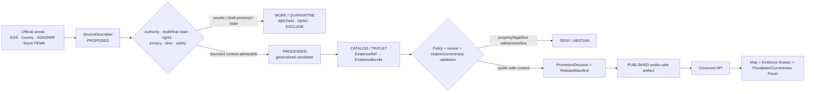
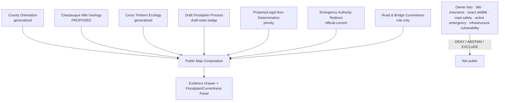
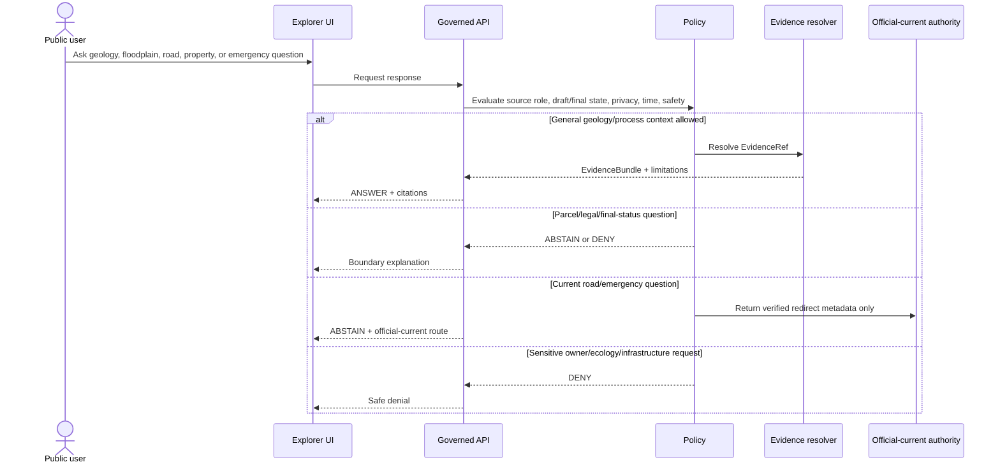
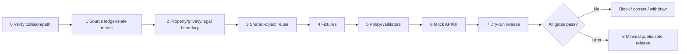

<!-- [KFM_META_BLOCK_V2]
doc_id: NEEDS_VERIFICATION — <REGISTERED_KFM_DOC_ID>
title: Chautauqua County Focus Mode Build Plan — Chautauqua Hills, Draft Floodplain Change, and Emergency/Road Currentness Without Property, Safety, or Operational Conclusions
type: county-focus-mode-build-plan
version: v0.1-draft
status: draft
county: Chautauqua County, Kansas
county_slug: chautauqua
created: 2026-06-08
updated: 2026-06-08
owners:
  - NEEDS_VERIFICATION — <OWNER:focus-mode-steward>
  - NEEDS_VERIFICATION — <OWNER:geology-and-ecology-reviewer>
  - NEEDS_VERIFICATION — <OWNER:floodplain-property-and-legal-reviewer>
  - NEEDS_VERIFICATION — <OWNER:roads-emergency-and-currentness-reviewer>
  - NEEDS_VERIFICATION — <OWNER:privacy-and-public-release-reviewer>
release_status: NEEDS_VERIFICATION — NOT_RELEASED
review_assignments: NEEDS_VERIFICATION
correction_path: NEEDS_VERIFICATION
rollback_path: NEEDS_VERIFICATION
unverified_repository_paths:
  - PROPOSED / CONFLICTED / NEEDS_VERIFICATION — docs/focus-modes/chautauqua-county/build-plan.md
  - PROPOSED / OBSERVED-LEGACY / NEEDS_VERIFICATION — docs/focus-mode/counties/chautauqua_county/chautauqua_county_focus_mode_build_plan.md
schema_contract_policy_homes:
  - PROPOSED / NEEDS_VERIFICATION — contracts/focus_mode/
  - PROPOSED / NEEDS_VERIFICATION — schemas/contracts/v1/focus_mode/
  - PROPOSED / NEEDS_VERIFICATION — policy/runtime/, policy/sensitivity/, policy/rights/, policy/release/
proof_slice: Chautauqua Hills geologic/ecological interpretation paired with 2026 draft floodplain change, road-status, emergency-alert, property, and currentness restraint
primary_public_safe_boundary: KFM may present generalized, time-attributed Chautauqua Hills, Cross Timbers, county-service, and draft floodplain-process context; it must not convert draft floodplain mapping into final legal or insurance truth, expose affected-property or living-person detail, state current road or infrastructure safety, duplicate active emergency alerts, imply site access, publish sensitive ecology precision, or infer present oil-and-gas, environmental-health, or property conclusions.
collision_search:
  completed_register: CONFIRMED — Chautauqua County is absent from the supplied completed/collision register.
  generated_in_continuation: CONFIRMED — Cheyenne, Wallace, Elk, Clay, Stevens, Sherman, Decatur, Butler, Wilson, Franklin, Haskell, Grant, Comanche, Labette, Meade, and Norton were excluded.
  uploaded_project_materials: CONFIRMED — targeted Chautauqua County Focus Mode searches were performed; no Chautauqua County plan surfaced among examined results.
  live_repository_index: CONFIRMED — docs/focus-mode/counties/COUNTY_INDEX.md lists Chautauqua as not-started with validation not-run.
  live_repository_search: CONFIRMED — searches for chautauqua_county_focus_mode_build_plan, Chautauqua County Focus Mode, and chautauqua-county returned no matching county plan.
  exhaustive_absence: NEEDS_VERIFICATION — unindexed branches, private artifacts, and prior unsearched outputs may still exist.
directory_rules_basis:
  - CONFIRMED — attached Directory Rules.pdf was inspected during this series.
  - CONFIRMED — location encodes responsibility, governance, and lifecycle; topic alone does not justify a root folder.
  - CONFIRMED — lifecycle is RAW → WORK / QUARANTINE → PROCESSED → CATALOG / TRIPLET → PUBLISHED.
  - CONFIRMED — promotion is a governed state transition, not a file move.
  - CONFLICTED / NEEDS_VERIFICATION — observed repository paths use docs/focus-mode/ while doctrine also identifies docs/focus-modes/.
official_source_checks:
  - CONFIRMED — Kansas Geological Survey / GeoKansas Chautauqua Hills page, checked 2026-06-08.
  - CONFIRMED — Chautauqua County official homepage, checked 2026-06-08.
  - CONFIRMED — Chautauqua County Floodplain Mapping Project page, checked 2026-06-08.
  - CONFIRMED — Chautauqua County Emergency Alerts page, checked 2026-06-08.
  - CONFIRMED — Chautauqua County Road & Bridge page, checked 2026-06-08.
source_check_date: 2026-06-08
tags: [kfm, focus-mode, chautauqua-county, chautauqua-hills, cross-timbers, floodplain, roads, emergency-alerts, property-privacy, cite-or-abstain]
notes:
  - Planning artifact only; no implementation, source admission, review, promotion, publication, correction readiness, or rollback readiness is claimed.
  - The county’s 2026 floodplain material concerns updated draft mapping and listed affected properties; KFM must not republish personally linked property detail or treat draft mapping as final legal/insurance truth.
  - Road reopenings and emergency alerts are dynamic official-current information and must not be cached into static KFM truth.
[/KFM_META_BLOCK_V2] -->

<a id="top"></a>

# Chautauqua County Focus Mode Build Plan
## Chautauqua Hills, Draft Floodplain Change, and Emergency/Road Currentness Without Property, Safety, or Operational Conclusions

> **Product thesis:** Explain Chautauqua County’s sandstone-capped hills, Cross Timbers setting, county services, and floodplain-change process while refusing to turn KFM into a parcel-title, flood-insurance, road-safety, emergency-alert, site-access, sensitive-ecology, or operational-infrastructure authority.


| Identity / status field | Value |
|---|---|
| County | **Chautauqua County, Kansas** |
| Status | `PROPOSED` planning artifact |
| Distinct proof slice | Chautauqua Hills / Cross Timbers interpretation paired with draft floodplain change, affected-property privacy, road-currentness, and emergency-alert restraint |
| Primary public-safe boundary | **Generalized geology, ecology, and county-process context may be shown; draft floodplain mapping must not become final legal, title, insurance, access, or property-value truth, and dynamic road/emergency information must not become static KFM safety guidance.** |
| Official seeds checked | KGS Chautauqua Hills; county homepage; floodplain mapping project; emergency alerts; Road & Bridge |
| Collision state | No collision surfaced in checked register, repository index/searches, or examined materials |
| Exhaustive absence | `NEEDS_VERIFICATION` |
| Release state | `NOT_RELEASED` |

## Quick links

[Operating posture](#1-operating-posture) · [Why this county](#2-why-this-county) · [Product thesis](#3-product-thesis) · [Scope](#4-scope-boundary) · [Layers](#5-first-demo-layers) · [Journeys](#6-user-journeys) · [UI](#7-ui-surfaces) · [Objects](#8-governed-object-model) · [Repository](#9-proposed-repository-shape) · [Build](#10-build-phases) · [PRs](#11-first-pr-sequence) · [Acceptance](#12-acceptance-checklist) · [Fixtures](#13-fixture-plan) · [Risks](#14-risk-register) · [Sources](#15-source-seed-list) · [Questions](#16-open-verification-questions) · [Milestone](#17-recommended-first-milestone)

---

## Executive build note

Chautauqua County is selected because it combines a strong official geologic story with unusually visible governance hazards around **draft floodplain change, affected-property information, current road status, and active emergency communication**.

The Kansas Geological Survey describes the Chautauqua Hills as a narrow band of sandstone-capped rolling hills formed from Pennsylvanian-age river and delta deposits, with the Verdigris, Fall, and Elk rivers cutting narrow valleys through the region. KGS also identifies the close overlap between the Chautauqua Hills and the Cross Timbers ecosystem of hardwood forest and prairie.[^s1] This supports generalized, public-safe landscape interpretation.

The county homepage, checked during this run, exposed departments including Appraiser, Emergency Management, Health, Road & Bridge, Rural Water, county fire departments, and cemetery districts. It also displayed recent news about a floodplain mapping project, a reopened road, and a new emergency notification system.[^s2] These are authoritative county routing and currentness signals, but they do not make KFM a road-condition, property, flood-insurance, legal, or emergency authority.

The county’s April 2026 floodplain project page states that the Kansas Department of Agriculture presented updated **draft** floodplain maps and that lists of affected properties and owners were attached for comment purposes.[^s3] That is exactly the kind of source KFM must handle conservatively: the process itself may be explained, but person-linked parcel lists, legal effects, insurance implications, final floodplain status, and property-value consequences must not be inferred or republished.

The county emergency-alert page describes a CAPSOL mass-notification system used for missing/endangered-person alerts, road closures, infrastructure emergencies, evacuations, shelter-in-place notifications, and other time-sensitive incidents.[^s4] The Road & Bridge page provides official departmental routing and current news links.[^s5] KFM may direct users to those official-current channels, but it must not cache or independently restate live status.

> [!CAUTION]
> ## Defining public-safe boundary
>
> **KFM may explain the Chautauqua Hills, Cross Timbers, the existence of a draft floodplain-review process, and the roles of county Emergency Management and Road & Bridge. It must not publish affected-property or owner lists, determine whether a parcel is legally in a floodplain, advise on insurance or title, guarantee a road or bridge is open or safe, replicate active alerts, expose sensitive wildlife or infrastructure detail, or imply access to scenic or private land.**

### Evidence boundary

| Label | Established | Not established |
|---|---|---|
| `CONFIRMED` | Chautauqua is absent from the supplied register; live index lists it `not-started` / `not-run`; repository searches found no plan; official KGS and county pages were checked; the 2026 floodplain project was explicitly draft; the county emergency system and Road & Bridge routes were verified. | — |
| `PROPOSED` | All cards, layers, object candidates, fixtures, paths, policies, UI, milestone, correction, and release steps. | No implementation is claimed. |
| `NEEDS_VERIFICATION` | Exhaustive collision absence; canonical path; source rights; authoritative released floodplain status; parcel privacy policy; ecology geoprivacy; road/alert expiry contracts; shared schemas/contracts/policies; correction and rollback implementation. | — |
| `UNKNOWN` | Present road status, active emergency conditions, final floodplain adoption, parcel-level legal/insurance effects, current property ownership, sensitive ecological locations, current infrastructure condition, and deployed runtime state. | — |

---

# 1. Operating posture

## 1.1 Governing rules applied to Chautauqua County

| KFM rule | County application |
|---|---|
| EvidenceBundle outranks generated language | AI cannot turn draft maps, county news, or KGS interpretation into parcel, legal, safety, or emergency truth. |
| Cite-or-abstain | Generalized landscape and agency-role context may answer; property, road, alert, legal, and sensitive-ecology questions abstain or deny. |
| Public clients use governed interfaces | No direct public path to draft parcel lists, internal GIS, emergency systems, unpublished candidates, or direct model output. |
| Source roles remain distinct | KGS science, KDA/DWR draft floodplain process, county property/road/emergency administration, future FEMA maps, ecology sources, and generated narrative remain separate. |
| Publication is governed | A draft floodplain map, county notice, or road update is not a published KFM layer merely because it is visible. |
| Privacy and sensitivity fail closed | Affected-property lists, owner names, exact sensitive ecology, and operational infrastructure detail are excluded. |
| Currentness fails closed | Road openings, closures, evacuations, shelters, and emergency alerts require official-current authority and expiry. |
| Legal and insurance nondetermination | KFM does not determine title, flood-insurance obligations, access rights, zoning, compensation, or liability. |

## 1.2 Truth labels and finite outcomes

| Token | Meaning |
|---|---|
| `CONFIRMED` | Verified in this run. |
| `PROPOSED` | Design not verified in implementation. |
| `NEEDS_VERIFICATION` | Checkable before action. |
| `UNKNOWN` | Unsupported or unresolved. |
| `ANSWER` | Narrow, evidence-supported public-safe context. |
| `ABSTAIN` | Authority, currency, rights, or fitness is insufficient. |
| `DENY` | Request crosses privacy, legal, sensitive-location, or safety boundaries. |
| `ERROR` | Contract, evidence, policy, or runtime failure. |

## 1.3 Public trust membrane



## 1.4 County-specific guardrails

| Guardrail | Outcome | Candidate reason code |
|---|---:|---|
| Draft floodplain map treated as final | `ABSTAIN` | `DRAFT_FLOODPLAIN_NOT_FINAL_AUTHORITY` |
| Parcel/owner/title/access inference | `DENY` | `PROPERTY_OR_TITLE_DETERMINATION_DENIED` |
| Flood-insurance, zoning, liability, or legal conclusion | `ABSTAIN` | `FLOODPLAIN_LEGAL_OR_INSURANCE_DETERMINATION_NOT_PROVIDED` |
| Current road/bridge open-safe-passable judgment | `ABSTAIN` | `CURRENT_ROAD_OR_BRIDGE_STATUS_REQUIRES_AUTHORITY` |
| Active alert, evacuation, shelter, or emergency guidance | `ABSTAIN` | `OFFICIAL_CURRENT_EMERGENCY_CHANNEL_REQUIRED` |
| Sensitive wildlife, habitat, or rare-species precision | `DENY` | `SENSITIVE_ECOLOGY_DETAIL_NOT_ADMITTED` |
| Scenic/private-land access implication | `DENY` / `ABSTAIN` | `SCENIC_CONTEXT_NOT_ACCESS_PERMISSION` |
| Infrastructure vulnerability or tactical detail | `DENY` | `OPERATIONAL_INFRASTRUCTURE_DETAIL_WITHHELD` |

---

# 2. Why this county

## 2.1 Collision screen

| Check | Result | Status |
|---|---|---:|
| Supplied register | Chautauqua absent. | `CONFIRMED` |
| Generated counties in continuation | Excluded. | `CONFIRMED` |
| Live county index | Chautauqua `not-started`, `not-run`. | `CONFIRMED` |
| Repository search | No Chautauqua plan identifier match. | `CONFIRMED` |
| Uploaded/project-material search | No Chautauqua plan surfaced among examined results. | `CONFIRMED` for performed search |
| Exhaustive absence | Not proved across all unindexed/private material. | `NEEDS_VERIFICATION` |

## 2.2 Proof-slice rationale

| Dimension | Proof value | Basis |
|---|---|---|
| Geology | Sandstone-capped Pennsylvanian hills and narrow river valleys provide a strong map-first landscape story. | KGS.[^s1] |
| Ecology | Cross Timbers forest-prairie overlap adds habitat context and sensitivity obligations. | KGS.[^s1] |
| Floodplain governance | 2026 county material explicitly describes updated draft maps and affected-property review. | County floodplain page.[^s3] |
| Privacy/property | Attached affected-property/owner lists create direct minimization and nonpublication challenges. | County page.[^s3] |
| Road currentness | County homepage and Road & Bridge page expose reopening/current news. | County pages.[^s2][^s5] |
| Emergency currentness | CAPSOL supports road closure, infrastructure emergency, evacuation, shelter-in-place, and other alerts. | County emergency page.[^s4] |
| Distinctness | Tests draft-to-final state discipline, property minimization, and dynamic county operations in one proof slice. | `PROPOSED`. |

## 2.3 Distinct series contribution

Chautauqua County tests whether KFM can:

1. explain a geologic/ecological region without exposing sensitive ecology or implying land access;
2. represent a **draft** floodplain process without silently promoting it to final truth;
3. avoid republishing person-linked property impact lists;
4. distinguish county road and emergency routing from current KFM status;
5. preserve legal, insurance, title, and property-value nondetermination.

## 2.4 Public benefit

A future public-safe product could help users understand:

- how sandstone and erosion formed the Chautauqua Hills;
- why the Cross Timbers ecosystem aligns with that geology;
- what a draft floodplain review process is;
- why affected-property lists and owner details are not public KFM map content;
- how to reach official county road and emergency channels without treating KFM as the authority.

---

# 3. Product thesis

## 3.1 One-sentence thesis

> **Chautauqua County Focus Mode should connect geology, ecology, floodplain-process literacy, and county current-authority routing while making draft-to-final, property, privacy, road-safety, emergency, access, and sensitive-ecology boundaries visible and enforceable.**

## 3.2 First-product promises

| Promise | Meaning |
|---|---|
| Generalized landscape interpretation | KGS-backed geology/ecology with evidence visibility. |
| Draft-state literacy | Floodplain material is labelled draft and process-bound. |
| Property minimization | No owner/person-linked property lists in public output. |
| Currentness literacy | Road and alert information expires or redirects. |
| Finite outcomes | Context answers; high-stakes requests abstain or deny. |
| Reversibility | Correction and rollback precede publication. |

## 3.3 Non-promises

- no final parcel floodplain determination from draft mapping;
- no title, ownership, access, value, insurance, zoning, compensation, or legal advice;
- no current road/bridge safety or passability assurance;
- no active emergency, evacuation, or shelter guidance;
- no exact sensitive ecology or infrastructure detail;
- no scenic/private-land access permission;
- no implementation or publication claim.

---

# 4. Scope boundary

| Content family | Posture | Boundary |
|---|---:|---|
| County/Sedan orientation | `PROPOSED` | Generalized geometry only. |
| Chautauqua Hills geology card | `PROPOSED` | Scientific context only. |
| Cross Timbers ecology card | `PROPOSED` generalized / `DEFER` detail | No sensitive species precision. |
| Draft Floodplain Process Card | `PROPOSED` priority | Process and draft state only. |
| Property/Legal Non-Determination Notice | `PROPOSED` priority | No owner/title/insurance/legal inference. |
| Emergency Alerts Authority Card | `PROPOSED` | Redirect-only. |
| Road & Bridge Currentness Card | `PROPOSED` | Role and redirect; no safety verdict. |
| Affected-property/owner lists | `EXCLUDE` / `DENY` | Living-person/property minimization. |
| Final floodplain parcel layer | `DEFER` | Requires authoritative final adoption and legal-scope review. |
| Live road/emergency layer | `DEFER` | Requires current feed, expiry, receipts, and rollback. |

---

# 5. First demo layers

## 5.1 Prioritized cards/layers

| Priority | Card/layer | Purpose | Source | Gate | Status |
|---:|---|---|---|---|---:|
| 1 | `DraftFloodplainPropertyCurrentnessBoundaryNotice` | Central trust boundary. | County + policy | Highest-risk fixtures. | `PROPOSED` |
| 2 | `ChautauquaHillsGeologyCard` | Sandstone-capped hills and river-valley explanation. | KGS[^s1] | EvidenceBundle and rights. | `PROPOSED` |
| 3 | `CrossTimbersGeneralizedEcologyCard` | Broad forest-prairie context. | KGS[^s1] | Ecology review and generalization. | `PROPOSED` |
| 4 | `DraftFloodplainProcessCard` | Explains 2026 draft mapping/comment process. | County[^s3] | Draft-state and privacy validators. | `PROPOSED` |
| 5 | `PropertyLegalNonDeterminationNotice` | Prevents title/insurance/legal inference. | Policy + county source | Legal/privacy gate. | `PROPOSED` |
| 6 | `EmergencyAlertsAuthorityCard` | Explains CAPSOL role and official redirect. | County[^s4] | Redirect-only and expiry. | `PROPOSED` |
| 7 | `RoadBridgeCurrentnessCard` | Explains Road & Bridge role and dynamic news. | County[^s5] | No condition/safety inference. | `PROPOSED` |
| 8 | Exact affected-property list | Unsafe public product. | County attachment | Exclude. | `DENY` |
| 9 | Live road/emergency status | High-risk dynamic. | Future governed feed | Not first slice. | `DEFER` |

## 5.2 Map composition



## 5.3 Layer-card truth contract

| Field | Purpose | Failure posture |
|---|---|---|
| `source_role` | Separates KGS, draft mapping authority, county administration, final flood authority, emergency, and AI. | `ABSTAIN`. |
| `publication_state` | Distinguishes draft, proposed, final, superseded. | Suppress if ambiguous. |
| `temporal_basis` | Exposes checked date/currentness. | `ABSTAIN` for current requests. |
| `expiry_at` | Required for road/emergency status. | Suppress if missing/expired. |
| `property_privacy` | Prevents owner/person-linked display. | `DENY`. |
| `legal_scope` | Prevents insurance/title/zoning determinations. | `ABSTAIN`. |
| `spatial_generalization` | Prevents sensitive ecology/infrastructure exposure. | `DENY` / quarantine. |
| `evidence_refs` | Claim support. | `ABSTAIN`. |
| `policy_decision_ref` | Finite outcome obligations. | Fail closed. |
| `release_state` | Prevents draft from appearing released. | Public alias blocked. |

---

# 6. User journeys

## 6.1 Public learning journeys

| Journey | Safe outcome |
|---|---|
| “What are the Chautauqua Hills?” | KGS-backed generalized geology explanation. |
| “Why does the Cross Timbers occur here?” | Broad geology/ecology relationship. |
| “What does the 2026 floodplain project mean?” | Process explanation with draft-state warning. |
| “Why are affected owners not shown?” | Privacy and legal-boundary explanation. |
| “Where do I get current road or emergency information?” | Official county redirect. |

## 6.2 Trust-demonstration journeys

| Request | Outcome |
|---|---:|
| “Is my parcel definitely in the floodplain?” | `ABSTAIN` |
| “Will my insurance cost rise?” | `ABSTAIN` |
| “Who owns the affected parcels?” | `DENY` |
| “Is Road 25 open and safe now?” | `ABSTAIN` |
| “Is an evacuation underway?” | `ABSTAIN` |
| “Show exact rare-species locations.” | `DENY` |
| “Can I enter this scenic property?” | `DENY` / `ABSTAIN` |

## 6.3 Candidate reason codes

- `DRAFT_FLOODPLAIN_NOT_FINAL_AUTHORITY`
- `PROPERTY_OR_TITLE_DETERMINATION_DENIED`
- `FLOODPLAIN_LEGAL_OR_INSURANCE_DETERMINATION_NOT_PROVIDED`
- `CURRENT_ROAD_OR_BRIDGE_STATUS_REQUIRES_AUTHORITY`
- `OFFICIAL_CURRENT_EMERGENCY_CHANNEL_REQUIRED`
- `SENSITIVE_ECOLOGY_DETAIL_NOT_ADMITTED`
- `SCENIC_CONTEXT_NOT_ACCESS_PERMISSION`
- `OPERATIONAL_INFRASTRUCTURE_DETAIL_WITHHELD`

---

# 7. UI surfaces

| Surface | Chautauqua-specific behavior | Status |
|---|---|---:|
| Header | “Draft floodplain ≠ final property/legal truth; no live road/emergency verdict.” | `PROPOSED` |
| Map canvas | Generalized geology/ecology and process context only. | `PROPOSED` |
| Layer drawer | Source role, draft/final state, date, expiry, privacy, release state. | `PROPOSED` |
| Evidence Drawer | Separates KGS, KDA/DWR process, county administration, emergency, and AI. | `PROPOSED` |
| Answer panel | Stable geology and process literacy. | `PROPOSED` |
| Abstention panel | Parcel floodplain, insurance, road, emergency, current-status requests. | `PROPOSED` |
| Denial panel | Owner/person, sensitive ecology, infrastructure, access requests. | `PROPOSED` |
| Timeline/time-basis panel | Draft mapping and dynamic county notices. | `PROPOSED` |
| **Draft Floodplain / Property / Currentness Panel** | Central trust surface. | `PROPOSED` |
| Correction/release panel | `NOT_RELEASED`, supersession and rollback state. | `PROPOSED` |

## 7.1 Legend vocabulary

| Label | Meaning | Must not become |
|---|---|---|
| `Scientific landscape context` | KGS geology/ecology interpretation. | Access, safety, or property conclusion. |
| `Draft floodplain process` | Proposed mapping under review. | Final legal/FIRM/insurance truth. |
| `County administrative source` | Department/process routing. | Title, owner, value, liability, or legal advice. |
| `Official-current road/emergency source` | Expiring status authority. | Static KFM status. |
| `Sensitive detail withheld` | Privacy/ecology/operations restriction. | Confirmation of hidden data. |
| `Generated explanation` | Bounded synthesis. | Evidence or authority. |

## 7.2 Sequence diagram



---

# 8. Governed object model

## 8.1 Shared object families

| Object family | Chautauqua use | Status |
|---|---|---:|
| `SourceDescriptor` | Authority, role, draft/final state, rights, privacy, currentness. | `PROPOSED / NEEDS_VERIFICATION` |
| `EvidenceRef` | Claim-to-proof link. | `PROPOSED / NEEDS_VERIFICATION` |
| `EvidenceBundle` | Evidence plus legal/privacy/currentness limits. | `PROPOSED / NEEDS_VERIFICATION` |
| `PolicyDecision` | `ANSWER`, `ABSTAIN`, `DENY`, `ERROR`. | `PROPOSED / NEEDS_VERIFICATION` |
| `RuntimeResponseEnvelope` | Public-safe response. | `PROPOSED / NEEDS_VERIFICATION` |
| `CitationValidationReport` | Detects draft-to-final and currentness overclaim. | `PROPOSED / NEEDS_VERIFICATION` |
| `ReleaseManifest` | Approved public composition. | `PROPOSED / NEEDS_VERIFICATION` |
| `AIReceipt` | Generated output/dependencies. | `PROPOSED / NEEDS_VERIFICATION` |
| `ReviewRecord` | Geology, ecology, floodplain, legal, privacy, currentness review. | `PROPOSED / NEEDS_VERIFICATION` |
| `CorrectionNotice` | Corrects stale/superseded/unsafe output. | `PROPOSED / NEEDS_VERIFICATION` |
| `RollbackPlan` | Withdraws unsafe release. | `PROPOSED / NEEDS_VERIFICATION` |

## 8.2 County-specific candidates

- `ChautauquaHillsContextCard`
- `CrossTimbersGeneralizationRecord`
- `DraftFloodplainProcessCard`
- `DraftToFinalAuthorityState`
- `PropertyLegalNonDeterminationNotice`
- `EmergencyAlertRedirectCard`
- `RoadBridgeCurrentnessCard`
- `AffectedPropertyPrivacyPolicyDecision`

## 8.3 Source-role anti-collapse rules

| Source | Valid role | Must not become |
|---|---|---|
| KGS | Scientific geology/ecology context. | Access, property, current hazard, or legal authority. |
| County floodplain notice | Draft-process and public-comment context. | Final floodplain/legal/insurance truth. |
| KDA/DWR project map | Draft technical mapping within stated process. | Title, owner, insurance, compensation, or final FEMA status. |
| County Emergency Management/CAPSOL | Official-current emergency communication. | Static KFM alert. |
| Road & Bridge | Departmental/current routing. | Structural or road-safety guarantee. |
| AI narrative | Bounded explanation. | Evidence, legal opinion, or emergency authority. |

## 8.4 Minimal public response JSON

```json
{
  "schema_version": "v1",
  "object_type": "RuntimeResponseEnvelope",
  "response_id": "kfm.runtime.chautauqua.hills_context.answer.v1",
  "county": "chautauqua",
  "outcome": "ANSWER",
  "answer_scope": "public_safe_generalized_geology_ecology",
  "answer": "Checked Kansas Geological Survey material describes the Chautauqua Hills as a narrow region of sandstone-capped rolling hills formed from Pennsylvanian-age river and delta sediments and closely aligned with the Cross Timbers ecosystem.",
  "evidence_refs": [
    "kfm.evidence_ref.chautauqua.kgs_hills_context.v1"
  ],
  "limitations": [
    "This response does not determine access, property rights, floodplain status, road safety, emergency conditions, or sensitive wildlife locations."
  ],
  "review_state": "NEEDS_VERIFICATION",
  "release_state": "NOT_RELEASED",
  "spec_hash": "NEEDS_VERIFICATION"
}
```

## 8.5 Abstention JSON

```json
{
  "schema_version": "v1",
  "object_type": "RuntimeResponseEnvelope",
  "response_id": "kfm.runtime.chautauqua.floodplain_legal.abstain.v1",
  "county": "chautauqua",
  "outcome": "ABSTAIN",
  "reason_code": "DRAFT_FLOODPLAIN_NOT_FINAL_AUTHORITY",
  "message": "The checked county material describes updated draft floodplain mapping and a public-comment process. KFM does not determine final parcel status, insurance obligations, zoning effects, title, access, value, compensation, or liability from draft mapping.",
  "release_state": "NOT_RELEASED",
  "spec_hash": "NEEDS_VERIFICATION"
}
```

## 8.6 Denial JSON

```json
{
  "schema_version": "v1",
  "object_type": "RuntimeResponseEnvelope",
  "response_id": "kfm.runtime.chautauqua.owner_sensitive_detail.deny.v1",
  "county": "chautauqua",
  "outcome": "DENY",
  "reason_code": "PROPERTY_OR_TITLE_DETERMINATION_DENIED",
  "message": "KFM does not publish affected-property owner lists, living-person linkage, private contact information, title/access determinations, exact sensitive ecology, or infrastructure vulnerability detail.",
  "withheld_fields": [
    "owner_or_living_person_linkage",
    "parcel_title_or_access",
    "private_contact",
    "exact_sensitive_ecology",
    "operational_infrastructure_detail"
  ],
  "release_state": "NOT_RELEASED",
  "spec_hash": "NEEDS_VERIFICATION"
}
```

## 8.7 Deterministic identity candidates

| Item | Pattern |
|---|---|
| Source | `kfm.source.chautauqua.<authority>.<slug>.v1` |
| Evidence | `kfm.evidence_bundle.chautauqua.<claim_scope>.v1` |
| Card | `kfm.card.chautauqua.<card>.v1` |
| Fixture | `kfm.runtime.chautauqua.<scenario>.<outcome>.v1` |
| Release | `kfm.release.chautauqua.focus_mode.v0_1` |

`spec_hash` remains `PROPOSED / NEEDS_VERIFICATION`.

---

# 9. Proposed repository shape

## 9.1 Directory Rules basis

Directory Rules require responsibility-root placement, separate docs/contracts/schemas/policy/fixtures/data/release, no topic-as-root folders, and lifecycle:

`RAW → WORK / QUARANTINE → PROCESSED → CATALOG / TRIPLET → PUBLISHED`.

Promotion is a governed state transition.

> [!WARNING]
> The observed `docs/focus-mode/` versus doctrinal `docs/focus-modes/` divergence remains unresolved. Paths below are `PROPOSED / CONFLICTED / NEEDS_VERIFICATION`.

## 9.2 Candidate paths

| Root | Proposed path | Purpose |
|---|---|---|
| Docs | `docs/focus-modes/chautauqua-county/build-plan.md` | Human plan. |
| Docs companions | `docs/focus-modes/chautauqua-county/{README.md,floodplain-boundary-notes.md,currentness-notes.md,ecology-sensitivity-notes.md,source-seed-list.md,acceptance-checklist.md}` | Governance docs. |
| Contracts | `contracts/focus_mode/` | Shared semantics. |
| Schemas | `schemas/contracts/v1/focus_mode/` | Machine shapes. |
| Fixtures | `fixtures/focus_modes/chautauqua/{valid,invalid}/` | Proof cases. |
| UI | `apps/explorer-web/src/focus-modes/chautauqua/` | Mock governed UI. |
| Catalog | `data/catalog/sources/chautauqua/` | Admitted descriptors. |
| Published | `data/published/layers/chautauqua/` | Future release only. |
| Release | `release/candidates/chautauqua-focus-mode/` | Future candidate only. |

## 9.3 Proposed tree

```text
# PROPOSED / CONFLICTED / NEEDS_VERIFICATION

docs/
└── focus-modes/
    └── chautauqua-county/
        ├── README.md
        ├── build-plan.md
        ├── floodplain-boundary-notes.md
        ├── currentness-notes.md
        ├── ecology-sensitivity-notes.md
        ├── source-seed-list.md
        ├── evidence-model.md
        └── acceptance-checklist.md

fixtures/
└── focus_modes/chautauqua/
    ├── valid/
    └── invalid/

contracts/
└── focus_mode/

schemas/
└── contracts/v1/focus_mode/

apps/
└── explorer-web/src/focus-modes/chautauqua/

data/
├── catalog/sources/chautauqua/
└── published/layers/chautauqua/    # future governed output only

release/
└── candidates/chautauqua-focus-mode/
```

## 9.4 Placement prohibitions

- no root-level `chautauqua/`, `chautauqua-hills/`, `floodplain/`, `road-status/`, or `emergency-alerts/`;
- no owner lists, private contacts, or person-linked parcels in public docs/fixtures;
- no draft maps copied into published truth without final-state review;
- no live road or emergency status frozen without expiry;
- no schema beside instance data;
- no public client access to `RAW`, `WORK`, `QUARANTINE`;
- no release without manifest, review, correction, and rollback.

---

# 10. Build phases

| Phase | Goal | Entry gate | Output | Exit validation | Rollback |
|---:|---|---|---|---|---|
| 0 | Collision/path verification | Repeat checks | Verification note | No collision; path resolved or blocked | Stop |
| 1 | Source ledger and state model | Roles identified | Source/state matrix | Draft/final/current roles explicit | Docs only |
| 2 | Property/privacy/legal boundary | Review framework accepted | Boundary policy candidates | Owner/person/legal details fail closed | Withdraw |
| 3 | Shared-object reuse | Existing objects inspected | Reuse/extension decision | No parallel homes | Revert |
| 4 | Fixtures | Boundary accepted | Valid/invalid pack | Unsafe cases fail closed | Remove |
| 5 | Policy/validators | Fixtures exist | Draft-state/currentness/privacy validators | Finite outcomes tested | Block |
| 6 | Mock API/UI | Contracts/policies agreed | Mock cards and panels | No property/currentness overclaim | Disable |
| 7 | Dry-run release | Reviews/evidence available | Candidate proof pack | No public alias; rollback rehearsed | Withdraw |
| 8 | Optional publication | All gates pass | Minimal generalized release | Traceable and reversible | Rollback |



---

# 11. First PR sequence

1. Verification and documentation control.
2. Source ledger/admission and public-safe boundary.
3. Contracts/schemas or shared-object reuse.
4. Valid and invalid fixtures.
5. Policy and validators.
6. Mock governed API/UI.
7. Dry-run release proof.
8. Only then optional minimal public-safe publication.

**Affected-property list ingestion, person-linked parcel publication, live road/emergency feed integration, sensitive ecology mapping, and public release are not first-PR work.**

---

# 12. Acceptance checklist

## Governance and evidence

- [ ] Collision search rerun.
- [ ] Every public claim resolves to EvidenceBundle.
- [ ] KGS, county, KDA/DWR, future FEMA, emergency, road, ecology, and AI roles remain distinct.
- [ ] Draft/final/current state is explicit.
- [ ] AI output is never evidence.
- [ ] Finite outcomes exist.

## Public-safe boundary

- [ ] Draft floodplain maps never appear final.
- [ ] No affected-property owner/person lists.
- [ ] No title, access, insurance, zoning, liability, value, or compensation conclusion.
- [ ] No current road/bridge safety or passability answer.
- [ ] No active alert, evacuation, or shelter guidance.
- [ ] No exact sensitive ecology or infrastructure detail.
- [ ] No scenic/private-land access implication.

## Product and UI

- [ ] Header states draft/legal/currentness boundary and `NOT_RELEASED`.
- [ ] Draft/final state visible.
- [ ] Evidence Drawer shows source role.
- [ ] Time and expiry visible.
- [ ] Denial/abstention reason codes visible.
- [ ] Official redirects do not masquerade as answers.

## Repository/release

- [ ] Path conflict resolved.
- [ ] No parallel authority homes.
- [ ] Public UI cannot access internal lifecycle stores.
- [ ] Invalid fixtures fail closed.
- [ ] Correction and rollback are actionable.
- [ ] Promotion is governed.

---

# 13. Fixture plan

## 13.1 Valid fixtures

| Fixture | Scenario | Outcome |
|---|---|---:|
| `chautauqua_hills_context.valid.json` | General geology/ecology. | `ANSWER` |
| `draft_floodplain_process.valid.json` | Explain draft process only. | `ANSWER` |
| `parcel_final_status_abstain.valid.json` | User asks final parcel status. | `ABSTAIN` |
| `road_currentness_redirect.valid.json` | User asks if road is open. | `ABSTAIN` |
| `owner_detail_deny.valid.json` | User asks affected owners. | `DENY` |

## 13.2 Invalid/fail-closed fixtures

| Fixture | Failure | Required result |
|---|---|---:|
| `draft_map_as_final_firm.invalid.json` | Draft treated as final authority. | `ABSTAIN` |
| `affected_owner_list_public.invalid.json` | Person-linked property list exposed. | `DENY` |
| `draft_floodplain_as_insurance_advice.invalid.json` | Draft map becomes insurance/legal advice. | `ABSTAIN` |
| `road_reopened_notice_as_current_safe.invalid.json` | Old notice becomes present safety guarantee. | `ABSTAIN` |
| `capsol_page_as_live_alert.invalid.json` | Alert-system description becomes active incident. | `ABSTAIN` |
| `exact_sensitive_species.invalid.json` | Ecology precision exposed. | `DENY` |
| `scenic_context_as_access_permission.invalid.json` | General geology implies access. | `DENY` / `ABSTAIN` |
| `infrastructure_vulnerability.invalid.json` | Tactical infrastructure detail exposed. | `DENY` |
| `unresolved_evidence_ref.invalid.json` | Claim lacks evidence. | `ABSTAIN` |
| `public_internal_store_access.invalid.json` | Public surface reads internal store. | `ERROR` |

## 13.3 Fixture-to-test matrix

| Test family | Must prove |
|---|---|
| Draft/final state | Draft mapping cannot become final truth. |
| Privacy/property | No person-linked property or title inference. |
| Legal/insurance | No advice from draft/process source. |
| Currentness | Old road/emergency notices do not remain current. |
| Ecology/operations | Sensitive precision withheld. |
| Access | Landscape context does not confer permission. |
| Evidence closure | No claim without EvidenceBundle. |
| Trust membrane | No public internal-store access. |

## 13.4 Highest-risk invalid fixture pack

1. draft floodplain map presented as final;
2. affected-property owner list published;
3. draft map converted to insurance/legal conclusion;
4. stale road reopening shown as current safe access;
5. alert-system description shown as an active emergency;
6. exact sensitive ecology shown;
7. scenic context converted to property access;
8. infrastructure vulnerability exposed.

---

# 14. Risk register

| Risk | Likelihood | Impact | Mitigation | Release posture |
|---|---:|---:|---|---|
| Draft floodplain shown as final | High | Critical | State model, banner, validator. | `ABSTAIN` |
| Owner/person-linked parcel detail exposed | High | Critical | Exclude/minimize; deny. | `DENY` |
| Floodplain map becomes insurance/legal advice | High | Critical | Legal non-determination. | `ABSTAIN` |
| Stale road notice shown current | Medium/High | High | Expiry and official redirect. | `ABSTAIN` |
| CAPSOL description becomes live alert | Medium | Critical | Redirect-only; no incident cache. | `ABSTAIN` |
| Sensitive Cross Timbers wildlife exposed | Medium | High | Generalize; ecology review. | `DENY` |
| Scenic context implies private access | Medium | High | Access limitation. | `DENY` / `ABSTAIN` |
| Infrastructure vulnerability exposed | Medium | Critical | Withhold tactical detail. | `DENY` |
| Rights unclear | Medium | High | Rights review. | Quarantine |
| Existing plan later found | Low/Medium | Medium | Repeat collision check. | Stop |
| Path divergence hardens | High | Medium | Resolve before landing. | Docs only |
| Mock mistaken for release | Medium | High | Persistent `NOT_RELEASED`. | Mock only |

---

# 15. Source seed list

## 15.1 Official sources checked in this run

| ID | Source | Role | Verified anchor | Intended use | Allowed claim scope | Limitations | Status |
|---|---|---|---|---|---|---|---:|
| `S1` | Kansas Geological Survey / GeoKansas, **Chautauqua Hills**[^s1] | Scientific geology/ecology interpretation | Sandstone-capped rolling hills, Pennsylvanian depositional origin, river valleys, Cross Timbers overlap. | Generalized landscape cards. | Scientific/regional context. | No access, property, current hazard, sensitive species, or operational conclusion. | `CONFIRMED` |
| `S2` | Chautauqua County official homepage[^s2] | Local administrative/currentness routing | Departments, emergency alerts, floodplain project news, road reopening news, rural water, county services. | County routing and currentness context. | Existence of roles/news at checked time. | No durable road/emergency/property/legal status. | `CONFIRMED` |
| `S3` | Chautauqua County Floodplain Mapping Project[^s3] | Draft floodplain process source | April 2026 updated draft mapping, comment process, changes-since-last-FIRM classes, affected-property lists. | Draft-process and non-determination card. | Process and draft-state context only. | No final legal/insurance/title/access/value conclusion; owner lists excluded. | `CONFIRMED` |
| `S4` | Chautauqua County Emergency Alerts[^s4] | Official-current emergency communication source | CAPSOL used for missing persons, road closures, infrastructure emergencies, evacuations, shelter-in-place, other incidents. | Redirect/authority card. | System role and official-current routing. | No active incident status, copied alert, or KFM protective advice. | `CONFIRMED` |
| `S5` | Chautauqua County Road & Bridge[^s5] | Local public-works/currentness routing source | Department contact, road map, current news links. | Role/currentness card. | Department role and routing only. | No structural, road-safety, open/passable, or liability conclusion. | `CONFIRMED` |

## 15.2 Candidate official sources for later verification

| Candidate | Potential use | Required verification |
|---|---|---|
| Kansas Department of Agriculture Division of Water Resources project map | Draft/final floodplain process. | Final-state semantics, rights, geometry, privacy, expiry. |
| FEMA Map Service Center / National Flood Hazard Layer | Final adopted flood context. | Effective map date, legal limitations, rights, no insurance advice. |
| KDWP / FWS ecology sources | Cross Timbers habitat context. | Geoprivacy, rare-species sensitivity, seasonality, rights. |
| KDOT / county official status sources | Road redirects. | Currentness, expiry, no safety guarantee. |
| NWS Wichita/Tulsa jurisdictional sources | Current weather/hazard redirects. | Geographic fit, expiry, no KFM warning interpretation. |
| KCC/KGS oil and gas sources | General resource-history context only. | Operational sensitivity, currentness, no exact vulnerability detail. |

## 15.3 Source admission checklist

- [ ] Assign source role.
- [ ] Record draft/final/current state.
- [ ] Record checked date and expiry.
- [ ] Verify rights and derivative display.
- [ ] Remove or quarantine owner/person-linked data.
- [ ] Define legal/insurance/property limitations.
- [ ] Define ecology and infrastructure generalization.
- [ ] Resolve EvidenceRef to EvidenceBundle.
- [ ] Run invalid fixture pack.
- [ ] Require correction and rollback before release.

---

# 16. Open verification questions

## Repository and collision

- [ ] Does any Chautauqua plan exist in another branch/private artifact?
- [ ] Which Focus Mode path is canonical?
- [ ] What validator updates the county index?
- [ ] What evidence changes `not-started` to `draft`?

## Floodplain authority and property

- [ ] What is the current project state after the May 2026 comment deadline?
- [ ] Which map is authoritative and effective now?
- [ ] What parcel fields must be excluded?
- [ ] Can KFM link to the official map without ingesting it?
- [ ] What legal/insurance disclaimer is required?

## Currentness and safety

- [ ] What expiry applies to road reopenings and CAPSOL alerts?
- [ ] Can alerts be linked only, or safely ingested?
- [ ] Which current weather authority covers each part of the county?
- [ ] How are stale statuses suppressed and audited?

## Ecology, rights, and review

- [ ] What KGS assets may be reused?
- [ ] What Cross Timbers ecological details require generalization?
- [ ] Are rare species, roosts, nests, or sensitive habitat implicated?
- [ ] Which reviewer approves infrastructure/currentness boundaries?

## Correction and rollback

- [ ] How is a superseded draft floodplain card corrected?
- [ ] What rollback removes owner-linked or stale status output?
- [ ] What proof demonstrates hidden property and ecological detail cannot be reconstructed?
- [ ] What release separation of duties is required?

---

# 17. Recommended first milestone

## Milestone 1 — Chautauqua Draft-State, Property, and Currentness Control Plane

### Milestone statement

> Establish a documentation-and-fixture-first Chautauqua County proof slice that can explain generalized Chautauqua Hills/Cross Timbers context and the existence of a draft floodplain-review process while making draft-to-final promotion, owner/person linkage, legal/insurance inference, road/emergency currentness, sensitive ecology, access, and infrastructure-detail claims fail closed.

### Deliverables

| Deliverable | Status |
|---|---:|
| Collision/path verification note | `PROPOSED` |
| Source-role and draft/final/current-state matrix | `PROPOSED` |
| Draft Floodplain / Property / Currentness Boundary Notice | `PROPOSED` |
| Shared-object reuse decision | `PROPOSED` |
| Valid/invalid fixture pack | `PROPOSED` |
| Mock finite-outcome UI/API examples | `PROPOSED` |
| Correction/rollback draft | `PROPOSED` |

### Definition of done

- [ ] Collision checks rerun.
- [ ] Path conflict resolved or blocks landing.
- [ ] Draft/final/current state is machine-visible.
- [ ] Owner/person-linked lists are excluded.
- [ ] Legal/insurance/title/access conclusions fail closed.
- [ ] Road/emergency statuses require expiry and official authority.
- [ ] Sensitive ecology/infrastructure detail is denied or generalized.
- [ ] No implementation, review completion, promotion, or publication claim is made.

### Go / no-go table

| Decision | Required evidence | If absent |
|---|---|---|
| GO to docs PR | No collision, path authorized, source/state matrix drafted. | No landing. |
| GO to fixtures/policy | Shared homes verified and reason codes accepted. | Docs only. |
| GO to mock UI/API | Invalid fixtures prove fail-closed outcomes. | No mock. |
| GO to dry-run release | Rights, reviews, evidence, expiry, correction, rollback drafted. | No candidate. |
| GO to publication | Governed promotion and all gates complete. | `NOT_RELEASED`. |

---

# Appendix A — Public-safe narrative skeleton

## A.1 Landing narrative

**Chautauqua County: sandstone hills, Cross Timbers, and visible draft/currentness boundaries**

The Chautauqua Hills provide a compelling landscape story, while the county’s floodplain, road, and emergency sources demonstrate why status, privacy, and legal meaning must remain explicit.

## A.2 Floodplain narrative

The checked 2026 county source describes updated **draft** floodplain mapping and a public-comment process. KFM may explain that process but cannot determine final parcel status, insurance requirements, title, access, value, zoning, liability, or compensation.

## A.3 Currentness narrative

Road reopenings and emergency alerts can change quickly. KFM must either use a governed expiring official-current interface or abstain and redirect.

## A.4 Evidence Drawer narrative

Each card should expose:

- authority and source role;
- draft/final/current state;
- checked date and expiry;
- privacy and legal scope;
- ecological/infrastructure generalization;
- release, correction, and rollback state.

---

# Appendix B — Required negative-path reason-code categories

| Category | Code | Outcome |
|---|---|---:|
| Draft floodplain | `DRAFT_FLOODPLAIN_NOT_FINAL_AUTHORITY` | `ABSTAIN` |
| Property/title | `PROPERTY_OR_TITLE_DETERMINATION_DENIED` | `DENY` |
| Legal/insurance | `FLOODPLAIN_LEGAL_OR_INSURANCE_DETERMINATION_NOT_PROVIDED` | `ABSTAIN` |
| Road/bridge currentness | `CURRENT_ROAD_OR_BRIDGE_STATUS_REQUIRES_AUTHORITY` | `ABSTAIN` |
| Emergency currentness | `OFFICIAL_CURRENT_EMERGENCY_CHANNEL_REQUIRED` | `ABSTAIN` |
| Sensitive ecology | `SENSITIVE_ECOLOGY_DETAIL_NOT_ADMITTED` | `DENY` |
| Access | `SCENIC_CONTEXT_NOT_ACCESS_PERMISSION` | `DENY` / `ABSTAIN` |
| Infrastructure | `OPERATIONAL_INFRASTRUCTURE_DETAIL_WITHHELD` | `DENY` |
| Evidence | `EVIDENCE_BUNDLE_UNRESOLVED` | `ABSTAIN` |
| AI misuse | `AI_NOT_EVIDENCE` | `ERROR` |
| Trust membrane | `PUBLIC_INTERNAL_LIFECYCLE_ACCESS` | `ERROR` |

---

# Appendix C — References and evidence-use note

[^s1]: Kansas Geological Survey / GeoKansas, **Chautauqua Hills**. Checked 2026-06-08. <https://geokansas.ku.edu/chautauqua-hills>. Used for generalized scientific geology and Cross Timbers context only.

[^s2]: Chautauqua County, Kansas, **Official Website**. Checked 2026-06-08. <https://www.chautauquacountyks.com/>. Used for official county routing, department, news, road, emergency, and floodplain-project context only.

[^s3]: Chautauqua County, Kansas, **Chautauqua County Floodplain Mapping Project**. Checked 2026-06-08. <https://www.chautauquacountyks.com/home/news/chautauqua-county-floodplain-mapping-project>. Used for the April 2026 updated draft mapping and comment-process context. Affected-property and owner lists are excluded from public KFM use.

[^s4]: Chautauqua County, Kansas, **Emergency Alerts**. Checked 2026-06-08. <https://www.chautauquacountyks.com/emergency-management/pages/emergency-alerts>. Used for CAPSOL official-current emergency-routing context only.

[^s5]: Chautauqua County, Kansas, **Road & Bridge**. Checked 2026-06-08. <https://www.chautauquacountyks.com/road-bridge>. Used for departmental role and current-routing context only.

## Evidence-use note

This artifact is not an EvidenceBundle, effective flood map, title opinion, insurance determination, road inspection, emergency alert, ecological survey, property record, release manifest, or published product.

[Back to top](#top)
